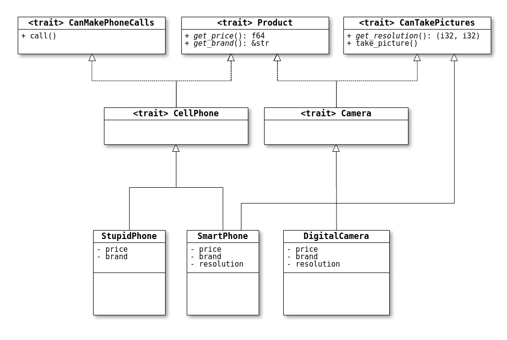
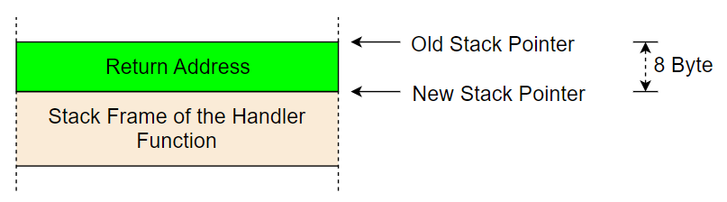
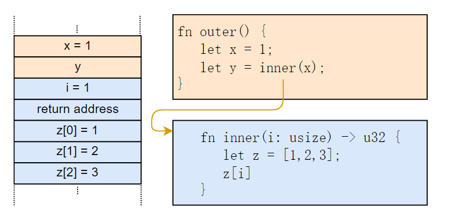
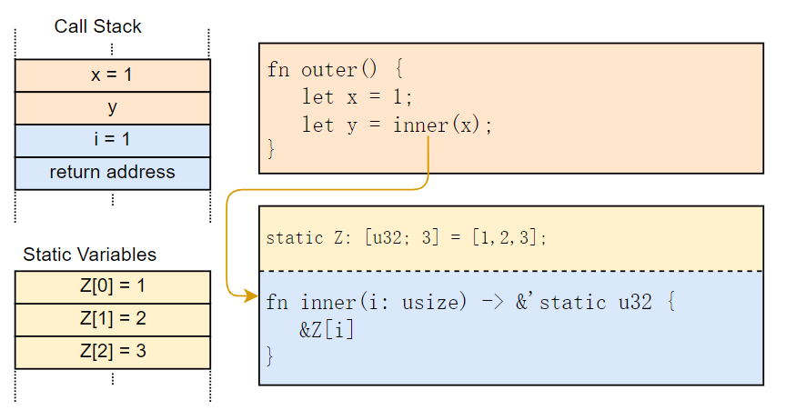
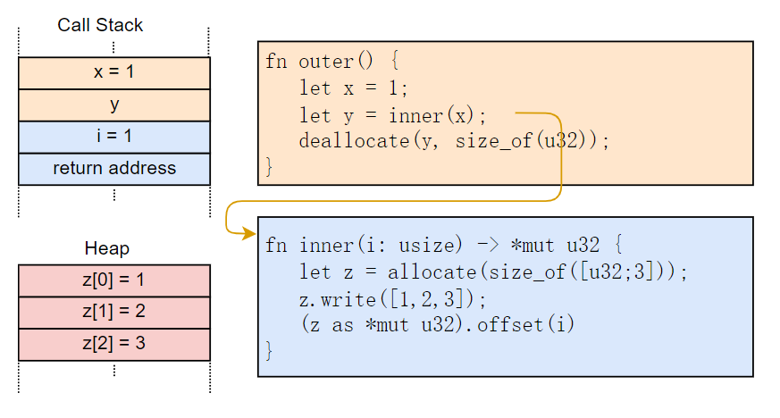
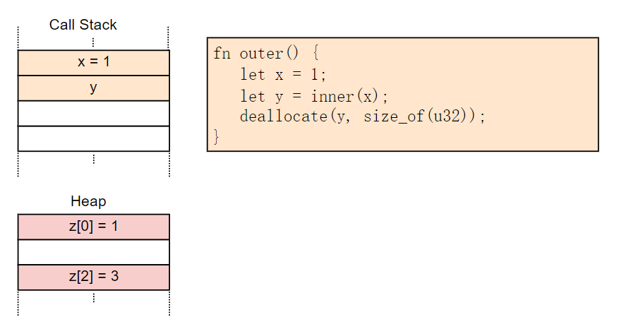

# RUST 安装

Windows 下配置 Linux 的 RUST 环境时可以使用  `MSYS2` ，安装 RUST 时使用 Linux 的安装方式。但是 host triple 的部份，输入「x86_64-pc-windows-gnu」，也就是我们的 Rust 编译器缺省使用的目标 (target) 名称。在命令提示字符中输入「rustup」和「cargo」指令来确认 Windows 操作系统的 Rust 开发环境是否安装且设置成功。如果有设置成功，指令才会存在。如果没有自动添加环境变量需要手动编辑 [.bashrc] 文件，与 WSL 类似。如果安装的时候选了默认开发环境需要安装 windows-gnu 版的，使用命令 [rustup target add x86_64-pc-windows-gnu] 进行安装。最后在 MSYS2 的终端机中编辑 `C:\Users\lenovo\.cargo\config` 文件，添加以下内容：

```tex
[target.x86_64-pc-windows-gnu]
linker = "C:\\msys64\\mingw64\\bin\\gcc.exe"
ar = "C:\\msys64\\mingw64\\bin\\ar.exe"
```

>   ```bash
>   curl --proto '=https' --tlsv1.2 -sSf https://sh.rustup.rs | sh
>   ```

>   GNU 是一个 Unix-like 的操作系统，经常与 Linux 内核搭配在一起 (GNU/Linux 即为一般我们所说的「Linux 操作系统」)。有许多软件开发的程序都是运作在 GNU 的环境中，无法直接在 Windows 操作系统中使用，就得依靠如 Cygwin 和 MinGW(Minimalist GNU for Windows) 等软件在 Windows 操作系统中，创建出 GNU 程序的开发环境。严格来说，Cygwin 和 MinGW 并不是同一个范围的东西，Cygwin 仿真出 POSIX 环境，能够编译并运行大部分的 Unix-like 程序。而 MinGW 只是用来编译能在 Windows 操作系统中运行的程序的工具链 (toolchain) 而已，跟 MSVC 才是同个范围的。由于 Windows 内置的命令提示字符 (cmd) 功能实在是太烂，因此 MinGW 也有自己的一套文本命令工具，那就是「MSYS」(Minimal SYStem)。
>
>   MSYS 其实也是从 Cygwin 改版过来的，但它更在乎与 GNU 相关的事物，也因此没有如 Cygwin 那样肥大的缺点。而因为 MSYS 的长期停止更新，MSYS2 后来便出现了。MSYS2 继承了 MSYS 的理念，集成了 32 比特和 64 比特的 MinGW，并使用「pacman」来管理套件，让原本没有什么扩充能力的 MSYS，也可以自由且迅速地安装各式各样的套件了。
>
>   MSYS2 的官方网站：
>
>   >   https://www.msys2.org/
>
>   MSYS2 的安装程序并没有自带 MinGW，如果要使用 MinGW 的话，可以在终端机运行以下指令：
>
>   >   pacman -S mingw-w64-x86_64-toolchain

### 安装

>   *rustup 是安装和管理 **Rust 构建版本**的工具。* *rustup 用于管理不同平台下的 Rust 构建版本并使其互相兼容， 支持安装由 Beta 和 Nightly 频道发布的版本，并支持其他用于交叉编译的编译版本*
>   *cargo 是 rust 的**包管理器和构建系统工具****。它将常用命令集于一身，无需引入其它命令。*
>
>   *rustup 程序是 rust 的安装程序，也是他的版本管理程序，类似于 Python 的 Anaconda 发行版的 conda 工具，非常方便使用管理。cargo 是 rust 的构建工具，暂不介绍，需要明白的是：rustup 是管理语言自身的，cargo 是管理第三方拓展的。*

官方提供的安装程序界面：

```toml
Welcome to Rust!

This will download and install the official compiler for the Rust
programming language, and its package manager, Cargo.

Rustup metadata and toolchains will be installed into the Rustup
home directory, located at:

  C:\Users\lenovo\.rustup

This can be modified with the RUSTUP_HOME environment variable.

The Cargo home directory located at:

  C:\Users\lenovo\.cargo

This can be modified with the CARGO_HOME environment variable.

The cargo, rustc, rustup and other commands will be added to
Cargo's bin directory, located at:

  C:\Users\lenovo\.cargo\bin

This path will then be added to your PATH environment variable by
modifying the HKEY_CURRENT_USER/Environment/PATH registry key.

You can uninstall at any time with rustup self uninstall and
these changes will be reverted.

Current installation options:


   default host triple: x86_64-pc-windows-msvc
     default toolchain: stable (default)	# 默认安装 stable 版
               profile: default
  modify PATH variable: yes					# 自动修改环境变量

1) Proceed with installation (default)
2) Customize installation
3) Cancel installation
```


**配置 PATH 环境变量**
在 Rust 开发环境中，所有工具都安装在 ~/.cargo/bin 目录中，您可以在这里找到包括 rustc、cargo 和 rustup 在内的 Rust 工具链。

Rust 开发者通常会将该目录加入 PATH 环境变量中。在安装过程中，rustup 会尝试配置 PATH。 由于不同平台、命令行 Shell 之间存在差异，rustup 中也可能存在 Bug，因此在终端重启或用户重新登录之前，rustup 对 PATH 的修改可能不会生效，甚至完全无效。

如果安装后在终端尝试执行 rustc --version 失败，那么，以上内容就是最可能的原因。

**安装指定版本**
运行命令行：win+R，输入 cmd
输入

```powershell
rustup install 版本号
```

### VScode 调试


```json
{ 
    "version": "2.0.0", 
    "tasks": [ 
        { 
            "label": "build", 
            "type": "shell", 
            "command":"cargo", 
            "args": ["build"] 
        } 
    ] 
}
```

windows

```json
{ 
    "version": "0.2.0", 
    "configurations": [ 
        { 
            "name": "(Windows) 启动", 
            "preLaunchTask": "build", 
            "type": "cppvsdbg", 
            "request": "launch", 
            "program": "${workspaceFolder}/target/debug/${workspaceFolderBasename}.exe", 
            "args": [], 
            "stopAtEntry": false, 
            "cwd": "${workspaceFolder}", 
            "environment": [], 
            "externalConsole": false 
        }, 
        { 
            "name": "(gdb) 启动", 
            "type": "cppdbg", 
            "request": "launch", 
            "program": "${workspaceFolder}/target/debug/${workspaceFolderBasename}.exe", 
            "args": [], 
            "stopAtEntry": false, 
            "cwd": "${workspaceFolder}", 
            "environment": [], 
            "externalConsole": false, 
            "MIMode": "gdb", 
            "miDebuggerPath": "这里填 GDB 所在的目录", 
            "setupCommands": [ 
                { 
                    "description": "为 gdb 启用整齐打印", 
                    "text": "-enable-pretty-printing", 
                    "ignoreFailures": true 
                } 
            ] 
        } 
    ] 
}
```

linux

```json
{
    "version": "0.2.0",
    "configurations": [
        {
            "name": "Debug",
            "type": "gdb",
            "preLaunchTask": "build",
            "request": "launch",
            "target": "${workspaceFolder}/target/debug/${workspaceFolderBasename}",
            "cwd": "${workspaceFolder}"
        }
    ]
}
```


### 卸载

由于使用安装器 ，卸载 Rust 环境很简单：
运行命令行：win+R，输入 cmd
输入

```powershell
rustup self uninstall
```

### 更新

运行命令行：win+R，输入 cmd
输入

```powershell
# 更新到目前最新版本
rustup update
# 更新到指定版本号
rustup update _version_number_xxx
```

不指定版本号命令会对 toolchain 的所有版本（stable，nightly，beta）的 rust 更新，如果只安装了其中一个，则只会更新一个。


### RUST 镜像源切换

研究 Rust 时，由于众所周知的原因，发现拉取 crates.io 仓库代码实在太慢，cargo 安装下载更新慢的简直让人无法容忍，很多次超时导致引用库没法编译，就把它的更新下载源给替换了，这里可以切到国内镜像 (中科大镜像源)，配置如下：

找到当前用户目录下 .cargo/ 的.cargo 文件夹，进入.cargo 当前目录，在当前目下创建 config 文件

打开 config 文件，编写以下内容：

```toml
[source.crates-io]
registry = “https://github.com/rust-lang/crates.io-index”
replace-with = ‘ustc’
[source.ustc]
registry = “https://mirrors.ustc.edu.cn/crates.io-index”
```

如果所处的环境中允许使用 git 协议，可以把上述地址改为：

>   registry = “git://mirrors.ustc.edu.cn/crates.io-index”


###  版本切换

Rust 有 **stable|beta|nightly** 三个版本

 **toolchain**：当做版本来认知，方便管理

>   rustup help toolchain

**override** ：切换工作目录的 Rust 环境

>   rustup help override


#### 查看已安装版本

```powershell
rustup toolchain list
```

#### 切换到特定版本

```powershell
rustup default stable/nightly/beta
```

**切换全局 Rust 环境**：defalut

```powershell
rustup default version
# 若 version 为 nightly，则转为 nightly
# 若 version 指定 stable，则切换为 stable
```

若计算机中为安装 nightly 或 stable，执行命令是将自动下载对应版本

**切换工作目录的 Rust 环境**：override
在对应的工作目录打开命令行，如下输入命令：

```powershell
rustup override set version
# version:stable/nightly/beta
```

**切换工作目录的 rust 环境为全局默认环境**：
`rustup override unset`

```powershell
PS D:\workspace\rustwp> rustup override unset 
info: override toolchain for 'D:\workspace\rustwp' removed
```


# RUST 基础

>   https://magiclen.org/category/rust/

## concepts 基础概念

>   -   cargo clippy: 类似 eslint，lint 工具检查代码可以优化的地方
>   -   cargo fmt: 类似 go fmt，代码格式化
>   -   cargo tree: 查看第三方库的版本和依赖关系
>   -   cargo bench: 运行 benchmark(基准测试, 性能测试)
>   -   cargo udeps(第三方): 检查项目中未使用的依赖
>   -    **cargo build/run --release** 使用 release 编译会比默认的 debug 编译性能提升 10 倍以上，但是 release 缺点是编译速度较慢，而且不会显示 panic backtrace 的具体行号


`rust`语言中`=>`是 “匹配准备语法的部分” , `->` 表明的是函数的返回值类型


-   以单纯的下划线 `_` 接收的变量会在当前语句结束后立即被 drop 掉 (不会等到走出当前代码块)
-   以下划线开头形如 `_var` 的变量，生命周期跟普通变量的生命周期规则一致

-   然而例外就是 while let，if let，match 语句，它们在自己的作用域内一直持有临时变量，哪怕是像单个下划线 `_` 这种匿名变量


### 变量

使用`let`声明出来的变量是不可变的，如果要让变量可变，需要加上`mut`关键字。这样的设计习惯虽然和其它语言差异蛮大，但也是有它的优点在，如果变量缺省被声明出来后就可以一直被改变的话，我们很容易就会不小心改掉某个重要变量的值而导致程序运行结果有误，通常发生这样的情况后，会需要不少的时间才能找出问题所在，然而 Rust 编程语言这样的设计习惯却能在撰写代码的阶段就已经大大地减少这个情况发生的可能性了。

但所谓的「不可变的变量」，究竟是指「变量本身保存的值」不会改变，还是「变量保存的值本身」不会改变呢？

来做一个小实验，程序如下：

```rust
fn main() {
    let s1 = String::new();
    let mut s2 = String::new();
    s1.push_str("s1");		// Error
    s2.push_str("s2");
    println!("{}", s1);
    println!("{}", s2);
    s1 = String::from("Hello");
    s2 = String::from("Hi");	// Error
    println!("{}", s1);
    println!("{}", s2);
}
```

注意程序第 4 行和第 9 行，我们分别对没有使用`mut`的`s1`变量的值和`s1`变量本身所保存的值进行修改的动作，程序第 4 行和第 9 行都是无法通过编译的！也就是说「不可变的变量」，「变量本身保存的值」不会改变，且「变量保存的值本身」也不会改变。若将`s1`变量加上`mut`关键字来声明，程序即可通过编译。

「不可变的变量」不就跟常数 (constant) 是一样吗？虽然它们看起来都是值不可以改变的名称，但还是有一些差异。在 Rust 编程语言中，提供了`const`关键字来声明常数，与用`let`声明变量不同的是，`const`不允许加上`mut`关键字来让常数变成可变的，因为「可变的常数」就根本不是常数了嘛！再来就是`const`声明常数时，必须要明确地给出常数的类型，因为常数的值在 Rust 程序的编译阶段时，就需要确定下来了，换句话说，常数也无法保存程序运行阶段才能得到的数据。常数可以被声明在任何的 scope，包含全域的 scope，且名称习惯都使用大写字母，并使用底线区隔不同的单字。例如：

```rust
const MAX_POINTS: u32 = 100000;
```

常数存在的目的是要让代码更容易维护，利用常数来表示代码之后可能会更动的设置值是很常见的用法。上一章提到的变量「屏蔽」(shadowing)，常数并没有这种特性，如果在同一个程序 scope 下，声明了相同名称的常数，程序就会编译错误。

有关于变量「屏蔽」，举个一般的例子：

```rust
fn main() {
    let x = 5;
 
    let x = x + 1;
 
    let x = x * 2;
 
    println!("The value of x is: {}", x);
}
```

以上程序第 4 行和第 6 行，由于重复使用`x`这个名称声明变量，因此发生「屏蔽」。由于等号右边会比左边先运行，因此第 4 行等号右边的`x`变量为第 2 行声明的`x`变量，所以要进行`5 + 1`这个运算，并将结果`6`指派给第 4 行声明出来的`x`变量保存。同理，第 6 行等号右边的`x`变量为第 4 行声明的`x`变量，所以要进行`6 * 2`这个运算，并将结果`12`指派给第 6 行声明出来的`x`变量保存。所以最后程序会输出：

> The value of x is: 12

变量只需相同名称即可「屏蔽」，因为其实就是再声明出一个新的变量来用了，所以就算类型不同也可以。举例来说：

```rust
fn main() {
    let spaces = "   ";
 
    let spaces = spaces.len();
}
```

以上程序第 4 行，由于重复使用`spaces`这个名称声明变量，因此发生「屏蔽」。第 2 行声明出来的`spaces`变量类型为字符串 (确切来说是`&str`)，第 4 行声明出来的`spaces`变量类型为整数数值 (确切来说是`usize`)，两者类型并不一样，但程序是可以通过编译的。

那么「屏蔽」和`mut`关键字的差别在哪里呢？除了「屏蔽」实际上会声明出新的变量之外，它们不都是将相同名称的变量所保存的值进行改变吗？以结果来说是这样没错，但还是有用法上的差异。`mut`关键字并不能改变变量的类型，如以下程序：

```rust
fn main() {
    let mut spaces = "   ";
 
    spaces = spaces.len();
}
```

这个程序将会编译失败，因为程序第 4 行，尝试将整数类型的值指派给字符串类型的`spaces`变量。

### 数据类型

Rust 是「静态类型」(Static Typing) 的编程语言，在编译阶段就要完全决定好变量的类型，因此可以让 Rust 程序在编译阶段就知道要怎么样保存和处理该类型的数据。使用`let`关键字声明变量的时候，通常可以不用事先指定好该变量的类型，因为编译器会自动根据第一次指派给变量的值来推论变量的类型。举例来说：

```rust
fn main() {
    let a;
    let b = 1;
    a = 2;
}
```

以上程序，变量`a`在声明时并未指定类型，而且也没有指派任何值。然而编译器知道程序第 4 行会将`i32`类型的`2`指派给变量`a`，因此自动推论变量`a`的类型是`i32`。

在某些情况下，由于「泛型」的关系有多种类型的可能，因此需要事先定义好变量的类型。前面的章节制作的猜数字程序，第二次声明出来的`guest`变量就是一个需要事先明确定义好类型的例子。

```rust
let guess: i32 = guess.trim().parse().expect("Please type a number!");
```

#### 纯量类型 (Scalar Types)

只有一个值的类型称为「纯量类型」，Rust 编程语言中一共有四种基本的纯量类型，分别是整数 (integer)、浮点数 (floating-point)、布尔 (boolean)、字符 (character)，底下将分别介绍这四种类型。

##### 整数

整数型简称整型，按照比特位长度和有无符号分为一下种类：

| 位长度  | 有符号 | 无符号 |
| :------ | :----- | :----- |
| 8-bit   | i8     | u8     |
| 16-bit  | i16    | u16    |
| 32-bit  | i32    | u32    |
| 64-bit  | i64    | u64    |
| 128-bit | i128   | u128   |
| arch    | isize  | usize  |

isize 和 usize 两种整数类型是用来衡量数据大小的，它们的位长度取决于所运行的目标平台，如果是 32 位架构的处理器将使用 32 位位长度整型。


没有小数字数的数值就是整数，Rust 编程语言对于整数数值类型，区分了有号整数 (i) 和无号整数 (u)，整数依照表示范围区分为 8 比特、16 比特、32 比特、64 比特和 128 比特。先前我们已经使用过了`i32`类型，用来表示 32 比特的有号整数，32 比特的有号整数可以表示 — 2<sup>31</sup> ~ 2<sup>31</sup>\-1 的整数数值范围。如果是要使用 8 比特的有号整数，类型名称为`i8`，依此类推。不同长度的有号整数的数值表示范围公式如下：

> i<sub>n</sub>: -2<sup>n-1</sup> ~ 2<sup>n-1</sup>\-1

将`i32`的`i`改为`u`，变成`u32`，可用来表示 32 比特的无号整数，32 比特的无号整数可以表示 0 ~ 2<sup>32</sup>\-1 的整数数值范围。如果是要使用 8 比特的无号整数，类型名称为`u8`，依此类推。不同长度的无号整数的数值表示范围公式如下：

> u<sub>n</sub>: 0 ~ 2<sup>n</sup>\-1

此外，有号整数和无号整数分别还有`isize`和`usize`这两种类型能够使用，它们的长度会跟程序的运行环境有关。如果程序是在 32 比特的环境下运行 (如 x86)，则`isize`和`usize`都会使用 32 比特；如果程序是在 32 比特的环境下运行 (如 x86\_64)，则`isize`和`usize`都会使用 64 比特。

直接在 Rust 代码中撰写整数数值的话，会直接当作`i32`类型来处理，如果缺省使用`isize`的话会造成很多不确定的因素，如果缺省使用`i64`则是会太占保存和运算资源。Rust 编程语言支持的整数写法有很多种，除了一般直接写数字的方式外，还允许加上底线`_`来分割太多位数的整数。例如：

```rust
let x = 12_345;
```

如同其它大部份编程语言，Rust 的整数也支持 16 进制、8 进制、2 进制的表示方式。如下：

```rust
let h = 0xff;
let o = 0o377;
let b = 0o11111111;
```

此外，还有一种针对字符值转换成`u8`类型的写法。如下：

```rust
fn main() {
    let c0 = b'0';
    let cA = b'A';
    println!("0 = {}, A = {}", c0, cA);
}
```

运行结果为：

> 0 = 48, A = 65

有号整数的类型有`i8`、`i16`、`i32`、`i64`、`i128`和`isize`。无号整数的类型有`u8`、`u16`、`u32`、`u64`、`u128`和`usize`。请引用以下程序：

```rust
fn main() {
    let a = 1i8; // i8
    let a: i8 = 1; // i8
    let a = 1 as i8; // i8
    let a = 1i16; // i16
    let a: i16 = 1; // i16
    let a = 1 as i16; // i16
    let a = 1; // i32
    // let a = 2147483648; // i32
    let a = 2147483648i64; // i64
    let a: i64 = 2147483648; // i64
    let a = 2147483648 as i64; // i64
    // let a = 9223372036854775808; // i32
    let a = 9223372036854775808i128; // i128
    let a: i128 = 9223372036854775808; // i128
    let a = 9223372036854775808 as i128; // i128
 
    let a = 1u8; // u8
    let a: u8 = 1; // u8
    let a = 1 as u8; // u8
    let a = b'1'; // u8
    let a = 1u16; // u16
    let a: u16 = 1; // u16
    let a = 1 as u16; // u16
    let a = 1u32; // u32
    let a: u32 = 1; // u32
    let a = 1 as u32; // u32
    let a = 1u64; // u64
    let a: u64 = 1; // u64
    let a = 1 as u64; // u64
    let a = 1u128; // u128
    let a: u128 = 1; // u128
    let a = 1 as u128; // u128
}
```

程序第 8 行，直接在代码写的整数数值会缺省使用`i32`类型。程序第 9 行，`2147483648`为 2<sup>31</sup>，已经超过`i32`的数值表示范围，但 Rust 并不会自动使用`i64`来保存，如果这行没有被注解掉的话，编译器会知道写在代码的整数数值超出`i32`类型的表示范围 (溢出)，编译时就会出现警告消息。但是程序第 10 行，直接在在代码中的整数数值后面接上`i64`，这个数值就会被转型为`i64`，解决了溢出问题。程序第 12 行，使用`as`关键字也可以解决溢出问题；程序第 13 行，`9223372036854775808i128`为 2<sup>63</sup>，已经超过`i32`和`i64`的数值表示范围，但 Rust 并不会自动使用`i128`来保存，如果这行没有被注解掉的话，编译器会知道写在代码的整数数值超出`i32`类型的表示范围 (溢出)，编译时就会出现警告消息。但是程序第 14 行，直接在在代码中的整数数值后面接上`i128`，这个数值就会被转型为`i128`，解决了溢出问题。程序第 16 行，使用`as`关键字也可以解决溢出问题。

再整理一下，自行定义写在代码的整数数值类型的方式有三种：第一种是在整数数值之后直接接上整数类型名称 (程序第 2、5、10、14、18、22、25、28、31 行)，第二种是通过声明变量时定义变量的类型 (程序第 3、6、11、15、19、23、26、29、32 行)，第三种是使用`as`关键字来转型 (程序第 4、7、12、16、20、24、27、30、33 行)。这里要注意一下，浮点数数值无法直接接上整数类型名称来转成整数类型。

##### 浮点数

有小数字数的数值就是浮点数，Rust 编程语言对于浮点数数值类型，依照精准度区，将长度分为 32 比特的 `f32`(单精准浮点数) 和 64 比特的 `f64`(双精准浮点数)。直接在 Rust 代码中撰写浮点数数值的话，会直接当作`f64`类型来处理，因为`f64`能够提供比`f32`还要更精确的数值，且运算速度在现代的 CPU 上是差不多的。

浮点数的类型有`f32`、`f64`。请引用以下程序：

```rust
fn main() {
    let a = 1.0f32; // f32
    let a = 1f32; // f32
    let a: f32 = 1.0; // f32
    let a = 1.0 as f32; // f32
    let a = 1 as f32; // f32
 
    let a = 1f64;
    let a = 1.0; // f64
    let a = 1 as f64; // f64
}
```

程序第 9 行，直接在代码写的浮点数数值会缺省使用`f64`类型。

自行定义写在代码的浮点数数值类型的方式有三种：第一种是在整数数值或浮点数数值之后直接接上浮点数类型名称 (程序第 2、3、8 行)，第二种是通过声明变量时定义变量的类型 (程序第 4 行)，第三种是使用`as`关键字来转型 (程序第 5、6、10 行)。

浮点数和整数类型之间的转换一定要通过`as`关键字。以下的写法都会编译失败：

```rust
let a: i32 = 1.0;
let a: f64 = 1;
```

必须改用`as`关键字才可以编译成功：

```rust
let a = 1.0 as i32;
let a = 1 as f64;
```

如果是整数 (或浮点数) 变量要转换成其它整数 (或浮点数) 类型，方式和直接写在代码的数值一样：通过声明变量时定义变量的类型，或是使用`as`关键字来转型，而浮点数和整数类型之间的转换也是一定要通过`as`关键字。

##### 布尔

和其它大多数的编程语言一样，Rust 的布尔类型也只有`true`和`false`两种值。布尔的类型名称为`bool`。

##### 字符

除了数值类型的类型之外，Rust 编程语言也支持`char`类型，可以用来处理字符。直接写在代码的字符必须使用单引号`'`包起来，例如：

```rust
let c = 'C';
```

`char`类型可以表示「Unicode Scalar」编码的值，也就是说，除了 ASCII 字符外，还可以表示中文、日文、韩文 (CJK) 的文本，也能表示表情符号。

#### 复合类型 (Compound Types)

复合类型可以将不同类型的值组合成一个类型。Rust 编程语言提供了两种基本的复合类型，分别是「元组 (tuple)」和「数组 (array)」。

##### 元组

元组是一个将不同类型的值组合成一种类型的常用方式。在 Rust 编程语言中，可以利用逗号`,`在小括号`()`内分隔不同类型的值，就能将它们组合成元组。例如：

```rust
let t = (500, 6.4, 1, 'A'); 
```

以上程序，`t`变量的类型就是一种元组类型，可以用`(i32, f64, i32, char)`来表示。换句话说，如果要在声明变量时明确定义变量的元组类型，可以将程序写成：

```rust
let t: (i32, f64, i32, char) = (500, 6.4, 1, 'A');
```

由于元组并未定义每个值所属字段的名称，但因其有顺序性，因此可以利用以下程序的语法，快速地将元组中的值指派给不同变量。

```rust
let t = (500, 6.4, 1, 'A');
let (a, b, c, d) = t; 
```

这里要注意的是，只有在使用`let`关键字声明变量时，才可以直接将元组拆开。如果程序是写成以下这样的话，会编译失败：

```rust
let t = (500, 6.4, 1, 'A');
let a;
let b;
let c;
let d;
(a, b, c, d) = t;
```

以上程序需要改写成以下的样子，才能通过编译：

```rust
let t = (500, 6.4, 1, 'A');
let a;
let b;
let c;
let d;
a = t.0;
b = t.1;
c = t.2;
d = t.3;
```

元组的顺序是从索引 0 开始计算，可以利用`.`符号使用索引值指定要访问的元组字段。元组的索引值在程序编译阶段就要决定好，无法使用变量或是常数代替。

```rust
let mut t = (500, 6.4, 1, 'A');
t.0 = t.2;
```

以下程序，将元组`t`索引 2 的`1`存到索引 0 的位置，取代掉原本索引 0 的`500`。

```rust
fn main() {
    let mut t = (500, 6.4, 1, 'A');
    t.0 = t.2;
}
```

如果尝试使用超出元组范围的索引值，在程序会编译失败。

##### 数组

数组的概念像是元组的简化版，元组可以保存多个不同型态的值，而数组只能保存多个相同型态的值 (在数组中称为元素值 (element))。Rust 编程语言的数组为固定长度，既不能增长也不能缩小，且长度在编译阶段时就要决定。利用逗号`,`在中括号`[]`内分隔相同类型的值，就能将它们组合成「数组」。例如：

```rust
let a = [2, 4, 6, 8, 10]; 
```

以上程序，a 变量的类型就是一种数组类型，且长度为 5，可以用`[i32; 5]`来表示。换句话说，如果要在声明变量时明确定义变量的数组类型和数组长度，可以将程序写成：

```rust
let a: [i32; 5] = [2, 4, 6, 8, 10];
```

与元组相同，由于数组并未定义每个元素所属字段的名称，但因其有顺序性，因此可以利用以下程序的语法，快速地将数组中的元素指派给不同变量。

```rust
fn main() {
    let a = [2, 4, 6, 8, 10];
    let [v, w, x, y, z] = a;
}
```

同样地，只有在使用`let`关键字声明变量时，才可以直接将数组拆开。如果程序是写成以下这样的话，会编译失败：

```rust
let a = [2, 4, 6, 8, 10];
let v;
let w;
let x;
let y;
let z;
[v, w, x, y, z] = a;
```

以上程序需要改写成以下的样子，才能通过编译：

```rust
let a = [2, 4, 6, 8, 10];
let v;
let w;
let x;
let y;
let z;
v = a[0];
w = a[1];
x = a[2];
y = a[3];
z = a[4];
```

数组的顺序是从索引 0 开始计算，可以利用中括号`[]`使用索引值指定要访问的数组字段。数组的索引值可以在程序运行阶段才决定。

```rust
let mut a = [1, 2, 3, 4];
a[0] = a[2];
```

以上程序，将数组`a`索引 2 的`3`存到索引 0 的位置，取代掉原本索引 0 的`1`。

此外，也可以利用数组所提供的`get`方法来取得元素值。

```rust
let mut a = [1, 2, 3, 4];
let x = a.get(0);
```

使用`get`方法回传的数组元素值会被`Option`枚举包裹起来。`Option`枚举在之后的章节会作介绍。

利用中括号`[]`使用超出数组长度范围的索引值尝试访问元素值，程序虽然可以编译，但运行时会发生 panic。例如：

```rust
fn main() {
    let mut a = [1, 2, 3, 4];
    a[5] = a[2];
}
```


就算数组的索引值在编译阶段就已决定好，编译器也只会出现警告消息，而不是直接出现编译错误。「当索引值超出数组范围时，程序在运行阶段发生 panic」，这就表示 Rust 编程语言在程序运行阶段会去维护数组的长度范围，虽然会消耗一些运算资源，但这样的作法会比如 C、C++这样的底层语言，当索引值超出数组范围时还能继续操作内存，来得安全许多。

如果要创建出一个固定长度的数组，但数组元素目前还无法确定的话，也可以直接将数组写成：

```
[每个字段的初始元素值; 数组长度]
```

举例来说：

```rust
fn main() {
    let mut a = [0; 4];
    a[0] = 1;
    a[1] = 2;
    a[2] = 3;
    a[3] = 4;
}
```

### 函数

编程语言最重要的观念就是函数啦！我们先前已经有使用过`fn`关键字来定义`main`函数，并且也知道`main`函数为特别的函数，被用来作为程序一开始运行的函数。若要创建出新的函数，同样使用`fn`关键字，格式如下：

```rust
fn 函数名称(参数名称和类型) {
    主体的程序叙述
}
```

例如：

```rust
fn another_function(name: &str) {
    println!("Hi, {}.", name);
}
```

Rust 编程语言并未限制定义函数的顺序。举例来说，以下两个程序都是可以编译的：

```rust
fn main() {
    another_function("world");
}
 
fn another_function(name: &str) {
    println!("Hi, {}.", name);
}
```

```rust
fn another_function(name: &str) {
    println!("Hi, {}.", name);
}
 
fn main() {
    another_function("world");
}
```

函数的名称和参数的类型可以组合成函数的「签名」，「签名」相同的函数视为相同的函数。以上面的程序来说，在`main`方法中调用了`another_function("world")`，由于写在代码中的字符串的类型为`&str`，因此编译器知道调用的函数签名为`another_function(&str)`，所以会运行到我们定义的`another_function(name: &str)`函数，最后印出`Hi, world.`。

定义函数时使用的大括号`{}`包裹住的区块为函数的主体，该区块可由一行或多行叙述组成，且最后一行的叙述如果不加分号，表示会回传该叙述的值。事实上，这整个主体区块也可以看作是程序叙述的表达式 (expression)，且不限于使用在`fn`关键字。举例来说：

```rust
fn main() {
    let x = {
        let y = 10;
        let z = 4;
        println!("y = {}, z = {}", y, z);
        y + z
    };
    println!("x = {}", x);
}
```

以上程序第 2 行到第 6 行，我们也使用了大括号`{}`定义了一个新的程序区块。在这个区块中，会先印出`y = 10, z = 4`，然后计算并回传变量`y`和变量`z`的结果。而这个回传的结果会指派给`main`函数的`x`变量，最后再印出`x = 14`。

如果要定义一个有回传值的函数，同样是使用`fn`关键字，只不过需要多加上回传值的型态。如下：

```rust
fn 函数名称(参数名称和类型) -> 回传值的型态{
    主体的程序叙述
}
```

我们在函数的签名和主体之间，多加了`->`符号来定义函数回传值的型态。利用这样的语法，来将上面的`x=y+z`程序改写看看：

```rust
fn main() {
    let x = x(10, 4);
    println!("x = {}", x);
    // println!("x = {}", x(10, 4));
}
 
fn x(y: i32, z: i32) -> i32 {
    println!("y = {}, z = {}", y, z);
    y + z
}
```

以上程序第 2 行，将`x`函数的回传值指派给声明出来的变量`x`。虽然变量和函数的用法不同，但如果都定义成相同名称的话，也是会无法一起使用。第 4 行如果解除注解，程序就会编译失败。而第 2 行因等号右边的程序会先运行的关系，所以调用`x`函数时还没有将`x`变量声明出来，因此可以编译成功。

### 注解

Rust 编程语言的单行注解都是由`//`开头，直到该行结束。例如：

多行注解则是由`/*`开头，直到`*/`结束。例如：


### 流程控制

大部分的编程语言可以借由判断条件来决定要运行哪些程序，以及重复运行哪些程序。

#### if 条件表达式

Rust 编程语言提供了`if`关键字和`else`关键字，可以很方便地实作出带有条件判断功能的表达式。用法如下：

```rust
if 布尔值 {
    布尔值为true时运行的程序叙述区块
} else {
    布尔值为false时运行的程序叙述区块
}
```

`else`关键字以及其之后的程序叙述区块可以省略不写。

举例来说：

```rust
fn main() {
    let number = 3;
 
    if number < 5 {
        println!("condition was true");
    } else {
        println!("condition was false");
    }
}
```

程序运行结果：

> condition was true

若将`number`变量的值改为`7`。

```rust
fn main() {
    let number = 7;
 
    if number < 5 {
        println!("condition was true");
    } else {
        println!("condition was false");
    }
}
```

程序运行结果：

> condition was false

如果需要进行多个条件的判断，可以使用`else if`关键字。用法如下：

```rust
if 布尔值1 {
    布尔值1为true时运行的程序叙述区块
} else if 布尔值2 {
    布尔值2为true时运行的程序叙述区块
} else if 布尔值3 {
    布尔值3为true时运行的程序叙述区块
} else if 布尔值n {
    布尔值n为true时运行的程序叙述区块
} else {
    以上布尔值(布尔值1、布尔值2、布尔值3、...、布尔值n)均为false时运行的程序叙述区块
}
```

`else`关键字以及其之后的程序叙述区块可以省略不写。

举例来说：

```rust
fn main() {
    let number = 6;
 
    if number % 4 == 0 {
        println!("number is divisible by 4");
    } else if number % 3 == 0 {
        println!("number is divisible by 3");
    } else if number % 2 == 0 {
        println!("number is divisible by 2");
    } else {
        println!("number is not divisible by 4, 3, or 2");
    }
}
```

程序运行结果：

> number is divisible by 3

由于`if`关键字实作出来的代码结构，可整体看作是一个表达式，可以利用大括号`{}`程序叙述区块内，最后一行程序叙述不加分号的语法直接回传数值。

举例来说：

```rust
fn main() {
    let condition = true;
    let number = if condition {
        5
    } else {
        6
    };
 
    println!("The value of number is: {}", number);
}
```

程序运行结果：

> The value of number is: 5

因为在不管什么条件下都一定要回传数值，因此这样的`if`结构用法必须要有`else`关键字，并且回传值的型态都要一致，否则会编译失败。

#### 循环

循环可以让相同的程序自动运行一次以上，Rust 编程语言提供了`loop`、`while`、`for`关键字来创建用途不同的循环。

##### `loop`循环

`loop`关键字所创建的循环，必须在循环的程序区块内明确使用`break`叙述来脱离循环，否则会一直重复运行下去。用法如下：

```rust
loop {
    要重复运行的程序叙述区块
}
```

举例来说：

```rust
fn main() {
    loop {
        println!("again!");
    }
}
```

以上程序运行之后，程序将会不停地将`again!`文本一行一行地印在屏幕上。在 CLI(命令行接口) 模式下，可以使用快速键 Ctrl + c 来中断程序的运行。

如果将程序改写成：

```rust
fn main() {
    loop {
        println!("again!");
        break;
    }
}
```

我们在程序第 4 行加入了`break`叙述，因此程序在运行之后，只会印出一行`again!`文本，然后就跳出循环，结束运行了。

如果只是要跳过这次循环的运行，直接到下一次的话，可以使用`continue`叙述。举例来说：

```rust
fn main() {
    let mut number = 0;
    loop {
        number += 1;
        if number % 2 == 0 {
            println!("{}", number);
        } else {
            continue;
        }
        println!("check if number == 10");
        if number == 10 {
            break;
        }
    }
}
```

运行结果为：

```tex
2
check if number == 10
4
check if number == 10
6
check if number == 10
8
check if number == 10
10
check if number == 10
```


##### `while`循环

`while`关键字所创建的循环可以借由判断布尔值来决定要不要脱离循环。用法如下：

```rust
while 布尔值 {
    布尔值为true时要重复运行的程序叙述区块
}
```

举例来说：

```rust
fn main() {
    let mut number = 3;
 
    while number != 0 {
        println!("{}!", number);
 
        number = number - 1;
    }
 
    println!("LIFTOFF!!!");
}
```

以上程序，当`number`变量不等于 0 的时候就会一直运行`while`循环内的程序叙述。运行结果如下：

```tex
3!
2!
1!
LIFTOFF!!!
```


`while`循环内的程序叙述区块也可以使用`break`和`continue`叙述。

##### `for`循环

先继续刚才介绍的`while`循环，我们可以利用`while`循环来走访一个数组。例如：

```rust
fn main() {
    let a = [10, 20, 30, 40, 50];
    let mut index = 0;
 
    while index < 5 {
        println!("the value is: {}", a[index]);
 
        index = index + 1;
    }
}
```

程序运行结果：

```tex
the value is: 10
the value is: 20
the value is: 30
the value is: 40
the value is: 50
```


虽然程序运行结果是正确的，但这样的实作方式经常会不小心因为数组长度没有设好或算好，超出范围而导致程序发生 panic。而且就算是使用正确长度，这样的写法运行效率也不是很好，原因我们在先前有提到，那就是 Rust 会去检查数组的索引值有没有超出范围再去访问。为了增加安全性和增进性能，可以使用`for`关键字实作的循环来走访数组，用法如下：

```rust
for 变量名称 in 数组.iter() {
    要重复运行的程序叙述区块
}
```

`iter`方法是数组类型内置的方法，会回传一个`Iter`结构实体，作为迭代器 (Iterator)。

改写刚才的`while`循环：

```rust
fn main() {
    let a = [10, 20, 30, 40, 50];
 
    for element in a.iter() {
        println!("the value is: {}", element);
    }
}
```

另外也可以将数组引用直接作为迭代器使用。如下：

```rust
fn main() {
    let a = [10, 20, 30, 40, 50];
 
    for element in &a {
        println!("the value is: {}", element);
    }
}
```

除了使用数组本身提供的迭代器之外，`for`循环也可以搭配范围 (range) 语法所产生的某数值范围的迭代器来使用。用法如下：

```rust
for 变量名称 in 数值范围最小值..数值范围最大值+1 {
    要重复运行的程序叙述区块
}
```

举例来说：
```rust
fn main() {
    for number in 1..4 {
        println!("{}!", number);
    }
    println!("LIFTOFF!!!");
}
```
程序运行结果：
```tex
1!  
2!  
3!  
LIFTOFF!!!
```

这里要注意到范围语法的数值范围最大值必须要加一，才会真正走访到数值范围的最大值。`1..4`语法表示的范围为「1~3」；`2..6`语法表示的范围为「2~5」。如果要刚好让范围语法能够走访到数值范围最大值，而不必特别加一的话，可以加上等于`=`字符。用法如下：

```rust
for 变量名称 in 数值范围最小值..=数值范围最大值 {
    要重复运行的程序叙述区块
}
```

`1..=4`语法表示的范围为「1~4」；`2..=6`语法表示的范围为「2~6」。

另外，迭代器也可以对相同数据提供许多不同的走访方法，例如`rev`方法可以颠倒走访顺序。如下：

```rust
fn main() {
    for number in (1..4).rev() {
        println!("{}!", number);
    }
    println!("LIFTOFF!!!");
}
```

程序运行结果：

```tex
3!
2!
1!
LIFTOFF!!!
```


迭代器的`enumerate`方法可以在走访数据的同时，去计算目前是第几次迭代。如下：

```rust
fn main() {
    for (index, number) in (1..4).enumerate() {
        println!("{}: {}!", index, number);
    }
    println!("LIFTOFF!!!");
}
```

程序运行结果：

```tex
0: 1!
1: 2!
2: 3!
LIFTOFF!!!
```

## ownership 拥有权

### 什么是「拥有权」？

Rust 编程语言的拥有权概念使它能不使用垃圾回收 (Garbage Collection) 机制就能保证内存的安全性，也是 Rust 的一大特点，因此了解拥有权的工作原理是很重要的。

在开始了解「拥有权」之前，我们先来加深一下对于堆栈 (stack) 和堆积 (heap) 的认识。

堆栈和堆积分别是指程序在运行阶段所用的两个内存区块。在大部分的编程语言中，我们平常不太需要去思考数据到底是要存在堆栈还是堆积中。但是在像是 Rust 这样的系统编程语言，数据存在于堆栈或堆积中所产生的差异还是不容忽视的。

堆栈和堆积有着不一样的结构。存入堆栈中的数据和从堆栈中拿出的数据顺序是相反的， 为先进后出 (FILO, First-in-Last-out) 的性质。将堆栈处理数据的方式想像成是在叠盘子：当我们要增加更多的盘子的时候，会将盘子放在这叠盘子的最上方；而当我们之后需要盘子的时候，就会从这叠盘子的最上方开始拿。将数据加入堆栈中的动作称作「push」，而将数据从堆栈中拿出的动作称为「pop」。

堆栈因为其访问数据的方式，所以处理速度很快。在加入数据的时候完全不需要去寻找可用的空间来存放，而取得数据的时候也完全不需要去进行搜索，因为其关注的位置永远是在那叠数据的最上方。存入堆栈中的数据大小必须是已知且是固定的。

若是要存的数据无法在编译阶段就决定好大小，或是这笔数据的大小之后可能会有变动，那我们可以将这笔数据放在堆积中。堆积的内存区块相对比较自由，当我们要加入数据的时候，操作系统会去寻找并配置足够的内存空间，然后回传这块内存空间位置的地址，也就是「指针」(pointer) 来给 Rust 程序使用，这样的流程称为「allocating」。指针是一个大小已知且固定的值，可以存入堆栈，在使用时会先从堆栈中取得指针，再依照指针所对应的内存位置来访问堆积中实际的数据。

堆积的数据处理方式也可以想像成：我们现在正在一间餐厅里等待带位，我们必须要先告诉店家要用餐的人数，店家就会根据我们的人数来选择适当的桌子，即便我们可能有些人还没到场，但这个桌子的位置已经都预留给我们这群人使用了，所以后来才到的人，可以根据桌号来找到我们，并且有空位可以直接坐下。

访问堆积的数据会比访问堆栈数据的速度还要来得慢，因为堆积的数据必须要通过指针来取得实际数据存放的位置。试想一下，现在有个服务生要替许多桌的客人点餐，最快速的点餐方式就是各桌的客人一次就将所有的餐点好。如果 A 桌的人点了一样餐点，B 桌的人点一样餐点，然后 A 桌的人又要再点一样餐点，后来 B 桌的人也是又要再点一样，这样服务生就必须在这两桌之间跑来跑去，效率就会比较差。此外，「allocating」的堆积空间大小愈大，需要的搜索时间就会愈多。

当我们的代码调用函数时传进函数内的参数和在函数声明内的变量都会「push」进堆栈中，其中当然也可以有指向堆积内存空间用的指针。在函数结束运行后，这些值包括指针都会自动被「pop」出来。然而，在堆积中的保存的数据都要另外使用别的方式进行追踪，还要将已经没有用到的数据清空。因为如果堆积中的数据没有进行特别维护的话，即便没有任何的指针指向该堆积中的数据，操作系统和程序也依然会继续在内存中保留这些无用的数据，运行时间愈久所占用的内存就会愈多，造成内存泄漏 (memory leak)。所以有些编程语言提供了「垃圾回收机制」，能够定时检查堆积内存空间中，哪些数据是无用的，对其进行清理的动作。而 Rust 编程语言则没有垃圾回收机制，它是利用「拥有权」的概念，订定一些规则，让编译器能够在编译阶段就能够进行相关检查，避免内存泄漏、或是访问到已经被清除的堆积内存位置的情形发生，并且不会消耗任何运行阶段的运算资源。

#### 拥有权的规则

首先，让我们先看以下有关于拥有权的规则：

>   1.   每个 Rust 中的值所对应的变量，称作该值的「拥有者」(owner)。
>   2.   同一时间，每个值只能分别有一个「拥有者」。
>   3.   当离开 scope 时，属于该 scope 底下的「拥有者」所持有的值都会被消灭。


#### 使用范围 (scope)

「scope」就是在一个程序范围下能够使用的东西，举例来说：

```rust
fn main() { // into a new scope
    // s is not valid here, it's not yet declared
    let s = 1;   // s is valid from this point forward
 
    // do stuff with s
}   // this scope is now over, and s is no longer valid
```

大括号`{}`可以创建出一个程序叙述区块，同时也会进入一个新的「scope」。程序第 1 行，遇到了左大括号`{`，所以当程序运行到这里时，会进入一个新的「scope」。`s`变量是在程序第 3 行才声明出来，因此程序第 2 行无法使用`s`变量。程序第 3 行声明了`s`变量，并且在堆栈中创建了`1`这个值，其「拥有者」为`s`变量。程序第 3 行之后，就可以通过`s`变量来取得堆栈中的`1`这个值。程序第 6 行，遇到了右大括号`}`，因此会离开目前的这个「scope」，在这个「scope」下声明出来的拥有者`s`变量所对应的值`1`会从堆栈中移除，其实也就是我们先前提到的函数在运行结束后自动「pop」堆栈的观念。

我们在前一章节所介绍的数据类型通通都是保存在堆栈中，所以在离开其拥有者所属的「scope」之后，这些值就会被自动消灭。接下来我们来看看当数据是保存在堆积时，Rust 是怎么处理的吧！

#### `String`类型

>   str 只是类型级别的东西，它只能用来在类型级别上发挥作用，它是动态大小类型，因此 str 占用的大小在编译时是无法确定，只能到了运行时才能确定其，所以无法将其直接存储在变量中。
>
>   ＆str 和 Box<str> 以及其它的str指针在运行时确实存在，这就是所谓的“胖指针“，就是带有额外信息的指针，存储着指向对象的大小，＆str是两个字长：一个指针指向str的第一个字节，另一个指针描述str的字节数。
>
>   let s ="hello world"; 那s的类型就是 &str，右边称为字符串字面量literal，程序编译成二进制文件后，这个字符串会被保存在文件内部，所以s是特定位置字符串的引用，这就是为什么s是&str类型。
>
>   &str由于保存在二进制文件内，所以&str类型不存在生命周期的概念，它是整个程序生命周期'static内都能访问的。
>
>   String是我们最常使用的字符串类型，本质上是vector，具备跟vetor类似的方法。
>
>   在同一字符串中有两个不同的子字符串str，string 是拥有堆上实际完整 str 缓冲区的字符串，而 ＆str 子字符串只是指向堆上该缓冲区的胖指针：str 是分配在栈上, String分配在堆上.

`String`是 Rust 内置的其中一种结构体，在制作猜数字程序的时候我们用过它来保存用户输入的文本。我们并不知道在程序运行阶段，用户输入的文本到底会有多长，在这数据长度不确定的情况下，可以知道`String`结构体的值，其文本部份是会保存在堆积中的。举个例子：

```rust
let s = String::from("hello");
```

以上程序，我们使用了`String`结构体提供的`from`关联函数来产生一个存着`hello`文本的`String`结构体的实体，`hello`文本的部份是通过其它的结构体 (Vec) 存在于堆积中。这个先不管，总之，`String`结构体有一部份的数据是保存在堆积中的。

如以下程序：

```rust
fn main() {
    let mut s = String::from("hello");
 
    s.push_str(", world!"); // push_str() appends a literal to a String
 
    println!("{}", s); // This will print `hello, world!`
}
```

程序第 4 行使用了`String`结构实体的`push_str`方法来改变原先`String`结构实体所保存的文本。程序运行结果如下：

> hello, world!

针对`String`结构体，可以先归纳出以下两点：

> 1\. `String`结构体所使用的内存必须要在程序运行阶段可进行配置。
> 
> 2\. 需要有个方式来让`String`结构体在运行阶段所使用的内存空间，能够在我们用完它之后还给操作系统。

第 1 点，我们在使用`String`结构体提供的`from`关联函数和`String`结构实体的`push_str`方法都会在堆积中配置新的内存空间，这个到目前已经没什么问题了。至于第 2 点，我们该如何撰写程序才能释放原本`String`结构实体所使用到的堆积空间呢？Rust 编程语言没有垃圾回收的机制的话，难道需要写`free`之类的函数吗？

嘿嘿，神奇的来了，事实上，Rust 还是一样会根据拥有权规则的第 3 点，不管是堆栈还是堆积的数据，都会进行消灭，完全不需要加入任何其它的代码。举例来说：

```rust
{
    let s = String::from("hello"); 
} 
```

以上这段代码可以通过编译，而且是安全的，不会有内存泄漏的问题。

至于为什么 Rust 可以确定该堆积中的数据是可以清除的，就是根据拥有权的规则的第 2 点啦！所以不必担心还有什么其它变量也在使用相同堆积中的数据。

让我们继续延伸下去，先看一下底下的代码：

```rust
let x = 5;
let y = x;
```

以上这段程序先声明出变量`x`，将其指派了`5`这个值。紧接着又声明了变量`y`，将其指派了变量`x`所对应的值。这样将一个变量指派给另一个变量的方式称作「拷贝」(copy)。Rust 在进行数据「拷贝」时，缺省会去拷贝变量所对应在堆栈中的值。所以此时堆栈空间会保存两个`5`，它们的拥有者分别是变量`x`和变量`y`。

如果代码是写成：

```rust
let s1 = String::from("hello");
let s2 = s1;
```

由于 String 属于结构体，不属于整数、浮点数、布尔、字符、元组、数组等基本数据类型，且`String`结构并未实作`Copy`这个特性，因此 Rust 会不知道怎么样对`s1`变量所对应的`String`结构实体进行拷贝，此时 Rust 的应对方式就不会是「拷贝」，而是「移动」(move)。因此`s1`变量的值会移动给`s2`变量，经过移动的`s1`变量自此就不能够再被使用，且`String`结构实体的拥有者也会变成`s2`变量。例如：

```rust
fn main() {
    let s1 = String::from("hello");
    let s2 = s1;
 
    println!("{}", s1);
}
```

以上程序第 5 行会编译错误。

虽然`String`结构体并未实作`Copy`特性，但它有实作`Clone`特性，因此若将以上程序改成以下的样子，就可以通过编译。

```rust
fn main() {
    let s1 = String::from("hello");
    let s2 = s1.clone();
 
    println!("{}", s1);
}
```

#### 函数和拥有权

调用函数时传递参数的方式和以上介绍的「将一个变量指派给另一个变量」的方式一样，如果要传递的值属于基本数据类型，或是有实作`Copy`特性，就会使用「拷贝」的方式来传值；如果不是，就会使用「移动」的方式来传值。

举例来说：

```rust
fn main() {
    let s = String::from("hello");  // s comes into scope.
 
    takes_ownership(s);             // s's value moves into the function...
    // ... and so is no longer valid here.
    // println!("{}", s);
 
    let x = 5;                      // x comes into scope.
 
    makes_copy(x);                  // x would move into the function,
    // but i32 is Copy, so it's okay to still
    // use x afterward.
    // println!("{}", x);
 
} // Here, x goes out of scope, then s. But since s's value was moved, nothing
// special happens.
 
fn takes_ownership(some_string: String) { // some_string comes into scope.
    println!("{}", some_string);
} // Here, some_string goes out of scope and `drop` is called. The backing
// memory is freed.
 
fn makes_copy(some_integer: i32) { // some_integer comes into scope.
    println!("{}", some_integer);
} // Here, some_integer goes out of scope. Nothing special happens.
```

以上程序，若将第 6 行解除注解，程序会编译失败；若将第 13 行解除注解，程序依然可以编译成功。

再来看看以下这个函数：

```rust
fn gives_ownership() -> String {
    let some_string = String::from("hello");
    some_string
}
```

如果依照我们目前所知道的 Rust 观念来进行推论的话，这个函数似乎是有一些问题存在的。因为我们在函数的主体 scope 中声明`some_string`变量，又将`some_string`作为回传值，那么当离开这个函数主体的 scope 时，那个`hello`文本的`String`结构实体不是就会被消灭吗？回传出去的`some_string`变量所对应的值还能正常使用？

以上的推论是错的。事实上，函数的回传值也适用「拷贝」和「移动」的观念。以上函数在回传`some_string`变量所对应的值之后，`some_string`变量就算是一个已经被「移动」过的变量了，此时`hello`文本的`String`结构实体的拥有者就不是`some_string`变量。所以当离开此函数的主体 scope 时，并不会把`hello`文本的`String`结构实体消灭掉。

虽然 Rust 编程语言这样的设计可以让程序变得很安全，不会去错误访问堆积中的数据，也可以保证不会有内存泄漏的情形发生。但如果每次使用「移动」的参数传递方式调用函数后，变量都会因为已经被「移动」而无法使用，好像也挺困扰的。举例来说：

```rust
fn main() {
    let s = String::from("hello");
 
    let len = calculate_length(s);
 
    println!("The length of '{}' is {}.", s, len);
}
 
fn calculate_length(s: String) -> usize {
    let length = s.len(); // len() returns the length of a String.
 
    length
}
```

以上程序看起来很合理，但是在程序第 6 行会编译失败，因为`s`变量已经被「移动」而无法使用了。

嗯，或许我们可以把传进函数的`s`变量再借由该函数回传回来？

```rust
fn main() {
    let s1 = String::from("hello");
 
    let (s2, len) = calculate_length(s1);
 
    println!("The length of '{}' is {}.", s2, len);
}
 
fn calculate_length(s: String) -> (String, usize) {
    let length = s.len(); // len() returns the length of a String.
 
    (s, length)
}
```

以上程序的确可以通过编译，但是这样的写法实在是太白痴了。别紧张，我们还有一个很重要的观念还没学到，那就是「引用」(reference)。

### 引用和借用

再次改写刚才的`calculate_length`程序：

```rust
fn main() {
    let s = String::from("hello");
 
    let len = calculate_length(&s);
 
    println!("The length of '{}' is {}.", s, len);
}
 
fn calculate_length(s: &String) -> usize {
    s.len()
}
```

程序第 9 行，我们将`calculate_length`函数的`s`参数改为`&String`类型。并且在程序第 4 行调用`calculate_length`函数时使用`&s`来代入参数。`&`符号代表「引用」(reference)。在访问变量时如果在变量前方加上`&`，表示要取得这个变量的「引用」，而引用的类型就是该值的类型名称前再加上`&`。也就是说`&s`的类型为`&String`，因此可以代入至`calculate_length`函数的第 1 个参数。

变量的「引用」其实就是一个指到该变量在内存中位置的指针，通过指派「引用」给其它变量，或是作为参数传进函数内，都不会导致原本的变量被「移动」。也因此改写之后的程序是可以正常编译和运行的。

在 Rust 编程语言中，引用类型和一般类型的变量都是使用`.`来访问其类型定义的字段或是方法。若在引用类型的变量前加上星号`*`，则表示要对该引用进行「解引用」(dereferencing)。事实上，以上程序的第 10 行会等于：

```rust
(*s).len()
```

由于这种写法不好看，而且会让代码变得冗长，所以 Rust 直接允许像使用一般类型的变量访问其成员的方式来使用引用类型的变量，会自动进行「解引用」的动作。

我们将指派变量的引用给其它变量，或是以引用传递函数参数的方式称为「借用」(borrowing)。就像是在现实生活中，如果某人拥有某个东西，我们可以跟他借来使用一样，这个东西的拥有者并不会因此而改变。

接着来看一下这个程序：

```rust
fn main() {
    let s = String::from("hello");
 
    change(&s);
}
 
fn change(some_string: &String) {
    some_string.push_str(", world");
}
```

以上程序会编译错误，因为程序第 7 行，定义`some_string`参数的类型时，并没有使用`mut`关键字，因此这个参数是不可变的，自然就无法使用会改变自身值的`push_str`方法。

我们预期这个程序，在运行`change`函数之后，`main`函数中声明的`s`变量所对应的`String`结构实体保存的文本会被改变。也就是说我们在程序第 2 行，声明`s`变量时，就应该要加上`mut`关键字了，当然程序第 7 行，定义`some_string`参数的类型时，也要加上`mut`关键字。

改写后的代码如下：

```rust
fn main() {
    let mut s = String::from("hello");
 
    change(&s);
}
 
fn change(some_string: &mut String) {
    some_string.push_str(", world");
}
```

实际编译程序，会发现程序第 4 行还是会错，这是因为`&String`和`&mut String`是不一样的类型。所以我们还要将程序第 4 行进行改写：

```rust
fn main() {
    let mut s = String::from("hello");
 
    change(&mut s);
}
 
fn change(some_string: &mut String) {
    some_string.push_str(", world");
}
```

在变量前加上`&mut`，可以取得其可变引用。

为了维持程序的安全性，使用可变引用有个很大的限制，那就是一个变量在一个 scope 下，同时只能够有一个可变引用。举例来说：

```rust
fn main() {
    let mut s = String::from("hello");
 
    let r1 = &mut s;
    let r2 = &mut s;
}
```

以上程序，第 5 行会出现编译错误，因为程序第 4 行已经有一个变量`s`可变的引用了。

Rust 编程语言这样的设计方式可以避免掉使用多个可变引用而可能造成的「数据竞争」(data race) 问题。

数据竞争发生的条件如下：

> 1\. 同时使用两个或两个以上的指针访问同一笔数据。
>
> 2\. 在访问数据的同时，有一个以上的指针正在被用来修改其所指的数据。
>
> 3\. 没有加入同步的机制。

在程序运行阶段遇到数据竞争问题的话会非常麻烦，因为程序的运行结果每次都会不一样，以致于很难找出发生问题的源头。不过，Rust 编程语言通过限定可变引用数量的机制，在编译阶段就避免掉这个问题，省下很多麻烦。

在一个 scope 下，不可变引用和可变引用也不能同时使用。举例来说：

```rust
let mut s = String::from("hello");

let r1 = &s; 
let r2 = &s; 
let r3 = &mut s; 
```

可变的变量被借给其它变量使用之后，在尚未归还前，都不能再被改变。举例来说：

```rust
fn main() {
    let mut a = 1;
    let b = &a;
    // a = 1;
    println!("a = {}", a);
}
```

以上程序可以通过编译，但是如果将第 4 行取消注解，程序就会编译失败，因为变量`a`的值已经借给变量`b`使用。

变量被借给其它变量使用之后，在尚未归还前，都不能再被「移动」。举例来说：

```rust
fn main() {
    let a = String::from("hi");
    let b = &a;
    let c = a;
}
```

以上程序，由于变量`a`借给变量`b`使用，所以第 4 行会编译错误。

### 切片 (slice)

除了引用之外，还有另外一种数据类型没有拥有权，那就是「切片」。「切片」类型能够让我们引用到某个集合内连续的元素，而不是整个集合。

来写个程序练习看看吧！实作一个函数，这个函数可以取得传入这个函数的字符串值的第一个「字」(word)。

首先，我们要先定义这个函数的签名，也就是函数名称和函数的参数。

```rust
fn first_word(s: &String)
```

我们将这个函数取名为`first_word`，并且让它有一个参数可以传入类型为`&String`的值，因为我们不想要拿走传进来的值的拥有权，所以在这里使用引用类型。签名定义好之后，我们该让这个函数回传什么东西呢？根据题目，我们应该要回传`s`参数的子字符串 (substring)，且这个子字符串是`s`参数字串的第一个字，以我们现在学到 Rust 基础，似乎还不能处理「取得子字符串」的问题。没关系，我们就先让函数回传这个子字符串的「长度」吧！

```rust
fn first_word(s: &String) -> usize
```

接着要来实作这个`first_word`函数的主体，为了要取得第一个字，我们需要去搜索输入的字符串第一个空格字符出现的位置，在这个空格之前的子字符串就是这个字符串的第一个字。如果这个字符串没有空格，那第一个字就是这个字符串本身。

可以撰写出以下程序：

```rust
fn first_word(s: &String) -> usize {
    let bytes = s.as_bytes();
 
    for (i, &item) in bytes.iter().enumerate() {
        if item == b' ' {
            return i;
        }
    }
 
    s.len()
}
```

程序第 2 行，使用了`String`结构实体的`as_bytes`方法，直接将内存中使用 UTF-8 编码的字符串数据，以不可变引用的方式回传出来，类型为`&[u8]`，也就是 8 比特的无号整数数组。

程序第 4 行，使用了 for 循环，且迭代器另外调用了`enumerate`方法，这个方法在上一章有稍微提到过，它可以使走访的值变成一个元组。元组内第一个值表示当下是第几次的迭代，应用在此即为目前走访到的数组的索引值，类型为`usize`；元组内的第二个值为元素的值，类型为`&u8`，为了避免元素在走访时被拷贝，迭代器都会以元素的引用类型来回传元素。但是在这里我们却使用`&item`来接收元素值，而不是直接使用`item`，到底是怎么回事呢？

先看一下这个代码：

```rust
fn main() {
    let a = 1; // i32
    let b = &a; // &i32
    let &c = b; // i32
    let d = *b; // i32
 
    println!("a = {}, b = {}, c = {}, d = {}", a, b, c, d);
}
```

以上程序，变量`a`、`b`、`c`、`d`的类型分别是`i32`、`&i32`、`i32`、`i32`。第 3 行程序，将变量`a`的引用存到变量`b`。第 4 行程序，将变量`b`的值，也就是变量`a`的引用，存到变量`c`。第 4 行程序，将变量`b`的值，也就是变量`a`的引用「解引用」之后的值，「拷贝」之后，存到变量`d`。也就是说，这段程序的变量`a`、`b`、`c`，其实最终都是使用同一个内存空间，而变量`d`则是使用跟前三者不同内存空间。在声明变量时，在变量前面接上`&`，表示使用这个变量时，要自动对这个变量进行「解引用」。

回到刚才的`first_word`函数，如果程序第 4 行的`&item`是写成`item`的话，那么它在第 5 行用来判断是否为空格字符的时候，就必须加上星号`*`进行「解引用」。如下：

```rust
for (i, item) in bytes.iter().enumerate() {
    if *item == b' ' {
        return i;
    }
}
```

此外，也可以用单独一个变量来保存利用`enumerate`方法进行走访所回传的元组。如下：

```rust
for t in bytes.iter().enumerate() {
    if *t.1 == b' ' {
        return t.0;
    }
}
```

不管我们用的方式是什么，借由目前`first_word`函数的逻辑，我们已经可以知道我们要找的子字符串位于原本字符串中的索引范围了，剩下的工作就是让`first_word`函数也能够回传这个索引范围中的子字符串。

#### 字符串切片

「字符串切片」就是一个指到某个字符串的子字符串的引用。使用时的程序语法如下：

```rust
let s = String::from("hello world");

let hello = &s[0..5];
let world = &s[6..11];
```

类似取得变量的引用的语法，先在变量前加上`&`后，再接中括号`[]`，并在中括号内决定要引用的索引范围`start..end`，这里要注意的是，引用到的元素并不包括索引值为`end`的元素。

每次创建出一个切片的时候，Rust 程序并不会去拷贝新的值出来，取而代之的是他会产生出一个保存着内存起始地址和数据的长度的结构实体。像是以上程序的`hello`变量，其被指派的值会记录着`s[0]`的内存地址，和`5`这个长度。这样的作法可以避免在使用切片后会在内存中拷贝出同样的数据，减少内存的用量。

`..`为 Rust 的范围语法，我们在前面的章节介绍 for 循环也有使用过，不算陌生，只不过当它用在「切片」的时候，会有几个特殊的写法。

例如：

```rust
let s = String::from("hello");

let slice = &s[0..2];
let slice = &s[..2];
```

以上两行声明`slice`变量的叙述，都是使用相同的值。省略索引范围`start..end`中的`start`部份，会自动从索引`0`开始算起。

再举一个例子：

```rust
let s = String::from("hello");

let len = s.len();

let slice = &s[3..len];
let slice = &s[3..];
```

以上两行声明`slice`变量的叙述，都是使用相同的值。索引范围`start..end`的`start`，除了直接在代码内写上数值之外，也可以用变量或是表达式代替。省略`end`部份的话，会自动算到集合中最后的元素。

当然，索引范围的`start`和`end`也可以都省略。例如：

```rust
let s = String::from("hello");

let len = s.len();

let slice = &s[0..len];
let slice = &s[..];
```

以上两行声明`slice`变量的叙述，都是使用相同的值。索引范围只写`..`的话，代表要包含所有的元素。

字符串类型和数组类型不能混为一谈，虽然字符串类型可以使用切片的方式利用索引值来取得内存中使用 UTF-8 编码的字符串原始数据，也就是`u8`类型数组，但是它不能够直接像数组一样使用中括号`[]`加上一个索引值来指定要访问哪个字符。

例如：

```rust
let s = String::from("hello");

let h = s[0];
```

以上程序会编译失败，因为 Rust 的字符串基于安全考量，并不提供这样的用法。这个部份在之后的章节会详细介绍。

然而如果改用字符串切片的方式来取得子字符串，程序就可以通过编译了：

```rust
let s = String::from("hello");

let h = &s[0..1];
```

此外，也是基于安全考量，即便 Rust 替字符串加入了方便的切片功能，但因为 Rust 缺省的字符串类型使用 UTF-8 编码，在取得原始数据后，必须要能够准确地将索引范围切在字符和字符之间。会这么说是因为，使用 UTF-8 编码字符，一个字符可能会以 1 个字节 (byte，或是`u8`)、2 个字节、3 个字节，甚至是 4 个字节来表示，如果进行字符串切片的时候正好把本应该用来一起表示为一个字符的数据切开，程序就会发生 panic，使用时要非常小心。

例如：

```rust
fn main() {
    let s = String::from("中文");
    let c = &s[0..1];
    println!("{}", c);
}
```

以上程序可以通过编译，但是会在运行到第 3 行的时候发生 panic，因为「中」这个字必须要用 3 个字节的数据来表示，而指派给`c`变量的字符串切片范围却只有切到数据的第 1 个字节。

```rust
fn main() {
    let s = String::from("中文");
    let c = &s[0..3];
    println!("{}", c);
}
```

以上程序才可以编译并运行成功。由于字符串类型跟数组等集合类型的类型不同，算是特别支持的，Rust 有替字符串切片订定了一个类型`&str`，且直接写在代码内的字符串，类型就是使用`&str`。

在了解切片和字符串切片的限制之后，我们来改写`first_word`函数吧！改写后代码如下：

```rust
fn first_word(s: &String) -> &str {
    let bytes = s.as_bytes();
 
    for (i, &item) in bytes.iter().enumerate() {
        if item == b' ' {
            return &s[..i];
        }
    }
 
    &s[..]
}
```

程序第 1 行，让`first_word`函数的回传类型为字符串切片，也就是`&str`。程序第 6 行，当 for 循环找到空格字符的索引位置后，就直接回传这个索引位置之前范围的字符串切片。程序第 10 行，若都没有找到空格字符，则会将整个传入函数的字符串转成字符串切片来回传。

撰写`main`函数来调用`first_word`函数试试看，程序如下：

```rust
fn first_word(s: &String) -> &str {
    let bytes = s.as_bytes();
 
    for (i, &item) in bytes.iter().enumerate() {
        if item == b' ' {
            return &s[..i];
        }
    }
 
    &s[..]
}
 
fn main() {
    let s = String::from("hello world");
    let word = first_word(&s);
    println!("{}", word);
}
```

程序运行结果：

> hello

来小改一下`main`函数，让`first_word`函数直接传入写在代码的字符串值。

程序如下：

```rust
fn first_word(s: &String) -> &str {
    let bytes = s.as_bytes();
 
    for (i, &item) in bytes.iter().enumerate() {
        if item == b' ' {
            return &s[..i];
        }
    }
 
    &s[..]
}
 
fn main() {
    let word = first_word("hello world");
    println!("{}", word);
}
```

以上程序第 14 行会编译错误，因为`first_word`函数的第一个参数必须传入`&String`类型的值，而不是`&str`。咦，这个`first_word`函数好像不是很好用耶？别紧张，在习惯上，如果字符串不可变的话，都会使用`&str`类型来传递字符串值。修改后的程序如下：

```rust
fn first_word(s: &str) -> &str {
    let bytes = s.as_bytes();
 
    for (i, &item) in bytes.iter().enumerate() {
        if item == b' ' {
            return &s[..i];
        }
    }
 
    &s[..]
}
 
fn main() {
    let word = first_word("hello world");
    println!("{}", word);
}
```

程序第 1 行，将`first_word`函数的第一个参数类型改为`&str`，可以成功编译并运行。同时，虽然`first_word`函数的第一个参数类型改为`&str`了，但依然可以传入`&String`类型的值，因为`&String`到`&str`可以自动转型。

```rust
fn first_word(s: &str) -> &str {
    let bytes = s.as_bytes();
 
    for (i, &item) in bytes.iter().enumerate() {
        if item == b' ' {
            return &s[..i];
        }
    }
 
    &s[..]
}
 
fn main() {
    let s = String::from("hello world");
    let word = first_word(&s);
    println!("{}", word);
}
```

#### 其它切片

除了字符串类型能够切片之外，还有其它属于集合类型的类型也可以转成切片类型。以数组来说，引用以下代码：

```rust
fn main() {
    let a = [1, 2, 3, 4, 5]; // [i32; 5]
    let slice = &a[1..3]; // &[i32]
 
    println!("{:?}", a);
    println!("{:?}", slice);
}
```

以上程序，`a`变量的类型为`[i32; 5]`，是一种数组类型，而`slice`变量的类型为`&[i32]`，是一种切片类型。程序运行结果如下：

> \[1, 2, 3, 4, 5\]
>
> [2, 3\]

`println!`宏可以在大括号`{}`内加上`:?`来将不同类型的值格式化成字符串。

这边要注意的是，如果只是取得`a`变量的引用，也就是`&a`的话，其类型为`&[i32; 5]`，跟`&[i32]`并不相同。也就是说，在传递不可变的数组时，我们可以使用其切片类型，如此一来就不必事先知道数组的长度，也可以使用原本的数组引用类型。

举例来说：

```rust
fn main() {
    let mut a = [1, 2, 3, 4, 5];
    print_array(&a);
    fill_array(&mut a[2..4], 0);
    print_array(&a);
}
 
fn print_array(arr: &[i32]) {
    println!("{:?}", arr);
}
 
fn fill_array(arr: &mut [i32], value: i32) {
    for i in arr.iter_mut() { // or for i in &mut arr
        *i = value;
    }
}
```

运行结果为：

> \[1, 2, 3, 4, 5\]
>
> [1, 2, 0, 0, 5\]

至于其它的集合类型和切片用法将会在之后的章节介绍。


## struct 结构体

结构体 (struct) 可以将多个不同类型的数据命名并包装起来，将它们组合成一个有特殊意义的群组，就像是面向对象概念中的对象所拥有的属性。在这个章节中我们将会比较元组和结构体的差异、学习如何使用结构体，并替结构体定义方法 (method) 和关联函数 (associated function)。

结构体和我们先前讨论过的元组还蛮相像的，都可以保存不同类型的数据。只不过，结构体会将每个数据命名，让我们明确知道每个数据字段 (field) 的用途，而不必去考虑字段的顺序。定义一个结构体，可以使用`struct`关键字，用法如下：

```rust
struct 结构名称 {
    字段1名称: 字段1的类型,
    字段2名称: 字段2的类型,
    字段3名称: 字段3的类型,
    字段n名称: 字段n的类型
}
```

举例来说：

```rust
struct User {
    username: String,
    email: String,
    sign_in_count: u64,
    active: bool
}
```

定义好结构体之后，就可以将这个结构体作为一个类型来使用。结构体所产生出来的值，即为这个结构的「实体」(instance)，要产生出结构实体，必须要将结构体「实体化」。举例来说：

```rust
struct User {
    username: String,
    email: String,
    sign_in_count: u64,
    active: bool
}
 
fn main() {
    let user1 = User {
        email: String::from("someone@example.com"),
        username: String::from("someusername123"),
        active: true,
        sign_in_count: 1
    };
}
```

实体化一个结构体和定义一个结构体的时候很像，都需要撰写结构名称和这个结构的所有字段。在实体化结构体的时候，必须直接在`:`后面指派字段的值，而非撰写字段的类型。以上代码的第 9 行到第 14 行，通过赋予值给`User`结构的每个字段，来创建出一个`User`结构的实体，并指派给刚被声明出来的`user1`变量保存。

如果要访问结构体的字段，可以用`.`语法。举例来说：

```rust
struct User {
    username: String,
    email: String,
    sign_in_count: u64,
    active: bool
}
 
fn main() {
    let mut user1 = User {
        email: String::from("someone@example.com"),
        username: String::from("someusername123"),
        active: true,
        sign_in_count: 1
    };
 
    user1.email = String::from("anotheremail@example.com");
}
```

程序第 16 行，将新的字符串结构实体指派给`user1`的`email`字段。由于`user1`变量的值本身需要可以被改变，因此在第 9 行声明`user1`变量的时候要使用`mut`关键字。这边要注意的是，结构体无法指定其哪些字段可变、哪些字段不可变，只要没有用`mut`声明变量，就是都不可变；有用`mut`声明变量，就是都可以变。

在实体化出结构体的时候，必须要指派所有字段的值。可是这样在使用上很不方便，若有些字段在实体化的时候所用的值是固定的，每次进行实体化的时候都要写一样的程序。Rust 的结构体并无法直接定义初始值，因此如果想要让结构体的某些字段在实体化时是选填的话，可以通过实作一个创建出该结构体实体的函数来供以后重复使用。

举例来说：

```rust
struct User {
    username: String,
    email: String,
    sign_in_count: u64,
    active: bool
}
 
fn build_user(email: String, username: String) -> User {
    User {
        email: email,
        username: username,
        active: true,
        sign_in_count: 1
    }
}
 
fn main() {
    let user1 = build_user(String::from("someone@example.com"), String::from("someusername123"));
}
```

通过`build_user`函数，每次要实体化出`User`结构的时候，只要填写`email`和`username`字段即可。但以上程序写起来似乎还是有点麻烦，程序第 10 行和第 11 行，分别写了`email: email`和`username: username`，看起来很冗长。Rust 在这里提供了一个方便的语法糖，当变量名称和字段名称相同的时候，可以省略撰写字段名称，直接填入变量名称即可。修改后的程序如下：

```rust
struct User {
    username: String,
    email: String,
    sign_in_count: u64,
    active: bool
}
 
fn build_user(email: String, username: String) -> User {
    User {
        email,
        username,
        active: true,
        sign_in_count: 1
    }
}
 
fn main() {
    let user1 = build_user(String::from("someone@example.com"), String::from("someusername123"));
}
```

另外还有一个语法糖称作「结构更新语法」，可以直接以现有的相同结构实体部份或全部的字段值来产生新的结构实体。举例来说：

```rust
struct User {
    username: String,
    email: String,
    sign_in_count: u64,
    active: bool
}
 
fn build_user(email: String, username: String) -> User {
    User {
        email,
        username,
        active: true,
        sign_in_count: 1
    }
}
 
fn main() {
    let user1 = build_user(String::from("someone@example.com"), String::from("someusername123"));
    let user2 = User {
        email: String::from("another@example.com"),
        username: String::from("anotherusername567"),
        active: user1.active,
        sign_in_count: user1.sign_in_count
    };
}
```

以上程序第 22 行和第 23 行可以直接简化成：

```rust
struct User {
    username: String,
    email: String,
    sign_in_count: u64,
    active: bool
}
 
fn build_user(email: String, username: String) -> User {
    User {
        email,
        username,
        active: true,
        sign_in_count: 1
    }
}
 
fn main() {
    let user1 = build_user(String::from("someone@example.com"), String::from("someusername123"));
    let user2 = User {
        email: String::from("another@example.com"),
        username: String::from("anotherusername567"),
        ..user1
    };
}
```

我们可以也可以定义出如以下这样的结构体：

```rust
struct Color(i32, i32, i32);
```

这种结构体称作「元组结构体」(tuple struct)，说穿了就是将原本的元组多加上结构名称，也就是能自订类型名称的元组，用法也跟一般的元组一样。将「元组结构体」实体化的语法和一般的结构体类似，就是原本定义出结构体的语法，只不过要把字段类型改成字段的值。如下：

```rust
struct Color(i32, i32, i32);
struct Point(i32, i32, i32);

let black = Color(0, 0, 0);
let origin = Point(0, 0, 0);
let t = (0, 0, 0);
```

上面这个例子要注意的是，虽然`black`变量、`origin`变量和`t`变量的元组都是`(i32, i32, i32)`，但由于`black`变量、`origin`变量是属于「元组结构体」类型，只要不是来自于相同的 struct，就是属于不同的类型。换句话说，`black`变量、`origin`变量和`t`变量都是使用不同的类型。

我们可以定义不包含任何字段，也不写任何括号的结构体，这种结构体称为「类单元结构体」(unit-like struct)，也可以简称为「单元结构体」(unit struct)。这种结构体常会和其它特性一同使用，以面向对象的观念来解释的话就是「没有对象属性，只有方法的类别」，举例来说：

```rust
struct Tools;
 
trait Array {
    fn print_array(a: &[i32]);
}
 
trait Helper {
    fn show_help();
}
 
impl Array for Tools {
    fn print_array(a: &[i32]) {
        println!("{:?}", a);
    }
}
 
impl Helper for Tools {
    fn show_help() {
        println!("Struct Tools is a set of functions dealing with common things.");
    }
}
 
 
fn main() {
    let a = [1, 2, 3];
    Tools::show_help();
    Tools::print_array(&a);
}
```

程序第 1 行定义了没有任何字段的结构体`Tools`。程序运行结果为：

> Struct Tools is a set of functions dealing with common things.
>
> [1, 2, 3\]

如果现在还不了解`trait`、`impl`关键字没有关系，之后会做更深入的介绍，在此只要有个「结构体可以没有数据字段」的概念就好。

接着我们来使用结构体练习实际的程序案例：制作出一个可以计算矩型面积的程序。

首先，使用 Cargo 创建名为`rectangles`的项目。接着先用最简单的方式，不使用结构体来撰写出以下计算矩型面积的程序：

```rust
fn main() {
    let width1 = 30;
    let height1 = 50;
 
    println!(
        "The area of the rectangle is {} square pixels.",
        area(width1, height1)
    );
}
 
fn area(width: u32, height: u32) -> u32 {
    width * height
}
```

`area`函数可以传入矩型的长和高，计算并回传矩型的面积。以上程序运行结果如下：

> The area of the rectangle is 1500 square pixels.

这个程序很简单，但是会有个令人疑惑的地方。我们在前面的章节不是提到直接写在代码的整数是`i32`类型吗？为什么这边使用`u32`是可以通过编译的呢？这个状况跟之前提到的在使用`let`关键字时明确定义数值类型的方式有点类似，只不过我们现在是将明确定义数值类型的地方放在第一次使用这个数值时。在这个计算面积的例子中，`width1`和`height1`变量在声明时并没有明确定义出数值是用哪个类型，但是它们第一次都被使用在调用`area`函数时代入的`u32`类型的参数，编译器就会在编译阶段自动将`width1`和`height1`变量当作是`u32`类型。

接着使用之前学到的元组，尝试改写这个计算矩型面积的程序：

```rust
fn main() {
    let rect1 = (30, 50);
 
    println!(
        "The area of the rectangle is {} square pixels.",
        area(rect1)
    );
}
 
fn area(dimensions: (u32, u32)) -> u32 {
    dimensions.0 * dimensions.1
}
```

我们将元组`(u32, u32)`的索引 0 字段定义为矩型的长，索引 1 的字段定义为矩型的高。这样的作法虽然可以少写一些代码，却可能会造成字段上的误解，虽然这个例子是计算矩型面积，长宽顺序错了也没关系。

为了让程序的可读性更高，我们选择使用结构体来改写程序。如下：

```rust
struct Rectangle {
    width: u32,
    height: u32,
}
 
fn main() {
    let rect1 = Rectangle { width: 30, height: 50 };
 
    println!(
        "The area of the rectangle is {} square pixels.",
        area(&rect1)
    );
}
 
fn area(rectangle: &Rectangle) -> u32 {
    rectangle.width * rectangle.height
}
```

程序第 1 行到第 4 行，定义了`Rectangle`结构。接着在`main`函数中创建出`Rectangle`结构的实体，并以引用的方式传递给`area`函数使用，这样才不会造成`Rectangle`结构实体的拥有权被`area`函数的参数拿走。

如果将我们创建出来的结构实体放进`println!`宏中使用会发生什么事呢？如以下程序：

```rust
struct Rectangle {
    width: u32,
    height: u32,
}
 
fn main() {
    let rect1 = Rectangle { width: 30, height: 50 };
 
    println!("rect1 is {}", rect1);
}
```

程序第 9 行会编译错误，因为`Rectangle`结构并未实作`std::fmt`套件底下的`Display`特性。

那如果是跟印出数组或是元组的方式一样，使用`{:?}`呢？程序如下：

```rust
struct Rectangle {
    width: u32,
    height: u32,
}
 
fn main() {
    let rect1 = Rectangle { width: 30, height: 50 };
 
    println!("rect1 is {:?}", rect1);
}
```

程序第 9 行还是会编译错误，因为`Rectangle`结构并未实作`std::fmt`套件底下的`Debug`特性。`Debug`特性顾名思义是用来给程序开发者查看值的内容到底是什么，我们可以自行实作将结构体转成字符串的方式，或是采用 Rust 编程语言内置的语法糖 `#[derive(Debug)]` 来快速让我们的结构体实作`Debug`特性。只要在想要使用内置的方式实作`Debug`特性的结构体定义程序上，加上一行 `#[derive(Debug)]` 即可。如下：

```rust
#[derive(Debug)]
struct Rectangle {
    width: u32,
    height: u32,
}
 
fn main() {
    let rect1 = Rectangle { width: 30, height: 50 };
 
    println!("rect1 is {:?}", rect1);
}
```

程序运行结果为：

> rect1 is Rectangle { width: 30, height: 50 }

加上`#[derive(Debug)]`的结构体就可以通过`println!`宏的`{:?}`语法来印出。

学会如何检查结构实体的字段名称和值之后，我们要来开始替结构体撰写「方法」(method) 啦！「方法」类似「函数」，也是一样使用`fn`关键字来定义，只不过原先定义函数参数的地方，第一个参数必须要是`&self`，用来表示结构实体自身。使用`fn`关键字定义结构体的方法，并不是写在`struct`关键字的区块，而是要使用另外一个关键字`impl`。举例来说：

```rust
#[derive(Debug)]
struct Rectangle {
    width: u32,
    height: u32,
}
 
impl Rectangle {
    fn area(&self) -> u32 {
        self.width * self.height
    }
}
 
fn main() {
    let rect1 = Rectangle { width: 30, height: 50 };
 
    println!(
        "The area of the rectangle is {} square pixels.",
        rect1.area()
    );
}
```

以上程序第 7 行到第 11 行，使用`impl`来定义并实作`Rectangle`结构的`area`方法，`area`方法会利用`Rectangle`结构实体自身的`width`和`height`字段来计算并回传面积。在`impl`关键字所组成的程序区块中，`self`即为结构实体本身，将`self`代入参数的话会造成结构实体的拥有权被参数拿走，因此必须要使用`&self`来传递。

在`impl`中使用`fn`关键字不一定要将第一个参数设为`&self`，如此一来定义出来的就是这个结构体关联的函数 (associated function)。举例来说：

```rust
#[derive(Debug)]
struct Rectangle {
    width: u32,
    height: u32,
}
 
impl Rectangle {
    fn area(&self) -> u32 {
        self.width * self.height
    }
 
    fn new(width: u32, height: u32) -> Rectangle {
        Rectangle {
            width,
            height,
        }
    }
}
 
fn main() {
    let rect1 = Rectangle::new(30, 50);
 
    println!(
        "The area of the rectangle is {} square pixels.",
        rect1.area()
    );
}
```

以上程序第 12 行到第 17 行，我们定义了一个`Rectangle`结构的关联函数`new`，可以通过`new`函数的参数来将矩型的长宽值传入，并创建出一个`Rectangle`结构的实体。在调用结构体的函数时，不需要实体化结构体，只要使用结构体的名称，再接上`::`语法与要调用的函数名称；而在调用结构体的方法时，必须要先将结构体实体化，再用结构实体接上`.`与要调用的方法名称。

如果结构实体的方法会改变结构实体本身的值，在用`fn`关键字定义方法的时候，第一个参数必须改为`&mut self`。举例来说：

```rust
#[derive(Debug)]
struct Rectangle {
    width: u32,
    height: u32,
}
 
impl Rectangle {
    fn area(&self) -> u32 {
        self.width * self.height
    }
 
    fn set_width(&mut self, width: u32) {
        self.width = width;
    }
 
    fn new(width: u32, height: u32) -> Rectangle {
        Rectangle {
            width,
            height,
        }
    }
}
 
fn main() {
    let mut rect1 = Rectangle::new(30, 50);
 
    rect1.set_width(10);
    
    println!(
        "The area of the rectangle is {} square pixels.",
        rect1.area()
    );
}
```

以上程序第 12 行到第 14 行，我们定义了一个`Rectangle`结构的方法`set_width`，这个`set_width`方法可以设置`Rectangle`结构实体的`width`字段。程序第 27 行，调用了`rect1`结构实体的`set_width`方法，因此`rect1`结构实体的`width`字段的值会发生改变。

同一个结构体可以使用多个`impl`关键字来定义其方法和关联函数，非常自由，也可以利用多个`impl`关键字来替结构体实作出不同的特性。

稍微把我们刚才写的`Rectangle`结构体扩充一些功能，程序如下：

```rust
#[derive(Debug)]
struct Rectangle {
    width: u32,
    height: u32,
}
 
impl Rectangle {
    fn square(size: u32) -> Rectangle {
        Rectangle {
            width: size,
            height: size,
        }
    }
    fn new(width: u32, height: u32) -> Rectangle {
        Rectangle {
            width,
            height,
        }
    }
}
 
impl Rectangle {
    fn area(&self) -> u32 {
        self.width * self.height
    }
 
    fn can_hold(&self, other: &Rectangle) -> bool {
        self.width > other.width && self.height > other.height
    }
}
 
impl Rectangle {
    fn set_width(&mut self, width: u32) {
        self.width = width;
    }
 
    fn set_height(&mut self, height: u32) {
        self.height = height;
    }
}
 
fn main() {
    let rect1 = Rectangle::new(30, 50);
 
    println!(
        "The area of the rectangle is {} square pixels.",
        rect1.area()
    );
}
```


## enum-pattern 枚举、匹配

在先前的章节中我们已经稍微用过`Result`枚举了，在这个章节中，我们将会学着定义自己的枚举类型，以及使用另一个同样是由 Rust 内置，也很常用的`Option`枚举。枚举和同样我们先前已经用过的`match`关键字经常互相搭配着使用，在这个章节中，我们也会更深入地学习`match`关键字和`if let`、`while let`语法的用法。

先举一个例子来说明枚举的用途。现在我们需要用 Rust 程序来处理 IP 地址，而 IP 地址有两个主要版本，分别是 32 比特的「IPv4」和 128 比特的「IPv6」，我们的程序也只要处理这两种版本的 IP 地址。所有的 IP 地址都一定是属于「IPv4」或是「IPv6」，但不能同时是「IPv4」和「IPv6」。我们可以定义出一个 IP 地址种类的枚举`IpAddrKind`，且这个枚举有`V4`、`V6`两种变体 (variant)。程序如下：

```rust
enum IpAddrKind {
    V4,
    V6
}
```

枚举与结构体类似，定义出来后只是一个类型，要作为「值」使用的话一样还要经过实体化。`IpAddrKind`枚举可以实体化出`V4`和`V6`两种不同类型的值，实体化的代码如下：

```rust
enum IpAddrKind {
    V4,
    V6
}
 
fn main() {
    let four = IpAddrKind::V4;
    let six = IpAddrKind::V6;
}
```

实体化出枚举值的方式十分简单。以上程序，`four`和`six`变量的类型都是`IpAddrKind`，也就是说如果要将它们传入函数作为参数使用，参数的类型可以使用`IpAddrKind`。例如：

```rust
enum IpAddrKind {
    V4,
    V6
}
 
fn route(ip_type: IpAddrKind) {}
 
fn main() {
    let four = IpAddrKind::V4;
    let six = IpAddrKind::V6;
 
    route(four);
    route(six);
}
```

将目前的`IpAddrKind`枚举搭配结构体使用看看吧！程序如下：

```rust
enum IpAddrKind {
    V4,
    V6
}
 
struct IpAddr {
    kind: IpAddrKind,
    address: String
}
 
fn main() {
    let home = IpAddr {
        kind: IpAddrKind::V4,
        address: String::from("127.0.0.1")
    };
 
    let loopback = IpAddr {
        kind: IpAddrKind::V6,
        address: String::from("::1")
    };
}
```

程序第 6 行到第 9 行，定义了一个新的结构体`IpAddr`，用来表示一个 IP 地址种类和地址。种类的类型即为`IpAddrKind`枚举，而地址则使用字符串类型来保存。这样的写法并没有什么问题，但我们可以再写得更精简一点，只用一个枚举，不搭配其它结构体，就能够完成一样的事情。程序如下：

```rust
enum IpAddr {
    V4(u8, u8, u8, u8),
    V6(String)
}
 
fn main() {
    let home = IpAddr::V4(127, 0, 0, 1);
 
    let loopback = IpAddr::V6(String::from("::1"));
}
```

在定义枚举的变体时，可以在变体名称后面加上小括号`()`来定义其携带其它值的字段，类似元组结构体的语法。每个枚举的变体可以携带的值，数量并没有限制。例如：

```rust
enum Message {
    Quit,
    Move { x: i32, y: i32 },
    Write(String),
    ChangeColor(i32, i32, i32)
}
```

以上程序将`V4`从保存一个字符串改成保存 4 个 8 比特的无号整数。虽然`home`和`loopback`变量都是属于`IpAddr`类型，但它们携带的值却可以是不同数量、不同类型。

接着再来看看其它枚举的例子。请看以下程序：

```rust
enum Message {
    Quit,
    Move { x: i32, y: i32 },
    Write(String),
    ChangeColor(i32, i32, i32)
}
```

这个`Message`枚举有四个变体，能用来处理四种不同类型的消息。这里要注意的是变体`Move`定义的方式，它的语法类似结构体，使用大括号`{}`，且拥有字段名称。如果把`Message`枚举的四个变体转成结构体的写法的话，程序如下：

```rust
struct QuitMessage; 
struct MoveMessage {
    x: i32,
    y: i32
}
struct WriteMessage(String); 
struct ChangeColorMessage(i32, i32, i32); 
```

使用结构体的方式改写原先的`Message`枚举后，`QuitMessage`、`MoveMessage`、`WriteMessage`和`ChangeColorMessage`就都不是同一个类型了。

枚举的变体跟结构体很像，除了可以定义数据字段之外，它也可以使用`impl`关键字来定义方法和关联函数。如以下程序：

```rust
enum Message {
    Quit,
    Move { x: i32, y: i32 },
    Write(String),
    ChangeColor(i32, i32, i32),
}
 
impl Message {
    fn call(&self) {
        // method body would be defined here
    }
}
 
fn main() {
    let m = Message::Write(String::from("hello"));
    m.call();
}
```

`impl`关键字搭配枚举所实作出来的方法适用于该枚举底下的所有变体。也就是说，以上程序，不论是`Message::Write`、`Message::Quit`、`Message::Move`还是`Message::ChangeColor`的实体，都可以使用`call`方法。在`call`方法可以利用`self`参数对实体本身做「型样匹配」(pattern matching) 来决定要运行什么程序，这个部份将在这个章节后半部做介绍。

先来介绍一下 Rust 编程语言提供的一个常用的枚举类型`Option`。`Option`枚举和`Result`枚举都是在定义 Rust 编程语言的方法或是函数时，常使用的类型。`Result`枚举用来表示函数或是方法有没有运行成功，而`Option`枚举则可以用来包裹函数或是方法的回传值。`Result`枚举的`Ok`变体不是就可以包裹回传值了吗？为什么还要用`Option`枚举呢？

在许多编程语言中有`null`或`nil`关键字可以使用，即「空值 (没有这个值)」的概念。而在 Rust 编程语言中，并不能直接使用`null`或`nil`关键字来代表「空值」。可是在很多种情况下，函数或是方法虽然在逻辑上是运行成功的，但是因某些条件的关系而不会回传值出来，这时候要怎么让 Rust 的函数或是方法回传「空值」呢？

`Option`枚举就是为了表示「空值」而存在的，其定义如下：

```rust
enum Option<T> {
    Some(T),
    None
}
```

`<T>`是泛型的语法，这个在之后的章节会介绍。现在只要知道`Option`枚举有`Some`和`None`两种变体，且`Some`可以包裹其他类型的值，而`None`就是表示「空值」啦！实体化`Option`枚举的方式如下：

```rust
let some_number = Some(5);
let some_string = Some("a string");

let absent_number: Option<i32> = None;
```

在使用`Result`枚举和`Option`枚举的变体时不需要撰写`Result::`和`Option::`来指定使用哪个枚举下的变体，因为`Result`枚举和`Option`枚举的变体都已经被包含在`std::prelude`模块中，会自动被引用进目前程序的 scope。

另外，如果想要用类似的方式实体化`Result`枚举的话，必须要先定义好`Result`的泛型类型，才能通过编译，因为`Result`的泛型有两个参数，各自是`Ok`和`Err`变体所包裹的值的类型。`Result`枚举的定义如下：

```rust
enum Result<T, E> {
   Ok(T),
   Err(E),
}
```

举例来说：

```rust
let ok_number = Ok(5);
let err_string = Err("a string");
```

以上程序会编译错误，因为直接实体化`Ok(5)`，只能推测`T`是`i32`，并不能推测`E`的类型；直接实体化`Err(5)`，也只能推测`E`是`&str`，并不能推测`T`的类型。

所以要明确定义`Result`枚举的类型所用的泛型类型，才可以通过编译，程序如下：

```rust
let ok_number: Result<i32, &str> = Ok(5);
let err_string: Result<i32, &str> = Err("a string");
```

到这里如果还是不懂`<>`所表示的「泛型」到底是什么也没关系，后面的章节会有详细的介绍。

接下来介绍一下`match`关键字吧！虽然我们之前有用过，但并没有将它彻底地了解。`match`关键字可以用来做任何值的「型样匹配」(pattern matching)，早在练习我们写猜数字程序的时候就已使用过，复习一下，程序如下：

```rust
extern crate rand;
 
use std::io;
use std::cmp::Ordering;
use rand::Rng;
 
fn main() {
    println!("Guess the number!!");
 
    let secret_number = rand::thread_rng().gen_range(1..=100);
 
    println!("The secret number is: {}", secret_number);
 
    loop {
        println!("Please input your guess.");
 
        let mut guess = String::new();
 
        io::stdin().read_line(&mut guess)
        .expect("Failed to read line");
 
        let guess: i32 = match guess.trim().parse() {
            Ok(-1) => {
                println!("Bye bye!");
                break;
            },
            Ok(num) => num,
            Err(_) => continue
        };
 
        println!("You guessed: {}", guess);
 
        match guess.cmp(&secret_number) {
            Ordering::Less => println!("Too small!"),
            Ordering::Greater => println!("Too big!"),
            Ordering::Equal => {
                println!("You win!");
                break;
            }
        }
    }
}
```

再举一个新的例子，请看以下代码：

```rust
enum Coin {
    Penny,
    Nickel,
    Dime,
    Quarter,
}
 
fn value_in_cents(coin: Coin) -> u32 {
    match coin {
        Coin::Penny => 1,
        Coin::Nickel => 5,
        Coin::Dime => 10,
        Coin::Quarter => 25,
    }
}
```

这个程序中的`value_in_cents`函数可以将`Coin`变体的实体转成其对应的一个 32 比特的无号整数。`match`和`if`关键字不同的地方在于：`if`关键字必须使用布尔值来进行流程判断；而`match`关键字则可以判断任何类型的值，经常与枚举类型的值一同使用。

以`match`关键字来匹配`Option`枚举的值来举例：

```rust
fn plus_one(x: Option<i32>) -> Option<i32> {
    match x {
        None => None,
        Some(i) => Some(i + 1),
    }
}
 
fn main() {
    let five = Some(5);
    let six = plus_one(five);
    let none = plus_one(None);
}
```

以上程序，`plus_one`函数可以接受一个`Option<i32>`的值。如果传入的值是`None`的实体的话，就回传`None`；如果传入的值是`Some`的实体的话，就将传入的`Some`实体包裹在第一个参数的值加一之后，再用新的`Some`包裹起来回传。

`match`关键字有一个很重要的特性，那就是他必须将要判断的值的所有可能都列在「arm」，如果有遗漏，程序就会编译失败。举例来说：

```rust
fn plus_one(x: Option<i32>) -> Option<i32> {
    match x {
        Some(i) => Some(i + 1),
    }
}
```

以上程序会编译失败，因为`x`的类型为`Option<i32>`，它可能的值除了`Some(i32)`外，还有`None`，但是`match`中并未有 arm 去判断当`x`为`None`时要做的事情。

当然，如果每次使用`match`关键字时都要将所有可能的值都写成 arm 会很麻烦，如果我们要判断的值是`u8`类型，那不就要写 256(2<sup>8</sup>) 条 arm 吗？别紧张，对于我们想要统一用一样的方式处理的其它值，可以使用底线`_`作为匹配样本。举例来说：

```rust
let some_u8_value = 0u8;
match some_u8_value {
    1 => println!("one"),
    3 => println!("three"),
    5 => println!("five"),
    7 => println!("seven"),
    _ => (),
}
```

`_`的概念就像是`if`的`else`，当`_`先前的 arm 都匹配失败时，就会运行`_`的 arm。也就是说，`_`的 arm 应该放在最后一个，如果安插在 arm 跟 arm 的之间，编译时将会出现警告消息。

再来看一个`match`关键字和`Option`枚举的例子：

```rust
let some_u8_value = Some(0u8);
match some_u8_value {
    Some(3) => println!("three"),
    _ => (),
}
```

以上程序的目的是要判断当`some_u8_value`值为`Some`的实体，且包裹着`3`时，就印出`three`，否则不做任何事情。在很多时候，我们在意的只有`Some`变体所包裹的值，而不想去理会当`Option`枚举的实体如果是`None`时应该要做什么事。Rust 编程语言另外还有一种语法能使用，也就是`if let`语法。以上程序，可以使用`if let`语法改写为：

```rust
let some_u8_value = Some(0u8);
if let Some(3) = some_u8_value {
    println!("three");
}
```

先不要去想`match`关键字写的程序叙述要怎么转成`if let`语法，而是去想如果我们要用之前学到的`if`关键字来判断`some_u8_value`变量的值是不是`Some(3)`的话要怎么写，最直觉的代码如下：

```rust
fn main() {
    let some_u8_value = Some(0u8);
    if Some(3) == some_u8_value {
        println!("three");
    }
}
```

这样的程序是可以编译并运行的哦！但是如果我们只是要判断`some_u8_value`变量的值是不是`Some`的实体的话，用`if`关键字要怎么做到呢？拿刚才的`plus_one`函数来修改看看：

```rust
fn plus_one(x: Option<i32>) -> Option<i32> {
    if Some(i) == x {
        Some(i + 1)
    } else {
        None
    }
}
```

以上程序会编译错误，因为`i`被当成是要作为参数传入`Some`变体的变量了，而不是要代替`Some`实体第一个参数所包裹的值，因此编译器会认为`i`没有事先声明出来，产生编译错误。

为了要让编译器了解这边的`i`是要代替 Some 实体第一个参数所包裹的值，我们必须使用`if let`语法来改写。如下：

```rust
fn plus_one(x: Option<i32>) -> Option<i32> {
    if let Some(i) = x {
        Some(i + 1)
    } else {
        None
    }
}
```

除了在`if`关键字后面加上`let`关键字外，还需要将判断值是否相等的`==`改为指派值用的`=`。请注意`=`是将右边的值指派给左边的变量，因此`if let Some(i) = x`不能够写成`if let x = Some(i)`。

当然就和一般的`if`关键字组成的程序叙述一样，`if let`和`else if`也是可以一起使用的。如下：

```rust
fn test(x: Option<i32>) -> Option<i32> {
    if Some(3) == x {
        Some(0)
    } else if Some(4) == x {
        Some(1)
    } else if let Some(5) = x {
        Some(2)
    } else if let Some(i) = x {
        Some(i + 1)
    } else {
        None
    }
}
```

`if let`语法就是原本的`if`关键字所组成的程序叙述再加上`let`关键字的特殊用法，不要用`match`关键字去想它会比较容易理解。如果想单独将`let`关键字和枚举实体拆出来使用的话，是不行的。举例来说：

```rust
let Some(i) = Some(3);
```

我们预期会声明出一个变量`i`并指派`3`给它，然而这行程序会编译错误。

除了`if let`语法之外，还有`while let`语法。举例来说：

```rust
fn main() {
    let mut stack = Vec::new();
 
    stack.push(1);
    stack.push(2);
    stack.push(3);
 
    while let Some(top) = stack.pop() {
        println!("{}", top);
    }
}
```

程序第 8 行开始的 while 循环，会在`stack`变量的`Vec`实体调用`pop`方法的回传值为`Some`变体的时候，才继续运行循环。

`if let`或是`while let`语法也与`match`关键字一样，可以使用`|`字符，来表示「或」(or) 的逻辑。举例来说：

```rust
enum Creature {
    Crab(String),
    Lobster(String),
    Person(String),
}
 
fn main() {
    let state = Creature::Crab("Ferris");
 
    if let Creature::Crab(name) | Creature::Person(name) = state {
        println!("This creature's name is: {}", name);
    }
}
```

事实上，型样匹配不只限于在`match`关键字、`if let`或是`while let`语法才能使用。我们使用`let`关键字声明变量，如`let x = 5`、`let (x, y) = (1, 2)`，甚至是函数或方法的参数，如`(x, y): (i32, i32)`，或是 for 循环，其实也都是在做型样匹配哦！举例来说：

```rust
fn main() {
    let a = 5;
    let b = 6;
 
    let (x, y) = (a, b);
 
    println!("{}", x);
    println!("{}", y);
 
    let tuple = (10, 11);
 
    let list = vec![1, 2, 3];
 
    for (v, &i) in list.iter().enumerate() {
        println!("{}: {}", i, v);
    }
 
    f(tuple);
}
 
fn f((x, y): (i32, i32)) {
    println!("{}", x);
    println!("{}", y);
}
```

以上程序运行结果如下：

> 5
>
> 6
>
> 1: 0
>
> 2: 1
>
> 3: 2
>
> 10
>
> 11

Rust 编程语言将型样匹配分为「可辩驳」(refutable) 和「不可辩驳」(irrefutable) 两种，`let x = 5`、`let (x, y) = (1, 2)`、`(x, y): (i32, i32)`这样的用法都是属于「不可辩驳」的型样匹配，因为不论是`x`和`y`都可以是任何值，匹配一定可以成功。而`if let Some(x) = a_value`这种的匹配方式为「可辩驳」的，因为`a_value`实际的值可能为`Some`变体，也可能为`None`变体，有可能会匹配失败。

函数或方法的参数、`let`关键字和 for 循环，只能支持「不可辩驳」的型样匹配，`if let`和`while let`语法只支持「可辩驳」的型样匹配，`match`的 arm，可以同时支持「不可辩驳」和「可辩驳」的型样匹配。

`match`关键字的型样匹配，还可以有一些特殊的变化。例如我们可以在每个 arm 要匹配的样本中，使用`|`字符，来表示「或」(or) 的逻辑。举例来说：

```rust
let x = 1;

match x {
    1 | 2 => println!("one or two"),
    3 => println!("three"),
    _ => println!("anything"),
}
```

也可以同时使用多个`|`字符。举例来说：

```rust
let x = 5;

match x {
    1 | 2 | 3 | 4 | 5 => println!("one through five"),
    _ => println!("something else"),
}
```

以上程序，由于`12345`是连续的整数数值范围，我们也可以在型样匹配的样本中使用先前提过的`..`和`..=`范围语法 (前者属于`exclusive_range_pattern`特色，由于其还在实验阶段，所以需加上`#![feature(exclusive_range_pattern)]`，并使用 Rust 的 nightly 版本来编译程序)。举例来说：

```rust
let x = 5;

match x {
    1 ..= 5 => println!("one through five"),
    _ => println!("something else"),
}
```

型样匹配除了可以用在枚举之外，一般的结构体也能使用，可以快速地「解开」结构体。举例来说：

```rust
struct Point {
    x: i32,
    y: i32,
}
 
fn main() {
    let p = Point { x: 0, y: 7 };
 
    let Point { x, y } = p;
 
    println!("{}", x);
    println!("{}", y);
}
```

以上程序运行结果如下：

> 0
>
> 7

再举一个例子：

```rust
struct Point {
    x: i32,
    y: i32,
}
 
fn main() {
    let points = vec![
        Point { x: 0, y: 0 },
        Point { x: 1, y: 5 },
        Point { x: 10, y: -3 },
    ];
 
    let mut sum_of_squares = 0;
 
    for Point { x, y } in points.iter() {
        sum_of_squares += x * x + y * y;
    }
 
    println!("{}", sum_of_squares);
}
```

运行结果如下：

> 135

我们也可以对结构体使用可辩驳的型样匹配。举例来说：

```rust
struct Point {
    x: i32,
    y: i32,
}
 
fn main() {
    let p = Point { x: 0, y: 7 };
 
    match p {
        Point { x: 0, y } => {
            println!("x is zero, y is {}", y);
        }
        Point { x, y } => ()
    }
}
```

如果不想要直接使用结构体的字段名称作为变量名称的话，也可以直接在`:`字符后面定义该字段的值要匹配到的变量名称。举例来说：

```rust
struct Point {
    x: i32,
    y: i32,
}
 
fn main() {
    let p = Point { x: 0, y: 7 };
 
    match p {
        Point { x: 0, y: y_var } => {
            println!("x is zero, y is {}", y_var);
        }
        Point { x, y } => ()
    }
}
```

那么如果我们想要对结构体使用可辩驳的型样匹配，同时又想使用自己的变量名称的话，要怎么做呢？那就是在变量名称后面使用`@`字符来串接要匹配的值。举例来说：

```rust
struct Point {
    x: i32,
    y: i32,
}
 
fn main() {
    let p = Point { x: 0, y: 7 };
 
    match p {
        Point { x: 0, y: y_var @ 5...7 } => {
            println!("x is zero, y is {}", y_var);
        }
        Point { x, y } => ()
    }
}
```

当然也可以让多个结构体和枚举复合使用，举例来说：

```rust
struct Point {
    x: i32,
    y: i32,
}
 
 
fn main() {
    let a: (Option<Point>, Option<Point>) = (Some(Point { x: 3, y: 4 }), None);
 
    if let (Some(Point { x, y }), None) = a {
        println!("{}", x);
        println!("{}", y);
    }
}
```

以上程序运行结果如下：

> 3
>
> 4

底线`_`其实不只能够被单独使用在匹配样本中，它的匹配方式就相当于`x`、`y`这样的变量，只是`_`在匹配完成后就会忽略掉匹配成功的值了。举例来说：

```rust
let v = Some(5);

match v {
    Some(_) => {
        println!("Some");
    }
    _ => {
        println!("None");
    }
}
```

`Some(_)`和`Some(x)`可以说是完全一样的匹配样本，只是如果使用`Some(_)`来匹配的话，就不会有一个实际的变量来保存匹配到的值。如果我们将以上程序的`Some(_)`改为`Some(x)`的话：

```rust
let v = Some(5);

match v {
    Some(x) => {
        println!("Some");
    }
    _ => {
        println!("None");
    }
}
```

程序在编译时将会出现`` unused variable: `x` ``的警告消息。不管在哪，如果我们声明了变量却完全没去使用的话，Rust 的编译器都会出现这个消息。如果想要让编译器不出现这个警告消息的话，可以让变量的名称以底线`_`开头，如下：

```rust
let v = Some(5);

match v {
    Some(_x) => {
        println!("Some");
    }
    _ => {
        println!("None");
    }
}
```

这样一来编译器就不会出现`` unused variable: `x` ``的警告消息了！

我们除了能用`_`在型样匹配时忽略不想要的值之外，也可以使用`..`语法来直接忽略掉数据结构中所有剩下来的值。要注意这边的`..`语法并不是范围语法哦！举例来说：

```rust
struct Point {
    x: i32,
    y: i32,
    z: i32,
}
 
fn main() {
    let p = Point { x: 0, y: 7, z: 9 };
 
    let Point { x, .. } = p;
 
    println!("{}", x);
}
```

以上程序运行结果如下：

> 0

再举一个例子：

```rust
fn main() {
    let t = (3, 4, 5, 6, 7, 8);
 
    let (x, y, ..) = t;
    
    println!("{}", x);
    println!("{}", y);
}
```

以上程序运行结果如下：

> 3
>
> 4

当`..`语法用在元组的时候，其位置不一定要放在最右边，但是只能够出现一次。举例来说：

```rust
fn main() {
    let t = (3, 4, 5, 6, 7, 8);
 
    let (.., x, y) = t;
 
    println!("{}", x);
    println!("{}", y);
}
```

以上程序运行结果如下：

> 7
>
> 8

再举一个例子：

```rust
fn main() {
    let t = (3, 4, 5, 6, 7, 8);
 
    let (x, y, .., z) = t;
 
    println!("{}", x);
    println!("{}", y);
    println!("{}", z);
}
```

以上程序运行结果如下：

> 3
>
> 4
>
> 8

接着来谈谈型样匹配时的拥有权吧！先看以下的程序：

```rust
fn main() {
    let robot_name = Some(String::from("Magic Len"));
 
    match robot_name {
        Some(name) => println!("Found a name: {}", name),
        None => (),
    }
}
```

这个程序会编译成功，并且在屏幕上印出：

> Found a name: Magic Len

然而，如果我们在最后添加一些程序进去，来使用`robot_name`变量的话，会发生什么事呢？程序如下：

```rust
fn main() {
    let robot_name = Some(String::from("Magic Len"));
 
    match robot_name {
        Some(name) => println!("Found a name: {}", name),
        None => (),
    }
 
    println!("robot_name is: {:?}", robot_name);
}
```

我们添加的程序第 9 行会编译失败，因为`robot_name`变量原本的值，已经移动给程序第 5 行 match 的 arm 所匹配好的变量`name`了。为了解决在型样匹配过程中拥有权转移的问题，我们可以在匹配样本的变量前使用`ref`关键字来取得匹配到的值的引用并指派给变量，而不是直接将匹配到的值的本身指派给变量。至于为什么不使用`&`就好，那是因为`&`在型样匹配中代表的意义是「匹配引用类型」，而不是「取得值的引用」。

举例来说：

```rust
fn main() {
    let s = String::from("Hello");
 
    let n = Some(5);
 
    let v = Some(&n);
 
    match v {
        Some(&Some(a)) => {
            println!("&Some!")
        }
        _ => {}
    }
}
```

用`&`来做型样匹配其实看起来蛮奇怪，虽然现在的 Rust 在做类似的型样匹配时可以省略`&`，但在早期的 Rust 版本，`&`却是必要的。不过总之，就是因为`&`在型样匹配中已经有它既定的用途了，因此我们需要使用`ref`关键字来代替用来取得引用的`&`。

将刚才的`Robot Name`，加上`ref`关键字，改写如下：

```rust
fn main() {
    let robot_name = Some(String::from("Magic Len"));
 
    match robot_name {
        Some(ref name) => println!("Found a name: {}", name),
        None => (),
    }
 
    println!("robot_name is: {:?}", robot_name);
}
```

程序第 5 行的变量`name`，类型变成`&String`，并不会更动到原先 String 结构实体的拥有者，因此程序可以通过编译。运行结果如下：

> Found a name: Magic Len
>
> robot\_name is: Some("Magic Len")

如果要使用可变引用，也可以让`ref`关键字和`mut`关键字搭配使用。例如：

```rust
fn main() {
    let mut robot_name = Some(String::from("Magic Len"));
 
    match robot_name {
        Some(ref mut name) => {
            println!("Found a name: {}", name);
            name.push_str(" (checked)");
        }
        None => (),
    }
 
    println!("robot_name is: {:?}", robot_name);
}
```

运行结果如下：

> Found a name: Magic Len
>
> robot\_name is: Some("Magic Len (checked)")

另外，`match`关键字的型样匹配还有「匹配守卫」(match guard) 的用法，需要让`match`的 arm，搭配`if`关键字使用。利用这个匹配守卫语法，我们可以让 arm 增加一些匹配条件。当匹配守卫的条件参数运算结果为`true`，这个 arm 就会匹配成功，运行其所对应的程序区块。举例来说：

```rust
let num = Some(4);

match num {
    Some(x) if x < 5 => println!("less than five: {}", x),
    Some(x) => println!("{}", x),
    None => (),
}
```

## module 模块

我们先前所练习的 Rust 程序几乎都只是把程序叙述写在`main.rs`文件中，虽然我们已经会使用函数和方法来分割不同功能的程序，但当程序愈写愈多的时候，这样的作法还是会让程序变得难以维护。这时就需要用到 Rust 提供的「模块」系统了。

模块的使用方式就跟我们撰写函数的方式差不多，我们可以将类似功能的不同函数、方法和其所使用到的结构体、枚举包装成相同的模块。模块就是一个类型和函数的「命名空间」(namespace)，命名空间可以将代码有效区隔开来，不互相影响。模块除了可以将类型和函数群组化之外，还可以决定模块要不要公开给其他项目使用。

模块和程序项目的文件结构有关，让我们从创建程序项目开始吧！以往我们创建 Cargo 程序项目的时候都加了`--bin`参数，让 Cargo 创建出可运行的应用程序项目，但是现在要将其改为`--lib`参数，让 Cargo 创建出函数库的程序项目。

使用以下指令，可以创建出 Cargo 的函数库程序项目`communicator`：

> cargo new --lib communicator


接着移动工作目录到项目根目录下。由于这个是函数库程序项目，Cargo 并没有在`src`目录中产生`main.rs`，取而代之的是，它产生出了一个陌生的`lib.rs`，文件内容如下：

```rust
#[cfg(test)]
mod tests {
    #[test]
    fn it_works() {
        assert_eq!(2 + 2, 4);
    }
}
```

这段程序我们先不管它，将它留在`lib.rs`文件的最底部。由于现在使用的项目没有 main 方法了，因此不可以使用`cargo run`来运行程序项目。如果要测试代码有没有撰写正确，先使用`cargo check`吧！

我们打算让`communicator`项目处理网络相关的通信问题，一开始我们先使用`mod`关键字来定义出一个名叫`network`的模块，并且在模块内再定义一个`connect`函数。程序如下：

```rust
mod network {
    fn connect() {
    }
}
 
#[cfg(test)]
mod tests {
    #[test]
    fn it_works() {
        assert_eq!(2 + 2, 4);
    }
}
```

如果要在`network`模块外调用`network`模块中的`connect`函数，需要通过`::`语法来调用。代码如下：

```rust
network::connect();
```

当然我们也可以使用多个`mod`关键字创建出多个不同的模块。如下：

```rust
mod network {
    fn connect() {
    }
}
 
mod client {
    fn connect() {
    }
}
 
#[cfg(test)]
mod tests {
    #[test]
    fn it_works() {
        assert_eq!(2 + 2, 4);
    }
}
```

`network`模块和`client`模块内都有`connect`函数，它们的`connect`函数在使用上不会有冲突。如果要调用`network`模块的`connect`函数，程序叙述就写`network::connect()`；如果要调用`client`模块的`connect`函数，程序叙述就写`client::connect()`。

虽然我们现在正在使用 Cargo 的函数库项目，但「模块」其实也可以被定义在应用程序项目上，并没有限制。此外，模块内也可以再有其它的「子模块」。举例来说：

```rust
mod network {
    fn connect() {}
 
    mod client {
        fn connect() {}
    }
}
 
#[cfg(test)]
mod tests {
    #[test]
    fn it_works() {
        assert_eq!(2 + 2, 4);
    }
}
```

以上程序有两个不同的`connect`函数，分别是`network::connect`和`network::client::connect`。此时模块的组织架构如下：

```
communicator
 └── network
     └── client
```

当`communicator`项目作为 crate 被引用到其它项目时，`connect`函数的调用方式就变成`communicator::network::connect()`和`communicator::network::client::connect()`。当然，目前的代码实际上无法让`network`模块直接被引用到其它项目，还必须与`pub`关键字搭配使用才行，这部份将在之后介绍。

现在虽然我们已经知道怎么将代码用`mod`关键字切成模块了，但如果通通都写在`lib.rs`文件内，累积起来后也是会因太多而难以维护。因此，我们要将模块写在不同的文件内！

先看看以下程序：

```rust
mod client {
    fn connect() {
    }
}
 
mod network {
    fn connect() {
    }
 
    mod server {
        fn connect() {
        }
    }
}
 
#[cfg(test)]
mod tests {
    #[test]
    fn it_works() {
        assert_eq!(2 + 2, 4);
    }
}
```

模块的组织架构如下：

```
communicator
 ├── client
 └── network
     └── server
```

一步一步进行，把`client`、`network`和`server`都分到不同的文件中。首先，习惯上，为避免`lib.rs`的内容过多，我们只会在`lib.rs`中留下要定义的模块名称，程序如下：

```rust
mod client;
 
mod network;
 
#[cfg(test)]
mod tests {
    #[test]
    fn it_works() {
        assert_eq!(2 + 2, 4);
    }
}
```

Cargo 在编译函数库项目的时候会先来看`lib.rs`文件，当它发现`lib.rs`文件有定义模块名称却未实作的时候，会有以下两种情形发生：

> 1\. 如果同目录中有`模块名称.rs`文件的话，就会引用进来。
>
> 2\. 如果同目录中有`模块名称`目录，且同目录中没有`模块名称.rs`文件的话，就会引用`模块名称`目录中的`mod.rs`文件。

第一种引用的方式在 Rust 1.30 之前只适用于该模块没有子模块 (也就是只有`模块名称.rs`文件，但没有`模块名称`目录) 的情况，第二种引用的方式则不管模块有没有子模块都适用。我们让`client`模块用第一种方式引用进来，而`network`则用第二种方式。引用的情形会像是底下这个样子：

```rust
mod client {
    // content from src/client.rs
}
 
mod network {
    // content from src/network/mod.rs
}
 
#[cfg(test)]
mod tests {
    #[test]
    fn it_works() {
        assert_eq!(2 + 2, 4);
    }
}
```

在`lib.rs`文件中定义要使用的模块名称后，在同样的`src`目录中创建出`client.rs`文件，内容如下：

```
client.rs
```

这里要注意的是，用原代码文件将模块的代码分开之后，该模块的原代码文件中就不用再写`mod`关键字了。

到这里我们已经完成`client`模块的部份，接下来看看`network`模块和其子模块`server`要怎么做吧！

在 src 目录中创建`network`目录，并在`network`目录中创建`mod.rs`文件，内容如下：

```rust
// network/mod.rs
fn connect() {
}
 
mod server;
```

注意程序第 4 行，我们又再度使用`mod`关键字定义模块名称，而不将它实作出来，所以又要按照刚才提到的那两个规则引用其它文件啦！

由于`server`模块并没有子模块，因此我们可以直接在目前的`network`目录中再创建`server.rs`文件，内容如下：

```rust
// network/server.rs
fn connect() {
}
```

如此一来就已经成功将所有模块分散到不同文件了！

其实为了避免现在没有用到子模块的模块在之后也用了子模块，导致我们还要改动程序项目的文件结构，通常会直接考虑使用第二种，也就是目录的方式来引用模块。例如刚才的练习的`client`模块，因为现在它并没有用到子模块，因此我们可以直接在`src`目录下创建`client.rs`文件来实作它。但如果未来它需要用到子模块了，我们就必须在`src`目录下创建`client`目录，把`client.rs`文件放入并改名为`mod.rs`，这有多麻烦啊！

至于为什么有子模块的模块一定要另外放在某个目录中，而不能直接创建一个跟它同名的文件来实作它呢？这是因为如果不同模块有相同名称的子模块的话，代码就不知道要怎么摆了！一个模块一个目录的话，可以确保它有自己的「命名空间」，才不会被其它模块影响。

尝试使用`cargo check`检查目前的`communicator`项目，编译虽然成功，但是有这个警告消息`` function is never used: `connect` ``。

这是因为目前三个模块中的`connect`函数，都是私有的状态，且也没有被调用过任何一次。为了解决这个警告，且让引用这个`communicator`项目的项目也能使用这三个模块中的`connect`函数，我们必须使用`pub`关键字，将`connect`函数的访问权限设为公开的。用`pub`关键字将程序修改如下：

```rust
// client.rs
pub fn connect() {
}
```

```rust
// network/mod.rs
pub fn connect() {
}
 
mod server;
```

```rust
// network/server.rs
pub fn connect() {
}
```

重新使用`cargo check`编译程序项目，编译虽然成功，但会发现刚才的警告消息`` function is never used: `connect` ``依然存在，这是因为如果我们不将子模块和模块也都设为公开的话，子模块外和`communicator`项目外根本还是没有办法调用到三个模块中的`connect`函数。

用`pub`关键字将程序修改如下：

```rust
// network/mod.rs
pub fn connect() {
}
 
pub mod server;
```

```rust
// lib.rs
pub mod client;
 
pub mod network;
 
#[cfg(test)]
mod tests {
    #[test]
    fn it_works() {
        assert_eq!(2 + 2, 4);
    }
}
```

修改后再次使用`cargo check`编译程序项目，编译成功，警告消息也没了！

没有使用`pub`关键字设置为公开的模块、函数、类型等项目都会被当作是私有的，而私有的项目之就只有在该模块底下或是该模块的子模块才能访问。另外，使用`use`关键字将命名空间加入至目前程序的 scope，其命名空间内的公开资源对于目前程序的 scope 来说是私有的，如非在`use`关键字前也加上`pub`关键字。举例来说：

```rust
mod outermost {
    pub fn middle_function() {}
 
    fn middle_secret_function() {}
 
    mod inside {
        pub fn inner_function() {}
 
        fn secret_function() {}
    }
}
 
fn try_me() {
    outermost::middle_function();
    outermost::middle_secret_function();
    outermost::inside::inner_function();
    outermost::inside::secret_function();
}
```

以上程序，第 15、16、17 行程序会编译错误。第 15 行程序因为`middle_secret_function`函数不是公开的所以编译错误，而第 16、17 行程序因为`inside`子模块不是公开的所以编译错误。

若将`inside`子模块加上`pub`关键字改为公开的，程序如下：

```rust
mod outermost {
    pub fn middle_function() {}
 
    fn middle_secret_function() {}
 
    pub mod inside {
        pub fn inner_function() {}
 
        fn secret_function() {}
    }
}
 
fn try_me() {
    outermost::middle_function();
    outermost::middle_secret_function();
    outermost::inside::inner_function();
    outermost::inside::secret_function();
}
```

第 16 行程序会编译成功，而第 17 行程序则因为`secret_function`函数不是公开的，所以编译错误。

将第 15 行和第 17 行程序先注解掉，程序如下：

```rust
mod outermost {
    pub fn middle_function() {}
 
    fn middle_secret_function() {}
 
    pub mod inside {
        pub fn inner_function() {}
 
        pub fn secret_function() {}
    }
}
 
fn try_me() {
    outermost::middle_function();
    // outermost::middle_secret_function();
    outermost::inside::inner_function();
    // outermost::inside::secret_function();
}
```

既然刚才提到私有项目可以给子模块使用，那如果我们想在`inner_function`函数中调用`middle_secret_function`函数，有办法做到吗？程序叙述直接写`middle_secret_function()`？

```rust
mod outermost {
    pub fn middle_function() {}
 
    fn middle_secret_function() {}
 
    pub mod inside {
        pub fn inner_function() {
            middle_secret_function();
        }
 
        pub fn secret_function() {}
    }
}
 
fn try_me() {
    outermost::middle_function();
    // outermost::middle_secret_function();
    outermost::inside::inner_function();
    // outermost::inside::secret_function();
}
```

以上程序第 8 行，我们直接将程序叙述写成`middle_secret_function()`，却造成编译错误，这是因为我们必须要把命名空间写清楚，指定是要调用哪里的`middle_secret_function`函数。程序改写如下：

```rust
mod outermost {
    pub fn middle_function() {}
 
    fn middle_secret_function() {}
 
    pub mod inside {
        pub fn inner_function() {
            crate::outermost::middle_secret_function();
        }
 
        pub fn secret_function() {}
    }
}
 
fn try_me() {
    outermost::middle_function();
    // outermost::middle_secret_function();
    outermost::inside::inner_function();
    // outermost::inside::secret_function();
}
```

以上程序可以编译成功。程序第 8 行，直接以`crate::`语法开头来指定命名空间，代表要从目前这个程序的 crate 开始算起；`crate::outermost`代表要指定使用目前这个程序的 crate 底下的`outermost`模块。

此外，也可以利用`super`关键字来指定回到上一层的命名空间，程序改写如下：

```rust
mod outermost {
    pub fn middle_function() {}
 
    fn middle_secret_function() {}
 
    pub mod inside {
        pub fn inner_function() {
            super::middle_secret_function();
        }
 
        pub fn secret_function() {}
    }
}
 
fn try_me() {
    outermost::middle_function();
    // outermost::middle_secret_function();
    outermost::inside::inner_function();
    // outermost::inside::secret_function();
}
```

以上程序可以编译成功。程序第 8 行，`super::`表示要使用`inside`模块的上一层命名空间，也就是`outermost`。

除了`crate::`和`super::`语法之外，我们也可以直接以`::`开头。在 Rust 2015 的版本中，`::`的功能和`crate::`是一样的，但是在 Rust 2018 的版本中，`::`的功能只能够用来引用外部 crate 下的项目。另外，在 Cargo 程序项目中，已经被写在`Cargo.toml`设置档的`[dependencies]`或`[dev-dependencies]`区块中的 crate，其实可以不使用`extern crate`关键字来引用到目前的 scope 下。

完成我们的函数库程序项目后，该怎么将它引用至可运行应用程序项目中呢？继续拿刚才完成的`communicator`函数库程序项目来举例，我们先用 Cargo 产生一个可运行的应用程序项目`communicator_exe`，指令如下：

> cargo new --bin communicator\_exe


编辑`communicator_exe`程序项目的`Cargo.toml`设置档，在`dependencies`区块加入`communicator`程序项目的设置，如下：

```toml
[package]
name = "variables"
version = "0.1.0"
edition = "2021"
 
[dependencies]
communicator = { path = "../communicator" }
```

这边要注意的是，如果函数库程序项目的名称，也就是在函数库程序项目里的`Cargo.toml`设置档写的项目名称为`communicator`的话，在被其它项目引用时，`Cargo.toml`也要使用相同的名称，不能随意更改。

然后在要使用`communicator`的原代码文件中引用 crate 的地方加上`extern crate`关键字来引用`communicator`程序项目。如下：

```rust
extern crate communicator;
```

例如：

```rust
extern crate communicator;
 
fn main() {
    communicator::network::server::connect();
}
```

刚才虽然提到引用其它项目时要使用其它项目原本的项目名称，不能随意更改。但是，如果该函数库程序项目里的`Cargo.toml`设置档有另外定义`[lib]`区块并且有设置`name`的话，当它被引用时，`extern crate`关键字就必须依据其`Cargo.toml`设置档内`[lib]`区块区块设置的`name`来引用。例如我们将`communicator`的`Cargo.toml`修改为：

```toml
[package]
name = "communicator"
version = "0.1.0"
edition = "2021"
 
[lib]
name = "com"
 
[dependencies]
```

就要将`communicator_exe`的`main.rs`改为：

```rust
extern crate com;
 
fn main() {
    com::network::server::connect();
}
```

即便我们利用`[lib]`区块区块设置的`name`来将代码稍微缩短了，但`com::network::server::connect()`这样的语法还是很长，不太好写。这时可以考虑利用`use`关键字，将指定命名空间下的函数、类型等项目加入至目前程序的 scope。举例来说：

```rust
extern crate com;
 
use com::client;
use com::network;
use network::server;
 
fn main() {
    server::connect();
}
```

`use`关键字可以搭配`{}`语法使用，可以一次将某个命名空间下的多个项目加进程式。举例来说：

```rust
extern crate com;
 
use com::{client, network};
use network::server;
 
fn main() {
    server::connect();
}
```

也支持嵌套用法。举例来说：

```rust
extern crate com;
 
use com::{client, network, network::server};
 
fn main() {
    server::connect();
}
```

`use`关键字甚至能直接使用星号`*`，来表示某个命名空间下的所有项目。举例来说：

```rust
extern crate com;
 
use com::*;
use network::*;
 
fn main() {
    server::connect();
}
```

最后我们来看一下`communicator`程序项目的`lib.rs`，在一开始我们忽略的由 Cargo 自动产生出来的`tests`模块。程序如下：

```rust
pub mod client;
 
pub mod network;
 
#[cfg(test)]
mod tests {
    #[test]
    fn it_works() {
        assert_eq!(2 + 2, 4);
    }
}
```

我们之前都忽略了`lib.rs`中的`tests`，将其考虑进来后，`communicator`程序项目的组织架构如下：

```
communicator
 ├── client
 ├── network
 |   └── client
 └── tests
```

因为有在`tests`模块定义前使用`#[cfg(test)]`，因此这个`tests`模块只会在我们使用`cargo test`来测试程序项目的时候才会被用到。当然`tests`模块的名称其实不一定要叫作`tests`。这个加上`#[cfg(test)]`定义出来模块，就像是一个拥有许多测试案例的函数集合，定义在这个模块中的函数，如果再加上`#[test]`的话，在使用`cargo test`来测试程序项目的时候，该函数就会被运行。


我们可以在`tests`模块中，搭配`use`关键字来将我们要测试的其它模块加入至`tests`模块的 scope，方便进行测试。修改后的程序如下：

```rust
pub mod client;
 
pub mod network;
 
#[cfg(test)]
mod tests {
    use super::*;
 
    #[test]
    fn it_works() {
        client::connect();
        network::connect();
        network::server::connect();
    }
}
```


## collections 集合数据结构

Rust 编程语言的标准函数库中已有内置了数个好用的集合数据结构。不同于基本数据类型只能够保存一个值，也不同于元组、数组、结构体只能保存固定大小的数据量，集合的数据结构将数据保存在堆积中，也就是说不需要在编译阶段就知道要存入的数据的数量和大小。

每一种集合数据结构有着不同的性能，我们必须看情况自行选择一个适当的来使用。在这个章节中，我们会介绍三种 Rust 编程语言内置的集合：`Vec`、`String`和`HashMap`。

### Vec

`Vec`为利用矢量 (Vector) 式数据结构所实作出来的结构体，可以将多个同一种类型的数据保存在一块连续的内存上，类似数组。但与数组不同的是，这块连续的内存空间大小是可以变动的，所以可以保存不固定数量的元素。

#### 创建新的`Vec`结构实体

使用`Vec`结构体所提供的`new`函数，可以创建出`Vec`结构实体。`Vec`结构体已经包含在`std::prelude`中，因此不用再特别使用其它命名空间。有一点要注意的是，虽然我们还没有开始正式学习泛型，但 Rust 编程语言的集合类型通常会搭配泛型一起使用。`Vec`的泛型定义为`<T>`，只有一个参数。如果我们直接将代码写成以下这样，会编译错误：

```rust
let v = Vec::new();
```

编译错误的原因是，编译器并不知道`Vec`的泛型`T`实际上到底是什么东西。我们需要定义清楚，才能够让程序通过编译。程序如下：

```rust
let v1: Vec<i32> = Vec::new();
let v2 = Vec::<i32>::new();
```

以上使用了两种不同的方式来实体化`Vec`结构体。第一种，通过直接定义`v1`变量的类型来指定 Vec 的泛型`T`的类型，再指派`Vec`结构实体给它。第二种，利用「turbofish」语法直接给定泛型`T`的类型。

由于`Vec`结构体在 Rust 编程语言中实在是太常用了，如果每次要创建`Vec`结构实体的时候都必须要将代码写成以上这样实在是很麻烦，所以 Rust 有另外提供了语法糖来创建`Vec`结构实体。程序如下：

```rust
let v = vec![1, 2, 3];
```

看到`vec!`结尾的惊叹号就知道它跟`println!`一样是个宏。直接在`vec!`后面接上数组的语法，就可以产生出`Vec`结构实体并赋予它要保存的初始元素。

#### 将数据存入`Vec`结构实体

使用`Vec`结构实体提供的`push`方法，可以将新的数据插入至该`Vec`结构实体的尾端。举例来说：

```rust
fn main() {
    let mut v = Vec::new();
 
    v.push(5);
    v.push(6);
    v.push(7);
    v.push(8);
}
```

以上程序利用`Vec`结构实体提供的`push`方法，将值`5`、`6`、`7`、`8`存入`Vec`结构实体中，`Vec`结构实体会自动增加其使用的内存空间以存放这些值。这里要注意的是，第 2 行创建出`Vec`结构实体时，并没有去指定泛型`T`的类型，但程序却依然能通过编译。这个状况跟之前提到的在使用`let`关键字时明确定义 Vec 类型的方式有点类似，只不过我们现在是将明确定义 Vec 类型的地方放在第一次使用这个`Vec`结构实体时。

#### 读写`Vec`结构实体中的元素

`Vec`结构实体的用法和数组的用法几乎一样。举例来说：

```rust
let mut v = vec![1, 2, 3, 4];
v[0] = v[2];
```

以上程序，将`Vec`结构实体`v`索引 2 的`3`存到索引 0 的位置，取代掉原本索引 0 的`1`。

当然，`Vec`结构实体也可以跟数组一样，使用`get`方法来取得元素值。程序如下：

```rust
let mut v = vec![1, 2, 3, 4];
let x = v.get(0);
```

`get`方法所回传的值为`Option`枚举的实体，如果传入`get`方法的索引值在`Vec`结构实体的索引范围内的话，就会回传`Some`变体的实体，且包裹元素值的引用在第一个参数；如果索引值超出范围，就会回传`None`变体的实体。

使用 For 循环走访的方式也跟数组一样。程序如下：

```rust
let v = vec![100, 32, 57];
for i in &v {
    println!("{}", i);
}
```

`Vec`结构体的使用方式就是这么简单，跟数组非常相似。除了有可以将新元素插入至`Vec`结构实体尾端的`push`方法之外，另外还有`pop`方法可以移除`Vec`结构实体尾端的元素并回传出来。例如：

```rust
let mut v = vec![1, 2];

let two = v.pop();
```

就连切片的用法也和数组完全相同，包括切片的类型也是一样。例如：

```rust
fn main() {
    let mut a = vec![1, 2, 3, 4, 5];
    print_array(&a);
    fill_array(&mut a[2..4], 0);
    print_array(&a);
}
 
fn print_array(arr: &[i32]) {
    println!("{:?}", arr);
}
 
fn fill_array(arr: &mut [i32], value: i32) {
    for i in arr.iter_mut() { // or for i in &mut arr
        *i = value;
    }
}
```

我们先前使用过的`String`结构体其实也是使用`Vec`结构体来实作的，因此可以改变字符串的长度。底下就来深入探讨 Rust 编程语言的字符串究竟是如何运作的。

### String

#### 什么是字符串？

首先我们来确定一下「字符串」的意义。

Rust 编程语言原生的字符串类型为`str`，我们会以它的切片类型来使用它，也就是`&str`。直接写在 Rust 编程语言的字符串定数，类型就是`&str`。`&str`就是一个引用，指到内存中某个存放着 UTF-8 编码的字符串数据的区块，且是不可变的。

Rust 编程语言的标准函数库提供`String`结构体，且这个`String`结构体被涵盖在`std::prelude`中，使用时不需要特别指定命名空间。`String`结构体所表示的字符串，可改变、可增长，同样也是使用 UTF-8 编码，因此`&String`也可以自动转型为`&str`。

当我们提到 Rust 的「字符串」时，通常就是在讲`&str`和`String`这两个类型，而不光只讲其中一个。

除了刚才提到的`str`和`String`这两个类型之外，Rust 编程语言的标准函数库还提供了`OsString`/`OsStr`、`CString`/`CStr`等等用不同实作方式来处理字符串的结构体，命名方式就是`*String`/`*Str`(星号`*`代表任意名称)。它们可能就会以别种格式编码字符串数据，或是用别的数据结构来保存字符串数据。

#### 创建新字符串

如果我们要创建出来的字符串在之后需要进行改变的话，就使用`String`结构体。`String`结构体提供了`new`函数可以快速地创建出一个代表空字符串的`String`结构实体。程序如下：

```rust
let mut s = String::new();
```

如果要让创建出来的`String`结构体拥有非空字符串的初始值的话，可以使用`from`函数。程序如下：

```rust
let mut s = String::from("initial contents");
```

甚至也可以直接使用字符串切片`&str`的`to_string`函数，来借由字符串切片产生出`String`结构实体。程序如下：

```rust
let s = "initial contents";
let mut s = (&s[..7]).to_string();
```

Rust 的字符串 (`&str`、`String`) 是用 UTF-8 来进行编码，不太需要担心会有什么字符无法支持。举例来说：

```rust
let hello = String::from("السلام عليكم");
let hello = String::from("Dobrý den");
let hello = String::from("Hello");
let hello = String::from("שָׁלוֹם");
let hello = String::from("नमस्ते");
let hello = String::from("こんにちは");
let hello = String::from("안녕하세요");
let hello = String::from("你好");
let hello = String::from("Olá");
let hello = String::from("Здравствуйте");
let hello = String::from("Hola");
let hello = String::from("今日は");
```

以上用不同语言创建出来的「你好」字符串，都是可以正常使用和显示的。

#### 串接字符串

我们可以使用`String`结构实体的`push_str`方法串接字符串，使原本的字符串变长。举例来说：

```rust
let mut s = String::from("foo");
s.push_str("bar");
```

以上程序运行完`push_str`方法之后，`s`变量所保存的字符串为`foobar`。

另外还有`push`方法可以串接一个字符，使原本的字符串变长。举例来说：

```rust
let mut s = String::from("lo");
s.push('l');
```

以上程序运行完`push`方法之后，`s`变量所保存的字符串为`lol`。

`+`操作符被许多编程语言拿来做字符串串接的运算，Rust 也不例外，但 Rust 的`+`操作符有点不太一样。举例来说：

```rust
let s1 = String::from("Hello, ");
let s2 = String::from("world!");
let s3 = s1 + &s2; 
```

以上这段程序运行完之后，`s3`变量即为`s1`变量保存的`String`结构实体，但所保存的字符串数据已经串接上`s2`变量的`world!`，也就是说`s3`变量所保存的字符串为`Hello, world!`。以上程序可以等效于：

```rust
let s1 = String::from("Hello, ");
let s2 = String::from("world!");
let mut s_tmp = s1; 
s_tmp.push_str(&s2);
let s3 = s_tmp; 
```

因此在`+`操作符完成运算后，`s1`变量的值实际上已经被「移动」给`s3`使用了。`+`操作符可以串接的字符串数量并没有限制，但是最一开始的操作数一定要是`String`结构实体。举例来说：

```rust
let s1 = String::from("tic");
let s2 = "tac";
let s3 = "toe";

let s = s1 + "-" + s2 + "-" + s3;
```

以上程序可以成功编译，`s`变量所保存的字符串为`tic-tac-toe`。如果将以上程序改为：

```rust
let s1 = "tic";
let s2 = "tac";
let s3 = "toe";

let s = s1 + "-" + s2 + "-" + s3;
```

程序会编译失败，因为`+`操作符一开始的操作数并不是`String`结构实体。

Rust 编程语言的`+`操作符会沿用一开始作为操作数代入的`String`结构实体，并将之后要串接的字符串数据都保存到这个`String`结构实体中。这样的作法虽然让作为第一个操作数的变量被「移动」，但是可以省下重新创建一个新的`String`结构实体后，再把所有字符串数据拷贝进去的功夫。不过在某些情况下，我们还是需要持续使用串接前的`String`结构实体，这时可以考虑使用`format!`宏。

`format!`宏的用法类似`println!`宏，只不过`println!`宏是直接把结果通过标准输出印在屏幕上，而`format!`宏则是将字符串的格式化结果回传出来。

举例来说：

```rust
let s1 = String::from("tic");
let s2 = "tac";
let s3 = String::from("toe");

let s = format!("{}-{}-{}", s1, s2, s3);
```

使用`format!`宏来组合字符串就不会有「移动」的问题了，而且也不需要去在意目前的串接的操作符到底是不是字符串切片。

#### 字符串的索引值

之前的章节中，我们有提到字符串切片可以用来取得子字符串，但是切的索引范围必须刚好在 UTF-8 编码数据的字符与字符之间，否则程序会在运行阶段发生 panic。如果我们对 UTF-8 编码不是那么熟悉，不知道要怎么去算我们要抓的子字符串的索引范围，该怎么办呢？

Rust 的字符串提供了`chars`方法，可以将字符串转成`Chars`结构实体，其提供迭代器，可以一个一个准确地走访每个字符。举例来说：

```rust
for c in "中文ABC123".chars() {
    println!("{}", c);
}
```

以上程序可以将每个字符依照从左到右的顺序，分别印在每一行。

如果我们想要利用索引值，来读取字符串中的第几个字符，比较方便的作法是将字符串转成`Vec`结构实体来访问。程序如下：

```rust
let char_vec: Vec<char> = "中文ABC123".chars().collect();
```

迭代器的`collect`方法可以将要走访的数据转成集合，我们在声明`char_vec`变量时明确定义变量的类型为`Vec<char>`，因此`collect`方法会将数据转成`Vec<char>`的实体。泛型参数的类型部份也可以用底线`_`取代，让编译器自行去推论泛型参数的类型。如此一来，`char_vec[0]`就是字符`'中'`，`char_vec[1]`就是字符`'文'`，`char_vec[2]`就是字符`'A'`，依此类推。如果是用其它编程语言，可能是习惯把字符串转成字符数组，但因 Rust 编程语言的数组长度必须在编译阶段就决定好的关系，不能应付长度在编译阶段无法确定的字符串。当然，如果是字符串定数，大可直接把数组长度 (字符串长度) 人工算好后直接撰写在代码，但这样程序也会很难维护。

### HashMap

`HashMap`为利用哈希函数将一个「键值」(key) 对应一个值的数据结构，其泛型的定义为`<K, V>`。

#### 创建新的`HashMap`结构实体并加入数据

使用`HashMap`结构体所提供的`new`函数，可以创建出`HashMap`结构实体。`HashMap`结构体中并未包含在`std::prelude`中，使用时需指定其命名空间，Rust 标准函数库的集合都在`std::collections`模块下。

举例来说：

```rust
use std::collections::HashMap;
 
fn main() {
    let mut scores = HashMap::new();
    
    scores.insert(String::from("Blue"), 10);
    scores.insert(String::from("Yellow"), 50);
}
```

以上程序，相当于用`HashMap`结构实体创建出一个计分表，蓝队 10 分，黄队 50 分。`HashMap`结构实体的`insert`方法，可以将新的 key-value 数据加入进来，如果加入的键值已存在，就会覆盖原本保存的值。

刚才用过迭代器的`collect`方法，除了可以产生出`Vec`结构的实体外，也可以再配合`zip`方法来产生出`HashMap`结构的实体。

举例来说：

```rust
use std::collections::HashMap;
 
fn main() {
    let teams  = vec![String::from("Blue"), String::from("Yellow")];
    let initial_scores = vec![10, 50];
 
    let scores: HashMap<&String, &i32> = teams.iter().zip(initial_scores.iter()).collect();
}
```

泛型参数的类型部份也可以用底线`_`取代，让编译器自行去推论泛型参数的类型。

#### 取得`HashMap`结构实体中的数据

与`Vec`结构实体一样，使用`HashMap`结构实体提供的`get`方法可以通过键值来取得对应的值。举例来说：

```rust
use std::collections::HashMap;
 
fn main() {
    let mut scores = HashMap::new();
 
    scores.insert(String::from("Blue"), 10);
    scores.insert(String::from("Yellow"), 50);
 
    let team_name = String::from("Blue");
    let score = scores.get(&team_name);
}
```

虽然使用`get`方法可以通过键值来取得对应的值，但如果我们需要利用取得的值来计算出新的值，覆盖掉原本保存的值，就要再次使用`insert`方法。`HashMap`的键值可以是任何型态的值，但这个值在作为`HashMap`的键值使用时必须要经过哈希函数算出哈希值，所以在使用键值查找数据时会消耗一些运算资源在计算哈希上。为了要让程序性能更好，我们应该要尽量地避免重复计算哈希值。

`HashMap`结构实体有个`entry`方法，可以传入键值，直接回传键值对应的 key-value 数据，而不单单只是回传键值对应的值。也就是说，可以借由直接改变回传出来的 key-value 数据，来避免再次使用`HashMap`结构实体的`insert`方法。`HashMap`结构实体的`entry`方法会回传一个`Entry`结构的实体，利用其提供的`or_insert`方法，可以让它将值回传出来，如果值还没有被设置，就会设成传入`or_insert`方法第一个参数的值。

举例来说：

```rust
use std::collections::HashMap;
 
fn main() {
    let text = "hello world wonderful world";
 
    let mut map = HashMap::new();
 
    for word in text.split_whitespace() {
        let count = map.entry(word).or_insert(0);
        *count += 1;
    }
 
    println!("{:?}", map);
}
```

以上程序会计算`hello world wonderful world`的单字数量。程序运行结果如下：

> {"hello": 1, "world": 2, "wonderful": 1}


## error-handling 错误处理

Rust 编程语言将错误分为「不可恢复的错误」(unrecoverable error) 和「可恢复的错误」(recoverable error)，程序开发人员必须依照程序逻辑来自行决定应该要让程序使用哪种类型的错误。

简单来说，「不可恢复的错误」就好比使用超出数组索引范围的索引值来访问数组，但这样的数组用法连一次都不应该出现，否则就是程序有 Bug(臭虫)。「可恢复的错误」就好比要通过一个文件路径来读取一个文件，但这个文件并不存在，因为没有文件可读取，所以就以一个错误来代替，当程序判断到这个错误发生的时候，就知道也许要去改用其它的文件路径来读取，或是请用户再输入一次正确的文件路径。

大部分的编程语言并没有将错误明显区分为不可恢复或是可恢复，而是直接使用「例外」(exception) 机制来统一处理。然而 Rust 编程语言并没有例外机制，我们在先前章节遇到的程序 panic，就是程序在运行的时候发生了不可恢复的错误，所以使用 panic 来显示错误消息并中止程序的运行。我们在先前的章节也有学到`Result`枚举，它就是用来处理可恢复的错误。

### 不可恢复的错误用`panic!`宏来处理

Rust 编程语言提供了`panic!`这个宏来印出错误消息，并解开 (unwind) 目前堆栈中的数据，然后中止程序的运行，换句话说就是能够让程序 panic。

以下程序，在`main`函数中直接使用`panic!`宏来使程序发生 panic：

```rust
fn main() {
    panic!("crash and burn");
}
```

>   thread 'main' panicked at 'crash and burn', src\main.rs:2:5
>
>   note: run with `RUST_BACKTRACE=1` environment variable to display a backtrace
>
>   error: process didn't exit successfully: `target\debug\hello.exe` (exit code: 101)

程序运行的错误消息中会有发生 panic 的线程名称与我们传进`panic!`宏的文本`crash and burn`，还有产生这个 panic 的原代码文件与行号。此外，也可以看到这个提示``Run with `RUST_BACKTRACE=1` for a backtrace``，我们也试着加上个环境变量来运行程序.

在缺省的情况下，当 Rust 程序发生 panic 时，会对那个时间点的堆栈数据进行「解开」的动作，如果环境变量`RUST_BACKTRACE`设为 1 的话，就会把这些堆栈数据通过标准错误 (stderr) 传出，用户就可以知道程序究竟是运行到什么后才发生这个 panic。

当然，我们也许会担心制作出来的 Rust 程序在交付给客户后会因为程序 panic 把所有堆栈中有关代码的详细数据都印出来，而使得程序很容易就能被逆向工程反推出原代码，因为即便使用`release`模式来编译程序，也还是会保留这个功能。

我们可以在 Rust 的程序项目的`Cargo.toml`设置档中，加入`[profile.release]`区块，并将`panic`设置项目的值设为`abort`。如下：

```toml
[package]
name = "panic_test"
version = "0.1.0"
edition = "2021"
 
[profile.release]
panic = "abort"
 
[dependencies]
```

如此一来，之后使用`release`模式编译出来的程序发生 panic 时，就会直接中止程序的运行，而不会去「解开」堆栈空间的数据。但是还是会有一些堆栈数据，在设置环境变量`RUST_BACKTRACE`为 1 之后会被显示出来。


虽然这些堆栈数据跟我们写的代码无关，显示出来没什么大碍，但如果想要将其消去的话还是有办法的，那就是搭配 Unix-like 系统 (如 Linux) 的`strip`指令，将运行档中不必要的标头和调试信息移除。

如果要连使用`panic!`宏所产生出来的线程名称和产生 panic 的程序原代码位置都不要显示的话，要使用`std::panic`模块提供的`set_hook`函数来自订之后使用`panic!`宏时要运行的代码。举例来说：

```rust
use std::panic::set_hook;
 
fn main() {
    set_hook(Box::new(|panic_info| {
        eprintln!("{}", panic_info.payload().downcast_ref::<&str>().unwrap());
    }));
 
    panic!("crash and burn");
}
```

以上程序，使用`panic!`宏后，会去运行第 5 行程序，利用`eprintln!`宏把传入至`panic!`宏的错误消息文本给输出到标准错误 (stderr) 中。程序第 4 行到第 6 行，以我们现在的 Rust 编程语言功力还看不懂它，也没关系，现阶段如果有需要隐藏`panic!`宏所产生出来的线程名称和产生 panic 的程序原代码位置的话，就来这里拷贝粘贴这段代码吧！

### 可恢复的错误用`Result`枚举来处理

先前我们已经探讨过枚举的用法了，这里就不再多说。Rust 编程语言的标准函数库提供的许多函数和方法都会回传`Result`枚举的实体，或许我们没有办法把这些函数和方法都记下来，但也不用担心，如果函数或方法有回传值却没有去处理，编译器会出现警告消息。原本就应该要回传数据的函数或方法也会使用`Result`枚举来包裹，例如`std::fs`模块中`File`结构体提供的`open`函数，其可用来打开一个指定路径的文件。举例来说：

```rust
use std::fs::File;
 
fn main() {
    let f: File = File::open("hello.txt");
}
```

以上程序，第 4 行会编译错误，因为`open`函数回传的值是`Result`枚举，而不是直接将 File 结构实体回传。可以将程序修改如下：

```rust
use std::fs::File;
 
fn main() {
    let f: File = match File::open("hello.txt") {
        Ok(file) => file,
        Err(error) => {
            panic!("There was a problem opening the file: {:?}", error);
        }
    };
}
```

以上程序利用`match`关键字来对`open`函数回传的值进行型样匹配，判断文件到底有没有打开成功。如果有成功，就用声明出来的`f`变量保存`File`结构实体；如果不成功，就让程序发生 panic。这里要注意的是，由于使用`panic!`宏之后，接下来的程序叙述都运行不到了，因此`Err(error)`这个 arm 就算没有让它回传一个`File`结构实体，程序也不会编译错误。

直接使用`Err(error)`来做型样匹配的话，不管是什么样的错误都会被匹配到。如果我们要将一些特定的错误抓出来处理，该怎么做呢？

举例来说，我们希望如果发生错误的原因是因为文件不存在，就去创建新文件出来；而如果是其它错误，就让程序发生 panic。程序如下：

```rust
use std::fs::File;
use std::io::ErrorKind;
 
fn main() {
    let f = File::open("hello.txt");
 
    let f = match f {
        Ok(file) => file,
        Err(ref error) if error.kind() == ErrorKind::NotFound => {
            match File::create("hello.txt") {
                Ok(fc) => fc,
                Err(e) => {
                    panic!(
                        "Tried to create file but there was a problem: {:?}",
                        e
                    )
                },
            }
        },
        Err(error) => {
            panic!(
                "There was a problem opening the file: {:?}",
                error
            )
        }
    };
}
```

File 结构体的`open`方法所回传的`Result`枚举，其`Err`变体包裹的值为`std::io`模块下的`Error`结构体，这个`Error`结构的实体提供了一个`kind`方法，可以回传`std::io`的`ErrorKind`枚举的实体，可以用来判断这个`Error`结构实体的错误类型。以上程序第 9 行，我们利用「匹配守卫」增加了一个匹配条件，那就是判断 Error 结构实体的`kind`方法回传的枚举是否为`ErrorKind`枚举的`NotFound`变体。程序第 10 行到第 18 行，`File`结构体的`create`方法可以在指定路径创建文件，它也会回传一个`Result`枚举实体，所以也可以使用`match`关键字来进行型样匹配。

再来回头看一下之前的程序：

```rust
use std::fs::File;
 
fn main() {
    let f: File = match File::open("hello.txt") {
        Ok(file) => file,
        Err(error) => {
            panic!("There was a problem opening the file: {:?}", error);
        }
    };
}
```

虽然`Result`枚举是用来处理可恢复的错误，但我们却不一定每次都会对它进行特别处理，取而代之的是让程序再产生不可恢复的错误，也就是让程序发生 panic。如果每次遇到不想处理的`Result`枚举，代码都要用以上的方式来撰写的话，好像就有点过于麻烦。还好 Rust 编程语言已经替`Result`枚举实作了不少有用的方法，例如以上这个程序。就可以用`unwrap`方法来简化，程序如下：

```rust
use std::fs::File;
 
fn main() {
    let f = File::open("hello.txt").unwrap();
}
```

这个`unwrap`方法，基本上就是去判断实体是`Ok`变体的实体还是`Err`变体的实体。如果是前者，就直接将 Ok 实体所包裹的值回传出来；如果是后者，就会用`panic!`宏并代入`Err`实体包裹的值，来使程序发生 panic。

另外，`Result`枚举还有一个好用的`expect`方法，这个方法我们在一开始练习写猜数字程序时就有使用过了。程序如下：

```rust
use std::fs::File;
 
fn main() {
    let f = File::open("hello.txt").expect("Failed to open hello.txt");
}
```

`unwrap`方法和`expect`方法的差别在于：`unwrap`方法是将原本`Result`枚举所包裹的`Err`值作为程序 panic 的错误消息显示出来；而`expect`方法则是可以使用我们存参数传入的字符串来作为程序 panic 的错误消息。

如果我们正在将特定的逻辑功能以函数的方式实作，我们可以考虑把函数中遇到的错误以`Result`枚举来包裹回传，让调用这个函数的调用者 (caller) 自行去处理函数在运行过程中所遭遇的错误。举例来说：

```rust
use std::io;
use std::io::Read;
use std::fs::File;
 
fn read_username_from_file() -> Result<String, io::Error> {
    let f = File::open("hello.txt");
 
    let mut f = match f {
        Ok(file) => file,
        Err(e) => return Err(e)
    };
 
    let mut s = String::new();
 
    match f.read_to_string(&mut s) {
        Ok(_) => Ok(s),
        Err(e) => Err(e)
    }
}
```

`read_username_from_file`函数会打开`hello.txt`文件，如果文件打开成功，就会去读文件保存的字符串数据，如果字符串数据读取成功，就会回传这笔字符串数据。在`read_username_from_file`函数运行过程中所遭遇到的可恢复错误，都会直接以`Result`枚举包裹并回传出来。注意程序第 10 行，我们直接在`match`关键字的 arm 中使用`return`关键字，看起来似乎有点诡异。

先前虽然提到过，使用大括号`{}`组成的程序叙述区块，最后一行的程序叙述如果不加上分号，就会将值回传出去，且如果只有一行叙述，可以将大括号省略。那如果我们在这种程序叙述区块内使用`return`关键字呢？举例来说：

```rust
fn main() {
    let x = 5;
    let y = 6;
    let z = {
        x + y
    };
}
```

以上程序，再将第 5 行的`x + y`改为`return x + y`，如下：

```rust
fn main() {
    let x = 5;
    let y = 6;
    let z = {
        return x + y
    };
}
```

程序修改之后，第 5 行会造成编译错误，因为`main`函数不能有回传值！即便把第 5 行加上分号，改为`return x + y;`，重新编译也还是一样的结果。虽然`return`关键字是写在这样一个独立的程序区块内，但是它也是算是函数主体代码的一部份，因此`return`关键字是可以使用的，但会直接作用在函数上，而不是目前这个程序区块。其实只要这样想：`if`关键字所组成的程序区块可以使用`return`关键字，就能理解了。由此可知，作用在循环的`break`、`continue`关键字也是可以写在独立的程序区块内。

也就是说，`Err(e) => return Err(e)`这条 arm，会让`read_username_from_file`函数回传`Err(e)`，而不是将`Err(e)`回传给第二次声明出来的`f`变量使用。

因为在实作函数时，「直接将`Result`枚举的`Err`实体所包裹的值回传出去」是很常见的作法，如果一直要用`match`关键字去做型样匹配实在很麻烦。还好，Rust 编程语言提供了一个超方便的语法糖可以解决这个问题，那就是问号`?`。程序如下：

```rust
use std::io;
use std::io::Read;
use std::fs::File;
 
fn read_username_from_file() -> Result<String, io::Error> {
    let f = File::open("hello.txt");
 
    let mut f = f?;
 
    let mut s = String::new();
 
 
    f.read_to_string(&mut s)?;
    Ok(s)
}
```

在`Result`枚举的实体后加上问号，就可以判断其是`Ok`还是`Err`变体的实体。如果是前者，就会回传`Ok`实体所包裹的值；如果是后者，就会直接让函数回传`Err`实体。也由于问号语法会直接让函数回传`Result`枚举的实体，虽然只会有`Err`变体所产生出来的实体，但是在定义函数的回传值类型时，还是要把`Result`枚举的类型给明确地写上，否则就无法在这个函数内使用问号语法。


Rust 编程语言可以使用`panic!`宏来处理不可恢复的错误，使用 Rust 枚举来处理可恢复的错误。程序开发人员虽然必须依照程序逻辑来自行决定应该要让程序使用哪种类型的错误，但整体来说，简单的程序，例如范例程序、原型构想，可以直接使用`panic!`宏来处理所有错误，这样比较能够凸显程序的重点，也可以节省不少代码的撰写时间。此外，测试程序也可以直接使用`panic!`宏来处理所有错误，测试的最终目的是要让程序可以毫无错误地通过我们预想的每个测试案例，如果在测试过程中就发现错误，应该就要停止测试该案例，并同时输出错误消息，如此一来，程序开发人员就可以去对应的地方修改程序，解决问题。

还有就是我们所使用的函数或是方法虽然会回传`Result`枚举的实体，但也并不代表在程序运行阶段调用它时，就一定有可能会发生错误而回传 Err 实体。例如将字符串定数`123`使用`parse`方法转成数值类型，虽然`parse`方法还是会回传`Result`枚举的实体，但我们知道这样的程序逻辑是一定不会有错误的，此时就可以直接使用`Result`枚举的实体所提供的`expect`方法，甚至是直接用`unwrap`方法，不去自行处理那些不可能会发生的可恢复错误。


## generic-trait-lifetime 泛型、特性、生命周期

每个编程语言都有用一些有效的方式来处理重复的抽象概念，好比先前介绍过的集合，我们可以使用同一种集合结构体来产生出不同的实体，保存不同类型的数据。举例来说，`String`和`i32`这两个不同类型的数据都可以被存到`Vec`结构体所创建的实体中，我们不需要特地针对不同数据的类型来分别实作出如`Vec<String>`或是`Vec<i32>`这样的结构体。这是就因为`Vec`结构体使用了「泛型」(generic)。

在「类型论」(type theory) 中，「泛型」就是「参数多态」(parametric polymorphism)，在定义复合类型或函数的时候不去明确地指定具体的类型，而以参数的形式来传入类型，如此一来这些复合类型或函数只需要实作一次，就可以通过参数传入不同类型的方式来将其应用在各种类型的数据下。先前我们看到的`Option`枚举、`Result`枚举、`Vec`结构体、`HashMap`结构体都有泛型，所以它们可以和任何类型的数据一同使用。

我们就用一个找出数组最大元素值的程序来练习泛型吧！代码如下：

```rust
fn largest_i32(list: &[i32]) -> i32 {
    let mut largest = list[0];
 
    for &item in list.iter() {
        if item > largest {
            largest = item;
        }
    }
 
    largest
}
 
fn largest_f64(list: &[f64]) -> f64 {
    let mut largest = list[0];
 
    for &item in list.iter() {
        if item > largest {
            largest = item;
        }
    }
 
    largest
}
 
fn largest_char(list: &[char]) -> char {
    let mut largest = list[0];
 
    for &item in list.iter() {
        if item > largest {
            largest = item;
        }
    }
 
    largest
}
 
fn main() {
    let int_list = vec![34, 50, 25, 100, 65];
 
    let result = largest_i32(&int_list);
    println!("The largest integer number is {}", result);
 
    let float_list = vec![32f64, 86.3, 96.1, 23.6, 44.8];
 
    let result = largest_f64(&float_list);
    println!("The largest float number is {}", result);
 
    let char_list = vec!['y', 'm', 'a', 'q'];
 
    let result = largest_char(&char_list);
    println!("The largest char is {}", result);
}
```

这个程序实作了三个函数`largest_i32`、`largest_f64`、`largest_char`，可以分别从 32 比特的有号整数数组切片、64 比特的浮点数数组切片以及字符数组切片中找出最大的元素并回传出来。我们可以发现，程序第 2 行到第 10 行、第 14 行到第 22 行、第 26 行到第 34 行是完全一样的程序，这是因为我们需要处理不同类型的数据而重复写了三次，如果要连`i8`、`i16`、`i64`、`u8`、`u16`、`u32`、`u64`、`f32`等类型的数组切片也都支持的话，那就要再多重复写 8 次！为了一劳永逸解决这个问题，我们可以使用 Rust 编程语言提供的泛型机制，在定义函数名称时，在函数名称右边加上`<>`语法，来定义泛型要使用的参数，接下来的代码就可以使用这个参数来取代明确的类型名称。程序如下：

```rust
fn largest<T>(list: &[T]) -> T {
    let mut largest = list[0];
 
    for &item in list.iter() {
        if item > largest {
            largest = item;
        }
    }
 
    largest
}
 
fn main() {
    let int_list = vec![34, 50, 25, 100, 65];
 
    let result = largest(&int_list);
    println!("The largest integer number is {}", result);
 
    let float_list = vec![32f64, 86.3, 96.1, 23.6, 44.8];
 
    let result = largest(&float_list);
    println!("The largest float number is {}", result);
 
    let char_list = vec!['y', 'm', 'a', 'q'];
 
    let result = largest(&char_list);
    println!("The largest char is {}", result);
}
```

在调用`largest<T>`函数时，编译器会在编译阶段时自动判断泛型的参数第一个接触到的值是什么类型，来决定参数`T`究竟是什么类型。如果不想要让编译器自行推定，而是想要在调用函数时直接指定泛型参数的类型的话，可以使用先前已经提到过几次的「turbofish」语法。程序如下：

```rust
fn largest<T>(list: &[T]) -> T {
    let mut largest = list[0];
 
    for &item in list.iter() {
        if item > largest {
            largest = item;
        }
    }
 
    largest
}
 
fn main() {
    let int_list = vec![34, 50, 25, 100, 65];
 
    let result = largest::<i32>(&int_list);
    println!("The largest integer number is {}", result);
 
    let float_list = vec![32f64, 86.3, 96.1, 23.6, 44.8];
 
    let result = largest::<f64>(&float_list);
    println!("The largest float number is {}", result);
 
    let char_list = vec!['y', 'm', 'a', 'q'];
 
    let result = largest::<char>(&char_list);
    println!("The largest char is {}", result);
}
```

然而，不论有没有使用「turbofish」语法，以上程序第 5 行都会编译错误。因为若要将值进行大于小于等逻辑判断，该值的类型必须要实作`PartialOrd`特性。由于泛型的参数`T`可以是任意的类型，这个类型不一定会实作`PartialOrd`特性，所以程序无法编译成功。为了要让编译器确定参数`T`有实作`PartialOrd`特性，我们必须事先明确定义泛型的参数`T`传入的类型必须要实作`PartialOrd`特性。就像定义一般函数的参数类型一样，泛型的参数类型也可以使用冒号`:`语法。程序如下：

```rust
fn largest<T: PartialOrd>(list: &[T]) -> T {
    let mut largest = list[0];
 
    for &item in list.iter() {
        if item > largest {
            largest = item;
        }
    }
 
    largest
}
 
fn main() {
    let int_list = vec![34, 50, 25, 100, 65];
 
    let result = largest::<i32>(&int_list);
    println!("The largest integer number is {}", result);
 
    let float_list = vec![32f64, 86.3, 96.1, 23.6, 44.8];
 
    let result = largest::<f64>(&float_list);
    println!("The largest float number is {}", result);
 
    let char_list = vec!['y', 'm', 'a', 'q'];
 
    let result = largest::<char>(&char_list);
    println!("The largest char is {}", result);
}
```

再次尝试编译程序后，会发现这个程序还是无法通过编译。这是因为程序第 2 行，我们使用直接通过索引值读取数组元素值的方式将其又指派给了`largest`变量，这里的行为就跟「把变量指派给另一个变量」一样，如果该类型有实作`Copy`特性，就会进行「拷贝」，否则就是「移动」。然而，由于我们只告诉编译器泛型的`T`参数所表示的类型只确定有实作`PartialOrd`特性，而不确定有没有实作`Copy`特性，在这个情况下「把变量指派给另一个变量」就会用「移动」的方式来进行，而复合类型内的数据是无法被移动的，因此在「拷贝」不知道可不可行且又确定「移动」不可行的情况下，就出现编译错误啦！

为了让程序能够编译成功，我们也需要告诉编译器`T`参数所表示的类型，除了有实作`PartialOrd`特性之外，也还有实作`Copy`特性。我们可以直接使用加号`+`，来替泛型类型的参数加上更多需要实作的特性。程序如下：

```rust
fn largest<T: PartialOrd + Copy>(list: &[T]) -> T {
    let mut largest = list[0];
 
    for &item in list.iter() {
        if item > largest {
            largest = item;
        }
    }
 
    largest
}
 
fn main() {
    let int_list = vec![34, 50, 25, 100, 65];
 
    let result = largest::<i32>(&int_list);
    println!("The largest integer number is {}", result);
 
    let float_list = vec![32f64, 86.3, 96.1, 23.6, 44.8];
 
    let result = largest::<f64>(&float_list);
    println!("The largest float number is {}", result);
 
    let char_list = vec!['y', 'm', 'a', 'q'];
 
    let result = largest::<char>(&char_list);
    println!("The largest char is {}", result);
}
```

程序运行结果如下：

> The largest integer number is 100
>
> The largest float number is 96.1
>
> The largest char is y

除了函数或能够使用泛型外，枚举、结构体、特性也是可以的。同样都是在名称右边加上`<>`语法，来定义泛型要使用的参数。举例来说：

```rust
struct Point<T> {
    x: T,
    y: T
}
 
fn main() {
    let integer = Point { x: 5, y: 10 };
    let float = Point { x: 1.0, y: 4.0 };
}
```

在实体化`Point`结构体时，编译器会在编译阶段时自动判断泛型的参数第一个接触到的值是什么类型，来决定参数`T`究竟是什么类型。以上程序第 7 行，泛型参数`T`先接触到`5`这个`i32`类型的值，因此参数`T`被编译器推论为`i32`；程序第 8 行，泛型参数`T`先接触到`1.0`这个`f64`类型的值，因此参数`T`被编译器推论为`f64`。

再看一个例子：

```rust
struct Point<T> {
    x: T,
    y: T
}
 
fn main() {
    let wont_work = Point { x: 5, y: 4.0 };
}
```

以上程序，第 7 行会编译错误，因为泛型参数`T`先接触到`5`这个`i32`类型的值，因此参数`T`被编译器推论为`i32`，此时`Point`结构体的`x`和`y`字段都是`i32`类型，所以无法保存`4.0`这个`f64`类型的值。

如果要让`Point`结构体的`x`和`y`字段可以是不同类型，就要使用两个泛型参数。举例来说：

```rust
struct Point<T, U> {
    x: T,
    y: U,
}
 
fn main() {
    let both_integer = Point { x: 5, y: 10 };
    let both_float = Point { x: 1.0, y: 4.0 };
    let integer_and_float = Point { x: 5, y: 4.0 };
}
```

以上程序可以通过编译，因为`x`和`y`字段使用不同的泛型参数，类型不需要一样。

枚举也可以搭配泛型来使用。例如之前我们用过的`Option`枚举和`Result`枚举，其定义如下：

```rust
enum Option<T> {
    Some(T),
    None
}

enum Result<T, E> {
    Ok(T),
    Err(E)
}
```

关联函数和方法也可以使用泛型，在使用`impl`关键字来实作关联函数和方法时，`impl`关键字的右边可以直接加上`<>`语法，来定义泛型要使用的参数。举例来说：

```rust
struct Point<T> {
    x: T,
    y: T,
}
 
impl<T> Point<T> {
    fn x(&self) -> &T {
        &self.x
    }
}
 
fn main() {
    let p = Point { x: 5, y: 10 };
 
    println!("p.x = {}", p.x());
}
```

另外`impl`关键字也可以不使用泛型，只针对特定类型来实作关联函数和方法。举例来说：

```rust
struct Point<T> {
    x: T,
    y: T,
}
 
impl<T> Point<T> {
    fn x(&self) -> &T {
        &self.x
    }
}
 
impl Point<f64> {
    fn distance_from_origin(&self) -> f64 {
        (self.x.powi(2) + self.y.powi(2)).sqrt()
    }
}
 
impl Point<i32> {
    fn distance_from_origin(&self) -> f64 {
        ((self.x.pow(2) + self.y.pow(2)) as f64).sqrt()
    }
}
 
fn main() {
    let p = Point { x: 3.0, y: 4.0 };
 
    println!("distance = {}", p.distance_from_origin());
 
    let p = Point { x: 5, y: 12 };
 
    println!("distance = {}", p.distance_from_origin());
}
```

以上程序利用多个`impl`关键字，分别替`Point<f64>`和`Point<i32>`实作了`distance_from_origin`方法。

Rust 的泛型不会有任何额外的运算性能的耗损，因为编译器在编译泛型的代码时，就会把泛型解开来，将原本的类型变量一个独立的类型。举例来说，我们用`Option`枚举的`Some`变体产生出以下两个实体。

```rust
fn main() {
    let integer = Some(5);
    let float = Some(5.0);
}
```

依照目前我们对 Rust 编程语言的理解，`interger`变量的类型应为`Option<i32>`，而`float`变量的类型应为`Option<f64>`。然而，事实上，Rust 的编译器会自动替`Option<i32>`和`Option<f64>`产生出不一样的结构体，分别是`Option_i32`和`Option_f64`。编译器将泛型解开后的代码如下：

```rust
enum Option_i32 {
    Some(i32),
    None,
}
 
enum Option_f64 {
    Some(f64),
    None,
}
 
fn main() {
    let integer = Option_i32::Some(5);
    let float = Option_f64::Some(5.0);
}
```

因此，使用泛型的时候，程序在运行阶段完全不需要使用额外的运算资源去进行类型的检查，因为这些工作在编译阶段就已经自动完成了！

接下来来介绍 Rust 编程语言的「特性」吧！

「特性」可以定义一个抽象的类型，这种类型只会定义未经实作的关联函数和方法，可交由其它多个类型来具体实现。之前在使用泛型的时候，我们也学到在定义泛型的参数时，可以限定这些参数所表示的类型必须要实作哪些特性。Rust 的「特性」就像是其它编程语言的「接口」(interface)，但仅仅只是很像而已，还是有许多不同的地方。

不同种类的类型可以借由实作同一个特性，来用不同的方式实作同样名称的关联函数和方法。在变量或参数的类型也可以使用特性来定义，在使用这类的变量或参数时，我们在乎的只是该特性所定义的关联函数和方法的签名和回传值类型，而不是其实作的方式，甚至我们也不用去管那些数据到底是属于哪个类型，我们只是很单纯地要去用它们拥有的某个或某些特定的关联函数和方法而已。

定义特性可以使用`trait`关键字。举例来说：

```rust
trait Summarizable {
    fn summary(&self) -> String;
}
```

这里有个地方要注意的是，原先我们实作函数或是方法的时候，都会使用大括号`{}`来创建程序叙述区块，作为函数或是方法的主体。但是使用`trait`关键字定义特性时，其抽象的函数或是方法不需要使用大括号`{}`来实作出来，只要将签名和回传值类型定义出来即可，最后要记得加上分号`;`，才会是一个完整的程序叙述。

假设我们现在要写个程序，来处理不同类型的网络文章。简单将文章分为新闻和推特贴文，我们先分别使用`NewsArticle`和`Tweet`结构体来描述它们。程序如下：

```rust
struct NewsArticle {
    headline: String,
    location: String,
    author: String,
    content: String
}

struct Tweet {
    username: String,
    content: String,
    reply: bool,
    retweet: bool
}
```

再假设`NewsArticle`和`Tweet`结构体所描述的新闻和推特贴文信息，都可以用不同的形式来概括论述。应用我们刚才举例的`Summarizable`特性，再利用之前学到的`impl`关键字，来分别替`NewsArticle`和`Tweet`结构体实作`fn summary(&self) -> String`方法吧！程序如下：

```rust
trait Summarizable {
    fn summary(&self) -> String;
}

struct NewsArticle {
    headline: String,
    location: String,
    author: String,
    content: String
}

struct Tweet {
    username: String,
    content: String,
    reply: bool,
    retweet: bool
}

impl NewsArticle {
    fn summary(&self) -> String {
        format!("{}, by {} ({})", self.headline, self.author, self.location)
    }
}

impl Tweet {
    fn summary(&self) -> String {
        format!("{}: {}", self.username, self.content)
    }
}
```

虽然这样的方式可以让`NewsArticle`和`Tweet`结构体的实体拥有`summary`方法，但是它们都跟`Summarizable`特性没有什么关系，只是`summary`方法的名称、参数和回传值类型一样而已。为了让`NewsArticle`和`Tweet`结构体能够真的实作`Summarizable`特性，我们必须替它们实作`Summarizable`特性，这边还必须再搭配一个`for`关键字来使用。程序如下：

```rust
trait Summarizable {
    fn summary(&self) -> String;
}

struct NewsArticle {
    headline: String,
    location: String,
    author: String,
    content: String
}

struct Tweet {
    username: String,
    content: String,
    reply: bool,
    retweet: bool
}

impl Summarizable for NewsArticle {
    fn summary(&self) -> String {
        format!("{}, by {} ({})", self.headline, self.author, self.location)
    }
}

impl Summarizable for Tweet {
    fn summary(&self) -> String {
        format!("{}: {}", self.username, self.content)
    }
}
```

利用`impl`关键字来替结构体实作特性中所定义的所有抽象函数和方法。如此一来，`NewsArticle`和`Tweet`结构体就有了`Summarizable`特性，也就可以使用`summery`方法了！举例来说：

```rust
trait Summarizable {
    fn summary(&self) -> String;
}
 
struct NewsArticle {
    headline: String,
    location: String,
    author: String,
    content: String
}
 
struct Tweet {
    username: String,
    content: String,
    reply: bool,
    retweet: bool
}
 
impl Summarizable for NewsArticle {
    fn summary(&self) -> String {
        format!("{}, by {} ({})", self.headline, self.author, self.location)
    }
}
 
impl Summarizable for Tweet {
    fn summary(&self) -> String {
        format!("{}: {}", self.username, self.content)
    }
}
 
fn main() {
    let news = NewsArticle {
        headline: String::from("Fearless Concurrency in Firefox Quantum"),
        location: String::from("The Rust Programming Language Blog"),
        author: String::from("Manish Goregaokar"),
        content: String::from("Overall, Firefox Quantum benefits significantly from Stylo, and thus from Rust. Not only does it speed up page load, but it also speeds up interaction times since styling information can be recalculated much faster, making the entire experience smoother.")
    };
    let tweet = Tweet {
        username: String::from("horse_ebooks"),
        content: String::from("of course, as you probably already know, people"),
        reply: false,
        retweet: false
    };
 
    summarize_and_print(&tweet);
    summarize_and_print(&news);
}
 
fn summarize_and_print(a: &Summarizable) {
    println!("{}", a.summary());
}
```

以上程序，`summarize_and_print`函数直接使用`Summarizable`特性作为其参数的类型，因此无论是`NewsArticle`结构实体还是`Tweet`结构实体，总之只要是有实作这个`Summarizable`特性的结构体的实体都可以被传入。这边要注意的是，特性无法直接作为变量或参数的类型，`a: Summarizable`是个不正确的用法，因为我们在编译阶段的时候并无法明确的知道变量`a`究竟要分配多少空间才可以存放有实作`Summarizable`特性的结构实体，它只能转成引用类型才能被用来定义变量或参数的类型。

程序运行结果如下：

> horse\_ebooks: of course, as you probably already know, people
>
> Fearless Concurrency in Firefox Quantum, by Manish Goregaokar (The Rust Programming Language Blog)

也可以将`summarize_and_print`函数使用泛型来改写，可以使用法更加灵活。程序如下：

```rust
trait Summarizable {
    fn summary(&self) -> String;
}
 
struct NewsArticle {
    headline: String,
    location: String,
    author: String,
    content: String
}
 
struct Tweet {
    username: String,
    content: String,
    reply: bool,
    retweet: bool
}
 
impl Summarizable for NewsArticle {
    fn summary(&self) -> String {
        format!("{}, by {} ({})", self.headline, self.author, self.location)
    }
}
 
impl Summarizable for Tweet {
    fn summary(&self) -> String {
        format!("{}: {}", self.username, self.content)
    }
}
 
fn main() {
    let news = NewsArticle {
        headline: String::from("Fearless Concurrency in Firefox Quantum"),
        location: String::from("The Rust Programming Language Blog"),
        author: String::from("Manish Goregaokar"),
        content: String::from("Overall, Firefox Quantum benefits significantly from Stylo, and thus from Rust. Not only does it speed up page load, but it also speeds up interaction times since styling information can be recalculated much faster, making the entire experience smoother.")
    };
    let tweet = Tweet {
        username: String::from("horse_ebooks"),
        content: String::from("of course, as you probably already know, people"),
        reply: false,
        retweet: false
    };
 
    summarize_and_print(&tweet);
    summarize_and_print(&news);
}
 
fn summarize_and_print<T: Summarizable>(a: &T) {
    println!("{}", a.summary());
}
```

程序第 49 行，我们替`summarize_and_print`函数定义了泛型，其`T`参数必须要是有实作`Summarizable`特性的类型。如果我们之后要限制这个类型必须再有其他特性，只要利用加号`+`，就能替泛型类型的参数加上更多需要实作的特性。除了使用引用类型或是泛型来指定数据类型必须要实作的特性外，也可以将刚才提到的`a: Summarizable`这样的错误用法，搭配`impl`关键字改成`a: impl Summarizable`来使用。

在定义泛型参数时，由于可能要限制该类型必须实作很多的特性，而使得`<>`内的代码变得很长，导致程序不易阅读，此时我们可以考虑使`where`关键字，将限定泛型参数所表示的类型必须实作的特性，改写到`where`关键字之后。举例来说：

```rust
fn some_function<T: Display + Clone, U: Clone + Debug>(t: T, u: U) -> i32
```

可以用`where`关键字改写成：

```rust
fn some_function<T, U>(t: T, u: U) -> i32
    where T: Display + Clone,
          U: Clone + Debug
```

`trait`关键字除了可以替特性定义抽象的函数和方法之外，也可以定义拥有主体的函数和方法。举例来说，若将刚才的`Summarizable`特性改为：

```rust
pub trait Summarizable {
    fn summary(&self) -> String {
        String::from("(Read more...)")
    }
}
```

则其它类型在实作`Summarizable`特性时，若不实作`summary`方法，就会直接使用`Summarizable`特性缺省实作的`summary`方法。

我们之前在介绍拥有权的时候，忽略了一个细节，那就是「生命周期」(lifetime)。Rust 编程语言中的每个引用都有生命周期，生命周期就是引用有效的 scope。就像类型推论一样，大多数的生命周期也都不用明确定义，可以交由编译器来自动推论。但是在一些特别的情况下，我们会需要自行定义引用的生命周期。

生命周期主要是要解决悬置引用 (dangling reference) 的问题，也就是当一个引用指到的内存空间并不是正确的地址，或已经被释放、挪做它用时，所引发的问题。 先来看看这个程序：

```rust
fn main() {
    let r;
 
    {
        let x = 5;
        r = &x;
    }
 
    println!("r: {}", r);
}
```

以上程序第 6 行会编译失败，因为我们之前学到，当离开 scope 时，属于该 scope 底下的「拥有者」所持有的值都会被消灭，因此不能将`x`变量的值借给位在上层 scope 的变量`r`。如果这个程序能够编译成功的话，程序第 8 行之后的`r`变量就会有悬置引用的问题。以生命周期的角度来探讨，我们将`r`变量的生命周期称作`'a`，`x`变量的生命周期称为`'b`，请看以下程序注解的部份：

```rust
fn main() {
    let r;                // ---------'a
                          //           |
    {                     //           |
        let x = 5;        // ----'b----+
        r = &x;           //      |    |
    }                     // -----+    |
                          //           |
    println!("r: {}", r); //           |
}                         // ----------+
```

不难发现到生命周期`'b`比生命周期`'a`还要早结束，且就算第 4 行和第 7 行的大括号拿掉，来向下延长生命周期`'b`，生命周期`'a`也还是比生命周期`'b`还要早开始，因此编译器知道生命周期`'b`的变量不能借给生命周期`'a`的变量使用。

当我们把第 4 行和第 7 行的大括号拿掉，并在第 6 行才声明出变量`r`，生命周期`'a`和`'b`就会变成：

```rust
fn main() {
    let x = 5;            // ---------'b
    let r = &x;           // ----'a    |
                          //      |    |
                          //      |    |
    println!("r: {}", r); //      |    |
}                         // -----+----+
```

以上程序，由于生命周期`'a`就在生命周期`'b`的范围内，因此程序可以编译成功。

生命周期的问题同样也会在函数和方法上遇到，这边有一个`longest`函数，这个函数可以通过参数输入两个字符串切片，并找出最长的那个将其回传。程序如下：

```rust
fn longest(x: &str, y: &str) -> &str {
    if x.len() > y.len() {
        x
    } else {
        y
    }
}
```

这个程序看起来很合理，但实际上会编译错误。虽然编译器知道函数的回传值有引用类型，但编译器并无法确定回传的引用的生命周期。举例来说：

```rust
fn longest(x: &str, y: &str) -> &str {
    if x.len() > y.len() {
        x
    } else {
        y
    }
}
 
fn main() {
    let x = "123";
    let longest_str;
    {
        let y = String::from("abcd");
        longest_str = longest(x, &y);
    }
    println!("longest_str: {}", longest_str);
}
```

借由以上的方式来调用`longest`函数的话，假设程序可以编译成功，`longest_str`变量在第 16 行之后就会有悬置引用的问题。

在稍微复杂条件下，我们必须明确地告诉编译器，函数或方法的参数和回传值如果有引用类型时的生命周期，否则编译器就会不知道怎么安全又正确地处理该函数或方法，而直接产生编译错误。定义生命周期，需要通过泛型参数，且参数名称必须以`'`开头。要在引用类型名称上加上泛型参数，只需要将生命周期的参数名称接在`&`后面即可。程序如下：

```rust
fn longest<'a>(x: &'a str, y: &'a str) -> &'a str {
    if x.len() > y.len() {
        x
    } else {
        y
    }
}
```

我们替`longest`函数定义了泛型，其有一个生命周期的参数`'a`。然后将`x`参数，`y`参数和其回传值的类型都定义为`&'a str`，也就是要将它们的生命周期限制在同样的范围下，也就是`x`参数、`y`参数和回传值，都必须在至少`'a`的生命周期中存活。假设传进`x`参数的引用的生命周期为`'i`，传进`y`参数的引用的生命周期为`'j`，`x`参数和`y`参数都是指定要使用泛型`'a`参数所代表的生命周期，则泛型`'a`参数实际所代表的生命周期就要看`'i`和`'j`哪个大，就用哪个。如果要使用可变引用，要把`&'a`改为`&'a mut`。定义引用的生命周期不会影响到编译出来的程序，这个是给编译器看的数据，程序在运行阶段不会去做额外的生命周期检查。

将函数的回传值类型定义明确的生命周期，代表着这个回传值一定要使用定义的生命周期。举例来说：

```rust
fn longest<'a>(x: &'a str, y: &'a str) -> &'a str {
    if x.len() > y.len() {
        String::from("x").as_str()
    } else {
        String::from("y").as_str()
    }
}
```

以上程序，我们直接让`longest`函数回传从函数主体中产生出来的字符串切片，由于该字符串切片的生命周期不是`'a`，因此会编译失败。

但是，如果直接回传字符串定数的话，就可以编译成功。如下：

```rust
fn longest<'a>(x: &'a str, y: &'a str) -> &'a str {
    if x.len() > y.len() {
        "x"
    } else {
        "y"
    }
}
```

这是因为字符串定数的字符串数据是随着程序本身保存在内存中的某块静态的区块，不会被消灭，因此不会有生命周期的问题。像这种存在于整个程序运行阶段的数据，其生命周期有个特别的名称，那就是`'static`。

除了函数和方法有生命周期的问题外，结构体也有。想要在结构体中保存引用类型的值，就必须要替该字段明确定义好生命周期。举例来说：

```rust
struct Book<'a> {
    title: &'a mut String
}
 
fn main() {
    let mut title = String::from("Harry Potter");
    let novel = Book { title: &mut title };
    novel.title.push_str(" 2");
}
```

注意这边的`novel`变量并没有使用`mut`关键字来声明，程序却依然可以通过编译。但是结构体中保存引用类型的值的字段，即便有使用`mut`关键字将其定义为可变引用，并且保存结构体的变量也有使用`mut`关键字来声明，也还是无法在创建实体之后更改字段所保存的引用值。举例来说：

```rust
struct Book<'l> {
    title: &'l mut String
}
 
fn main() {
    let mut title = String::from("Harry Potter");
    let mut novel = Book { title: &mut title };
    novel.title.push_str(" 2");
    let mut title = String::from("Hurry Peter");
    novel.title = &mut title;
}
```

以上程序会编译错误，理由是：

```rust
struct Book<'l> {
    title: &'l mut String
}
 
fn main() {
    let mut title = String::from("Harry Potter"); // ---------'a
    let mut novel = Book { title: &mut title };   //           |
    novel.title.push_str(" 2");                   //           |
    let mut title = String::from("Hurry Peter");  // ----'b    |
    novel.title = &mut title;                     //      |    |
}                                                 // -----+----+
```

泛型参数`'l`第一次接触到的值为生命周期为`'a`的`title`变量，因此泛型参数`'l`所表示的生命周期为`'a`。生命周期`'a`比生命周期`'b`还要早开始，因此生命周期为`'b`的`title`变量无法指派给 Book 结构实体中生命周期为`'a`的`title`字段。

生命周期的观念大概就是这样子，需要多花点心思去思考才能理解。以下的几个规则，可以在定义回传值含有引用类型的函数和方法时，不明确定义出参数和回传值的生命周期，而是交给编译器来自行推论。

> 1\. 函数中没有被明确定义生命周期的参数，每一个引用类型的参数则都有属于自己的泛型生命周期参数。
>
> 2\. 如果函数 (或是方法除了`&self`外) 只有一个引用类型的参数，且回传值也有引用类型的值 (参数和回传值中的引用可以是不同类型)，则回传值引用的生命周期就是那唯一引用类型的参数的生命周期。
>
> 3\. 如果方法除了`&self`外还有两个以上的引用类型的参数，则回传值引用的生命周期就是`&self`的生命周期。

举例来说：

```rust
fn first_word(s: &str) -> &str
```

根据第一个规则，编译器会自动将其加上泛型参数和函数参数的生命周期。如下：

```rust
fn first_word<'a>(s: &'a str) -> &str
```

再来根据第二个规则，编译器会自动替回传值加上生命周期。如下：

```rust
fn first_word<'a>(s: &'a str) -> &'a str
```

Rust 的编译器提供这样的生命周期推论功能，使我们可以不明确写出参数和回传值的生命周期，就能定义出大部份的函数和方法，非常方便！

最后来看一下当泛型的类型参数和生命周期参数混在一起使用的状况，举个例子：

```rust
use std::fmt::Display;
 
fn longest_with_an_announcement<'a, T>(x: &'a str, y: &'a str, ann: T) -> &'a str
    where T: Display
{
    println!("Announcement! {}", ann);
    if x.len() > y.len() {
        x
    } else {
        y
    }
}
 
fn main() {
    let x = "123";
    let y = String::from("abcd");
    let longest_str = longest_with_an_announcement::<&str>(x, &y, "Ha! Ha! Ha!");
    println!("longest_str: {}", longest_str);
}
```

当泛型同时拥有类型参数和生命周期参数时，生命周期的参数要先写，并且在使用「turbofish」语法的时候，只需要替泛型的类型参数指定类型即可。


## testing 项目测试

Rust 是被设计成用来开发高正确性程序的编程语言，运用了静态类型来增加程序的可靠性，也用了拥有权、生命周期等等的概念来保证程序的安全性。虽然 Rust 强大的编译器会替我们做很多代码方面的检查，但是程序逻辑上的正确性，就无法依靠它来验证了。

举例来说，我们实作了一个`add_two`函数，这个函数可以通过参数传入一个整数值，并且回传其加上`2`之后的结果。Rust 的编译器虽然可以在编译阶段时检查传进来的参数类型有没有错误，以及是不是已经被借用了，但是编译器并无法直接借由判断函数名称`add_two`，就去推论这个函数就是要把参数的值加上`2`之后回传。如果我们不小心实作错了，使得`add_two`函数回传参数的值乘上`2`的结果，编译器是无法检查出来的。为了解决这个问题，我们必须要有另外的程序来验证`add_two`函数的运行结果，这项工作就称为测试 (testing)。简单来说，我们可以写个程序，将数值`3`传给`add_two`函数的参数，并判断`add_two`函数的回传值是不是`5`，如果不是，代表`add_two`函数的实作有错误。

测试是个复杂的技术，在这个章节中，我们会将重点放在如何使用 Rust 编程语言本身提供的机制来做测试。

### 如何撰写测试？

在先前的章节中我们有创建出 Cargo 的函数库项目，并且稍微了解到加上`#[cfg(test)]`的模块在运行`cargo test`指令的时候其底下有被加上`#[test]`的函数会被运行。没错，我们可以说，Rust 的「测试」就是一个函数，这个函数被用来验证其它非测试函数的函数 (没有加上`#[test]`的函数) 所实作的功能。测试函数的主体，通常会有以下三个行为：

> 1\. 建构测试时需要的数据和状态。
>
> 2\. 运行我们要测试的程序 (例如要被测试的函数)。
>
> 3\. 验证程序运行之后的结果是不是跟我们预期的一样。

测试函数，就是将函数使用`#[]`语法，并且给它一个`test`属性 (attribute)。属性代表着一段 Rust 的代码，例如我们先前使用过的`derive`属性，将结构体加上`derive`属性之后，就可以替该结构体用缺省的关联函数和方法来实作指定的特性。`test`属性的作用是让一个函数变成测试用的函数，在使用`cargo test`指令时，就会自动产生出调用这些测试函数的程序，来运行这些测试函数，并且回报测试的结果。

我们先创建出一个新的 Cargo 函数库项目`adder`。

接着看一下项目内的`lib.rs`文件。如下：

```rust
#[cfg(test)]
mod tests {
    #[test]
    fn it_works() {
        assert_eq!(2 + 2, 4);
    }
}
```

我们先忽略第一行的`#[cfg(test)]`属性，直接从`#[test]`属性开始讲起。以上程序，由于`it_works`函数被加上`#[test]`属性，因此它是一个测试函数。而`assert_eq!`宏有两个参数，第一个参数是我们要判断的值，第二个参数是我们预期第一个参数会是什么的值。如果传入`assert_eq!`宏的两个值并不相同，程序就会发生 panic。

运行`cargo test`指令看看，结果如下：

>   running 1 test
>
>   test tests::it_works ... ok
>
>   test result: ok. 1 passed; 0 failed; 0 ignored; 0 measured; 0 filtered out; finished in 0.00s

`cargo test`指令会编译项目并自动产生出来一个主程序，然后运行。借由这支自动产生出来的主程序来运行所有的测试函数，我们可以大致依据其输出结果，将测试以「Doc-tests」(文档测试) 为界线，以上就是测试函数的测试结果，以下是文档测试的结果。有关于 Rust 的文档，之后的章节会介绍，这边也先不管它。看一下测试函数的测试结果的部份，这支主程序会告诉我们总共有多少测试 (测试函数的总数量)、是否通过所有测试、每个测试函数的运行结果、测试成功的数量、测试失败的数量、忽略测试的数量、性能测试 (benchmark) 的数量、被过滤掉的数量。这些数量的总和就是测试函数的总数量。

我们尝试再`tests`模块中再定义一个新的测试函数`another`，并直接在其主体内使用`panic!`宏。如下：

```rust
#[cfg(test)]
mod tests {
    #[test]
    fn it_works() {
        assert_eq!(2 + 2, 4);
    }
 
    #[test]
    fn another() {
        panic!("Make this test fail");
    }
}
```

运行`cargo test`指令看看，结果如下：

>   running 2 tests
>
>   test tests::it_works ... ok
>
>   test tests::another ... FAILED
>
>   failures:
>
>   ---- tests::another stdout ----
>
>   thread 'tests::another' panicked at 'Make this test failed', src/lib.rs:10:9
>
>   note: run with `RUST_BACKTRACE=1` environment variable to display a backtrace

由于`another`函数让程序发生 panic，表示这个测试函数并没有办法通过测试，除了测试结果的部份会出现测试失败的消息外，主程序还会将该测试函数所输出到标准输出和标准错误的文本印出来；如果该测试函数通过测试，其输出到标准输出和标准错误的文本就不会显示。

`assert!`是一个方便用来撰写测试程序的宏，它可以传入一个布尔类型的参数，这个参数若不为`true`，程序就会 panic。举例来说：

```rust
struct Rectangle {
    width: u32,
    height: u32,
}
 
impl Rectangle {
    fn can_hold(&self, other: &Rectangle) -> bool {
        self.width > other.width && self.height > other.height
    }
}
 
#[cfg(test)]
mod tests {
    use super::*;
 
    #[test]
    fn larger_can_hold_smaller() {
        let larger = Rectangle {
            width: 7,
            height: 8,
        };
        let smaller = Rectangle {
            width: 5,
            height: 1,
        };
 
        assert!(larger.can_hold(&smaller));
    }
 
    #[test]
    fn smaller_cannot_hold_larger() {
        let larger = Rectangle {
            width: 7,
            height: 8,
        };
        let smaller = Rectangle {
            width: 5,
            height: 1,
        };
 
        assert!(!smaller.can_hold(&larger));
    }
}
```

以上的`larger_can_hold_smaller`和`smaller_cannot_hold_larger`两个测试函数，会测试`Rectangle`结构实体的`can_hold`方法的逻辑是否正确。不熟悉测试的人可能会觉得写这样的程序很累赘，原本没几行的程序还要多加好几个测试函数来测试，但只有这样才可以真正确保每个函数的程序逻辑，大大地降低程序发生问题的几率，也可以省下后期维护程序的功夫。

回到我们刚刚创建的 Cargo 函数库项目`adder`上吧！

先将`lib.rs`文件修改成：

```rust
pub fn add_two(a: i32) -> i32 {
    a + 2
}
 
#[cfg(test)]
mod tests {
    use super::*;
 
    #[test]
    fn it_adds_two() {
        assert_eq!(4, add_two(2));
    }
}
```

运行`cargo test`指令看看，结果如下：

>   running 1 test
>
>   test tests::it_adds_two ... ok
>
>   test result: ok. 1 passed; 0 failed; 0 ignored; 0 measured; 0 filtered out; finished in 0.00s

我们可以通过指令运行之后，测试主程序产生出来的消息，得知`it_adds_two`测试函数的测试结果是正确的。

如果将程序第 2 行的`a + 2`改成`a + 3`：

```rust
pub fn add_two(a: i32) -> i32 {
    a + 3
}
 
#[cfg(test)]
mod tests {
    use super::*;
 
    #[test]
    fn it_adds_two() {
        assert_eq!(4, add_two(2));
    }
}
```

运行`cargo test`指令，结果如下：

>   running 1 test
>
>   test tests::it_adds_two ... FAILED
>
>   failures:
>
>   ---- tests::it_adds_two stdout ----
>
>   thread 'tests::it_adds_two' panicked at 'assertion failed: `(left == right)`
>
>     left: `4`,
>
>    right: `5`', src/lib.rs:11:9
>
>   note: run with `RUST_BACKTRACE=1` environment variable to display a backtrace

因为`assert_eq!`宏传入的两个参数不相等，会使得程序 panic，所以`it_adds_two`测试函数的测试结果就会是失败的，并且出现能协助我们调试的错误消息。

除了`assert_eq!`宏之外还有`assert_ne!`宏，它可以被用来判断传入的两个参数是否不相等，如果相等会就让程序发生 panic。

`assert!`、`assert_eq!`和`assert_ne!`都是在写测试函数时会很常用到的宏，除了可以判断参数传进的值是否为`true`、相同或是不相同来让程序发生 panic 外，它们也可以像是使用`panic!`宏一样，自订程序发生 panic 时要输出的消息，只要将消息的参数接在要判断的参数之后即可。如下：

```rust
pub fn add_two(a: i32) -> i32 {
    a + 3
}
 
#[cfg(test)]
mod tests {
    use super::*;
 
    #[test]
    fn it_adds_two() {
        let result = add_two(2);
        assert_eq!(4, result, "{} != {}", 4, result);
    }
}
```


另外，对于有些程序逻辑，「运行函数导致程序发生 panic」是正常的行为，因为是有意为之的。但是我们在测试函数中调用这个函数后，这个函数就会让程序发生 panic，使得测试函数的测试结果被主程序判定为测试失败，然而我们的逻辑却是认为程序发生 panic 是正确的结果。这时该怎么处理呢？我们可以对发生 panic 为正常现象的测试函数，加上`#[should_panic]`属性。如下：

```rust
pub fn add_two(a: i32) -> i32 {
    if a < 0 {
        panic!("`a` shoud not smaller than zero, but `a` = {}", a);
    }
    a + 2
}
 
#[cfg(test)]
mod tests {
    use super::*;
 
    #[test]
    #[should_panic]
    fn it_adds_two() {
        add_two(-1);
    }
}
```

运行`cargo test`指令，结果如下：

>   running 1 test
>
>   test tests::it_adds_two - should panic ... ok
>
>   test result: ok. 1 passed; 0 failed; 0 ignored; 0 measured; 0 filtered out; finished in 0.00s

当然，加上`#[should_panic]`属性，就会导致非预期的不可恢复错误也被当成是正确的结果，为了解决这个问题，我们要限制`#[should_panic]`属性的行为。可以对`#[should_panic]`属性加上`expected`参数来指定预期的 panic 的错误消息是什么。如下：

```rust
pub fn add_two(a: i32) -> i32 {
    if a < 0 {
        panic!("`a` shoud not smaller than zero, but `a` = {}", a);
    }
    a + 2
}
 
#[cfg(test)]
mod tests {
    use super::*;
 
    #[test]
    #[should_panic(expected = "`a` shoud not smaller than zero, but `a` = -1")]
    fn it_adds_two() {
        add_two(-1);
    }
}
```

如果`it_adds_two`测试函数运行时发生 panic，且错误消息为`` `a` shoud not smaller than zero, but `a` = -1 ``，测试主程序让这个`it_adds_two`测试函数通过测试。如果程序发生 panic，但是其它的错误消息，或是程序没有发生 panic 的话，测试主程序就会将这个`it_adds_two`测试函数标记为测试失败。

`cargo test`指令缺省会使用多线程 (thread) 来运行所有的测试函数，且由于是使用多线程运行的关系，我们必须要让测试函数彼此的数据和状态各自独立。举例来说，假设有多个测试函数都要对同一个文件进行写入，此时使用`cargo test`指令就很有可能会造成文件写入异常，出现不可预期的错误。如果想要只用单线程来运行测试函数的话，可以替测试主程序加上`--test-threads`参数，来设置线程的数量。指令如下：

> cargo test -- --test-threads=1

先前有提到，`cargo test`指令会编译项目并自动产生出来一个主程序，然后运行。在`cargo test`和`--test-threads`选项之间还有一个`--`，就是要用来区隔`cargo test`指令本身的选项和传递给`cargo test`指令所产生的主程序的参数。

`cargo test`指令缺省也不会将通过测试的测试函数所印出的东西显示出来，如果要将其显示，可以替测试主程序加上`--nocapture`参数。指令如下：

> cargo test -- --nocapture

如果只想测试单一个测试函数，而不是所有的测试函数的话，在`cargo test`后直接接上要测试的测试函数名称即可。例如：

> cargo test it\_adds\_two

事实上，以上指令只要测试函数是以`it_adds_two`开头来命名的话，例如`it_adds_two_1`、`it_adds_two_panic`，都会被运行到。所以如果只想测试某几个测试函数，假设目前有`add_two_and_two`和`add_three_and_two`两个测试函数要测试，指令如下：

> cargo test add

如果想让指定的测试函数在运行`cargo test`指令时不被运行，可以替该函数加上`#[ignore]`属性，测试时即可忽略它。需要很长时间来测试的测试函数可以将它们加上`#[ignore]`属性，可以缩短`cargo test`指令的运行时间。当我们有时间进行长时间的测试时，可以替测试主程序加上`--ignored`参数，来过滤掉没有`#[ignore]`属性的测试函数，并运行有`#[ignore]`属性的测试函数。指令如下：

> cargo test -- --ignored

Rust 编程语言将测试分为单元测试 (unit tests) 和集成测试 (integration tests)。单元测试针对单一功能进行测试，会去测试模块内部私有的接口。集成测试是应用于函数库之外的测试，以外部程序使用这个函数库的角度来对整个函数库进行测试。

### 单元测试

我们可以将单元测试的程序和要测试的程序撰写在同一个文件，定义出一个模块，将其加上`#[cfg(test)]`属性，这个模块就只会在使用`cargo test`指令的时候才会被编译，因此不用担心写愈多的测试会导致`cargo build`指令编译出来的程序愈肥，且编译时间也不会变得愈久。将使用`#[test]`属性定义出来的测试函数放入这个使用`#[cfg(test)]`属性来定义的模块，在使用`cargo test`指令的时候才会被编译运行。

Rust 编程语言之所以会把单元测试以模块为单位来进行，并且与要测试的程序写在同一个文件，就是为了要让单元测试能够深及内部私有成员。先前我们有学到模块和子模块的用法，一个模块就是一个文件，也就是说每个文件都可以撰写其自己的单元测试模块，不用担心要测试的项目究竟是不是有用`pub`关键字设为公开的。

### 集成测试

要从外部对程序进行测试，我们可以在程序项目的根目录内置立一个`tests`目录，这个目录文件内的每个 Rust 程序原代码文件都是独立的 crate，也是独立的测试主程序。使用`cargo test`指令来编译并且运行主程序内所定义的测试函数。

举例来说，继续先前的`adder`程序项目，我们在程序项目的根目录内置立一个`tests`目录，并在`tests`目录中创建`integration_test.rs`文件，文件内容如下：

```rust
extern crate adder;
 
#[test]
fn it_adds_two() {
    assert_eq!(4, adder::add_two(2));
}
```

运行`cargo test`指令，结果如下：

>   running 1 test
>
>   test tests::it_adds_two - should panic ... ok
>
>   test result: ok. 1 passed; 0 failed; 0 ignored; 0 measured; 0 filtered out; finished in 0.00s
>
>   Running tests/integration_test.rs (target/debug/deps/integration_test-b5933bdbec6cf21a)
>
>   running 1 test
>
>   test it_adds_two ... ok
>
>   test result: ok. 1 passed; 0 failed; 0 ignored; 0 measured; 0 filtered out; finished in 0.00s

可以发现到，`cargo test`指令除了有运行原先单元测试时的 测试主程序 之外，还有运行到刚才增加集成测试主程序。

缺省的`cargo test`指令会编译并运行`tests`目录底下所有的 Rust 程序原代码文件，如果只想要指定一个来运行，可以加上`--test`参数，后面接上要编译并运行的 Rust 程序原代码的文件名称。举例来说，如果我们只想编译并运行`tests`目录中的`integration_test.rs`文件，指令如下：

> cargo test --test integration\_test

`tests`目录中的 Rust 程序也可以使用子模块的文件系统结构，但是如果没有使用创建新目录的方式来存放子模块的代码的话，在使用`cargo test`指令时，这个子模块还是会被编译成独立的测试主程序来运行。另外，集成测试无法在`src`目录内只有`main.rs`文件而没有`lib.rs`文件的应用程序项目下使用，理由是无法使用`extern`关键字来引入要测试的程序。


## grep 小程序

我们要运用目前为止学到的 Rust 编程语言知识来制作出属于我们的「grep」(globally search a regular expression and print) 程序。简单来说，grep 程序可以用来寻找特定文件中的特定字符串。grep 程序可以通过命令行参数来传入文件路径和要寻找的字符串，运行的时候就可以读取这个文件中所有包含要寻找的字符串的该行数据，并将其印出。

就像其它的命令行程序一样，我们要制作的 grep 程序也会有自己的命令行参数，并且能将错误消息和我们要的文件数据分别输出到标准错误 (stderr) 和标准输出 (stdout) 中。除了基本的程序观念外，我们的 grep 程序还会用到以下我们已经学习过的 Rust 观念：

> 1\. 模块。
>
> 2\. Vec 和 String 集合。
>
> 3\. 错误处理。
>
> 4\. 特性和生命周期。
>
> 5\. 测试。

首先用 Cargo 创建出一个名叫`minigrep`的应用程序项目。

### 读取命令行的参数

如果要使用`cargo run`指令来编译和运行项目，且顺便在运行项目主程序的时候顺便从命令行代入参数，可以直接将参数接在`cargo run`指令之后。举例来说，假设我们的 grep 程序第一个参数是要搜索的字符串`searchstring`，第二个的参数是要被搜索指定字符串的文件路径`example-filename.txt`。指令如下：

> cargo run searchstring example-filename.txt

如果要在 Rust 程序中读到通过命令行传进来的参数，可以使用标准函数库`std::env`模块提供的`args`函数。这个`args`函数会回传一个`Args`结构体，有实作一些迭代器的相关特性，因此可以使用`collect`方法来产生`Vec`结构体。程序如下：

```rust
use std::env;
 
fn main() {
    let args: Vec<String> = env::args().collect();
    println!("{:?}", args);
}
```

运行`cargo run searchstring example-filename.txt`指令，输出参数。

`args`函数所回传的`Vec`结构体，索引 0 的位置会是调用这个程序所使用的字符串，之后的元素才是额外传入的参数。我们要做的 grep 程序，会使用到索引 1 和索引 2 的元素，可以另外使用其它变量来借用它们。程序如下：

```rust
use std::env;
 
fn main() {
    let args: Vec<String> = env::args().collect();
 
    let query = &args[1];
    let filepath = &args[2];
 
    println!("Searching for: {}", query);
    println!("In file: {}", filepath);
}
```


### 读取文件

Rust 编程语言的标准函数库中的`std::fs`模块，可以用来处理文件相关的操作。`std::fs`模块的`File`结构体提供了`open`函数，能够传入文件路径来打开指定的文件，其结构实体实作了`std::io::prelude`模块提供的`Read`特性，可以使用`read_to_string`方法，来读取整个文件档内容并直接存到`String`结构实体中。

程序如下：

```rust
use std::env;
use std::fs::File;
use std::io::prelude::*;
 
fn main() {
    let args: Vec<String> = env::args().collect();
 
    let query = &args[1];
    let filepath = &args[2];
 
    println!("Searching for {}", query);
    println!("In file {}", filepath);
 
    let mut f = File::open(filepath).expect("file not found");
 
    let mut contents = String::new();
    f.read_to_string(&mut contents)
        .expect("something went wrong reading the file");
 
    println!("With text:\n{}", contents);
}
```

我们直接在`main`函数来处理命令行传进来的参数，以及文件的打开与读取，这样的作法目前并没有什么太大的问题，但是一旦程序功能变多，如果还是通通都在`main`函数中处理的话，会变得很难阅读、测试和维护。并且我们在使用`open`函数打开文件的时候，是直接用`Result`枚举实体所提供的`expect`方法来处理当实体为`Err`变体时的情形，然而，`open`函数并不会只有文件不存在的情况才会回传`Err`变体，我们必须要提供用户更详细的错误信息！再来，如果用户在使用命令行运行我们的程序时，并没有额外再多传入二个参数，来指定要搜索的字符串和要被搜索的文件，程序第 8 行和第 9 行就会有超出数组索引范围的问题。

在设计命令行程序时，可以引用以下准则：

> 1\. 将程序逻辑写在`lib.rs`文件，在`main.rs`文件中应用。
>
> 2\. 如果命令行参数的逻辑很简单，可以直接写在`main.rs`文件中。
>
> 3\. 当命令行参数的逻辑变得更加复杂时，要将其移动到`lib.rs`文件。
>
> 4\. `main`函数的责任为：调用处理命令行参数逻辑的函数或方法、建构组态设置、以建构出来的组态设置来调用`lib.rs`文件的`run`函数、处理函数或方法回传的错误。

`main.rs`文件用来处理进入程序和离开程序的流程，`lib.rs`文件用来处理程序的主要逻辑。如此一来，`main.rs`文件中的程序就会足够精简，让我们可以快速地就由阅读代码来判断`main`函数的正确性，因为我们很难撰写一个测试来去做`main`函数的功能验证。

修改一下目前`minigrep`项目的程序，在`src`目录下创建出`lib.rs`文件，并将处理命令行参数的逻辑部份在`lib.rs`文件中另外实作出`Config`结构体来处理。如下：

```rust
pub struct Config {
    pub query: String,
    pub filepath: String,
}
 
impl Config {
    pub fn new(args: &[String]) -> Result<Config, &str> {
        if args.len() < 3 {
            return Err("not enough arguments");
        }
 
        let query = args[1].clone();
        let filepath = args[2].clone();
 
        Ok(Config { query, filepath })
    }
}
```

我们添加了`Config`结构体来保存`query`和`filepath`的信息，并替它实作出一个`new`函数，可以传入命令行参数来检查参数数量，并创建出`Config`结构实体或是错误消息来经由`Result`枚举包裹回传。

`main.rs`文件也修改如下：

```rust
extern crate minigrep;
 
use std::env;
use std::fs::File;
use std::io::prelude::*;
use minigrep::*;
 
fn main() {
    let args: Vec<String> = env::args().collect();
 
    let config = Config::new(&args).unwrap();
 
    println!("Searching for {}", config.query);
    println!("In file {}", config.filepath);
 
    let mut f = File::open(config.filepath).expect("file not found");
 
    let mut contents = String::new();
    f.read_to_string(&mut contents)
        .expect("something went wrong reading the file");
 
    println!("With text:\n{}", contents);
}
```

以上程序，第 11 行我们直接使用`unwrap`方法来处理`new`函数所回传的`Result`枚举实体，遇到命令行参数不足的情形，程序就会发生 panic。

运行`cargo run`指令看看，结果如下：

>   thread 'main' panicked at 'called `Result::unwrap()` on an `Err` value: "not enough arguments"', src/main.rs:11:37
>
>   note: run with `RUST_BACKTRACE=1` environment variable to display a backtrace

然而，这样的错误消息对于一般不懂开发程序的用户来说是很不友善的，我们需要使用其它的方式来处理`new`函数回传的错误。`Result`枚举的实体除了有提供`unwrap`和`expect`方法外，还有一个常用的`unwrap_or_else`方法。`unwrap_or_else`方法可以直接从参数传入一个「闭包」(closure)，「闭包」类似没有名称的函数，可以通过变量、参数来进行保存与传递。调用`unwrap_or_else`方法的实体如果是`Ok`变体的话，行为和`unwrap`方法一样；但如果是`Err`变体的话，则会去运行传入的闭包。闭包的实作方式跟函数很像，差别只在于闭包的参数是使用`|`语法来定义，而不是函数所用的小括号`()`，且闭包的参数会被自动进行类型推论，不需要特别去明确指定类型。

使用`unwrap_or_else`方法将程序修改成如下：

```rust
extern crate minigrep;
 
use std::env;
use std::fs::File;
use std::io::prelude::*;
use std::process;
use minigrep::*;
 
fn main() {
    let args: Vec<String> = env::args().collect();
 
    let config = Config::new(&args).unwrap_or_else(|err| {
        eprintln!("Problem parsing arguments: {}", err);
        process::exit(1);
    });
 
    println!("Searching for {}", config.query);
    println!("In file {}", config.filepath);
 
    let mut f = File::open(config.filepath).expect("file not found");
 
    let mut contents = String::new();
    f.read_to_string(&mut contents)
        .expect("something went wrong reading the file");
 
    println!("With text:\n{}", contents);
}
```

我们在闭包中，将`Err`实体直接印出到标准错误，并且使用 Rust 编程语言的标准函数库中的`std::process`模块所提供的`exit`方法，让程序回传`1`。运行程序时，操作系统会打开新的行程 (process) 来处理，这个行程在结束的时候也会有个整数回传值，称作退出状态码 (Exit Code)。一般程序在完全正常的运作下结束，运行该程序的行程会回传`0`，否则就会是其它非 0 的值。在 Linux 操作系统下，shell 中前一个行程的退出状态码，会保存到`$?`环境变量中，因此可以使用`echo $?`来查看退出状态码。

运行`cargo run`指令和`echo $?`指令看看，结果如下：


再来将目前`main`函数中打开与读取文件的程序也改写至`lib.rs`文件中，并实作出`run`函数，如下：

```rust
// lib.rs
use std::fs::File;
use std::io::prelude::*;
 
pub struct Config {
    pub query: String,
    pub filepath: String,
}
 
impl Config {
    pub fn new(args: &[String]) -> Result<Config, &str> {
        if args.len() < 3 {
            return Err("not enough arguments");
        }
 
        let query = args[1].clone();
        let filepath = args[2].clone();
 
        Ok(Config { query, filepath })
    }
}
 
pub fn run(config: Config) {
    let contents = open_read_file(&config.filepath);
 
    println!("With text:\n{}", contents);
}
 
fn open_read_file(filepath: &str) -> String {
    let mut f = File::open(filepath).expect("file not found");
 
    let mut contents = String::new();
    f.read_to_string(&mut contents)
        .expect("something went wrong reading the file");
 
    contents
}
```

```rust
// main.rs
extern crate minigrep;
 
use std::env;
use std::process;
use minigrep::*;
 
fn main() {
    let args: Vec<String> = env::args().collect();
 
    let config = Config::new(&args).unwrap_or_else(|err| {
        eprintln!("Problem parsing arguments: {}", err);
        process::exit(1);
    });
 
    println!("Searching for {}", config.query);
    println!("In file {}", config.filepath);
 
    run(config);
}
```

接着我们要来实作搜索字符串的程序了，由于这个是比较复杂的逻辑，我们先从定义函数的签名和回传执类型开始，接着撰写测试，最后才是实作搜索字符串的逻辑部份。

我们先在`lib.rs`文件中实作出一个最简单的`search`函数，这个函数需要接受`run`函数先前于`Config`结构实体的`query`字段和`contents`变量所保存的字符串作为参数，然后回传所有寻找到子字符串的该行的字符串切片。由于我们不知道一个文件内究竟会有多少行被搜索到，因此`search`函数回传的字符串切片应该要使用`Vec`结构实体来保存。

程序如下：

```rust
// lib.rs
use std::fs::File;
use std::io::prelude::*;
 
pub struct Config {
    pub query: String,
    pub filepath: String,
}
 
impl Config {
    pub fn new(args: &[String]) -> Result<Config, &str> {
        if args.len() < 3 {
            return Err("not enough arguments");
        }
 
        let query = args[1].clone();
        let filepath = args[2].clone();
 
        Ok(Config { query, filepath })
    }
}
 
fn search<'a>(query: &str, contents: &'a str) -> Vec<&'a str> {
    vec![]
}
 
pub fn run(config: Config) {
    let contents = open_read_file(&config.filepath);
 
    println!("With text:\n{}", contents);
}
 
fn open_read_file(filepath: &str) -> String {
    let mut f = File::open(filepath).expect("file not found");
 
    let mut contents = String::new();
    f.read_to_string(&mut contents)
        .expect("something went wrong reading the file");
 
    contents
}
```

这边在定义`search`函数的时候使用了泛型来明确定义`contents`参数和回传的`Vec`结构实体所保存的元素的生命周期必须要是一样的，因为`Vec`结构实体的元素就是从`contents`参数来的，它们的生命周期必须要一样。在`search`函数主体，我们只先回传一个空的`Vec`结构实体，确保目前的程序可以通过编译。

接下来要撰写测试，我们需要先想好一个或是数个使用`search`函数的不同案例。举例来说，假设输入的文件内容是以下这段文本：

```
Rust:
safe, fast, productive.
Pick three.
```

则当我们搜索`duct`字符串的时候，`search`函数应该要回传只存着一个元素`safe, fast, productive.`的`Vec`结构实体。程序如下：

```rust
// lib.rs
use std::fs::File;
use std::io::prelude::*;
 
pub struct Config {
    pub query: String,
    pub filepath: String,
}
 
impl Config {
    pub fn new(args: &[String]) -> Result<Config, &str> {
        if args.len() < 3 {
            return Err("not enough arguments");
        }
 
        let query = args[1].clone();
        let filepath = args[2].clone();
 
        Ok(Config { query, filepath })
    }
}
 
fn search<'a>(query: &str, contents: &'a str) -> Vec<&'a str> {
    vec![]
}
 
pub fn run(config: Config) {
    let contents = open_read_file(&config.filepath);
 
    println!("With text:\n{}", contents);
}
 
fn open_read_file(filepath: &str) -> String {
    let mut f = File::open(filepath).expect("file not found");
 
    let mut contents = String::new();
    f.read_to_string(&mut contents)
        .expect("something went wrong reading the file");
 
    contents
}
 
#[cfg(test)]
mod test {
    use super::*;
 
    #[test]
    fn one_result() {
        let query = "duct";
        let contents = "Rust:\nsafe, fast, productive.\nPick three.";
 
        assert_eq!(
            vec!["safe, fast, productive."],
            search(query, contents)
        );
    }
}
```

此时使用`cargo test`指令来测试项目

`one_result`测试函数测试失败是很正常的，因为我们还没有真的把`search`函数实作出来

将`search`函数的主体修改如下：

```rust
// lib.rs
use std::fs::File;
use std::io::prelude::*;
 
pub struct Config {
    pub query: String,
    pub filepath: String,
}
 
impl Config {
    pub fn new(args: &[String]) -> Result<Config, &str> {
        if args.len() < 3 {
            return Err("not enough arguments");
        }
 
        let query = args[1].clone();
        let filepath = args[2].clone();
 
        Ok(Config { query, filepath })
    }
}
 
fn search<'a>(query: &str, contents: &'a str) -> Vec<&'a str> {
    let mut results = Vec::new();
 
    for line in contents.lines() {
        if line.contains(query) {
            results.push(line);
        }
    }
 
    results
}
 
pub fn run(config: Config) {
    let contents = open_read_file(&config.filepath);
 
    println!("With text:\n{}", contents);
}
 
fn open_read_file(filepath: &str) -> String {
    let mut f = File::open(filepath).expect("file not found");
 
    let mut contents = String::new();
    f.read_to_string(&mut contents)
        .expect("something went wrong reading the file");
 
    contents
}
 
#[cfg(test)]
mod test {
    use super::*;
 
    #[test]
    fn one_result() {
        let query = "duct";
        let contents = "Rust:\nsafe, fast, productive.\nPick three.";
 
        assert_eq!(vec!["safe, fast, productive."], search(query, contents));
    }
}
 
```

程序第 23 行，使用`Vec`结构体的`new`方法创建出一个`Vec`结构实体，并且指派给`results`变量保存。程序第 25 行，使用 for 循环搭配字符串的`lines`方法来走访字符串的各行，`line`变量的类型为字符串切片。程序第 26 行，使用字符串提供的`contains`方法来寻找其是否含有指定的子字符串。程序第 27 行，如果目前走访的该行含有我们要找的子字符串，就将该行保存到`Vec`结构实体中。程序第 31 行，回传`Vec`结构实体。

此时使用`cargo test`指令来测试项目，`one_result`测试函数成功通过测试了！

接下来我们要把`search`函数应用在`run`函数内，将程序修改如下：

```rust
// lib.rs
use std::fs::File;
use std::io::prelude::*;
use std::error::Error;
 
pub struct Config {
    pub query: String,
    pub filepath: String,
}
 
impl Config {
    pub fn new(args: &[String]) -> Result<Config, &str> {
        if args.len() < 3 {
            return Err("not enough arguments");
        }
 
        let query = args[1].clone();
        let filepath = args[2].clone();
 
        Ok(Config { query, filepath })
    }
}
 
fn search<'a>(query: &str, contents: &'a str) -> Vec<&'a str> {
    let mut results = Vec::new();
 
    for line in contents.lines() {
        if line.contains(query) {
            results.push(line);
        }
    }
 
    results
}
 
pub fn run(config: Config) -> Result<(), Box<dyn Error>> {
    let contents = open_read_file(&config.filepath);
 
    for line in search(&config.query, &contents) {
        println!("{}", line);
    }
 
    Ok(())
}
 
fn open_read_file(filepath: &str) -> String {
    let mut f = File::open(filepath).expect("file not found");
 
    let mut contents = String::new();
    f.read_to_string(&mut contents)
        .expect("something went wrong reading the file");
 
    contents
}
 
#[cfg(test)]
mod test {
    use super::*;
 
    #[test]
    fn one_result() {
        let query = "duct";
        let contents = "Rust:\nsafe, fast, productive.\nPick three.";
 
        assert_eq!(vec!["safe, fast, productive."], search(query, contents));
    }
}
```

程序第 3 行，将 Rust 编程语言标准函数库中`std::error`模块的`Error`特性给引入到目前程序的 scope。程序第 35 行，让`run`函数可以回传一个`Result`枚举的实体，泛型的部份第一个参数使用空元组类型，也就是说 Ok 变体会包裹着空元组；第二个参数使用`Box`结构体，其泛型的第一个参数为`Error`特性，也就是说`Err`变体会包裹着`Box<dyn Error>`的实体，有关于`Box`结构体和`dyn`关键字的用法之后的章节才会介绍。程序第 38 行，我们直接使用 for 循环去走访`search`函数回传的`Vec`结构实体，而不是使用其提供的`iter`方法来创建迭代器再进行走访，这是因为`Vec`结构体本身有实作`IntoIterator`特性，使用在 for 循环时会自动进入其所实作好要被使用的迭代器。有关于迭代器的概念会在之后的章节介绍。

接着将`main`函数修改如下：

```rust
// main.rs
extern crate minigrep;
 
use std::env;
use std::process;
use minigrep::*;
 
fn main() {
    let args: Vec<String> = env::args().collect();
 
    let config = Config::new(&args).unwrap_or_else(|err| {
        eprintln!("Problem parsing arguments: {}", err);
        process::exit(1);
    });
 
    if let Err(e) = minigrep::run(config) {
        eprintln!("Application error: {}", e);
 
        process::exit(1);
    }
}
```

如此一来我们初步的 grep 程序就算是完成啦！

在 Linux 操作系统环境下，运行`cargo run bash /etc/passwd`指令，就可以查看哪些 Linux 系统的用户使用 bash shell。

再来我们要强化这个 grep 程序，替它加上忽略大小写的搜索功能，可以借由环境变量`CASE_INSENSITIVE`来设置搜索时要不要忽略英文本母大小写。如下：

```rust
// lib.rs
use std::env;
use std::error::Error;
use std::fs::File;
use std::io::prelude::*;
 
pub struct Config {
    pub query: String,
    pub filepath: String,
    pub case_sensitive: bool,
}
 
impl Config {
    pub fn new(args: &[String]) -> Result<Config, &str> {
        if args.len() < 3 {
            return Err("not enough arguments");
        }
 
        let query = args[1].clone();
        let filepath = args[2].clone();
 
        let case_sensitive = env::var("CASE_INSENSITIVE").is_err();
 
        Ok(Config {
            query,
            filepath,
            case_sensitive,
        })
    }
}
 
fn search<'a>(query: &str, contents: &'a str) -> Vec<&'a str> {
    let mut results = Vec::new();
 
    for line in contents.lines() {
        if line.contains(query) {
            results.push(line);
        }
    }
 
    results
}
 
fn search_case_insensitive<'a>(query: &str, contents: &'a str) -> Vec<&'a str> {
    let query = query.to_lowercase();
    let mut results = Vec::new();
 
    for line in contents.lines() {
        if line.to_lowercase().contains(&query) {
            results.push(line);
        }
    }
 
    results
}
 
pub fn run(config: Config) -> Result<(), Box<dyn Error>> {
    let contents = open_read_file(&config.filepath);
 
    for line in if config.case_sensitive {
        search(&config.query, &contents)
    } else {
        search_case_insensitive(&config.query, &contents)
    } {
        println!("{}", line);
    }
 
    Ok(())
}
 
fn open_read_file(filepath: &str) -> String {
    let mut f = File::open(filepath).expect("file not found");
 
    let mut contents = String::new();
    f.read_to_string(&mut contents)
        .expect("something went wrong reading the file");
 
    contents
}
 
#[cfg(test)]
mod test {
    use super::*;
 
    #[test]
    fn one_result() {
        let query = "duct";
        let contents = "Rust:\nsafe, fast, productive.\nPick three.";
 
        assert_eq!(vec!["safe, fast, productive."], search(query, contents));
    }
 
    #[test]
    fn case_insensitive() {
        let query = "rUsT";
        let contents = "Rust:\nsafe, fast, productive.\nPick three.\nTrust me.";
 
        assert_eq!(
            vec!["Rust:", "Trust me."],
            search_case_insensitive(query, contents)
        );
    }
}
```

为了要能够在 Rust 程序中读取`CASE_INSENSITIVE`环境变量，我们需要使用 Rust 编程语言的标准函数库中提供的`std::env`模块所提供的`var`函数，这个函数可以传入要取得值的变量名称，会回传一个`Result`枚举实体，其`Ok`变体所包裹的值为`String`结构实体。程序第 21 行，直接使用了`Result`枚举实体的`is_err`方法来判断`Result`枚举实体是否为`Err`变体，并将这个布尔值指派给声明出来的`case_sensitive`变量保存，换句话说，当`CASE_INSENSITIVE`环境变量有被设置，且它是正确的「Unicode」数据时，`case_sensitive`变量就会是`false`，反之就是`true`。程序第 9 行，我们替`Config`结构体增加了一个`case_sensitive`字段，用来保存程序第 21 行`case_sensitive`变量的值。

我们添加了一个新的测试函数`case_insensitive`，用来测试新实作出来的`search_case_insensitive`函数的功能是否正确。`search_case_insensitive`函数和`search`函数的实作逻辑差异不大，只差在`search_case_insensitive`函数会在搜索字符串前，将字符串都使用`to_lowercase`方法转成小写。

在`run`函数中，我们使用`if`关键字判断`Config`结构实体的`case_sensitive`字段，如果它是`true`，就调用`search`函数；如果它是`false`，就调用`search_case_insensitive`函数。

在 Linux 操作系统环境下，运行`cargo run bAsh /etc/passwd」`和`CASE_INSENSITIVE=1 cargo run bAsh /etc/passwd`指令。


运行`cargo run bAsh /etc/passwd`指令会搜索不到任何结果，因为`bAsh`在`/etc/passwd`文件中并不存在。而`CASE_INSENSITIVE=1 cargo run bAsh /etc/passwd`则会搜索到结果，因为`CASE_INSENSITIVE`环境变量被有设置了，因此可以不用管`bAsh`的大小写，而`bash`在`/etc/passwd`文件中是存在的，所以能搜索到一些结果。


## closure-iterator 闭包、迭代

Rust 编程语言融合了多种编程法 (programming paradigm)，以命令式编程 (imperative programming) 为主，支持函数式编程 (functional programming)，不必明确定义出函数名称的「闭包」和 for 循环所使用的「迭代器」和即是衍生自函数式编程的特性。

在开始介绍闭包之前，我们可以先看一下这个代码：

```rust
fn hello_something(something: &str) -> String {
    let mut s = String::from("Hello ");
    s.push_str(something);
    s.push_str("!");
    s
}
 
fn main() {
    let h = hello_something;
    println!("{}", h("world"));
}
```

以上程序，第 9 行将`hello_something`函数指派给变量`h`保存，接着在第 10 行直接使用`h`作为函数来调用。这个是合法的语法，可以成功编译，程序运行结果如下：

> Hello world!

我们可以将任意的函数或是方法使用变量或是参数保存，将其作为「函数指针」(function pointer) 来使用。当然，变量和参数一定会需要有个类型才有办法分配内存空间，那么函数或方法是属于什么类型呢？以上面这个例子来说，`h`变量的类型为`fn(&str) -> String`，函数或是方法的类型语法就和定义它们的语法一样，且该类型都会实作`Fn`、`FnMut`和`FnOnce`特性。

此外，函数也可以被定义在某个程序区块内来使用。举例来说：

```rust
fn main() {
    fn hello_something(something: &str) -> String {
        let mut s = String::from("Hello ");
        s.push_str(something);
        s.push_str("!");
        s
    }
    let h: fn(&str) -> String = hello_something;
    println!("{}", h("world"));
}
```

但是，被定义在程序区块内的函数无法直接使用其所在的 scope 的资源。举例来说：

```rust
fn main() {
    let hello = "Hello ";
 
    fn hello_something(something: &str) -> String {
        let mut s = String::from(hello);
        s.push_str(something);
        s.push_str("!");
        s
    }
    let h: fn(&str) -> String = hello_something;
    println!("{}", h("world"));
}
```

以上程序会编译失败，因为我们不能够在`main`函数里的`hello_something`函数中，使用`main`函数里的`hello`变量。

接着来谈谈闭包吧！闭包和函数非常相似，但它不像函数一样有着具体的类型 (concrete type)，不必定义出函数名称，也不必明确定义出参数的类型。闭包甚至还可以在主体内使用其所在的 scope 的资源。

举例来说：

```rust
let y = 10;
let plus_one = |x| x + y + 1;
println!("{}", plus_one(2)); 
```

以上程序，我们实作出一个能够计算`x + y + 1`的闭包，并指派给`plus_one`变量保存，我们虽然无法具体的定义`plus_one`变量的类型是什么，但可以确定的是它的类型必定有实作`Fn`、`FnMut`或`FnOnce`特性。也就是说，我们依然可以通过使用泛型来传递闭包。

整理一下，闭包与函数不同的地方有以下几点：

> 1\. 闭包的参数使用`||`语法来定义，且参数和回传值类型可以被推论，不需要明确定义出来。
>
> 2\. 当闭包的主体只有一行叙述时，且闭包没有明确定义回传值类型，则程序区块可以省略大括号`{}`。 
>
> 3\. 闭包主体的程序叙述可以使用其所在的 scope 的资源。
>
> 4\. 闭包没有具体的类型。

这里比较需要注意到的是第 3 点，在闭包主体内使用其所在的 scope 的资源，实际上会去「借用」该资源。因此以下这个程序会因为`num`变量已经借给`plus_num`变量所指的闭包使用，而无法再使用可变引用。如以下程序会编译错误：

```rust
let mut num = 5;
let plus_num = |x: i32| x + num;

let y = &mut num;
```

如果该资源会直接被闭包回传，其行为和「将变量指派给另一个变量」一样，会先尝试「拷贝」，如果不行就进行「移动」。如以下程序会编译错误：

```rust
let mut v = vec![2];
let c = || v;

println!("{:?}", v);
```

闭包可以与`move`关键字搭配使用，可以强制将其主体内所使用到的其所在的 scope 的资源先尝试「拷贝」，如果不行就进行「移动」，而非原先的借用。因此，以下程序可以编译成功：

```rust
let mut num = 5;
let plus_num = move |x: i32| x + num;

let y = &mut num;
```

而以下程序会编译失败：

```rust
let mut s = String::from("Hello!");
let c = move || &s[..1];

println!("{}", s);
```

因为`String`结构体并没有实作`Copy`特性，所以变量`s`会被移动给闭包来使用。

接着来谈谈`Fn`、`FnMut`和`FnOnce`特性。

#### `Fn`特性

当闭包并没有使用到其所在的 scope 的资源，或是只使用到其所在的 scope 的不可变资源时，且这个闭包可以被调用多次，就会实作这个特性。举例来说：

```rust
fn call_with_one<F>(func: F) -> usize
    where F: Fn(usize) -> usize
{
    func(1)
}
 
fn main() {
    let double = |x| x * 2;
    println!("{}", call_with_one(double));
}
```

`double`变量所保存的闭包并没有使用到其所在的 scope 的资源，因此它会实作`Fn`特性。这里要注意到以上程序第 2 行，我们在指定泛型要实作的`Fn`特性时，也要去指定其闭包参数和回传值的类型，是比较特别的用法，而`FnMut`、`FnOnce`特性的泛型使用方式也是跟`Fn`特性一样。

#### `FnMut`特性

当闭包有使用到其所在的 scope 的可变资源时，且这个闭包可以被调用多次，就会实作这个特性。举例来说：

```rust
fn do_twice<F>(mut func: F)
    where F: FnMut()
{
    func();
    func();
}
 
fn main() {
    let mut x: usize = 1;
    let y: usize = 2;
    {
        let add_two_to_x = || x += y;
        do_twice(add_two_to_x);
    }
    println!("{}", x)
}
```

`Fn`特性是`FnMut`特性的子特性，多了资源不可变的限制。

#### `FnOnce`特性

只能被调用一次的闭包只会实作这个特性。举例来说：

```rust
fn say_hello<F>(func: F)
    where F: FnOnce() -> String
{
    println!("Hello {}.", func());
}
 
fn main() {
    let word = String::from("world");
    let get_word = || word;
    say_hello(get_word);
}
```

`get_word`变量所保存的闭包，直接将`word`变量保存的`String`结构实体回传出去，拥有权会发生变化，因此这个闭包在被调用过一次之后就不能再被调用第二次了。

整理一下，`FnOnce`特性是所有闭包都会实作的特性，当闭包只能够被调用一次，就只会实作`FnOnce`特性；`FnMut`特性继承 (inheritance) 自`FnOnce`特性，当闭包有使用到其所在的 scope 的可变资源时，就会实作这个特性；`Fn`特性继承自`FnMut`特性，当闭包并没有使用到任何其所在的 scope 的资源，或是只使用到其所在的 scope 的不可变资源时就会实作这个特性。

也就是说，如果我们让泛型类型明确定义为有实作`Fn`特性的闭包时，其也允许有实作`FnMut`和`FnOnce`的闭包；如果我们让泛型类型明确定义为有实作`FnMut`特性的闭包时，其也允许有实作`FnOnce`的闭包；如果我们让泛型类型明确定义为有实作`FnOnce`特性的闭包时，其只允许有实作`FnOnce`的闭包。利用这个观念，我们可以对要传递的闭包进行一些特别的筛选。

我们也可以使用`Fn`、`FnMut`或`FnOnce`特性的引用类型来传递闭包。如下：

```rust
fn call_with_one(some_closure: &dyn Fn(i32) -> i32) -> i32 {
    some_closure(1)
}
 
fn main() {
    let answer = call_with_one(&|x| x + 2);
    println!("{}", answer);
}
```

以上的`dyn`关键字，是在撰写特性的引用类型时要加入的关键字，之后的章节会详细介绍这部份。

一般的函数和方法都会去实作`Fn`、`FnMut`和`FnOnce`特性，所以也可以像闭包这样被变量或参数保存以及传递。如下：

```rust
fn call_with_one(some_closure: &dyn Fn(i32) -> i32) -> i32 {
    some_closure(1)
}
 
fn add_one(i: i32) -> i32 {
    i + 1
}
 
fn main(){
    let f = add_one;
    let answer = call_with_one(&f);
    println!("{}", answer);
}
```

需要传入闭包作为参数的函数，其闭包的参数或回传值的生命周期，可以基于函数本身，而非函数的调用者。如下：

```rust
fn call_with_ref<'a, F>(mut some_closure: F, value: &'a mut i32)
    where F: for<'b> FnMut(&'b mut i32) {
    let mut step = 0;
    some_closure(&mut step);
 
    *value += step;
}
 
fn main() {
    let some_closure = |x: &mut i32| *x += 2;
    let mut value = 4;
    call_with_ref(some_closure, &mut value);
    println!("{}", value);
}
```

注意以上程序第 2 行，使用了`for`关键字来定义泛型类型的生命周期参数，而非使用其所在函数的泛型参数。如此一来就可以套用函数内 scope 的生命周期，而非调用这个函数的调用者所在的 scope 的生命周期。

### 迭代器

运用迭代器可以依照顺序对数组或集合进行一些处理，由迭代器负责决定走访元素的顺序以及该次迭代回传结果的时机。Rust 编程语言的标准函数库所提供的最基本的迭代器会依照元素在数据结构中的保存顺序，走访每个元素，并在每次迭代结束时回传该次走访到的元素。

举例来说：

```rust
fn main() {
    let v1 = vec![1, 2, 3, 4, 5];
 
    let v1_iter = v1.iter();
 
    for val in v1_iter {
        println!("Got: {}", val);
    }
}
```

以上程序运行结果为：

> Got: 1
>
> Got: 2  
>
> Got: 3  
>
> Got: 4  
>
> Got: 5

善用迭代器可以省下很多撰写重复代码的时间，Rust 编程语言的标准函数库提供了多种常用的迭代器相关功能。例如若要筛选出以上程序，`Vec`结构体所保存的偶数元素，可以利用迭代器提供的`filter`方法，并搭配闭包使用，产生新的迭代器，使其只会回传符合某些条件的元素。程序改写如下：

```rust
fn main() {
    let v1 = vec![1, 2, 3, 4, 5];
 
    let v1_iter = v1.iter();
 
    for val in v1_iter.filter(|x| *x % 2 == 0) {
        println!("Got: {}", val);
    }
}
```

以上程序运行结果为：

> Got: 2  
>
> Got: 4

也可以使用`map`方法，并搭配闭包使用，产生新的在迭代器，使旧的迭代器在迭代的同时能够通过闭包对元素进行一些改变，在交由新的迭代器回传。例如将以上程序改成，取得`Vec`结构体内所保存的偶数元素，并将它们通通乘 2。程序改写如下：

```rust
fn main() {
    let v1 = vec![1, 2, 3, 4, 5];
 
    let v1_iter = v1.iter();
 
    for val in v1_iter.filter(|x| *x % 2 == 0).map(|x| x * 2) {
        println!("Got: {}", val);
    }
}
```

以上程序运行结果为：

> Got: 4
>
> Got: 8

如果不想要一次走访所有元素，就不需要使用 for 循环，可以使用迭代器提供的`next`方法，来进行一次迭代，并回传`Option`枚举实体，如果该次迭代有可回传的元素，就会用`Some`变体将元素包裹起来回传；如果没有了，则会回传`None`变体。举例来说：

```rust
fn main() {
    let v1 = vec![1, 2, 3];
 
    let mut v1_iter = v1.iter();
 
    println!("Got: {:?}", v1_iter.next());
    println!("Got: {:?}", v1_iter.next());
    println!("Got: {:?}", v1_iter.next());
    println!("Got: {:?}", v1_iter.next());
}
```

注意此处的`v1_iter`变量必须使用`mut`关键字，因为在使用迭代器的`next`方法时，其当下所指的元素位置会有变化。

以上程序运行结果为：

> Got: Some(1)  
>
> Got: Some(2)  
>
> Got: Some(3)  
>
> Got: None

迭代器除了能够让我们自行处理每次迭代的逻辑外，也有提供一些方便的方法能直接在方法内完成走访，来达成某个目的。例如`sum`这个方法，可以快速地将数组或是集合内的元素做加总。举例来说：

```rust
fn main() {
    let v1 = vec![1, 2, 3];
    let v1_iter = v1.iter();
    let total: i32 = v1_iter.sum();
 
    println!("{}", total);
}
```

利用迭代器提供的`sum`方法，来快速完成`Vec`结构实体中所有元素的加总。以上程序运行结果为：

> 6

我们先前使用过的`collect`方法，也是跟`sum`方法一样，会直接在方法内完成数组或是集合的走访，直接回传新的集合。

我们也可以自行实作出迭代器，只需要让结构体去实作`Iterator`特性，完成`Iterator`特性的`next`函数即可。举例来说：

```rust
struct Color {
    r: u8,
    g: u8,
    b: u8,
}
 
struct ColorIterator<'a> {
    color: &'a Color,
    index: usize,
}
 
impl<'a> Iterator for ColorIterator<'a> {
    type Item = u8;
 
    fn next(&mut self) -> Option<u8> {
        let result = match self.index {
            0 => self.color.r,
            1 => self.color.g,
            2 => self.color.b,
            _ => return None,
        };
        self.index += 1;
        Some(result)
    }
}
 
impl Color {
    fn new(r: u8, g: u8, b: u8) -> Color {
        Color {
            r,
            g,
            b,
        }
    }
 
    fn iter(&self) -> ColorIterator {
        ColorIterator {
            color: self,
            index: 0,
        }
    }
}
 
fn main() {
    let color = Color::new(0, 128, 255);
    for v in color.iter() {
        println!("{}", v);
    }
}
```

以上程序，实作了一个`ColorIterator`结构体作为`Color`结构体的迭代器，能够依照`r`、`g`、`b`的顺序来走访`Color`结构体的字段。这边要注意到的是程序第 13 行的部份，实作`Iterator`特性的时候，必须使用`type`关键字来指定`Item`的类型，这个`Item`为`Iterator`特性的关联类型 (Associated Type)，代表每次迭代时要被包裹在`Option`枚举的`Ok`变体回传的元素类型。关联类型的详细用法会在之后的章节介绍。

另外还有`IntoIterator`特性，可以用来替结构体实作其在遇到 for 循环的时候要如何取得迭代器来使用。通常`IntoIterator`特性会实作在结构体的不可变引用类型和可变引用类型上，而不会实作在结构体本身。像是数组的引用类型有实作`IntoIterator`特性，因此假设要用 for 循环走访一个数组，可以使用`for e in &array`这样的写法。而`Vec`结构体本身也有实作`IntoIterator`特性，因此假设要用 for 循环走访一个`Vec`结构使体，可以使用`for e in vec`这样的写法，但是这会发生「变量指派给另一个变量」的行为，而导致`vec`变量被「移动」了，故通常还是会使用引用类型作为进入迭代器的方式。

将以上程序的`Color`结构体的不可变引用，加上`IntoIterator`特性后，程序如下：

```rust
struct Color {
    r: u8,
    g: u8,
    b: u8,
}
 
struct ColorIterator<'a> {
    color: &'a Color,
    index: usize,
}
 
impl<'a> Iterator for ColorIterator<'a> {
    type Item = u8;
 
    fn next(&mut self) -> Option<u8> {
        let result = match self.index {
            0 => self.color.r,
            1 => self.color.g,
            2 => self.color.b,
            _ => return None,
        };
        self.index += 1;
        Some(result)
    }
}
 
impl Color {
    fn new(r: u8, g: u8, b: u8) -> Color {
        Color {
            r,
            g,
            b,
        }
    }
 
    fn iter(&self) -> ColorIterator {
        ColorIterator {
            color: self,
            index: 0,
        }
    }
}
 
impl<'a> IntoIterator for &'a Color {
    type Item = u8;
    type IntoIter = ColorIterator<'a>;
 
    fn into_iter(self) -> Self::IntoIter {
        self.iter()
    }
}
 
fn main() {
    let color = Color::new(0, 128, 255);
    for v in &color {
        println!("{}", v);
    }
}
```

### 改写 grep 程序

我们来用闭包和迭代器来改写上一章节完成的 grep 程序吧！

```rust
// main.rs
extern crate minigrep;
 
use minigrep::*;
use std::env;
use std::process;
 
fn main() {
    let args: Vec<String> = env::args().collect();
 
    let config = Config::new(&args).unwrap_or_else(|err| {
        eprintln!("Problem parsing arguments: {}", err);
        process::exit(1);
    });
 
    if let Err(e) = minigrep::run(config) {
        eprintln!("Application error: {}", e);
 
        process::exit(1);
    }
}
```

```rust
// lib.rs
use std::env;
use std::error::Error;
use std::fs::File;
use std::io::prelude::*;
 
pub struct Config {
    pub query: String,
    pub filepath: String,
    pub case_sensitive: bool,
}
 
impl Config {
    pub fn new(args: &[String]) -> Result<Config, &str> {
        if args.len() < 3 {
            return Err("not enough arguments");
        }
 
        let query = args[1].clone();
        let filepath = args[2].clone();
 
        let case_sensitive = env::var("CASE_INSENSITIVE").is_err();
 
        Ok(Config {
            query,
            filepath,
            case_sensitive,
        })
    }
}
 
fn search<'a>(query: &str, contents: &'a str) -> Vec<&'a str> {
    let mut results = Vec::new();
 
    for line in contents.lines() {
        if line.contains(query) {
            results.push(line);
        }
    }
 
    results
}
 
fn search_case_insensitive<'a>(query: &str, contents: &'a str) -> Vec<&'a str> {
    let query = query.to_lowercase();
    let mut results = Vec::new();
 
    for line in contents.lines() {
        if line.to_lowercase().contains(&query) {
            results.push(line);
        }
    }
 
    results
}
 
pub fn run(config: Config) -> Result<(), Box<Error>> {
    let contents = open_read_file(&config.filepath);
 
    for line in if config.case_sensitive {
        search(&config.query, &contents)
    } else {
        search_case_insensitive(&config.query, &contents)
    } {
        println!("{}", line);
    }
 
    Ok(())
}
 
fn open_read_file(filepath: &str) -> String {
    let mut f = File::open(filepath).expect("file not found");
 
    let mut contents = String::new();
    f.read_to_string(&mut contents)
        .expect("something went wrong reading the file");
 
    contents
}
 
#[cfg(test)]
mod test {
    use super::*;
 
    #[test]
    fn one_result() {
        let query = "duct";
        let contents = "Rust:\nsafe, fast, productive.\nPick three.";
 
        assert_eq!(vec!["safe, fast, productive."], search(query, contents));
    }
 
    #[test]
    fn case_insensitive() {
        let query = "rUsT";
        let contents = "Rust:\nsafe, fast, productive.\nPick three.\nTrust me.";
 
        assert_eq!(
            vec!["Rust:", "Trust me."],
            search_case_insensitive(query, contents)
        );
    }
}
```

在我们原先的 grep 程序，`lib.rs`文件的第 18 行和第 19 行使用了字符串的`clone`方法来拷贝字符串。原则上，如非必要，应尽量地避免使用`clone`方法拷贝相同的数据。拷贝内存中的数据不但会需要花费时间进行，还会在内存中耗用不同的空间去保存相同的东西，赔了夫人又折兵。我们之所以在这边使用`clone`方法来拷贝字符串，是因为我们无法直接将某数据结构字段的数据之拥有权交给其它变量保存。

为了要解决这个问题，我们必须改良读取通过命令行传进来的参数的方式。原先在`main.rs`文件的第 8 行，我们取得命令行参数的迭代器后，直接使用`collect`方法将其走访完，并产生`Vec`结构实体。如今的我们，已经学会了迭代器的用法，要想办法善用迭代器的特性来读取数据。

首先，我们需要修改`Config`结构体的`new`关联函数，使它可以通过参数传入命令行参数的迭代器，接着就可以利用该迭代器的`next`方法来逐一读取参数了！`next`方法只能用在可变的数据上，因此在定义`new`关联函数的参数时，必须加上`mut`关键字。

修改后的程序如下：

```rust
// main.rs
extern crate minigrep;
 
use minigrep::*;
use std::env;
use std::process;
 
fn main() {
    let config = Config::new(env::args()).unwrap_or_else(|err| {
        eprintln!("Problem parsing arguments: {}", err);
        process::exit(1);
    });
 
    if let Err(e) = minigrep::run(config) {
        eprintln!("Application error: {}", e);
 
        process::exit(1);
    }
}
```

```rust
// lib.rs
use std::env;
use std::error::Error;
use std::fs::File;
use std::io::prelude::*;
use std::env::Args;
 
pub struct Config {
    pub query: String,
    pub filepath: String,
    pub case_sensitive: bool,
}
 
impl Config {
    pub fn new(mut args: Args) -> Result<Config, &'static str> {
        args.next();
 
        let query = match args.next() {
            Some(arg) => arg,
            None => return Err("Didn't get a query string"),
        };
 
        let filepath = match args.next() {
            Some(arg) => arg,
            None => return Err("Didn't get a file path"),
        };
 
        let case_sensitive = env::var("CASE_INSENSITIVE").is_err();
 
        Ok(Config {
            query,
            filepath,
            case_sensitive,
        })
    }
}
 
fn search<'a>(query: &str, contents: &'a str) -> Vec<&'a str> {
    let mut results = Vec::new();
 
    for line in contents.lines() {
        if line.contains(query) {
            results.push(line);
        }
    }
 
    results
}
 
fn search_case_insensitive<'a>(query: &str, contents: &'a str) -> Vec<&'a str> {
    let query = query.to_lowercase();
    let mut results = Vec::new();
 
    for line in contents.lines() {
        if line.to_lowercase().contains(&query) {
            results.push(line);
        }
    }
 
    results
}
 
pub fn run(config: Config) -> Result<(), Box<Error>> {
    let contents = open_read_file(&config.filepath);
 
    for line in if config.case_sensitive {
        search(&config.query, &contents)
    } else {
        search_case_insensitive(&config.query, &contents)
    } {
        println!("{}", line);
    }
 
    Ok(())
}
 
fn open_read_file(filepath: &str) -> String {
    let mut f = File::open(filepath).expect("file not found");
 
    let mut contents = String::new();
    f.read_to_string(&mut contents)
        .expect("something went wrong reading the file");
 
    contents
}
 
#[cfg(test)]
mod test {
    use super::*;
 
    #[test]
    fn one_result() {
        let query = "duct";
        let contents = "Rust:\nsafe, fast, productive.\nPick three.";
 
        assert_eq!(vec!["safe, fast, productive."], search(query, contents));
    }
 
    #[test]
    fn case_insensitive() {
        let query = "rUsT";
        let contents = "Rust:\nsafe, fast, productive.\nPick three.\nTrust me.";
 
        assert_eq!(
            vec!["Rust:", "Trust me."],
            search_case_insensitive(query, contents)
        );
    }
}
```

`lib.rs`文件的部份有个地方要注意的是，原先我们并没有对`Config`结构体的`new`关联函数的回传值，也就是`Result`枚举的泛型参数值`&str`设置生命周期，那是因为当时函数的泛型生命周期参数显然是可以被编译器推论的 (只有一个引用类型的参数)。而此时因为`new`关联函数没有引用类型的参数了，`&str`的生命周期就无法被自动推论，但我们知道这个`&str`就是我们写在代码内的字符串定数，因此它的生命周期就是`'static`。

修改过的 grep 程序，已经解决了在内存无谓地拷贝相同数据的问题。但它还是有个我们可以明显改进的地方，那就是 for 循环和`if`关键字的连用，可以用迭代器的`filter`方法和闭包来处理。`Vec`结构体的部份也可以直接用迭代器的`collect`方法来产生。将所有被找出来的该行印出的部份也可以使用迭代器的`for_each`方法来完成。

于是我们可以再将`lib.rs`修改如下：

```rust
// lib.rs
use std::env;
use std::env::Args;
use std::error::Error;
use std::fs::File;
use std::io::prelude::*;
 
pub struct Config {
    pub query: String,
    pub filepath: String,
    pub case_sensitive: bool,
}
 
impl Config {
    pub fn new(mut args: Args) -> Result<Config, &'static str> {
        args.next();
 
        let query = match args.next() {
            Some(arg) => arg,
            None => return Err("Didn't get a query string"),
        };
 
        let filepath = match args.next() {
            Some(arg) => arg,
            None => return Err("Didn't get a file path"),
        };
 
        let case_sensitive = env::var("CASE_INSENSITIVE").is_err();
 
        Ok(Config {
            query,
            filepath,
            case_sensitive,
        })
    }
}
 
fn search<'a>(query: &str, contents: &'a str) -> Vec<&'a str> {
    contents
        .lines()
        .filter(|line| line.contains(query))
        .collect()
}
 
fn search_case_insensitive<'a>(query: &str, contents: &'a str) -> Vec<&'a str> {
    let query = query.to_lowercase();
 
    contents
        .lines()
        .filter(|line| line.to_lowercase().contains(&query))
        .collect()
}
 
pub fn run(config: Config) -> Result<(), Box<Error>> {
    let contents = open_read_file(&config.filepath);
 
    let results = if config.case_sensitive {
        search(&config.query, &contents)
    } else {
        search_case_insensitive(&config.query, &contents)
    };
 
    results.iter().for_each(|line| {
        println!("{}", line);
    });
 
    Ok(())
}
 
fn open_read_file(filepath: &str) -> String {
    let mut f = File::open(filepath).expect("file not found");
 
    let mut contents = String::new();
    f.read_to_string(&mut contents)
        .expect("something went wrong reading the file");
 
    contents
}
 
#[cfg(test)]
mod test {
    use super::*;
 
    #[test]
    fn one_result() {
        let query = "duct";
        let contents = "Rust:\nsafe, fast, productive.\nPick three.";
 
        assert_eq!(vec!["safe, fast, productive."], search(query, contents));
    }
 
    #[test]
    fn case_insensitive() {
        let query = "rUsT";
        let contents = "Rust:\nsafe, fast, productive.\nPick three.\nTrust me.";
 
        assert_eq!(
            vec!["Rust:", "Trust me."],
            search_case_insensitive(query, contents)
        );
    }
}
```

### 迭代器和循环，哪个性能好？

在大多数的情况下，迭代器都拥有比循环更好的性能。如果有兴趣深入了解的话，请引用这篇文章的分析：

> [https://magiclen.org/rust-for-iterator-measurement](https://magiclen.org/rust-for-iterator-measurement)

受到函数式编程的启发，闭包和迭代器已是 Rust 编程语言的一大特色，可以增加代码的利用率，不会占用程序运行阶段的运算资源，还可以增进程式的性能。


## cargo 

Cargo 除了可以编译、运行、测试程序项目之外，还可以针对程序项目进行程序建构 (build) 时的细节调整、将不同程序项目组合成相同的工作空间 (Workspace)，还能搭配 crates.io 来使用，利用程序项目的相依关系快速取得 crates.io 上的套件，或是反过来将我们开发完成的函数库发布到 crates.io 上。

### 修改程序建构的方式

Cargo 有两种主要的程序建构模式，分别是运行`cargo build`指令的开发 (dev) 模式，和运行`cargo build --relese`指令用来正式发布程序时使用的发布 (release) 模式。在先前的章节中，我们知道加上`--relese`参数之后输出的程序就会通过编译器进行一些优化，并且移除掉开发阶段时用来调试 (debug) 的功能和消息，确保正式版本的程序能在最佳状态下运作 (高性能、小体积)。

通过在`Cargo.toml`设置档中定义`[profile.dev]`或`[profile.release]`区块的方式，我们可以覆写掉开发模式或是发布模式缺省的程序建构参数。

举例来说，影响着编译时程序优化程度的设置项目为`opt-level`，设置值数值范围在 0~3 之间 (包含 0 和 3)，数值 0 表示不作优化，数值愈高表示优化程度愈高。0 和 1 适合用在开发模式，2 和 3 适合用在发布模式。开发模式的优化程度默认值为 0，发布模式的优化程度默认值为 3，如果要将开发模式的优化程度改为 1，发布模式的优化程度改为 2，可以在`Cargo.toml`设置档中添加以下内容：

```toml
[profile.dev]
opt-level = 1

[profile.release]
opt-level = 2
```

`opt-level`另外还可以设置为`s`或`z`。`s`可以让编译器以小体积为优先来编译程序；`z`可以让编译器尝试编译出比`s`还要更小的程序。

### 发布 crate 到 crates.io

将自己写的函数库开放原代码到 crates.io，提供给其它 Rust 开发者使用前，应先替函数库准备好 API 文档，不然没有人会用。Rust 编程语言有提供文档注解，单行的话，一般注解是以`//`开头，而文档注解是以`///`开头，支持 Markdown 语法。

举例来说：

```rust
// lib.rs
/// Adds two to the number given.
///
/// # Examples
///
/// ```
/// let five = 5;
///
/// assert_eq!(7, adder::add_two(five));
/// ```
pub fn add_two(a: i32) -> i32 {
    if a < 0 {
        panic!("`a` shoud not smaller than zero, but `a` = {}", a);
    }
    a + 2
}
```

接着运行`cargo doc`指令，就可以替这个程序项目产生出网页版文档了！网页会保存在`target`目录的`doc`目录下。

如果想要在网页版文档产生出来之后直接用浏览器打开，可以替`cargo doc`指令加上`--open`参数。

`Examples`是我们通过 Markdown 语法的 Heading 1 所产生出来的区块，区块名称可以自行随便定义。而范例程序的部份使用 Markdown 的` ``` `语法，除了能在网页中有代码高亮的效果之外，在使用`cargo test`指令测试程序项目的时候还可以测试文档注解内写的范例程序。

`Doc-tests`的部份就是写在文档注解内的范例程序，如此一来就可以确认程序文档中的范例程序是否是正确的。

除了函数可以加上文档注解之外，整个 crate 也可以加上文档注解，但就不是使用`///`，而是`//!`。举例来说：

```rust
// lib.rs
//! # Adder
//!
//! `adder` is a project that we used for practicing Rust.
 
/// Adds two to the number given.
///
/// # Examples
///
/// ```
/// let five = 5;
///
/// assert_eq!(7, adder::add_two(five));
/// ```
pub fn add_two(a: i32) -> i32 {
    if a < 0 {
        panic!("`a` shoud not smaller than zero, but `a` = {}", a);
    }
    a + 2
}
```

如此一来，在文档的网页中就会多出 crate 的说明。

如果要使用多行注解，`///`可以改成 `/**`(开头) 和 `*/`(结尾)，`//!`可以改成 `/*!`(开头) 和 `*/`(结尾)。举例来说：

````rust
// lib.rs
/*!
# Adder
 
`adder` is a project that we used for practicing Rust.
*/
 
/**
Adds two to the number given.
 
# Examples
 
```
let five = 5;
 
assert_eq!(7, adder::add_two(five));
```
*/
pub fn add_two(a: i32) -> i32 {
    if a < 0 {
        panic!("`a` shoud not smaller than zero, but `a` = {}", a);
    }
    a + 2
}
````

想要将自己制作的函数库放到 crates.io 上，必须先登录 crates.io，并且利用以下网址来产生 API Token：

> [https://crates.io/me](https://crates.io/me)

假设产生出来的 API Token 为`txDj58akNnoIoJXqzzbW4VYOoh3vgrow`，运行以下指令，Cargo 就可以借由这组 API Token 来登录我们的 crates.io 帐号。

> cargo login txDj58akNnoIoJXqzzbW4VYOoh3vgrow

在函数库发布前，可以替其选择一个适当的开放原代码 License 来套用。可以引用这个网站：

> [https://spdx.org/licenses/](https://spdx.org/licenses/)

每个开放原代码 License 都有其专属的「辨识名称」，选定好要用的 License 之后，在我们程序项目`Cargo.toml`设置档中的`[package]`区块，可以加上`license`设置项目，来指定这个项目要套用的 License。举例来说：

```toml
[package]
name = "adder"
license = "MIT"
```

此外也必须加上`description`设置项目，来描述一下这个函数库的作用。

确认目前的程序项目设置无误，且可以通过测试之后，就可以使用以下指令来将我们的函数库发布或是更新到 crates.io 上了！

> cargo publish

### 工作空间

如果我们要开发的套件很庞大，可以将其分割成多个子套件，利用工作空间组合起来使用。工作空间由多个程序项目来组成，可以使这些程序项目共享同一个`Cargo.lock`文件和输出目录。

创建一个工作空间的方式很简单，只要创建出一个空目录，并在这个空目录中添加一个`Cargo.toml`设置档，接着在设置档内添加`[workspace]`区块，将这个工作空间所包含的其它程序项目名称设置至`members`项目中。

举例来说，若我们的工作空间底下有`lib1`、`lib2`这两个程序项目，则`Cargo.toml`设置档的内容如下：

```toml
[workspace]
members = [
    "lib1",
    "lib2"
]
```

接着将程序项目加入至工作空间中，或是直接在工作空间中创建出新的程序项目。举例来说，若我们的工作空间底下有`lib1`、`lib2`这两个程序项目，则工作空间的文件目录结构如下：

```
├── Cargo.toml
├── lib1
│   ├── Cargo.toml
│   └── src
│       └── lib.rs
├── lib2
│   ├── Cargo.toml
│   └── src
│       └── lib.rs
├── (target)
└── (Cargo.lock)
```

工作空间目录中的`target`目录和`Cargo.lock`会在编译整个工作空间时自动产生出来。

### 安装 crates.io 上的可运行程序

除了函数库可以被发布到 crates.io 上之外，可运行的应用程序项目也是可以的。如果要直接将 crates.io 上的应用程序项目安装 (下载然后编译) 到自己电脑上运行，可以使用`cargo install`指令。

举例来说，如果要安装`ripgrep`这个工具型的应用程序的话，指令如下：

> cargo install ripgrep


安装的运行档会放置在家目录中的`.cargo/bin`目录下，如果`PATH`环境变量有包含家目录中的`.cargo/bin`目录，就可以直接在终端机输入运行文件名称来运行程序。


### 扩充 Cargo 的功能

使用以下指令，可以看到目前 Cargo 所支持的命令：

> cargo --list


如果要扩充 Cargo 能够使用的命令，我们可以将运行档命名成`cargo-something`，放置在家目录中的`.cargo/bin`目录下，`something`即为我们想要使用的命令名称。

举例来说，我们将 Hello World 的运行档命名为`cargo-hello`，并存放到家目录中的`.cargo/bin`目录下。之后只要输入`cargo hello`指令就可以运行到`cargo-hello`这个文件。


由于`cargo install`指令会将 crates.io 上的可运行程序项目所编译出来的运行档也安装至家目录中的`.cargo/bin`目录下，所以在 crates.io 上以`cargo-`前缀来命名的可运行程序项目都可以直接通过`cargo install`指令，在安装之后扩充 Cargo 的功能。

Cargo 是个很方便的 Rust 程序项目管理工具，除了可以用来产生、编译、运行、测试、管理程序项目，还可以帮助我们下载 crates.io 上的套件到我们的程序项目中，或是直接安装至操作系统环境。如果我们想要分享自己的程序项目至 crates.io，也可以使用 Cargo 来快速发布。


## smart-pointer 智能指针

相对于传统直接使用内存地址来对应内存数据的指针，智能型指针为一种数据结构，除了拥有基本的指针能对应内存数据的功能外，还可以提供其它不同的信息以及额外的功能。例如我们先前使用过的`Vec`结构体和`String`结构体，就是智能型指针。

在 Rust 编程语言中，有实作`Deref`和`Drop`特性的结构体即为智能型指针。`Deref`特性可以使结构体支持「解引用」的动作，也就是能决定当该结构实体搭配`*`解引用语法使用时，所回传的数据。拥有`Drop`特性的结构体，其实体会在离开其所在的 scope 时，在被消灭前运行`drop`方法，用来释放内存中应该也要跟着被释放的数据。

Rust 编程语言的标准函数库提供了许多智能型指针，其中比较基本而且常用的有：

-   `Box`：可以将数据配置在堆积上。
-   `Rc`：允许堆积上的同一笔数据有许多拥有者。
-   `Ref`、`RefMut`和`RefCell`：能让拥有权借用的规则在运行阶段才发生。

### Box

`Box`结构体可以允许我们将数据保存在堆积中，而不是堆栈。堆栈空间中只会保存指到堆积空间的指针。除了堆积和堆栈本身的访问性能差异之外，`Box`结构体并不会有额外的运算资源花费 (有兴趣比较的话可以引用[这篇文章](https://magiclen.org/rust-vec-box-array-measurement/))。遇到以下几种情况，我们应该使用`Box`结构体来保存数据：

> 1\. 数据大小在编译阶段无法确定。  
>
> 2\. 确保庞大的数据不会在拥有权更动时被拷贝，因为拷贝数据会需要大量的时间和内存。  
>
> 3\. 对于我们想要拥有的数值，我们只在乎它实作了哪些特性，而不必知道其真正的类型。

任何类型的数据都可以利用`Box`结构体保存在堆积中，可以使用`Box`结构体提供的`new`方法，通过参数传入一个要存进堆积的值，创建出`Box`结构实体。

举例来说：

```rust
fn main() {
    let b = Box::new(5); // Box<i32>
    println!("b = {}", b);
}
```

当程序离开`main`函数的 scope 时，`b`变量所保存的`Box`结构实体会被消灭，在其被消灭之前会自动释放掉其`allocating`的堆积空间，因此不会有内存泄漏的问题。以上程序运行结果为：

> b = 5

如果设计出一种结构体，其字段也会保存该结构体实体的话，这样的结构体称作「递归类型」(Recursive Type)。如以下程序：

```rust
struct RecursiveStruct {
    rs: RecursiveStruct
}
```

这个程序会编译错误，因为 Rust 的编译器无法在编译阶段知道这个`RecursiveStruct`结构体究竟有多大。但是如果将`rs`字段的类型改成：

```rust
struct RecursiveStruct {    rs: Box<RecursiveStruct>}
```

如此一来，`RecursiveStruct`结构体的`rs`字段会将其它的`RecursiveStruct`结构体保存在堆积上，而`Box`结构体的大小跟其泛型类型没有关联，因此这个`RecursiveStruct`结构体的大小可以在编译阶段被计算出来，不会编译错误。

我们也可以利用`Box`结构体来让函数或是方法回传没有具体类型的闭包。如以下程序：

```rust
fn returns_closure() -> Box<dyn Fn(i32) -> i32> {
    Box::new(|x| x + 1)
}
```

刚才我们有提到 Rust 的智能型指针有实作`Deref`特性，也就是说，`Box`结构实体可以直接使用`*`解引用语法来取得其堆积中的数据。举例来说：

```rust
fn main() {    let x = 5;    let y = Box::new(x);    let z = x + *y;     println!("{}", z);}
```

程序运行结果如下：

> 10

我们也可以替自己的结构体实作`Deref`特性，使其能够支持`*`解引用语法。程序如下：

```rust
use std::ops::Deref;
 
struct MyBox<T>(T);
 
impl<T> MyBox<T> {
    fn new(x: T) -> MyBox<T> {
        MyBox(x)
    }
}
 
impl<T> Deref for MyBox<T> {
    type Target = T;
 
    fn deref(&self) -> &T {
        &self.0
    }
}
 
fn main() {
    let x = 5;
    let y = MyBox::new(x);
    let z = x + *y;
 
    println!("{}", z);
}
```

直接对拥有`Deref`特性的结构实体使用`&`语法，会发生「Deref Coercion」，我们不会得到该结构实体的引用，而是会得到该结构实体解引用之后的值的引用。

举例来说：

```rust
use std::ops::Deref;
 
struct MyBox<T>(T);
 
impl<T> MyBox<T> {
    fn new(x: T) -> MyBox<T> {
        MyBox(x)
    }
}
 
impl<T> Deref for MyBox<T> {
    type Target = T;
 
    fn deref(&self) -> &T {
        &self.0
    }
}
 
fn print_i32(i: &i32) {
    println!("{}", i);
}
 
fn main() {
    let x = MyBox::new(5);
    let i = &x;
    print_i32(i);
}
```

`main`函数中的变量`i`所保存的值为数值`5`的引用，因此可以被代入至`print_i32`函数的第一个参数。

如果想要让结构实体在解引用之后所取得的值是可变的话，可以替其实作`DerefMut`特性。举例来说：

```rust
use std::ops::Deref;
use std::ops::DerefMut;
 
struct MyBox<T>(T);
 
impl<T> MyBox<T> {
    fn new(x: T) -> MyBox<T> {
        MyBox(x)
    }
}
 
impl<T> Deref for MyBox<T> {
    type Target = T;
 
    fn deref(&self) -> &T {
        &self.0
    }
}
 
impl<T> DerefMut for MyBox<T> {
    fn deref_mut(&mut self) -> &mut T {
        &mut self.0
    }
}
 
fn main() {
    let mut x = MyBox::new(5);
    *x += 2;
    println!("{}", *x);
}
```

程序运行结果如下：

> 7

接下来谈谈`Drop`特性吧！`Drop`特性可以允许我们决定数据在其所属的 scope 已经要结束时所要进行的动作，例如关闭文件或是切断网络连接等等。`Box`结构体的`Drop`特性则是被实作来释放其在堆积中配置的空间。某些编程语言会要求用户得自行在适当的时机点安插释放内存的程序，但是在 Rust 编程语言，我们可以借由实作`Drop`特性，让编译器自动在该资源应该要被消灭的位置添加释放内存的代码，如此一来，我们就不用担心不小心犯错而导致内存泄漏了。

举例来说：

```rust
struct CustomSmartPointer {
    data: String,
}
 
impl Drop for CustomSmartPointer {
    fn drop(&mut self) {
        println!("Dropping CustomSmartPointer with data `{}`!", self.data);
    }
}
 
fn main() {
    let c = CustomSmartPointer { data: String::from("my stuff") };
    let d = CustomSmartPointer { data: String::from("other stuff") };
    println!("CustomSmartPointers created.");
}
```

程序运行结果为：

> CustomSmartPointers created.  
>
> Dropping CustomSmartPointer with data \`other stuff\`!  
>
> Dropping CustomSmartPointer with data \`my stuff\`!

变量`d`存的`CustomSmartPointer`实体会比变量`c`还要早的原因是：变量`c`比变量`d`还要早被存放至堆栈空间中，因此在清除堆栈空间时，变量`d`会比变量`c`还要早拿出来 (先进后出)。

我们也可以利用标准函数库中`std::mem`模块所提供的`drop`函数，让程序在 scope 运行结束前就提早释放资源。举例来说：

```rust
struct CustomSmartPointer {
    data: String,
}
 
impl Drop for CustomSmartPointer {
    fn drop(&mut self) {
        println!("Dropping CustomSmartPointer with data `{}`!", self.data);
    }
}
 
fn main() {
    let c = CustomSmartPointer { data: String::from("my stuff") };
    let d = CustomSmartPointer { data: String::from("other stuff") };
    drop(c);
    println!("CustomSmartPointers created.");
}
```

程序运行结果为：

> Dropping CustomSmartPointer with data \`my stuff\`!  
>
> CustomSmartPointers created.  
>
> Dropping CustomSmartPointer with data \`other stuff\`!

### Rc

`Rc`结构体是一个基于引用数量的智能型指针，可以适用在值不知道会被哪个或是哪些变量拥有的情况。举例来说，在「图」(graph) 的数据结构，可能会同时有多个边 (edge) 去链接到同一个节点 (vertex)，每个边都是该节点的拥有者，换句话说，只有当这个节点没有被任何的边链接到的时候 (Isolated Vertex)，这个节点才可以被消灭。`Rc`这个名称为「reference counting」(引用计数) 的缩写，`Rc`结构体可以追踪堆积中值的引用数量，因此可以知道该值目前究竟是不是还有再被使用，能不能将其消灭并释放出内存了。

简单来说，当我们想要在堆积中存放数据，而这个数据无法在编译阶段时决定好由哪个单独的变量来拥有的话，就可以使用`Rc`结构体。

先用`Box`结构体举个简单的例子：

```rust
fn main() {
    let a = String::from("Hello world!");
    let b = Box::new(a);
    let c = Box::new(a);
}
```

以上程序会编译失败，因为变量`a`会在程序第 3 行的时候被「移动」，所以程序第 4 行就不能再被使用。

如果我们要让变量`a`保存的`String`结构实体，被变量`b`和变量`c`拥有的话，可以使用`Rc`结构体改写成：

```rust
use std::rc::Rc;
 
fn main() {
    let a = String::from("Hello world!");
    let b = Rc::new(a); // Rc<String>
    let c = b.clone(); // or Rc::clone(b);
}
```

`Rc`结构实体的`clone`方法可以再拷贝一份新的`Rc`结构实体。拷贝之后，`String`结构实体就等同于有了两个引用。我们可以使用`Rc`结构体提供的`strong_count`函数，来取得当时引用到同一个值的`Rc`结构实体共有几个。

程序如下：

```rust
use std::rc::Rc;
 
fn main() {
    let a = String::from("Hello world!");
    let b = Rc::new(a); // Rc<String>
    println!("{}", Rc::strong_count(&b));
    let c = b.clone();
    println!("{}", Rc::strong_count(&b));
    {
        let d = b.clone();
        println!("{}", Rc::strong_count(&b));
    }
    println!("{}", Rc::strong_count(&b));
}
```

运行结果为：

> 1  
>
> 2  
>
> 3  
>
> 2

`Rc`结构体无法直接用在可变的数据，需搭配`RefCell`结构体来使用。

### Ref、RefMut、RefCell

一般来说，Rust 处理数据时在编译阶段应该要去遵守我们先前介绍的拥有权规则，也就只有使用`mut`关键字的变量才可以取得其可变引用，且该值在一个 scope 下，同时只能有一个可变引用，不能再有其它的引用。

举例来说：

```rust
fn main() {
    let mut x = String::from("Hello world!");
    let y = &mut x;
    let z = &x;
}
```

以上程序会编译错误，因为变量`x`已经产生了可变引用给变量`y`，所以第 4 行无法再产生新的引用。

然而我们可以用`RefCell`结构体来改写这个程序，使之通过编译，程序如下：

```rust
use std::cell::RefCell;
 
fn main() {
    let x = String::from("Hello world!");
    let r = RefCell::new(x); // RefCell<String>
    let y = r.borrow_mut();
    let z = r.borrow();
}
```

`RefCell`结构实体的`borrow_mut`方法，可以回传一个新的`RefMut`结构实体，能作为可变引用使用，不必使用`mut`关键字来声明。而`borrow`方法，则可以回传一个新的`Ref`结构实体，能作为不可变引用使用。使用`RefCell`结构实体提供的方法来处理拥有权的规则，是在程序运行阶段才会进行，也因此以上程序可以通过编译，但是当它在运行的时候就会因第 6 行已经产生可变引用给变量`y`使用，所以运行到第 7 行时程序就会发生 panic。

我们也可以让`Rc`结构体引用到`RefCell`结构体，再让`RefCell`结构体去引用实际的值，如此一来`Rc`结构体就有可变引用的特性。程序如下：

```rust
use std::rc::Rc;
use std::cell::RefCell;
 
fn main() {
    let a = String::from("Hello world!");
    let r = RefCell::new(a); // RefCell<String>
    let b = Rc::new(r); // Rc<RefCell<String>>
    let c = b.clone(); // or Rc::clone(b);
    (*c.borrow_mut()).push_str(" Rust!");
    println!("{}", *c.borrow());
}
```

### 内存泄漏

`Rc`结构体搭配`RefCell`结构体使用时要小心，若有循环引用的话，就会有内存泄漏的问题。程序如下：

```rust
use std::rc::Rc;
use std::cell::RefCell;
 
 
enum Node {
    Vertex(i32, Rc<RefCell<Node>>),
    Nil,
}
 
fn leak_call() {
    let node_nil = Rc::new(RefCell::new(Node::Nil));
    let node_5 = Rc::new(RefCell::new(Node::Vertex(5, node_nil.clone())));
    let node_4 = Rc::new(RefCell::new(Node::Vertex(4, node_5.clone())));
    let node_3 = Rc::new(RefCell::new(Node::Vertex(3, node_4.clone())));
    let node_2 = Rc::new(RefCell::new(Node::Vertex(2, node_3.clone())));
    let node_1 = Rc::new(RefCell::new(Node::Vertex(1, node_2.clone())));
    let mut n = node_5.borrow_mut();
    match *n {
        Node::Vertex(_, ref mut nv) => {
            *nv = node_1.clone();
        }
        _ => {}
    }
}
 
fn main() {
    loop {
        leak_call();
    }
}
```

以上程序第 16 行运行完时，`leak_call`函数创建出来的`Node`实体在内存中的结构如下：

> node\_1 -> node\_2 -> node\_3 -> node\_4 -> node\_5 -> node\_nil

程序第 20 行，我们在`leak_call`函数结束前，将`node_5`的下一个节点设为`node_1`，产生循环，使得`Rc`结构体所记的引用数量永远不会为 0，因此在`leak_call`函数结束运行之后，堆积中的数据依然不会被释放，这个就是内存泄漏啦！我们在`main`函数的部份，用无穷循环重复地调用`leak_call`函数，以便观察运行时内存泄漏的情形。这支程序在运行的时候会随时间流逝占用愈来愈多的内存，最终将会因为内存不足而结束运行。

### 强引用和弱引用

`Rc`结构体属于强引用 (strong reference)，使用`Rc`结构实体的`clone`方法会拷贝出新的强引用，同时也会让`Rc`结构体的`strong_count`函数的回传结果增加，而被引用到的值只有在强引用的数量为 0 时才会被消灭释放。另外还有一种引用相对于强引用，称为弱引用 (weak reference)。增加弱引用的数量并不会使得强引用数量增加，换句话说在刚才内存泄漏的例子中，我们可以将原本强引用的部份适当地改为弱引用，这样即便有循环引用，也不会导致内存泄漏。

我们可以通过`Rc`结构体提供的`downgrade`函数来产生`Weak`结构实体，作为弱引用使用。将内存泄漏的程序改写如下：

```rust
use std::rc::Rc;
use std::rc::Weak;
use std::cell::RefCell;
 
 
enum Node {
    Vertex(i32, Weak<RefCell<Node>>),
    Nil,
}
 
fn leak_call() {
    let node_nil = Rc::new(RefCell::new(Node::Nil));
    let node_5 = Rc::new(RefCell::new(Node::Vertex(5, Rc::downgrade(&node_nil))));
    let node_4 = Rc::new(RefCell::new(Node::Vertex(4, Rc::downgrade(&node_5))));
    let node_3 = Rc::new(RefCell::new(Node::Vertex(3, Rc::downgrade(&node_4))));
    let node_2 = Rc::new(RefCell::new(Node::Vertex(2, Rc::downgrade(&node_3))));
    let node_1 = Rc::new(RefCell::new(Node::Vertex(1, Rc::downgrade(&node_2))));
    let mut n = node_5.borrow_mut();
    match *n {
        Node::Vertex(_, ref mut nv) => {
            *nv = Rc::downgrade(&node_1);
        }
        _ => {}
    }
}
 
fn main() {
    loop {
        leak_call();
    }
}
```

改写后的`leak_call`函数，就不再有内存泄漏的问题了！

使用`Rc`结构体的`weak_count`函数，可以取得弱引用的数量。举例来说：

```rust
use std::rc::Rc;
 
fn main() {
    let a = String::from("Hello world!");
    let b = Rc::new(a);
    println!("{}", Rc::strong_count(&b)); // 1
    println!("{}", Rc::weak_count(&b)); // 0
    let c = Rc::downgrade(&b);
    println!("{}", Rc::strong_count(&b)); // 1
    println!("{}", Rc::weak_count(&b)); // 1
    {
        let d = Rc::downgrade(&b);
        println!("{}", Rc::strong_count(&b)); // 1
        println!("{}", Rc::weak_count(&b)); // 2
    }
    println!("{}", Rc::strong_count(&b)); // 1
    println!("{}", Rc::weak_count(&b)); // 1
}
```

这个章节我们学到了如何使用`Box`结构体和`Rc`结构体这两种智能型指针来将数据保存到堆积中，前者是在确定数据的拥有者只有一个的情况下使用，本身即可作为可变引用使用；后者则是在数据会有很多个拥有者的情况下使用，本身不能作为可变引用使用，但可以搭配`RefCell`结构体来让 Rust 的拥有权规则在运行阶段才生效。`RefCell`结构实体的`borrow`和`borrow_mut`方法分别可以产生`Ref`结构体和`RefMut`结构体这两种功能单纯的智能型指针的实体，分别作为不可变引用或可变引用来使用。


## concurrency 并发

有关于并发 (concurrency) 和并行 (parallelism) 的定义每个人可能有不一样的解释。笔者认为并行算是并发的子集合，所谓的「并发」，是指在某项工作结束之前，另一项工作就开始了，但这些项工作可以是同时运行，也可以是交替运行。而所谓的「并行」，是并发的一种设计方式，能将工作交给不同的处理器 (逻辑处理器) 来运行，而达成同时运行两项以上工作的目的。编程语言如 JavaScript，虽然只支持单线程，但是它也可以并发处理工作，例如它能在等待 I/O 处理的同时，去运行其它的函数。编程语言如 Java，可以创建出多个线程来并发处理工作，当操作系统可以使用多个处理器 (逻辑处理器) 时，线程就可以被分散到各个处理器 (逻辑处理器) 来同时运行，且如果线程数量大于处理器 (逻辑处理器) 数量的话，也会交替运行；如果操作系统没有多个处理器 (逻辑处理器) 的话，则只会让其交替处理正在运行的线程。

编程语言如 Golang，可以利用 goroutine(`go`函数) 来并发处理工作，它利用多线程的方式去完成每个 goroutine 的工作，但并不是每个 goroutine 都会有一个独立的线程，线程的数量通过`GOMAXPROCS`环境变量来设置，默认值即为处理器 (逻辑处理器) 的数量。假设`GOMAXPROCS`为`8`，而 goroutine 的数量有`100`的话，Golang 程序只会使用`8`个线程去完成这些 goroutine。

Rust 并没有什么特别的方式来实作并发程序，也是和 Java 一样要自行创建出多个线程。虽然并发程序会让程序复杂度提升，增加潜在 Bug 出现的几率，而且也不易调试，不过，Rust 本身的拥有权规则，可以避免掉并发程序大部份常见的潜在 Bug。

使用多线程来开发程序可以增加程序的性能，因为在操作系统能使用的处理器 (逻辑处理器) 数量足够的情况下，被分配到不同线程的程序部份是可以被「同时」运行的。举例来说，假设完成工作 A 所需的时间是 5 秒，完成工作 B 所需的时间是 6 秒。只使用单一线程来完成工作 A 和工作 B 需要 5+6=11 秒的时间，而如果使用多线程来同时完成工作 A 和工作 B，只需要 Max(5,6)=6 秒的时间。

而多线程的程序可能会遭遇到以下几个问题：

> 1\. 竞态条件 (Race Condition)：不同线程同时访问相同的数据所产生的不一致问题。  
>
> 2\. 死结 (Deadlock)：两个线程彼此等待对方发布资源的使用权，而造成这两个线程永远无法继续运行。  
>
> 3\. 多线程的程序在每次运行时，程序的运行顺序不一定会相同，因此当发生 Bug 时，会很难去重现出来。

要使用 Rust 编程语言创建新的线程，可以通过标准函数库`std::thread`模块提供的`spawn`函数，搭配闭包来使用。举例来说：

```rust
use std::thread;
use std::time::Duration;
 
fn main() {
    thread::spawn(|| {
        for i in 1..10 {
            println!("hi number {} from the spawned thread!", i);
            thread::sleep(Duration::from_millis(1));
        }
    });
 
    for i in 1..5 {
        println!("hi number {} from the main thread!", i);
        thread::sleep(Duration::from_millis(1));
    }
}
```

以上程序运行结果，可能如下：

> hi number 1 from the main thread!  
>
> hi number 1 from the spawned thread!  
>
> hi number 2 from the main thread!  
>
> hi number 2 from the spawned thread!  
>
> hi number 3 from the main thread!  
>
> hi number 3 from the spawned thread!  
>
> hi number 4 from the main thread!  
>
> hi number 4 from the spawned thread!

`std::thread`模块提供的`sleep`函数，可以让其所在的线程进入睡眠状态，让其它线程能有更多机会被运行到。新的线程内的 for 循环计数范围虽然为 1 到 10(包含 1，不包含 10)，但由于主线程的 for 循环计数范围只有 1 到 5(包含 1，不包含 5)，因此主线程的 for 循环很有可能会在新线程内的 for 循环结束之前就结束了，一旦主线程的程序都运行完成，即便新线程还没运行完，程序也会直接停止。因此在程序运行的输出结果中，没有看到新线程的 for 循环当`i`大于 4 时的结果是正常的。

`std::thread`模块的`spawn`函数会回传`JoinHandle`结构实体，我们可以利用这个结构实体，将其对应的线程加入 (join) 至其他线程中来运行。可以在`JoinHandle`结构实体所对应的线程之外调用该`JoinHandle`结构实体提供`join`方法，使其它的线程能够等待`JoinHandle`结构实体对应的线程运行完成之后再继续运行。举例来说：

```rust
use std::thread;
use std::time::Duration;
 
fn main() {
    let handle = thread::spawn(|| {
        for i in 1..10 {
            println!("hi number {} from the spawned thread!", i);
            thread::sleep(Duration::from_millis(1));
        }
    });
 
    for i in 1..5 {
        println!("hi number {} from the main thread!", i);
        thread::sleep(Duration::from_millis(1));
    }
 
    handle.join().unwrap();
}
```

以上程序运行结果，可能如下：

> hi number 1 from the main thread!  
>
> hi number 1 from the spawned thread!  
>
> hi number 2 from the main thread!  
>
> hi number 2 from the spawned thread!  
>
> hi number 3 from the main thread!  
>
> hi number 3 from the spawned thread!  
>
> hi number 4 from the main thread!  
>
> hi number 4 from the spawned thread!  
>
> hi number 5 from the spawned thread!  
>
> hi number 6 from the spawned thread!  
>
> hi number 7 from the spawned thread!  
>
> hi number 8 from the spawned thread!  
>
> hi number 9 from the spawned thread!

我们让主线程在 for 循环结束运行之后，去等待新线程运行完，再结束程序，因此程序可以输出新线程中 for 循环计数范围为 1 到 10(包含 1，不包含 10) 的完整结果。

先前章节中学到的「借用」，在一般情况下无法跨线程使用，举例来说：

```rust
use std::thread;
 
fn main() {
    let a = 5;
 
    let handle = thread::spawn(|| {
        println!("{}", a);
    });
    
    handle.join().unwrap();
}
```

以上程序会编译错误，因为主程序中的变量`a`，无法借用给要在新线程运行的闭包。

然而我们可以替闭包加上`move`关键字，让闭包主体内使用其所在的 scope 的资源去尝试「拷贝」或是「移动」，而不是「借用」，程序就可以通过编译了。程序如下：

```rust
use std::thread;
 
fn main() {
    let a = 5;
 
    let handle = thread::spawn(move || {
        println!("{}", a);
    });
    
    handle.join().unwrap();
}
```

在很多情况下，我们还是必须要让相同的数据在不同的线程中被使用，此时可以通过「消息传递」(message passing) 来达成目的。

套用 Golang 文档中的一句话：

> Do not communicate by sharing memory; instead, share memory by communicating.

意思为：不要使用共享内存来让线程彼此沟通，而是要用沟通的方式去分享内存中的数据。

Rust 编程语言的标准函数库，提供了`std::sync`模块，提供了一些工具来协助我们处理线程间的同步。其中的子模块 `mpsc`(multi-producer, single-consumer FIFO queue communication primitives)，便是利用「消息传递」的方式来实作的。

我们可以先使用`mpsc`模块提供的`channel`函数替要彼此同步的线程创建出「信道」。`channel`函数会回传一个元组，第一个元素为`Sender`结构实体，第二个元素为`Receiver`结构实体。通过`Sender`结构实体发送出的消息，可以被`Receiver`结构实体接收到，无论当时`Sender`结构实体或是`Receiver`结构实体被移动到哪个线程。

举例来说：

```rust
use std::thread;
use std::sync::mpsc;
 
fn main() {
    let (tx, rx) = mpsc::channel();
 
    thread::spawn(move || {
        let val = String::from("hi");
        tx.send(val).unwrap();
    });
 
    let received = rx.recv().unwrap();
    println!("Got: {}", received);
}
```

以上程序，第 5 行我们创建出了一个新的信道，并在第 9 行新线程中，使用`Sender`结构实体的`send`方法将字符串`hi`送出。程序第 12 行主线程中，使用`Receiver`结构实体的`recv`方法来接收从`Sender`结构实体送出的消息，主线程运行时会先停在该`recv`方法，直到接收到来自同信道的`Sender`结构实体的消息后，才会继续运行。

程序运行结果如下：

> Got: hi

如果不用`Receiver`结构实体的`recv`方法，而是使用其`try_recv`方法的话，主线程运行时就不会停住，会直接用回传被 Result 枚举所包裹的结果。

信道所能发送的数据类型并没有限制，因此如果要传递多种数据的话，可以搭配 Vec 结构体使用。举例来说：

```rust
use std::thread;
use std::sync::mpsc;
use std::time::Duration;
 
fn main() {
    let (tx, rx) = mpsc::channel();
 
    thread::spawn(move || {
        let vals = vec![
            String::from("hi"),
            String::from("from"),
            String::from("the"),
            String::from("thread"),
        ];
 
        for val in vals {
            tx.send(val).unwrap();
            thread::sleep(Duration::from_secs(1));
        }
    });
 
    for received in rx {
        println!("Got: {}", received);
    }
}
```

`Receiver`结构体本身和其引用类型皆有实作`IntoIterator`特性，因此可以直接被使用在 for 循环。程序运行结果如下：

> Got: hi  
>
> Got: from  
>
> Got: the  
>
> Got: thread

`Sender`结构实体可以被拷贝，也就是说，我们可以用多个`Sender`结构实体，通过同一个信道将消息传递给同一个`Receiver`结构实体。举例来说：

```rust
use std::thread;
use std::sync::mpsc;
use std::time::Duration;
 
fn main() {
    let (tx, rx) = mpsc::channel();
 
    let tx_1 = tx;
    let tx_2 = tx_1.clone();
    
    thread::spawn(move || {
        let vals = vec![
            String::from("hi"),
            String::from("from"),
            String::from("the"),
            String::from("thread"),
        ];
 
        for val in vals {
            tx_1.send(val).unwrap();
            thread::sleep(Duration::from_secs(1));
        }
    });
 
    thread::spawn(move || {
        let vals = vec![
            String::from("more"),
            String::from("messages"),
            String::from("for"),
            String::from("you"),
        ];
 
        for val in vals {
            tx_2.send(val).unwrap();
            thread::sleep(Duration::from_secs(1));
        }
    });
 
    for received in rx {
        println!("Got: {}", received);
    }
}
```

以上程序运行结果，可能如下：

> Got: hi  
>
> Got: more  
>
> Got: from  
>
> Got: messages  
>
> Got: the  
>
> Got: for  
>
> Got: thread  
>
> Got: you

当我们的数据需要有多个拥有者时，消息传递的线程沟通方式就不太适合了，此时我们还是得回归共享内存的作法。在前面的章节中，我们学会了`Rc`结构体，可以让数据的拥有者不只限于一个，然而，`Rc`结构体并不能用在多线程的场合，因为会很容易造成竞态条件的问题。

举例来说：

```rust
use std::rc::Rc;
use std::cell::RefCell;
use std::thread;
 
fn main() {
    let a = 5;
    let r = RefCell::new(a);
    let b = Rc::new(r);
 
    let mut handles = vec![];
 
    for _ in 1..=10 {
        let c = b.clone();
        let handle = thread::spawn(move || {
            let num = c.borrow_mut();
 
            *num += 1;
        });
        handles.push(handle);
    }
 
    for handle in handles {
        handle.join().unwrap();
    }
 
    println!("Result: {}", *b.borrow());
}
```

以上程序会编译失败，因为`Rc`结构体并不是「线程安全」(thread-safe) 的设计，如果它可以被允许用在多个线程上，在引用的计数上将会出现问题。还好`std::sync`模块有提供一个`Atomic`版本的`Rc`结构体，称为`Arc`。`Arc`结构体可以被用在多线程的场合，以上程序可以使用`Arc`结构体改写如下：

```rust
use std::cell::RefCell;
use std::thread;
use std::sync::Arc;
 
fn main() {
    let a = 5;
    let r = RefCell::new(a);
    let b = Arc::new(r);
 
    let mut handles = vec![];
 
    for _ in 1..=10 {
        let c = b.clone();
        let handle = thread::spawn(move || {
            let num = c.borrow_mut();
 
            *num += 1;
        });
        handles.push(handle);
    }
 
    for handle in handles {
        handle.join().unwrap();
    }
 
    println!("Result: {}", *b.borrow());
}
```

以上程序依然会编译失败，因为`RefCell`结构体并不是「线程安全」(thread-safe) 的设计，如果它可以被允许用在多个线程上，当同一个数据被多个线程同时访问时，就会发生竞态条件的问题。还好`std::sync`模块也有提供一个好用的结构体来解决这个问题，称为`Mutex`。`Mutex`结构体可以被用在多线程的场合，因为它会替数据创建出「互斥锁」(mutex's lock)，想要拿到该笔数据的拥有者必须要先拿到数据的互斥锁才能访问该数据，且在结束数据的使用后，还要将数据的互斥锁还回去，以供之后其它的拥有者来使用。以上程序可以使用`Mutex`结构体改写如下：

```rust
use std::thread;
use std::sync::Arc;
use std::sync::Mutex;
 
fn main() {
    let a = 5;
    let m = Mutex::new(a);
    let b = Arc::new(m);
 
    let mut handles = vec![];
 
    for _ in 1..=10 {
        let c = b.clone();
        let handle = thread::spawn(move || {
            let mut num = c.lock().unwrap();
 
            *num += 1;
        });
        handles.push(handle);
    }
 
    for handle in handles {
        handle.join().unwrap();
    }
 
    println!("Result: {}", *b.lock().unwrap());
}
```

`Mutex`结构实体并没有提供`borrow`或是`borrow_mut`方法，取而代之的是`lock`方法。调用`lock`方法时会进行等待，直到能取得该`Mutex`结构实体所使用的互斥锁后，才去取得互斥锁，并且将数据本身放在`MutexGuard`结构实体中，以`Result`枚举包裹并回传出来。`MutexGuard`结构体也是一种智能型指针，其实体可以作为不可变引用和可变引用来使用。另外，`Mutex`结构实体还有一个`try_lock`方法，即为`lock`方法的不等待版本。

以上程序会编译成功，并且输出：

> Result: 15

正确答案！

以性能来说，有「线程安全」的`Arc`结构体和`Mutex`结构体会比`Rc`结构体和`RefCell`结构体还要差一点，因此我们在单线程的场合下要使用`Rc`结构体和`RefCell`结构体，而在多线程的场合下才去使用`Arc`结构体和`Mutex`结构体会比较好。另外，在之前的章节中有提到，`Rc`结构体和`RefCell`结构体的组合可能会造成内存泄漏，如果改用`Arc`结构体和`Mutex`结构体的组合也是一样会有！而且当`Arc`结构体和`Mutex`结构体用在多线程时，还可能会导致死结的发生，举例来说：

```rust
use std::sync::Arc;
use std::sync::Mutex;
use std::thread;
 
fn main() {
    let x = 0;
    let y = 0;
 
    let x1 = Arc::new(Mutex::new(x));
    let y1 = Arc::new(Mutex::new(y));
 
    let x2 = x1.clone();
    let y2 = y1.clone();
 
    thread::spawn(move || {
        for _ in 1..=1000 {
            let i = x2.lock().unwrap();
            let j = y2.lock().unwrap();
            let _ = *i + *j;
        }
    });
 
    for _ in 1..=1000 {
        let u = y1.lock().unwrap();
        let v = x1.lock().unwrap();
        let _ = *i + *j;
    }
}
```

以上程序，可能会因为主线程和新的线程发生死结而导致程序永远无法运行结束。发生死结的契机为，新线程在程序第 17 行的变量`i`拿到`x`的互斥锁的同时，主线程正好已经运行完程序第 24 行，变量`u`拿到`y`的互斥锁。接着新线程在程序第 18 行想要让变量`j`拿`y`的互斥锁，就需要等主线程将互斥锁发布；而主线程此时想要让程序第 25 行的变量`v`拿`x`的互斥锁，就需要等新线程将互斥锁发布。像这种多个线程互相等待对方发布资源的情况，就是死结啦！

除了`Arc`结构体和`Mutex`结构体可能会发生死结之外，「消息传递」也是有可能会发生的。

举例来说：

```rust
use std::thread;
use std::sync::mpsc;
 
fn main() {
    let (tx1, rx1) = mpsc::channel();
    let (tx2, rx2) = mpsc::channel();
 
    thread::spawn(move || {
        println!("spawned thread is waiting for channel 1");
        rx1.recv();
 
        println!("spawned thread is sending channel 2");
        tx2.send(());
    });
 
    println!("main thread is waiting for channel 2");
    rx2.recv();
 
    println!("main thread is sending channel 1");
    tx1.send(());
}
```

以上程序，在新线程发送消息至第二个信道前，会先尝试接收来自第一个信道的消息；而主线程则是要在收到来自第二个信道的消息后，才会发送消息至第一个信道。因此，这两个线程彼此都在等待对方的消息，死结发生！程序运行结果如下：

> main thread is waiting for channel 2  
>
> spawned thread is waiting for channel 1


## object-oriented 面向对象

Rust 编程语言有结构体，而且可以使用`impl`关键字来替结构体实作特性和方法，甚至可以使用`pub`关键字来设置成员的访问权限，这难道不就是面向对象编程语言吗？也许吧！但别忘了，Rust 编程语言本身也提供了基本数据型态，我们先不论程序的难易度，其实可以只使用基本数据型态来完成一个可以运行的程序，让这个程序完全没有任何「对象」的概念，可是这样的话，Rust 还是属于面向对象编程语言吗？

精确一点来说的话，Rust 是以命令式编程 (imperative programming) 为主，支持函数式编程 (functional programming) 和面向对象编程 (object-oriented programming) 的语言。

面向对象程序有封装 (encapsulation)、继承 (inheritance) 以及多态 (polymorphism) 的概念，这些当然也存在于 Rust 编程语言中，而我们在之前的章节也早就已经学过这些了，来整理并复习一下吧！

### 封装

面向对象的封装可以将每个对象的属性、函数、方法、类型等等项目区分访问权限。Rust 编程语言的访问权限只有分为公开的 (public) 和私有的 (private)。有加`pub`关键字的项目就是公开的项目；没有加`pub`关键字的项目就是私有的项目。

举例来说：

```rust
pub struct AveragedCollection {
    list: Vec<i32>,
    average: f64,
}

impl AveragedCollection {
    pub fn add(&mut self, value: i32) {
        self.list.push(value);
        self.update_average();
    }

    pub fn remove(&mut self) -> Option<i32> {
        let result = self.list.pop();
        match result {
            Some(value) => {
                self.update_average();
                Some(value)
            }
            None => None,
        }
    }

    pub fn average(&self) -> f64 {
        self.average
    }

    fn update_average(&mut self) {
        let total: i32 = self.list.iter().sum();
        self.average = total as f64 / self.list.len() as f64;
    }
}
```


单纯只加上`pub`关键字的项目可以一直被向上公开，如果只是要将项目公开到模块外，但还是限制在同一个 crate 内使用的话，需使用`pub(crate)`关键字。其它还有限制在父模块下公开，要使用`pub(super)`；限制在指定路径下公开，要使用`pub(in 路径)`。

### 继承

面向对象的继承，可以让一个对象类别`A`去继承某个对象类别`B`的定义，如此一来对象类别`A`可以在不重新实作程序的情况下直接使用对象类别`B`的定义好的功能，甚至也可以使用不同的程序来实作对象类别`B`的定义，也能让对象类别`A`定义出新的对象类别`B`所没有的项目。

Rust 的结构体不能直接继承另一个结构体，只能使用特性 (trait)，来完成类似继承的动作。

举例来说：

```rust
// TODO -----Traits-----

trait CanTakePictures {
    fn get_resolution(&self) -> (i32, i32);

    fn take_picture(&self) {
        let resolution = self.get_resolution();
        // do something
    }
}

trait CanMakePhoneCalls {
    fn call(&self) {
        // do something
    }
}

trait Product {
    fn get_price(&self) -> f64;
    fn get_brand(&self) -> &str;
}

// TODO -----Combined Traits-----

trait CellPhone: Product + CanMakePhoneCalls {}

trait Camera: Product + CanTakePictures {}

// TODO -----Structs-----

struct StupidPhone {
    price: f64,
    brand: String,
}

struct SmartPhone {
    price: f64,
    brand: String,
    resolution: (i32, i32),
}

struct DigitalCamera {
    price: f64,
    brand: String,
    resolution: (i32, i32),
}

// TODO -----StupidPhone-----

impl CellPhone for StupidPhone {}

impl Product for StupidPhone {
    fn get_price(&self) -> f64 {
        self.price
    }
    fn get_brand(&self) -> &str {
        &self.brand
    }
}

impl CanMakePhoneCalls for StupidPhone {}

// TODO -----SmartPhone-----

impl CellPhone for SmartPhone {}

impl Product for SmartPhone {
    fn get_price(&self) -> f64 {
        self.price
    }
    fn get_brand(&self) -> &str {
        &self.brand
    }
}

impl CanMakePhoneCalls for SmartPhone {}

impl CanTakePictures for SmartPhone {
    fn get_resolution(&self) -> (i32, i32) {
        self.resolution
    }
}

// TODO -----DigitalCamera-----

impl Camera for DigitalCamera {}

impl Product for DigitalCamera {
    fn get_price(&self) -> f64 {
        self.price
    }
    fn get_brand(&self) -> &str {
        &self.brand
    }
}

impl CanTakePictures for DigitalCamera {
    fn get_resolution(&self) -> (i32, i32) {
        self.resolution
    }
}
```

UML 类别图表如下：

[](https://img.magiclen.org/albums/rust-object-oriented/shot-06.png)

在使用`trait`关键字定义特性时，我们可以在定义好的特性名称后面加上冒号`:`和其它多个特性名称 (以加号`+`分隔)，即可决定该特性要继承哪些特性。

### 多态

面向对象的多态，可以将某类别的父类别作为该类别对象的类型。继续使用以上继承的例子，`SmartPhone`结构实体的类型可以是`SmartPhone`，也可以是`CellPhone`、`Product`、`CanMakePhoneCalls`或是`CanTakePictures`。

举例来说，如果我们替继承的例子加上`main`函数：

```rust
fn main() {
    let asus_zf5z = SmartPhone {
        price: 16990f64,
        brand: String::from("ASUS"),
        resolution: (4000, 3000),
    };
    print_price(&asus_zf5z);
}

fn print_price(product: &SmartPhone) {
    println!("{}", product.get_price());
}
```

`print_price`函数使用了`Product`特性所定义的`get_price`方法。我们也可以将`print_price`函数的`product`参数的类型`&SmartPhone`改为`&CellPhone`或是`&Product`，程序也还是能够成功编译并运行，这就是多态的概念。

#### 动态调度 (Dynamic dispatch)

特性类型无法直接以一般非引用类型来进行传递，这是因为编译器并不能知道该特性的实体实际在内存中会占用多少大小。举例来说：

```rust
fn main() {
    let asus_zf5z = SmartPhone {
        price: 16990f64,
        brand: String::from("ASUS"),
        resolution: (4000, 3000),
    };
    print_price(asus_zf5z);
}

fn print_price_smartphone(product: SmartPhone) {
    println!("{}", product.get_price());
}

fn print_price_product(product: Product) {
    println!("{}", product.get_price());
}
```

`print_price_smartphone`函数可以编译成功，因为`product`参数为`SmartPhone`结构体类型，在编译阶段即可知道`SmartPhone`结构实体的大小有多少。而`print_price_product`函数会编译失败，因为`Product`特性只是一个抽象的类型，在目前这个程序中，`SmartPhone`、`StupidPhone`、`DigitalCamera`都有实作`Product`特性，编译器无法确定究竟要分配多大的内存空间给`product`参数，也不知道该值究竟是哪个结构体的实体，无法决定在调用方法时要跳去运行哪边的程序。

为了要解决这个问题，我们将特性实体的引用，以及指着该特性实体的智能型指针实体，称为「特性对象」(Trait Object)。举例来说：

```rust
fn main() {
    let asus_zf5z = &(SmartPhone {
        price: 16990f64,
        brand: String::from("ASUS"),
        resolution: (4000, 3000),
    });
    let lg_kx300 = Box::new(StupidPhone {
        price: 3000f64,
        brand: String::from("LG"),
    });
}
```

以上程序，`asus_zf5z`变量和`lg_kx300`变量都是特性对象。

特性对象非常方便，不会让编译器不知道要分配多少空间给变量使用，而且也支持多态。举例来说：

```rust
fn main() {
    let asus_zf5z = &(SmartPhone {
        price: 16990f64,
        brand: String::from("ASUS"),
        resolution: (4000, 3000),
    });
    let lg_kx300 = Box::new(StupidPhone {
        price: 3000f64,
        brand: String::from("LG"),
    });

    print_price_reference(asus_zf5z);
    print_price_box(lg_kx300);
}

fn print_price_reference(product: &dyn Product) {
    println!("{}", product.get_price());
}

fn print_price_box(product: Box<dyn Product>) {
    println!("{}", product.get_price());
}
```

以上程序`print_price_reference`函数直接使用`&dyn Product`来接受`asus_zf5z`这个特性对象，`print_price_box`函数直接使用`Box<dyn Product>`来接受`asus_zf5z`这个特性对象来接受`lg_kx300`这个特性对象，程序在编译阶段只会去检查传入这两个函数的特性对象是否有实作`Product`特性，在程序运行阶段才去查找特性对象引用所指到的值究竟是哪个结构体的实体，这就是「动态调度」。

#### 静态调度 (Static dispatch)

除了使用特性的引用类型来传递结构实体之外，我们也可以使用泛型来做「静态调度」。「静态调度」相对于「动态调度」，在先前的章节有提到过，编译器在编译程序时会自动把有泛型定义的项目解开。举例来说：

```rust
fn main() {
    let asus_zf5z = SmartPhone {
        price: 16990f64,
        brand: String::from("ASUS"),
        resolution: (4000, 3000),
    };
    let lg_kx300 = StupidPhone {
        price: 3000f64,
        brand: String::from("LG"),
    };
    print_price(asus_zf5z);
    print_price(lg_kx300);
}

fn print_price<T: Product>(product: T) {
    println!("{}", product.get_price());
}
```

编译器会将`print_price`函数的泛型定义解开为：

```rust
fn main() {
    let asus_zf5z = SmartPhone {
        price: 16990f64,
        brand: String::from("ASUS"),
        resolution: (4000, 3000),
    };
    let lg_kx300 = StupidPhone {
        price: 3000f64,
        brand: String::from("LG"),
    };
    print_price_smartphone(asus_zf5z);
    print_price_stupidphone(lg_kx300);
}
 
fn print_price_smartphone(product: SmartPhone) {
    println!("{}", product.get_price());
}
 
fn print_price_stupidphone(product: StupidPhone) {
    println!("{}", product.get_price());
}
```

如此一来，我们依然是使用结构体类型来传递结构体实体，因此程序在编译阶段就可以确定`product`参数要被分配的内存大小。

另外，相对于用于动态调度的`dyn`关键字，我们也可以使用`impl`关键字搭配特性类型来表示静态调度，代替泛型的语法。举例来说：

```rust
fn main() {
    let asus_zf5z = SmartPhone {
        price: 16990f64,
        brand: String::from("ASUS"),
        resolution: (4000, 3000),
    };
    let lg_kx300 = StupidPhone {
        price: 3000f64,
        brand: String::from("LG"),
    };
    print_price(asus_zf5z);
    print_price(lg_kx300);
}
 
fn print_price(product: impl Product) {
    println!("{}", product.get_price());
}
```

### 不能作为特性对象使用的特性

只要特性或特性的父特性有符合下列情事之一的话，该特性就无法作为特性对象使用：

> 1\. 方法的回传值类型为自身类型 (`Self`)。  
>
> 2\. 方法有泛型类型的参数。

Rust 编程语言的标准函数库内置的`Clone`特性，正是一个拥有回传值的类型为自身类型 (`Self`) 的函数的特性。因此，如果将程序修改如下：

```rust
trait MyTrait: Clone {}
 
struct MyStructA {}
 
struct MyStructB {}
 
impl MyTrait for MyStructA {}
 
impl Clone for MyStructA {
    fn clone(&self) -> MyStructA {
        MyStructA {}
    }
}
 
impl MyTrait for MyStructB {}
 
impl Clone for MyStructB {
    fn clone(&self) -> MyStructB {
        MyStructB {}
    }
}
 
struct MyTraitVec {
    vec: Vec<Box<dyn MyTrait>>
}
```

程序就会编译失败。

以下程序也会编译失败：

```rust
trait MyTrait {
    fn generic_method<T>(&self, a: T) {
        println!("{:?}", a);
    }
}
 
struct MyStructA {}
 
struct MyStructB {}
 
impl MyTrait for MyStructA {}
 
impl MyTrait for MyStructB {}
 
struct MyTraitVec {
    vec: Vec<Box<dyn MyTrait>>
}
```

### 究竟该不该面向对象？

Rust 虽然支持面向对象编程，但我们真的要坚持使用面向对象吗？我们用一个实际的应用来举例好了。现在我们要利用 Rust 编程语言实作一个博客发文系统，每篇文章在一开始创建的时候都是草稿，当草稿完成之后，在同意发布之前，必须要先进行检查的动作，且只有已发布的文章，才可以取得其文章内容。

我们可以用 Cargo 创建出一个新的`blog`程序项目，撰写出以下程序：

```rust
pub struct Post {
    state: Option<Box<dyn State>>,
    content: String,
}
 
impl Post {
    pub fn new() -> Post {
        Post {
            state: Some(Box::new(Draft {})),
            content: String::new(),
        }
    }
 
    pub fn add_text(&mut self, text: &str) {
        self.content.push_str(text);
    }
 
    pub fn content(&self) -> &str {
        self.state.as_ref().unwrap().content(&self)
    }
 
    pub fn request_review(&mut self) {
        if let Some(s) = self.state.take() {
            self.state = Some(s.request_review())
        }
    }
 
    pub fn approve(&mut self) {
        if let Some(s) = self.state.take() {
            self.state = Some(s.approve())
        }
    }
}
 
trait State {
    fn request_review(self: Box<Self>) -> Box<dyn State>;
    fn approve(self: Box<Self>) -> Box<dyn State>;
    fn content<'a>(&self, _post: &'a Post) -> &'a str {
        ""
    }
}
 
struct Draft {}
 
impl State for Draft {
    fn request_review(self: Box<Self>) -> Box<dyn State> {
        Box::new(PendingReview {})
    }
 
    fn approve(self: Box<Self>) -> Box<dyn State> {
        self
    }
}
 
struct PendingReview {}
 
impl State for PendingReview {
    fn request_review(self: Box<Self>) -> Box<dyn State> {
        self
    }
 
    fn approve(self: Box<Self>) -> Box<dyn State> {
        Box::new(Published {})
    }
}
 
 
struct Published {}
 
impl State for Published {
    fn request_review(self: Box<Self>) -> Box<dyn State> {
        self
    }
 
    fn approve(self: Box<Self>) -> Box<dyn State> {
        self
    }
 
    fn content<'a>(&self, post: &'a Post) -> &'a str {
        &(post.content)
    }
}
```

我们使用`Post`结构体来表示文章，`content`字段为其文章内容，`state`字段为其目前的状态。每个状态都是实作`State`特性的结构体，共有 `Draft`(草稿)、`PendingReview`(检查时期)、`Published`(已发布) 这三种结构体。

这里比较需要注意到的地方是，程序第 19 行，使用`Option`枚举实体的`as_ref`方法，来将`Option<T>`转为`Option<&T>`，如此一来就不会尝试夺取`Post`结构实体的`state`字段对于其值的拥有权，而造成编译失败。程序第 23 行和第 29 行，使用了`Option`枚举实体的`take`方法，就会转移这个`Option`枚举实体的拥有者，并将该`Option`枚举实体回传，原先`Option`枚举实体拥有者拥有的值会被改为`None`。程序第 36 行和第 37 行，`State`特性所定义的抽象`request_review`和`approve`方法，其第一个参数不是使用`&self`，而是`self: Box<Self>`，表示这个方法只能被用在当实体被`Box`智能型指针引用时，且在使用这个方法后，该实体的拥有者就会因拥有权被夺走而无法再被使用了。至于为什么要使用`Box`结构体？那是因为我们如果让特性定义的方法直接回传其自身的类型，会导致这个特性无法作为特性对象使用。

主程序的代码如下：

```rust
// main.rs
extern crate blog;
 
use blog::Post;
 
fn main() {
    let mut post = Post::new();
 
    post.add_text("I ate a salad for lunch today");
    assert_eq!("", post.content());
 
    post.request_review();
    assert_eq!("", post.content());
 
    post.approve();
    assert_eq!("I ate a salad for lunch today", post.content());
}
```

主程序一开始，使用`Post`结构体的`new`关联函数，创建出新的`Post`结构实体。此时这个`Post`结构实体的状态为`Draft`，且文章内容为空字符串。当文章状态为`Draft`时，使用`Post`结构实体的`content`方法会永远回传空字符串，因为在替`Draft`结构体实作`State`特性时并未去覆写原先只会回传空字符串的`content`方法。接着，在文章状态为`Draft`时，调用`Post`结构实体的`request_review`方法，会让文章的状态改为`PendingReview`，此时`Post`结构实体的`content`方法依然只会回传空字符串。再来，在文章状态为`PendingReview`时，调用`Post`结构实体的`approve`方法，会让文章的状态改为`Published`，此时`Post`结构实体的`content`方法就会回传`content`字段的字符串引用了！

以上这样的程序实作方式，即为面向对象的「状态模式」(State Pattern)。程序虽然有很好的扩充性，但也因此多了好几个重复且不应该被使用到的代码，例如当文章状态为`Draft`时，`approve`方法虽然没有什么用处，但它应该根本就不能存在才对，同理，`content`方法也是一样。但如果我们跳脱出面向对象思考的模式，将程序改写成：

```rust
// lib.rs
pub struct Post {
    content: String,
}
 
pub struct DraftPost {
    content: String,
}
 
impl Post {
    pub fn new() -> DraftPost {
        DraftPost {
            content: String::new(),
        }
    }
    pub fn content(&self) -> &str {
        &(self.content)
    }
}
 
impl DraftPost {
    pub fn add_text(&mut self, text: &str) {
        self.content.push_str(text);
    }
 
    pub fn request_review(self) -> PendingReviewPost {
        PendingReviewPost {
            content: self.content,
        }
    }
}
 
pub struct PendingReviewPost {
    content: String,
}
 
impl PendingReviewPost {
    pub fn approve(self) -> Post {
        Post {
            content: self.content,
        }
    }
}
```

```rust
// main.rs
extern crate blog;
 
use blog::Post;
 
fn main() {
    let mut post = Post::new();
 
    post.add_text("I ate a salad for lunch today");
 
    let post = post.request_review();
 
    let post = post.approve();
 
    assert_eq!("I ate a salad for lunch today", post.content());
}
```

一开始使用`Post`结构体的`new`关联函数，会实体化`DraftPost`结构体。这个`DraftPost`结构实体只提供`add_text`和`request_review`方法，使用`request_review`方法后，会创建出并回传新的`PendingReviewPost`结构实体。`PendingReviewPost`结构只提供`approve`方法，使用`approve`方法后，会创建出并回传新的`Post`结构实体。`Post`结构实体只提供`content`方法，会将`content`字段的字符串引用回传。

跳脱面向对象程序的设计模式的程序，显然要比原先使用面向对象设计模式的程序还要精简许多。但这只是一个不使用面向对象编程会比较好的案例，而不能代表所有案例不使用面向对象编程都会比较好。开发者需要自行判断，要用怎么样的方式来设计程序会比较好！


## formatted-string 格式化文本

Rust 编程语言的标准函数库中的`std::fmt`模块提供了多种宏来格式化或是印出字符串。在这个章节中，我们将会学习`format!`、`write!`、`writeln!`、`print!`、`println!`、`eprint!`、`eprintln!`宏的详细使用方式。

先来看看以上提及的宏，它们的用途：

-   `format!`：可以将文本格式化成 String 结构实体。
-   `write!`：可以将格式化之后的文本输出到某个缓冲空间。
-   `writeln!`：可以将格式化之后的文本最后再多加一个换行字符输出到某个缓冲空间。
-   `print!`：可以将格式化之后的文本输出到标准输出 (stdout)。
-   `println!`：可以将格式化之后的文本最后再多加一个换行字符输出到标准输出 (stdout)。
-   `eprint!`：可以将格式化之后的文本输出到标准错误 (stderr)。
-   `eprintln!`：可以将格式化之后的文本最后再多加一个换行字符输出到标准错误 (stderr)。

### 格式化文本的用法

Rust 编程语言的标准函数库提供的文本格式化方式，是利用字符串定数来撰写文本格式化的范本 (template)，接着将字符串定数之后传入的参数代入至范本中由`{}`组成的空位，重新组合成新的字符串。编译器会在编译阶段的时候，就去编译文本格式化的范本，因此这样的使用方式对于程序运行阶段的运算资源负担并不大。

文本格式化的范例如下：

```rust
format!("Hello");                                     
format!("Hello, {}!", "world");                       
format!("The number is {}", 1);                       
format!("{:?}", (3, 4));                              
format!("{1:?} {0:?}", (3, 4), (5, 6));               
format!("{value}", value = 4);                        
format!("{value1} {value2}", value1 = 4, value2 = 5); 
format!("{name} {}", 1, name = "MagicLen");           
format!("{} {}", 1, 2);                               
format!("{0} {1}", 1, 2);                             
format!("{1} {0}", 1, 2);                             
format!("{1} {} {2} {} {0} {}", 1, 2, 3);             
format!("{:4}", 42);                                  
format!("{:<4}", 42);                                 
format!("{:04}", 42);                                 
format!("{:0<4}", 42);                                
format!("{:+}", 42);                                  
format!("{:b}", 42);                                  
format!("{:#b}", 42);                                 
format!("{:.*}", 2, 1.2345);                          
format!("{:.*}", 3, 1.2345);                          
format!("{:.*}", 3, 1.2335);                          
format!("{:.3}", 1.2335);                             
format!("{:7.3}", 1.2335);                            
format!("{:<7.3}", 1.2335);                           
format!("{:07.3}", 1.2335);                           
format!("{:0>7.3}", 1.2335);                          
format!("{:<07.3}", 1.2335);                          
format!("{:0<7.3}", 1.2335);                          
format!("{:07.3}", -1.2335);                          
format!("{:0>7.3}", -1.2335);                         
format!("{:<07.3}", -1.2335);                         
format!("{:0<7.3}", -1.2335);                         
format!("{:@>5}", "Hi");                              
format!("{:@<5}", "Hi");                              
format!("{:@^5}", "Hi");                              
format!("{3:.2$} {1:.0$}", 2, 1.2345, 1, 1.2345);     
format!("{second:.second_decimal$} {first:.first_decimal$}", first_decimal = 2, first = 1.2345, second_decimal = 1, second = 1.2345); 
```

几个比较特别需要注意的地方是，如果要同时使用一般依照位置来填入的参数和依照名称来填入的参数，依照名称来填入的参数必须要写在依照位置来填入的参数之后，否则会编译错误。例如以下程序会编译错误：

```rust
format!("{name} {}", name = "MagicLen", 1);
```

`{}`类似`{0}`、`{1}`等用法，只是它不明确指定参数的位置，而是让编译器在编译阶段时，由其在范本中从左到右的顺序来推断它的参数字置。也就是说，`{1} {} {2} {} {0} {}`会被视为`{1} {0} {2} {1} {0} {2}`。如果`{}`内有冒号`:`的话，在`:`的左边可以指定参数明确的位置或是名称，在`:`的右边可以使用一些比较特别的格式化方式，格式如下：

> :\[\[填充字符\](>|<|^)\]\[+|-\]\[#\]\[\[0\] 宽度\]\[. 精准度\]\[特性符号\]

当格式化出来的文本宽度小于格式化方式所设置的`宽度`，就会用`填充字符`来填充不足的部份，而填充的位置则是依照`>`、`<`或`^`来决定。`>`表示要将字符填充到文本左边 (原本的文本靠右对齐)；`<`表示要将字符填充到文本右边 (原本的文本靠左对齐)；`^`表示要将字符填充到文本两边 (原本的文本置中对齐)。`填充字符`缺省的字符是空格 。至于缺省对齐方式，不同类型有不同的缺省对齐方式，举例来说，如果是数值的话为靠右对齐`>`，如果是字符串的话则为靠左对齐`<`。

`+`或`-`，前者可以用来指定数值就算是正数也要将正号`+`写在文本中，而后者就比较不常用了。`-`会被用到的地方可能是要将`Foo(负数)`这类的值在格式化的时候写成`-Foo(正数)`。

`#`可以用来显示更多的文本，有点像是第二种格式化的模式。

`宽度`前可以加上`0`，可以将数值开头的部份以字符`0`来填充，如果数值有正负号，字符`0`会被填充在正负号之后。

`精准度`可以用来指定有小数的数值在格式化之后最多要显示几位小数。

`宽度`和`精准度`可以读取参数中传入的`usize`类型的值，这个参数必须要有名称，且名称写在范本中`宽度`和`精准度`的位置时，结尾需要加上`$`字符。

`特性符号`列表如下：

-   无：使用`Display`特性的`fmt`方法。
-   `?`：使用`Debug`特性的`fmt`方法。
-   `x`：使用`LowerHex`特性的`fmt`方法。
-   `X`：使用`UpperHex`特性的`fmt`方法。
-   `x?`：如果参数拥有`LowerHex`特性，就使用`LowerHex`的`fmt`方法。否则使用`Debug`特性的`fmt`方法。
-   `X?`：如果参数拥有`UpperHex`特性，就使用`UpperHex`的`fmt`方法。否则使用`Debug`特性的`fmt`方法。
-   `o`：使用`Octal`特性的`fmt`方法。
-   `p`：使用`Pointer`特性的`fmt`方法。
-   `b`：使用`Binary`特性的`fmt`方法。
-   `e`：使用`LowerExp`特性的`fmt`方法。
-   `E`：使用`UpperExp`特性的`fmt`方法。

如果在使用`x`、`X`、`x?`、`X?`、`o`、`b`特性符号时，有加上井字号`#`使用其第二种格式化模式的话，格式化出来的数值文本会分别以`0x`、`0o`、`0b`为开头。

而如果在使用`?`特性符号时，有加上井字号`#`，则会美化原先`Debug`特性格式化出来的文本。举例来说：

```rust
#[derive(Debug)]
struct Point {
    x: i32,
    y: i32,
}
 
 
fn main() {
    let origin = Point { x: 0, y: 0 };
 
    println!("{:?}", origin);
}
```

不加上井字号`#`，程序运行结果如下：

> Point { x: 0, y: 0 }

```rust
#[derive(Debug)]
struct Point {
    x: i32,
    y: i32,
}
 
 
fn main() {
    let origin = Point { x: 0, y: 0 };
 
    println!("{:#?}", origin);
}
```

加上井字号，程序运行结果如下：

```rust
Point {
    x: 0,
    y: 0
}
```

范本中的空位皆是由`{}`组成，那如果我们真的需要在文本中使用到大括号`{}`要怎么办呢？那就只能用两个相同连续的大括号来表示一个大括号文本了，`{{`可以表示`{`，`}}`可以表示`}`。例如：

```rust
fn main() {
    println!("{{}}");
}
```

程序运行结果如下：

> {}

### format!

```rust
fn main() {
    let mut hello = format!("{}, ", "Hello");
    hello.push_str("world.");
}
```

### write!

```rust
use std::io::{self, Write};
 
fn main() {
    let mut w = Vec::new();
    write!(&mut w, "Hello {}!", "world").unwrap();
}
```

```rust
use std::io::{self, Write};
 
fn main() {
    let mut stdout = io::stdout();
    write!(&mut stdout, "Hello {}!", "world").unwrap();
}
```

### writeln!

```rust
use std::io::{self, Write};
 
fn main() {
    let mut w = Vec::new();
    writeln!(&mut w, "Hello {}!", "world").unwrap();
}
```

```rust
use std::io::{self, Write};
 
fn main() {
    let mut stdout = io::stdout();
    writeln!(&mut stdout, "Hello {}!", "world").unwrap();
}
```

### print!

```rust
fn main() {
    print!("Hello {}!", "world");
}
```

### println!

```rust
fn main() {
    println!("Hello {}!", "world");
}
```

### eprint!

```rust
fn main() {
    eprint!("Hello {}!", "world");
}
```

### eprintln!

```rust
fn main() {
    eprintln!("Hello {}!", "world");
}
```

### 其它会格式化文本的宏

标准函数库中有些不在`std::fmt`模块内的宏也会去格式化文本，例如在前面的章节使用过的`panic!`、`assert!`、`assert_eq!`、`assert_ne!`。

举例来说：

```rust
fn main() {
    assert_eq!(0, 1, "Hello {}!", "world");
}
```

然而，`std::fmt`模块外的宏，如果「范本」后面没有再接上任何的参数，那么原先应该要被当作是「范本」的字符串定数，就只会是一个普通的字符串定数。举例来说：

```rust
fn main() {
    print!("{}");
}
```

以上程序会编译失败，因为`print!`宏的范本需要有一个参数。

```rust
fn main() {
    panic!("{}");
}
```

以上程序会编译成功，因为`panic!`宏在「范本」后并没有加上任何参数，因此这个「范本」会直接以普通的字符串定数来对待。

## macro 宏

在上一个章节中，我们学习了许多跟文本格式化有关的宏。在这个章节，我们将会更深入地了解宏到底是什么东西，以及实作宏的方式。

Rust 编程语言的宏，很像是函数，但是它比函数还要更有弹性，而且复杂很多。「宏」是一个用代码产生代码的方式，又称为「元编程」(Metaprogramming)，妥善运用可以大量地减少我们需要撰写的代码。当然我们如果能用函数解决的问题就尽量使用函数，因为过度使用宏通常会使得程序不易阅读。

crate 中的宏并不像函数一样，可以直接使用`extern crate`关键字来引用进来，必须要搭配`#[macro_use]`属性才行。举例来说：

```rust
#[macro_use]
extern crate serde;
```

以上程序会将`serde`这个 crate 中的宏引用进目前程序的 scope 中。而且如果没有用这样的方式来引用宏的话，是没办法如函数直接通过指定命名空间的方式来使用的。

Rust 编程语言的宏分为两种，分别是「声明式宏」(Declarative Macro) 和「进程式宏」(Procedural Macros)。

### 声明式宏

声明式宏的用途比进程式宏还要广泛，我们可以使用`macro_rules!`宏来定义并实作新宏。例如：

```rust
macro_rules! hello {
    () => {
        println!("Hello!");
    };
}
```

以上程序，实作了一个`hello!`宏，它在不传入任何的参数时，会再去调用`println!`宏在屏幕上显示出`Hello!`文本。

完整程序如下：

```rust
macro_rules! hello {
    () => {
        println!("Hello!");
    };
}
 
fn main() {
    hello!();
}
```

`macro_rules!`宏的语法格式有点像是`match`关键字，而事实上，编译器在遇到声明式宏的时候，也会如`match`关键字那样去做类似型样匹配的动作。例如以上程序，我们用`hello!()`这个程序叙述来调用`hello!`宏。由于`hello!()`没有加入任何的参数，因此`macro_rules!`宏中定义的`()`这条 arm 就会被匹配到。

编译器会在进行程序编译前，先去匹配并「解开」声明式宏内撰写的代码。拿以上的例子来说，编译器会将程序第 8 行的`hello!`宏解开，变成如下的代码：

```rust
macro_rules! hello {
    () => {
        println!("Hello!");
    };
}
 
fn main() {
    println!("Hello!");
}
```

所以程序运行后会在屏幕上显示出`Hello!`文本。

我们可以再将`hello!`宏进行如下的改写，加入新的 arm，使其能同时支持不传入任何参数和传入一个`world`参数的调用方式。

```rust
macro_rules! hello {
    () => {
        println!("Hello!");
    };
    (world) => {
        println!("Hello, world!");
    };
}
```

这边另外要注意的是，在`macro_rules!`宏的 arm 与 arm 之间，要用分号`;`隔开，而且 arm 的匹配顺序是从上到下的。

当我们使用`hello!(world)`来调用`hello!`宏时，屏幕上就会显示出`Hello, world!`文本，而不是`Hello!`文本。完整程序如下：

```rust
acro_rules! hello {
    () => {
        println!("Hello!");
    };
    (world) => {
        println!("Hello, world!");
    };
}
 
fn main() {
    hello!(world);
}
```

所以我们传给`hello!`宏的`world`到底是什么东西？一个变量吗？其实它可以是变量也可以不是变量。例如以下程序：

```rust
macro_rules! hello {
    () => {
        println!("Hello!");
    };
    (world) => {
        println!("Hello, world!");
    };
}
 
fn main() {
    let world = "Magic Len";
 
    hello!(world);
}
```

我们真的在调用`hello!`宏前先声明了一个`world`变量。这个程序虽然可以通过编译，但是编译器会提示程序第 11 行声明的`world`变量并没有被用到。

这是怎么回事？所以程序第 13 行的`world`是什么？在这个程序中，第 13 行的`world`其实就如同`hello!`宏的一部份，它既不是变量、不是类型、也不是字符串。当编译器看到`hello!(world)`时，首先会去看它有没有办法与`()`这条 arm 匹配，在这边很显然是不能的，所以又会去看它能不能与`(world)`这条 arm 匹配，由于它们的参数都是`world`，因此匹配成功。

声明式宏并不会去区分到底是用小括号`()`、中括号`[]`还是大括号`{}`来传递参数。例如：

```rust
macro_rules! hello {
    [] => {
        println!("Hello!");
    };
    {world} => {
        println!("Hello, world!");
    };
}
 
fn main() {
    hello!();
    hello![];
    hello! {};
    hello!(world);
    hello![world];
    hello! {world};
}
```

以上程序的运行结果如下：

> Hello!  
>
> Hello!  
>
> Hello!  
>
> Hello, world!  
>
> Hello, world!  
>
> Hello, world!

虽然声明式宏并没有区分括号版本，但是习惯上，我们写在`macro_rules!`宏的 arm 的匹配样本都是使用小括号。在调用宏时，则是依据传入参数的类型来决定要使用哪种括号。如果是要如函数那样传入参数的话，就使用小括号`()`；如果是要如数组那样传入好几个元素的话，就使用中括号`[]`；如果是要传入等等会提到的多种记号 (token) 的话，就使用大括号`{}`。

我们可以再将`hello!`宏进行如下的改写，加入新的 arm，使其能再支持更多的调用方式。

```rust
macro_rules! hello {
    () => {
        println!("Hello!");
    };
    (world) => {
        println!("Hello, world!");
    };
    (web: MagicLen) => {
        println!("Hello, magiclen.org!");
    };
}
```

同样地，当我们使用`hello!(web: MagicLen)`来调用`hello!`宏时，屏幕上就会显示出`Hello, magiclen.org!`文本。完整程序如下：

```rust
macro_rules! hello {
    () => {
        println!("Hello!");
    };
    (world) => {
        println!("Hello, world!");
    };
    (web: MagicLen) => {
        println!("Hello, magiclen.org!");
    };
}
 
fn main() {
    hello!(web: MagicLen);
}
```

事实上，就算我们在调用`hello!`宏时，把`web: MagicLen`的空格 省略掉，程序也还是可以通过编译。如下：

```rust
macro_rules! hello {
    () => {
        println!("Hello!");
    };
    (world) => {
        println!("Hello, world!");
    };
    (web: MagicLen) => {
        println!("Hello, magiclen.org!");
    };
}
 
fn main() {
    hello!(web:MagicLen);
}
```

这是因为声明式宏会将传入的参数拆解成好几个记号 (token)，来做型样匹配，因此不论是`web: MagicLen`或`web:MagicLen`都会被拆解为`web`、`:`和`MagicLen`，不用管空格到底有多少个。

那它是怎么把`web:`拆成`web`和`:`两个记号的？怎么不就是一个`web:`记号呢？除了底线、英文本母和数字外，其余的字符皆是记号的分界，但是重复的字符不会被分界。像是`a1B_`，只会被拆解为`a1B_`；`a1B.c`会被拆解为`a1B`、`.`和`c`；`a1B..c`会被拆解为`a1B`、`..`和`c`。

如果我们要把写在`macro_rules!`宏的 arm 的匹配样本内的参数当变量来用的话，该参数名称必须要以`$`为开头，而且其后还要使用`:`语法来定义参数的类型。如下：

```rust
macro_rules! hello {
    () => {
        println!("Hello!");
    };
    ($target:expr) => {
        println!("Hello, {}!", $target);
    };
}
```

在`hello!`宏的第二个 arm 中，我们定义了一个类型为`expr`的`$target`参数。这个`$target`不是用来直接匹配`$`和`target`这两个记号，而是用来匹配任意的表达式。

例如以下程序：

```rust
macro_rules! hello {
    () => {
        println!("Hello!");
    };
    ($target:expr) => {
        println!("Hello, {}!", $target);
    };
}
 
fn main() {
    hello!();
 
    let world = "world";
 
    hello!(world);
}
```

运行结果如下：

> Hello!  
>
> Hello, world!

在这个程序中，`hello!(world)`中的`world`就是变量了，而不是宏的一部份。

#### 声明式宏参数的类型

以下分别说明与举例参数可以使用的类型：

##### literal

`literal`用来匹配一个定数。

```rust
macro_rules! hello {
    ($target:literal) => {
        println!("Hello, {}!", $target);
    };
}
 
fn main() {
    hello!("world");
}
```

##### expr

`expr`用来匹配一个表达式。

```rust
macro_rules! hello {
    ($target:expr) => {
        println!("Hello, {}!", $target);
    };
}
 
fn main() {
    hello!("world");
}
```

##### ident

`ident`用来匹配一个变量、函数、常数、类型名称。

```rust
macro_rules! wrapper {
    ($name:ident) => {
        struct $name<T> {
            data: T
        }
 
        impl<T> From<T> for $name<T> {
            fn from(data: T) -> Self {
                Self {
                    data
                }
            }
        }
    };
}
 
wrapper!(Wrapper);
 
fn main() {
    let _wrapper = Wrapper::from(String::new());
}
```

##### ty

`ty`用来匹配一个类型，包含泛型。

```rust
macro_rules! wrapper {
    ($name:ident, $typ: ty) => {
        struct $name {
            data: $typ
        }
 
        impl From<$typ> for $name {
            fn from(data: $typ) -> Self {
                Self {
                    data
                }
            }
        }
    };
}
 
wrapper!(StringWrapper, String);
 
fn main() {
    let string_wrapper = StringWrapper::from(String::new());
}
```

##### lifetime

`lifetime`用来匹配一个生命周期，例如`'static`、`'a`。

```rust
macro_rules! wrapper {
    ($name:ident, & $lt: lifetime $typ: ty) => {
        struct $name {
            data: & $lt $typ
        }
 
        impl $name {
            fn from(data: & $lt $typ) -> Self {
                Self {
                    data
                }
            }
        }
    };
}
 
wrapper!(StringWrapper, &'static str);
 
fn main() {
    let string_wrapper = StringWrapper::from("123");
}
```

##### tt

`tt`用来匹配一个记号。

```rust
macro_rules! declare {
    ($keyword: tt, $name: ident, $typ: ty, $value: expr) => {
        $keyword $name: $typ = $value;
    };
}
 
declare!(static, A, i32, 1);
 
fn main() {
    println!("{}", A);
}
```

##### item

`item`用来匹配一个结构体、枚举、函数、模块。

```rust
macro_rules! basic_derive {
    ($item: item) => {
        #[derive(Debug, Clone, Default)]
        $item
    };
}
 
basic_derive!(struct MyStruct {
    name: String
});
 
fn main() {
    let a = MyStruct {
        name: "name".to_string()
    };
 
    println!("{:?}", a);
}
```

`item`的匹配范围其实也有包含该项目的属性和文档注解。

```rust
macro_rules! basic {
    ($item: item) => {
        $item
    };
}
 
basic!{
    #[derive(Debug, Clone, Default)]
    struct MyStruct {
        name: String
    }
}
 
fn main() {
    let a = MyStruct {
        name: "name".to_string()
    };
 
    println!("{:?}", a);
}
```

##### block

`block`用来匹配一个程序区块。

```rust
macro_rules! validated_string {
    ($name: ident, $data: ident, $handler:block, $err: ty) => {
        struct $name(String);
 
        impl $name {
            fn from_string($data: String) -> Result<Self, $err> {
                let s = match $handler {
                    Ok(s)=> s,
                    Err(e)=> return Err(e)
                };
 
                Ok(Self(s))
            }
        }
    };
}
 
#[derive(Debug)]
enum Errors {
    IncorrectFormat
}
 
validated_string!(HelloString, data, {
    if data.starts_with("Hello") {
        Ok(data)
    } else {
        Err(Errors::IncorrectFormat)
    }
}, Errors);
 
fn main() {
    let validated_string = HelloString::from_string("Hello!".to_string()).unwrap();
}
```

##### stmt

`stmt`用来匹配一个程序叙述。

```rust
macro_rules! one_statement_function {
    ($name: ident, $do: stmt) => {
        fn $name() {
            $do
        }
    };
}
 
one_statement_function!(hello, println!("Hello!"));
 
fn main() {
    hello();
}
```

##### pat

`pat`用来匹配`match`关键字的匹配样本。

```rust
macro_rules! match_one {
    ($v: expr, $p: pat, $b: block) => {
        match $v {
            $p => $b
            _ => unimplemented!()
        }
    };
}
 
fn main() {
    let v = Some(50);
 
    match_one!(v, Some(a), {
        println!("{}", a);
    });
}
```

##### path

`path`用来匹配一个路径。

```rust
macro_rules! hello {
    ($p: path) => {
        use $p::{hello};
 
        hello();
    };
}
 
mod hello {
    pub mod a {
        pub fn hello() {
            println!("Hello!");
        }
    }
 
    pub mod b {
        pub fn hello() {
            println!("Hello.");
        }
    }
}
 
fn main() {
    hello!(hello::a);
}
```

##### meta

`meta`用来匹配属性或是其中的一个参数。

```rust
macro_rules! item_with_derive {
    ($item: item, $meta: meta) => {
        #[derive($meta)]
        $item
    };
}
 
item_with_derive!(struct MyStruct {
    name: String
}, Debug);
 
fn main() {
    let a = MyStruct {
        name: "name".to_string()
    };
 
    println!("{:?}", a);
}
```

`meta`经常会写成`$(#[$attr: meta])*`，来匹配所有属性和文档注解。

```rust
macro_rules! struct_with_meta {
    ($(#[$attr: meta])* struct $($t:tt)*) => {
        $(#[$attr])*
        struct $($t)*
    };
}
 
struct_with_meta! {
    /// My struct!!
    #[derive(Debug)]
    struct MyStruct {
        name: String
    }
}
 
fn main() {
    let a = MyStruct {
        name: "name".to_string()
    };
 
    println!("{:?}", a);
}
```

##### vis

`vis`用来匹配一个如`pub`、`pub(crate)`等的关键字。`vis`也可以完全不匹配任何字符，表示要使用缺省的可见度。

```rust
macro_rules! wrapper {
    ($v:vis $name:ident, $typ: ty) => {
        $v struct $name {
            data: $typ
        }
 
        impl From<$typ> for $name {
            fn from(data: $typ) -> Self {
                Self {
                    data
                }
            }
        }
    };
}
 
wrapper!(pub StringWrapper, String);
 
fn main() {
    let string_wrapper = StringWrapper::from(String::new());
}
```

#### 多次匹配

利用`$()`语法，将想要进行多次匹配的部份括起来，接着再接上星号`*`或加号`+`来表示要进行任意次数的匹配还是至少一次的匹配。在读取时，也是用同样的语法，将要多次使用的部份括起来。

直接给个例子会比较清楚：

```rust
macro_rules! item_with_derives {
    ($item: item $(, $meta: meta)+ ) => {
        #[derive( $($meta,)+ )]
        $item
    };
}
 
item_with_derives!(struct MyStruct {
    name: String
}, Debug, Clone);
 
fn main() {
    let a = MyStruct {
        name: "name".to_string()
    };
 
    println!("{:?}", a);
}
```

在使用`$()`语法来匹配时，其实也可以在`$()`和星号`*`或加号`+`之间再加上一个记号，作为分隔参数的记号。例如：

```rust
macro_rules! item_with_derives {
    ($item: item, $($meta: meta),+ ) => {
        #[derive( $($meta,)+ )]
        $item
    };
}
 
item_with_derives!(struct MyStruct {
    name: String
}, Debug, Clone);
 
fn main() {
    let a = MyStruct {
        name: "name".to_string()
    };
 
    println!("{:?}", a);
}
```

不过上述的两种分隔方式，均无法成功匹配参数最后又多了一个分隔记号的情形。例如：

```rust
macro_rules! item_with_derives {
    ($item: item, $($meta: meta),+) => {
        #[derive( $($meta,)+ )]
        $item
    };
}
 
item_with_derives!(struct MyStruct {
        name: String
    },
    Debug,
    Clone,
);
 
fn main() {
    let a = MyStruct {
        name: "name".to_string()
    };
 
    println!("{:?}", a);
}
```

以上程序会编译失败，因为程序第 12 行多了一个逗号`,`。

为了解决这个问题，我们可以将匹配样本改成这样：

```rust
macro_rules! item_with_derives {
    ($item: item, $($meta: meta),+ $(,)*) => {
        #[derive( $($meta,)+ )]
        $item
    };
}
 
item_with_derives!(struct MyStruct {
        name: String
    },
    Debug,
    Clone,,,,,
);
 
fn main() {
    let a = MyStruct {
        name: "name".to_string()
    };
 
    println!("{:?}", a);
}
```

如此一来要加几个逗号都不是问题！

#### 可有可无的匹配

利用`$()`语法，将想要进行选用而不强制匹配的部份括起来，接着再接上问号`?`。在读取时，也是用同样的语法，将要选用的部份括起来。例如：

```rust
macro_rules! declare {
    ($keyword: tt, $name: ident $(: $typ: ty)?, $value: expr) => {
        $keyword $name $(: $typ)? = $value;
    };
}
 
fn main() {
    declare!(let, a: i32, 1);
    declare!(let, b, 2);
 
    println!("{} {}", a, b);
}
```

前面提到的结尾逗号的问题，也可以用这种匹配方式来解决。如下：

```rust
macro_rules! item_with_derives {
    ($item: item, $($meta: meta),+ $(,)?) => {
        #[derive( $($meta,)+ )]
        $item
    };
}
 
item_with_derives!(struct MyStruct {
        name: String
    },
    Debug,
    Clone,
);
 
fn main() {
    let a = MyStruct {
        name: "name".to_string()
    };
 
    println!("{:?}", a);
}
```

#### 将声明式宏公开出去

如果要让我们实作的声明式宏能够在 crate 之外被使用的话，要替其加上`#[macro_export]`属性。如下：

```rust
#[macro_export]
macro_rules! hello {
    () => {
        println!("Hello!");
    };
    ($target:expr) => {
        println!("Hello, {}!", $target);
    };
}
```

如此一来，当外部的 crate 想要引用到我们这个`hello!`宏时，可以在`extern crate`关键字的左方或是上方要加上`#[macro_use]`属性或是`#[macro_use(hello)]`属性，前者表示要使用整个 crate 公开出去的宏，后者则表示只需使用`hello!`这个宏 (如果要引用多个宏，用逗号隔开)。

如下：

```rust
#[macro_use]
extern crate example;
 
fn main() {
    hello!();
}
```

当然，如果不想要直接将宏引用至目前的整个 crate 下，也可以像是调用 crate 中的函数一样，用路径去调用宏。例如：

```rust
extern crate example;
 
fn main() {
    example::hello!();
}
```

只不过宏的路径会直接被放在 crate 下，不管它是在哪个模块中被定义与实作的。

#### 在声明式宏中使用其它的声明式宏

我们其实已经看过在声明式宏中使用其它的声明式宏的例子了。如下：

```rust
macro_rules! hello {
    () => {
        println!("Hello!");
    };
}
```

所以这样的写法还有什么要注意的吗？

上面这个`hello!`宏之所以能正常使用，是因为 Rust 会自动引用标准函数库的`println!`宏，使我们不需要预先在`extern crate`关键字引入某个 crate 时，使用`#[macro_use]`属性来说明要引用`println!`宏。

换句话说，在不使用路径调用的前提下，在声明式宏中使用其它的声明式宏时，该宏必须要事先被引用至目前的 scope 下。

如果我们在自己实作的声明式宏中，又去调用同样的宏的话，如下：

```rust
macro_rules! hello {
    () => {
        hello!("world");
    };
    ($target:expr) => {
        println!("Hello, {}!", $target);
    };
}
```

当`hello!`宏需要公开出去时，可以直接加上`#[macro_use]`属性，不会有任何问题。

那如果我们在自己实作的声明式宏中，调用同样也是我们自己实作，但是是不同的宏，又是怎么样的一个状况呢？如下：

```rust
macro_rules! hello_inner {
    ($target:expr) => {
        println!("Hello, {}!", $target);
    };
}

#[macro_export]
macro_rules! hello {
    () => {
        hello_inner!("world");
    };
}
```

虽然我们有把`hello!`宏加上`#[macro_export]`属性，但是`hello_inner!`宏并没有加上，因为我们不想要公开`hello_inner!`宏。可是这样一来，就会导致外部 crate 在调用`hello!`宏的时候无法去调用到`hello_inner!`宏。

为了解决这个问题，我们也还是得去公开`hello_inner!`宏，只不过除了替它加上`#[macro_export]`属性之外，还可以再加上`#[doc(hidden)]`属性，使其不会出现在 API 文档上。如下：

```rust
#[doc(hidden)]
#[macro_export]
macro_rules! hello_inner {
    ($target:expr) => {
        println!("Hello, {}!", $target);
    };
}
 
#[macro_export]
macro_rules! hello {
    () => {
        hello_inner!("world");
    };
}
```

#### 用`$crate`关键字来表示宏所在的 crate

一般而言，在公开的声明式宏中用到的不会自动会被 Rust 引用的项目，最好都明确地写上其路径，避免使用到这个宏的开发者，还要另外用`use`关键字和`#[macro_use]`属性引用一堆有的没的项目到要调用这个宏的 scope 下。

我们可以在`macro_rules!`中利用`$crate`关键字，来表示其所在的 crate。所以，刚才提到的`hello_inner!`宏的例子，最好还是改写成以下这样：

```rust
#[doc(hidden)]
#[macro_export]
macro_rules! hello_inner {
    ($target:expr) => {
        println!("Hello, {}!", $target);
    };
}
 
#[macro_export]
macro_rules! hello {
    () => {
        $crate::hello_inner!("world");
    };
}
```

如此一来，就算不使用`#[macro_use]`属性，外部的 crate 也还是可以正常地用路径去调用`hello!`宏。如下：

```rust
extern crate example;
 
fn main() {
    example::hello!();
}
```

#### 自动替声明式宏中用到的声明式宏都加上`$crate`关键字

`macro_rules!`宏还提供了一个古怪，但是很方便的用法，那就是它可以自动替声明式宏中直接用到 (不通过路径) 的声明式宏都加上`$crate`关键字。在替我们的宏加上`#[macro_export]`属性时，可以再加上`local_inner_macros`参数，使其变成`#[macro_export(local_inner_macros)]`。如下：

```rust
#[macro_export(local_inner_macros)]
macro_rules! hello {
    () => {
        hello!("world");
    };
    ($target:expr) => {
        println!("Hello, {}!", $target);
    };
}
```

不过以上程序会编译失败，因为`println!`宏并不在`$crate`下。所以`println!`宏必须要改用路径的方式来调用，如下：

```rust
#[macro_export(local_inner_macros)]
macro_rules! hello {
    () => {
        hello!("world");
    };
    ($target:expr) => {
        ::std::println!("Hello, {}!", $target);
    };
}
```

### 进程式宏

进程式宏更像是函数，它允许输入 Rust 的代码，对这个代码做处理来产生出新的代码，不像是声明式宏只能利用型样匹配来通过一些参数和已经写好的代码范本来产生代码。当然，进程式宏的实作方式也会比声明式宏复杂许多。先前我们使用过的`#[derive(Debug)]`就是一种进程式宏的用法。我们可以把任意的特性当作进程式宏来使用，举例来说：

```rust
trait HelloWorld {
    fn hello_world();
}
 
#[derive(HelloWorld)]
struct Pineapple;
 
#[derive(HelloWorld)]
struct Durian;
 
fn main() {
    Pineapple::hello_world();
    Durian::hello_world();
}
```

我们希望以上代码可以输出：

> Hello world, my name is \`Pineapple\`.  
>
> Hello world, my name is \`Durian\`.

为了要让`HelloWorld`特性可以作为进程式宏来使用，我们必须将它另外使用一个独立的 crate 来实作。我们可以创建一个名为`hello_world_derive`的函数库项目，接着修改该项目的`Cargo.toml`，添加以下内容：

```toml
# hello_world_derive/Cargo.toml
[lib]
proc-macro = true
 
[dependencies]
syn = {version = "1", features = ["full"]}
quote = "1"
```

`syn`和`quote`这两个套件可以帮助我们处理 Rust 的代码，等等会用到。`syn`的`full`特色建议激活，免得有些还算常用的结构体不能用。`[lib]`区块中的`proc-macro`设置项目可以设置这个程序项目是否为进程式宏的项目。

接着在`lib.rs`文件中，撰写以下程序：

```rust
// hello_world_derive/src/lib.rs
extern crate proc_macro;
extern crate syn;
#[macro_use]
extern crate quote;
 
use proc_macro::TokenStream;
use syn::DeriveInput;
 
#[proc_macro_derive(HelloWorld)]
pub fn hello_world_derive(input: TokenStream) -> TokenStream {
    // Parse the token stream
    let ast: DeriveInput = syn::parse(input).unwrap();
 
    // Get the ident (type's name).
    let name = &ast.ident;
 
    // Build the code
    let expanded = quote! {
        impl HelloWorld for #name {
            fn hello_world() {
                println!("Hello, world! My name is `{}`.", stringify!(#name));
            }
        }
    };
 
    expanded.into()
}
```

以上程序，`proc_macro_derive`这个属性可以绑定某个特性名称和函数，使其可以搭配`derive`属性使用，来产生出 Rust 的代码。`proc_macro`这个套件是 Rust 编程语言内置的 crate，它可以将 Rust 的代码转成字符串来处理。`syn`套件可以将 Rust 的代码字符串转成`DeriveInput`结构实体，用来保存 Rust 代码的 AST(Abstract Syntax Tree)，方便我们去处理 Rust 的代码。`quote`套件可以接受`syn`套件转出来的`DeriveInput`结构实体，将其转回 Rust 的代码。

程序第 12 行，将 Rust 的代码转成特定的数据结构。程序第 15 行，用变量保存当前使用了`derive`属性的结构体或是枚举名称，如果是`Pineapple`结构体，名称就会是`Pineapple`。程序第 18 行到第 24 行，利用`quote!`宏，将要产生出来的 Rust 代码写在这个宏的程序叙述区块内。

在`quote!`宏的程序叙述区块中，可以直接使用井字号`#`接上外面的变量名称，就可以用外面的变量名称所保存的值，来取代`quote!`宏的程序叙述区块中的`#`接上变量名称所形成的空格。程序第 29 行所使用的`stringify!`宏是 Rust 编程语言的标准函数库提供的，可以在程序编译阶段直接将 Rust 的表达式直接转成字符串定数，而不会去运行它。

程序第 26 行，利用`quote!`宏回传的实体所提供的`into`方法，来将该实体转为`TokenStream`结构实体。

将`hello_world_derive`函数库项目的程序写好之后，就可以使用我们原本的可运行程序项目来引用啦！改写后的程序如下：

```rust
#[macro_use]
extern crate hello_world_derive;
 
trait HelloWorld {
    fn hello_world();
}
 
#[derive(HelloWorld)]
struct Pineapple;
 
#[derive(HelloWorld)]
struct Durian;
 
fn main() {
    Pineapple::hello_world();
    Durian::hello_world();
}
```

进程式宏的 crate 必须要加上`#[macro_use]`属性来引用。

程序在编译阶段时，有用到进程式宏的部份会被展开成：

```rust
trait HelloWorld {
    fn hello_world();
}
 
struct Pineapple;
 
impl HelloWorld for Pineapple {
    fn hello_world() {
        println!("Hello, world! My name is `{}`.", stringify!(Pineapple));
    }
}
 
struct Durian;
 
impl HelloWorld for Durian {
    fn hello_world() {
        println!("Hello, world! My name is `{}`.", stringify!(Durian));
    }
}
 
fn main() {
    Pineapple::hello_world();
    Durian::hello_world();
}
```

程序运行结果如下：

> Hello, world! My name is \`Pineapple\`.  
>
> Hello, world! My name is \`Durian\`.

不过如果我们加上`#[derive(HelloWorld)]`属性的结构体或是枚举有用到泛型的话，编译时就会出问题。

例如：

```rust
#[macro_use]
extern crate hello_world_derive;
 
trait HelloWorld {
    fn hello_world();
}
 
#[derive(HelloWorld)]
struct Fruit<'a>(&'a str);
 
fn main() {
    Fruit::hello_world();
}
```

这是因为在`quote!`宏中撰写`impl`区块时，并没有去处理当要实作的结构体或是枚举有泛型的情形。我们可以利用`DeriveInput`结构实体的`generics`字段保存的实体，其提供的`split_for_impl`方法，将泛型的代码转为撰写`impl`区块时会用到的各个部份。程序修改如下：

```rust
// hello_world_derive/src/lib.rs
extern crate proc_macro;
extern crate syn;
#[macro_use]
extern crate quote;
 
use proc_macro::TokenStream;
use syn::DeriveInput;
 
#[proc_macro_derive(HelloWorld)]
pub fn hello_world_derive(input: TokenStream) -> TokenStream {
    // Parse the token stream
    let ast: DeriveInput = syn::parse(input).unwrap();
 
    // Get the ident (type's name).
    let name = &ast.ident;
 
    let (impl_generics, ty_generics, where_clause) = ast.generics.split_for_impl();
 
    // Build the code
    let expanded = quote! {
        impl #impl_generics HelloWorld for #name #ty_generics #where_clause {
            fn hello_world() {
                println!("Hello, world! My name is `{}`.", stringify!(#name));
            }
        }
    };
 
    expanded.into()
}
```

如此一来，`#[derive(HelloWorld)]`属性就可以同时支持有泛型或是没泛型的结构体或是枚举。

#### 替属性添加额外的元数据 (meta) 参数

如果我们想要更进一步的控制`#[derive(HelloWorld)]`属性，可以让其允许从元数据中输入参数。

好比说，我们可以替结构体再加上`#[helloWorld(target = "xxx")]`属性，来控制`hello_world`关联函数印出来的文本为`Hello, xxx!`。如下：

```rust
#[macro_use]
extern crate hello_world_derive;
 
trait HelloWorld {
    fn hello_world();
}
 
#[derive(HelloWorld)]
#[helloWorld(target = "MagicLen")]
struct Fruit<'a>(&'a str);
 
fn main() {
    Fruit::hello_world();
}
```

当然，以上程序目前是无法编译的，因为我们还没有实作这个功能嘛！

`DeriveInput`结构实体的`attrs`字段可以用来取得该项目用到的所有属性，我们可以针对`helloWorld`这个属性名称 (元数据名称) 来进行处理。程序改写如下：

```rust
// hello_world_derive/src/lib.rs
extern crate proc_macro;
extern crate syn;
#[macro_use]
extern crate quote;
 
use proc_macro::TokenStream;
use quote::ToTokens;
use syn::DeriveInput;
use syn::{Lit, Meta, NestedMeta};
 
#[proc_macro_derive(HelloWorld, attributes(helloWorld))]
pub fn hello_world_derive(input: TokenStream) -> TokenStream {
    // Parse the token stream
    let ast: DeriveInput = syn::parse(input).unwrap();
 
    // Get the ident (type's name).
    let name = &ast.ident;
 
    let (impl_generics, ty_generics, where_clause) = ast.generics.split_for_impl();
 
    let mut target: Option<String> = None;
 
    for attr in ast.attrs {
        if let Some(attr_meta_name) = attr.path.get_ident() {
            if attr_meta_name == "helloWorld" {
                let attr_meta = attr.parse_meta().unwrap();
 
                match attr_meta {
                    Meta::List(list) => {
                        for p in list.nested {
                            match p {
                                NestedMeta::Meta(meta) => match meta {
                                    Meta::List(_) => panic!(
                                        "Incorrect format for using the `helloWorld` attribute."
                                    ),
                                    Meta::NameValue(named_value) => {
                                        let named_value_name =
                                            named_value.path.into_token_stream().to_string();
 
                                        match named_value_name.as_str() {
                                            "target" => {
                                                let value = named_value.lit;
 
                                                match value {
                                                        Lit::Str(s) => {
                                                            target = Some(s.value());
                                                        }
                                                        _ => panic!("You should assign a target by `target = \"something\"`."),
                                                    }
                                            }
                                            _ => {
                                                panic!(
                                                    "Unknown meta parameter `{}`.",
                                                    named_value_name
                                                )
                                            }
                                        }
                                    }
                                    Meta::Path(path) => {
                                        let path_name =
                                            path.segments.into_token_stream().to_string();
 
                                        match path_name.as_str() {
                                                "target" => panic!("You should assign a target by `target = \"something\"`."),
                                                _ => panic!("Unknown meta parameter `{}`.", path_name),
                                            }
                                    }
                                },
                                NestedMeta::Lit(_) => {
                                    panic!("Incorrect format for using the `helloWorld` attribute.")
                                }
                            }
                        }
                    }
                    _ => panic!("Incorrect format for using the `helloWorld` attribute."),
                }
            }
        }
    }
 
    // Build the code
    let expanded = match target {
        Some(target) => {
            quote! {
                impl #impl_generics HelloWorld for #name #ty_generics #where_clause {
                    fn hello_world() {
                        println!("Hello, {}! My name is {}", #target, stringify!(#name));
                    }
                }
            }
        }
        None => {
            quote! {
                impl #impl_generics HelloWorld for #name #ty_generics #where_clause {
                    fn hello_world() {
                        println!("Hello, world! My name is {}", stringify!(#name));
                    }
                }
            }
        }
    };
 
    expanded.into()
}
```

`proc_macro_derive`这个属性的第一个参数可以绑定某个特性名称和函数，使其可以搭配`derive`属性使用，第二个参数则可以再传入`attributes`这个属性，来创建新的属性 (在这个程序中创建的新属性即为`helloWorld`)。

这个程序比较重要的部份是`syn::Meta`这个枚举。其`List`变体代表一个`attribute_name(parameters)`这样可传入多个属性或是定数作为参数的属性；`NameValue`变体是代表一个`attribute_name = value`这样的属性，其中的`value`为一个定数；`Path`变体则是代表一个`attribute_name`这样的属性。其中，`attribute_name`可以是一个辨识名称 (identifier) 或是一个路径 (path)。

而`List`变体的参数是用`syn::NestedMeta`这个枚举来表示。其`Meta`变体代表一个属性；`Lit`变体则代表一个定数。

#### 替结构体或是枚举的字段加上属性

接着要把`hello_world`关联函数改为方法来说明。

先看看以下代码：

```rust
// hello_world_derive/src/lib.rs
extern crate proc_macro;
extern crate syn;
#[macro_use]
extern crate quote;
 
use proc_macro::TokenStream;
use syn::DeriveInput;
 
#[proc_macro_derive(HelloWorld)]
pub fn hello_world_derive(input: TokenStream) -> TokenStream {
    // Parse the token stream
    let ast: DeriveInput = syn::parse(input).unwrap();
 
    // Get the ident (type's name).
    let name = &ast.ident;
 
    let (impl_generics, ty_generics, where_clause) = ast.generics.split_for_impl();
 
    // Build the code
    let expanded = quote! {
        impl #impl_generics HelloWorld for #name #ty_generics #where_clause {
            fn hello_world(&self) {
                println!("Hello, world! My name is `{}`.", stringify!(#name));
            }
        }
    };
 
    expanded.into()
}
```

```rust
#[macro_use]
extern crate hello_world_derive;
 
trait HelloWorld {
    fn hello_world(&self);
}
 
#[derive(HelloWorld)]
struct Fruit<'a>(&'a str);
 
fn main() {
    let apple = Fruit("apple");
 
    apple.hello_world();
}
```

我们希望可以替使用了`#[derive(HelloWorld)]`属性的结构体或是枚举的某个字符串字段加上`#[helloWorld(target)]`属性，使该字符串字段可以在调用`hello_world`方法时被显示出来。如下：

```rust
#[macro_use]
extern crate hello_world_derive;
 
trait HelloWorld {
    fn hello_world(&self);
}
 
#[derive(HelloWorld)]
struct Fruit<'a>(
    #[helloWorld(target)]
    &'a str
);
 
fn main() {
    let apple = Fruit("apple");
 
    apple.hello_world();
}
```

`DeriveInput`结构实体的`data`字段可以用来取得结构体或是枚举的主体 (它也可以用来取得联合结构的主体，不过在本系列文章中并不谈联合结构)。程序改写如下：

```rust
// hello_world_derive/src/lib.rs
extern crate proc_macro;
extern crate syn;
#[macro_use]
extern crate quote;
 
use proc_macro::TokenStream;
use quote::ToTokens;
use syn::{Data, DeriveInput, Fields, Index, Meta, NestedMeta, Pat};
 
#[proc_macro_derive(HelloWorld, attributes(helloWorld))]
pub fn hello_world_derive(input: TokenStream) -> TokenStream {
    // Parse the token stream
    let ast: DeriveInput = syn::parse(input).unwrap();
 
    // Get the ident (type's name).
    let name = &ast.ident;
 
    let (impl_generics, ty_generics, where_clause) = ast.generics.split_for_impl();
 
    match ast.data {
        Data::Struct(struct_data) => {
            match struct_data.fields {
                Fields::Named(named_fields) => {
                    for named_field in named_fields.named {
                        for attr in named_field.attrs.iter() {
                            if let Some(attr_meta_name) = attr.path.get_ident() {
                                if attr_meta_name == "helloWorld" {
                                    let attr_meta = attr.parse_meta().unwrap();
 
                                    match attr_meta {
                                        Meta::List(list) => {
                                            for p in list.nested {
                                                match p {
                                                    NestedMeta::Meta(meta) => {
                                                        match meta {
                                                            Meta::List(_) => panic!("Incorrect format for using the `helloWorld` attribute."),
                                                            Meta::NameValue(_) => panic!("Incorrect format for using the `helloWorld` attribute."),
                                                            Meta::Path(path) => {
                                                                let path_name = path.into_token_stream().to_string();
 
                                                                match path_name.as_str() {
                                                                    "target" => {
                                                                        let field = named_field.ident.unwrap();
 
                                                                        // Build the code
                                                                        let expanded = quote! {
                                                                            impl #impl_generics HelloWorld for #name #ty_generics #where_clause {
                                                                                fn hello_world(&self) {
                                                                                    println!("Hello, {}! My name is `{}`.", self.#field, stringify!(#name));
                                                                                }
                                                                            }
                                                                        };
 
                                                                        return expanded.into();
                                                                    }
                                                                    _ => panic!("Unknown meta parameter `{}`.", path_name),
                                                                }
                                                            }
                                                        }
                                                    }
                                                    NestedMeta::Lit(_) => panic!("Incorrect format for using the `helloWorld` attribute."),
                                                }
                                            }
                                        }
                                        _ => panic!("Incorrect format for using the `helloWorld` attribute."),
                                    }
                                }
                            }
                        }
                    }
                }
                Fields::Unnamed(unnamed_fields) => {
                    for (index, unnamed_field) in unnamed_fields.unnamed.into_iter().enumerate() {
                        for attr in unnamed_field.attrs.iter() {
                            if let Some(attr_meta_name) = attr.path.get_ident() {
                                if attr_meta_name == "helloWorld" {
                                    let attr_meta = attr.parse_meta().unwrap();
 
                                    match attr_meta {
                                        Meta::List(list) => {
                                            for p in list.nested {
                                                match p {
                                                    NestedMeta::Meta(meta) => {
                                                        match meta {
                                                            Meta::List(_) => panic!("Incorrect format for using the `helloWorld` attribute."),
                                                            Meta::NameValue(_) => panic!("Incorrect format for using the `helloWorld` attribute."),
                                                            Meta::Path(path) => {
                                                                let path_name = path.into_token_stream().to_string();
 
                                                                match path_name.as_str() {
                                                                    "target" => {
                                                                        let field = Index::from(index);
 
                                                                        // Build the code
                                                                        let expanded = quote! {
                                                                            impl #impl_generics HelloWorld for #name #ty_generics #where_clause {
                                                                                fn hello_world(&self) {
                                                                                    println!("Hello, {}! My name is `{}`.", self.#field, stringify!(#name));
                                                                                }
                                                                            }
                                                                        };
 
                                                                        return expanded.into();
                                                                    }
                                                                    _ => panic!("Unknown meta parameter `{}`.", path_name),
                                                                }
                                                            }
                                                        }
                                                    }
                                                    NestedMeta::Lit(_) => panic!("Incorrect format for using the `helloWorld` attribute."),
                                                }
                                            }
                                        }
                                        _ => panic!("Incorrect format for using the `helloWorld` attribute."),
                                    }
                                }
                            }
                        }
                    }
                }
                Fields::Unit => (),
            }
        }
        Data::Enum(enum_data) => {
            for variant in enum_data.variants {
                for (index, field) in variant.fields.iter().enumerate() {
                    for attr in field.attrs.iter() {
                        if let Some(attr_meta_name) = attr.path.get_ident() {
                            if attr_meta_name == "helloWorld" {
                                let attr_meta = attr.parse_meta().unwrap();
 
                                match attr_meta {
                                    Meta::List(list) => {
                                        for p in list.nested {
                                            match p {
                                                NestedMeta::Meta(meta) => {
                                                    match meta {
                                                        Meta::List(_) => panic!("Incorrect format for using the `helloWorld` attribute."),
                                                        Meta::NameValue(_) => panic!("Incorrect format for using the `helloWorld` attribute."),
                                                        Meta::Path(path) => {
                                                            let path_name = path.into_token_stream().to_string();
 
                                                            match path_name.as_str() {
                                                                "target" => {
                                                                    let variant_ident = variant.ident;
 
                                                                    // Build the code
                                                                    let expanded = match field.ident.as_ref() {
                                                                        Some(ident) => {
                                                                            quote! {
                                                                                impl #impl_generics HelloWorld for #name #ty_generics #where_clause {
                                                                                    fn hello_world(&self) {
                                                                                        match self {
                                                                                            #name::#variant_ident{#ident, ..} => {
                                                                                                println!("Hello, {}! My name is `{}`.", #ident, stringify!(#name));
                                                                                            }
                                                                                            _ => unreachable!()
                                                                                        }
                                                                                    }
                                                                                }
                                                                            }
                                                                        }
                                                                        None => {
                                                                            // to form a pattern tuple like (_, _, _, ..., _, v, ..)
 
                                                                            let mut pat_tuple = String::from("(");
 
                                                                            for _ in 0..index {
                                                                                pat_tuple.push_str("_,");
                                                                            }
 
                                                                            pat_tuple.push_str("v,..)");
 
                                                                            let pat_tuple: Pat = syn::parse_str(&pat_tuple).unwrap();
 
                                                                            quote! {
                                                                                impl #impl_generics HelloWorld for #name #ty_generics #where_clause {
                                                                                    fn hello_world(&self) {
                                                                                        match self {
                                                                                            #name::#variant_ident #pat_tuple => {
                                                                                                println!("Hello, {}! My name is `{}`.", v, stringify!(#name));
                                                                                            }
                                                                                            _ => unreachable!()
                                                                                        }
                                                                                    }
                                                                                }
                                                                            }
                                                                        }
                                                                    };
 
                                                                    return expanded.into();
                                                                }
                                                                _ => panic!("Unknown meta parameter `{}`.", path_name),
                                                            }
                                                        }
                                                    }
                                                }
                                                NestedMeta::Lit(_) => panic!("Incorrect format for using the `helloWorld` attribute."),
                                            }
                                        }
                                    }
                                    _ => panic!(
                                        "Incorrect format for using the `helloWorld` attribute."
                                    ),
                                }
                            }
                        }
                    }
                }
            }
        }
        Data::Union(_) => (),
    }
 
    // Build the code
    let expanded = quote! {
        impl #impl_generics HelloWorld for #name #ty_generics #where_clause {
            fn hello_world(&self) {
                println!("Hello, world! My name is `{}`.", stringify!(#name));
            }
        }
    };
 
    expanded.into()
}
```

为了要对不同的类型的结构体和枚举产生出不同的代码，我们需要依靠很多`match`关键字来做型样匹配。虽然这样写起来有点费工夫，但就是属于一次功，完成之后就有很方便的进程式宏可以用了！

进程式宏除了能够用在定义结构体、枚举时使用外，在 Rust 1.45 之后，它还可以如声明式宏那样做成用法像是函数的宏。只要将`proc_macro_derive`属性替换成`proc_macro`属性就可以了！举个简单的例子：

```rust
// hello_world_marco/src/lib.rs
extern crate proc_macro;
 
#[macro_use]
extern crate syn;
 
#[macro_use]
extern crate quote;
 
use proc_macro::TokenStream;
use syn::LitStr;
 
#[proc_macro]
pub fn hello(input: TokenStream) -> TokenStream {
    // Parse the token stream
    let s = parse_macro_input!(input as LitStr).value();
 
    let output_sentence = format!("Hello, world! My name is `{}`.", s);
 
    // Build the code
    let code = quote! {
        #output_sentence
    };
 
    code.into()
}
```

上面这个程序创建了一个进程式宏`hello`，它的功能非常近似于：

```rust
macro_rules! hello {
    ($s:literal) => {
        concat!("Hello, world! My name is `", $s, "`.")
    };
}
```

`concat`是 Rust 内置的宏，可以把输入的任意数量的定数全部串接成字符串定数。

进程式宏`hello`的用法如下：

```rust
#[macro_use]
extern crate hello_world_marco;
 
fn main() {
    println!(hello!("Pineapple"));
}
```

如果宏的参数数量固定是 1 个，可以直接像上面的例子这样使用`syn`这个 crate 提供的`parse_macro_input`宏和`syn`内置的`LitStr`等结构体或是枚举来解析 token。而如果宏的参数数量超过 1 个，最好自行创建一个结构体，并实作`syn::Parse`特性，再搭配`parse_macro_input`宏来用。不过由于这部份的作法比较复杂，这篇文章就不再深入探讨了。


## unsafe 不安全的代码

在最一开始的几个章节，我们就已经了解到 Rust 编程语言在编译阶段时，就会进行许多检查，使得程序在通过编译后，进入运行阶段时，能以有效又安全的方式运行。然而，在某些情况下，通常是处理跟操作系统和硬件有关的底层行为时，使用正常能够确保安全性的 Rust 代码并无法实现出我们要的功能，此时就会需要使用到可能会让程序变得不安全的开发方式。

`unsafe`关键字，可以使一部份的程序进入不安全模式，在这个模式下，可以直接进行「指针」的解引用、调用不安全的函数或是方法、修改静态变量的值、实作不安全的特性。使用`unsafe`关键字，就是在告诉 Rust 编译器：「我知道自己正在做什么，你不需要管太多。」此时确保程序安全性的责任就在开发者的身上了。

由于使用`unsafe`关键字来开发 Rust 程序可能会遭遇到程序安全性的问题，因此如非必要，尽量不要使用`unsafe`关键字来写程序，但如果不得已一定要用的话，最好精简`unsafe`关键字程序区块中的代码，只把真的需要在不安全模式下才能运行的程序放进去。这样的话，后续如果发现到程序有出现内存泄漏等安全性问题，在查找出问题的代码时，就可以很快地在`unsafe`关键字中，少量的程序叙述区块里，找到发生问题的地方。

### 「指针」的解引用

在之前的章节中，我们使用引用或是智能型指针，来表示值在内存中的地址。Rust 编程语言可以保证使用引用或是智能型指针指到的内存位置，其保存的数据一定能对应到正确的类型。举例来说，我们无法将`i64`数值的引用，转型成`f64`数值的引用来使用；也无法将`i32`数值的引用，转型成`i64`数值的引用来使用，因为很明显，这两种类型所使用的内存空间大小根本不同，如果 Rust 允许这样的转型，将会去使用到原本就不属于这个数值的内存空间。

但是在 Rust 的不安全模式下，我们可以利用「原始指针」(raw pointer) 直接访问内存。原始指针也分为可变和不可变。不可变指针的类型可以写成`*const T`，可变指针的类型可以写成`*mut T`，`T`为其所指到的数据类型，例如`i32`类型的不可变指针就是`*const i32`。原始指针忽略拥有权的规则，也因此它没有办法自动消灭其所指到的数据来释放出内存，且它也不保证一定会指到有效的内存空间。

举例来说：

```rust
fn main() {
    let mut num = 123i32;
 
    let r1 = &num as *const i32;
    let r2 = &mut num as *mut i32;
}
```

以上程序可以通过编译。没有使用到`unsafe`关键字，只是单纯的创建出`num`变量的不可变指针和可变指针。然而，如果直接尝试对指针进行解引用的动作，程序就会编译失败。例如：

```rust
fn main() {
    let mut num = 123i32;
 
    let r1 = &num as *const i32;
    let r2 = &mut num as *mut i32;
 
    println!("{}", *r1);
    println!("{}", *r2);
}
```

如果我们要进行「指针」的解引用，就必须将代码安置在`unsafe`关键字所形成的程序区块中。例如：

```rust
fn main() {
    let mut num = 123i32;
 
    let r1 = &num as *const i32;
    let r2 = &mut num as *mut i32;
 
    unsafe {
        println!("{}", *r1);
        println!("{}", *r2);
    }
}
```

以上程序才可以编译成功，运行结果如下：

> 123  
>
> 123

我们也可以将任意整数类型的值当作是指针来使用，而这个整数值就是内存地址。举例来说：

```rust
let address = 0x012345usize;
let r = address as *const i32;
```

指针的空间大小等同于`isize`或是`usize`类型的的空间大小，因此通常会使用`usize`类型来表示指针。

指针可以自由转型成其它类型的指针。举例来说：

```rust
fn main() {
    let num = 0x10000000FFFFFFFFi64;
    let r1 = &num as *const i64;
    let r2 = r1 as *const u32;
 
    unsafe {
        println!("{}", *r1);
        println!("{}", *r2);
    }
}
```

以上程序运行结果如下：

> 1152921508901814271  
>
> 4294967295

### 调用不安全的函数或是方法

`unsafe`关键字也可以放在`fn`关键字之前，使该函数或是方法的主体进入不安全模式。同时，不安全的函数或是方法只有在 Rust 编程语言进入不安全模式的时候才能被调用。

举例来说：

```rust
unsafe fn print_something_unsafe() {
    let mut num = 123i32;
 
    let r1 = &num as *const i32;
    let r2 = &mut num as *mut i32;
 
    println!("{}", *r1);
    println!("{}", *r2);
}
 
fn main() {
    print_something_unsafe();
}
```

以上程序第 12 行会编译失败，因为`print_something_unsafe`函数是不安全的。如果要让程序可以编译成功，不安全的`print_something_unsafe`函数也必须在不安全模式下才能调用，因此可以将以上程序改写如下：

```rust
unsafe fn print_something_unsafe() {
    let mut num = 123i32;
 
    let r1 = &num as *const i32;
    let r2 = &mut num as *mut i32;
 
    println!("{}", *r1);
    println!("{}", *r2);
}
 
fn main() {
    unsafe {
        print_something_unsafe();
    }
}
```

使用`unsafe`关键字搭配`fn`关键字，将整个函数或是方法变为不安全的，并不是一个最好的用法。就拿上面这个例子来说，整个`print_something_unsafe`函数其实也只有最后两个程序叙述需要进入不安全模式。因此，将程序改写如下，会是比较好的作法：

```rust
fn print_something_unsafe() {
    let mut num = 123i32;
 
    let r1 = &num as *const i32;
    let r2 = &mut num as *mut i32;
 
    unsafe {
        println!("{}", *r1);
        println!("{}", *r2);
    }
}
 
fn main() {
    print_something_unsafe();
}
```

Rust 的标准函数库中，有些函数和方法是不安全的，例如`std::slice`模块的`from_raw_parts`和`from_raw_parts_mut`函数。`from_raw_parts`函数可以将不可变指针转为数组的不可变引用 (切片)，`from_raw_parts_mut`函数可以将可变指针转为数组的可变引用 (切片)。

举一个实际必须应用指针的例子好了。现在我们想要实作一个`split_at`函数，这个函数可以将某个`i32`类型的数组，以指定的索引值为中心，切割成两个数组回传。我们可以写出以下程序：

```rust
fn split_at(slice: &[i32], mid: usize) -> (&[i32], &[i32]) {
    let len = slice.len();

    assert!(mid <= len);

    (&slice[..mid], &slice[mid..])
}
```

那如果我们想要再实作一个`split_at_mut`函数，这个函数与`split_at`函数雷同，只是它改成使用`i32`类型的可变引用的话，要怎么写呢？我们可能会写出以下程序：

```rust
fn split_at_mut(slice: &mut[i32], mid: usize) -> (&mut[i32], &mut[i32]) {
    let len = slice.len();

    assert!(mid <= len);

    (&mut slice[..mid], &mut slice[mid..])
}
```

然而，这段程序无法通过编译，因为一个值在一个 scope 下，同时只能有一个可变引用，这是我们之前学到的拥有权规则。为了要能够实作出`split_at_mut`函数，我们可以使用`std::slice`模块提供的不安全的`from_raw_parts_mut`函数来改写程序。如下：

```rust
use std::slice;

fn split_at_mut(slice: &mut [i32], mid: usize) -> (&mut [i32], &mut [i32]) {
    let len = slice.len();
    let ptr = slice.as_mut_ptr();

    assert!(mid <= len);

    unsafe {
        (slice::from_raw_parts_mut(ptr, mid),
         slice::from_raw_parts_mut(ptr.offset(mid as isize), len - mid))
    }
}
```

切片提供了`as_mut_ptr`方法，可以取得切片的可变指针。可变指针也有提供`offset`方法，可以进行内存位置的位移计算，回传新的指针。由`unsafe`关键字组成的程序叙述区块，整体可以看作是表达式。

Rust 编程语言也将其它编程语言的函数库引用进来使用，而这样的用法是属于不安全的。例如，若要引用某个 C 的函数库提供的`abs`函数，程序如下：

```rust
extern "C" {
    fn abs(input: i32) -> i32;
}
 
fn main() {
    unsafe {
        println!("Absolute value of -3 according to C: {}", abs(-3));
    }
}
```

### 修改静态变量的值

先前我们已经学过了 Rust 的常数使用方式，也知道常数可以被声明在任何的 scope，包含全域的 scope。现在要来介绍一个类似常数的东西，那就是「静态变量」(static variable)。常数和静态变量有以下几点的不同：

> 1\. 常数使用`const`关键字来声明，静态变量使用`static`关键字来声明。  
>
> 2\. 常数代表的是值，静态变量代表的是值在内存中的地址。  
>
> 3\. 常数的值可以拷贝，静态变量的值则永远只有那一个。  
>
> 4\. 常数会在程序编译时就会把它对应的值取代至有用到它的程序叙述中，因此可能虽然是使用同样的常数，值却不在相同的内存地址 (不同实体)。静态变量的值则会在程序运行的时候保存到内存中，使用相同静态变量时，都是访问相同的内存地址中的值 (相同实体)。  
>
> 5\. 常数只有不可变的，静态变量有可变的和不可变的。  
>
> 6\. 常数不能接受静态变量的值，静态变量可以接受常数的值。

访问不可变的静态变量是安全的，举例来说：

```rust
static HELLO_WORLD: &str = "Hello, world!";
 
fn main() {
    println!("name is: {}", HELLO_WORLD);
}
```

以上程序可以通过编译并输出：

> name is: Hello, world!

访问可变的静态变量是不安全的，举例来说：

```rust
static mut HELLO_WORLD: &str = "Hello, world!";
 
fn main() {
    println!("name is: {}", HELLO_WORLD);
}
```

以上程序会编译失败，需修改成如下：

```rust
static mut HELLO_WORLD: &str = "Hello, world!";
 
fn main() {
    unsafe {
        println!("name is: {}", HELLO_WORLD);
    }
}
```

### 实作不安全的特性

除了函数和方法可以加上`unsafe`关键字使其变成不安全的之外，特性也是可以的。加上`unsafe`关键字的特性效果就只是提醒实作这个特性的实作者要谨慎地处理程序，避免发生因实作方式必须进入不安全模式而可能会导致的问题。也就是说，不安全的特性并不是指这个特性的所有函数或是方法都是不安全的，而是实作者必须要适当地使用不安全模式来实作它。而如果要实作不安全的特性的话，在`impl`关键字前也必须要加上`unsafe`关键字。

举例来说：

```rust
use std::fmt::Display;
 
unsafe trait Foo {
    fn print_ptr<T: Display>(&self, p: *const T);
}
 
struct Bar {}
 
unsafe impl Foo for Bar {
    fn print_ptr<T: Display>(&self, p: *const T) {
        unsafe {
            println!("{}", *p);
        }
    }
}
 
fn main() {
    let num = 123i32;
    let r1 = &num as *const i32;
 
    let b = Bar {};
 
    b.print_ptr(r1);
}
```

以上程序，定义了一个`Foo`特性，其有一个`print_ptr`方法，用来印出指针指到的值。由于我们知道，要解引用指针，不管用什么样的方式实作，都必须要让程序进入不安全模式。因此我们认定这个特性必须要谨慎地实作，才不会让程序有安全性上的问题，所以将其加上`unsafe`关键字。这样一来我们自己或是其它 Rust 程序开发者日后若要实作这个`Foo`特性，也必须在`impl`关键字前加上`unsafe`关键字，看到`unsafe`关键字就知道这个特性需要小心谨慎地利用 Rust 编程语言的不安全模式来实作程序了！


## advanced-lifetime 高级生命周期

关于 Rust 的生命周期，我们在先前的章节中已经先学习了一部份了。在这个章节，我们将会学习如何使用生命周期的子类型，了解如何替泛型类型参数指定生命周期，以及特性对象的生命周期规则。

### 生命周期的子类型

生命周期的子类型是一种定义一个生命周期比另一个生命周期还要长的方式。我们直接看底下这个例子吧！

```rust
struct Context<'a>(&'a str);
 
struct Parser<'a> {
    context: &'a Context<'a>,
}
 
impl<'a> Parser<'a> {
    fn parse(&self) -> Result<(), &str> {
        Err(&self.context.0[1..])
    }
}
 
 
fn parse_context(context: Context) -> Result<(), &str> {
    Parser { context: &context }.parse()
}
 
fn main() {
    parse_context(Context("Hello World")).unwrap();
}
```

这个程序会编译失败，因为程序第 15 行，`Parser`结构实体的`context`字段所保存的`Context`元组结构实体的引用的生命周期，与`Context`元组结构实体的字符串切片的生命周期并不相同。如果要利用我们目前掌握的 Rust 相关知识来修改这个程序，使其通过编译的话，可以修改成这样：

```rust
struct Context(&'static str);
 
struct Parser<'a> {
    context: &'a Context,
}
 
impl<'a> Parser<'a> {
    fn parse(&self) -> Result<(), &'static str> {
        Err(&self.context.0[1..])
    }
}
 
 
fn parse_context(context: Context) -> Result<(), &'static str> {
    Parser { context: &context }.parse()
}
 
fn main() {
    parse_context(Context("Hello World")).unwrap();
}
```

将字符串切片的生命周期全都改为`'static`，就可以成功使程序通过编译。但是这样的话，`Context`元组结构就只能保存字符串定数了。如果我们想要让`Context`元组结构真的能够保存任意的字符串切片，那就不能使用`'static`作为字符串定数的生命周期，需用其它的方式来修正。其实仔细想想的话，不难发现，我们只要将原先的代码，`parse_context`函数的`context`参数改为`Context`引用类型就可以了。程序改写如下：

```rust
struct Context<'a>(&'a str);
 
struct Parser<'a> {
    context: &'a Context<'a>,
}
 
impl<'a> Parser<'a> {
    fn parse(&self) -> Result<(), &'a str> {
        Err(&self.context.0[1..])
    }
}
 
fn parse_context<'a>(context: &'a Context) -> Result<(), &'a str> {
    Parser { context: context }.parse()
}
 
fn main() {
    let context = Context("Hello World");
    parse_context(&context).unwrap();
}
```

但如果我们还是想要让`parse_context`函数能够直接从参数传入一个`Context`元组结构实体呢？试试看用多个泛型生命周期参数吧！

```rust
struct Context<'a>(&'a str);
 
struct Parser<'c, 's> {
    context: &'c Context<'s>,
}
 
impl<'c, 's> Parser<'c, 's> {
    fn parse(&self) -> Result<(), &'s str> {
        Err(&self.context.0[1..])
    }
}
 
fn parse_context(context: Context) -> Result<(), &str> {
    Parser { context: &context }.parse()
}
 
fn main() {
    parse_context(Context("Hello World")).unwrap();
}
```

以上程序看起来似乎可行，但现阶段依然是会编译失败，原因在于我们必须要确定程序第 4 行的`'s`生命周期会活的比`'c`生命周期还要久。重点来了，我们现在要想办法定义`'s`生命周期比`'c`生命周期还要长，要如何使用生命周期的子类型来控制呢？很简单，就像是在定义变量的类型一样，在一个生命周期的名称后面使用冒号`:`，决定其至少要涵盖哪个另外的生命周期。以上程序再改写如下：

```rust
struct Context<'a>(&'a str);
 
struct Parser<'c, 's: 'c> {
    context: &'c Context<'s>,
}
 
impl<'c, 's: 'c> Parser<'c, 's> {
    fn parse(&self) -> Result<(), &'s str> {
        Err(&self.context.0[1..])
    }
}
 
 
fn parse_context(context: Context) -> Result<(), &str> {
    Parser { context: &context }.parse()
}
 
fn main() {
    parse_context(Context("Hello World")).unwrap();
}
```

如此一来程序就可以编译成功了！

### 替泛型类型参数指定生命周期

先举个例子说明。我们之前有已经使用过`Ref`结构体了，现在请先忽略它。若我们想要实作出自己的`Ref`结构体，应该要怎么做呢？`Ref`结构体应该会需要保存某个任意值的引用，也就是说，我们必须用到泛型来表示任意类型，也需要一个字段来保存引用。在此我们选择使用元组结构体，将其定义如下：

```rust
struct Ref<'a, T>(&'a T);
```

尝试编译一下，会发现以上程序会有生命周期的问题，因为泛型类型`T`可以是一个任意的类型，这个类型可能也会有引用类型的字段，因此我们必须要确保泛型类型`T`的实体，其所保存的引用的生命周期，是比`'a`生命周期还要长的。我们可以在原先要限制泛型类型参数所代表的类型必须要实作的特性的地方，直接加上特定的生命周期参数，限制该泛型类型参数的生命周期必定不会小于该特定的生命周期。程序可以改写如下：

```rust
struct Ref<'a, T: 'a>(&'a T);
```

这样一来程序就可以通过编译了。

另外，我们也可以改为使用`'static`生命周期来做为泛型类型的生命周期限制。如此一来，就会限制该类型的实体不能够含有非`'static`生命周期的引用类型字段。

举例来说：

```rust
#[derive(Debug)]
struct Ref<'a, T: 'a>(&'a T);
 
#[derive(Debug)]
struct StaticRef<'a, T: 'static>(&'a T);
 
#[derive(Debug)]
struct NoRefStruct {
    value: i32
}
 
#[derive(Debug)]
struct OneRefStruct<'a> {
    text: &'a String
}
 
#[derive(Debug)]
struct StrRefStruct {
    text: &'static str
}
 
fn main() {
    let no_ref = NoRefStruct {
        value: 100
    };
    let one_ref = OneRefStruct {
        text: &String::from("Hello!")
    };
    let str_ref = StrRefStruct {
        text: "Hello!"
    };
 
    let ref_no_ref = Ref(&no_ref);
    let static_ref_no_ref = StaticRef(&no_ref);
    let ref_one_ref = Ref(&one_ref);
//    let static_ref_one_ref = StaticRef(&one_ref); // compilation error
    let ref_str_ref = Ref(&str_ref);
    let static_ref_str_ref = StaticRef(&str_ref);
 
    println!("{:?}", ref_no_ref);
    println!("{:?}", static_ref_no_ref);
    println!("{:?}", ref_one_ref);
    println!("{:?}", ref_str_ref);
    println!("{:?}", static_ref_str_ref);
}
```

以上程序，`OneRefStruct`结构实体无法产生出`StaticRef`结构实体，因为其含有非`'static`生命周期的引用类型字段。

### 推论特性对象的生命周期

先看看以下代码吧！

```rust
struct OneRefStruct<'a> {
    text: &'a String
}
 
trait MyTrait {}
 
impl<'a> MyTrait for OneRefStruct<'a> {}
 
struct MyStruct<'a> {
    obj: Box<OneRefStruct<'a>>
}
 
fn main() {
    let one_ref = OneRefStruct {
        text: &String::from("Hello!")
    };
 
    let s = MyStruct {
        obj: Box::new(one_ref)
    };
}
```

以上程序可以通过编译。`OneRefStruct`结构体有一个`text`字段，可以存放一个`String`结构实体的引用。`MyStruct`结构体有一个`obj`字段，可以存放一个`Box`结构实体。

如果我们修改`MyStruct`结构体的`obj`字段，使其保存`MyTrait`特性的特性对象的话。程序如下：

```rust
struct OneRefStruct<'a> {
    text: &'a String
}
 
trait MyTrait {}
 
impl<'a> MyTrait for OneRefStruct<'a> {}
 
struct MyStruct {
    obj: Box<dyn MyTrait>
}
 
fn main() {
    let one_ref = OneRefStruct {
        text: &String::from("Hello!")
    };
 
    let s = MyStruct {
        obj: Box::new(one_ref)
    };
}
```

在进行修改的时候，我们就会发现到一个奇怪的地方，原本的`'a`生命周期好像没有必要加进去了！？然而，虽然我们修改的部份 (程序第 9 行到第 11 行) 可以通过编译，但是在程序第 19 行却编译失败了。

虽然我们没有替`MyStruct`结构体的`Box<dyn MyTrait>`类型定义生命周期，但 Rust 的编译器会自动依照以下的规则进行特性对象所指到的实体的生命周期推论：

> 1\. 智能型指针的特性对象，如`Box<dyn T>`，其`T`缺省的生命周期为`'static`。  
>
> 2\. 引用的特性对象，如`&'a dyn T`或`&'a mut dyn T`，其`T`缺省的生命周期为`'a`。

以这个例子来说，由于`MyTrait`没有泛型参数，所以`Box<dyn MyTrait>`这种特性对象所指到的有实作`MyTrait`特性的实体，其生命周期为`'static`。换句话说，`Box<dyn MyTrait>`会被推论为`Box<dyn MyTrait + 'static>`。由于`&String::from("Hello!")`的生命周期并不是`'static`，因此`one_ref`所保存的`OneRefStruct`结构实体，无法被用来产生`Box<dyn MyTrait>`特性对象。

如果要让程序顺利通过编译，我们依然会需要替`MyStruct`结构体加上泛型生命周期参数，来让`Box<MyTrait>`特性对象能够明确地指定生命周期，而不会被编译器自动推论为`Box<MyTrait + 'static>`。修改后的代码如下：

```rust
struct OneRefStruct<'a> {
    text: &'a String
}
 
trait MyTrait {}
 
impl<'a> MyTrait for OneRefStruct<'a> {}
 
struct MyStruct<'a> {
    obj: Box<dyn MyTrait + 'a>
}
 
fn main() {
    let one_ref = OneRefStruct {
        text: &String::from("Hello!")
    };
 
    let s = MyStruct {
        obj: Box::new(one_ref)
    };
}
```

以上程序也可以改写成：

```rust
struct OneRefStruct<'a> {
    text: &'a String
}
 
trait MyTrait {}
 
impl<'a> MyTrait for OneRefStruct<'a> {}
 
struct MyStruct<'a> {
    obj: &'a dyn MyTrait
}
 
fn main() {
    let one_ref = OneRefStruct {
        text: &String::from("Hello!")
    };
 
    let s = MyStruct {
        obj: &one_ref
    };
}
```

## advanced-trait 高级特性

这个章节会详细介绍特性的关联类型 (Associated Type)、操作符多载 (Operator Overloading) 的实作方式、调用名称相同但属于不同特性的方法或关联函数、替外部的类型实作新的特性。

### 特性的关联类型

我们在先前的章节使用`Iterator`特性实作迭代器的时候，就有用到特性的关联类型，但是并没有针对它进行说明。特性的关联类型就是定义出一个名称来代表一个类型，且这个名称可以被使用在特性内所定义的关联函数或是方法。也就是说，当我们使用`impl`关键字来实作这个特性时，可以决定特性的关联类型名称所代表的实际类型，能使同一个特性在不同的实作下，其关联函数和方法能够拥有不同的签名和回传值类型。

举例来说：

```rust
trait MyTrait {
    type SomeType;
 
    fn do_something(&mut self, obj: Self::SomeType);
}
 
struct MyStruct1 {}
 
impl MyTrait for MyStruct1 {
    type SomeType = i32;
 
    fn do_something(&mut self, obj: Self::SomeType) {
        println!("{}", obj);
    }
}
 
struct MyStruct2 {}
 
impl MyTrait for MyStruct2 {
    type SomeType = String;
 
    fn do_something(&mut self, obj: Self::SomeType) {
        println!("{}", obj);
    }
}
 
fn main() {}
```

以上程序，`MyTrait`特性有一个关联类型名称`SomeType`，且`do_something`方法的`obj`参数的类型为`SomeType`。程序第 9 行到第 15 行，替`MyStruct1`结构体实作`MyTrait`特性，将关联类型名称`SomeType`指定为`i32`类型，因此`do_something`方法的`obj`参数的类型为`i32`。程序第 19 行到第 25 行，替`MyStruct2`结构体实作`MyTrait`特性，将关联类型名称`SomeType`指定为`String`类型，因此`do_something`方法的`obj`参数的类型为`String`。

当然，我们之前学到的泛型也可以完成类似的功能。举例来说：

```rust
trait MyTrait<SomeType> {
    fn do_something(&mut self, obj: SomeType);
}
 
struct MyStruct1 {}
 
impl MyTrait<i32> for MyStruct1 {
    fn do_something(&mut self, obj: i32) {
        println!("{}", obj);
    }
}
 
struct MyStruct2 {}
 
impl MyTrait<String> for MyStruct2 {
    fn do_something(&mut self, obj: String) {
        println!("{}", obj);
    }
}
 
 
fn main() {}
```

使用泛型还有一个好处，就是我们替相同的类型实作很多种`MyTrait`特性。举例来说：

```rust
trait MyTrait<SomeType> {
    fn do_something(&mut self, obj: SomeType);
}
 
struct MyStruct1 {}
 
impl MyTrait<i32> for MyStruct1 {
    fn do_something(&mut self, obj: i32) {
        println!("{}", obj);
    }
}
 
impl MyTrait<String> for MyStruct1 {
    fn do_something(&mut self, obj: String) {
        println!("{}", obj);
    }
}
 
 
fn main() {}
```

如果要把拥有关联类型的特性作为类型来使用的话，无法直接使用特性名称来代替类型名称。举例来说：

```rust
trait MyTrait {
    type SomeType;
 
    fn do_something(&mut self, obj: Self::SomeType);
}
 
struct MyStruct {}
 
impl MyTrait for MyStruct {
    type SomeType = i32;
 
    fn do_something(&mut self, obj: Self::SomeType) {
        println!("{}", obj);
    }
}
 
struct HoldMyTrait {
    data: Box<dyn MyTrait>
}
 
fn main() {}
```

以上程序第 18 行会编译失败，因为`MyTrait`特性有使用到关联类型，我们必须要替`MyTrait`特性的关联类型对应的类型明确定义出来，才可以将`MyTrait`特性作为类型使用。这部份其实就类似泛型，写法如下：

```rust
trait MyTrait {
    type SomeType;
 
    fn do_something(&mut self, obj: Self::SomeType);
}
 
struct MyStruct {}
 
impl MyTrait for MyStruct {
    type SomeType = i32;
 
    fn do_something(&mut self, obj: Self::SomeType) {
        println!("{}", obj);
    }
}
 
struct HoldMyTrait {
    data: Box<dyn MyTrait<SomeType=MyStruct>>
}
 
fn main() {}
```

利用`=`符号，可以在`<>`泛型语法中指定关联类型名称所对应的类型。

那如果特性同时有关联类型和泛型的话该怎么办呢？举例来说：

```rust
trait MyTrait<T> {
    type SomeType;
 
    fn do_something(&mut self, obj: Self::SomeType);
}
 
struct MyStruct {}
 
impl<T> MyTrait<T> for MyStruct {
    type SomeType = i32;
 
    fn do_something(&mut self, obj: Self::SomeType) {
        println!("{}", obj);
    }
}
 
struct HoldMyTrait {
    data: Box<dyn MyTrait<i32, SomeType=MyStruct>>
}
```

我们必须将`<>`泛型语法中的关联类型对应放在泛型类型参数后面。

### 操作符多载

我们无法在 Rust 编程语言中创建出新的操作符，也无法多载 (overload) 任意操作符。我们只能通过实作标准函数库中的`std::ops`模块所提供的相关特性，来完成操作符的多载。例如我们想要让我们实作的结构实体能支持`+`运算，我们就必须替该结构体实作`Add`特性。

我们可以观察一下`Add`特性的定义：

```rust
trait Add<RHS=Self> {
    /// The resulting type after applying the `+` operator.
    #[stable(feature = "rust1", since = "1.0.0")]
    type Output;
 
    /// Performs the `+` operation.
    #[stable(feature = "rust1", since = "1.0.0")]
    fn add(self, rhs: RHS) -> Self::Output;
}
```

`Add`特性有一个泛型类型参数`RHS`，这边有个我们之前没学过的语法，那就是利用等号`=`来设置泛型类型参数的「默认值」。举例来说：

```rust
trait MyTrait<T=i32> {
    fn do_something(&mut self, obj: T);
}
 
struct MyStruct1 {}
 
impl MyTrait for MyStruct1 {
    fn do_something(&mut self, obj: i32) {
        println!("{}", obj);
    }
}
 
impl MyTrait<String> for MyStruct1 {
    fn do_something(&mut self, obj: String) {
        println!("{}", obj);
    }
}
 
fn main() {
 
}
```

以上程序第 7 行，`MyTrait`其实就是`MyTrait<i32>`。

因此，如果不特别指定`Add`特性的泛型类型参数`RHS`究竟是哪个类型的话，缺省就会是实作这个特性的类型自己。举例来说：

```rust
use std::ops::Add;
 
#[derive(Debug)]
struct Point {
    x: i32,
    y: i32,
}
 
impl Add for Point {
    type Output = Point;
 
    fn add(self, other: Point) -> Point {
        Point {
            x: self.x + other.x,
            y: self.y + other.y,
        }
    }
}
 
impl Add<(i32, i32)> for Point {
    type Output = Point;
 
    fn add(self, other: (i32, i32)) -> Point {
        Point {
            x: self.x + other.0,
            y: self.y + other.1,
        }
    }
}
 
fn main() {
    println!("{:?}", Point { x: 1, y: 0 } + Point { x: 2, y: 3 });
    println!("{:?}", Point { x: 1, y: 0 } + (2, 3));
}
```

以上程序，第 9 行的`Add`其实就是`Add<Point>`。我们替`Point`结构体实作了`Add<Point>`和`Add<(i32, i32)>`，因此`Point`结构实体可以和`Point`结构实体或是`(i32, i32)`元组进行`+`运算。程序运行结果如下：

> Point { x: 3, y: 3 }  
>
> Point { x: 3, y: 3 }

### 调用名称相同但属于不同特性的方法

先看看以下代码吧！

```rust
trait Pilot {
    fn fly(&self);
}
 
trait Wizard {
    fn fly(&self);
}
 
struct Human {}
 
impl Pilot for Human {
    fn fly(&self) {
        println!("This is your captain speaking.");
    }
}
 
impl Wizard for Human {
    fn fly(&self) {
        println!("Up!");
    }
}
 
fn main() {
    let person = Human {};
    person.fly();
}
```

这个程序第 25 行会编译错误，因为`Human`结构体实作的`Pilot`特性和`Wizard`特性都有`fly`方法，编译器不知道到底要运行哪个`fly`方法。不过，如果`Human`结构体本身也有实作`fly`方法的话，程序第 25 行是可以通过编译的，且只会调用到`Human`结构体本身实作的`fly`方法。如下：

```rust
trait Pilot {
    fn fly(&self);
}
 
trait Wizard {
    fn fly(&self);
}
 
struct Human {}
 
impl Pilot for Human {
    fn fly(&self) {
        println!("This is your captain speaking.");
    }
}
 
impl Wizard for Human {
    fn fly(&self) {
        println!("Up!");
    }
}
 
impl Human {
    fn fly(&self) {
        println!("*waving arms furiously*");
    }
}
 
fn main() {
    let person = Human {};
    person.fly();
}
```

我们虽然替`Human`结构体本身实作了`fly`方法，但如果我们还是想要使用到`Pilot`特性和`Wizard`特性的`fly`方法时该怎么办呢？其实很简单，只要换个语法来调用方法就好，程序如下：

```rust
trait Pilot {
    fn fly(&self);
}
 
trait Wizard {
    fn fly(&self);
}
 
struct Human {}
 
impl Pilot for Human {
    fn fly(&self) {
        println!("This is your captain speaking.");
    }
}
 
impl Wizard for Human {
    fn fly(&self) {
        println!("Up!");
    }
}
 
impl Human {
    fn fly(&self) {
        println!("*waving arms furiously*");
    }
}
 
fn main() {
    let person = Human {};
    Pilot::fly(&person);
    Wizard::fly(&person);
    person.fly();
}
```

### 调用名称相同但属于不同特性的关联函数

刚才我们介绍的是调用名称相同但属于不同特性的「方法」，现在来看看如果是要调用「关联函数」的话，要怎么做吧！

先看看以下代码：

```rust
trait Pilot {
    fn fly();
}
 
trait Wizard {
    fn fly();
}
 
struct Human {}
 
impl Pilot for Human {
    fn fly() {
        println!("This is your captain speaking.");
    }
}
 
impl Wizard for Human {
    fn fly() {
        println!("Up!");
    }
}
 
fn main() {
    Human::fly();
}
```

这个程序第 24 行会编译错误，因为`Human`结构体实作的`Pilot`特性和`Wizard`特性都有`fly`关联函数，编译器不知道到底要运行哪个`fly`关联函数。不过，如果`Human`结构体本身也有实作`fly`关联函数的话，程序第 24 行是可以通过编译的，且只会调用到`Human`结构体本身实作的`fly`关联函数。如下：

```rust
trait Pilot {
    fn fly();
}
 
trait Wizard {
    fn fly();
}
 
struct Human {}
 
impl Pilot for Human {
    fn fly() {
        println!("This is your captain speaking.");
    }
}
 
impl Wizard for Human {
    fn fly() {
        println!("Up!");
    }
}
 
impl Human {
    fn fly() {
        println!("*waving arms furiously*");
    }
}
 
fn main() {
    Human::fly();
}
```

我们虽然替`Human`结构体本身实作了`fly`关联函数，但如果我们还是想要使用到`Pilot`特性和`Wizard`特性的`fly`关联函数时该怎么办呢？关联函数并不像方法一样能够接受`self`参数，有办法用类似刚才介绍调用方法的方式来调用关联函数吗？我们尝试撰写出以下程序：

```rust
trait Pilot {
    fn fly();
}
 
trait Wizard {
    fn fly();
}
 
struct Human {}
 
impl Pilot for Human {
    fn fly() {
        println!("This is your captain speaking.");
    }
}
 
impl Wizard for Human {
    fn fly() {
        println!("Up!");
    }
}
 
impl Human {
    fn fly() {
        println!("*waving arms furiously*");
    }
}
 
fn main() {
    Pilot::fly();
    Wizard::fly();
    Human::fly();
}
```

程序第 30 行和第 31 行会编译错误，因为编译器不知道特性的抽象关联函数究竟是如何实作的，我们必须要使用`<Type as Trait>::function`这样的语法来指定要调用类型的哪个特性所实作的关联函数。程序需要改写如下：

```rust
trait Pilot {
    fn fly();
}
 
trait Wizard {
    fn fly();
}
 
struct Human {}
 
impl Pilot for Human {
    fn fly() {
        println!("This is your captain speaking.");
    }
}
 
impl Wizard for Human {
    fn fly() {
        println!("Up!");
    }
}
 
impl Human {
    fn fly() {
        println!("*waving arms furiously*");
    }
}
 
fn main() {
    <Human as Pilot>::fly();
    <Human as Wizard>::fly();
    Human::fly();
}
```

### 替外部的类型实作新的特性

替类型实作特性，该类型和特性两者中必须要有一个是定义在目前的 crate，否则无法编译。

举例来说：

```rust
use std::fmt::Display;
use std::fmt::Formatter;
use std::fmt::Error;
 
impl Display for Vec<i32> {
    fn fmt(&self, f: &mut Formatter) -> Result<(), Error> {
        Ok(())
    }
}
 
fn main() {}
```

以上程序，尝试替 Rust 编程语言标准函数库中的`Vec<i32>`结构体实作同样位于标准函数库中的`Display`特性，由于`Vec`结构体和`Display`特性没有一个是定义在目前的 crate 下，因此程序会编译失败。想要让这个程序能够编译成功，我们需要在目前的 crate 创建一个新的结构体来保存`Vec`结构实体，有点类似替一个既有的类型创建出一个新的类型的概念，且为了简化结构体，通常会使用元组结构体来完成这件事。程序如下：

```rust
use std::fmt::Display;
use std::fmt::Formatter;
use std::fmt::Error;
 
struct MyVec<T>(Vec<T>);
 
impl Display for MyVec<i32> {
    fn fmt(&self, f: &mut Formatter) -> Result<(), Error> {
        Ok(())
    }
}
 
fn main() {}
```

创建出我们自己新类型除了可以让我们能够替它实作更多来自于其它 crate 的特性之外，还可以重新替原本的类型定义新的公开的关联函数或是方法。我们也可以将原本拥有泛型参数的类型包装成没有泛型参数的类型，使它更容易被使用。


## advanced-type 高级类型

在上一章节的最后我们介绍到利用元组结构体来创建新的类型的方式，在这个章节我们会继续介绍更多态别的应用。

### 类型的别名

我们在上一个章节，学习到可以利用`type`关键字来替特性定义出其关联类型，而事实上`type`关键字并不一定只能在特性上。我们可以在任意的 scope 下，使用`type`关键字来定义出一个类型的新别名。举例来说：

```rust
fn main() {
    type Kilometers = i32;
 
    let x: i32 = 5;
    let y: Kilometers = 5;
 
    println!("x + y = {}", x + y);
}
```

以上程序，我们替`i32`类型定义了一个新别名`Kilometers`，这个`Kilometers`并不算是一个新的类型，它很单纯地就是代表着`i32`类型。定义新类型主要是用来代替某些需要使用泛型的类型，其在撰写时又臭又长的语法。举例来说：

```rust
type Thunk = Box<dyn Fn() + Send + 'static>;
 
fn main() {
    let f: Thunk = Box::new(|| println!("hi"));
}
 
fn takes_long_type(f: Thunk) {
    // --snip--
}
```

以上程序，我们使用新别名`Thunk`来代替原本的`Box<dyn Fn() + Send + 'static>`类型。

`Result<T, E>`枚举也是很常会定义新的别名来代替，因为通常在一个模块下，使用的 Err 变体所包裹的值都是同一个类型。例如标准函数库中的`std::io`模块就会利用`type`关键字替`Result<T, E>`枚举定义出新的别名：

```rust
pub struct Error {
    repr: Repr,
}

pub type Result<T> = result::Result<T, Error>;
```

别名也支持泛型，而且也可以搭配`pub`关键字，使别名能够被其它的模块访问。

### 空类型 (Empty Type)

Rust 编程语言还有内置一个十分特别的类型，那就是`!`，称作「空类型」。有些函数或是方法，在它们被调用之后，就会进入无穷循环或是使程序直接结束，因此不会有将值回传出去的机会。Rust 编程语言的编译器拥有类型推论的功能，在进行类型推论时，「空类型」的优先权会低于其它的类型，当同时遇到某个表达式可能会回传空类型和其它类型时，便会忽略空类型，将这个表达式的回传值类型推论为其它类型。

举例来说：

```rust
fn panic() -> ! {
    panic!("panic!!");
}
 
fn main() {
    let status = 5;
 
    let s = if status == 0 {
        "Hello World!"
    } else {
        panic();
    };
}
```

以上代码中，我们定义了一个会回传空类型的`panic`函数，这个函数在调用之后就会使程序 panic，而没有机会将值回传出去。因此程序第 8 行到第 12 行的`if`和`else`关键字组成的表达式，其回传值类型会被推论为`&str`。

我们再仔细观察一下`panic`函数的实作方式，就会发现一些特别的地方。既然`panic`函数会回传「空类型」的值的话，那么它势必得在主体中定义回传的动作，即便这个动作可能不会有被运行的机会，也应该还是要有，否则程序应该不能编译才对。难道，`panic!`宏有回传值，而且回传值类型就是「空类型」？宾狗！没错，Rust 编程语言有些内置的东西会回传「空类型」，除了让能程序 panic 的相关宏之外，还有`loop`关键字所组成的表达式，在没有`break`关键字的情况下也会回传「空类型」。

可是怎么还是有点奇怪？程序第 2 行，如果我们要让`panic`函数回传`panic!`宏的回传值的话，不是应该不能把它加上分号吗？还有程序第 12 行，我们要让`else`关键字组成的表达式能够回传`panic`函数的回传值的话，不是也应该不能把它加上分号吗？这是算是当程序叙述会回传「空类型」时的例外用法，也就是可以无视它有没有分号，只要放在程序区块的最后一行，编译器就会自动判断它需不需要进行回传，如果函数或是方法有定义要回传「空类型」就会回传；如果函数或是方法没有定义回传值类型，就不会回传。

举例来说：

```rust
fn panic() -> &'static str {
    "panic!!";
}
 
fn main() {
    let status = 5;
 
    let s = if status == 0 {
        "Hello World!"
    } else {
        panic();
    };
}
```

以上程序第 2 行和第 11 行都必须要去掉分号才可以编译成功。

再举一个例子：

```rust
fn panic() {
    panic!("panic!!")
}
 
fn main() {
    panic();
}
```

以上代码，虽然`panic!`宏会回传「空类型」，且`panic`函数没有定义回传值类型，但程序第 2 行，即便`panic!`宏没有加上分号也可以编译成功。

### 动态大小的类型

在先前的章节中，我们学到了动态调度和静态调度，因而了解到 Rust 编程语言要替一个变量或是参数来分配内存空间时，必须要在程序编译时期就要知道要分配多少内存空间，否则就只能是用动态调度的方式，利用引用或是智能型指针来访问数据。

在这边我们来介绍一个相关的特性──`Sized`。只要是可以在编译阶段就知道其内存空间的类型，都会自动实作`Sized`特性。在使用泛型做静态调度的时候，为了确保泛型类型参数实际所代表的类型是真的能够在程序编译阶段就知道其内存空间，Rust 编程语言其实会自动对泛型类型参数做限制，使它们实际所代表的类型至少要有实作`Sized`特性。

举例来说：

```rust
fn generic<T>(t: T) {
    
}
```

其实就等于：

```rust
fn generic<T: Sized>(t: T) {
    
}
```

如果我们要让泛型类型参数不要有实作`Sized`特性的限制，可以用`T: ?Sized`这样的写法来定义。当然，若编译器无法保证`T`泛型类型参数所代表的类型是可以在编译阶段就知道大小的类型的话，就无法使用静态调度了。

```rust
fn generic<T: ?Sized>(t: T) {
    
}
```

如以上这段程序，参数`t: T`会编译错误。


## multi-thread-web-server 多线程 web 服务器项目

在这个章节中，我们要用最基础的方式通过 TCP 的监听与连接，解析与发送符合 HTTP 格式的消息，来完成我们的 Web 服务器。至于会选择用这样的方式来制作 Web 服务器的原因是，要练习把我们在先前的章节中学到的东西加以应用。毕竟现在 [crates.io](https://crates.io/) 上已经有很多现成的 Web 框架 (Web Framework) 可以使用，正常来讲我们是不需要从底层刻出 Web 服务器的。

### 创建单线程的 Web 服务器

虽然我们的目标是要创建多线程的 Web 服务器，但是一开始还是先把问题简化会比较容易处理。就让我们先想办法创建单线程的 Web 服务器吧！

提醒一下，在这个章节中不会介绍计算机网络的概念，会缺省各位早就已经对这个领域驾轻就熟了。

#### 创建项目

先使用以下指令，创建出 Cargo 的应用程序项目，项目名称为`hello_web`：

> cargo new --bin hello\_web

#### 监听 TCP Socket

Rust 编程语言的标准函数库中的`std::net`模块，提供了一些基本的 TCP 和 UDP 的相关工具。我们可以使用其中的`TcpListener`结构体来监听指定的 TCP Socket 地址。`main.rs`文件的代码如下：

```rust
// main.rs
use std::net::TcpListener;
 
const PORT: i32 = 3000;
 
fn main() {
    let listener = TcpListener::bind(format!("127.0.0.1:{}", PORT)).unwrap();
 
    for stream in listener.incoming() {
        let stream = stream.unwrap();
 
        println!("Connection established!");
    }
}
```

`TcpListener`结构体的`bind`关联函数可以让我们借由绑定某个 TCP Socket 地址的方式来产生出`TcpListener`的结构实体。`PORT`常数就是我们的 HTTP Server 要监听的端口号，在开发阶段，建议不要使用「0~1023」的数值范围，因为这个范围的端口号被操作系统保留使用，如果应用程序要使用这个范围的端口号，将需要 root 运行权限，因此我们这里将其设为`3000`。而使用`PORT`常数的原因是，当程序日后需要改 HTTP Server 监听的端口号时，可以直接改动原代码中常数的值，非常方便。

`TcpListener`结构实体的`incoming`方法会回传一个`Incoming`迭代器。在程序运行的时候，如果有一个客户端想要使用 TCP 连到`127.0.0.1:3000`，`Incoming`迭代器就会进行一次迭代，回传一个`Result`枚举实体，其`Ok`变体会包裹一个`TcpStream`结构实体。此时 TCP 连接就创建起来了，我们无需自行实作 TCP 连接的三向交握 (Three-way Handshake)。

我们可以运行一下这个项目，并打开网页浏览器，在网页浏览器的网址列输入`http://127.0.0.1:3000`网址，并尝试打开它。此时网页浏览器应该会出现「无法连上这个网站」的画面，但是再回头看看我们的终端机画面，会多出几行`Connection established!`消息，表示我们的`TcpStream`结构实体有成功被创建出来。


虽然我们只是打开一次`http://127.0.0.1:3000`网址，但是有些网页浏览器除了会去链接到`http://127.0.0.1:3000`网址之外，同时还会尝试去取得 `http://127.0.0.1:3000/favicon.ico`(网站图标) 等等的资源。因此虽然只我们只让网页浏览器打开一次`http://127.0.0.1:3000`网址，可能就会对服务器发送好几个连接请求，所以印出好几行`Connection established!`消息是正常的。

我们可以刷新「无法连上这个网站」的画面，依然会看到「无法连上这个网站」的画面，但是再回头看一下终端机画面，又会多出几行`Connection established!`消息。这就表示我们刚才写的程序`Incoming`迭代器会不断地在有客户端连接进来的时候，每次去产生出新的`TcpListener`结构实体，完全不需要重开程序就能持续处理多个 TCP 连接的任务。

#### 读取客户端传来的 HTTP 消息

客户端发送的 HTTP 消息，我们称之为「请求」(request)。为了避免`main`方法太长，我们通常会将处理 HTTP 请求的程序写在别的地方，可能会是别的函数，也可能会是别的模块。在此我们直接在`main.rs`文件中加上`handle_connection`函数，并定义其参数可以传入一个`TcpListener`结构实体。

```rust
// main.rs
use std::net::{TcpListener, TcpStream};
 
const PORT: i32 = 3000;
 
fn main() {
    let listener = TcpListener::bind(format!("127.0.0.1:{}", PORT)).unwrap();
 
    for stream in listener.incoming() {
        let stream = stream.unwrap();
 
        handle_connection(stream);
    }
}
 
fn handle_connection(stream: TcpStream) {
    println!("Connection established!");
}
```

我们可以使用`TcpStream`结构实体提供的`read`方法，来读取输入串流中的数据。这个`read`方法需要从参数输入一个`u8`类型的数组，用来当作缓冲空间使用。`read`方法并不会一次把输入串流中的数据读完，而是一次读一小块，我们需要提供一个内存空间让它存放读取到的数据，它会将它读取到的数据量回传以 Result 枚举实体来包裹回传。在使用`read`方法时，`TcpStream`结构实体本身用来记录数据位置的字段会发生变化，因此我们需要让`stream`变量为可变的。于是乎，我们将程序修改如下：

```rust
// main.rs
use std::io::prelude::*;
use std::net::{TcpListener, TcpStream};
 
const PORT: i32 = 3000;
 
fn main() {
    let listener = TcpListener::bind(format!("127.0.0.1:{}", PORT)).unwrap();
 
    for stream in listener.incoming() {
        let stream = stream.unwrap();
 
        handle_connection(stream);
    }
}
 
fn handle_connection(mut stream: TcpStream) {
    println!("Connection established!");
 
    let mut buffer = [0; 512];
 
    let c = stream.read(&mut buffer).unwrap();
}
```

缓冲空间需要多大，其实没有硬性规定，需看程序使用情境来决定。在此我们设置为 512 个字节 (u8)，足够让我们的程序可以调用一次`read`方法就把输入串流中的该读的数据读完。Rust 编程语言的标准函数库所提供的`std::io::prelude`模块，实作 I/O 相关的常用功能，在进行 I/O 操作时，如果我们对 I/O 读写没有特别请求的话，可以直接将这个模块引用至目前程序的 scope 下。

再来要将读到的数据转成字符串，我们可以使用 String 结构体提供的`from_utf8_lossy`方法将`u8`类型的数组切片转成`Cow<str>>`结构实体。这个`Cow`结构实体是一个智能型指针，其名称「Cow」表示「Clone-on-write」，当要使用其`to_mut`方法取得其所指到的实体的可变引用时，如果实体的拥有者不是这个`Cow`智能型指针时 (即这个智能型指针是指到该实体的不可变引用，而不是直接指到该实体)，`Cow`智能型指针就会先拷贝出新的实体，并且改为指到这个的新实体，再把其可变引用回传，这个新实体的拥有者即为该`Cow`智能型指针，因此下次再使用`to_mut`方法时就不会再去拷贝新实体了。

程序修改如下：

```rust
// main.rs
use std::io::prelude::*;
use std::net::{TcpListener, TcpStream};
 
const PORT: i32 = 3000;
 
fn main() {
    let listener = TcpListener::bind(format!("127.0.0.1:{}", PORT)).unwrap();
 
    for stream in listener.incoming() {
        let stream = stream.unwrap();
 
        handle_connection(stream);
    }
}
 
fn handle_connection(mut stream: TcpStream) {
    let mut buffer = [0; 512];
 
    let c = stream.read(&mut buffer).unwrap();
 
    let request = String::from_utf8_lossy(&buffer[0..c]);
 
    println!("Request: {}", request);
}
```

`from_utf8_lossy`方法还可以将`u8`类型的数组切片中，不能被正常使用 UTF8 编码为字符串的数据以`�`字符取代。

运行程序项目试试，接着同样使用网页浏览器打开`http://127.0.0.1:3000`网址，终端机结果如下：

#### 发送 HTTP 消息给客户端

发送 HTTP 消息给客户端，我们称之为「回应」(response)。我们可以使用`TcpStream`结构实体提供的`write`方法，来将数据写入至输出串流中。使用`flush`方法，可以等待对方把我们先前写入的数据读取掉。

程序修改如下：

```rust
// main.rs
use std::io::prelude::*;
use std::net::{TcpListener, TcpStream};
 
const PORT: i32 = 3000;
 
fn main() {
    let listener = TcpListener::bind(format!("127.0.0.1:{}", PORT)).unwrap();
 
    for stream in listener.incoming() {
        let stream = stream.unwrap();
 
        handle_connection(stream);
    }
}
 
fn handle_connection(mut stream: TcpStream) {
    let mut buffer = [0; 512];
 
    let c = stream.read(&mut buffer).unwrap();
 
    let request = String::from_utf8_lossy(&buffer[0..c]);
 
    let response = format!("HTTP/1.1 200 OK\r\n\r\n{}", "<!DOCTYPE html>
<html lang=\"en\">
    <head>
        <meta charset=\"utf-8\">
        <title>Hello!</title>
    </head>
    <body>
        <h1>Hello!</h1>
        <p>Hi from Rust</p>
    </body>
</html>
");
 
    stream.write(response.as_bytes()).unwrap();
    stream.flush().unwrap();
}
```

以上程序的`response`变量所保存的字符串，有在 HTTP 消息的 Body 中代入 HTML。运行程序项目试试，接着同样使用网页浏览器打开`http://127.0.0.1:3000`网址，就能看到我们的首页了！

可是当我们尝试打开`http://127.0.0.1:3000/test`网址时，也会看到跟首页一样的画面，那是因为现阶段我们完全没有去解析 (parse) 用户的 HTTP 请求，看他到底是要访问哪个页面。于是，我们可以将程序修改如下：

```rust
// main.rs
use std::io::prelude::*;
use std::net::{TcpListener, TcpStream};
 
const PORT: i32 = 3000;
 
fn main() {
    let listener = TcpListener::bind(format!("127.0.0.1:{}", PORT)).unwrap();
 
    for stream in listener.incoming() {
        let stream = stream.unwrap();
 
        handle_connection(stream);
    }
}
 
fn handle_connection(mut stream: TcpStream) {
    let mut buffer = [0; 512];
 
    let c = stream.read(&mut buffer).unwrap();
 
    let request = String::from_utf8_lossy(&buffer[0..c]);
 
    let page404 = "<!DOCTYPE html>
<html lang=\"en\">
    <head>
        <meta charset=\"utf-8\">
        <title>Hello!</title>
    </head>
    <body>
        <h1>Oops!</h1>
        <p>Sorry, I don't know what you're asking for.</p>
    </body>
</html>
";
 
    let response = if request.starts_with("GET") {
        let request = &request["GET".len() + 1..];
        let path = &request[..request.find(' ').unwrap()];
 
        match path {
            "/" => {
                format!("HTTP/1.1 200 OK\r\n\r\n{}", "<!DOCTYPE html>
<html lang=\"en\">
    <head>
        <meta charset=\"utf-8\">
        <title>Hello!</title>
    </head>
    <body>
        <h1>Hello!</h1>
        <p>Hi from Rust</p>
    </body>
</html>
")
            }
            _ => {
                format!("HTTP/1.1 404 FOUND\r\n\r\n{}", page404)
            }
        }
    } else {
        format!("HTTP/1.1 404 FOUND\r\n\r\n{}", page404)
    };
 
    stream.write(response.as_bytes()).unwrap();
    stream.flush().unwrap();
}
```

程序第 36 行，使用了字符串的`starts_with`方法，先判断用户发送的 HTTP 请求是否以「GET」(HTTP 请求方法的一种) 开头，如果是的话就继续进行解析；如果不是使用「GET」方法的话，就直接回传 404 页面的 HTTP 回应。

程序第 37 行和第 38 行，我们将用户想要访问的 URI 路径解析出来，存进`path`变量。程序第 40 行开始的`match`关键字，对`path`变量的值做型样匹配，就像是在做路由 (routing)。如果匹配到`/`就回传首页的 HTTP 回应，如果是其它的，就回传 404 页面的 HTTP 回应。

接着运行程序项目试试，然后同样使用网页浏览器分别打开`http://127.0.0.1:3000`网址和`http://127.0.0.1:3000/test`网址，就可以看到我们的 404 页面有在正常工作啦！

### 创建多线程的 Web 服务器

在创建多线程的 Web 服务器，我们先来仿真一个情境，假设我们的 Web 服务器，处理某个用户的请求需要比较长 (可能数秒、甚至数分钟) 的时间。此时如果又有新的请求进来会发生什么事呢？我们先将程序改写如下：

```rust
// main.rs
use std::io::prelude::*;
use std::net::{TcpListener, TcpStream};
use std::thread;
use std::time::Duration;
 
const PORT: i32 = 3000;
 
fn main() {
    let listener = TcpListener::bind(format!("127.0.0.1:{}", PORT)).unwrap();
 
    for stream in listener.incoming() {
        let stream = stream.unwrap();
 
        handle_connection(stream);
    }
}
 
fn handle_connection(mut stream: TcpStream) {
    let mut buffer = [0; 512];
 
    let c = stream.read(&mut buffer).unwrap();
 
    let request = String::from_utf8_lossy(&buffer[0..c]);
 
    let page404 = "<!DOCTYPE html>
<html lang=\"en\">
    <head>
        <meta charset=\"utf-8\">
        <title>Hello!</title>
    </head>
    <body>
        <h1>Oops!</h1>
        <p>Sorry, I don't know what you're asking for.</p>
    </body>
</html>
";
 
    let response = if request.starts_with("GET") {
        let request = &request["GET".len() + 1..];
        let path = &request[..request.find(' ').unwrap()];
 
        match path {
            "/" => {
                format!("HTTP/1.1 200 OK\r\n\r\n{}", "<!DOCTYPE html>
<html lang=\"en\">
    <head>
        <meta charset=\"utf-8\">
        <title>Hello!</title>
    </head>
    <body>
        <h1>Hello!</h1>
        <p>Hi from Rust</p>
    </body>
</html>
")
            }
            "/search" => {
                thread::sleep(Duration::from_secs(15));
                format!("HTTP/1.1 200 OK\r\n\r\n{}", "<!DOCTYPE html>
<html lang=\"en\">
    <head>
        <meta charset=\"utf-8\">
        <title>Hello!</title>
    </head>
    <body>
        <h1>Search Result</h1>
        <p>Found nothing.</p>
    </body>
</html>
")
            }
            _ => {
                format!("HTTP/1.1 404 FOUND\r\n\r\n{}", page404)
            }
        }
    } else {
        format!("HTTP/1.1 404 FOUND\r\n\r\n{}", page404)
    };
 
    stream.write(response.as_bytes()).unwrap();
    stream.flush().unwrap();
}
```

程序第 57 行开始，我们添加了`/search`路径，当网页浏览器去打开`http://127.0.0.1:3000/search`网址时，程序会调用`std::thread`模块的`sleep`方法，来仿真搜索 15 秒的过程。在程序处理搜索请求的 15 秒内，此时如果我们另开新分页，去尝试打开首页，也就是`http://127.0.0.1:3000`网址，会发现首页会在`http://127.0.0.1:3000/search`的页面打开后才会被打开。

就是因为我们目前的 Web 服务器只有支持单线程，无法同时处理不同的 HTTP 请求，而造成后来的 HTTP 请求必须等待的情形。所以现在我们要让我们的 Web 服务器支持多线程，改善其吞吐量 (throughput)。

由于我们已经把处理 HTTP 请求的程序都写在`handle_connection`函数，我们只需要在每次创建出`TcpStream`结构实体后，都去创建新的线程来调用`handle_connection`函数，即可让我们的 Web 服务器支持多线程。

程序修改如下：

```rust
// main.rs
use std::io::prelude::*;
use std::net::{TcpListener, TcpStream};
use std::thread;
use std::time::Duration;
 
const PORT: i32 = 3000;
 
fn main() {
    let listener = TcpListener::bind(format!("127.0.0.1:{}", PORT)).unwrap();
 
    for stream in listener.incoming() {
        let stream = stream.unwrap();
 
        thread::spawn(|| handle_connection(stream));
    }
}
 
fn handle_connection(mut stream: TcpStream) {
    let mut buffer = [0; 512];
 
    let c = stream.read(&mut buffer).unwrap();
 
    let request = String::from_utf8_lossy(&buffer[0..c]);
 
    let page404 = "<!DOCTYPE html>
<html lang=\"en\">
    <head>
        <meta charset=\"utf-8\">
        <title>Hello!</title>
    </head>
    <body>
        <h1>Oops!</h1>
        <p>Sorry, I don't know what you're asking for.</p>
    </body>
</html>
";
 
    let response = if request.starts_with("GET") {
        let request = &request["GET".len() + 1..];
        let path = &request[..request.find(' ').unwrap()];
 
        match path {
            "/" => {
                format!("HTTP/1.1 200 OK\r\n\r\n{}", "<!DOCTYPE html>
<html lang=\"en\">
    <head>
        <meta charset=\"utf-8\">
        <title>Hello!</title>
    </head>
    <body>
        <h1>Hello!</h1>
        <p>Hi from Rust</p>
    </body>
</html>
")
            }
            "/search" => {
                thread::sleep(Duration::from_secs(15));
                format!("HTTP/1.1 200 OK\r\n\r\n{}", "<!DOCTYPE html>
<html lang=\"en\">
    <head>
        <meta charset=\"utf-8\">
        <title>Hello!</title>
    </head>
    <body>
        <h1>Search Result</h1>
        <p>Found nothing.</p>
    </body>
</html>
")
            }
            _ => {
                format!("HTTP/1.1 404 FOUND\r\n\r\n{}", page404)
            }
        }
    } else {
        format!("HTTP/1.1 404 FOUND\r\n\r\n{}", page404)
    };
 
    stream.write(response.as_bytes()).unwrap();
    stream.flush().unwrap();
}
```

接着用同样的方式打开`http://127.0.0.1:3000`网址和`http://127.0.0.1:3000/search`网址，就会发现，等待前一次 HTTP 请求处理完才会处理下一次 HTTP 请求的问题已经解决了！

### 使用线程池 (thread pool) 增加程序的安全性

我们目前程序的多线程作法，是在每次创建出`TcpStream`结构实体后，都去创建新的线程来调用`handle_connection`函数。也就是说，如果我们的服务器在短时间内突然来了很多 HTTP 请求 (例如遭到 DDOS 攻击)，假设一个每秒有一万个 HTTP 请求同时进来，程序理论上每秒就需要创建出一万个线程来处理，就算一开始我们的内存够大能够负荷一万个线程，但是我们不太可能会有一万个处理器 (处理器内核) 来同时快速地将一万个 HTTP 请求在 1 秒内处理完。前一秒的 HTTP 请求都还没处理完，下一秒又有大量的 HTTP 请求进来，内存迟早会不够用。因此，我们必须限制我们的程序，在同一时间用来处理每个 HTTP 请求的线程数量。

我们可以实作一个简单的线程池，用固定数量的线程，来依序完成列队 (Queue) 里的任务。

在同样的`hello_web`应用程序项目的`src`目录中，添加`lib.rs`文件，撰写我们的线程池程序。代码如下：

```rust
// lib.rs
pub struct ThreadPool;
```

`ThreadPool`结构体代表我们之后会使用到的线程池，每个`ThreadPool`结构实体都是一个线程池。接着替`ThreadPool`结构体实作`new`关联函数，程序如下：

```rust
// lib.rs
pub struct ThreadPool;
 
impl ThreadPool {
    pub fn new(size: usize) -> ThreadPool {
        assert!(size > 0);
 
        ThreadPool
    }
}
```

`new`关联函数的`size`参数表示要使用的线程数量，如果这个数量不大于 0 的话，就直接让程序发生 panic。

我们希望`ThreadPool`结构体也有类似`spawn`的方法，能够从参数传入要在新线程内运行的闭包。引用一下`std::thread`模块内的`spawn`函数的定义：

```rust
pub fn spawn<F, T>(f: F) -> JoinHandle<T>
    where F: FnOnce() -> T, F: Send + 'static, T: Send + 'static
```

我们发现`spawn`函数是利用泛型来传递闭包，且这个闭包可以是任意的闭包 (所有闭包都有实作`FnOnce`特性)，且必须要实作`Send`特性。`Send`特性类似先前提过的`Sized`特性，在编译阶段，如果编译器认为类型适合使用在多线程，就会自动实作`Send`特性。闭包使用到的外部资源的引用，其生命周期也必须是`'static`，因为编译器不知道新的线程会运行多久，要确保在新线程结束之前所引用到的外部资源都还存在。

总而言之，我们就照着`spawn`函数的定义来替我们的`ThreadPool`结构体完成`execute`函数吧！程序如下：

```rust
// lib.rs
pub struct ThreadPool;
 
impl ThreadPool {
    pub fn new(size: usize) -> ThreadPool {
        ThreadPool
    }
 
    pub fn execute<F, T>(&self, f: F)
        where
            F: FnOnce() -> T, F: Send + 'static, T: Send + 'static
    {}
}
```

我们的程序并不需要使用到闭包的回传值，因此可以将程序简化如下：

```rust
// lib.rs
pub struct ThreadPool;
 
impl ThreadPool {
    pub fn new(size: usize) -> ThreadPool {
        ThreadPool
    }
 
    pub fn execute<F: FnOnce() + Send + 'static>(&self, f: F) {}
}
```

`spawn`函数会回传`JoinHandle`实体，我们姑且就把这个当作是线程实体吧！我们需要在`new`关联函数内，利用`size`参数，来产生出相对应数量的线程实体，并保存在`ThreadPool`结构实体中。程序如下：

```rust
// lib.rs
use std::thread::JoinHandle;
 
pub struct ThreadPool {
    threads: Vec<JoinHandle<()>>,
}
 
impl ThreadPool {
    pub fn new(size: usize) -> ThreadPool {
        assert!(size > 0);
 
        let mut threads = Vec::with_capacity(size);
 
        for _ in 0..size {
            // create some threads and store them in the vector, but how?
        }
 
        ThreadPool {
            threads
        }
    }
 
    pub fn execute<F: FnOnce() + Send + 'static>(&self, f: F) {}
}
```

以上程序第 11 行，我们使用了`Vec`结构体的`with_capacity`关联函数来创建出缺省容量的`Vec`结构实体，即便新建出来的`Vec`结构实体还没有存放任何元素，它也会先在内存中配置好传入的容量大小 (元素数量)。如此一来，之后我们要将新元素加入至`Vec`结构实体时，在容量未满之前，就不需要去进行内存的重新配置动作，可以让程序性能稍微好一点。

程序第 14 行，我们虽然知道应该要产生线程的实体并加入至`threads`这个`Vec`结构实体内，但是线程的实体要怎么产生呢？如果直接使用`std::thread`模块提供的`spawn`函数，就需要传入新线程要运行的闭包给它，而且新线程在创建出来后会立刻运行传入的闭包。为了要让新线程可以等待`ThreadPool`结构实体使用`execute`方法传入的闭包，我们需要替每个线程实作一些与`ThreadPool`结构实体同步的方式。为了简化程序，我们要再实作两个类型，分别是 `Worker`(工人) 结构体、和 `Job`(工作) 类型别名，每个`Worker`结构实体都负责处理一个线程，并提供能够让其负责的线程随时运行`Job`闭包的方法。将程序改写如下：

```rust
// lib.rs
use std::thread::{self, JoinHandle};
use std::sync::{Arc, mpsc::{self, Sender, Receiver}};
 
type Job = Box<dyn FnOnce() + Send + 'static>;
 
pub struct ThreadPool {
    workers: Vec<Worker>,
    sender: Sender<Job>,
}
 
impl ThreadPool {
    pub fn new(size: usize) -> ThreadPool {
        assert!(size > 0);
 
        let (sender, receiver) = mpsc::channel();
 
        let receiver = Arc::new(receiver);
 
        let mut workers = Vec::with_capacity(size);
 
        for id in 0..size {
            workers.push(Worker::new(id, receiver.clone()));
        }
 
        ThreadPool {
            workers,
            sender,
        }
    }
 
    pub fn execute<F: FnOnce() + Send + 'static>(&self, f: F) {
        let job = Box::new(f);
 
        self.sender.send(job).unwrap();
    }
}
 
struct Worker {
    id: usize,
    thread: JoinHandle<()>,
}
 
impl Worker {
    fn new(id: usize, receiver: Arc<Receiver<Job>>) -> Worker {
        let thread = thread::spawn(move || {
            loop {
                let job = receiver.recv().unwrap();
 
                println!("Worker {} got a job; executing.", id);
 
                // use receiver to get job from execute method
            }
        });
 
        Worker {
            id,
            thread,
        }
    }
}
```

在我们开始实作以上程序的第 51 行之前，程序会编译错误，这是因为`Receiver`结构体并没有实作`Send`特性，它无法直接跨线程使用。因此，我们必须要搭配`Mutex`结构体一起使用，程序修改如下：

```rust
// lib.rs
use std::thread::{self, JoinHandle};
use std::sync::{Arc, Mutex, mpsc::{self, Sender, Receiver}};
 
type Job = Box<dyn FnOnce() + Send + 'static>;
 
pub struct ThreadPool {
    workers: Vec<Worker>,
    sender: Sender<Job>,
}
 
impl ThreadPool {
    pub fn new(size: usize) -> ThreadPool {
        assert!(size > 0);
 
        let (sender, receiver) = mpsc::channel();
 
        let receiver = Arc::new(Mutex::new(receiver));
 
        let mut workers = Vec::with_capacity(size);
 
        for id in 0..size {
            workers.push(Worker::new(id, receiver.clone()));
        }
 
        ThreadPool {
            workers,
            sender,
        }
    }
 
    pub fn execute<F: FnOnce() + Send + 'static>(&self, f: F) {
        let job = Box::new(f);
 
        self.sender.send(job).unwrap();
    }
}
 
struct Worker {
    id: usize,
    thread: JoinHandle<()>,
}
 
impl Worker {
    fn new(id: usize, receiver: Arc<Mutex<Receiver<Job>>>) -> Worker {
        let thread = thread::spawn(move || {
            loop {
                let job = receiver.lock().unwrap().recv().unwrap();
 
                println!("Worker {} got a job; executing.", id);
 
                // use receiver to get job from execute method
            }
        });
 
        Worker {
            id,
            thread,
        }
    }
}
```

这个程序可以编译成功。但是当我们尝试使用一些方式运行第 47 行拿到的`job`闭包时，就会发现我们没办法把闭包的拥有权从 Box 结构实体中拿出来 (必须要使用之前学过的`self: Box<Self>`来替闭包实作出新方法才行)，不过也别担心，在 Rust 1.35 之后，被包裹在 Box 结构实体中的闭包也可以直接被调用使用了！

继续撰写我们的程序，如下：

```rust
// lib.rs
use std::thread::{self, JoinHandle};
use std::sync::{Arc, Mutex, mpsc::{self, Sender, Receiver}};
 
type Job = Box<dyn FnOnce() + Send + 'static>;
 
pub struct ThreadPool {
    workers: Vec<Worker>,
    sender: Sender<Job>,
}
 
impl ThreadPool {
    pub fn new(size: usize) -> ThreadPool {
        assert!(size > 0);
 
        let (sender, receiver) = mpsc::channel();
 
        let receiver = Arc::new(Mutex::new(receiver));
 
        let mut workers = Vec::with_capacity(size);
 
        for id in 0..size {
            workers.push(Worker::new(id, receiver.clone()));
        }
 
        ThreadPool {
            workers,
            sender,
        }
    }
 
    pub fn execute<F: FnOnce() + Send + 'static>(&self, f: F) {
        let job = Box::new(f);
 
        self.sender.send(job).unwrap();
    }
}
 
struct Worker {
    id: usize,
    thread: JoinHandle<()>,
}
 
impl Worker {
    fn new(id: usize, receiver: Arc<Mutex<Receiver<Job>>>) -> Worker {
        let thread = thread::spawn(move || {
            loop {
                let job = receiver.lock().unwrap().recv().unwrap();
 
                println!("Worker {} got a job; executing.", id);
 
                job();
            }
        });
 
        Worker {
            id,
            thread,
        }
    }
}
```

如此一来我们的`ThreadPool`结构体就可以使用了，接着将`main.rs`文件的代码修改如下：

```rust
// main.rs
extern crate hello_web;
 
use std::io::prelude::*;
use std::net::{TcpListener, TcpStream};
use std::thread;
use std::time::Duration;
use hello_web::ThreadPool;
 
const PORT: i32 = 3000;
const WORKER_SIZE: usize = 8;
 
fn main() {
    let listener = TcpListener::bind(format!("127.0.0.1:{}", PORT)).unwrap();
    let pool = ThreadPool::new(WORKER_SIZE);
 
    for stream in listener.incoming() {
        let stream = stream.unwrap();
 
        pool.execute(|| { handle_connection(stream); });
    }
}
 
fn handle_connection(mut stream: TcpStream) {
    let mut buffer = [0; 512];
 
    let c = stream.read(&mut buffer).unwrap();
 
    let request = String::from_utf8_lossy(&buffer[0..c]);
 
    let page404 = "<!DOCTYPE html>
<html lang=\"en\">
    <head>
        <meta charset=\"utf-8\">
        <title>Hello!</title>
    </head>
    <body>
        <h1>Oops!</h1>
        <p>Sorry, I don't know what you're asking for.</p>
    </body>
</html>
";
 
    let response = if request.starts_with("GET") {
        let request = &request["GET".len() + 1..];
        let path = &request[..request.find(' ').unwrap()];
 
        match path {
            "/" => {
                format!("HTTP/1.1 200 OK\r\n\r\n{}", "<!DOCTYPE html>
<html lang=\"en\">
    <head>
        <meta charset=\"utf-8\">
        <title>Hello!</title>
    </head>
    <body>
        <h1>Hello!</h1>
        <p>Hi from Rust</p>
    </body>
</html>
")
            }
            "/search" => {
                thread::sleep(Duration::from_secs(15));
                format!("HTTP/1.1 200 OK\r\n\r\n{}", "<!DOCTYPE html>
<html lang=\"en\">
    <head>
        <meta charset=\"utf-8\">
        <title>Hello!</title>
    </head>
    <body>
        <h1>Search Result</h1>
        <p>Found nothing.</p>
    </body>
</html>
")
            }
            _ => {
                format!("HTTP/1.1 404 FOUND\r\n\r\n{}", page404)
            }
        }
    } else {
        format!("HTTP/1.1 404 FOUND\r\n\r\n{}", page404)
    };
 
    stream.write(response.as_bytes()).unwrap();
    stream.flush().unwrap();
}
```

使用`WORKER_SIZE`常数来表示线程池要使用的线程数量，在此设为`8`，表示使用 8 个线程。我们可以运行程序项目，随便使用浏览器快速打开数次`http://127.0.0.1:3000`网址和`http://127.0.0.1:3000/search`网址来试试。会发现到，当程序正在处理的 HTTP 请求超过 8 个时，之后进去的 HTTP 请求便需要等待，这就表示我们的线程池有正常工作！

### 可安全关闭的 Web 服务器

不知道各位在尝试运行我们刚才制作的 Web 服务器时有没有发现，我们在关闭 Web 服务器应用程序时，必须按 Ctrl + C 或是直接把终端机关掉，才能把我们制作的 Web 服务器程序关闭。虽然很多 Web 服务器用程序都是一样，只能使用这样的方式关闭，但这像这样强制中断程序的运行，会让正在处理中的 HTTP 请求被切断，可能会破坏数据库或是文件系统的一致性，导致服务出现问题。

为了让我们的 Web 服务器程序能够安全地关闭，我们需要先替我们的`ThreadPool`结构体实作`Drop`特性，在`drop`方法中将所有的线程`join`进来运行，确保`ThreadPool`结构实体在在被消灭之前，要先结束其所有线程的运行。

程序修改如下：

```rust
// lib.rs
use std::thread::{self, JoinHandle};
use std::sync::{Arc, Mutex, mpsc::{self, Sender, Receiver}};
 
type Job = Box<dyn FnOnce() + Send + 'static>;
 
pub struct ThreadPool {
    workers: Vec<Worker>,
    sender: Sender<Job>,
}
 
impl ThreadPool {
    pub fn new(size: usize) -> ThreadPool {
        assert!(size > 0);
 
        let (sender, receiver) = mpsc::channel();
 
        let receiver = Arc::new(Mutex::new(receiver));
 
        let mut workers = Vec::with_capacity(size);
 
        for id in 0..size {
            workers.push(Worker::new(id, receiver.clone()));
        }
 
        ThreadPool {
            workers,
            sender,
        }
    }
 
    pub fn execute<F: FnOnce() + Send + 'static>(&self, f: F) {
        let job = Box::new(f);
 
        self.sender.send(job).unwrap();
    }
}
 
impl Drop for ThreadPool {
    fn drop(&mut self) {
        for worker in &mut self.workers {
            println!("Shutting down worker {}", worker.id);
    
            worker.thread.join().unwrap();
        }
    }
}
 
struct Worker {
    id: usize,
    thread: JoinHandle<()>,
}
 
impl Worker {
    fn new(id: usize, receiver: Arc<Mutex<Receiver<Job>>>) -> Worker {
        let thread = thread::spawn(move || {
            loop {
                let job = receiver.lock().unwrap().recv().unwrap();
 
                println!("Worker {} got a job; executing.", id);
 
                job();
            }
        });
 
        Worker {
            id,
            thread,
        }
    }
}
```

程序第 54 行会编译失败，因为调用`JoinHandle`结构实体的`join`方法必须要改变`JoinHandle`结构实体的拥有者，但是我们现在的`JoinHandle`结构实体的拥有者是`Worker`结构实体的`thread`字段，无法直接改变。因此我们必须要更改`Worker`结构体的定义，使其`thread`字段保存的值为`Option`结构实体，如此一来我们才能使用`Option`枚举实体的`take`方法，来转移这个`Option`枚举实体的拥有者。

程序修改如下：

```rust
// lib.rs
use std::thread::{self, JoinHandle};
use std::sync::{Arc, Mutex, mpsc::{self, Sender, Receiver}};
 
type Job = Box<dyn FnOnce() + Send + 'static>;
 
pub struct ThreadPool {
    workers: Vec<Worker>,
    sender: Sender<Job>,
}
 
impl ThreadPool {
    pub fn new(size: usize) -> ThreadPool {
        assert!(size > 0);
 
        let (sender, receiver) = mpsc::channel();
 
        let receiver = Arc::new(Mutex::new(receiver));
 
        let mut workers = Vec::with_capacity(size);
 
        for id in 0..size {
            workers.push(Worker::new(id, receiver.clone()));
        }
 
        ThreadPool {
            workers,
            sender,
        }
    }
 
    pub fn execute<F: FnOnce() + Send + 'static>(&self, f: F) {
        let job = Box::new(f);
 
        self.sender.send(job).unwrap();
    }
}
 
impl Drop for ThreadPool {
    fn drop(&mut self) {
        for worker in &mut self.workers {
            println!("Shutting down worker {}", worker.id);
    
            worker.thread.take().unwrap().join().unwrap();
        }
    }
}
 
struct Worker {
    id: usize,
    thread: Option<JoinHandle<()>>,
}
 
impl Worker {
    fn new(id: usize, receiver: Arc<Mutex<Receiver<Job>>>) -> Worker {
        let thread = thread::spawn(move || {
            loop {
                let job = receiver.lock().unwrap().recv().unwrap();
 
                println!("Worker {} got a job; executing.", id);
 
                job();
            }
        });
 
        Worker {
            id,
            thread: Some(thread),
        }
    }
}
```

接着，我们不能让`Worker`结构实体的每个线程运行一直运行无穷循环。要有个方式能让每个线程接收到「程序目前正在关闭，快点跳出循环」的消息，使它们能够结束运行。我们同样可以通过消息传递，来完成这个功能。程序修改如下：

```rust
// lib.rs
use std::thread::{self, JoinHandle};
use std::sync::{Arc, Mutex, mpsc::{self, Sender, Receiver}};
 
type Job = Box<dyn FnOnce() + Send + 'static>;
 
enum Message {
    NewJob(Job),
    Terminate,
}
 
pub struct ThreadPool {
    workers: Vec<Worker>,
    sender: Sender<Message>,
}
 
impl ThreadPool {
    pub fn new(size: usize) -> ThreadPool {
        assert!(size > 0);
 
        let (sender, receiver) = mpsc::channel();
 
        let receiver = Arc::new(Mutex::new(receiver));
 
        let mut workers = Vec::with_capacity(size);
 
        for id in 0..size {
            workers.push(Worker::new(id, receiver.clone()));
        }
 
        ThreadPool {
            workers,
            sender,
        }
    }
 
    pub fn execute<F: FnOnce() + Send + 'static>(&self, f: F) {
        let job = Box::new(f);
 
        self.sender.send(Message::NewJob(job)).unwrap();
    }
}
 
impl Drop for ThreadPool {
    fn drop(&mut self) {
        println!("Sending terminate message to all workers.");
	 
        for _ in &mut self.workers {
            self.sender.send(Message::Terminate).unwrap();
        }
 
        for worker in &mut self.workers {
            println!("Shutting down worker {}", worker.id);
    
            worker.thread.take().unwrap().join().unwrap();
        }
    }
}
 
struct Worker {
    id: usize,
    thread: Option<JoinHandle<()>>,
}
 
impl Worker {
    fn new(id: usize, receiver: Arc<Mutex<Receiver<Message>>>) -> Worker {
        let thread = thread::spawn(move || {
            loop {
                let message = receiver.lock().unwrap().recv().unwrap();
	 
                match message {
                    Message::NewJob(job) => {
                        println!("Worker {} got a job; executing.", id);
    
                        job();
                    }
                    Message::Terminate => {
                        println!("Worker {} was told to terminate.", id);
    
                        break;
                    }
                }
            }
        });
 
        Worker {
            id,
            thread: Some(thread),
        }
    }
}
```

我们原本的消息直接传递`Job`，现在则改成传递`Message`枚举实体。`Message`枚举有`NewJob`和`Terminate`两个变体，`NewJob`变体可以让接收到该消息的线程去运行新的闭包；`Terminate`变体可以让接收到该消息的线程跳出 loop 循环。在`ThreadPool`结构实体要被消灭之前，会先发送`Terminate`变体消息其底下的所有`Worker`结构实体的线程，接着等待所有的线程都跳出 loop 循环并且运行完毕之后，`ThreadPool`结构实体才会被消灭。

至于要如何触发`ThreadPool`结构实体的`drop`方法？首要步骤就是让`Incoming`迭代器的 for 循环能够停止运行，一旦`main`函数运行结束，属于该 scope 底下的拥有者所持有的值都会被消灭，包括`pool`变量所拥有的`ThreadPool`结构实体。我们可以让`Incoming`迭代器的 for 循环，在每次迭代时都去检查现在是否为正在关闭程序的状态，如果是的话就跳出循环。

程序修改如下：

```rust
// main.rs
extern crate hello_web;
 
use std::io::{self, Read, prelude::*};
use std::net::{TcpListener, TcpStream};
use std::thread;
use std::time::Duration;
use hello_web::ThreadPool;
 
const PORT: i32 = 3000;
const WORKER_SIZE: usize = 8;
 
static mut CLOSING: bool = false;
 
fn main() {
    let listener = TcpListener::bind(format!("127.0.0.1:{}", PORT)).unwrap();
    let pool = ThreadPool::new(WORKER_SIZE);
 
    thread::spawn(|| {
        loop {
            let mut buffer = String::new();
            io::stdin().read_line(&mut buffer).unwrap();
 
            match buffer.trim().to_lowercase().as_str() {
                "exit" => {
                    unsafe {
                        CLOSING = true;
                    }
                    println!("Server is closing.");
 
                    if let Ok(mut stream) = TcpStream::connect(format!("127.0.0.1:{}", PORT)) {
                        if let Ok(_) = stream.write(b"exit") {
                            match stream.flush() {
                                _ => {}
                            }
                        };
                    }
 
                    break;
                }
                _ => ()
            }
        }
    });
 
    for stream in listener.incoming() {
        unsafe {
            if CLOSING {
                break;
            }
        }
 
        let stream = stream.unwrap();
 
        pool.execute(|| { handle_connection(stream); });
    }
 
    println!("Server connection closed.");
}
 
fn handle_connection(mut stream: TcpStream) {
    let mut buffer = [0; 512];
 
    let c = stream.read(&mut buffer).unwrap();
 
    let request = String::from_utf8_lossy(&buffer[0..c]);
 
    let page404 = "<!DOCTYPE html>
<html lang=\"en\">
    <head>
        <meta charset=\"utf-8\">
        <title>Hello!</title>
    </head>
    <body>
        <h1>Oops!</h1>
        <p>Sorry, I don't know what you're asking for.</p>
    </body>
</html>
";
 
    let response = if request.starts_with("GET") {
        let request = &request["GET".len() + 1..];
        let path = &request[..request.find(' ').unwrap()];
 
        match path {
            "/" => {
                format!("HTTP/1.1 200 OK\r\n\r\n{}", "<!DOCTYPE html>
<html lang=\"en\">
    <head>
        <meta charset=\"utf-8\">
        <title>Hello!</title>
    </head>
    <body>
        <h1>Hello!</h1>
        <p>Hi from Rust</p>
    </body>
</html>
")
            }
            "/search" => {
                thread::sleep(Duration::from_secs(15));
                format!("HTTP/1.1 200 OK\r\n\r\n{}", "<!DOCTYPE html>
<html lang=\"en\">
    <head>
        <meta charset=\"utf-8\">
        <title>Hello!</title>
    </head>
    <body>
        <h1>Search Result</h1>
        <p>Found nothing.</p>
    </body>
</html>
")
            }
            _ => {
                format!("HTTP/1.1 404 FOUND\r\n\r\n{}", page404)
            }
        }
    } else {
        format!("HTTP/1.1 404 FOUND\r\n\r\n{}", page404)
    };
 
    stream.write(response.as_bytes()).unwrap();
    stream.flush().unwrap();
}
```

我们设置一个`CLOSING`全域静态变量来保存目前的程序状态是不是正在关闭中，缺省为`false`。并在`main`函数中，进入 for 循环之前，先创建了一个线程，从标准输入中取得用户输入的指令。当用户输入的指令为`exit`时，就会将`CLOSING`全域静态变量的值更改为`true`。`Incoming`迭代器的 for 循环中，在处理 HTTP 请求前，我们先去判断`CLOSING`全域静态变量的值是否为`true`，如果是的话就直接跳出循环，结束程序。因此，当用户输入的指令为`exit`时，除了要将`CLOSING`全域静态变量的值更改为`true`之外，我们还必须要再使用`TcpStream`结构体，链接到我们的 HTTP Server，来触发`Incoming`迭代器的 for 循环进行下一次的迭代，程序才会去判断`CLOSING`全域静态变量的值是否为`true`。

运行程序项目，随便使用浏览器快速打开数次`http://127.0.0.1:3000`网址和`http://127.0.0.1:3000/search`网址来试试，最后再从终端机输入`exit`来安全地结束程序。终端机结果如下：

由于我们使用到可变的静态变量，因此有使用`unsafe`关键字使部份程序进入不安全模式。如果想挑战不使用`unsafe`关键字的话，也可以使用消息传递的方式来完成同样的功能，只是性能可能会稍微差一点。可将程序改写如下：

```rust
// main.rs
extern crate hello_web;
 
use std::io::{self, Read, prelude::*};
use std::net::{TcpListener, TcpStream};
use std::thread;
use std::time::Duration;
use hello_web::ThreadPool;
use std::sync::mpsc;
 
const PORT: i32 = 3000;
const WORKER_SIZE: usize = 8;
 
fn main() {
    let listener = TcpListener::bind(format!("127.0.0.1:{}", PORT)).unwrap();
    let pool = ThreadPool::new(WORKER_SIZE);
 
    let (sender, receiver) = mpsc::channel();
 
    thread::spawn(move || {
        loop {
            let mut buffer = String::new();
            io::stdin().read_line(&mut buffer).unwrap();
 
            match buffer.trim().to_lowercase().as_str() {
                "exit" => {
                    sender.send("exit").unwrap();
                    println!("Server is closing.");
 
                    if let Ok(mut stream) = TcpStream::connect(format!("127.0.0.1:{}", PORT)) {
                        if let Ok(_) = stream.write(b"exit") {
                            match stream.flush() {
                                _ => {}
                            }
                        };
                    }
 
                    break;
                }
                _ => ()
            }
        }
    });
 
    for stream in listener.incoming() {
        if let Ok(_) = receiver.try_recv() {
            break;
        }
 
        let stream = stream.unwrap();
 
        pool.execute(|| { handle_connection(stream); });
    }
 
    println!("Server connection closed.");
}
 
fn handle_connection(mut stream: TcpStream) {
    let mut buffer = [0; 512];
 
    let c = stream.read(&mut buffer).unwrap();
 
    let request = String::from_utf8_lossy(&buffer[0..c]);
 
    let page404 = "<!DOCTYPE html>
<html lang=\"en\">
    <head>
        <meta charset=\"utf-8\">
        <title>Hello!</title>
    </head>
    <body>
        <h1>Oops!</h1>
        <p>Sorry, I don't know what you're asking for.</p>
    </body>
</html>
";
 
    let response = if request.starts_with("GET") {
        let request = &request["GET".len() + 1..];
        let path = &request[..request.find(' ').unwrap()];
 
        match path {
            "/" => {
                format!("HTTP/1.1 200 OK\r\n\r\n{}", "<!DOCTYPE html>
<html lang=\"en\">
    <head>
        <meta charset=\"utf-8\">
        <title>Hello!</title>
    </head>
    <body>
        <h1>Hello!</h1>
        <p>Hi from Rust</p>
    </body>
</html>
")
            }
            "/search" => {
                thread::sleep(Duration::from_secs(15));
                format!("HTTP/1.1 200 OK\r\n\r\n{}", "<!DOCTYPE html>
<html lang=\"en\">
    <head>
        <meta charset=\"utf-8\">
        <title>Hello!</title>
    </head>
    <body>
        <h1>Search Result</h1>
        <p>Found nothing.</p>
    </body>
</html>
")
            }
            _ => {
                format!("HTTP/1.1 404 FOUND\r\n\r\n{}", page404)
            }
        }
    } else {
        format!("HTTP/1.1 404 FOUND\r\n\r\n{}", page404)
    };
 
    stream.write(response.as_bytes()).unwrap();
    stream.flush().unwrap();
}
```

我们的多线程且可以被安全关闭的 Web 服务器程序到这里就已经实作完成啦！这个章节的内容只是前几个章节的应用，如果真的要使用 Rust 编程语言来开发 Web 服务器程序，建议还是直接在 crates.io 上寻找现成的 Web 应用框架和套件来使用，开发速度会快很多。

如果还想学习更多 Rust 编程语言的知识，请引用[编程语言的 Rust 分类文章](https://magiclen.org/category/rust/)。


## 无标准库函数的 Rust 程序

**Warning:**  用 Rust 开发操作系统时无法使用 Rust 的标准函数库

 Cargo 函数库程序项目根目录下的`src/lib.rs`文件中，加上`#![no_std]`属性即可。无法去使用`std`这个 crate 下的所有功能，其中包括方便的`format!`、`println!`等宏，甚至连`String`、`Vec`等用到堆积空间的结构体都会没办法使用。

```rust
#![no_std]

pub fn add_two(n: i32) -> i32 {
    n + 2
}

fn main() {
    add_two(3);
}
```

### alloc

`alloc`是 Rust 1.36 后正式开放的内置 crate，可以用来替代原本标准函数库内提供的用来操作堆积空间相关的结构。例如`Box`、`String`、`Vec`、`HashMap`等。

```rust
#![no_std]
extern crate alloc;
use alloc::string::String;
use alloc::vec::Vec;

pub fn separate_chars(s: String) -> Vec<char> {
    s.chars().collect()
}
```

`alloc`也有提供`vec!`、`format!`宏，可以通过在`extern crate`关键字的左方或上方加上`#[marco_use]`属性，或是直接使用路径来调用。

```rust
#![no_std]
#[macro_use]
extern crate alloc;
use alloc::string::String;
use alloc::vec::Vec;

pub fn get_greeting_string(target: &str) -> Vec<String> {
    vec![alloc::format!("Hello {}", target), format!("Hi, {}!",target)]
}
```

### 把`no_std`作为可选的特色

如果我们想要让我们的 Rust 函数库可以在使用标准函数库的时候提供完整功能，而在不使用标准函数库的情况下也可以提供部份功能的话。可以在`Cargo.toml`设置档中加入`[features]`区块，加入一个`no_std`设置项目 (特色名称其实可以随意，但通常会取名叫`no_std`)。如下：

```ini
[features]
no_std = []
```

接着将原先写在`src/lib.rs`内的`#![no_std]`属性改为`#![cfg_attr(feature = "no_std", no_std)]`属性，如下：

```rust
#![cfg_attr(feature = "no_std", no_std)]
pub fn add_two(n: i32) -> i32 {
    n + 2
}

fn main() {
    add_two(3);
}
```

至于如果有用到`alloc`这个 crate 的话，不需要像以下这样把`alloc`相关的项目也加上`#[cfg(feature = "no_std")]`属性，因为`std`其实也是去使用`alloc`。像是`std::vec::Vec`和`alloc::vec::Vec`就是同样的结构体。

```rust
#![cfg_attr(feature = "no_std", no_std)]
 
#[cfg(feature = "no_std")]
extern crate alloc;
 
#[cfg(feature = "no_std")]
use alloc::string::String;
#[cfg(feature = "no_std")]
use alloc::vec::Vec;
 
 
pub fn separate_chars(s: String) -> Vec<char> {
    s.chars().collect()
}
```


### 不使用标准函数库的 Rust 应用程序

虽然 Rust 的函数库可以轻易地不去使用标准函数库，但是 Rust 的可运行应用程序就没有那么容易了。

举例来说，我们可以用以下指令创建一个项目名称叫`hello`的 Cargo 应用程序新项目：

>   cargo new --bin hello

然后直接使用`cargo build`指令编译出应用程序运行档：

>   cargo build

接着用`ldd`指令查看运行档动态链接的函数库：

>   ldd target/debug/hello

>   	linux-vdso.so.1 (0x00007ffe3e170000)
>   	libgcc_s.so.1 => /lib64/libgcc_s.so.1 (0x00007f604cc61000)
>   	libc.so.6 => /lib64/libc.so.6 (0x00007f604ca5f000)
>   	/lib64/ld-linux-x86-64.so.2 (0x00007f604cce5000)


#### 在`src/main.rs`文件中加上`#![no_std]`属性

我们也可以在`src/main.rs`文件中加上`#![no_std]`属性，让该 Rust 应用程序不去使用标准函数库。例如把刚才创建出来的`hello`应用程序项目中的`src/main.rs`文件，修改成：

```rust
#![no_std]
 
fn main() {
    println!("Hello, world!");
}
```

然后尝试使用`cargo build`指令编译出应用程序运行档：

>   cargo build


会发现程序项目无法成功编译了！其中一个原因是`println!`这个宏并没有被定义，因为它原本就是属于标准函数库的功能，而我们的 Rust 程序却已经声明不使用标准函数库了，自然就无法找到`println!`宏。我们可以先尝试把`println!`这个宏的程序叙述移除，只留下空的`main`函数，

```rust
#![no_std]
 
fn main() {
}
```

再次使用`cargo build`指令：

>   cargo build

```
error: language item required, but not found: `eh_personality`
  |
  = note: this can occur when a binary crate with `#![no_std]` is compiled for a target where `eh_personality` is defined in the standard library
  = help: you may be able to compile for a target that doesn't need `eh_personality`, specify a target with `--target` or in `.cargo/config`

error: `#[panic_handler]` function required, but not found
```

会发现程序项目还是无法成功编译，这是因为 Rust 的运行档还会自动用到「panic」等程序运行失败时的处理机制。而 Rust 的「panic」机制属于「可插件化的」(pluggable) 的功能，称为「language item」，简称为「lang items」，中译为「语言项目」。语言项目提供了接口，能把一些功能从 Rust 编程语言中切割出来，在函数库内完成实作，有许多 Rust 的内置功能都是在标准函数库中实作出来的。所以当我们禁用标准函数库的时候，存在于标准函数库内的「panic」等相关实作就无法被使用了。不过通常我们不会自己去实作语言项目，因为语言项目的接口大部份不稳定 (需用`#[lang = "item_name"]`属性来实作的语言项目是不稳定的，而且要用 Rust Nightly 版本才能编译)，编译器甚至不会对它做类型检查。

那我们不自行实作「panic」相关的语言项目的话，还有什么方式可以让这个程序正常编译呢？

#### 关闭堆栈解开 (Stack Unwinding)

在缺省的情况下，当 Rust 程序发生 panic 时，会对那个时间点的堆栈数据进行「解开」的动作，这个动作会需要`eh_personality`这个语言项目的支持。因此为了要让 Rust 程序在 panic 时不「解开」堆栈，我们可以在`Cargo.toml`设置档中，加入`[profile.dev]`和`[profile.release]`区块，并将`panic`设置项目的值设为`abort`。如下：

```ini
# Cargo.toml
[profile.dev]
panic = "abort"

[profile.release]
panic = "abort"
```

如此一来不论有没有使用「release」模式来编译程序项目，程序在 panic 时都不会去「解开」堆栈。

再次 build

>   error: `#[panic_handler]` function required, but not found
>

#### 实作 Panic

其实我们还是得实作「panic」相关的语言项目，不过还好除去堆栈解开的功能，剩下来的部份已经有稳定的接口了。将某个参数只有一个`&PanicInfo`的函数加上`#[panic_handler]`属性，可以用来实作`panic_impl`这个语言项目。这个函数即为程序在 panic 时会运行的函数。

```rust
#![no_std]

use core::panic::PanicInfo;
#[panic_handler]
fn panic(_info: &PanicInfo) -> ! {
    loop {}
}

fn main() {
    
}
```

编译器提示需要使用`start`这个语言项目。

>   error: requires `start` lang_item

#### `start`语言项目

在介绍 Rust 编程语言时，总会提到它几乎没有 Runtime 或是拥有非常小的 Runtime，这个是在指什么？其实就是`start`语言项目啦！当 Rust 程序被操作系统运行的时候，会先去启动「crt0」(C Runtime zero)，这个是初始化 C 语言应用程序运行环境 (如创建堆栈和初始化寄存器) 的程序，当运行环境创建好后就会去启动 Rust 的 Runtime(`start`语言项目)，Rust 的 Runtime 会保护堆栈有无溢出、命令参数的保存以及 panic 时堆栈的「解开」功能。当一切该初始化的东西都都初始化完后，Rust 的 Runtime 就会去调用`main`函数，也就是一般我们在撰写 Rust 应用程序时的程序进入点。

由于我们在代码加上了`#![no_std]`属性，因此 Rust 编译器并不会使用标准函数库中的`start`语言项目的实作。不过`start`语言项目并没有稳定的实作接口，所以我们在此就不去实作`start`语言项目了。

为了要让 Rust 应用程序在没有`start`语言项目的情况下也能够被运行，我们必须要自行决定 Rust 程序的程序进入点，所以要先在代码另外加上`#![no_main]`属性，不去使用「crt0」。如下：

```rust
#![no_std]
#![no_main]

use core::panic::PanicInfo;
#[panic_handler]
fn panic(_info: &PanicInfo) -> ! {
    loop {}
}

fn main() {
    
}
```

#### 实作程序进入点

不同的操作系统在运行程序的时候，所使用的程序进入点并不一定相同。好比说 Linux 操作系统在运行程序的时候，会先去调用程序的`_start`函数。我们可以将程序修改如下：

```rust
#![no_std]
#![no_main]

use core::panic::PanicInfo;

#[panic_handler]
fn panic(_info: &PanicInfo) -> ! {
    loop {}
}

#[no_mangle]
pub extern  fn _start() -> ! {
    loop{}
}
```

以上程序第 11 行到第 14 行，我们替 Rust 程序加上 Linux 操作系统的程序进入点，运行结果就是卡在一个无穷循环里。加上`pub extern`关键字和`#[no_mangle]`属性是为了要保留函数名称，确保操作系统可以调用得到。

程序项目还是无法成功编译，这是因为 Rust 的编译器缺省会去使用「crt0」(C runtime zero) 作为程序进入点，但我们在代码内使用`#![no_std]`属性，因此程序无法跟 C 语言的函数库成功作链接 (link)。为了让 Rust 的编译器不使用「crt0」，在编译的时候就不能用`cargo build`来编译，而是要改用`cargo rustc`来调用并调整 Rust 编译器 (也就是`rustc`) 在链接阶段所使用的参数。

>   error: linking with `cc` failed: exit status: 1

指令如下：

>   cargo rustc -- -C link-arg=-nostartfiles

利用了`rustc`的`-C`参数来将链接参数`link-arg`设置为`-nostartfiles`，也就是告诉 Rust 编译器不要去使用「crt0」。

如此一来就能够成功编译了！


## 全域静态变量

在使用 C 或 C++编程语言的时候，我们有时会将变量声明在函数之外，使其可以在任何时间于整个程序的任何 scope 下使用。使用 Java 编程语言的时候，也有时会替类别加上`static`的类别 (静态) 字段变量，甚至还可以在`static`区块中，在类别初始化的时候顺便对类别字段进行初始化的动作。我们把这类声明在函数、方法之外，且独立于对象实体的变量称为「全域静态变量」(C/C++的全域变量有分能给其它原代码文件使用的外部变量，与只能在同一原代码文件下使用的静态变量)，通常用来保存在不同函数、方法间共享的数据。「静态」的涵意是变量在编译阶段的时候就编译器就会给定其初始值，因此只能给定在编译阶段时就能知道运算结果的表达式。「静态」的值所使用的内存空间，在程序的运行阶段会持续存在。

C 语言的全域静态变量范例：

```c
#include<stdio.h>
 
static int counter = 0;
 
int main(){
    counter++;
    printf("%d\n", counter);
    return 0;
}
```

Java 的全域静态变量范例：

```java
public class MyClass {
    static int counter = 0;
    
    public MyClass(){
        counter++;
    }
    
    public static int getCount(){
        return counter;
    }
}
```

无论是在 C 语言或是 Java 语言中，静态变量都是可以在任何地方进行改值的，但是在 Rust 编程语言中，若要访问可变的静态变量的值，都必须要在不安全的模式下进行。

```rust
static mut COUNTER: isize = 0;
 
fn main() {
    unsafe {
        COUNTER += 1;
    }
    unsafe {
        println!("{}", COUNTER);
    }
}
```

静态变量也很常用来暂存需要花费不少时间才能创建出来的大的数组或是大表格，甚至能暂存某些在实体化的时候，需要花费时间进行一些程序运行阶段才能够知道运算结果的数据结构实体。以 Java 来说，由于每个类别皆拥有其实体化时所需的建构子，因此我们可以直接在声明静态变量的同时，就指定好其所保存的对象实体，或是我们也可以在类别的`static`区块中进行静态变量初始化的动作。

程序如下：

```java
public class MyClass {
 
    static ClassA ca1 = new ClassA(1, 2);
    static ClassA ca2;
 
    static {
        int a = ca1.getValue();
        ca2 = new ClassA(a, 6);
    }
}
 
class ClassA {
    
    private int value;
 
    ClassA(int a, int b) {
        int c = a + b;
        // and something other which may take time and finally initialize the value field ...
    }
    
    int getValue(){
        return value;
    }
}
```

以上程序可以看得出，Java 对于静态变量的使用可以说是十分直觉且自由。但如果要在 Rust 编程语言中实现相同的功能，该怎么做呢？

```rust
struct StructA {
    value: isize
}
 
impl StructA {
    fn new(a: isize, b: isize) -> StructA {
        let c = a + b;
        // and something other which may take time and finally initialize the value field and return a new instance of StructA ...
 
        // The below is just used for passing the compilation.
        StructA {
            value: c
        }
    }
 
    fn get_value(&self) -> isize {
        self.value
    }
}
 
static CA1: StructA = StructA::new(1, 2);
```

如果将程序写成以上这样的话，程序第 21 行会编译错误，因为编译器无法在编译阶段就利用`StructA`结构体的`new`关联函数来创建出`StructA`结构实体，并指派给`CA1`这个全域静态变量保存。所以我们要手动在程序进入之后，于适当的时机，去使用`StructA`结构体的`new`关联函数创建出`StructA`结构实体，接着再让 Rust 程序进入不安全模式来保存它。程序如下：

```rust
struct StructA {
    value: isize
}
 
impl StructA {
    fn new(a: isize, b: isize) -> StructA {
        let c = a + b;
        // and something other which may take time and finally initialize the value field and return a new instance of StructA ...
 
        // The below is just used for passing the compilation.
        StructA {
            value: c
        }
    }
 
    fn get_value(&self) -> isize {
        self.value
    }
}
 
static mut CA1: StructA;
 
fn main() {
    let ca1 = StructA::new(1, 2);
 
    unsafe{
        CA1 = ca1;
    }
}
```

然而，尴尬的是，程序第 21 行还是不会编译成功，因为编译器还是不知道静态变量的值到底是什么。此时最简单的解决方案就是将静态变量的类型改为 Rust 编程语言内置的`Option`枚举类型，来包裹`StructA`类型。程序改写如下：

```rust
struct StructA {
    value: isize
}
 
impl StructA {
    fn new(a: isize, b: isize) -> StructA {
        let c = a + b;
        // and something other which may take time and finally initialize the value field and return a new instance of StructA ...
 
        // The below is just used for passing the compilation.
        StructA {
            value: c
        }
    }
 
    fn get_value(&self) -> isize {
        self.value
    }
}
 
static mut CA1: Option<StructA> = None;
 
fn main() {
    let ca1 = StructA::new(1, 2);
 
    unsafe{
        CA1 = Some(ca1);
    }
}
```

但这样的作法还是会有一个小尴尬的地方是，每次在读取`CA1`静态变量的值时，我们都必须使 Rust 程序进入不安全模式，且要先经过`unwrap`的动作，从`Option`枚举取出`StructA`结构实体的引用来使用。例如：

```rust
fn use_ca1(){
    let ca1 = unsafe {
        CA1.as_ref().unwrap()
    };
}
```

`Option`枚举实体的`as_ref`方法可以将`Option<StructA>`转成`Option<&StructA>`，如此一来使用`unwrap`方法才不会去尝试改变`StructA`结构实体的拥有者，而导致编译失败。虽然通过这样的方式是可以在 Rust 编程语言中应用全域静态变量，但实在是太麻烦了！

### lazy-static.rs

有鉴于原生 Rust 编程语言对于静态变量的不友善，大多数的 Rust 开发者都选择使用`lazy_static.rs`这个套件来处理静态变量。

Crates.io

>   https://crates.io/crates/lazy_static

Cargo.toml

>   lazy_static = "1.4.0"

#### 宏的使用

`lazy_static.rs`提供了`lazy_static`宏，允许我们在这个宏内定义拥有初始化程序区块的静态变量。语法格式如下：

```rust
lazy_static! {
    static ref 静态变量名称: 类型 = {
        // 初始化程序区块
    };

    static ref 其它静态变量名称: 类型 = {
        // 初始化程序区块
    };

    static ref 其它静态变量名称: 类型 = {
        // 初始化程序区块
    };

    pub static ref 其它公开的静态变量名称: 类型 = {
        // 初始化程序区块
    };
}
```

#### 套用 lazy_static

将我们刚才举的例子套上`lazy_static`宏来用用看，程序改写如下：

```rust
#[macro_use]
extern crate lazy_static;
 
struct StructA {
    value: isize
}
 
impl StructA {
    fn new(a: isize, b: isize) -> StructA {
        let c = a + b;
        // and something other which may take time and finally initialize the value field and return a new instance of StructA ...
 
        // The below is just used for passing the compilation.
        StructA {
            value: c
        }
    }
 
    fn get_value(&self) -> isize {
        self.value
    }
}
 
lazy_static! {
    static ref CA1: StructA = {
        StructA::new(1, 2)
    };
}
 
fn use_ca1() {
    let ca1: &StructA = &*CA1;
}
```

有了`lazy_static`宏后，我们就完全不需要手动初始化静态变量，而且也不用再写`unsafe`关键字，在读取静态变量的数据时，也只需要加上`*`或是`&*`做「解引用」和「取引用」的动作即可。

如果要在初始化静态变量之后，修改静态变量的值的话，为了避免在多线程下出现竞态条件的问题，必须搭配标准函数库`std::sync`模块中的`Mutex`结构体来包裹使用。有关于 Rust 的并发与并行，可以引用[这篇文章](https://magiclen.org/rust-concurrency/)。

`lazy_static`宏还有一个不错的特性是，它能定义静态变量没错，但它所定义出来的静态变量在编译阶段时只需初始化智能型指针，而指针实际指到的值是在程序运行阶段，当程序第一次使用到这个静态变量时候才会去做值的初始化动作。也就是说，就算用`lazy_static`宏声明了很多静态变量来保存很占内存或是会需要花很多时间来初始化的数据，在那个静态变量被使用到之前，完全不会占据内存 (内存只会有智能型指针)，也不会增加程序在一开始运行的时候的加载时间。

### once_cell

`once_cell`是继`lazy_static.rs`之后出现的免宏的解决方案，如果项目能够使用标准函数库的话，会比较建议使用`once_cell`。相信它在不远的将来就会被正式纳入 Rust 的标准函数库中 (目前还在[实验阶段](https://doc.rust-lang.org/nightly/std/lazy/index.html))。

Crates.io

>   https://crates.io/crates/once_cell

Cargo.toml

>   once_cell = "1.15.0"

#### 使用方法

`once_cell`比起`lazy_static.rs`最大的优势就是前者能够使用在一般区域变量上，可以单纯让变量的值的初始化过程只会被运行一次，之后就能重复取用第一次运行时初始化的结果。

`once_cell`提供了`unsync`和`sync`模块，区域变量在单线程下可以使用`unsync`模块提供的功能，而静态全域变量要使用`sync`模块提供的功能。

程序写法如下：

```rust
use once_cell::sync::Lazy;

static 静态变量名称: Lazy<类型> = Lazy::new(|| {
    // 初始化程序区块
});
```

#### 套用 once_cell

将我们刚才举的例子套上`once_cell`来用用看，程序改写如下：

```rust
use once_cell::sync::Lazy;
 
struct StructA {
    value: isize
}
 
impl StructA {
    fn new(a: isize, b: isize) -> StructA {
        let c = a + b;
        // and something other which may take time and finally initialize the value field and return a new instance of StructA ...
 
        // The below is just used for passing the compilation.
        StructA {
            value: c
        }
    }
 
    fn get_value(&self) -> isize {
        self.value
    }
}
 
static CA1: Lazy<StructA> = Lazy::new(|| {
    StructA::new(1, 2)
});
 
fn use_ca1() {
    let ca1: &StructA = &*CA1;
}
```

### 常数函数

在 Rust 1.31 之后，我们可以在`fn`关键字前面加上`const`使其成为常数函数。常数函数会在编译阶段就被编译器预先运行，并将函数的回传值直接取代于其被调用的位置。

例如：

```rust
const fn return_one() -> i32 {
    return 1;
}
 
fn main() {
    let n = return_one();
 
    println!("{}", n);
}
```

以上程序，第六行的地方调用了`return_one`常数函数，它会在编译阶段时被取代为`return_one`常数函数的回传值。即：

```rust
fn main() {
    let n = 1;
 
    println!("{}", n);
}
```

在声明全域静态变量或者常数时，我们可以直接调用常数函数来在编译阶段取得其返回值。如下：

```rust
struct StructA {
    value: isize
}
 
impl StructA {
    const fn new(a: isize, b: isize) -> StructA {
        let c = a + b;
        // and something other which may take time and finally initialize the value field and return a new instance of StructA ...
 
        // The below is just used for passing the compilation.
        StructA {
            value: c
        }
    }
 
    fn get_value(&self) -> isize {
        self.value
    }
}
 
static CA1: StructA = StructA::new(1, 2);
```

将`StructA`结构体的`new`关联函数改为常数函数后，以上第 21 行的程序叙述就可以通过编译了！


## RUST 使用 C/CPP 的函数库

作为新颖、先进的编程语言，Rust 的函数库还没有 C/C++语言的函数库来得多且完整。在很多时候，我们还是无可避免地必须要去使用现有 C/C++编程语言所实作的函数库来完成我们需要的功能。虽然一般来说，我们还是会比较喜欢用纯 Rust 代码来开发程序，确保程序的安全性以及可移植性，但毕竟要把过去每个 C/C++编程语言所实作的函数库，都使用 Rust 编程语言来改写，是非常不切实际的事。在开发成本的考量之下，直接让 Rust 程序与 C/C++编程语言作链接，就变成是一种很常见的折衷作法。

### 建置脚本 (build.rs)

类似于 C/C++编程语言程序项目常使用的「configure」，Rust 的 Cargo 程序项目也提供了「建置脚本」的功能，可以让程序项目在编译之前，先编译与运行某个 Rust 原代码文件来设置程序项目的编译环境。这个「建置脚本」缺省会是程序项目根目录底下的`build.rs`，如果想要更改路径的话，可以在`Cargo.toml`设置文件中的`[package]`区块，添加`build`设置项目。例如：

```ini
[package]
name = "example"
version = "0.1.0"
edition = "2021"
build = "src/build.rs"
 
[dependencies]
```

以上设置档将作为建置脚本的 Rust 原代码文件路径设置在程序项目根目录中的`src`目录下，文件名为`build.rs`。

建置脚本的撰写方式可以引用 Cargo 的官方手册，网址如下：

>   https://doc.rust-lang.org/cargo/reference/build-scripts.html

底下先举一个最简单的例子，来说明如何使用 Rust 编程语言调用 C/C++语言的函数库。

### Rust + C 语言的 Hello World

首先，使用以下指令创建出名叫`c-hello-world`的 Cargo 应用程序项目：

>   cargo new --bin c-hello-world

在程序项目的根目录中，添加一个`hello-world`目录，并在该目录中添加一个`hello.c`档，文件内容如下：

```c
#include <stdio.h>
 
void greet(){
    printf("Hello world!\n");
}
```

在`hello.c`中，我们引入了`stdio.h`标头档，并在`greet`函数中使用`printf`函数来印出`Hello world!`字符串。

接着，编辑程序项目根目录中`src`目录内的`main.rs`档，文件内容如下：

```rust
#[link(name = "hello-world")]
extern {
    fn greet();
}
 
fn main() {
    unsafe {
        greet();
    }
}
```

在`extern`关键字所组成的程序区块中内，以 Rust 编程语言定义函数的语法来对应 C/C++语言程序的函数，在程序区块上方使用`#[link(name = "hello-world")]`属性，其中的`hello-world`表示要让这个程序区块定义的函数链接到`libhello-world`这个函数库。当然，我们现在还没有`libhello-world`这个东西，所以此时的程序项目是无法成功建置的 (但是可以通过编译检查)。

在 Rust 程序中调用外部函数库的函数，必须要在不安全的模式下进行，因此`main`函数调用`greet`函数时，还另外使用了`unsafe`关键字。

再来，在程序项目的根目录中，添加一个`build.rs`文件，这个文件就是我们的建置脚本啦！文件内容如下：

```rust
use std::env;
use std::process::Command;
use std::path::Path;
 
fn main() {
    let out_dir = env::var("OUT_DIR").unwrap();
 
    Command::new("cc").args(&["hello-world/hello.c", "-O3","-c", "-fPIC", "-o"])
        .arg(&format!("{}/hello-world.o", out_dir))
        .status().unwrap();
 
    Command::new("ar").args(&["crus", "libhello-world.a", "hello-world.o"])
        .current_dir(&Path::new(&out_dir))
        .status().unwrap();
 
    println!("cargo:rustc-link-search=native={}", out_dir);
    println!("cargo:rustc-link-lib=static=hello-world");
}
```

以上程序，第 6 行会去取得`OUT_DIR`环境变量的值，表示输出文件的保存路径。第 8 行到第 10 行，其实就如同在程序项目根目录下，运行了以下指令：

>   cc hello-world/hello.c -O3 -c -fPIC -o "$OUT_DIR/hello-world.o"

参数`-O3`表示要进行优化。参数`-c`表示让 C/C++编译器不要进行「link」的动作，因为我们要让它作为函数库来使用。参数`-fPIC`是要打开「Position-Independent Code」功能，也是为了要让程序能够作为函数库来使用。参数`-o`则是设置目的档 (object file) 要输出的位置。

程序第 12 行到第 14 行，其实就如同在`OUT_DIR`目录下，运行了以下指令：

>   ar crus libhello-world.a hello-world.o

`ar crus`指令可以将多个目的档封装成单一个`.a`静态函数库文件。在此会把`hello-world.o`封装成`libhello-world.a`。

程序第 16 行，设置程序项目在编译时会去`OUT_DIR`目录寻找原生函数库，有点类似 C/C++编译器的`-L`参数。

程序第 18 行，设置程序项目以静态的方式来引用`hello-world`这个函数库 (会去寻找`libhello-world.a`文件)，有点类似在 C/C++编译器加上`-lhello-world`参数。引用了`hello-world`函数库之后，在 Rust 程序中就可以使用`#[link(name = "hello-world")]`属性和`extern`关键字来对应 C/C++的函数。

此时使用`cargo run`来运行程序项目的话，Cargo 在编译程序项目前，会先去编译并运行项目根目录下的`build.rs`，所以 C 语言的`libhello-world.a`静态函数库文件会先被产生出来，然后在编译程序项目时会引用这个`libhello-world.a`静态函数库文件，将`greet`函数的功能带进 Rust 程序中。程序运行的时候就可以看到屏幕印出`Hello world!`字符串啦！

### Rust 类型和 C/C++类型的转换

如果我们需要在 Rust 程序和 C/C++程序间共享内存中的变量数据，就必须要通过 FFI(Foreign Function Interface，外部函数接口) 来完成。

稍微改写一下刚才写的 Hello World 程序来举例吧！

```c
// hello-world/hello.c
#include <stdint.h>
#include <stdio.h>
 
void greet(char* s, int32_t a, int32_t b){
    printf("Hello %s! %d + %d = %d\n", s, a, b, a + b);
}
```

```rust
// src/main.rs
use std::ffi::CString;
 
#[link(name = "hello-world")]
extern {
    fn greet(s: *const std::os::raw::c_char, a: i32, b: i32);
}
 
fn main() {
    let prompt = CString::new("Rust").unwrap();
 
    unsafe {
        greet(prompt.as_ptr(), 7, 11);
    }
}
```

使用`cargo run`来运行程序项目，程序会输出：

>   Hello Rust! 7 + 11 = 18

### Rust 的联合 (union) 结构

Rust 编程语言其实是有提供的联合结构的，只是在纯 Rust 程序中并不会去用到这个。但是在 C/C++上还蛮常看到联合结构的。Rust 的联合结构可以用`union`关键字来定义，例如：

```rust
union MyUnion {
    f1: u32,
    f2: f32,
}
```

这个`MyUnion`联合的大小为 32 比特，它可以保存一个 32 比特的无号整数或是一个 32 比特的浮点数。

Rust 的联合结构也可以实作函数、方法和特性。此外，联合结构的字段类型，一定要有实作`Copy`特性。

我们可以用以下方式来创建出`MyUnion`联合的实体：

```rust
let u1 = MyUnion { f1: 1 };
let u2 = MyUnion { f2: 2.5 };
```

修改`MyUnion`联合实体的值的方式如下：

```rust
let mut u = MyUnion { f1: 1 };

u.f2 = 2.5;
```

取得`MyUnion`联合实体的值时必须要使用`unsafe`关键字来进入不安全模式。如下：

```rust
let u = MyUnion { f1: 1 };

println!("{}", unsafe { u.f1 });
```

联合也可以拿来做型样匹配，当然，这也是要在不安全模式下进行。如下：

```rust
let u = MyUnion { f1: 10 };

unsafe {
    match u {
        MyUnion { f1: 10 } => { println!("ten"); }
        MyUnion { f2 } => { println!("{}", f2); }
    }
}
```

在做联合的型样匹配时，要注意到样本中的字段名称，只是给编译器对应类型用的，在程序运行阶段，并无法得知当前的联合到底是用哪个字段的类型，因此如果第一个`match`关键字里的 arm 没有做任何的条件限定的话，就会永远被匹配成功。


## C/CPP 使用 RUST的函数库

先举一个最简单的例子，来说明如何使用 C/C++编程语言调用 Rust 的函数库。

### C + Rust 语言的 Hello World

首先，使用以下指令创建出名叫「hello-world-lib」的 Cargo 函数库项目：

>   cargo new --lib hello-world-lib

在`src`目录下的`lib.rs`中，撰写以下程序：

```rust
pub fn print_hello_world() {
    println!("Hello world!");
}
```

就这样，我们的 Rust 函数库就设计完成了！接下来就是决定要让哪些函数开放出来，使外部有引用到此 Rust 函数库的 C/C++程序可以调用。当然，在这个例子中，我们只有撰写一个`print_hello_world`函数，所以当然要将它公开出去。

虽然我们已经有对`print_hello_world`函数使用`pub`关键字，但`pub`关键字只是定义这个函数能够被外部的 Rust crate 来调用。所以我们必须在`pub`关键字后面再加上`extern`关键字，来让这个函数可以通过函数库来被调用。

程序修改如下：

```rust
#[no_mangle]
pub extern fn print_hello_world() {
    println!("Hello world!");
}
```

替使用`extern`关键字来定义的函数加上`#[no_mangle]`属性是为了要保留函数名称，确保它可以被 C/C++程序调用到。

由于 Rust 的函数库缺省的格式为`.rlib`，并非 C/C++使用的`.a`、`.so`、`.dll`、`.dylib`等。为了要编译出 C/C++语言能用的函数库，必须要去修改 Cargo 的设置档，在`[lib]`区块中，加上`crate-type`项目，将其的值设置为`["cdylib"]`。如下：

```ini
# Cargo.toml
[lib]
crate-type = ["cdylib"]
```

如果不设置`crate-type`，Cargo 会根据`src`目录中有无`lib.rs`文件来决定要不要加入`rlib`，也就是`crate-type = ["rlib"]`。

在`crate-type`项目加入`cdylib`，可以使 Cargo 在编译程序项目时，将能用在 C/C++程序的动态函数库也跟着编译出来。

将设置档修改好后，运行`cargo build --release`指令，就可以在`target/release`目录中找到动态函数库文件啦！目标平台如果是 Linux 的话，就会看到`libhello_world_lib.so`文件。

如果想要编译出静态函数库，只要在`crate-type`项目加入`staticlib`，就可以使 Cargo 在编译程序项目时，将静态函数库也跟着编译出来。如下：

```ini
# Cargo.toml
[lib]
crate-type = ["cdylib", "staticlib"]
```

目标平台如果是 Linux 的话，在运行`cargo release`指令后，在`target/release`目录中就会看到`libhello_world_lib.a`文件。

#### 撰写标头档

我们可以在`src`目录下加上一个 C/C++的`hello_world_lib.h`标头档，来对应函数库中可被使用的函数。

写法如下：

```C
// src/hello_world_lib.h
void print_hello_world();
```

#### 撰写 C/C++程序

接着撰写 C/C++代码，文件名为`hello_world.c`，存放在 Cargo 程序项目的根目录中。

```C
// hello_world.c
#include "src/hello_world_lib.h"
 
int main() {
    print_hello_world();
 
    return 0;
}
```

#### 编译与运行 C/C++程序

##### 动态链接

在 Cargo 程序项目的根目录中，运行以下指令：

>   gcc hello_world.c -L target/release -lhello_world_lib -o hello_world

以上指令会使用`gcc`来编译`hello_world.c`，并且会去链接`target/release`中的`hello_world_lib`函数库，如果动态函数库和静态函数库同时存在 (`.a`和`.so`文件同时存在)，就会使用动态函数库。编译完成后，运行档会被输出为`hello_world`文件。

在运行使用动态链接的 C/C++运行档时，动态函数库必须要被登录到系统环境中。在 Linux 环境下可以直接使用`LD_LIBRARY_PATH`来设置要寻找动态函数库文件的目录。

>   LD_LIBRARY_PATH=$LD_LIBRARY_PATH:target/release ./hello_world

而 Windows 环境下可以直接将`.dll`和运行档放置在同一个目录下。

##### 静态链接

在 Cargo 程序项目的根目录中，运行以下指令：

>   gcc hello_world.c target/release/libhello_world_lib.a -o hello_world -ldl -pthread

以上指令会使用`gcc`来编译`hello_world.c`，并且会去链接静态函数库`target/release/libhello_world_lib.a`。编译完成后，运行档会被输出为`hello_world`文件。静态链接另外还要加上`-ldl`和`-pthread`这两个参数，因为这些是 Rust 应用程序基本会使用到的动态函数库。

### Rust 类型和 C/C++类型的转换

如果我们需要在 Rust 程序和 C/C++程序间共享内存中的变量数据，就必须要通过 FFI(Foreign Function Interface，外部函数接口) 来完成。

稍微改写一下刚才写的 Hello World 程序来举例吧！

```rust
// src/lib.rs
use std::ffi::CStr;
 
#[no_mangle]
pub extern fn greet(s: *const std::os::raw::c_char, a: i32, b: i32) {
    let c_str: &CStr = unsafe { 
        CStr::from_ptr(s)
    };
 
    println!("Hello {}! {} + {} = {}", c_str.to_str().unwrap(), a, b, a + b);
}
```

```c
// src/hello_world_lib.h
#include <stdint.h>
 
void greet(char* s, int32_t a, int32_t b);
```

```c
// hello_world_lib.c
#include <stdio.h>
 
#include "src/hello_world_lib.h"
 
int main() {
    char* name = "Rust";
    int32_t a = 7, b = 11;
 
    greet(name, a, b);
 
    return 0;
}
```


重新编译并运行 C/C++程序，程序会输出：

>   Hello Rust! 7 + 11 = 18


## 完全静态的 RUST 程序

在 Linux 操作系统上编译 Rust 程序时，缺省使用的目标 (target) 为 `*-unknown-linux-gnu*`(例如 x86_64-unknown-linux-gnu、i686-unknown-linux-gnu 等)，因此编译出来的运行档会与「glibc」进行动态链接。如果使用较新的 Linux 操作系统来编译 Rust 程序，该程序很可能就会因为 glibc 版本也较新的关系，而无法在较旧的 Linux 操作系统上运行。为了使 Rust 程序在编译出来之后就可以被用在任意的 Linux 操作系统版本，就要让该 Rust 程序编译出来之后不去动态链接 glibc，这该怎么做呢？

Rust 在编译程序的时候，可以设置要编译的目标平台。使用以下指令，可以印出 Rust 支持的所有目标名称。

>   rustc --print target-list

```tex
aarch64-apple-darwin
aarch64-apple-ios
aarch64-apple-ios-macabi
aarch64-apple-ios-sim
aarch64-apple-tvos
...
x86_64-apple-darwin
x86_64-apple-ios
x86_64-apple-ios-macabi
x86_64-apple-tvos
x86_64-apple-watchos-sim
x86_64-fortanix-unknown-sgx
x86_64-fuchsia
x86_64-linux-android
x86_64-pc-solaris
x86_64-pc-windows-gnu
x86_64-pc-windows-gnullvm
x86_64-pc-windows-msvc
x86_64-sun-solaris
x86_64-unknown-dragonfly
x86_64-unknown-freebsd
x86_64-unknown-haiku
x86_64-unknown-hermit
x86_64-unknown-illumos
x86_64-unknown-l4re-uclibc
x86_64-unknown-linux-gnu
x86_64-unknown-linux-gnux32
x86_64-unknown-linux-musl
x86_64-unknown-netbsd
x86_64-unknown-none
x86_64-unknown-none-linuxkernel
x86_64-unknown-openbsd
x86_64-unknown-redox
x86_64-unknown-uefi
x86_64-uwp-windows-gnu
x86_64-uwp-windows-msvc
x86_64-wrs-vxworks
```

为了要让 Rust 程序不去动态链接 glibc，我们必须要使用其它的 C library，而跨平台的「musl libc」就是个不错的选择。使用以下指令，可以印出 Rust 支持的所有能够使用 musl 的目标名称。

>   rustc --print target-list | grep musl

```tex
aarch64-unknown-linux-musl
arm-unknown-linux-musleabi
arm-unknown-linux-musleabihf
armv5te-unknown-linux-musleabi
armv7-unknown-linux-musleabi
armv7-unknown-linux-musleabihf
hexagon-unknown-linux-musl
i586-unknown-linux-musl
i686-unknown-linux-musl
mips-unknown-linux-musl
mips64-openwrt-linux-musl
mips64-unknown-linux-muslabi64
mips64el-unknown-linux-muslabi64
mipsel-unknown-linux-musl
powerpc-unknown-linux-musl
powerpc64-unknown-linux-musl
powerpc64le-unknown-linux-musl
riscv32gc-unknown-linux-musl
riscv64gc-unknown-linux-musl
s390x-unknown-linux-musl
thumbv7neon-unknown-linux-musleabihf
x86_64-unknown-linux-musl
```

以`x86_64-unknown-linux-musl`为例，首先使用以下指令，来加入`x86_64-unknown-linux-musl`目标。

>   rustup target add x86_64-unknown-linux-musl

接着在使用`cargo`指令来编译程序项目的时候，只要加上`--target x86_64-unknown-linux-musl`参数就好了！例如：

>   cargo build --target x86_64-unknown-linux-musl

比较一下`x86_64-unknown-linux-gnu`和`x86_64-unknown-linux-musl`的编译结果。使用`ldd`指令检查运行档动态链接的函数库时可以发现，通过`x86_64-unknown-linux-musl`目标编译出来的程序不是一个动态链接的可运行程序！

当然像这样以完全静态的方式编译出来的运行档，文件大小会比有用动态链接的运行档的大小还要大一些。不过 musl 也不是那么的好，毕竟 glibc 是主要的函数库，程序通常不会针对 musl libc 做测试，因此难保改用 musl 编译之后不会出现问题。


## 不依赖 glibc 的程序

musl libc 是 C 语言的一种标准函数库，代码干净且高效，针对静态连接 (static linking) 设计，适合被用来制作可携的程序，且也很容易进行交叉编译 (cross compile)，编译出运行在不同系统环境的程序。GCC(GNU Compiler Collection) 是 GNU 的 C/C++编译器套装，大部分的 Linux 发行版使用的 C 标准函数库是 glibc，其所提供的 GCC 缺省也是基于 glibc，虽然 glibc 性能挺好，但同样的已编译好的函数库和运行档在不同的 Linux 上可能无法共用，要分别编译或者用某种方式打包起来才行。不过如果是使用基于 musl libc 的 GCC，就可以一次编译出可以在相同 CPU 架构的 Linux 发行版上都能运行的程序。

### glibc 会有的问题

在使用 musl libc 之前，先来看看 glibc 到底会有什么样的问题。

以在 Linux Mint 20.3 上使用缺省的 GCC 编译 OpenSSL 来说明，可以先从 [OpenSSL 的 GitHub 仓库](https://github.com/openssl/openssl)上取得 OpenSSL 的原代码项目。在此以`1_1_1q`版的 OpenSSL 为例。

运行以下指令，会使用缺省的 GCC 来编译 OpenSSL，并安装到原代码项目下的`output`目录中。此种编译方式会产生共享函数库 (shared library) 并进行动态链接 (dynamic linking)。

```bash
./Configure linux-x86_64 --prefix="$(pwd)/output" && make clean && make -j$(nproc) && make install
```

接着可以使用`ldd`指令查看`openssl`运行档有动态链接到哪些共享函数库。`openssl`有动态链接到`libssl.so`和`libc.so`等函数库，此时的`openssl`文件大小仅 856KB。由于`libssl.so`等 OpenSSL 所编译出来的共享函数库并未安装在系统环境中，所以在运行`openssl`时要使用`LD_LIBRARY_PATH`变量来指定这些共享函数库的所在目录才能成功运行。

用这样的方式编译出来的`openssl`运行档，若要拿到别的 x86_64 的 Linux 操作系统上使用，该系统上必须要安装 OpenSSL 所编译出来的共享函数库。不然的话就要把这些共享函数库跟`openssl`运行档一起拿到别的 Linux 操作系统上使用才行。

即便如此，如果别的 Linux 操作系统使用的 glibc 版本和编译程序的 Linux 操作系统使用的 glibc 版本不兼容的话，`openssl`运行档也还是不能被成功运行的。下面就来做个实验试试。

运行以下指令 (多了`no-shared`参数)，会使用缺省的 GCC 来编译 OpenSSL。此种编译方式只会产生静态函数库 (static library) 并进行静态链接与动态链接。

```bash
./Configure no-shared linux-x86_64 --prefix="$(pwd)/output" && make clean && make -j$(nproc) && make install
```

接着可以使用`ldd`指令查看`openssl`运行档有动态链接到哪些共享函数库。可以看到由于没有编译 OpenSSL 的共享函数库，原先的`libssl.so`等函数库所拥有的那些功能，被直接放进了`openssl`运行档中，使得文件大小也上升到了 4.2MB，此时不需要使用`LD_LIBRARY_PATH`变量也可以运行`openssl`运行档。不过这个`openssl`运行档也还是依赖于 glibc，拿到如 CentOS 7 这种 glibc 版本比较旧的 Linux 发行版上运行，就会运行失败。

至于要如何查看 glibc 的版本，可以运行以下指令：

>   ldd --version

难道我们就不能不去动态链接 glibc 吗？其实可以，GCC 可以加上`-static`或是`--static`参数 (两者的功用是一样的) 来禁用动态链接功能。运行以下指令，会使用缺省的 GCC 来编译 OpenSSL。此种编译方式只会产生静态函数库 (static library) 并进行静态链接。

```bash
export CC="gcc -static"
./Configure no-shared linux-x86_64 --prefix="$(pwd)/output" && make clean && make -j$(nproc) && make install
```

您可能会看到编译过程中出现了一些警告或是错误。如果最后还是成功编译并安装，可以使用`ldd`指令查看`openssl`运行档有动态链接到哪些共享函数库。

如上图，`openssl`运行档已经不会去做动态链接了。但它的文件大小增加到了 5.1MB，且运行失败……

尝试去静态链接 glibc，不是一个很安全的作法。有时会出现问题。

### 编译基于 musl libc 的 GCC

编译脚本的 GitHub 仓库：

>   https://github.com/richfelker/musl-cross-make

要先安装编译时需要的套件。

基于 Debian 的 Linux 发行版可以运行以下指令：

>   sudo apt install git build-essential

红帽系的 Linux 发行版可以运行以下指令：

>   sudo dnf group info "Development Tools"

运行以下指令取得编译脚本：

>   git clone --depth 1 https://github.com/richfelker/musl-cross-make.git

在`musl-cross-make`目录中运行以下指令创建编译设置档：

>   cp config.mak.dist config.mak

在`config.mak`文件中加入以下设置：

```
TARGET = x86_64-linux-musl
GCC_VER = 11.2.0
COMMON_CONFIG += CFLAGS="-g0 -O3" CXXFLAGS="-g0 -O3" LDFLAGS="-s"
GCC_CONFIG += --enable-default-pie --enable-static-pie
```

`TARGET`用来设置编译出来的 GCC 是要用来编译哪个平台的程序。如果您需要交叉编译，要自行修改这个设置值。

`GCC_VER`变量用来指定 GCC 的版本，虽然脚本都会自动从互联网上下载指定版本的程序原代码来编译，但必须只有 SHA1 校验码有被放在`hashes`目录的程序原代码才能被成功下载。

`COMMON_CONFIG`用来设置编译选项。`-g0`是要关闭调试信息；`-O3`可进行运算速度优先的优化。`-s`可以用来禁用符号表 (symbol table)，缩减运行档的文件大小。

`GCC_CONFIG`用来设置 GCC 的功能。`--enable-default-pie`表示缺省要将程序编译成 PIC(position-independent code) 和 PIE(position-independent executable)。要编译出动态函数库，就会需要 PIC；要编译出动态链接的运行档，就会需要 PIE。激活了`--enable-default-pie`就不用在编译的时候再下`-fPIC``-fPIE`等参数了，大部分的 Linux 发行版所提供的 GCC 都有激活这个选项。`--enable-static-pie`可以激活静态 PIE 的功能。

运行以下指令开始编译，并将结果安装到`musl-cross-make`目录中的`output`目录：

>   make -j$(nproc) && make install

将`output`目录下的文件拷贝到更容易记忆的地方。例如拷贝到`/opt/musl`目录下，所以运行以下指令：

>   sudo cp -r output /opt/musl

至此就不需要再使用`musl-cross-make`目录了，可以砍掉。

运行以下指令快速修改`/opt/musl`目录下，函数库文件的所在路径。这个路径是要给 libtool 看的。

```bash
sudo find /opt/musl -iname "*.la" -type f -exec sed -i "s/libdir='/libdir='\/opt\/musl/g" "{}" \;
```

如果编译出来的程序不是只运行在基于 musl libc 的 Linux 发行版，那么可以考虑再运行以下指令，对`/opt/musl`目录下的`.la`文件再进行调整。

```bash
sudo find /opt/musl -iname "*.la" -type f -exec sed -i "s/installed=yes/installed=no/g" "{}" \;
```

以上指令会将`.la`文件的`installed=yes`改为`installed=no`。这样做的原因是，libtool 的链接模式 (`--mode=link`) 下使用`-static`参数时，如果函数库已经被安装在系统，就会尝试去链接其共享函数库，而不是静态函数库。当`CC`或是`CXX`环境变量设成如 `musl-gcc -static --static`(`-static`参数是预期给`libtool --mode=link`吃的参数；`--static`才是预期给`musl-gcc`吃的参数) 时，若 `installed=yes`(函数库被安装在系统了)，则 libtool 可能会查找出共享函数库的路径，导致链接失败，因为此时的 GCC 的动态链接是被禁用的。

### 用 x86_64-linux-musl-gcc 编译程序试试

再次于同一个环境上编译 OpenSSL，只不过这回要使用 musl libc。

运行以下指令，会使用基于 musl libc 的 GCC 来编译 OpenSSL，并安装到原代码项目下的`output`目录中。此种编译方式只会产生静态函数库 (static library) 并进行静态链接。

```bash
export CC="/opt/musl/bin/x86_64-linux-musl-gcc -static"
./Configure no-shared linux-x86_64 --prefix="$(pwd)/output" && make clean && make -j$(nproc) && make install
```

接着可以使用`ldd`指令查看`openssl`运行档有动态链接到哪些共享函数库。`openssl`运行档没有动态链接，文件大小是合理的 4.2MB，且可以正常运行。

把这个`openssl`运行档单独拿到 CentOS 7 上也依然可以正常运行


## 交叉编译

借由设置编译时所使用的目标 (target)，我们可以让 Rust 在同样的系统环境下编译出不同系统环境的程序。然而，要实现系统原生程序的交叉编译不是一件简单的事情，因其会受到专利、技术、著作权、平台相依等等的限制，在实务上并不是所有的程序都可以成功被交叉编译！

Rust 提供多种目标可以使用，纯粹的 Rust 代码可以很容易地实现交叉编译，但如果 Rust 程序使用到 C/C++函数库，情况就会变得复杂许多。

### cross

cross 是一个 Rust 交叉编译的程序项目，利用 Docker 简化了在 x86_64 的 Linux 操作系统上进行交叉编译时所需进行的前置设置。提供多种常见 CPU 架构和部份操作系统的交叉编译环境 (Docker 映像档)，除了 Rust 代码能够交叉编译外，因为有包含 C/C++编译器，所以 C/C++的代码也是可以跟着一起进行交叉编译的。

GitHub：

>   https://github.com/rust-embedded/cross

在开始使用 cross 工具前，除了 Rust 开发环境要先安装好之外，[Docker 服务](https://magiclen.org/linux-docker-ce)也要安装激活，并且还要将 Linux 用户加入至`docker`群组中。

输入以下指令，直接使用 Cargo 来安装 cross 工具：

>   cargo install cross

安装好后，如果需要进行交叉编译，就可以用`cross build`、`cross check`、`cross run`和`cross test`指令来取代`cargo build`、`cargo check`、`cargo run`和`cargo test`，再借由传入`--target`参数来决定要交叉编译成哪个系统环境的程序。

例如，若要在 Linux 操作系统上交叉编译出 Windows x86_64 程序，「target」可以设为`x86_64-pc-windows-gnu`。建置 Cargo 程序项目的指令如下：

>   cross build --target x86_64-pc-windows-gnu

再举一个例子，若要在 Linux 操作系统上交叉编译出 64 比特的 Linux ARM 程序，「target」可以设为`aarch64-unknown-linux-gnu`。建置 Cargo 程序项目的指令如下：

>   cross build --target aarch64-unknown-linux-gnu


## RC 智能指针拿回 Writer 的拥有权

在开发 Rust 程序的时候，会使用到各式各样别人开发的套件。这些套件虽然很方便，可以替我们节省不少开发时间，但是套件提供的 API，却不一定能够完全满足我们的需求。「Writer」的拥有权被取走，就是一个常见的例子。

有些套件定义的 API，会需要输入有实作`Write`特性的实体，来输出处理结果。以 Rust 标准函数库提供的`File`结构体来说，它本身就有实作`Write`特性，可以一段一段地将数据写进文件中。如果套件需要输入有实作`Write`特性的实体，才能输出处理结果的话，那就意味着将`File`结构实体交给这个套件处理后就拿不回来了。之后如果还要继续使用这个`File`结构实体来读写文件，若是套件没有再提供能够操作`File`结构实体的 API，就只能再重新产生一个新的`File`结构实体了。

再举一个例子，Rust 标准函数库提供的`Vec`结构体，它本身也有实作`Write`特性。有些套件的设计理念是要把处理结果写进文件系统中，保存为一个完整的文件，因此它们提供的 API 多半是要直接输入有实作`Write`特性的实体来给套件使用。但是，我们可能因为还要继续处理数据，而不想把数据写进文件系统中，所以将用有`Write`特性的`Vec`结构实体传给套件使用，但这样做的话，若是套件没有再提供能够操作`Vec`结构实体的 API，传进去的`Vec`结构实体根本就拿不回来，也就无法继续使用了。为了要能够访问到写进内存中的结果，就必须不能把`Vec`结构实体的拥有权直接交给套件，我们需要通过别种方式来留住`Vec`结构实体的拥有权。

为了解释这个问题，我们用以下这个程序来说明：

```rust
use std::io::{self, Write};
 
pub struct Encoder<W: Write> {
    writer: W
}
 
impl<W: Write> Encoder<W> {
    pub fn new(writer: W) -> Encoder<W> {
        Encoder {
            writer
        }
    }
 
    pub fn save(&mut self) -> Result<(), io::Error> {
        let buffer: Vec<u8> = Vec::new();
        // do something
        // ...
        // and finally
        self.writer.write(&buffer)?;
        self.writer.flush()?;
 
        Ok(())
    }
}
mod encode;
 
fn main() {
    let encoded_result = Vec::new();
 
    let mut encoder = encode::Encoder::new(encoded_result);
 
    encoder.save();
 
    // How can I get the encoded_result back?
}
```

以上程序，若将`encoded_result`这个`Vec`结构实体作为`Writer`交给`Encoder`结构实体来使用，我们就再也拿不回它的拥有权了。

可以利用 Rc 智能型指针，来让`Vec`结构实体能够允许多个拥有者。将以上的`main.rs`改写如下：

```rust
mod encode;
use std::rc::Rc;
 
fn main() {
    let encoded_result: Rc<Vec<u8>> = Rc::new(Vec::new());
 
    let encoded_result_writer = Rc::clone(encoded_result);
 
    let mut encoder = encode::Encoder::new(encoded_result_writer);
 
    encoder.save().unwrap();
 
    println!("{:?}", encoded_result.borrow()); // Am I getting the encoded_result back?
}
```

编译以上程序后，会发现程序编译失败了，因为 Rc 智能型指针并没有实作`Write`特性。看到这里，想必各位也应该知道要怎么解决这个问题了，那就是我们只要实作出一个新的结构体，让它可以保存`Rc<Vec<u8>>`实体，并且有实作`Write`特性，再把这个结构体的实体交给`Encoder`结构体使用即可！当然，还有一个要修改的地方是，因为`Write`特性的`write`相关方法都必须使用`& mut self`，因此我们传给这个新结构体的智能型指针必须要允许取得可变引用，也就是说我们除了要使用 Rc 智能型指针外，还要使用 RefCell 智能型指针。

程序修改如下：

```rust
mod encode;
 
use std::rc::Rc;
use std::cell::RefCell;
 
use std::io::{self, Write};
 
pub struct RcWriter<W: Write> {
    inner: Rc<RefCell<W>>
}
 
impl<W: Write> RcWriter<W> {
    pub fn new(writer: Rc<RefCell<W>>) -> RcWriter<W> {
        RcWriter {
            inner: writer
        }
    }
}
 
impl<W: Write> Write for RcWriter<W> {
    fn write(&mut self, buf: &[u8]) -> Result<usize, io::Error> {
        self.inner.borrow_mut().write(buf)
    }
 
    fn flush(&mut self) -> Result<(), io::Error> {
        self.inner.borrow_mut().flush()
    }
}
 
fn main() {
    let encoded_result: Rc<RefCell<Vec<u8>>> = Rc::new(RefCell::new(Vec::new()));
 
    let encoded_result_writer = RcWriter::new(Rc::clone(&encoded_result));
 
    let mut encoder = encode::Encoder::new(encoded_result_writer);
 
    encoder.save().unwrap();
 
    println!("{:?}", encoded_result.borrow()); // I can get it!
}
```

如此一来，就算套件提供的 API 会拿走`Writer`的拥有权，我们还是可以创建出`RcWriter`结构实体来制作出新的拥有者，使其乖乖让其它套件抢走，因为有 Rc 智能型指针的关系，我们之后依然可以继续使用同样的`Writer`。

当然，因为在一开始我们就把`Writer`的拥有权交给`RefCell`智能型指针和`Rc`智能型指针来管理了，因此之后也只能使用`borrow`或是`borrow_mut`方法来取得`Writer`的不可变引用或是可变引用。如果连`Writer`的拥有权都想要能够完全取回的话，我们还可以再加一层`Option`枚举来包裹我们的`Writer`。程序改写如下：

```rust
mod encode;
 
use std::rc::Rc;
use std::cell::RefCell;
 
use std::io::{self, Write, ErrorKind};
 
pub struct RcOptionWriter<W: Write> {
    inner: Rc<RefCell<Option<W>>>
}
 
impl<W: Write> RcOptionWriter<W> {
    pub fn new(writer: Rc<RefCell<Option<W>>>) -> RcOptionWriter<W> {
        RcOptionWriter {
            inner: writer
        }
    }
}
 
impl<W: Write> Write for RcOptionWriter<W> {
    fn write(&mut self, buf: &[u8]) -> Result<usize, io::Error> {
        match self.inner.borrow_mut().as_mut() {
            Some(writer) => writer.write(buf),
            None => Err(io::Error::new(ErrorKind::BrokenPipe, "the writer has been removed out"))
        }
    }
 
    fn flush(&mut self) -> Result<(), io::Error> {
        match self.inner.borrow_mut().as_mut() {
            Some(writer) => writer.flush(),
            None => Err(io::Error::new(ErrorKind::BrokenPipe, "the writer has been removed out"))
        }
    }
}
 
fn main() {
    let encoded_result: Rc<RefCell<Option<Vec<u8>>>> = Rc::new(RefCell::new(Some(Vec::new())));
 
    let encoded_result_writer = RcOptionWriter::new(Rc::clone(&encoded_result));
 
    let mut encoder = encode::Encoder::new(encoded_result_writer);
 
    encoder.save().unwrap();
 
    let my_dear_writer: Vec<u8> = encoded_result.borrow_mut().take().unwrap();
 
    println!("{:?}", my_dear_writer);
}
```

利用`Option`枚举实体提供的`take`方法，我们可以将`Some`变体中包裹的数据取出，改变该数据的拥有者，并将原本的`Option`枚举实体变为`Some`变体。于是我们就能够取回最一开始的`Writer`的拥有权啦！

### Rc Writer

「Rc Writer」将以上实作的`RcWriter`结构体和`RcOptionWriter`结构体包进这个套件，方便重复使用。

Crates.io

>   https://crates.io/crates/rc-writer

Cargo.toml

>   rc-writer = "1.1.10"


## 原子类型 Atomic、内存顺序 Memory Ordering

Rust 编程语言在 1.34 之后的版本中开始正式提供完整的原子 (Atomic) 类型了。所谓的原子是指一系列不可被上下文交换 (Context Switch) 的机器指令，这些机器指令组成的操作又称为原子操作 (Atomic Operation)。在多 CPU 内核的环境下，当某个 CPU 内核开始运行原子操作时，就会先暂停其它 CPU 内核对内存的操作，以保证在原子操作运行的过程中，内存内容不会受到其它 CPU 内核干扰。所以原子操作若用得好，就不需要去使用会拖累程序性能的互斥锁 (Mutex) 或是消息传递 (message passing) 机制。只不过依靠原子操作来解决同步问题的话，会牵扯到编译器优化以及 CPU 架构的问题。

先来看看以下这个程序吧！

```rust
use std::thread::{self, JoinHandle};
 
const N_TIMES: u64 = 1000;
const N_THREADS: usize = 10;
 
static mut R: u64 = 0;
 
fn reset() {
    unsafe {
        R = 0;
    }
}
 
fn add_n_times(n: u64) -> JoinHandle<()> {
    thread::spawn(move || {
        for _ in 0..n {
            unsafe {
                R += 1;
            }
        }
    })
}
 
fn main() {
    loop {
        reset();
 
        let mut threads = Vec::with_capacity(N_THREADS);
 
        for _ in 0..N_THREADS {
            threads.push(add_n_times(N_TIMES));
        }
 
        for thread in threads {
            thread.join().unwrap();
        }
 
        assert_eq!(N_TIMES * N_THREADS as u64, unsafe { R });
    }
}
```

全域静态变量`R`是可变的。在`main`函数的无穷循环中，每次迭代会将`R`设为`0`，并且创建出`N_THREADS`个线程，每个线程都会运行`N_TIMES`次的`R += 1`。也就是说，在理想状态下，我们可以预估无穷循环的每次迭代，`R += 1`都会被运行`N_TIMES * N_THREADS`次，所以在该次迭代的最后，`R`的值也应为`N_TIMES * N_THREADS`才对。

然而现实并非如此，当`N_THREADS`大于 1 时，`R`的值在每次迭代的最后，有可能会小于`N_TIMES * N_THREADS`，这就是所谓的竞跑现象 (Data Race)。竞跑之所以会发生，是由于`R += 1`这行叙述，虽然它只有一行，但它在实际运行时却可能是由好几个步骤组成，例如：第一步，将`R`读取进 CPU 寄存器；第二步，将该寄存器的值加一；第三步，将该寄存器的值回存给`R`。此时若使用超过一个线程来运行`R += 1`这行叙述的话，有可能会变成这样：当第一个线程运行完第二步，还没到第三步时，第二个线程就先运行第一步了，所以会造成第二个线程读取到原本应该已经被第一个线程加一却还没回存好的`R`。也有可能会变成这样：当第一个线程运行完第一步后，第二个线程却运行完两轮`R += 1`了，此时第一个线程再继续把第二步和第三步做完反而会让`R`的值比先前的更小！

使用互斥锁 mutex 可以很轻易地解决这个问题，程序如下：

```rust
use std::thread::{self, JoinHandle};
use std::sync::{Mutex, Arc};
 
const N_TIMES: u64 = 1000;
const N_THREADS: usize = 10;
 
static mut R: u64 = 0;
 
fn reset() {
    unsafe {
        R = 0;
    }
}
 
fn add_n_times(n: u64, mutex: Arc<Mutex<()>>) -> JoinHandle<()> {
    thread::spawn(move || {
        for _ in 0..n {
            let lock = mutex.lock().unwrap();
            // critical section START
            unsafe {
                R += 1;
            }
            // critical section END
            drop(lock);
        }
    })
}
 
fn main() {
    let mutex = Arc::new(Mutex::new(()));
 
    loop {
        reset();
 
        let mut threads = Vec::with_capacity(N_THREADS);
 
        for _ in 0..N_THREADS {
            threads.push(add_n_times(N_TIMES, mutex.clone()));
        }
 
        for thread in threads {
            thread.join().unwrap();
        }
 
        assert_eq!(N_TIMES * N_THREADS as u64, unsafe { R });
    }
}
```

利用互斥锁形成的临界区段 (Critical Section)，来使`R += 1`程序叙述在同一时间只能够被一个线程来运行。不过功能强大的互斥锁会需要耗费不少额外的运算资源，在这个例子中，我们其实只需利用 Rust 编程语言的原子类型  `Atomic ` 就能达到相同的结果，性能也会好很多。

程序如下：

```rust
use std::thread::{self, JoinHandle};
use std::sync::atomic::{Ordering, AtomicU64};
 
const N_TIMES: u64 = 1000;
const N_THREADS: usize = 10;
 
static R: AtomicU64 = AtomicU64::new(0);
 
fn reset() {
    R.store(0, Ordering::Relaxed);
}
 
fn add_n_times(n: u64) -> JoinHandle<()> {
    thread::spawn(move || {
        for _ in 0..n {
            R.fetch_add(1, Ordering::Relaxed);
        }
    })
}
 
fn main() {
    loop {
        reset();
 
        let mut threads = Vec::with_capacity(N_THREADS);
 
        for _ in 0..N_THREADS {
            threads.push(add_n_times(N_TIMES));
        }
 
        for thread in threads {
            thread.join().unwrap();
        }
 
        assert_eq!(N_TIMES * N_THREADS as u64, R.load(Ordering::Relaxed));
    }
}
```

以上程序，使用`AtomicU64`来替换原本的`u64`，我们甚至还可以把全域静态变量`R`的`mut`关键字拿掉，因为原子类型的值就算不使用`mut`也还是可变的，这点和被`Mutex`类型包裹的值一样。

例如以下程序可以通过编译：

```rust
use std::sync::Mutex;
use std::sync::atomic::{Ordering, AtomicU64};
 
struct Counter {
    count: u64
}
 
fn main() {
    let n = Mutex::new(Counter {
        count: 0
    });
 
    n.lock().unwrap().count += 1;
 
    let n = AtomicU64::new(0);
 
    n.fetch_add(0, Ordering::Relaxed);
}
```

在使用原子类型提供的原子操作时，需要额外传入一个`Ordering`枚举的变体实体。这个`Ordering`枚举可不是`std::cmp`这个模块下用来比大小的`Ordering`哦！而是位于`std::sync::atomic`模块下的`Ordering`枚举。

这边的`Ordering`枚举是用来控制原子操作时所使用的「内存顺序」(Memory Ordering) 的限制，共有`Relaxed`、`Acquire`、`Release`、`AcqRel`、`SeqCst`五种变体。

### 内存顺序

内存顺序是指 CPU 在访问内存时的顺序，这个顺序不单纯是程序叙述的撰写顺序，可能还会因编译器优化，在编译阶段发生改变 (reordering)，也可能在运行阶段时，因 CPU 的缓存机制而被打乱顺序。

举个例子，在编译以下程序叙述时：

```rust
static mut X: u64 = 0;
static mut Y: u64 = 1;

fn main() {
    ...     // A

    unsafe {
        ... // B
        X = 1;
        ... // C
        Y = 3;
        ... // D
        X = 2;
        ... // E
    }
}
```

如果`C`、`D`段落根本没有用到`X = 1`，那么编译器很可能会直接将`X = 1`和`X = 2`合并在一起，变成：

```rust
static mut X: u64 = 0;
static mut Y: u64 = 1;
 
fn main() {
    ...     // A
 
    unsafe {
        ... // B
        X = 2;
        ... // C
        Y = 3;
        ... // D
        ... // E
    }
}
```

此时若段落`A`中有使用新的线程来读取全域静态变量`X`，则不可能会读取到当`X`的值为`1`时的结果，因为在编译阶段时就被编译器给省略掉了！

另一方面，假设`X = 1`并没有被编译器省略掉好了，并且在段落 A 中有一个新线程，主线程和段落 A 的线程对于全域变量的运行顺序关系如下：

```rust
initial state: X = 0, Y = 1
 
THREAD Main     THREAD A
X = 1;          if X == 1 {
Y = 3;              Y *= 2;
X = 2;          }
```

理想的情况下，`Y`最终可能的值为：

-   `Y = 3`：`THREAD A`运行完后才运行`THREAD Main`。或是`THREAD Main`运行完后才运行`THREAD A`。
-   `Y = 6`：`THREAD Main`运行完`Y = 3`后，运行`THREAD A`。`THREAD A`运行完后，`THREAD Main`才继续运行完。

而实际上我们却有可能会得到以下这种状态：

-   `Y = 2`：`THREAD Main`正在运行`Y = 3`，`THREAD A`此时也开始运行`Y *= 2`。`3`这个值来不及回存到`Y`，`Y`就被`Y *= 2`先行取用了 (此时取到的`Y`为`1`)，而当`3`这个值终于回存到`Y`后，`Y *= 2`才计算完成，所以`Y`的值变成`2`。

上述只是一般的竞跑，更极端一点由 CPU 缓存引起的内存顺序问题还有以下这个：

-   `Y = 2`：`THREAD Main`虽然已经确实运行完`Y = 3`了，但是该 CPU 缓存中的`Y = 3`还没同步到其它 CPU 的缓存中，此时`THREAD A`的`Y *= 2`就开始读取`Y`，因此它读到的`Y`值为`1`，计算之后就出现`Y = 2`的结果。

甚至即便改成：

```rust
initial state: X = 0, Y = 1
 
THREAD Main     THREAD A
X = 1;          if X == 2 {
Y = 3;              Y *= 2;
X = 2;          }
```

也还是可能会出现`Y = 2`的情形，因为`X`和`Y`被同步至其它 CPU 的缓存中的顺序不一。

### 原子操作与内存顺序

#### Relaxed

`Relaxed`只会进行单纯的原子操作，并不会对内存顺序进行任何限制。换句话说，它可以最大幅度地保留编译器优化的程度，不过如果想要在多个原子操作间实现跨线程的同步机制，就得采用其它的内存顺序的限制方式了。

例如以下这个范例：

```rust
use std::thread::{self, JoinHandle};
 
static mut DATA: u64 = 0;
static mut READY: bool = false;
 
fn reset() {
    unsafe {
        DATA = 0;
        READY = false;
    }
}
 
fn producer() -> JoinHandle<()> {
    thread::spawn(move || {
        unsafe {
            DATA = 100;                // A
            READY = true;              // B
        }
    })
}
 
fn consumer() -> JoinHandle<()> {
    thread::spawn(move || {
        unsafe {
            while !READY {}           // C
 
            assert_eq!(100, DATA);    // D
        }
    })
}
 
fn main() {
    loop {
        reset();
 
        let t_producer = producer();
        let t_consumer = consumer();
 
        t_producer.join().unwrap();
        t_consumer.join().unwrap();
    }
}
```

单就程序逻辑来看，这样的程序似乎是挺安全的：当`READY`为`true`时，`DATA`**一定**是`100`。但是，实际上，这个程序在经过编译器优化或是 CPU 缓存的影响后，可能会让`C`行在读取到`READY`是`true`后，`D`行读取到的`DATA`却还是`0`。

这东西很反直觉的原因是我们可能比较常在 x86 或是 x86\_64 架构上的 CPU 开发程序，而 x86 或是 x86\_64 架构的 CPU 属于「强有序」(strongly-ordered) 的内存模型，不太会发生内存顺序的问题。但是在如 ARM 架构等使用「弱有序」(weakly-ordered) 的内存模型下，内存顺序就很有可能会被打乱。

即便我们将以上程序的`READY`，使用原子类型搭配`Relaxed`内存顺序限制来修改，问题也是依旧存在的。

```rust
use std::thread::{self, JoinHandle};
use std::sync::atomic::{Ordering, AtomicBool};
 
static mut DATA: u64 = 0;
static READY: AtomicBool = AtomicBool::new(false);
 
fn reset() {
    unsafe {
        DATA = 0;
    }
    READY.store(false, Ordering::Relaxed);
}
 
fn producer() -> JoinHandle<()> {
    thread::spawn(move || {
        unsafe {
            DATA = 100;                                 // A
        }
        READY.store(true, Ordering::Relaxed);           // B
    })
}
 
fn consumer() -> JoinHandle<()> {
    thread::spawn(move || {
        while !READY.load(Ordering::Relaxed) {}         // C
 
        assert_eq!(100, unsafe { DATA });               // D
    })
}
 
 
fn main() {
    loop {
        reset();
 
        let t_producer = producer();
        let t_consumer = consumer();
 
        t_producer.join().unwrap();
        t_consumer.join().unwrap();
    }
}
```

#### AcqRel

借由`Acquire`和`Release`这两个内存顺序的限制，可以构筑出一对内存屏障 (Memory Barrier)，或称内存栅栏 (Memory Fence)，防止编译器和 CPU 将屏障前 (Release) 和屏障后 (Acquire) 中的数据操作重新排在屏障围成的范围之外。

如下：

```rust
use std::thread::{self, JoinHandle};
use std::sync::atomic::{Ordering, AtomicBool};
 
static mut DATA: u64 = 0;
static READY: AtomicBool = AtomicBool::new(false);
 
fn reset() {
    unsafe {
        DATA = 0;
    }
    READY.store(false, Ordering::Relaxed);
}
 
fn producer() -> JoinHandle<()> {
    thread::spawn(move || {
        unsafe {
            DATA = 100;                                 // A
        }
        READY.store(true, Ordering::Release);           // B: memory fence ↑
    })
}
 
fn consumer() -> JoinHandle<()> {
    thread::spawn(move || {
        while !READY.load(Ordering::Acquire) {}         // C: memory fence ↓
 
        assert_eq!(100, unsafe { DATA });               // D
    })
}
 
 
fn main() {
    loop {
        reset();
 
        let t_producer = producer();
        let t_consumer = consumer();
 
        t_producer.join().unwrap();
        t_consumer.join().unwrap();
    }
}
```

原则上，`Acquire`用于读取，而`Release`用于写入。但是由于有些原子操作同时拥有读取和写入的功能，此时就需要使用`AcqRel`来设置内存顺序了。在内存屏障中被写入的数据，都可以被其它线程读取到，不会有 CPU 缓存的问题。

#### SeqCst

`SeqCst`就像是`AcqRel`的加强版，它不管原子操作是属于读取还是写入的操作，只要某个线程有用到`SeqCst`的原子操作，线程中该`SeqCst`操作前的数据操作绝对不会被重新排在该`SeqCst`操作之后，且该`SeqCst`操作后的数据操作也绝对不会被重新排在`SeqCst`操作前。

另外，`Acquire`、`Release`和`AcqRel`等也可以与`SeqCst`搭配使用，来构筑出一对内存屏障。


## 原子类型 Atomic 和互斥锁 Mute 性能

Rust 编程语言的标准函数库内置了三种可在不同线程间实现同步的机制，分别是原子 (Atomic) 类型、消息传递 (message passing) 以及互斥锁 (Mutex)。这三种机制的应用方式差异很大，但在某些情况下原子类型和互斥锁是可以替换使用的。那么究竟原子类型和互斥锁，哪个性能是比较好的呢？

假设有个类型为`u8`的变量`n`，我们先来看看这行程序叙述：

```rust
n += 1;
```

以上程序可以让变量`n`的值加`1`。如果要确保这个操作在同一时间只有一个线程会处理的话，可以用原子类型`AtomicU8`来作为变量`n`的类型，并将以上程序改写成：

```rust
n.fetch_add(1, std::sync::atomic::Ordering::Relaxed);
```

或者也可以用某个互斥锁来组成临界区段 (Critical Section)：

```rust
let lock = mutex.lock().unwrap();
n += 1;
drop(lock)
```

既然在这个例子中，原子类型和互斥锁都可以做到一样的事，那么谁的性能好呢？

### 性能实测

直接实际写一段程序来测试运算性能吧！这段程序可以在 GitHub 上取得：

>   https://github.com/magiclen/rust-performance-measurement/blob/master/benches/atomic_mutex.rs

```rust
#[macro_use]
extern crate bencher;

use bencher::Bencher;

use std::sync::atomic::{AtomicU64, Ordering};
use std::sync::Mutex;

const MULTIPLE_COUNTER_NUMBER: usize = 4;

struct Counter {
    count: u64,
}

fn atomic(bencher: &mut Bencher) {
    let number = AtomicU64::new(0);

    bencher.iter(|| {
        number.fetch_add(1, Ordering::SeqCst);
    });
}

fn mutex(bencher: &mut Bencher) {
    let number = Mutex::new(Counter {
        count: 0,
    });

    bencher.iter(|| {
        number.lock().unwrap().count += 1;
    });
}

fn atomic_multiple(bencher: &mut Bencher) {
    let mut numbers = Vec::with_capacity(MULTIPLE_COUNTER_NUMBER);

    for _ in 0..MULTIPLE_COUNTER_NUMBER {
        numbers.push(AtomicU64::new(0));
    }

    bencher.iter(|| {
        for number in numbers.iter_mut() {
            number.fetch_add(1, Ordering::SeqCst);
        }
    });
}

fn mutex_multiple(bencher: &mut Bencher) {
    let mut numbers = Vec::with_capacity(MULTIPLE_COUNTER_NUMBER);

    for _ in 0..MULTIPLE_COUNTER_NUMBER {
        numbers.push(Counter {
            count: 0,
        });
    }

    let numbers = Mutex::new(numbers);

    bencher.iter(|| {
        let mut numbers = numbers.lock().unwrap();

        for number in numbers.iter_mut() {
            number.count += 1;
        }
    });
}

benchmark_group!(atomic_mutex, atomic, mutex);
benchmark_group!(atomic_mutex_multiple, atomic_multiple, mutex_multiple);

benchmark_main!(atomic_mutex, atomic_mutex_multiple);
```

根据测试结果，使用原子类型的性能比用互斥锁的性能还要好大概四倍吧！也就是说，如果要在同一个区块进行超过四次的原子操作，尽量还是改用互斥锁吧！


## phantomdata 幽灵数据

Rust 编程语言有提供泛型和生命周期机制，在定义枚举或是结构体的时候，可以利用泛型来指定结构体的字段类型，使我们在程序撰写阶段不必明确地限制住这个结构体到底能保存哪些类型的数据。如果要进一步的限制泛型类型参数所代表的类型范围，可以替泛型类型参数加上特性的限制，使其所对应的类型必须要有实作指定的特性。但是，当特性有使用到泛型生命周期参数的话，就可能会遇到一些问题了。

例如现在有个特性`A`，它有一个泛型生命周期参数`'a`，可以将符合这个生命周期参数的字符串切片回传出来。

```rust
trait A<'a> {
    fn as_str(&'a self) -> &'a str;
}
```

然后我们希望有个结构体`B`，可以保存实作了这个特性`A`的类型实体，因此我们会很直觉地如以下这样定义结构体`B`：

```rust
struct B<'a, T: A<'a>> {
    s: T
}
```

但是以上程序在编译阶段时会出现问题，因为编译器并不知道泛型生命周期参数`'a`到底是什么，因为它在结构体`B`的数据字段中并没有被使用到。这部份很奇怪，数据字段怎么会没有使用到泛型生命周期参数`'a`呢？泛型类型参数`T`不就表明了其所代表的类型必须要实作`A<'a>`特性吗？

在一开始笔者以为这个 Rust 编程语言的 Bug，所以都先将结构体改用以下的方式定义来暂时解决这个问题：

```rust
struct B<'a, T: A<'a>> {
    s: T,
    _not_used: &'a str,
}
```

如果是枚举的话就会长这样：

```rust
enum C<'a, T: A<'a>> {
    V1(T),
    _NotUsed(&'a str),
}
```

这样的作法虽然可以解决编译的问题，却会导致枚举或是结构体的类型大小变大，因为它必须要多保存一个`&'a str`引用，并且也不是说在所有情况下都适用这样的解决方案。

随着后来愈来愈了解 Rust 编程语言后，就发现标准函数库的`marker`模块有提供一个`PhantomData`结构体，就是专门用来解决这个问题的。

`PhantomData`结构体有一个泛型类型参数`T`，这个`T`具体是什么类型并没有任何限制，且`PhantomData`结构体本身是不占空间的 (zero-sized)。将以上的结构体和枚举改用`PhantomData`结构体来定义的话，就会变成以下这样：

```rust
use std::marker::PhantomData;
 
struct B<'a, T: A<'a>> {
    s: T,
    _not_used: PhantomData<&'a str>,
}
 
enum C<'a, T: A<'a>> {
    V1(T),
    _NotUsed(PhantomData<&'a str>),
}
```

如果要更好看一点，可以写成这样：

```rust
use std::marker::PhantomData;
 
struct B<'a, T: A<'a>> {
    s: T,
    _not_used: PhantomData<&'a T>,
}
 
enum C<'a, T: A<'a>> {
    V1(T),
    _NotUsed(PhantomData<&'a T>),
}
```

我们不用担心具体要给`PhantomData`的数据字段什么值，通通传入`PhantomData`就好了。什么意思呢？直接看代码吧！

```rust
impl<'a, T: A<'a>> B<'a, T> {
    fn new(s: T) -> Self {
        B {
            s,
            _not_used: PhantomData,
        }
    }
}
```

以上程序中，我们在创建结构体`B`的实体时，在`PhantomData`的数据字段中，直接指派了`PhantomData`给它。

如果是枚举的话，我们甚至可以不必管`PhantomData`的数据字段。如下：

```rust
impl<'a, T: A<'a>> C<'a, T> {
    fn v1(s: T) -> Self {
        C::V1(s)
    }
}
```

所以说，Rust 编程语言中所谓的幽灵数据 (PhantomData) 其实就是作为枚举或结构体中的数据字段，纯粹为了要给编译器看所设计的数据类型啦！幽灵数据除了能处理上述的有用到泛型生命周期参数的特性外，也可以处理有用到泛型类型参数的特性。

来复杂化一下上述的例子，将特性`A`的定义改成以下这样：

```rust
trait A<'a, K> {
    fn as_type(&'a self) -> &'a K;
}
```

结构体`B`的定义改成以下这样：

```rust
struct B<'a, K, T: A<'a, K>> {
    s: T,
    _not_used: PhantomData<&'a T>,
}
```

编译时会发现结构体`B`编译失败，原因在于它的数据字段中并没有用到泛型类型参数`K`，此时的解法很简单，我们已经会了，只要想办法将我们没用到的泛型参数都塞给`PhantomData`的数据字段来用就好了。于是乎，修改后的结构体`B`的代码如下：

```rust
struct B<'a, K, T: A<'a, K>> {
    s: T,
    _not_used: PhantomData<&'a K>,
}
```


## Benchmark 性能测试

### Rust Nightly

Rust 编程语言自带的性能测试 (Benchmark) 框架还没有完全稳定，所以目前只能够使用 Nightly 版本的 Rust 来对程序进行性能测试。

先看看这个程序：

```rust
#[cfg(test)]
mod tests {
    #[test]
    fn it_works() {
        assert_eq!(2 + 2, 4);
    }
}
```

以上程序是 Cargo 的函数库项目会缺省产生的测试代码。我们若想要加入 Rust 自带的性能测试功能，需先引用 Rust Nightly 提供的`test`特色和`test`这个 crate。可以用以下方式来撰写程序：

```rust
#![cfg_attr(test, feature(test))]
 
#[cfg(test)]
extern crate test;
 
#[cfg(test)]
mod tests {
    #[test]
    fn it_works() {
        assert_eq!(2 + 2, 4);
    }
}
```

接着在`tests`模块中就可以撰写新的函数作为性能测试用的函数，这个函数不使用`#[test]`属性，而是使用`#[bench]`属性。如下：

```rust
#![cfg_attr(test, feature(test))]
 
#[cfg(test)]
extern crate test;
 
#[cfg(test)]
mod tests {
    #[test]
    fn it_works() {
        assert_eq!(2 + 2, 4);
    }
 
    #[bench]
    fn benchmark() {
        
    }
}
```

不过以上程序是不能编译成功的，因为作为性能测试用的函数，必须要有个参数，可以传入`test`这个 crate 提供的`Bencher`结构体。所以程序要改成以下这样：

```rust
#![cfg_attr(test, feature(test))]
 
#[cfg(test)]
extern crate test;
 
#[cfg(test)]
mod tests {
    use test::Bencher;
 
    #[test]
    fn it_works() {
        assert_eq!(2 + 2, 4);
    }
 
    #[bench]
    fn benchmark(bencher: &mut Bencher) {
        
    }
}
```

再来就可以开始撰写我们的测试程序啦！我们可以在性能测试用的函数中，任意初始化性能测试时要用的环境 (所需的变量、结构实体等等)，接着利用`Bencher`结构实体所提供的`iter`方法来传入一个闭包，来让 Rust 能够测量这个闭包内的程序的运行速度。

例如：

```rust
#![cfg_attr(test, feature(test))]
 
#[cfg(test)]
extern crate test;
 
pub fn add_three(a: i32) -> i32 {
    a + 3
}
 
#[cfg(test)]
mod tests {
    use super::add_three;
 
    use test::Bencher;
 
    #[test]
    fn it_works() {
        assert_eq!(2 + 3, add_three(2));
    }
 
    #[bench]
    fn benchmark(bencher: &mut Bencher) {
        bencher.iter(|| add_three(2));
    }
}
```

以上程序，`it_works`这个测试函数可以用来验证`add_three`函数的正确性，而`benchmark`这个性能测试函数可以用来测试`add_three`函数的运行性能。

所以要怎么运行性能测试呢？我们虽然可以使用`cargo test`来运行`it_works`和`benchmark`这两个函数，但`benchmark`这个性能测试函数只会被当作是一般的测试函数，传入 Bencher 结构实体的`iter`方法的闭包只会被运行一次。

如果要进行性能测试，就得改用`cargo bench`来运行 Cargo 程序项目。`cargo bench`只会运行带有`#[bench]`属性的测试函数，且传入 Bencher 结构实体的`iter`方法的闭包会被运行很多次，直到每次运行时间趋于稳定才会停止。Cargo 会将性能测试的结果直接输出到屏幕上。可以看到屏幕上显示着：

```plaintext
test tests::benchmark ... bench:           0 ns/iter (+/- 0)
```

这个就是性能测试的结果啦！`cargo bench`会将每次运行传入 Bencher 结构实体的`iter`方法的闭包的所需时间显示出来，还会带有误差值。

不过跑个性能测试还需要用到 Rust 的 Nightly 版本实在不怎么方便，因此在 [crates.io ](https://crates.io/)上有些能够运行在非 Rust Nightly 的性能测试套件可以使用，比较多人用的有`bencher`和`criterion`。不过因为`criterion`有点肥大 (甚至会产生图表报告)，运行速度慢，所以就不介绍了。

### bencher

「bencher」是用来使 Rust Nightly 的性能测试功能可以在非 Rust Nightly 的 Rust 版本上的套件。

Crates.io

>   https://crates.io/crates/bencher

Cargo.toml

>   bencher = "0.1.5"

#### 使用方法

「bencher」套件的用法与 Rust 内置的性能测试用法差异颇大，我们需要将其与 Rust 内置的测试架构分开。在 Cargo 程序项目根目录底下创建`benches`目录，接着在里面创建用来专门跑性能测试的`.rs`原代码文件，例如`bench.rs`。

然后可以加入以下的代码：

```rust
extern crate hello;
 
use hello::add_three;
 
use bencher::{benchmark_group, benchmark_main, Bencher};
 
fn benchmark(bencher: &mut Bencher) {
    bencher.iter(|| add_three(2));
}
 
benchmark_group!(benches, benchmark);
benchmark_main!(benches);
```

以上的`hello`这个 crate 是我们目前开发的 crate 名称。`bencher`这个 crate 提供的`Bencher`结构体的功能和 Rust Nighlty 的`test`这个 crate 提供的`Bencher`结构体是一样的。`benchmark_group`宏可以用来将多个测试函数 (如`benchmark`函数) 绑定成某个名称 (此处用的名称为`benches`)，当作一个测试群组。而`benchmark_main`宏则是可以用来加载`benchmark_group`宏产生出来的群组。

所以如果有多个测试函数和多个测试群组时，程序可以这样写：

```rust
benchmark_group!(benches_1, benchmark_1, benchmark_2);
benchmark_group!(benches_2, benchmark_3);
benchmark_main!(benches_1, benches_2);
```

原本的`src/lib.rs`内的测试程序就不要再去使用`test`特色了，可以改成以下这样：

```rust
pub fn add_three(a: i32) -> i32 {
    a + 3
}
 
#[cfg(test)]
mod tests {
    use super::add_three;
 
    #[test]
    fn it_works() {
        assert_eq!(2 + 3, add_three(2));
    }
}
```

`Cargo.toml`设置档要对每个`benches`目录下的`.rs`原代码文件进行登录的动作，必须加上以下这段设置：

```ini
[[bench]]
name = "原代码文件名称(不包含.rs)"
harness = false
```

例如要登录`benches/bench.rs`，就要在`Cargo.toml`设置档加上：

```ini
[[bench]]
name = "bench"
harness = false
```

接着就可以使用`cargo bench`来运行这些性能测试程序了！

上面介绍的性能测试方式要依靠`cargo bench`来运行，而且会直接将测试结果输出到屏幕 (标准输出) 上。如果我们打算把测试结果保存在内存中以函数的方式回传给我们自己的 Rust 程序来使用的话，就得令寻它法了！

### Benchmarking

「benchmarking」可以用来测量程序的运行时间，直接将结果以函数的方式回传出来，不会在屏幕上或是文件系统中输出任何数据。

Crates.io

>   https://crates.io/crates/benchmarking

Cargo.toml

>   benchmarking = "0.4.11"

#### 使用方法

`benchmarking`这个 crate 提供了`warm_up`等函数，可以在进行性能测试前，先将 CPU 的频率带起来，确保测试结果不会因一开始陷入低频省电状态的 CPU 而被拖累到。`warm_up`函数缺省的运行时间是 3 秒钟，若要自订，可以使用`bench_function_with_duration`函数。

不过`warm_up`函数只有支持单线程，如果想要进行多线程的 CPU 频率提升，可以使用`multi_thread_bench_function`，缺省时间一样是 3 秒钟，若要自订，可以使用`multi_thread_bench_function_with_duration`函数。

在性能测试上，`benchmarking`这个 crate 提供了`measure_function`函数，可以用来传入一个闭包 (称为**外闭包**)，这个闭包的参数会被代入一个`benchmarking`提供的`Measurer`结构实体，可以利用其提供的`measure`方法传入闭包 (称为**内闭包**)，来分隔要被纳入性能测量范围的代码，只有内闭包的程序才会被测量。

例如：

```rust
fn main() {
    const VEC_LENGTH: usize = 100;
 
    benchmarking::warm_up();
 
    let bench_result = benchmarking::measure_function(|measurer| {
        let mut vec: Vec<usize> = Vec::with_capacity(VEC_LENGTH);
 
        measurer.measure(|| {
            for i in 0..VEC_LENGTH {
                vec.push(i);
            }
        });
 
        vec
    }).unwrap();
 
    println!("Filling 0 to 99 into a vec takes {:?}!", bench_result.elapsed());
}
```

`Measurer`结构实体的`measure`方法可以在外闭包中被调用多次，通常它一定要至少被调用到一次，否则就必须调用`Measurer`结构实体的`pass`方法来确认不调用`measure`方法。

例如：

```rust
fn main() {
    const VEC_LENGTH: usize = 100;
 
    benchmarking::warm_up();
 
    let bench_result = benchmarking::measure_function(|measurer| {
        let mut vec: Vec<usize> = Vec::with_capacity(VEC_LENGTH);
 
        unsafe {
            vec.set_len(VEC_LENGTH);
        }
 
        for i in 0..VEC_LENGTH {
            measurer.measure(|| {
                vec[i]
            });
        }
 
        vec
    }).unwrap();
 
    println!("Reading a number from a vec takes {:?}!", bench_result.elapsed());
}
```

不论是外闭包还是内闭包，都可以回传一个值，这个值可以避免掉因为它可能因为只被写入而不被读取而导致在编译阶段的时候被编译器给优化忽略掉。

`measure_function`函数会固定重复运行外闭包 10 次，如果想要修改运行次数，可以改用`measure_function_with_times`函数。如果想要重复运行外闭包，直到经过多少时间，可以改用`bench_function`函数，缺省会运行 5 秒钟。如果想要修改运行时间，可以改用`bench_function_with_duration`函数。

如果想要用指定的线程数量来运行外闭包一段时间，可以改用`multi_thread_bench_function`或是`multi_thread_bench_function_with_duration`函数。

在某些情况下，我们可能需要在一个外闭包内进行两种以上独立的性能测量。此时可以改用`measure_function_n`、`measure_function_n_with_times`、`bench_function_n`、`bench_function_n_with_duration`、`multi_thread_bench_function_n`或是`multi_thread_bench_function_n_with_duration`函数，来通过参数改变外闭包参数中会被代入的`Measurer`结构实体的数量。

例如：

```rust
fn main() {
    const VEC_LENGTH: usize = 100;
 
    benchmarking::warm_up();
 
    let bench_result = benchmarking::bench_function_n(2, |measurers| {
        let mut vec: Vec<usize> = Vec::with_capacity(VEC_LENGTH);
 
        for i in 0..VEC_LENGTH {
            measurers[1].measure(|| {
                vec.push(i);
            });
        }
 
        for i in 0..VEC_LENGTH {
            measurers[0].measure(|| {
                vec[i]
            });
        }
 
        vec
    }).unwrap();
 
    println!("Reading a number from a vec takes {:?}!", bench_result[0].elapsed());
    println!("Pushing a number into a vec takes {:?}!", bench_result[1].elapsed());
}
```


## Clippy 优化代码

lint 最早用于 C 语言，是一种用来检查代码的工具，现在的主流编程语言几乎都有 lint 可以使用，尤其是 JavaScript、Python 等直译式编程语言，因为它们的代码不会经过编译，所以特别需要使用 lint 来检查原代码。借由 lint，我们可以写出疑虑较少、性能更好或是更容易阅读的代码。Rust 编程语言虽然是静态类型的编程语言，而且拥有十分严谨的编译器，但官方还是提供了一个 lint 工具──Clippy。

### 使用`clippy`

`clippy`的使用方法很简单，建议通过以下指令来运行：

>   cargo clippy --tests -- -W clippy::cargo

替`cargo clippy`指令加上`--tests`参数，可以让它去检查测试用的 Rust 代码，如果需要的话，也可以加上`--features`、`--all-features`或`--no-default-features`参数来激活特色。`clippy`工具本身的`-W`参数可以用来设置要将哪一个的 lint 分类或是规则改设为「警告」(warn) 层级，就会输出不符合该规则的位置，但不影响行程运行结束后回传的 Exit Status；`-A`参数可以用来设置要将哪一个的 lint 分类或是规则改设为「允许」(allow) 层级，就不会输出不符合该规则的位置；`-D`参数可以用来设置要将哪一个的 lint 分类或是规则改设为「拒绝」(deny) 层级，就会输出不符合该规则的位置，且影响行程运行结束后回传的 Exit Status。

`clippy`的 lint 规则分类有以下几项：

-   `clippy::correctness`：错误或是无用的代码，缺省为「拒绝」层级。
-   `clippy::style`：不合乎 (官方) 习惯的代码，缺省为「警告」层级。
-   `clippy::complexity`：可以被简化的代码，缺省为「警告」层级。
-   `clippy::perf`：可以被加速的代码，缺省为「警告」层级。
-   `clippy::all`：即表示以上四个分类。方便整体控制层级用的，例如`-D clippy::all`就是`-D clippy::correctness -D clippy::style -D clippy::complexity -D clippy::perf`。
-   `clippy::restriction`：代码语法结构与风格的规则，缺省为「允许」层级。可能会与以上分类的规则有所冲突。
-   `clippy::cargo`：Cargo 设置档 (即`Cargo.toml`)，缺省为「允许」层级。Clippy 可以检查 Cargo 设置档中缺失的设置项目，和相依 crate 的版本问题。
-   `clippy::pedantic`：其它比较严格的规则，缺省为「允许」层级。
-   `clippy::nursery`：尚未稳定的规则，缺省为「允许」层级。

所有的 lint 规则，以及规定原因都可以来 [官网](https://rust-lang.github.io/rust-clippy/master/index.html) 查找。

### 利用宏来设置 lint 规则

借由`#[allow(...)]`、`#[warn(...)]`、`#[deny(...)]`属性，我们可以在 Rust 代码中临时设置 lint 规则。

例如：

```rust
fn main(){
    let x: u64 = 61864918973511;
 
    println!("{}", x);
}
```

以上程序的第二行叙述会触犯`clippy::unreadable_literal`规则，如果要针对这个`x`变量避免 Clippy 出现警告，可以对其加上`#[allow(clippy::unreadable_literal)]`属性。如下：

```rust
fn main(){
    #[allow(clippy::unreadable_literal)]
    let x: u64 = 61864918973511;
 
    println!("{}", x);
}
```

### 可配置的 lint 规则

有些 lint 规则可以通过 Clippy 的设置档来指定参数。`cargo cargo`指令在运行的时候，首先会寻找工作目录中是否有`.clippy.toml`文件，如果有的话就会将其作为`clippy`的设置档，如果没有的话就会再寻找工作目录中是否有`clippy.toml`文件，如果还是没有的话，就会去寻找上层目录是否有`.clippy.toml`和`clippy.toml`文件，依此类推。

可以被配置的 lint 规则如下：

```ini
blacklisted-names = ["foo", "bar", "baz", "quux"] # clippy::blacklisted_name
cognitive-complexity-threshold = 25               # clippy::cognitive_complexity
doc-valid-idents = ["KiB", "MiB", "GiB", "TiB", "PiB", "EiB", "DirectX", "ECMAScript", "GPLv2", "GPLv3", "GitHub", "GitLab", "IPv4", "IPv6", "JavaScript", "NaN", "NaNs", "OAuth", "OpenGL", "OpenSSH", "OpenSSL", "OpenStreetMap", "TrueType", "iOS", "macOS", "TeX", "LaTeX", "BibTeX", "BibLaTeX", "MinGW", "CamelCase"] # clippy::doc_markdown
enum-variant-name-threshold = 3                   # clippy::enum_variant_names
enum-variant-size-threshold = 200                 # clippy::large_enum_variant
single-char-binding-names-threshold = 5           # clippy::many_single_char_names
too-large-for-stack = 200                         # clippy::boxed_local
too-many-arguments-threshold = 7                  # clippy::too_many_arguments
trivial-copy-size-limit = 1                       # clippy::trivially_copy_pass_by_ref
type-complexity-threshold = 250                   # clippy::type_complexity
verbose-bit-mask-threshold = 1                    # clippy::verbose_bit_mask
 
# too_many_lines = 100                              # clippy::too_many_lines (pedantic)
```


## rustfmt 自动排版

为了解决不同开发者有各自不同的代码风格的问题。像是有些人习惯用一个 tab 字符进行缩进；有些人则习惯用两个或四个空格字符来进行缩进。有些人习惯 if 或 for 循环的大括号要先换行；有些人则习惯和关键字写在同一行。Rust 官方提供了`rustfmt`这个工具来进行官方建议的程序排版方式。

### 使用`rustfmt`

`rustfmt`指令可以针对特定几个 Rust 文件 (`.rs`) 进行排版。例如：

>   rustfmt src/lib.rs src/main.rs

如果是要排版整个 Cargo 项目下的 Rust 文件，指令如下：

>   cargo fmt

### 排版风格

`rustfmt`的排版风格是可以自订的。`rustfmt`或是`cargo fmt`指令在运行的时候，首先会寻找工作目录中是否有`.rustfmt.toml`文件，如果有的话就会将其作为`rustfmt`的设置档，如果没有的话就会再寻找工作目录中是否有`rustfmt.toml`文件，如果还是没有的话，就会去寻找上层目录是否有`.rustfmt.toml`和`rustfmt.toml`文件，依此类推。至于 rustfmt 设置档的撰写方式，可以引用[这个文档](https://github.com/rust-lang/rustfmt/blob/master/Configurations.md)。

以下是一个 rustfmt 设置档的撰写范例：

```ini
brace_style = "PreferSameLine"
enum_discrim_align_threshold = 100
force_explicit_abi = false
force_multiline_blocks = true
format_code_in_doc_comments = true
format_macro_matchers = true
max_width = 100
newline_style = "Unix"
normalize_doc_attributes = true
overflow_delimited_expr = true
reorder_impl_items = true
struct_lit_single_line = false
use_field_init_shorthand = true
use_small_heuristics = "Off"
use_try_shorthand = true
```

`rustfmt`的设置档有些设置项目是不稳定的 (unstable)，如果要将其加进 rustfmt 设置档中并成功套用的话，要通过 Rust Nightly 工具链来安装`rustfmt`。若缺省的工具链不是 Rust Nightly，可以用以下指令来安装`rustfmt`：

>   rustup toolchain add nightly && rustup component add rustfmt --toolchain nightly

并用以下指令来排版整个 Cargo 项目：

>   cargo +nightly fmt

### 利用宏来略过排版

如果我们某部份的代码想要保留输入时的排版方式，可以对其添加`#[rustfmt::skip]`属性。

例如：

```rust
#[rustfmt::skip]
const NO_REF_8_07: [u8; 256] = [0u8, 7u8, 14u8, 9u8, 28u8, 27u8, 18u8, 21u8, 56u8, 63u8, 54u8, 49u8, 36u8, 35u8, 42u8, 45u8, 112u8, 119u8, 126u8, 121u8, 108u8, 107u8, 98u8, 101u8, 72u8, 79u8, 70u8, 65u8, 84u8, 83u8, 90u8, 93u8, 224u8, 231u8, 238u8, 233u8, 252u8, 251u8, 242u8, 245u8, 216u8, 223u8, 214u8, 209u8, 196u8, 195u8, 202u8, 205u8, 144u8, 151u8, 158u8, 153u8, 140u8, 139u8, 130u8, 133u8, 168u8, 175u8, 166u8, 161u8, 180u8, 179u8, 186u8, 189u8, 199u8, 192u8, 201u8, 206u8, 219u8, 220u8, 213u8, 210u8, 255u8, 248u8, 241u8, 246u8, 227u8, 228u8, 237u8, 234u8, 183u8, 176u8, 185u8, 190u8, 171u8, 172u8, 165u8, 162u8, 143u8, 136u8, 129u8, 134u8, 147u8, 148u8, 157u8, 154u8, 39u8, 32u8, 41u8, 46u8, 59u8, 60u8, 53u8, 50u8, 31u8, 24u8, 17u8, 22u8, 3u8, 4u8, 13u8, 10u8, 87u8, 80u8, 89u8, 94u8, 75u8, 76u8, 69u8, 66u8, 111u8, 104u8, 97u8, 102u8, 115u8, 116u8, 125u8, 122u8, 137u8, 142u8, 135u8, 128u8, 149u8, 146u8, 155u8, 156u8, 177u8, 182u8, 191u8, 184u8, 173u8, 170u8, 163u8, 164u8, 249u8, 254u8, 247u8, 240u8, 229u8, 226u8, 235u8, 236u8, 193u8, 198u8, 207u8, 200u8, 221u8, 218u8, 211u8, 212u8, 105u8, 110u8, 103u8, 96u8, 117u8, 114u8, 123u8, 124u8, 81u8, 86u8, 95u8, 88u8, 77u8, 74u8, 67u8, 68u8, 25u8, 30u8, 23u8, 16u8, 5u8, 2u8, 11u8, 12u8, 33u8, 38u8, 47u8, 40u8, 61u8, 58u8, 51u8, 52u8, 78u8, 73u8, 64u8, 71u8, 82u8, 85u8, 92u8, 91u8, 118u8, 113u8, 120u8, 127u8, 106u8, 109u8, 100u8, 99u8, 62u8, 57u8, 48u8, 55u8, 34u8, 37u8, 44u8, 43u8, 6u8, 1u8, 8u8, 15u8, 26u8, 29u8, 20u8, 19u8, 174u8, 169u8, 160u8, 167u8, 178u8, 181u8, 188u8, 187u8, 150u8, 145u8, 152u8, 159u8, 138u8, 141u8, 132u8, 131u8, 222u8, 217u8, 208u8, 215u8, 194u8, 197u8, 204u8, 203u8, 230u8, 225u8, 232u8, 239u8, 250u8, 253u8, 244u8, 243u8];

#[rustfmt::skip]
const NO_REF_8_1D: [u8; 256] = [0u8, 29u8, 58u8, 39u8, 116u8, 105u8, 78u8, 83u8, 232u8, 245u8, 210u8, 207u8, 156u8, 129u8, 166u8, 187u8, 205u8, 208u8, 247u8, 234u8, 185u8, 164u8, 131u8, 158u8, 37u8, 56u8, 31u8, 2u8, 81u8, 76u8, 107u8, 118u8, 135u8, 154u8, 189u8, 160u8, 243u8, 238u8, 201u8, 212u8, 111u8, 114u8, 85u8, 72u8, 27u8, 6u8, 33u8, 60u8, 74u8, 87u8, 112u8, 109u8, 62u8, 35u8, 4u8, 25u8, 162u8, 191u8, 152u8, 133u8, 214u8, 203u8, 236u8, 241u8, 19u8, 14u8, 41u8, 52u8, 103u8, 122u8, 93u8, 64u8, 251u8, 230u8, 193u8, 220u8, 143u8, 146u8, 181u8, 168u8, 222u8, 195u8, 228u8, 249u8, 170u8, 183u8, 144u8, 141u8, 54u8, 43u8, 12u8, 17u8, 66u8, 95u8, 120u8, 101u8, 148u8, 137u8, 174u8, 179u8, 224u8, 253u8, 218u8, 199u8, 124u8, 97u8, 70u8, 91u8, 8u8, 21u8, 50u8, 47u8, 89u8, 68u8, 99u8, 126u8, 45u8, 48u8, 23u8, 10u8, 177u8, 172u8, 139u8, 150u8, 197u8, 216u8, 255u8, 226u8, 38u8, 59u8, 28u8, 1u8, 82u8, 79u8, 104u8, 117u8, 206u8, 211u8, 244u8, 233u8, 186u8, 167u8, 128u8, 157u8, 235u8, 246u8, 209u8, 204u8, 159u8, 130u8, 165u8, 184u8, 3u8, 30u8, 57u8, 36u8, 119u8, 106u8, 77u8, 80u8, 161u8, 188u8, 155u8, 134u8, 213u8, 200u8, 239u8, 242u8, 73u8, 84u8, 115u8, 110u8, 61u8, 32u8, 7u8, 26u8, 108u8, 113u8, 86u8, 75u8, 24u8, 5u8, 34u8, 63u8, 132u8, 153u8, 190u8, 163u8, 240u8, 237u8, 202u8, 215u8, 53u8, 40u8, 15u8, 18u8, 65u8, 92u8, 123u8, 102u8, 221u8, 192u8, 231u8, 250u8, 169u8, 180u8, 147u8, 142u8, 248u8, 229u8, 194u8, 223u8, 140u8, 145u8, 182u8, 171u8, 16u8, 13u8, 42u8, 55u8, 100u8, 121u8, 94u8, 67u8, 178u8, 175u8, 136u8, 149u8, 198u8, 219u8, 252u8, 225u8, 90u8, 71u8, 96u8, 125u8, 46u8, 51u8, 20u8, 9u8, 127u8, 98u8, 69u8, 88u8, 11u8, 22u8, 49u8, 44u8, 151u8, 138u8, 173u8, 176u8, 227u8, 254u8, 217u8, 196u8];
```

以上两个数组因为很长，而且也没有排版的意义，所以就直接让它从头到尾一行写完，并且加上`#[rustfmt::skip]`属性，使它们不会被`rustfmt`排版。

### 单纯检查没有排好的地方

`rustfmt`和`cargo fmt`指令缺省会直接对原文件进行排版更动，如果我们只是想要检查 Rust 文件中有哪些地方没有按照 rustfmt 设置档的规则来排版的话，可以加上`--check`参数。

如下：

>   rustfmt --check src/main.rs

>   cargo fmt -- --check


## 编译优化

>    opt-level、lto、codegen-units、inline 的差异

在建置 Cargo 程序项目的时候，我们可以轻易地使用`cargo build`或是`cargo build --release`指令，来对开发 (development) 或是发布/部署 (deployment) 的目的做区分。`cargo build`编译出来的二进制文件没有经过优化，而且会激活`#[cfg(debug_assertions)]`属性，来使用调试 (debug) 相关的代码；`cargo build --release`则允许使用编译器所有的优化功能，并禁用有加上`#[cfg(debug_assertions)]`属性的代码。不过`cargo build --release`实际上并不一定会去激活所有的优化功能，有些优化项目还是需要靠其它编译器参数来激活才行。

为了方边进行我们的编译优化研究，先来制作一个简单的 Cargo 程序项目吧！

首先用以下指令来创建一个名为`crc64sum`的 Cargo 应用程序项目：

>   cargo new --bin crc64sum

项目内容如下：

```ini
[package]
name = "crc64sum"
version = "0.1.0"
edition = "2021"
 
[dependencies]
crc-any = "2"
```

```rust
// src/lib.rs
use std::error::Error;
use std::fs::File;
use std::io::{self, Read};
 
use crc_any::CRCu64;
 
pub struct Config {
    filepath: String,
}
 
impl Config {
    pub fn new(filepath: String) -> Config {
        Config { filepath }
    }
}
 
pub fn compute_file_crc(mut file: File) -> Result<u64, io::Error> {
    let mut crc64_ecma = CRCu64::crc64();
 
    let mut buffer = [0u8; 256];
 
    loop {
        let c = file.read(&mut buffer)?;
 
        if c == 0 {
            break;
        }
 
        crc64_ecma.digest(&buffer[..c]);
    }
 
    Ok(crc64_ecma.get_crc())
}
 
pub fn run(config: Config) -> Result<(), Box<dyn Error>> {
    let file = open_file(&config.filepath)?;
 
    let crc_value = compute_file_crc(file)?;
 
    println!("{:x}", crc_value);
 
    Ok(())
}
 
fn open_file(filepath: &str) -> Result<File, io::Error> {
    File::open(filepath)
}
```

```rust
// src/main.rs
use std::env;
use std::error::Error;
 
use crc64sum::*;
 
fn main() -> Result<(), Box<dyn Error>> {
    let config = Config::new(env::args().skip(1).next().ok_or_else(|| "not enough arguments")?);
 
    crc64sum::run(config)?;
 
    Ok(())
}
```

`crc64sum`是一个指令工具，可以利用 CRC64-ECMA 算法去计算某个文件的校验码 (checksum)。

### Debug 与 Release

笔者习惯将用`cargo build`指令编译程序的方式称为「Debug 编译模式」；用`cargo build --release`指令编译程序的方式称为「Release 编译模式」。

若直接使用 Debug 编译模式来建置`crc64sum`项目，所花的时间为 0.533 秒，最终产生 3180 KB 的运行档。

若使用 Release 编译模式来建置`crc64sum`项目，所花的时间为 0.548 秒，最终产生 2808 KB 的运行档。

可以发现，Release 编译模式所花费的编译时间要比 Debug 编译模式还要来得长 (具体长多久并不一定，程序项目规模愈大，会让 Release 编译模式所需的时间比 Debug 编译模式还要长愈多倍)，产生出来的运行档也会比较小。

接着来比较这两个运行档的性能。例如去计算`cargo`运行档的 CRC 校验码，Debug 模式编译出来的运行档需要 0.366 秒；Release 模式编译出来的运行档只需要 0.040 秒。

### opt-level

在`Cargo.toml`的`[profile.dev]`区块和`[profile.release]`区块可以设置`opt-level`项目，分别对 Debug 编译模式和 Release 编译模式设置不同的优化等级。

`opt-level`可以有以下几种设置值：

-   `0`：不进行优化，并且激活`#[cfg(debug_assertions)]`属性。
-   `1`：允许基本优化。
-   `2`：允许常用的优化。
-   `3`：允许所有的优化。
-   `"s"`：允许常用的优化，外加一些能缩小体积的优化。
-   `"z"`：类似`"s"`，但更偏重于体积的优化 (可能会降低性能)。

Debug 编译模式缺省使用`0`；Release 编译模式缺省使用`3`。

### LTO(Link Time Optimization)

LTO 顾名思义就是在程序编译后的链接阶段时所采取的优化行为，通常可以顺带减少编译出来的二进制文件的体积，但也会显著增加编译时间和占用的内存，且有时对程序性能并没有正面的影响，所以 Cargo 程序项目在建置时缺省并没有激活 LTO。

Rust 提供的 LTO 分为 thin 和 fat 两种，可以被视为两种不同的 LTO 实作，彼此编译出来的程序并没有绝对的性能优劣 (在绝大部份情况下，打开 LTO 编译出来的程序之性能会比没打开 LTO 还要来得好)。但以编译速度来说，thin 似乎总是比 fat 还要来得快。

在`Cargo.toml`的`[profile.release]`区块可以设置`lto`项目，在 Release 编译模式下激活 LTO。

例如以下设置可以激活 LTO(fat)：

```ini
[profile.release]
lto = true
```

此时使用 Release 模式编译`crc64sum`项目需要花 1.867 秒才能编译完成，最终产生的运行档大小只有 1128 KB。

例如以下设置可以激活 ThinLTO：

```ini
[profile.release]
lto = "thin"
```

此时使用 Release 模式编译`crc64sum`项目需要花 1.466 秒才能编译完成，最终产生的运行档大小只有 1212 KB。

搭配`opt-level = "s"`或`opt-level = "z"`，还可以再让编译出来的文件变得更小。

### Parallel Code Generation Units

在`Cargo.toml`的`[profile.release]`区块可以设置`codegen-units`项目，来指定编译器在编译一个 crate 的时候要能其切分成多少份来同时处理。默认值是`16`或`256`，若改成`1`，则不进行切分，以增加套用更多的优化的机会，提升程序性能，但可能会让编译时间上升。

例如以下设置：

```ini
[profile.release]
codegen-units = 1
```

此时使用 Release 模式编译`crc64sum`项目需要花 0.746 秒，最终产生的运行档大小为 2804 KB。

### inline

Rust 内置`#[inline]`属性，可以手动建议 (非强制) 编译器去对某个函数进行内联 (inline) 处理，将函数的实作展开 (拷贝) 至调用这个函数的地方。内联的目的在于减少函数调用的次数，以避免创建堆栈框 (Stack Frame) 而有额外的开支 (overhead)。对于一个体积极小 (例如只有一个表达式)、需要进行快速计算或是为使代码易读而从某个函数中切分出来的函数，我们可以将其加上`#[inline]`属性，使它们在编译的时候可以在被调用的位置上展开。

另外还有`#[inline(always)]`属性，可以让编译器总是对该函数做内联，使其更像是类函数 (funciton-like) 宏。`#[inline(never)]`属性，则可以告诉编译器不对这个函数做内联的动作，方便调试。

### strip

不管是在 Debug 编译模式还是 Release 编译模式，编译好的二进制档都会带有调试信息。Unix-like 环境下，通过 Release 编译模式编译出来的二进制档，可以再通过`strip`指令，将其中不必要的标头和调试信息移除。

例如`crc64sum`项目在使用缺省的 Release 编译模式进行建置后，可以再运行以下的指令：

>   strip ./target/release/crc64sum

此时的运行档就只剩下 252 KB 了。

如果搭配以下设置：

```ini
[profile.release]
opt-level = "z"
lto = true
codegen-units = 1
panic = "abort"
```

此时的运行档只剩下 212 KB。

`strip` + `panic = "abort"`的用法比较适合用于当编译出来的运行档需要公开发布 (publish) 时，如果只是要个人使用或是在组织内部使用的话，将调试信息和 unwinding panic 机制保留下来对日后维护会比较方便。此外，如果不想让线程发生 panic 就让整个程序直接中断的话，就不能使用`panic = "abort"`，不过还是可以使用`strip`。


## log 输出日志

撰写日志 (logging) 是调试 (debug) 和事件分析时经常会使用的方式。Rust 生态圈有`log`这个 crate，针对消息重要性 (等级) 提供了不同的宏让函数库或是应用程序输出日志 (log)，不过它并没有限定日志最终会被输出到哪，Rust 开发者在引入有用到`log`这个 crate 的函数库后，可以自行决定日志的输出方式。

`log`将消息依重要性依序分为`trace`、`debug`、`info`、`warn`、`error`五个等级，`trace`是最不重要的，`error`则是最重要的。这五种等级有各自对应的类函数 (function-like) 宏 (以下称这些宏为日志宏)，用法如下：

```rust
#[macro_use]
extern crate log;
 
pub fn add(a: i32, b:i32) -> i32 {
    info!("{} + {}", a, b);
 
    a + b
}
```

日志宏的撰写格式和`println!`类似，可以引用 `formatted-string`  来了解格式化文本的方式。除此之外，日志宏还多了标签的功能，可以对日志消息做「分类」的动作，用法如下：

```rust
#[macro_use]
extern crate log;
 
pub fn add(a: i32, b: i32) -> i32 {
    trace!(target: "call_function", "add");
    info!("{} + {}", a, b);
 
    a + b
}
```

如果未在日志宏的第一个参数使用`target:`来定义标签名称，则会将标签名称缺省为调用这个宏的模块的路径。例如上面的程序其实等同于：

```rust
#[macro_use]
extern crate log;
 
pub fn add(a: i32, b: i32) -> i32 {
    trace!(target: "call_function", "add");
    info!(target: core::module_path!(), a, b);
 
    a + b
}
```

至此`log`这个 crate 的用法就介绍完了，超简单。但是如果我们在`src/main.rs`中调用上面这个`add`函数的话，会发现程序并不会输出任何日志消息。

因为我们还需要引用其它的 logger 实作，才能真正的让这些日志宏发挥其该有的功能。以下会介绍一些常用的 logger 实作。

#### env_logger

`env_logger`是一个轻巧的 logger，顾名思义，它可以通过环境变量在程序运行阶段进行组态设置。

基本用法如下：

```rust
fn main() {
    env_logger::init();
 
    ...
}
```

缺省的情况下，`env_logger`会将日志消息输出到标准错误 (stderr)，若想改成输出到标准输出 (stdout)，可以将程序改写如下：

```rust
fn main() {
    env_logger::builder().target(env_logger::Target::Stdout).init();
 
    ...
}
```

控制`env_logger`行为的环境变量为`RUST_LOG`，其值的写法和用途如下：

-   `info`：输出等级至少为`info`的日志消息。
-   `hello`：输出`hello`这个模块的所有日志消息。
-   `hello=info`：输出`hello`这个模块中等级至少为`info`的日志消息。
-   `error,hello=info`：输出等级至少为`error`的日志消息，但是在`hello`这个模块中会输出等级至少为`info`的日志消息。
-   `error/regex1,hello=info/regex2`：输出等级至少为`error`的日志消息，这些消息要符合 regex1 代表的正则表达式。但是在`hello`这个模块中会输出等级至少为`info`的日志消息，这些消息要符合 regex2 代表的正则表达式。

`RUST_LOG_STYLE`环境变量可以控制`env_logger`输出的消息要不要带有颜色或是粗斜体等风格，设成`never`可以禁用文本风格。

若想要自订日志消息的格式可以将程序改写如下：

```rust
use std::io::Write;
 
fn main() {
    env_logger::builder()
        .format(|buf, record| writeln!(buf, "{}({}): {}", record.level(), record.target(), record.args()))
        .init();
 
    ...
}
```

如果要在 Rust 测试中抓取日志消息 (为了让这些消息只有在测试失败的时候才会被输出)，在初始化`env_logger`时可以使用如下的程序叙述：

```rust
env_logger::builder().is_test(true).init();
```

`env_logger`需要通过设置`RUST_LOG`环境变量才能真正输出日志消息，如果想要缺省`RUST_LOG`环境变量的值，程序可以这样写：

```rust
use std::env;
 
fn main() {
    if env::var("RUST_LOG").is_err() {
        env::set_var("RUST_LOG", "debug");
    }
 
    env_logger::init();
 
    ...
}
```

#### pretty_env_logger

`pretty_env_logger`是`env_logger`的视觉加强版，用法与`env_logger`基本上是一样的。不过`pretty_env_logger`并没有提供`builder`函数，而是改用`formatted_builder`和`formatted_timed_builder`函数，这两个函数内部会去调用`env_logger::Builder`的`format`方法来设置文本格式。

基本用法如下：

```rust
fn main() {
    pretty_env_logger::init();
 
    ...
}
```

#### simplelog

`simplelog`提供了三种轻巧的 logger，分别是什么风格都不加、单纯将消息写入标准输出或是标准错误的`SimpleLogger`、有加风格的`TermLogger`、能将日志写入某个 Writer(例如文件) 的`WriteLogger`。另外它还提供了`CombinedLogger`，让我们可以同时多个以上提到的 logger。

`SimpleLogger`的基本用法如下：

```rust
fn main() {
    simplelog::SimpleLogger::init(simplelog::LevelFilter::Info, simplelog::Config::default()).unwrap();
 
    ...
}
```

`LevelFilter`枚举可以设置能输出的日志消息之最小等级。对于`error`等级的日志消息，`SimpleLogger`会将其写进标准错误，其余等级的日志消息会写入标准输出。

`TermLogger`的基本用法如下：

```rust
fn main() {
    simplelog::TermLogger::init(simplelog::LevelFilter::Info, simplelog::Config::default(), simplelog::TerminalMode::Stderr).unwrap();
 
    ...
}
```

`TerminalMode`枚举可以设置`TermLogger`要将日志消息输出到标准输出或标准错误。或者可以使用其`Mixed`变体，将`error`等级的日志消息写进标准错误，其余等级的日志消息会写入标准输出。

`WriteLogger`的基本用法如下：

```rust
use std::fs::File;
 
fn main() {
    simplelog::WriteLogger::init(simplelog::LevelFilter::Info, simplelog::Config::default(), File::create("app.log").unwrap()).unwrap();
 
    ...
}
```

以上用法，会将日志消息写进目前工作目录的`app.log`文件中。

`CombinedLogger`的基本用法如下：

```rust
use std::fs::File;
 
fn main() {
    simplelog::CombinedLogger::init(vec![
        simplelog::SimpleLogger::new(simplelog::LevelFilter::Info, simplelog::Config::default()),
        simplelog::WriteLogger::new(simplelog::LevelFilter::Info, simplelog::Config::default(), File::create("app.log").unwrap()),
    ])
    .unwrap();
 
    ...
}
```

以上用法，会将日志消息写进目前工作目录的`app.log`文件，以及标准输出和标准错误中。

若要修改日志消息的格式，就不能直接使用`simplelog::Config`结构体，而是要通过`simplelog::ConfigBuilder`结构体来产生`simplelog::Config`结构实体。如下：

```rust
fn main() {
    simplelog::SimpleLogger::init(
        simplelog::LevelFilter::Info,
        simplelog::ConfigBuilder::new().set_time_format_str("%+").set_time_to_local(true).build(),
    )
    .unwrap();
 
    ...
}
```

`simplelog`不能完全自订消息的格式，只能按照`ConfigBuilder`结构实体提供的现有方法来设置。

#### syslog

`syslog`是 Unik-like 的操作系统用来统一管理系统日志所用的协议或者说服务。`syslog`这个 crate 可以让`log`的日志消息输出给`syslog`进行管理。

基本用法如下：

```rust
fn main() {
    let formatter = syslog::Formatter3164 {
        facility: syslog::Facility::LOG_USER,
        hostname: None,
        process: String::from("myprogram"),
        pid: unsafe { libc::getpid() },
    };
 
    let logger = syslog::unix(formatter).expect("could not connect to syslog");
 
    log::set_boxed_logger(Box::new(syslog::BasicLogger::new(logger))).map(|_| log::set_max_level(log::LevelFilter::Info)).expect("could not register logger");
 
    ...
}
```

#### console_log

`console_log`可以在 Webassembly 程序中将日志消息输出到主控台 (console)。

基本用法如下：

```rust
fn main() {
    console_log::init_with_level(log::Level::Info).unwrap();
 
    ...
}
```


## 库：获取 Linux 系统信息

取得运行环境的操作系统信息是开发软件时经常会需要被实作的功能，Rust 作为一个系统级的编程语言，对于这部份自然会有许多解决方案。不过也由于 Rust 编程语言跨操作系统，因此许多取得系统信息的套件也会以跨平台支持为主，这就导致取得到的信息可能过于低级、不够充份或是不统一，使得开发者还需要自行撰写程序将零散的信息处理为一般人习惯阅读的格式。又或者取得系统信息的方式是依靠系统中提供的指令工具，使得程序还得创建新的行程 (process)，调用外部运行档来取得结果。这些都会导致程序为了取得系统信息而用了许多硬件资源，有点本末倒置的感觉。

在 Linux 操作系统上，就算不使用`lscpu`、`free`、`ps`等查看系统信息的指令工具，有些系统信息还是可以直接通过调用 libc 内的函数来取得，而 libc 无法取得的部份，则大多可以依靠读取`/proc`或是`/sys`目录中的文件来取得。

原则上，能够用 libc 取得的数据，为求稳定的接口，就会优先使用 libc 来取得。例如主机名称 (hostname)，要在 Rust 使用`libc`这个 crate 来取得主机名称，代码可以这样写：

```rust
use std::io;
 
pub fn get_hostname() -> Result<String, io::Error> {
    let buffer_size = unsafe { libc::sysconf(libc::_SC_HOST_NAME_MAX) } as usize;
 
    let mut buffer: Vec<u8> = Vec::with_capacity(buffer_size);
 
    unsafe {
        buffer.set_len(buffer_size);
    }
 
    let c = unsafe { libc::gethostname(buffer.as_mut_ptr() as *mut libc::c_char, buffer_size) } as usize;
 
    if c != 0 {
        return Err(io::Error::last_os_error());
    }
 
    if let Some(end) = buffer.iter().copied().position(|e| e == b'\0') {
        unsafe {
            buffer.set_len(end);
        }
    }
 
    Ok(unsafe { String::from_utf8_unchecked(buffer) })
}
```

使用 Rust 编程语言中通过 libc 或是`/proc`和`/sys`文件读取系统信息时，大部份的情况下都可以直接使用 Rust 的不安全模式 (`unsafe`) 来将字符串类型的数据转成字符串 (`String`) 或是字符串切片 (`& str`)，省去 UTF-8 的检查，增加程序运行的性能。

而当遇到在`/proc`或是`/sys`目录下皆可以取得同样的系统信息的情况时，选择选择读取`/proc`目录下的文件会比较好。根据笔者的测试，`/proc`目录的读取速度比`/sys`目录的读取速度还要快，甚至可以差到两倍左右。

不太建议使用其它比较高端的套件来抓取 Linux 系统信息，因为那些套件大多是提供比较通用解决方案，总是会去抓到根本用不到的信息。所以依照自己的需求去抓信息才是最好的。

### M Prober Lib

「M Prober Lib」专门用来搜集 Linux 操作系统的系统信息，像是主机名称、Linux 内核名称、开机时间点 (btime)、已开机时间 (uptime)、系统 RTC 时间、CPU、内存、网络、硬盘 (或分割区、逻辑滚动条) 和进程信息。

如果是在开机之后就几乎不能被改变的信息 (例如开机时间点、内存的分页大小等)，这个套件或是这个套件用到的相依套件，都会自动对其做缓存的动作。

Crates.io

>   https://crates.io/crates/mprober-lib

Cargo.toml

>   mprober-lib = "0.1.8"

#### 使用方法

`mprober_lib`这个 crate 底下根据系统信息的类型，区分了不同的模块，每个模块底下都有函数可以调用，抓取系统信息并回传特定的结构实体。

```rust
use mprober_lib::*;
 
println!("{}", hostname::get_hostname().unwrap());
println!("{}", kernel::get_kernel_version().unwrap());
println!("{}", btime::get_btime());
println!("{}", rtc_time::get_rtc_date_time().unwrap());
println!("{:#?}", uptime::get_uptime().unwrap());
println!("{:#?}", load_average::get_load_average().unwrap());
println!("{:#?}", cpu::get_cpus().unwrap());
println!("{:#?}", memory::free().unwrap());
println!("{:#?}", volume::get_volumes().unwrap());
println!("{:#?}", network::get_networks().unwrap());
println!("{:#?}", process::get_processes_with_stat(&process::ProcessFilter::default()).unwrap().into_iter().map(|(process, _)| process).collect::<Vec<process::Process>>());
```


## 任意进制数的基本运算

电脑程序在进行整数数值计算的时候，会受到变量类型的内存空间使用大小而有数值表示范围的限制，所以当遇到过长的数值时，就无法正常地运算出结果。

以一个 8 比特的整数来说，它最多可以表示 28 种不同的整数。如果是无号整数的话，数值表示范围就是 0 ~ 255，如果是有号整数的话，数值表示范围就是 — 128 ~ 127。以一个 16 比特的整数来说，它最多可以表示 216 种不同的整数，如果是无号整数的话，数值表示范围就是 0 ~ 65535；如果是有号整数的话，数值表示范围就是 — 32768 ~ 32767。依此类推，有的编程语言 (例如 Java) 内置的基本整数类型最大是 64 比特，而有的编程语言 (例如 Rust) 内置的基本整数类型最大是 128 比特。不过即便是 128 比特的整数，最多也只能表示 39 个位数 (38 个位数以下才是安全范围) 而已，还算不上是本篇文章要介绍的「大数」。

事实上，很多编程语言的标准函数库已有内置超长整数的运算功能，我们只需要按照 API 文档来调用就好了。不过如果只关心加、减、乘、除运算的话，其实它们也没有到难以实作的地步，我们还是可以尝试自己动手写程序实作看看，来增进对数值计算的认识。

在开始想办法撰写程序前，先来简单了解一下数字系统 (Numeral System) 吧！

### 数字系统 (Numeral System)

数字系统就是表示数字的方法。常用的表示方法有十进制、二进制、八进制和十六进制。

#### 进制 (进位) 表示法

所谓进制 (进位) 表示法，就是在定义一个数在大于或等于某数的时候必须进位。好比我们最常用的十进制 (十进位)，当 9+1 要用数字表示为「十」的时候，因为 9+1 已经等于「十」，必须再往左进位，因此表示为 10。如果是八进制要表示「十」，可以看成 7+1+2，7+1 等于「八」，必须要进位，表示为 10，最后再加 2 的话就是 12。

以上的解释其实还是很模糊，来看看进制的两个通式吧！

##### 通式一：一般式

$M_r = (a_n a_{n-1} \dots a_1 a_0 \text{ . } a_{-1} \dots a_{-(m - 1)} a_{-m})_r$

上面公式中，各代数的定义如下：

-   M：所要表示的数值。
-   r：底数 (radix)。十进制以 10 为底；八进制以 8 为底，依此类推。
-   n：最高位的位数。(小数点前从 0 开始算)
-   a：每位数的数值。
-   m：小数点后最低位的位数。(小数点后从 1 开始算)

##### 通式二：加权式

$
M_r = a_n r^n + \dots + a_1 r^1 + a_0 r^0 + a_{-1} r^{-1} + \dots + a_{-m} r^{-m}
$


上面公式中，各代数的定义同上面的通式一。

任何进制皆可借由加权式将值转换为十进制。例如有个八进制的数表示为 173(8)，那么他的加权式就可以写成：

$173_{(8)} = 1 \times 8^2 + 7 \times 8^1 + 3 \times 8^0 = 123_{(10)}$

#### 常用进制

##### 十进制 (Decimal)

十进制为我们最常用的进制系统，日常生活中所见的数字几乎都是以十进制来表示，例如金钱的数目、年龄、年份、数学。一般来说，未特别指定其进制的数值都会当作是十进制。十进制数值的表示方法如：789、789**D**、(789)10、789(10)。

##### 二进制 (Binary)

在数字的世界中常利用高电位 (hi) 和低电位 (lo) 来当作逻辑信号 (没有电位称为高阻抗)。正逻辑`1`表示高电位，`0`表示低电位；负逻辑`1`表示低电位，`0`表示高电位。在一般情况下我们都是使用正逻辑。由于电子电路中的逻辑只有高电位`1`和低电位`0`，故运算方式采用只有`1`与`0`的二进制系统。二进制数值的表示方法如：10110**B**、(10110)2、10110(2)、0**b**10110。

##### 八进制 (Octal)

为了方便让编程者控制内存的内容，可以将二进制数的 3 个连续的数字合并为 1 个 (例如：10110(2)=26(8))，用 8 进制来表示，才不用输入一大串的`0`与`1`。八进制数值的表示方法如：567**O**、(567)8、567(8)、0**o**567。

##### 十六进制 (Hexadecimal)

将二进制数的 4 个连续的数字合并为 1 个，即为十六进制。十六进制系统可以用在许多地方，除了前面说的可以简化二进制方便编程者控制内存的内容外，也可以用于色码 (例如：`#CFE0EA`)。

十六进制的每个位数的最大值为「十五」，但一个阿拉伯数字并没有「十五」这种数值，故在`9`之后的数值会以英文本母来代替，例如「十」会写成`A`、「十一」写成`B`、「十二」写成`C`、「十三」写成`D`、「十四」写成`E`、「十五」写成`F`，依此类推。十六进制数值的表示方法如：3A2B**H**、(3A2B)16、3A2B(16)、0**x**3A2B。

例如要利用十六进制来指定某个 16 比特 (2 个字节) 的内存存入 1010101010101010B(1、0 交错) 的数值，使用二进制来表示会显得很冗长，而且容易写错，这时可以改存入 AAAAH(1010(2)=A(16))，会清楚很多，且不易写错。

#### 进制换算

为了能在撰写程序时在适当的时机运用各个进制来表示数值，学会进制的转换是必须的。

##### 十进制转任何进制

十进制要转换成其他进制，整数部份可以利用连除法 (可用短除法) 来轻松达成，小数部份则需使用连乘法。

##### 任何进制转十进制

套用前面提到的加权式即可转换。

#### 进制的加减法

平常我们算数学都是使用十进制来计算，在加法若遇到大于或等于`10`的情况必须要进位；减法若遇到小于`0`的情况必须要借位。这个规则在其他进制也是一样，只不过加权值不同罢了。

##### 加法

直接举个例子来讲解：

$10111_{(2)} + 1011_{(2)}$

从最小的位数 (第 0 位) 开始相加，1+1≥2，因此进位，可以把式子写成：

$10110_{(2)} + 1000_{(2)} + 10_{(2)}$

往左一个位数 (第 1 位)，1+0+1≥2，因此进位，可以把式子写成：

$10100_{(2)} + 1000_{(2)} + 100_{(2)}$

再左一个位数 (第 2 位)，1+0+1≥2，因此进位，可以把式子写成：

$10000_{(2)} + 1000_{(2)} + 1000_{(2)}$

再左一个位数 (第 3 位)，0+1+1≥2，因此进位，可以把式子写成：

$10000_{(2)} + 10000_{(2)}$

再左一个位数 (第 4 位)，1+1≥2，因此进位，故最后算出来的结果为 100000(2)。

##### 减法

直接举个例子来讲解：

$10111_{(2)} - 1001_{(2)}$

从最小的位数 (第 0 位) 开始相减，1−1=0，可以把式子写成：

$10110_{(2)} - 1000_{(2)}$

往左一个位数 (第 1 位)，1−0=1，式子不变。再往左一个位数 (第 2 位)，1−0=1，式子不变。

再往左一个位数 (第 3 位)，0−1<0，因此借位，可以把式子写成：

$1110_{(2)} + 1000_{(2)} - 1000_{(2)}$

故最后算出来的结果为 1110(2)。

#### 补码 (complement)

任何 r 进制均有「r−1 的补码」与「r 的补码」。

例如一个二进制数，拥有 1 的补码 (1's complement) 和 2 的补码 (2's complement)；一个十进制数，拥有 9 的补码 (9's complement) 和 10 的补码 (10's complement)。

##### r−1 的补码

计算一个 r 进制数的 r−1 的补码，只要将该数的每个位数分别当作减数，并以 r−1 做为被减数来计算补码的每个位数。将 r 进制数与其 r−1 的补码相加所得到的数，每个位数都会是 r−1。

###### 二进制的 1 的补码

计算一个二进制数的 1 的补码，只要将该数的「0 变 1、1 变 0」就好了。

例如`1100(2)`的 1 的补码为`0011(2)`。

###### 十进制的 9 的补码

计算一个十进制数的 9 的补码，只要分别用 9 减去该数的每个位数，把计算出来的每个差值 (difference) 作为补码的每个位数。

例如`123456789`的 9 的补码为`876543210`。

##### r 的补码

把 r 进制数的 r−1 的补码再加 1，就是 r 的补码。不过还有个比较快的计算方式，那就是从 r 进制数最小的位数开始 (往左)，「遇 0 写 0，用 r−1 减去第一个非 0 的位数再加 1，然后用 r−1 减去之后的每个位数」。

将 r 进制数与其 r 的补码相加所得到的数，每个比特都会是 0。

###### 二进制的 2 的补码

计算一个二进制数的 2 的补码，只要先从最小比特 (LSB, Last Significant Bit) 开始 (往左)，「遇 0 写 0，遇第一个 1 写 1，之后的比特 0 变 1、1 变 0」。

例如`10110100(2)`的 2 的补码为`01001100(2)`。

###### 十进制的 10 的补码

计算一个十进制数的 2 的补码，只要先从个位数开始 (往左)，「遇 0 写 0，用 9 减去第一个非 0 的位数再加 1，然后用 9 减去之后的每个位数」。

例如`9876543210`的 10 的补码为`0123456790(2)`。

##### 用 r 的补码表示负数

补码观念最常用于二进制系统，用以进行有号 (signed) 数的计算。

### 十进制整数的大数运算

了解进制转换和补码的概念后，就可以先来实作看看十进制整数的大数运算的程序啦！

我们可以利用编程语言的基本整数类型组成数组，整个数组用来表示一个整数。数组的每个元素表示整数的每个「位数」，每个元素的最大值再加`1`表示这个整数的「底数」。数组最左端 (索引`0`的位置) 为最大位数，最右端为最小位数。

以十进制来举例，像是以下长度为`10`的数组：

```plaintext
索引    0   1   2   3   4   5   6   7   8   9
数值    1   2   3   4   5   6   7   8   9   0
```

这个数组所代表的整数即为`1234567890`。

如果我们想要让数组能够表示更长的整数，除了可以增加数组的长度外，也可以增加数组的每个元素所能保存的数值长度。例如让数组的每个元素，最多都可以存十进制的两个位数的数值，那么这个数组就等同于是使用一百进制，如下：

```plaintext
索引    0   1   2   3   4   5   6   7   8   9
数值   12  34  56  78  90   1   2   3   4   5
```

以上数组所代表的整数即为`12345678900102030405`。

例如让数组的每个元素，最多都可以存十进制的三个位数的数值，那么这个数组就等同于是使用一千进制，如下：

```plaintext
索引    0   1   2   3   4   5   6   7   8   9
数值  123 456 789   1   2   3   4   5   6   7
```

以上数组所代表的整数即为`123456789001002003004005006007`。

若我们的数组元素是 32 比特整数的话，最多可以安全地保存十进制的 9 个位数的数值，不过考虑到在乘法运算的时候，a 个位数的值乘上 b 个位数的值最多会有 a+b 个位数，为了避免溢出，每个元素最多就存十进制的 4 个位数的数值就好 (也是可以存更多，只是乘法运算的时候要另外转型就是了)，也就是要使用一万进位。然而，如果没有乘法运算，只有加、减和除法的话，可以让每个元素最多存十进制的 9 个位数的数值，这样性能会比较好。

为了让程序维护起来更方便，且更容易理解，我们将一个元素最多要保存多少个十进制的位数和数组的元素数量设成常数，并且如果方便的话，也定义出我们自己的`BigInteger`类型。代码如下：

```rust
const DIGIT_NUMBER_PER_ELEMENT: usize = 4;
const NUMBER_OF_ELEMENTS: usize = 100;
const MAX_VALUE_PER_ELEMENT: u32 = u32::pow(10, DIGIT_NUMBER_PER_ELEMENT as u32) - 1;

type BigInteger = [u32; NUMBER_OF_ELEMENTS];
```

如此一来，我们的大数运算程序能够支持的十进制的最大位数就会是`DIGIT_NUMBER_PER_ELEMENT * NUMBER_OF_ELEMENTS`。如上面代码定义的值，就会是`400`位！

#### 计算补码

补码的计算比较单纯，可以先实作这个功能。根据上面的数字系统介绍，为了要让我们的数组可以被用来表示负数，我们需要去计算这个数组的「r 的补码」，也就是从 r 进制数最小的位数开始 (往左)，「遇 0 写 0，用 r−1 减去第一个非 0 的位数再加`1`，然后用 r−1 减去之后的每个位数」。至于这个「r−1」就是`MAX_VALUE_PER_ELEMENT`。

代码如下：

```rust
pub fn to_complement(a: &BigInteger) -> BigInteger {
    let mut c = [0; NUMBER_OF_ELEMENTS];

    let mut iter = a.iter().copied().enumerate().rev();

    for (d, e) in iter.by_ref() {
        if e > 0 {
            c[d] = MAX_VALUE_PER_ELEMENT - e + 1;

            break;
        }
    }

    for (d, e) in iter {
        c[d] = MAX_VALUE_PER_ELEMENT - e;
    }

    c
}
```

#### 用字符串表示整数 (将数组转成整数字串)

为了方便我们知道数组代表的整数数值到底是什么，我们可以撰写一个转换功能来将数组转成整数，不过由于转换出来的整数可能会很长，所以要用字符串来表示 (整数字串)。

一开始我们要先判断这个数组到底是不是负数，只要判断数组的最大位数有没有超过`MAX_VALUE_PER_ELEMENT`的一半 (可用`>> 1`来当作「除以`2`」的运算) 即可。如果超过了就是负数，要先取一次补码 (也就是转正数) 之后，让字符串以负号开头，再用补码继续转出整数字串。

至于转换的方式就是先从最大位数开始看，遇`0`就跳过，直到遇到非`0`的位数就填入字符串。接下来的位数不管是不是`0`，都要填入字符串，在填入之前要先以`0`来补不足的十进制的位数，因为一个元素就是要有`DIGIT_NUMBER_PER_ELEMENT`个十进制的位数。如果都没遇到非`0`的位数，就回传字符串`0`。

代码如下：

```rust
pub fn to_integer_string(a: &BigInteger) -> String {
    let mut integer_string = String::new();

    let a = if a[0] > MAX_VALUE_PER_ELEMENT >> 1 {
        integer_string.push('-');

        to_complement(a)
    } else {
        *a
    };

    let mut iter = a.iter().copied();

    for e in iter.by_ref() {
        if e > 0 {
            integer_string.push_str(&e.to_string());
            break;
        }
    }

    for e in iter {
        let s = e.to_string();

        for _ in s.len()..DIGIT_NUMBER_PER_ELEMENT {
            integer_string.push('0');
        }

        integer_string.push_str(&s);
    }

    if integer_string.is_empty() {
        integer_string.push('0');
    }

    integer_string
}
```

#### 将整数字串转成整数

为了方便将整数甚至是很长的整数转成数组，我们可以撰写一个转换功能来将整数字串转成整数。

首先要先去判断字符串是否以负号`-`开头，如果是的话，就记录下来，并把`-`移除掉，当作正数来转换，最后再去计算结果的补码就是负数了。

至于转换的方式就是从字符串结尾开始，读取最多`DIGIT_NUMBER_PER_ELEMENT`个字符 (长度最大为`DIGIT_NUMBER_PER_ELEMENT`的子字符串)，将子字符串转成整数存进数组对应的索引位置中即可。

代码如下：

```rust
pub fn to_big_integer(mut n: &str) -> BigInteger {
    let negative = if &n[0..1] == "-" {
        n = &n[1..];

        true
    } else {
        false
    };

    let mut a = [0; NUMBER_OF_ELEMENTS];
    let mut d = 1;
    let mut end = n.len();

    while end > 0 {
        let temp = end;

        if end > DIGIT_NUMBER_PER_ELEMENT {
            end -= DIGIT_NUMBER_PER_ELEMENT;
        } else {
            end = 0;
        };

        let e = &n[end..temp];

        a[NUMBER_OF_ELEMENTS - d] = e.parse().unwrap();

        d += 1;
    }

    if negative {
        to_complement(&a)
    } else {
        a
    }
}
```

#### 加法

计算两数组的相加结果很简单，根据前面介绍的补码加减法概念，我们完全不需要去管传进来的数组所代表的整数到底是正是负，直接进行加法就对了。

至于加法的方式，就是从最小位数开始，把两数组相同索引位置的元素相加，如果前次的加法运算有进位，还需要再将结果加`1`，最后再重新记录有没有进位。

代码如下：

```rust
pub fn add(a: &BigInteger, b: &BigInteger) -> BigInteger {
    let mut sum = [0; NUMBER_OF_ELEMENTS];

    let mut carry = 0;

    for (d, y) in b.iter().copied().enumerate().rev() {
        let x = a[d];

        let mut z = x + y + carry;

        if z > MAX_VALUE_PER_ELEMENT {
            z -= MAX_VALUE_PER_ELEMENT + 1;
            carry = 1;
        } else {
            carry = 0;
        }

        sum[d] = z;
    }

    sum
}
```

#### 减法

计算两数组的相加结果很简单，根据前面介绍的补码加减法概念，我们完全不需要去管传进来的数组所代表的整数到底是正是负，直接进行减法就对了。

减法有两种实作方式，一种是将`a - b`的`b`取补码`b'`后，去计算 `a + b'`(利用前面实作的`add`方法)，因为`b' = -b`。不过这种方式的性能会比较不好一点，而且当`b`是「最小负数」时，会计算错误。

采取另一种方式会比较好。就是从最小位数开始，把两数组相同索引位置的元素相减，如果前次的加法运算有借位，还需要再将结果减 `1`(减数加`1`)，最后再重新记录有没有借位。

代码如下：

```rust
pub fn subtract(a: &BigInteger, b: &BigInteger) -> BigInteger {
    let mut difference = [0; NUMBER_OF_ELEMENTS];

    let mut borrow = 0;

    for (d, mut y) in b.iter().copied().enumerate().rev() {
        let x = a[d];

        y += borrow;

        if x < y {
            difference[d] = x + MAX_VALUE_PER_ELEMENT + 1 - y;
            borrow = 1;
        } else {
            difference[d] = x - y;
            borrow = 0;
        }
    }

    difference
}
```

#### 乘法

计算`a`、`b`两数组的相乘的结果，即`a * b`。要从最小位数开始把`b`的每个位数分别与`a`的所有位数相乘 (一样从最小位数开始)，并将结果加总。这边比较需要注意到的是，若以十位数乘上百位数，则结果会是从千位数起跳，换句话说，`b`的第`dy`位数 (`0`是最大位数) 乘上`a`的第`dx`位数，所得的结果要加到乘积 (product) 的第`NUMBER_OF_ELEMENTS - 1 - ((NUMBER_OF_ELEMENTS - 1 - dx) + (NUMBER_OF_ELEMENTS - 1 - dy))`位，以`d`来表示这个式子算出来的值好了。如果这个`d`为负值，表示位数乘起来会超出数组所能代表的整数的最大位数，就不必再去计算位数相乘的结果了。

位数相乘后还要加上前次相乘的进位结果，再加上目前已计算的乘积的第`d`位，最后再重新记录进位的值，

在开始进行乘法计算前，要先判断两数组的代表的整数是否为负数，如果是的话就要先转补码，并且预测相乘结果会是正数还是负数，如果是负数的话，就必须还要再转一次补码。至于要怎么预测结果的正负，很简单，遵循「正负得负、负负得正」的规律就好了。

代码如下：

```rust
pub fn multiply(a: &BigInteger, b: &BigInteger) -> BigInteger {
    let mut product = [0; NUMBER_OF_ELEMENTS];

    let mut negative = false;

    let a = if a[0] > MAX_VALUE_PER_ELEMENT >> 1 {
        negative = true;
        to_complement(a)
    } else {
        *a
    };

    let b = if b[0] > MAX_VALUE_PER_ELEMENT >> 1 {
        negative = !negative;
        to_complement(b)
    } else {
        *b
    };

    let mut carry = 0;

    for (dy, y) in b.iter().copied().enumerate().rev() {
        for (dx, x) in a.iter().copied().enumerate().rev() {
            // d = NUMBER_OF_ELEMENTS - 1 - ((NUMBER_OF_ELEMENTS - 1 - dx) + (NUMBER_OF_ELEMENTS - 1 - dy))

            let mut d = dx + dy + 1;

            if d < NUMBER_OF_ELEMENTS {
                break;
            }

            d -= NUMBER_OF_ELEMENTS;

            let mut z = x * y + carry + product[d];

            if z > MAX_VALUE_PER_ELEMENT {
                carry = z / (MAX_VALUE_PER_ELEMENT + 1);
                z %= MAX_VALUE_PER_ELEMENT + 1;
            } else {
                carry = 0;
            }

            product[d] = z;
        }
    }

    if negative {
        to_complement(&product)
    } else {
        product
    }
}
```

#### 除法

除法的实作会比较困难一点，我们会需要先实作一个比较两个数组的大小的功能。比较大小时可以不必去管它们代表的整数是正的还是负的，都当成正的即可。

代码如下：

```rust
fn unsigned_compare(a: &BigInteger, b: &BigInteger) -> Ordering {
    for (d, x) in a.iter().copied().enumerate() {
        let y = b[d];

        let cmp = x.cmp(&y);

        if cmp != Ordering::Equal {
            return cmp;
        }
    }

    Ordering::Equal
}
```

接下来就是除法的程序实作了。一开始和乘法一样要先把代表负整数的数组转补码，并预测结果是正的还是负的。

接着要持续把除数 (`b`数组) 往左位移一个位数，找出最大但不超过被除数 (`a`数组) 时的位移结果，以`t`来表示这个除数字移后的数组，并以`d`来表示往左位移的次数好了。

若被除数等于`t`，除商 (quotient) 的第`NUMBER_OF_ELEMENTS - d - 1`位 (`0`为最大位数) 即为`1`，至此除商的结果就算完了。

若被除数大于`t`，要让被除数持续与`t`相减，直到被除数小于`t`，减的次数即为除商的第`NUMBER_OF_ELEMENTS - d - 1`位。若在减的过程中，被除数等于`t`，则除商的第`NUMBER_OF_ELEMENTS - d - 1`位是减的次数再加`1`，至此除商的结果就算完了。

就重复上述步骤，若剩余的被除数比除数小，除商的结果就算完了。

如果一开始预测的结果为负数的话，结果就必须要把除商的结果再转一次补码。

```rust
pub fn divide(a: &BigInteger, b: &BigInteger) -> BigInteger {
    let mut quotient = [0; NUMBER_OF_ELEMENTS];

    let mut negative = false;

    let mut a = if a[0] > MAX_VALUE_PER_ELEMENT >> 1 {
        negative = true;
        to_complement(a)
    } else {
        *a
    };

    let b = if b[0] > MAX_VALUE_PER_ELEMENT >> 1 {
        negative = !negative;
        to_complement(&b)
    } else {
        *b
    };

    'outer: loop {
        let mut d = 0;
        let mut t = None;
        let mut tt = b;

        while d < NUMBER_OF_ELEMENTS {
            match unsigned_compare(&a, &tt) {
                Ordering::Equal => {
                    quotient[NUMBER_OF_ELEMENTS - d - 1] = 1;
                    break 'outer;
                }
                Ordering::Greater => {
                    t = Some(tt);

                    for i in 0..(NUMBER_OF_ELEMENTS - 1) {
                        tt[i] = tt[i + 1];
                    }

                    tt[NUMBER_OF_ELEMENTS - 1] = 0;

                    d += 1;
                }
                Ordering::Less => {
                    if let Some(t) = t {
                        let mut q = 0;

                        loop {
                            match unsigned_compare(&a, &t) {
                                Ordering::Equal => {
                                    quotient[NUMBER_OF_ELEMENTS - d] = q + 1;
                                    break 'outer;
                                }
                                Ordering::Greater => {
                                    a = subtract(&a, &t);
                                    q += 1;
                                }
                                Ordering::Less => {
                                    break;
                                }
                            }
                        }

                        quotient[NUMBER_OF_ELEMENTS - d] = q;

                        break;
                    } else {
                        break 'outer;
                    }
                }
            }
        }
    }

    if negative {
        to_complement(&quotient)
    } else {
        quotient
    }
}
```

### 任意进制整数的大数运算

事实上我们已经实作出了「任意进制」整数的大数运算了。只要把上面实作的程序的`DIGIT_NUMBER_PER_ELEMENT`常数删掉，直接把数组元素的最大值填进`MAX_VALUE_PER_ELEMENT`常数中即可。例如要十六进制，就直接将`MAX_VALUE_PER_ELEMENT`常数设为`15`。

当然，修改为不是以 10n 为基底的进制的话，就不能沿用先前实作的「字符串与整数互相转换」的功能了。这也就是为什么一开始要以计算「十进制整数」为目的来实作这个程序的原因，这样调试起来才方便嘛！


## 库：判断两个文件内容是否相同

在开发程序尤其是撰写测试或脚本的时候，有时会需要判断两个文件的内容是否相同。可是由于文件体积可能会很大，不可能直接把两个文件都整个读进内存后再进行比对，所以要分段读取。不过 Rust 的标准函数库并没有内置像这样的比对文件内容的功能，要另外实作才行。

### Same Content

「Same Content」可以用来判断来自两个文件或是两个有实作`Read`特性的实体的数据内容是否相同。

Crates.io

>   https://crates.io/crates/same-content

Cargo.toml

>   same-content = "0.1.8"

#### 使用方法

`same_content`这个 crate 提供的`same_content_from_readers`函数可以传入两个有实作`Read`特性的实体，它会在堆栈中创建缓冲空间来保存分段读取到的数据，一旦发现两个来源的数据内容不同，就会立刻回传`false`。

```rust
use std::fs::File;

use same_content::*;

assert!(!same_content_from_readers(&mut File::open("tests/data/P1140310.jpg").unwrap(), &mut File::open("tests/data/P1140558.jpg").unwrap()).unwrap());
```

不过对于文件 (`File`结构实体)，其实使用`same_content_from_files`函数会更好，因为它会在读取内容之前，先判断两个文件的大小是否相同。

```rust
use std::fs::File;
 
use same_content::*;
 
assert!(!same_content_from_files(&mut File::open("tests/data/P1140310.jpg").unwrap(), &mut File::open("tests/data/P1140558.jpg").unwrap()).unwrap());
```

缺省的缓冲空间大小为 256 个字节。若您想要改变缓冲空间大小，可以使用`same_content_from_readers2`或是`same_content_from_files2`函数并且明确地定义要使用的长度 (通过泛型)。

例如，要将缓冲空间大小改为 4096 个字节的话，程序可以这样写：

```rust
use std::fs::File;
 
use same_content::*;
use same_content::generic_array::typenum::U4096;
 
assert!(!same_content_from_files2::<U4096>(&mut File::open("tests/data/P1140310.jpg").unwrap(), &mut File::open("tests/data/P1140558.jpg").unwrap()).unwrap());
```


## 库：随机值

如果想要验证电脑的值并不是「真正随机」的话，可以运行几次以下的 C 语言程序：

```c
#include<stdio.h>
#include<stdlib.h>
 
int main() { 
    int rnd1 = rand();
    int rnd2 = rand();
 
    printf("%d\n", rnd1);
    printf("%d\n", rnd2);
    return 0;
}
```

以上程序调用了两次标准函数库提供的`rand`函数来产生出两个随机整数。

从运行结果我们可以看到，两次调用`rand`函数所得到的值的确是不一样的，乍看之下是值没错。但是当我们多次运行这个程序时，会发现每次运行程序所产生出来的两个随机整数都是同样的那两个整数，似乎不怎么随机。

为了要让`rand`函数看起来更「接近随机」，我们通常会将时间设为值产生的「值种子」，值种子即为值产生的引用值。程序如下：

```c
#include<stdio.h>
#include<stdlib.h>
#include<time.h>
 
int main() {
    srand(time(NULL));
    
    int rnd1 = rand();
    int rnd2 = rand();
 
    printf("%d\n", rnd1);
    printf("%d\n", rnd2);
    return 0;
}
```


由于每次运行程序时，程序运行到第 3 行的时间点都不一样，等于每次运行程序时都使用不同的值种子，所以`rand`函数回传的结果就更「接近随机」了！

那么，Rust 编程语言要怎么样产生出随机值呢？在猜数字程序中，使用了`rand`这个套件来产生值。但由于前面提到过，「随机的」值其实需要通过一些机制来仿真出来，而`rand`这个套件算是比较低级用法的套件，可以套用不同的机制来产生值，因此使用起来不是那么的方便。例如，要产生范围在 1 到 100 中 (包含 1 和 100) 的随机整数，程序需写成以下这样：

```rust
use rand::Rng;
 
fn main() {
    let rnd = rand::thread_rng().gen_range(1..=100);
 
    println!("{}", rnd);
}
```

以上程序看起来还算简单，传入至`gen_range`函数中的范围数值类型，即为回传数值的类型。当然也可以利用 Rust 的类型推论机制，让回传的值在被使用或是被明确定义的时候才去决定好类型。但如果要产生随机大于等于 5 以上的`u8`整数，是不能够省略那个最大值的。例如以下程序会编译失败：

```rust
use rand::Rng;
 
fn main() {
    let rnd = rand::thread_rng().gen_range(5u8..);
 
    println!("{}", rnd);
}
```

除非写成以下这样：

```rust
use rand::Rng;
 
fn main() {
    let rnd = rand::thread_rng().gen_range(5..u8::MAX);
 
    println!("{}", rnd);
}
```

同理，范围的最小值也是不能省的。

### Random Number

「Random Number」能够以便利的写法来产生随机数值。

Crates.io

>   https://crates.io/crates/random-number

Cargo.toml

>   random-number = "0.1.7"

#### 宏的使用

##### random

`random`宏的基本用法如下：

```rust
use random_number::random;
 
let n: u8 = random!();
println!("{}", n); // 0 ~ 255
 
let n: f64 = random!();
println!("{}", n); // 0.0 ~ 1.0
 
let n: u8 = random!(..=10);
println!("{}", n); // 0 ~ 10
 
let n: u8 = random!(..=9);
println!("{}", n); // 0 ~ 9
 
let n: u8 = random!(10..);
println!("{}", n); // 10 ~ 255
 
let n: i8 = random!(-2..=12);
println!("{}", n); // -2 ~ 12
 
let n: u8 = random!(12, 20);
println!("{}", n); // 12 ~ 20
 
let n: u8 = random!(20, 12);
println!("{}", n); // 12 ~ 20
```

如果想要重复使用某个随机产生器 (RNG)，可以直接将其添加至`random`宏的最后一个参数。

```rust
use random_number::random;
 
let mut rng = random_number::rand::thread_rng();
 
let n: u8 = random!(rng);
println!("{}", n); // 0 ~ 255
 
let n: u8 = random!(..=10, rng);
println!("{}", n); // 0 ~ 10
 
let n: u8 = random!(20, 12, rng);
println!("{}", n); // 12 ~ 20
```

##### random_fill

`random_fill`宏的语法和`random`宏差不多，只不过要在第一个参数多传一个可变的切片，这个宏会用随机数值填满这个切片。

```rust
let mut a = [0i8; 32];
random_number::random_fill!(a, -2..=12);
 
println!("{:?}", a);
```

#### `random_ranged`和`random_fill_ranged`函数

由于性能上的考量，上面介绍的`random`和`random_fill`宏若是使用范围语法来决定随机数值范围的话，范围语法会在编译阶段就被处理。因此要在这两个宏使用范围语法，就真的只能以定数 (literal) 的方式来使用。

例如以下程序，我们将范围用一个变量来保存，再传给`random_fill`宏使用，就会造成编译失败：

```rust
let var_range = 1..=10;
 
let n: u8 = random_number::random!(var_range); // compile error
```

为了解决这样的问题，就要改用`random_ranged`或`random_fill_ranged`函数，在程序运行阶段才去处理范围。如下：

```rust
let var_range = 1..=10;
 
let n: u8 = random_number::random_ranged(var_range);
 
println!("{:?}", a);
```


# RUST 内核

>   建议使用 Ubuntu 搭建环境，使用 fedora 编译时未成功。在 println 的位置造成位置错误导致不显示换行。或者提示 `multiple definition of `_start'; /usr/lib/gcc/x86_64-redhat-linux/12/../../../../lib64/Scrt1.o:(.text+0x0): first defined here`

## 环境搭建

### 创建 Cargo 应用程序项目

在此我们就先用`cargo`指令创建一个 Cargo 应用程序项目来开发操作系统的内核，项目名称为`blog-os`。指令如下：

>   cargo new --bin blog-os

### 关闭堆栈解开 (Stack Unwinding)

>   `eh_personality`语言项标记的函数，将被用于实现**栈展开**（[stack unwinding](http://www.bogotobogo.com/cplusplus/stackunwinding.php)）。在使用标准库的情况下，当 panic 发生时，Rust 将使用栈展开，来运行在栈上活跃的所有变量的**析构函数**（destructor）——这确保了所有使用的内存都被释放，允许调用程序的**父进程**（parent thread）捕获 panic，处理并继续运行。但是，栈展开是一个复杂的过程，如 Linux 的 [libunwind ](http://www.nongnu.org/libunwind/)或 Windows 的**结构化异常处理**（[structured exception handling, SEH](https://msdn.microsoft.com/en-us/library/windows/desktop/ms680657(v=vs.85).aspx)），通常需要依赖于操作系统的库；所以我们不在自己编写的操作系统中使用它。

可以在`Cargo.toml`设置档中，加入`[profile.dev]`和`[profile.release]`区块，并将`panic`设置项目的值设为`abort`。如下：

```toml
#Cargo.toml
# 使用`cargo build`编译时需要的配置
[profile.dev]
panic = "abort" # 禁用panic时栈展开

# 使用`cargo build --release`编译时需要的配置
[profile.release]
panic = "abort" # 禁用panic时栈展开
```

### 自订编译目标 (Target)

在终端机运行以下指令：

>   rustc +nightly -Z unstable-options --print target-spec-json

可以查看目前 Rust 开发环境缺省的编译目标的详细设置值。指令中的`--print target-spec-json`参数即是要让 Rust 编译器以 JSON 格式的文本来输出目标的设置值，而因为这个功能还不稳定，所以要加上`-Z unstable-options`参数才能使用。

```json
{
  "arch": "x86_64",
  "cpu": "x86-64",
  "crt-static-respected": true,
  "data-layout": "e-m:e-p270:32:32-p271:32:32-p272:64:64-i64:64-f80:128-n8:16:32:64-S128",
  "dynamic-linking": true,
  "env": "gnu",
  "has-rpath": true,
  "has-thread-local": true,
  "is-builtin": true,
  "llvm-target": "x86_64-unknown-linux-gnu",
  "max-atomic-width": 64,
  "os": "linux",
  "position-independent-executables": true,
  "pre-link-args": {
    "gcc": [
      "-m64"
    ]
  },
  "relro-level": "full",
  "stack-probes": {
    "kind": "inline-or-call",
    "min-llvm-version-for-inline": [
      16,
      0,
      0
    ]
  },
  "static-position-independent-executables": true,
  "supported-sanitizers": [
    "address",
    "cfi",
    "leak",
    "memory",
    "thread"
  ],
  "supported-split-debuginfo": [
    "packed",
    "unpacked",
    "off"
  ],
  "target-family": [
    "unix"
  ],
  "target-pointer-width": "64"
}
```

如果要指定目标名称，可以再加上`--target`参数来传入目标名称。例如要查看`wasm32-unknown-unknown`这个目标的详细设置值，指令如下：

```bash
rustc +nightly -Z unstable-options --print target-spec-json --target wasm32-unknown-unknown
```

```json
{
  "arch": "wasm32",
  "crt-objects-fallback": "true",
  "data-layout": "e-m:e-p:32:32-p10:8:8-p20:8:8-i64:64-n32:64-S128-ni:1:10:20",
  "default-adjusted-cabi": "wasm",
  "default-hidden-visibility": true,
  "dll-prefix": "",
  "dll-suffix": ".wasm",
  "dynamic-linking": true,
  "eh-frame-header": false,
  "emit-debug-gdb-scripts": false,
  "exe-suffix": ".wasm",
  "generate-arange-section": false,
  "has-thread-local": true,
  "is-builtin": true,
  "is-like-wasm": true,
  "limit-rdylib-exports": false,
  "linker": "rust-lld",
  "linker-flavor": "wasm-ld",
  "linker-is-gnu": false,
  "lld-flavor": "wasm",
  "llvm-target": "wasm32-unknown-unknown",
  "max-atomic-width": 64,
  "only-cdylib": true,
  "os": "unknown",
  "panic-strategy": "abort",
  "pre-link-args": {
    "gcc": [
      "-Wl,-z",
      "-Wl,stack-size=1048576",
      "-Wl,--stack-first",
      "-Wl,--allow-undefined",
      "-Wl,--fatal-warnings",
      "-Wl,--no-demangle",
      "--target=wasm32-unknown-unknown",
      "-Wl,--no-entry",
      "-Wl,--export-dynamic"
    ],
    "wasm-ld": [
      "-z",
      "stack-size=1048576",
      "--stack-first",
      "--allow-undefined",
      "--fatal-warnings",
      "--no-demangle",
      "--no-entry",
      "--export-dynamic"
    ]
  },
  "relocation-model": "static",
  "singlethread": true,
  "target-family": [
    "wasm"
  ],
  "target-pointer-width": "32",
  "tls-model": "local-exec"
}
```

目标的设置值中，有几个比较重要的项目，是必须要有的，列表如下：

-   `llvm-target`：这个项目即为 LLVM 的 Target Triple，顾名思义它是由三个部份组成，以减号`-`来分隔。第一个部份是 CPU 架构，例如：arm、aarch64、x86、x86_64。第二个部份是厂商名称，例如：IBM、NVIDIA、AMD。第三个部份是操作系统，例如：Darwin、Linux。`none`表示不设置且不限制。其实它还可以有第四个部份，第四个部份表示环境，例如：GNU、musl、Android。
-   `data-layout`：这个项目是 LLVM 用来设置数据在内存中保存的方式，每个部份用减号`-`来分隔。`E`或`e`前者表示要用 BE(big-endian，高位数据在低内存地址) 来保存数据，后者表示要用 LE(little-endian，低位数据在高内存地址)。`m`用来设置 Name Mangling 的方式，例如`m:e`表示要用 ELF Mangling。`i`可以用来设置整数对齐的宽度，例如`i64:64`表示要将 64 比特的整数以 64 比特的宽度来对齐。`f`可以用来设置浮点数对齐的宽度，例如`f80:128`表示要将 80 比特的浮点数以 128 比特的宽度来对齐。`n`可以用来设置原生的整数宽度，例如`n8:16:32:64`即表示 CPU 原生支持的整数宽度有 8 比特、16 比特、32 比特和 64 比特。`S`用来设置堆栈的对齐宽度，`S128`表示要将堆栈以 128 比特的宽度来对齐。
-   `arch`：这个项目设置的值在 Rust 编程语言内可以在`cfg`属性中用`target_arch`参数来做判断。
-   `target-endian`：这个项目设置的值在 Rust 编程语言内可以在`cfg`属性中用`target_endian`参数来做判断。
-   `target-pointer-width`：这个项目设置的值在 Rust 编程语言内可以在`cfg`属性中用`target_pointer_width`参数来做判断。
-   `target-c-int-width`：这是 Rust 在比较后来才加入的项目，作用尚不明确。从名称来看，这应该是在指定 C 语言用的`int`类型的宽度，但应用在哪就不知道了。
-   `os`：这个项目设置的值在 Rust 编程语言内可以在`cfg`属性中用`os`参数来做判断。
-   `linker-flavor`：设个项目可以用来设置 LLVM 要使用的链接器，除了缺省的 `gcc`(Unix-like)、`msvc`(Windows)、`wasm-ld`(Webassembly) 等链接器之外，还可以使用 LLVM 提供的 `ld.lld`(Unix-like, ELF)、`lld-link`(Windows)、`ld-wasm`(WebAssembly) 和 `ld64.lld`(macOS, Match-O) 等链接器。

另外还有几个虽非必要但也很重要的项目：

-   `linker`：用来设置链接器的可运行档路径，如果链接器是用 LLVM 的 LLD 的话，通常会设为`rust-lld`，直接使用 Rust 工具链提供的链接器可运行档。
-   `executables`：用来设置是否可以编译出可运行程序。

稍微了解编译目标的设置方式之后，就可以用 JSON 文本格式来撰写我们自己的目标了。在刚才我们的 Cargo 应用程序项目根目录下，添加 `x86_64-magic_os.json`，填入以下内容：

>   "os": "none",               // 裸机（bare metal）上运行内核
>
>   "linker-flavor": "ld.lld",  // 使用跨平台的 LLD 链接器
>
>   "panic-strategy": "abort",  // 编译目标不支持 panic 时的栈展开（stack unwinding）
>
>   "disable-redzone": true,	// 内核应该同时处理中断。要安全地实现这一点，我们必须禁用一个与**红区**（redzone）有关的栈指针优化：因为此时，这个优化可能会导致栈被破坏
>
>   "features": "-mmx,-sse,+soft-float"	// `features`配置项被用来启用或禁用某个目标 **CPU 特征**（CPU feature）。通过在它们前面添加`-`号，我们将`mmx`和`sse`特征禁用；添加前缀`+`号，我们启用了`soft-float`特征。
>
>   >   `mmx`和`sse`特征决定了是否支持**单指令多数据流**（[Single Instruction Multiple Data，SIMD](https://en.wikipedia.org/wiki/SIMD)）相关指令，这些指令常常能显著地提高程序层面的性能。然而，在内核中使用庞大的 SIMD 寄存器，可能会造成较大的性能影响：因为每次程序中断时，内核不得不储存整个庞大的 SIMD 寄存器以备恢复——这意味着，对每个硬件中断或系统调用，完整的 SIMD 状态必须存到主存中。由于 SIMD 状态可能相当大（512~1600 个字节），而中断可能时常发生，这些额外的存储与恢复操作可能显著地影响效率。为解决这个问题，我们对内核禁用 SIMD（但这不意味着禁用内核之上的应用程序的 SIMD 支持）。
>   >
>   >   禁用 SIMD 产生的一个问题是，`x86_64`架构的浮点数指针运算默认依赖于 SIMD 寄存器。我们的解决方法是，启用`soft-float`特征，它将使用基于整数的软件功能，模拟浮点数指针运算。

```json
{
  "llvm-target": "x86_64-unknown-none",
  "data-layout": "e-m:e-i64:64-f80:128-n8:16:32:64-S128",
  "arch": "x86_64",
  "target-endian": "little",
  "target-pointer-width": "64",
  "target-c-int-width": "32",
  "os": "none",
  "executables": true,
  "linker-flavor": "ld.lld",
  "linker": "rust-lld",
  "panic-strategy": "abort",
  "disable-redzone": true,
  "features": "-mmx,-sse,+soft-float"
}
```


### 撰写操作系统内核程序

>   使用`no_mangle`标记这个函数，来对它禁用**名称重整**（[name mangling](https://en.wikipedia.org/wiki/Name_mangling)）——这确保 Rust 编译器输出一个名为`_start`的函数

将`src/main.rs`的内容修改如下：

```rust
#![no_std] // 不链接Rust标准库
#![no_main] // 禁用所有Rust层级的入口点

use core::panic::PanicInfo;

#[no_mangle] // 不重整函数名
pub extern "C" fn _start() -> ! {
    // 因为编译器会寻找一个名为`_start`的函数，所以这个函数就是入口点
    // 默认命名为`_start`
    loop {}
}

/// 这个函数将在panic时被调用
#[panic_handler]
fn panic(_info: &PanicInfo) -> ! {
    loop {}
}
```

`_start`函数是我们预期使用的程序进入点，我们可以通过开机引导程序来运行`_start`函数，让电脑进入一个无穷循环。

### 用我们的目标设置档来编译操作系统内核

虽然`cargo`指令工具的`--target`参数可以直接指定一个 JSON 格式的编译目标设置档来进行编译，但是在使用自订的编译目标时，因为 Rust 内置的`core`这个 crate 也必须要用相同的目标来编译才行，而`cargo`指令工具显然并不会自动替我们完成这件事。

我们可以运行以下指令来安装`cargo-xbuild`这个指令工具，来协助我们在使用自订目标时，自动去编译 Rust 内置的`core`、`compiler_builtins`和`alloc`这几个 crate。

>   cargo install cargo-xbuild

还要使用`rustup`指令工具来安装 Rust 的原代码，指令如下：

>   rustup component add rust-src

为了要能够编译 Rust 内置的 crate，还必须要使用 Nightly 版本的 Rust。在 Rust 程序项目的根目录中运行以下指令，即可只让该程序项目使用 Nightly 的 Rust 来编译，而不会去动到其它项目的设置。

>   rustup override set nightly

接着就可以开始使用`cargo-xbuild`来编译我们的操作系统内核了！指令如下：

>   cargo xbuild --target x86_64-magic_os.json

如果想要激活编译器优化的话，可以再加上`--release`参数。

生成的文件位于

>   target/x86_64-magic_os/release/blog-os

为了避免每次使用`cargo xbuild`时传递`--target`参数，我们可以覆写默认的编译目标。我们创建一个名为`.cargo/config`的 [cargo 配置文件](https://doc.rust-lang.org/cargo/reference/config.html)，添加下面的内容：

```config
# in .cargo/config

[build]
target = "x86_64-blog_os.json"
```

这里的配置告诉`cargo`在没有显式声明目标的情况下，使用我们提供的`x86_64-blog_os.json`作为目标配置。这意味着保存后，我们可以直接使用：

```bash
cargo xbuild
```

来编译我们的内核

### 用我们制作的操作系统内核来开机

虽然用`cargo-xbuild`指令工具可以成功编译我们的 Cargo 应用程序项目，也可以直接在目前的操作系统环境下被运行。

但是它既然是一个操作系统内核，那就应该要能够在电脑开机时被运行才对。为了达到这件事，我们必须要有个开机加载进程，能够在 BIOS 初始化好硬件之后，去运行这个开机加载进程，然后再来运行我们的操作系统内核。

在 x86_64 的 CPU 架构上我们并不需要自行去撰写开机加载进程，因为已经有现成的工具可以帮我们产生出来了。

#### `bootloader`和`bootimage`

在`Cargo.toml`设置档中添加以下内容，加入`bootloader`套件：

```ini
# Cargo.toml
[dependencies]
bootloader = "0.9.8"

[package.metadata.bootimage]
build-command = ["xbuild"]
run-command = ["qemu-system-x86_64", "-drive", "format=raw,file={}"]
```

**Warning:**  编译 bootloader 的时候需要修改 `/home/lenovo/.cargo/registry/src/github.com-1ecc6299db9ec823/bootloader-0.9.23/x86_64-bootloader.json` 文件中的 `pre-link-args` 字段，将**`ld.lld`**改为 **`ld`**

然后运行以下指令安装`bootimage`指令工具：

>   cargo install bootimage

再运行以下指令安装 LLVM 的相关工具：

>   rustup component add llvm-tools-preview

产生 image

>   cargo bootimage --target  ./x86_64-magic_os.json --release

机映像档的保存路径为`target/x86_64-magic_os/debug/bootimage-blog-os.bin`或是`target/x86_64-magic_os/release/bootimage-blog-os.bin`。我们可以把这个开机映像档的内容直接写进可开机的保存设备中，就能用来开机了。

如果要用虚拟机来测试的话，基于 Debian 的 Linux 发行版可以直接使用以下指令来安装 x86_64 的 QEMU：

>   sudo apt install qemu-system-x86

接着就可以使用以下格式的指令来运行开机映像档：

>   qemu-system-x86_64 -drive format=raw,file= 开机映像档路径

例如：

>   qemu-system-x86_64 -drive format=raw,file=target/x86_64-magic_os/debug/bootimage-blog-os.bin

如果想要用 VirtualBox 来测试的话，要先将开机映像档转为 VirtualBox 支持的虚拟硬盘格式，以 VMDK 为例，指令格式如下：

>   VBoxManage convertdd 开机映像档路径 VMDK 输出路径 --format VMDK

不过现在我们的操作系统内核只会跑一个无穷循环，测了好像也没什么意义，所以我们要来修改一下目前的操作系统内核，让它可以在屏幕上显示`Hello, world!`。

### Hello World

要在屏幕上显示`Hello, world!`，可以通过修改 VGA 文本缓冲器 (VGA Text Buffer) 的内容来达成。这个 VGA 文本缓冲器的内存起始地址为`0xB8000`，一个字符以两个字节来表示，第一个字节表示字符的值，第二个字节表示字符的前景颜色 (4 比特)、背景颜色 (4 比特)。

颜色的值 0~7 分别是黑 (0b000)、蓝 (0b001)、绿 (0b010)、青 (0b011)、红 (0b100)、洋红 (0b101)、棕 (0b110)、浅灰 (0b111)，第 4 个比特则表示颜色的亮度，0 为正常、1 为加亮。

简单了解 VGA 文本缓冲器的用法后，就可以开始修改我们的 Rust 代码了。修改后的代码如下：

```rust
#![no_std]
#![no_main]
 
use core::panic::PanicInfo;
 
#[panic_handler]
fn panic(_info: &PanicInfo) -> ! {
    loop {}
}
 
static HELLO: &[u8] = b"Hello World!";

#[no_mangle]
pub extern "C" fn _start() -> ! {
    let vga_buffer = 0xb8000 as *mut u8;

    for (i, &byte) in HELLO.iter().enumerate() {
        unsafe {
            *vga_buffer.offset(i as isize * 2) = byte;
            *vga_buffer.offset(i as isize * 2 + 1) = 0xb;
        }
    }

    loop {}
}
```

以上的`_start`函数，会在修改 VGA 文本缓冲器的内容为洋红背景色且文本颜色为亮绿色的`Hello, world!`后，进入无穷循环。

为了方便测试，可以创建一个 makefile 文件，内容为：

```makefile
test:
	cargo xbuild --target x86_64-magic_os.json

run:
	cargo bootimage --target  ./x86_64-magic_os.json
	qemu-system-x86_64 -drive format=raw,file=/home/lenovo/Documents/rustLang/Rust-Kernel/blog-os/target/x86_64-magic_os/debug/bootimage-blog-os.bin

clean:
	cargo clean
```

或者可以使用`cargo xrun`来编译内核并在 QEMU 中启动，和`xbuild`类似，`xrun`子命令将在调用 cargo 命令前编译内核所需的包。这个子命令也由`cargo-xbuild`工具提供。在 cargo 配置文件中设置`runner`配置项：

```
# in .cargo/config

[target.'cfg(target_os = "none")']
runner = "bootimage runner"
```

在这里，`target.'cfg(target_os = "none")'`筛选了三元组中宿主系统设置为`"none"`的所有编译目标——这将包含我们的`x86_64-blog_os.json`目标。


## VGA 字符模式

**VGA 字符模式**（[VGA text mode](https://en.wikipedia.org/wiki/VGA-compatible_text_mode)）是打印字符到屏幕的一种简单方式。在这篇文章中，为了包装这个模式为一个安全而简单的接口，我们包装 unsafe 代码到独立的模块。我们还将实现对 Rust 语言**格式化宏**（[formatting macros](https://doc.rust-lang.org/std/fmt/#related-macros)）的支持。

###  VGA 字符缓冲区

为了在 VGA 字符模式向屏幕打印字符，我们必须将它写入硬件提供的 **VGA 字符缓冲区**（VGA text buffer）。通常状况下，VGA 字符缓冲区是一个 25 行、80 列的二维数组，它的内容将被实时渲染到屏幕。这个数组的元素被称作**字符单元**（character cell），它使用下面的格式描述一个屏幕上的字符：

| Bit(s) | Value            |
| ------ | ---------------- |
| 0-7    | ASCII code point |
| 8-11   | Foreground color |
| 12-14  | Background color |
| 15     | Blink            |

其中，**前景色**（foreground color）和**背景色**（background color）取值范围如下：

| Number | Color      | Number + Bright Bit | Bright Color |
| ------ | ---------- | ------------------- | ------------ |
| 0x0    | Black      | 0x8                 | Dark Gray    |
| 0x1    | Blue       | 0x9                 | Light Blue   |
| 0x2    | Green      | 0xa                 | Light Green  |
| 0x3    | Cyan       | 0xb                 | Light Cyan   |
| 0x4    | Red        | 0xc                 | Light Red    |
| 0x5    | Magenta    | 0xd                 | Pink         |
| 0x6    | Brown      | 0xe                 | Yellow       |
| 0x7    | Light Gray | 0xf                 | White        |

| 数字 | 颜色   | 数字+亮位 | 色泽鲜艳 |
| ---- | ------ | --------- | -------- |
| 0x0  | 黑色的 | 0x8       | 深灰色   |
| 0x1  | 蓝色的 | 0x9       | 浅蓝     |
| 0x2  | 绿色的 | 0xa       | 浅绿色   |
| 0x3  | 青色   | 0xb       | 浅青色   |
| 0x4  | 红色的 | 0xc       | 红灯     |
| 0x5  | 品红   | 0xd       | 粉色的   |
| 0x6  | 棕色的 | 0xe       | 黄色     |
| 0x7  | 浅灰   | 0xf       | 白色的   |

每个颜色的第四位称为**加亮位**（bright bit）。

要修改 VGA 字符缓冲区，我们可以通过**存储器映射输入输出**（[memory-mapped I/O](https://en.wikipedia.org/wiki/Memory-mapped_I/O)）的方式，读取或写入地址`0xb8000`；这意味着，我们可以像操作普通的内存区域一样操作这个地址。

需要注意的是，一些硬件虽然映射到存储器，却可能不会完全支持所有的内存操作：可能会有一些设备支持按`u8`字节读取，却在读取`u64`时返回无效的数据。幸运的是，字符缓冲区都[支持标准的读写操作](https://web.stanford.edu/class/cs140/projects/pintos/specs/freevga/vga/vgamem.htm#manip)，所以我们不需要用特殊的标准对待它。

### 包装到 Rust 模块

既然我们已经知道 VGA 文字缓冲区如何工作，也是时候创建一个 Rust 模块来处理文字打印了。我们输入这样的代码：

```rust
// in src/main.rs
mod vga_buffer;
```

这行代码定义了一个 Rust 模块，它的内容应当保存在`src/vga_buffer.rs`文件中。使用 **2018 版次**（2018 edition）的 Rust 时，我们可以把模块的**子模块**（submodule）文件直接保存到`src/vga_buffer/`文件夹下，与`vga_buffer.rs`文件共存，而无需创建一个`mod.rs`文件。

我们的模块暂时不需要添加子模块，所以我们将它创建为`src/vga_buffer.rs`文件。除非另有说明，本文中的代码都保存到这个文件中。

#### 颜色

首先，我们使用 Rust 的**枚举**（enum）表示一种颜色：

```rust
// in src/vga_buffer.rs

#[allow(dead_code)]
#[derive(Debug, Clone, Copy, PartialEq, Eq)]
#[repr(u8)]
pub enum Color {
    Black = 0,
    Blue = 1,
    Green = 2,
    Cyan = 3,
    Red = 4,
    Magenta = 5,
    Brown = 6,
    LightGray = 7,
    DarkGray = 8,
    LightBlue = 9,
    LightGreen = 10,
    LightCyan = 11,
    LightRed = 12,
    Pink = 13,
    Yellow = 14,
    White = 15,
}
```

我们使用**类似于 C 语言的枚举**（C-like enum），为每个颜色明确指定一个数字。在这里，每个用`repr(u8)`注记标注的枚举类型，都会以一个`u8`的形式存储——事实上 4 个二进制位就足够了，但 Rust 语言并不提供`u4`类型。

通常来说，编译器会对每个未使用的变量发出**警告**（warning）；使用`#[allow(dead_code)]`，我们可以对`Color`枚举类型禁用这个警告。

我们还**生成**（[derive](http://rustbyexample.com/trait/derive.html)）了 [`Copy`](https://doc.rust-lang.org/nightly/core/marker/trait.Copy.html)、[`Clone`](https://doc.rust-lang.org/nightly/core/clone/trait.Clone.html)、[`Debug`](https://doc.rust-lang.org/nightly/core/fmt/trait.Debug.html)、[`PartialEq`](https://doc.rust-lang.org/nightly/core/cmp/trait.PartialEq.html)和[`Eq`](https://doc.rust-lang.org/nightly/core/cmp/trait.Eq.html) 这几个 trait：这让我们的类型遵循**复制语义**（[copy semantics](https://doc.rust-lang.org/book/first-edition/ownership.html#copy-types)），也让它可以被比较、被调试打印。

为了描述包含前景色和背景色的、完整的**颜色代码**（color code），我们基于`u8`创建一个新类型：

```rust
// in src/vga_buffer.rs

#[derive(Debug, Clone, Copy, PartialEq, Eq)]
#[repr(transparent)]
struct ColorCode(u8);

impl ColorCode {
    fn new(foreground: Color, background: Color) -> ColorCode {
        ColorCode((background as u8) << 4 | (foreground as u8))
    }
}
```

这里，`ColorCode`类型包装了一个完整的颜色代码字节，它包含前景色和背景色信息。和`Color`类型类似，我们为它生成`Copy`和`Debug`等一系列 trait。为了确保`ColorCode`和`u8`有完全相同的内存布局，我们添加 [repr(transparent) 标记](https://doc.rust-lang.org/nomicon/other-reprs.html#reprtransparent)。

#### 字符缓冲区

现在，我们可以添加更多的结构体，来描述屏幕上的字符和整个字符缓冲区：

```rust
// in src/vga_buffer.rs

c
```

在内存布局层面，Rust 并不保证按顺序布局成员变量。因此，我们需要使用`#[repr(C)]`标记结构体；这将按 C 语言约定的顺序布局它的成员变量，让我们能正确地映射内存片段。对`Buffer`类型，我们再次使用`repr(transparent)`，来确保类型和它的单个成员有相同的内存布局。

为了输出字符到屏幕，我们来创建一个`Writer`类型：

```rust
// in src/vga_buffer.rs

pub struct Writer {
    column_position: usize,
    color_code: ColorCode,
    buffer: &'static mut Buffer,
}
```

我们将让这个`Writer`类型将字符写入屏幕的最后一行，并在一行写满或收到换行符`\n`的时候，将所有的字符向上位移一行。`column_position`变量将跟踪光标在最后一行的位置。当前字符的前景和背景色将由`color_code`变量指定；另外，我们存入一个 VGA 字符缓冲区的可变借用到`buffer`变量中。需要注意的是，这里我们对借用使用**显式生命周期**（[explicit lifetime](https://doc.rust-lang.org/book/ch10-03-lifetime-syntax.html#lifetime-annotation-syntax)），告诉编译器这个借用在何时有效：我们使用  `'static`生命周期 （['static lifetime](https://doc.rust-lang.org/book/ch10-03-lifetime-syntax.html#the-static-lifetime)），意味着这个借用应该在整个程序的运行期间有效；这对一个全局有效的 VGA 字符缓冲区来说，是非常合理的。

#### 打印字符

现在我们可以使用`Writer`类型来更改缓冲区内的字符了。首先，为了写入一个 ASCII 码字节，我们创建这样的函数：

```rust
// in src/vga_buffer.rs

impl Writer {
    pub fn write_byte(&mut self, byte: u8) {
        match byte {
            b'\n' => self.new_line(),
            byte => {
                if self.column_position >= BUFFER_WIDTH {
                    self.new_line();
                }

                let row = BUFFER_HEIGHT - 1;
                let col = self.column_position;

                let color_code = self.color_code;
                self.buffer.chars[row][col] = ScreenChar {
                    ascii_character: byte,
                    color_code,
                };
                self.column_position += 1;
            }
        }
    }

    fn new_line(&mut self) {/* TODO */}
}
```

如果这个字节是一个**换行符**（[line feed](https://en.wikipedia.org/wiki/Newline)）字节`\n`，我们的`Writer`不应该打印新字符，相反，它将调用我们稍后会实现的`new_line`方法；其它的字节应该将在`match`语句的第二个分支中被打印到屏幕上。

当打印字节时，`Writer`将检查当前行是否已满。如果已满，它将首先调用`new_line`方法来将这一行字向上提升，再将一个新的`ScreenChar`写入到缓冲区，最终将当前的光标位置前进一位。

要打印整个字符串，我们把它转换为字节并依次输出：

```rust
// in src/vga_buffer.rs

impl Writer {
    pub fn write_string(&mut self, s: &str) {
        for byte in s.bytes() {
            match byte {
                // 可以是能打印的ASCII码字节，也可以是换行符
                0x20..=0x7e | b'\n' => self.write_byte(byte),
                // 不包含在上述范围之内的字节
                _ => self.write_byte(0xfe),
            }
        }
    }
}
```

VGA 字符缓冲区只支持 ASCII 码字节和**代码页 437**（[Code page 437](https://en.wikipedia.org/wiki/Code_page_437)）定义的字节。Rust 语言的字符串默认编码为 [UTF-8](http://www.fileformat.info/info/unicode/utf8.htm)，也因此可能包含一些 VGA 字符缓冲区不支持的字节：我们使用`match`语句，来区别可打印的 ASCII 码或换行字节，和其它不可打印的字节。对每个不可打印的字节，我们打印一个`■`符号；这个符号在 VGA 硬件中被编码为十六进制的`0xfe`。

我们可以亲自试一试已经编写的代码。为了这样做，我们可以临时编写一个函数：

```rust
// in src/vga_buffer.rs

pub fn print_something() {
    let mut writer = Writer {
        column_position: 0,
        color_code: ColorCode::new(Color::Yellow, Color::Black),
        buffer: unsafe { &mut *(0xb8000 as *mut Buffer) },
    };

    writer.write_byte(b'H');
    writer.write_string("ello ");
    writer.write_string("Wörld!");
}
```

这个函数首先创建一个指向`0xb8000`地址 VGA 缓冲区的`Writer`。实现这一点，我们需要编写的代码可能看起来有点奇怪：首先，我们把整数`0xb8000`强制转换为一个可变的**裸指针**（[raw pointer](https://doc.rust-lang.org/book/ch19-01-unsafe-rust.html#dereferencing-a-raw-pointer)）；之后，通过运算符`*`，我们将这个裸指针解引用；最后，我们再通过`&mut`，再次获得它的可变借用。这些转换需要 ** `unsafe`语句块 **（[unsafe block](https://doc.rust-lang.org/book/ch19-01-unsafe-rust.html)），因为编译器并不能保证这个裸指针是有效的。

然后它将字节 `b'H'` 写入缓冲区内. 前缀 `b`创建了一个字节字面量（[byte literal](https://doc.rust-lang.org/reference/tokens.html#byte-literals)），表示单个 ASCII 码字符；通过尝试写入 `"ello "` 和 `"Wörld!"`，我们可以测试 `write_string` 方法和其后对无法打印字符的处理逻辑。为了观察输出，我们需要在`_start`函数中调用`print_something`方法：

```rust
// in src/main.rs
#[no_mangle]
pub extern "C" fn _start() -> ! {
    vga_buffer::print_something();
    loop {}
}
```

编译运行后，黄色的`Hello W■■rld!`字符串将会被打印在屏幕的左下角：

需要注意的是，`ö`字符被打印为两个`■`字符。这是因为在 [UTF-8 ](http://www.fileformat.info/info/unicode/utf8.htm)编码下，字符`ö`是由两个字节表述的——而这两个字节并不处在可打印的 ASCII 码字节范围之内。事实上，这是 UTF-8 编码的基本特点之一：**如果一个字符占用多个字节，那么每个组成它的独立字节都不是有效的 ASCII 码字节**（the individual bytes of multi-byte values are never valid ASCII）。

#### 易失操作

我们刚才看到，自己想要输出的信息被正确地打印到屏幕上。然而，未来 Rust 编译器更暴力的优化可能让这段代码不按预期工作。

产生问题的原因在于，我们只向`Buffer`写入，却不再从它读出数据。此时，编译器不知道我们事实上已经在操作 VGA 缓冲区内存，而不是在操作普通的 RAM——因此也不知道产生的副作用，即会有几个字符显示在屏幕上。这时，编译器也许会认为这些写入操作都没有必要，甚至会选择忽略这些操作！所以，为了避免这些并不正确的优化，这些写入操作应当被指定为[易失操作](https://en.wikipedia.org/wiki/Volatile_(computer_programming))。这将告诉编译器，这些写入可能会产生副效应，不应该被优化掉。

为了在我们的 VGA 缓冲区中使用易失的写入操作，我们使用 [volatile ](https://docs.rs/volatile)库。这个**包**（crate）提供一个名为`Volatile`的**包装类型**（wrapping type），它的`read`、`write`方法；这些方法包装了`core::ptr`内的 [read_volatile ](https://doc.rust-lang.org/nightly/core/ptr/fn.read_volatile.html)和 [write_volatile](https://doc.rust-lang.org/nightly/core/ptr/fn.write_volatile.html) 函数，从而保证读操作或写操作不会被编译器优化。

要添加`volatile`包为项目的**依赖项**（dependency），我们可以在`Cargo.toml`文件的`dependencies`中添加下面的代码：

```toml
# in Cargo.toml

[dependencies]
volatile = "0.2.6"
```

确保指定`volatile`版本`0.2.6`。较新版本的 crate 与这篇文章不兼容。`0.2.3`表示一个**语义版本号**（[semantic version number](http://semver.org/)），在 cargo 文档的[《指定依赖项》章节](https://doc.rust-lang.org/cargo/reference/specifying-dependencies.html)可以找到与它相关的使用指南。

现在，我们使用它来完成 VGA 缓冲区的 volatile 写入操作。我们将`Buffer`类型的定义修改为下列代码：

```rust
// in src/vga_buffer.rs

use volatile::Volatile;

struct Buffer {
    chars: [[Volatile<ScreenChar>; BUFFER_WIDTH]; BUFFER_HEIGHT],
}
```

在这里，我们不使用`ScreenChar`，而选择使用`Volatile<ScreenChar>`——在这里，`Volatile`类型是一个**泛型**（[generic](https://doc.rust-lang.org/book/ch10-01-syntax.html)），可以包装几乎所有的类型——这确保了我们不会通过普通的写入操作，意外地向它写入数据；我们转而使用提供的`write`方法。

这意味着，我们必须要修改我们的`Writer::write_byte`方法：

```rust
// in src/vga_buffer.rs

impl Writer {
    pub fn write_byte(&mut self, byte: u8) {
        match byte {
            b'\n' => self.new_line(),
            byte => {
                ...

                self.buffer.chars[row][col].write(ScreenChar {
                    ascii_character: byte,
                    color_code: color_code,
                });
                ...
            }
        }
    }
    ...
}
```

正如代码所示，我们不再使用普通的`=`赋值，而使用了`write`方法：这能确保编译器不再优化这个写入操作。

#### 格式化宏

支持 Rust 提供的**格式化宏**（formatting macros）也是一个相当棒的主意。通过这种途径，我们可以轻松地打印不同类型的变量，如整数或浮点数。为了支持它们，我们需要实现[`core::fmt::Write`](https://doc.rust-lang.org/nightly/core/fmt/trait.Write.html) trait；要实现它，唯一需要提供的方法是`write_str`，它和我们先前编写的`write_string`方法差别不大，只是返回值类型变成了`fmt::Result`：

```rust
// in src/vga_buffer.rs
use core::fmt;

impl fmt::Write for Writer {
    fn write_str(&mut self, s: &str) -> fmt::Result {
        self.write_string(s);
        Ok(())
    }
}
```

这里，`Ok(())`属于`Result`枚举类型中的`Ok`，包含一个值为`()`的变量。

现在我们就可以使用 Rust 内置的格式化宏`write!`和`writeln!`了：

```rust
// in src/vga_buffer.rs

pub fn print_something() {
    use core::fmt::Write;
    let mut writer = Writer {
        column_position: 0,
        color_code: ColorCode::new(Color::Yellow, Color::Black),
        buffer: unsafe { &mut *(0xb8000 as *mut Buffer) },
    };

    writer.write_byte(b'H');
    writer.write_string("ello! ");
    write!(writer, "The numbers are {} and {}", 42, 1.0/3.0).unwrap();
}
```

现在，你应该在屏幕下端看到一串`Hello! The numbers are 42 and 0.3333333333333333`。`write!`宏返回的`Result`类型必须被使用，所以我们调用它的[`unwrap`](https://doc.rust-lang.org/core/result/enum.Result.html#method.unwrap)方法，它将在错误发生时 panic。这里的情况下应该不会发生这样的问题，因为写入 VGA 字符缓冲区并没有可能失败。

#### 换行

在之前的代码中，我们忽略了换行符，因此没有处理超出一行字符的情况。当换行时，我们想要把每个字符向上移动一行——此时最顶上的一行将被删除——然后在最后一行的起始位置继续打印。要做到这一点，我们要为`Writer`实现一个新的`new_line`方法：

```rust
// in src/vga_buffer.rs

impl Writer {
    fn new_line(&mut self) {
        for row in 1..BUFFER_HEIGHT {
            for col in 0..BUFFER_WIDTH {
                let character = self.buffer.chars[row][col].read();
                self.buffer.chars[row - 1][col].write(character);
            }
        }
        self.clear_row(BUFFER_HEIGHT - 1);
        self.column_position = 0;
    }

    fn clear_row(&mut self, row: usize) {/* TODO */}
}
```

我们遍历每个屏幕上的字符，把每个字符移动到它上方一行的相应位置。这里，`..`符号是**区间标号**（range notation）的一种；它表示左闭右开的区间，因此不包含它的上界。在外层的枚举中，我们从第 1 行开始，省略了对第 0 行的枚举过程——因为这一行应该被移出屏幕，即它将被下一行的字符覆写。

所以我们实现的`clear_row`方法代码如下：

```rust
// in src/vga_buffer.rs

impl Writer {
    fn clear_row(&mut self, row: usize) {
        let blank = ScreenChar {
            ascii_character: b' ',
            color_code: self.color_code,
        };
        for col in 0..BUFFER_WIDTH {
            self.buffer.chars[row][col].write(blank);
        }
    }
}
```

通过向对应的缓冲区写入空格字符，这个方法能清空一整行的字符位置。

### 全局接口

编写其它模块时，我们希望无需随身携带`Writer`实例，便能使用它的方法。我们尝试创建一个静态的`WRITER`变量：

```rust
// in src/vga_buffer.rs

pub static WRITER: Writer = Writer {
    column_position: 0,
    color_code: ColorCode::new(Color::Yellow, Color::Black),
    buffer: unsafe { &mut *(0xb8000 as *mut Buffer) },
};
```

我们尝试编译这些代码，却发生了下面的编译错误：

```
error[E0015]: calls in statics are limited to constant functions, tuple structs and tuple variants
 --> src/vga_buffer.rs:7:17
  |
7 |     color_code: ColorCode::new(Color::Yellow, Color::Black),
  |                 ^^^^^^^^^^^^^^^^^^^^^^^^^^^^^^^^^^^^^^^^^^^

error[E0396]: raw pointers cannot be dereferenced in statics
 --> src/vga_buffer.rs:8:22
  |
8 |     buffer: unsafe { &mut *(0xb8000 as *mut Buffer) },
  |                      ^^^^^^^^^^^^^^^^^^^^^^^^^^^^^^ dereference of raw pointer in constant

error[E0017]: references in statics may only refer to immutable values
 --> src/vga_buffer.rs:8:22
  |
8 |     buffer: unsafe { &mut *(0xb8000 as *mut Buffer) },
  |                      ^^^^^^^^^^^^^^^^^^^^^^^^^^^^^^ statics require immutable values

error[E0017]: references in statics may only refer to immutable values
 --> src/vga_buffer.rs:8:13
  |
8 |     buffer: unsafe { &mut *(0xb8000 as *mut Buffer) },
  |             ^^^^^^^^^^^^^^^^^^^^^^^^^^^^^^^^^^^^^^^^^ statics require immutable values
```

为了明白现在发生了什么，我们需要知道一点：一般的变量在运行时初始化，而静态变量在编译时初始化。Rust 编译器规定了一个称为**常量求值器**（[const evaluator](https://rust-lang.github.io/rustc-guide/const-eval.html)）的组件，它应该在编译时处理这样的初始化工作。虽然它目前的功能较为有限，但对它的扩展工作进展活跃，比如允许在常量中 panic 的[一篇 RFC 文档](https://github.com/rust-lang/rfcs/pull/2345)。

关于`ColorCode::new`的问题应该能使用**常函数**（[`const` functions](https://doc.rust-lang.org/unstable-book/language-features/const-fn.html)）解决，但常量求值器还存在不完善之处，它还不能在编译时直接转换裸指针到变量的引用——也许未来这段代码能够工作，但在那之前，我们需要寻找另外的解决方案。

#### 延迟初始化

使用非常函数初始化静态变量是 Rust 程序员普遍遇到的问题。幸运的是，有一个叫做 [lazy_static ](https://docs.rs/lazy_static/1.0.1/lazy_static/)的包提供了一个很棒的解决方案：它提供了名为`lazy_static!`的宏，定义了一个**延迟初始化**（lazily initialized）的静态变量；这个变量的值将在第一次使用时计算，而非在编译时计算。这时，变量的初始化过程将在运行时执行，任意的初始化代码——无论简单或复杂——都是能够使用的。

现在，我们将`lazy_static`包导入到我们的项目：

```toml
# in Cargo.toml

[dependencies.lazy_static]
version = "1.0"
features = ["spin_no_std"]
```

在这里，由于程序不连接标准库，我们需要启用`spin_no_std`特性。

使用`lazy_static`我们就可以定义一个不出问题的`WRITER`变量：

```rust
// in src/vga_buffer.rs

use lazy_static::lazy_static;

lazy_static! {
    pub static ref WRITER: Writer = Writer {
        column_position: 0,
        color_code: ColorCode::new(Color::Yellow, Color::Black),
        buffer: unsafe { &mut *(0xb8000 as *mut Buffer) },
    };
}
```

然而，这个`WRITER`可能没有什么用途，因为它目前还是**不可变变量**（immutable variable）：这意味着我们无法向它写入数据，因为所有与写入数据相关的方法都需要实例的可变引用`&mut self`。一种解决方案是使用**可变静态**（[mutable static](https://doc.rust-lang.org/book/ch19-01-unsafe-rust.html#accessing-or-modifying-a-mutable-static-variable)）的变量，但所有对它的读写操作都被规定为不安全的（unsafe）操作，因为这很容易导致数据竞争或发生其它不好的事情——使用`static mut`极其不被赞成，甚至有一些提案认为[应该将它删除](https://internals.rust-lang.org/t/pre-rfc-remove-static-mut/1437)。也有其它的替代方案，比如可以尝试使用比如 [RefCell ](https://doc.rust-lang.org/book/ch15-05-interior-mutability.html#keeping-track-of-borrows-at-runtime-with-refcellt)或甚至 [UnsafeCell ](https://doc.rust-lang.org/nightly/core/cell/struct.UnsafeCell.html)等类型提供的**内部可变性**（[interior mutability](https://doc.rust-lang.org/book/ch15-05-interior-mutability.html)）；但这些类型都被设计为非同步类型，即不满足 [Sync ](https://doc.rust-lang.org/nightly/core/marker/trait.Sync.html)约束，所以我们不能在静态变量中使用它们。

#### 自旋锁

要定义同步的内部可变性，我们往往使用标准库提供的互斥锁类 [Mutex](https://doc.rust-lang.org/nightly/std/sync/struct.Mutex.html)，它通过提供当资源被占用时将线程**阻塞**（block）的**互斥条件**（mutual exclusion）实现这一点；但我们初步的内核代码还没有线程和阻塞的概念，我们将不能使用这个类。不过，我们还有一种较为基础的互斥锁实现方式——**自旋锁**（[spinlock](https://en.wikipedia.org/wiki/Spinlock)）。自旋锁并不会调用阻塞逻辑，而是在一个小的无限循环中反复尝试获得这个锁，也因此会一直占用 CPU 时间，直到互斥锁被它的占用者释放。

为了使用自旋的互斥锁，我们添加 [spin 包](https://crates.io/crates/spin)到项目的依赖项列表：

```toml
# in Cargo.toml
[dependencies]
spin = "0.5.2"
```

现在，我们能够使用自旋的互斥锁，为我们的`WRITER`类实现安全的[内部可变性](https://doc.rust-lang.org/book/ch15-05-interior-mutability.html)：

```rust
// in src/vga_buffer.rs

use spin::Mutex;
...
lazy_static! {
    pub static ref WRITER: Mutex<Writer> = Mutex::new(Writer {
        column_position: 0,
        color_code: ColorCode::new(Color::Yellow, Color::Black),
        buffer: unsafe { &mut *(0xb8000 as *mut Buffer) },
    });
}
```

现在我们可以删除`print_something`函数，尝试直接在`_start`函数中打印字符：

```rust
// in src/main.rs
#[no_mangle]
pub extern "C" fn _start() -> ! {
    use core::fmt::Write;
    vga_buffer::WRITER.lock().write_str("Hello again").unwrap();
    write!(vga_buffer::WRITER.lock(), ", some numbers: {} {}", 42, 1.337).unwrap();

    loop {}
}
```

在这里，我们需要导入名为`fmt::Write`的 trait，来使用实现它的类的相应方法。

#### 安全性

经过上文的努力后，我们现在的代码只剩一个 unsafe 语句块，它用于创建一个指向`0xb8000`地址的`Buffer`类型引用；在这步之后，所有的操作都是安全的。Rust 将为每个数组访问检查边界，所以我们不会在不经意间越界到缓冲区之外。因此，我们把需要的条件编码到 Rust 的类型系统，这之后，我们为外界提供的接口就符合内存安全原则了。

#### `println!`宏

现在我们有了一个全局的`Writer`实例，我们就可以基于它实现`println!`宏，这样它就能被任意地方的代码使用了。Rust 提供的[宏定义语法](https://doc.rust-lang.org/nightly/book/ch19-06-macros.html#declarative-macros-with-macro_rules-for-general-metaprogramming)需要时间理解，所以我们将不从零开始编写这个宏。我们先看看标准库中[`println!`宏的实现源码](https://doc.rust-lang.org/nightly/std/macro.println!.html)：

```rust
#[macro_export]
macro_rules! println {
    () => ($crate::print!("\n"));
    ($($arg:tt)*) => ($crate::print!("{}\n", format_args!($($arg)*)));
}
```

宏是通过一个或多个**规则**（rule）定义的，这就像`match`语句的多个分支。`println!`宏有两个规则：第一个规则不要求传入参数——就比如`println!()`——它将被扩展为`print!("\n")`，因此只会打印一个新行；第二个要求传入参数——好比`println!("Rust能够编写操作系统")`或`println!("我学习Rust已经{}年了", 3)`——它将使用`print!`宏扩展，传入它需求的所有参数，并在输出的字符串最后加入一个换行符`\n`。

这里，`#[macro_export]`属性让整个包（crate）和基于它的包都能访问这个宏，而不仅限于定义它的模块（module）。它还将把宏置于包的根模块（crate root）下，这意味着比如我们需要通过`use std::println`来导入这个宏，而不是通过`std::macros::println`。

[`print!`宏](https://doc.rust-lang.org/nightly/std/macro.print!.html)是这样定义的：

```rust
#[macro_export]
macro_rules! print {
    ($($arg:tt)*) => ($crate::vga_buffer::_print(format_args!($($arg)*)));
}
```

这个宏将扩展为一个对`io`模块中[`_print`函数](https://github.com/rust-lang/rust/blob/29f5c699b11a6a148f097f82eaa05202f8799bbc/src/libstd/io/stdio.rs#L698)的调用。[`$crate`变量](https://doc.rust-lang.org/1.30.0/book/first-edition/macros.html#the-variable-crate)将在`std`包之外被解析为`std`包，保证整个宏在`std`包之外也可以使用。

[`format_args!`宏](https://doc.rust-lang.org/nightly/std/macro.format_args.html)将传入的参数搭建为一个 [fmt::Arguments ](https://doc.rust-lang.org/nightly/core/fmt/struct.Arguments.html)类型，这个类型将被传入`_print`函数。`std`包中的[`_print` 函数](https://github.com/rust-lang/rust/blob/29f5c699b11a6a148f097f82eaa05202f8799bbc/src/libstd/io/stdio.rs#L698)将调用复杂的私有函数`print_to`，来处理对不同`Stdout`设备的支持。我们不需要编写这样的复杂函数，因为我们只需要打印到 VGA 字符缓冲区。

要打印到字符缓冲区，我们把`println!`和`print!`两个宏复制过来，但修改部分代码，让这些宏使用我们定义的`_print`函数：

```rust
// in src/vga_buffer.rs

#[macro_export]
macro_rules! print {
    ($($arg:tt)*) => ($crate::vga_buffer::_print(format_args!($($arg)*)));
}

#[macro_export]
macro_rules! println {
    () => ($crate::print!("\n"));
    ($($arg:tt)*) => ($crate::print!("{}\n", format_args!($($arg)*)));
}

#[doc(hidden)]
pub fn _print(args: fmt::Arguments) {
    use core::fmt::Write;
    WRITER.lock().write_fmt(args).unwrap();
}
```

我们首先修改了`println!`宏，在每个使用的`print!`宏前面添加了`$crate`变量。这样我们在只需要使用`println!`时，不必也编写代码导入`print!`宏。

就像标准库做的那样，我们为两个宏都添加了`#[macro_export]`属性，这样在包的其它地方也可以使用它们。需要注意的是，这将占用包的**根命名空间**（root namespace），所以我们不能通过`use crate::vga_buffer::println`来导入它们；我们应该使用`use crate::println`。

另外，`_print`函数将占有静态变量`WRITER`的锁，并调用它的`write_fmt`方法。这个方法是从名为`Write`的 trait 中获得的，所以我们需要导入这个 trait。额外的`unwrap()`函数将在打印不成功的时候 panic；但既然我们的`write_str`总是返回`Ok`，这种情况不应该发生。

如果这个宏将能在模块外访问，它们也应当能访问`_print`函数，因此这个函数必须是公有的（public）。然而，考虑到这是一个私有的实现细节，我们添加一个[`doc(hidden)`属性](https://doc.rust-lang.org/nightly/rustdoc/the-doc-attribute.html#dochidden)，防止它在生成的文档中出现。

#### 使用`println!`的 Hello World

现在，我们可以在`_start`里使用`println!`了：

```rust
// in src/main.rs

#[no_mangle]
pub extern "C" fn _start() {
    println!("Hello World{}", "!");

    loop {}
}
```

要注意的是，我们在入口函数中不需要导入这个宏——因为它已经被置于包的根命名空间了。

运行这段代码，和我们预料的一样，一个 *“Hello World!”* 字符串被打印到了屏幕上：

#### 打印 panic 信息

既然我们已经有了`println!`宏，我们可以在 panic 处理函数中，使用它打印 panic 信息和 panic 产生的位置：

```rust
// in main.rs

/// 这个函数将在panic发生时被调用
#[panic_handler]
fn panic(info: &PanicInfo) -> ! {
    println!("{}", info);
    loop {}
}
```

当我们在`_start`函数中插入一行`panic!("Some panic message");`后，我们得到了这样的输出

所以，现在我们不仅能知道 panic 已经发生，还能够知道 panic 信息和产生 panic 的代码。

## 内核测试

Rust 有一个**内置的测试框架**（[built-in test framework](https://doc.rust-lang.org/book/second-edition/ch11-00-testing.html)）：无需任何设置就可以进行单元测试，只需要创建一个通过 assert 来检查结果的函数并在函数的头部加上`#[test]`属性即可。然后`cargo test`会自动找到并执行你的 crate 中的所有测试函数。

不幸的是，对于一个`no_std`的应用，比如我们的内核，这有点点复杂。现在的问题是，Rust 的测试框架会隐式的调用内置的[`test`](https://doc.rust-lang.org/test/index.html)库，但是这个库依赖于标准库。这也就是说我们的 `#[no_std]`内核无法使用默认的测试框架。

当我们试图在我们的项目中执行`cargo xtest`时，我们可以看到如下信息:

```
> cargo xtest
   Compiling blog_os v0.1.0 (/…/blog_os)
error[E0463]: can't find crate for `test`
```

由于 `test`crate 依赖于标准库，所以它在我们的裸机目标上并不可用。虽然将 `test`crate 移植到一个 `#[no_std]` 上下文环境中是[可能的](https://github.com/japaric/utest)，但是这样做是高度不稳定的并且还会需要一些特殊的 hacks，例如重定义 `panic` 宏。

### 自定义测试框架

幸运的是，Rust 支持通过使用不稳定的**自定义测试框架**（[`custom_test_frameworks`](https://doc.rust-lang.org/unstable-book/language-features/custom-test-frameworks.html)） 功能来替换默认的测试框架。该功能不需要额外的库，因此在 `#[no_std]`环境中它也可以工作。它的工作原理是收集所有标注了 `#[test_case]`属性的函数，然后将这个测试函数的列表作为参数传递给用户指定的 runner 函数。因此，它实现了对测试过程的最大控制。

与默认的测试框架相比，它的缺点是有一些高级功能诸如 [`should_panic` tests](https://doc.rust-lang.org/book/ch11-01-writing-tests.html#checking-for-panics-with-should_panic) 都不可用了。相对的，如果需要这些功能，我们需要自己来实现。当然，这点对我们来说是好事，因为我们的环境非常特殊，在这个环境里，这些高级功能的默认实现无论如何都是无法工作的，举个例子， `#[should_panic]`属性依赖于堆栈展开来捕获内核 panic，而我的内核早已将其禁用了。

要为我们的内核实现自定义测试框架，我们需要将如下代码添加到我们的`main.rs`中去:

```rust
// in src/main.rs

#![feature(custom_test_frameworks)]
#![test_runner(crate::test_runner)]

#[cfg(test)]
fn test_runner(tests: &[&dyn Fn()]) {
    println!("Running {} tests", tests.len());
    for test in tests {
        test();
    }
}
```

我们的 runner 会打印一个简短的 debug 信息然后调用列表中的每个测试函数。参数类型 `&[&dyn Fn()]` 是 [_Fn()_](https://doc.rust-lang.org/std/ops/trait.Fn.html) trait 的 [_trait object_](https://doc.rust-lang.org/1.30.0/book/first-edition/trait-objects.html) 引用的一个 [_slice_](https://doc.rust-lang.org/std/primitive.slice.html)。它基本上可以被看做一个可以像函数一样被调用的类型的引用列表。由于这个函数在不进行测试的时候没有什么用，这里我们使用 `#[cfg(test)]`属性保证它只会出现在测试中。

现在当我们运行 `cargo xtest` ，我们可以发现运行成功了。然而，我们看到的仍然是 "Hello World" 而不是我们的 `test_runner`传递来的信息。这是由于我们的入口点仍然是 `_start` 函数——自定义测试框架会生成一个`main`函数来调用`test_runner`，但是由于我们使用了 `#[no_main]`并提供了我们自己的入口点，所以这个`main`函数就被忽略了。

为了修复这个问题，我们需要通过 `reexport_test_harness_main`属性来将生成的函数的名称更改为与`main`不同的名称。然后我们可以在我们的`_start`函数里调用这个重命名的函数:

```rust
// in src/main.rs

#![reexport_test_harness_main = "test_main"]

#[no_mangle]
pub extern "C" fn _start() -> ! {
    println!("Hello World{}", "!");

    #[cfg(test)]
    test_main();

    loop {}
}
```

我们将测试框架的入口函数的名字设置为`test_main`，并在我们的 `_start`入口点里调用它。通过使用**条件编译**（[conditional compilation](https://doc.rust-lang.org/1.30.0/book/first-edition/conditional-compilation.html)），我们能够只在上下文环境为测试（test）时调用`test_main`，因为该函数将不在非测试上下文中生成。

现在当我们执行 `cargo xtest`时，我们可以看到我们的`test_runner`将 "Running 0 tests" 信息显示在屏幕上了。我们可以创建第一个测试函数了:

```rust
// in src/main.rs

#[test_case]
fn trivial_assertion() {
    print!("trivial assertion... ");
    assert_eq!(1, 1);
    println!("[ok]");
}
```

现在，当我们运行 `cargo xtest`时，我们可以看到正常输出。

传递给 `test_runner`函数的`tests`切片里包含了一个 `trivial_assertion` 函数的引用，从屏幕上输出的 `trivial assertion... [ok]`信息可见，我们的测试已被调用并且顺利通过。

在执行完 tests 后， `test_runner`会将结果返回给 `test_main`函数，而这个函数又返回到 `_start`入口点函数——这样我们就进入了一个死循环，因为入口点函数是不允许返回的。这将导致一个问题：我们希望`cargo xtest`在所有的测试运行完毕后，才返回并退出。

### 退出 QEMU

现在我们在`_start`函数结束后进入了一个死循环，所以每次执行完`cargo xtest`后我们都需要手动去关闭 QEMU；但是我们还想在没有用户交互的脚本环境下执行 `cargo xtest`。解决这个问题的最佳方式，是实现一个合适的方法来关闭我们的操作系统——不幸的是，这个方式实现起来相对有些复杂，因为这要求我们实现对 [APM](https://wiki.osdev.org/APM) 或 [ACPI](https://wiki.osdev.org/ACPI) 电源管理标准的支持。

幸运的是，还有一个绕开这些问题的办法：QEMU 支持一种名为 `isa-debug-exit`的特殊设备，它提供了一种从客户系统（guest system）里退出 QEMU 的简单方式。为了使用这个设备，我们需要向 QEMU 传递一个`-device`参数。当然，我们也可以通过将 `package.metadata.bootimage.test-args` 配置关键字添加到我们的`Cargo.toml`来达到目的：

```toml
# in Cargo.toml

[package.metadata.bootimage]
test-args = ["-device", "isa-debug-exit,iobase=0xf4,iosize=0x04"]
```

`bootimage runner` 会在 QEMU 的默认测试命令后添加`test-args` 参数。（对于`cargo xrun`命令，这个参数会被忽略。）

在传递设备名 (`isa-debug-exit`) 的同时，我们还传递了两个参数，`iobase` 和 `iosize` 。这两个参数指定了一个 \_I/O 端口 \_，我们的内核将通过它来访问设备。

#### I/O 端口

在 x86 平台上，CPU 和外围硬件通信通常有两种方式，**内存映射 I/O** 和**端口映射 I/O**。之前，我们已经使用内存映射的方式，通过内存地址`0xb8000`访问了 \[VGA 文本缓冲区\]。该地址并没有映射到 RAM，而是映射到了 VGA 设备的一部分内存上。

与内存映射不同，端口映射 I/O 使用独立的 I/O 总线来进行通信。每个外围设备都有一个或数个端口号。CPU 采用了特殊的`in`和`out`指令来和端口通信，这些指令要求一个端口号和一个字节的数据作为参数（有些这种指令的变体也允许发送`u16`或是`u32`长度的数据）。

`isa-debug-exit`设备使用的就是端口映射 I/O。其中， `iobase` 参数指定了设备对应的端口地址（在 x86 中，`0xf4`是一个[通常未被使用的端口](https://wiki.osdev.org/I/O_Ports#The_list)），而`iosize`则指定了端口的大小（`0x04`代表 4 字节）。

#### 使用退出 (Exit) 设备

`isa-debug-exit`设备的功能非常简单。当一个 `value`写入`iobase`指定的端口时，它会导致 QEMU 以**退出状态**（[exit status](https://en.wikipedia.org/wiki/Exit_status)）`(value << 1) | 1`退出。也就是说，当我们向端口写入`0`时，QEMU 将以退出状态`(0 << 1) | 1 = 1`退出，而当我们向端口写入`1`时，它将以退出状态`(1 << 1) | 1 = 3`退出。

这里我们使用 [`x86_64`](https://docs.rs/x86_64/0.7.5/x86_64/) crate 提供的抽象，而不是手动调用`in`或`out`指令。为了添加对该 crate 的依赖，我们可以将其添加到我们的 `Cargo.toml`中的 `dependencies` 小节中去:

```toml
# in Cargo.toml

[dependencies]
x86_64 = "0.14.10"
```

现在我们可以使用 crate 中提供的[`Port`](https://docs.rs/x86_64/0.7.0/x86_64/instructions/port/struct.Port.html) 类型来创建一个`exit_qemu` 函数了:

```rust
// in src/main.rs

#[derive(Debug, Clone, Copy, PartialEq, Eq)]
#[repr(u32)]
pub enum QemuExitCode {
    Success = 0x10,
    Failed = 0x11,
}

pub fn exit_qemu(exit_code: QemuExitCode) {
    use x86_64::instructions::port::Port;

    unsafe {
        let mut port = Port::new(0xf4);
        port.write(exit_code as u32);
    }
}
```

该函数在`0xf4`处创建了一个新的端口，该端口同时也是 `isa-debug-exit` 设备的 `iobase` 。然后它会向端口写入传递的退出代码。这里我们使用`u32`来传递数据，因为我们之前已经将 `isa-debug-exit`设备的 `iosize` 指定为 4 字节了。上述两个操作都是`unsafe`的，因为 I/O 端口的写入操作通常会导致一些不可预知的行为。

为了指定退出状态，我们创建了一个 `QemuExitCode`枚举。思路大体上是，如果所有的测试均成功，就以成功退出码退出；否则就以失败退出码退出。这个枚举类型被标记为 `#[repr(u32)]`，代表每个变量都是一个`u32`的整数类型。我们使用退出代码`0x10`代表成功，`0x11`代表失败。 实际的退出代码并不重要，只要它们不与 QEMU 的默认退出代码冲突即可。 例如，使用退出代码 0 表示成功可能并不是一个好主意，因为它在转换后就变成了`(0 << 1) | 1 = 1` ，而`1`是 QEMU 运行失败时的默认退出代码。 这样，我们就无法将 QEMU 错误与成功的测试运行区分开来了。

现在我们来更新`test_runner`的代码，让程序在运行所有测试完毕后退出 QEMU：

```rust
fn test_runner(tests: &[&dyn Fn()]) {
    println!("Running {} tests", tests.len());
    for test in tests {
        test();
    }
    /// new
    exit_qemu(QemuExitCode::Success);
}
```

当我们现在运行`cargo xtest`时，QEMU 会在测试运行后立刻退出。现在的问题是，即使我们传递了表示成功（`Success`）的退出代码， `cargo test`依然会将所有的测试都视为失败：

```
> cargo xtest
    Finished dev [unoptimized + debuginfo] target(s) in 0.03s
     Running target/x86_64-blog_os/debug/deps/blog_os-5804fc7d2dd4c9be
Building bootloader
   Compiling bootloader v0.5.3 (/home/philipp/Documents/bootloader)
    Finished release [optimized + debuginfo] target(s) in 1.07s
Running: `qemu-system-x86_64 -drive format=raw,file=/…/target/x86_64-blog_os/debug/
    deps/bootimage-blog_os-5804fc7d2dd4c9be.bin -device isa-debug-exit,iobase=0xf4,
    iosize=0x04`
error: test failed, to rerun pass '--bin blog_os'
```

这里的问题在于，`cargo test`会将所有非`0`的错误码都视为测试失败。

#### 代表成功的退出代码

为了解决这个问题， `bootimage`提供了一个 `test-success-exit-code`配置项，可以将指定的退出代码映射到退出代码`0`:

```toml
[package.metadata.bootimage]
test-args = […]
test-success-exit-code = 33         # (0x10 << 1) | 1
```

有了这个配置，`bootimage`就会将我们的成功退出码映射到退出码 0；这样一来， `cargo xtest`就能正确的识别出测试成功的情况，而不会将其视为测试失败。

我们的测试 runner 现在会在正确报告测试结果后自动关闭 QEMU。我们可以看到 QEMU 的窗口只会显示很短的时间——我们不容易看清测试的结果。如果测试结果会打印在控制台上而不是 QEMU 里，让我们能在 QEMU 退出后仍然能看到测试结果就好了。

### 打印到控制台

要在控制台上查看测试输出，我们需要以某种方式将数据从内核发送到宿主系统。 有多种方法可以实现这一点，例如通过 TCP 网络接口来发送数据。但是，设置网络堆栈是一项很复杂的任务——这里我们选择更简单的解决方案。

#### 串口

发送数据的一个简单的方式是通过[串行端口](https://en.wikipedia.org/wiki/Serial_port)，这是一个现代电脑中已经不存在的旧标准接口（译者注：玩过单片机的同学应该知道，其实译者上大学的时候有些同学的笔记本电脑还有串口的，没有串口的同学在烧录单片机程序的时候也都会需要 usb 转串口线，一般是 51，像 stm32 有 st-link，这个另说，不过其实也可以用串口来下载）。串口非常易于编程，QEMU 可以将通过串口发送的数据重定向到宿主机的标准输出或是文件中。

用来实现串行接口的芯片被称为 [UARTs](https://en.wikipedia.org/wiki/Universal_asynchronous_receiver-transmitter)。在 x86 上，有[很多 UART 模型](https://en.wikipedia.org/wiki/Universal_asynchronous_receiver-transmitter#UART_models)，但是幸运的是，它们之间仅有的那些不同之处都是我们用不到的高级功能。目前通用的 UARTs 都会兼容 [16550 UART](https://en.wikipedia.org/wiki/16550_UART)，所以我们在我们测试框架里采用该模型。

我们使用[`uart_16550`](https://docs.rs/uart_16550) crate 来初始化 UART，并通过串口来发送数据。为了将该 crate 添加为依赖，我们将我们的`Cargo.toml`和`main.rs`修改为如下:

```toml
# in Cargo.toml

[dependencies]
uart_16550 = "0.2.0"
```

`uart_16550` crate 包含了一个代表 UART 寄存器的`SerialPort`结构体，但是我们仍然需要自己来创建一个相应的实例。我们使用以下内容来创建一个新的串口模块`serial`:

```rust
// in src/main.rs

mod serial;
```

```rust
// in src/serial.rs

use uart_16550::SerialPort;
use spin::Mutex;
use lazy_static::lazy_static;

lazy_static! {
    pub static ref SERIAL1: Mutex<SerialPort> = {
        let mut serial_port = unsafe { SerialPort::new(0x3F8) };
        serial_port.init();
        Mutex::new(serial_port)
    };
}
```

就像 [VGA 文本缓冲区](https://github.com/rustcc/writing-an-os-in-rust/blob/master/second-edition/posts/03-vga-text-buffer/index.md#lazy-statics)一样，我们使用 `lazy_static` 和一个自旋锁来创建一个 `static` writer 实例。通过使用 `lazy_static` ，我们可以保证`init`方法只会在该示例第一次被使用使被调用。

和 `isa-debug-exit`设备一样，UART 也是用过 I/O 端口进行编程的。由于 UART 相对来讲更加复杂，它使用多个 I/O 端口来对不同的设备寄存器进行编程。不安全的`SerialPort::new`函数需要 UART 的第一个 I/O 端口的地址作为参数，从该地址中可以计算出所有所需端口的地址。我们传递的端口地址为`0x3F8` ，该地址是第一个串行接口的标准端口号。

为了使串口更加易用，我们添加了 `serial_print!` 和 `serial_println!`宏:

```rust
#[doc(hidden)]
pub fn _print(args: ::core::fmt::Arguments) {
    use core::fmt::Write;
    SERIAL1.lock().write_fmt(args).expect("Printing to serial failed");
}

/// Prints to the host through the serial interface.
#[macro_export]
macro_rules! serial_print {
    ($($arg:tt)*) => {
        $crate::serial::_print(format_args!($($arg)*));
    };
}

/// Prints to the host through the serial interface, appending a newline.
#[macro_export]
macro_rules! serial_println {
    () => ($crate::serial_print!("\n"));
    ($fmt:expr) => ($crate::serial_print!(concat!($fmt, "\n")));
    ($fmt:expr, $($arg:tt)*) => ($crate::serial_print!(
        concat!($fmt, "\n"), $($arg)*));
}
```

该实现和我们此前的`print`和`println`宏的实现非常类似。 由于`SerialPort`类型已经实现了`fmt::Write` trait，所以我们不需要提供我们自己的实现了。

现在我们可以从测试代码里向串行接口打印而不是向 VGA 文本缓冲区打印了:

```rust
// in src/main.rs

#[cfg(test)]
fn test_runner(tests: &[&dyn Fn()]) {
    serial_println!("Running {} tests", tests.len());
    […]
}

#[test_case]
fn trivial_assertion() {
    serial_print!("trivial assertion... ");
    assert_eq!(1, 1);
    serial_println!("[ok]");
}
```

注意，由于我们使用了 `#[macro_export]` 属性， `serial_println`宏直接位于根命名空间下——所以通过`use crate::serial::serial_println` 来导入该宏是不起作用的。

#### QEMU 参数

为了查看 QEMU 的串行输出，我们需要使用`-serial`参数将输出重定向到 stdout：

```toml
# in Cargo.toml

[package.metadata.bootimage]
test-args = [
    "-device", "isa-debug-exit,iobase=0xf4,iosize=0x04", "-serial", "stdio"
]
```

现在，当我们运行 `cargo xtest`时，我们可以直接在控制台里看到测试输出了:

```
> cargo xtest
    Finished dev [unoptimized + debuginfo] target(s) in 0.02s
     Running target/x86_64-blog_os/debug/deps/blog_os-7b7c37b4ad62551a
Building bootloader
    Finished release [optimized + debuginfo] target(s) in 0.02s
Running: `qemu-system-x86_64 -drive format=raw,file=/…/target/x86_64-blog_os/debug/
    deps/bootimage-blog_os-7b7c37b4ad62551a.bin -device
    isa-debug-exit,iobase=0xf4,iosize=0x04 -serial stdio`
Running 1 tests
trivial assertion... [ok]
```

然而，当测试失败时，我们仍然会在 QEMU 内看到输出结果，因为我们的 panic handler 还是用了`println`。为了模拟这个过程，我们将我们的 `trivial_assertion` test 中的断言 (assertion) 修改为 `assert_eq!(0, 1)`。可以看到，panic 信息被打印到了 VGA 缓冲区里，而测试输出则被打印到串口上了。panic 信息非常有用，所以我们希望能够在控制台中来查看它。

#### 在 panic 时打印一个错误信息

为了在 panic 时使用错误信息来退出 QEMU，我们可以使用**条件编译**（[conditional compilation](https://doc.rust-lang.org/1.30.0/book/first-edition/conditional-compilation.html)）在测试模式下使用（与非测试模式下）不同的 panic 处理方式:

```rust
// our existing panic handler
#[cfg(not(test))] // new attribute
#[panic_handler]
fn panic(info: &PanicInfo) -> ! {
    println!("{}", info);
    loop {}
}

// our panic handler in test mode
#[cfg(test)]
#[panic_handler]
fn panic(info: &PanicInfo) -> ! {
    serial_println!("[failed]\n");
    serial_println!("Error: {}\n", info);
    exit_qemu(QemuExitCode::Failed);
    loop {}
}
```

在我们的测试 panic 处理中，我们用 `serial_println`来代替`println` 并使用失败代码来退出 QEMU。注意，在`exit_qemu`调用后，我们仍然需要一个无限循环的`loop`因为编译器并不知道 `isa-debug-exit`设备会导致程序退出。

现在，即使在测试失败的情况下 QEMU 仍然会存在，并会将一些有用的错误信息打印到控制台：

```
> cargo xtest
    Finished dev [unoptimized + debuginfo] target(s) in 0.02s
     Running target/x86_64-blog_os/debug/deps/blog_os-7b7c37b4ad62551a
Building bootloader
    Finished release [optimized + debuginfo] target(s) in 0.02s
Running: `qemu-system-x86_64 -drive format=raw,file=/…/target/x86_64-blog_os/debug/
    deps/bootimage-blog_os-7b7c37b4ad62551a.bin -device
    isa-debug-exit,iobase=0xf4,iosize=0x04 -serial stdio`
Running 1 tests
trivial assertion... [failed]

Error: panicked at 'assertion failed: `(left == right)`
  left: `0`,
 right: `1`', src/main.rs:65:5
```

由于现在所有的测试都将输出到控制台上，我们不再需要让 QEMU 窗口弹出一小会儿了——我们完全可以把窗口藏起来。

#### 隐藏 QEMU

由于我们使用`isa-debug-exit`设备和串行端口来报告完整的测试结果，所以我们不再需要 QMEU 的窗口了。我们可以通过向 QEMU 传递 `-display none`参数来将其隐藏:

```toml
# in Cargo.toml

[package.metadata.bootimage]
test-args = [
    "-device", "isa-debug-exit,iobase=0xf4,iosize=0x04", "-serial", "stdio",
    "-display", "none"
]
```

现在 QEMU 完全在后台运行且没有任何窗口会被打开。这不仅不那么烦人，还允许我们的测试框架在没有图形界面的环境里，诸如 CI 服务器或是 [SSH](https://en.wikipedia.org/wiki/Secure_Shell) 连接里运行。

#### 超时

由于 `cargo xtest` 会等待测试运行器退出，如果一个测试永远不返回那么它就会一直阻塞测试运行器。幸运的是，在实际应用中这并不是一个大问题，因为无限循环通常是很容易避免的。在我们的这个例子里，无限循环会发生在以下几种不同的情况中：

-   bootloader 加载内核失败，导致系统不停重启；
-   BIOS/UEFI 固件加载 bootloader 失败，同样会导致无限重启；
-   CPU 在某些函数结束时进入一个`loop {}`语句，例如因为 QEMU 的 exit 设备无法正常工作而导致死循环；
-   硬件触发了系统重置，例如未捕获 CPU 异常时（后续的文章将会详细解释）。

由于无限循环可能会在各种情况中发生，因此， `bootimage` 工具默认为每个可执行测试设置了一个长度为 5 分钟的超时时间。如果测试未在此时间内完成，则将其标记为失败，并向控制台输出 "Timed Out（超时）" 错误。这个功能确保了那些卡在无限循环里的测试不会一直阻塞`cargo xtest`。

你可以将`loop {}`语句添加到 `trivial_assertion`测试中来进行尝试。当你运行 `cargo xtest`时，你可以发现该测试会在五分钟后被标记为超时。超时持续的时间可以通过 Cargo.toml 中的`test-timeout`来进行[配置](https://github.com/rust-osdev/bootimage#configuration)：

```toml
# in Cargo.toml

[package.metadata.bootimage]
test-timeout = 300          # (in seconds)
```

如果你不想为了观察`trivial_assertion` 测试超时等待 5 分钟之久，你可以暂时降低将上述值。

此后，我们不再需要 `trivial_assertion` 测试，所以我们可以将其删除。

### 测试 VGA 缓冲区

现在我们已经有了一个可以工作的测试框架了，我们可以为我们的 VGA 缓冲区实现创建一些测试。首先，我们创建了一个非常简单的测试来验证 `println`是否正常运行而不会 panic：

```rust
// in src/vga_buffer.rs

#[cfg(test)]
use crate::{serial_print, serial_println};

#[test_case]
fn test_println_simple() {
    serial_print!("test_println... ");
    println!("test_println_simple output");
    serial_println!("[ok]");
}
```

这个测试所做的仅仅是将一些内容打印到 VGA 缓冲区。如果它正常结束并且没有 panic，也就意味着`println`调用也没有 panic。由于我们只需要将 `serial_println` 导入到测试模式里，所以我们添加了 `cfg(test)` 属性（attribute）来避免正常模式下 `cargo xbuild`会出现的未使用导入警告（unused import warning）。

为了确保即使打印很多行且有些行超出屏幕的情况下也没有 panic 发生，我们可以创建另一个测试：

```rust
// in src/vga_buffer.rs

#[test_case]
fn test_println_many() {
    serial_print!("test_println_many... ");
    for _ in 0..200 {
        println!("test_println_many output");
    }
    serial_println!("[ok]");
}
```

我们还可以创建另一个测试函数，来验证打印的几行字符是否真的出现在了屏幕上:

```rust
// in src/vga_buffer.rs

#[test_case]
fn test_println_output() {
    serial_print!("test_println_output... ");

    let s = "Some test string that fits on a single line";
    println!("{}", s);
    for (i, c) in s.chars().enumerate() {
        let screen_char = WRITER.lock().buffer.chars[BUFFER_HEIGHT - 2][i].read();
        assert_eq!(char::from(screen_char.ascii_character), c);
    }

    serial_println!("[ok]");
}
```

该函数定义了一个测试字符串，并通过 `println`将其输出，然后遍历静态 `WRITER`也就是 vga 字符缓冲区的屏幕字符。由于`println`在将字符串打印到屏幕上最后一行后会立刻附加一个新行 (即输出完后有一个换行符)，所以这个字符串应该会出现在第 `BUFFER_HEIGHT - 2`行。

通过使用[`enumerate`](https://doc.rust-lang.org/core/iter/trait.Iterator.html#method.enumerate) ，我们统计了变量`i`的迭代次数，然后用它来加载对应于`c`的屏幕字符。 通过比较屏幕字符的`ascii_character`和`c` ，我们可以确保字符串的每个字符确实出现在 vga 文本缓冲区中。

如你所想，我们可以创建更多的测试函数：例如一个用来测试当打印一个很长的且包装正确的行时是否会发生 panic 的函数，或是一个用于测试换行符、不可打印字符、非 unicode 字符是否能被正确处理的函数。

在这篇文章的剩余部分，我们还会解释如何创建一个 \_ 集成测试 \_ 以测试不同组建之间的交互。

### 集成测试

在 Rust 中，**集成测试**（[integration tests](https://doc.rust-lang.org/book/ch11-03-test-organization.html#integration-tests)）的约定是将其放到项目根目录中的`tests`目录下 (即`src`的同级目录)。无论是默认测试框架还是自定义测试框架都将自动获取并执行该目录下所有的测试。

所有的集成测试都是它们自己的可执行文件，并且与我们的`main.rs`完全独立。这也就意味着每个测试都需要定义它们自己的函数入口点。让我们创建一个名为`basic_boot`的例子来看看集成测试的工作细节吧:

```rust
// in tests/basic_boot.rs

#![no_std]
#![no_main]
#![feature(custom_test_frameworks)]
#![test_runner(crate::test_runner)]
#![reexport_test_harness_main = "test_main"]

use core::panic::PanicInfo;

#[no_mangle] // don't mangle the name of this function
pub extern "C" fn _start() -> ! {
    test_main();

    loop {}
}

fn test_runner(tests: &[&dyn Fn()]) {
    unimplemented!();
}

#[panic_handler]
fn panic(info: &PanicInfo) -> ! {
    loop {}
}
```

由于集成测试都是单独的可执行文件，所以我们需要再次提供所有的 crate 属性 (`no_std`, `no_main`, `test_runner`, 等等)。我们还需要创建一个新的入口点函数`_start`，用于调用测试入口函数`test_main`。我们不需要任何的`cfg(test)` attributes(属性)，因为集成测试的二进制文件在非测试模式下根本不会被编译构建。

这里我们采用[`unimplemented`](https://doc.rust-lang.org/core/macro.unimplemented.html)宏，充当`test_runner`暂未实现的占位符；添加简单的`loop {}`循环，作为`panic`处理器的内容。理想情况下，我们希望能向我们在`main.rs`里所做的一样使用`serial_println`宏和`exit_qemu`函数来实现这个函数。但问题是，由于这些测试的构建和我们的`main.rs`的可执行文件是完全独立的，我们没有办法使用这些函数。

如果现阶段你运行`cargo xtest`，你将进入一个无限循环，因为目前 panic 的处理就是进入无限循环。你需要使用快捷键`Ctrl+c`，才可以退出 QEMU。

#### 创建一个库

为了让这些函数能在我们的集成测试中使用，我们需要从我们的`main.rs`中分割出一个库，这个库应当可以被其他的 crate 和集成测试可执行文件使用。为了达成这个目的，我们创建了一个新文件，`src/lib.rs`:

和`main.rs`一样，`lib.rs`也是一个可以被 cargo 自动识别的特殊文件。该库是一个独立的编译单元，所以我们需要再次指定`#![no_std]` 属性。

为了让我们的库可以和`cargo xtest`一起协同工作，我们还需要添加以下测试函数和属性:

```rust
// in src/lib.rs

#![cfg_attr(test, no_main)]
#![feature(custom_test_frameworks)]
#![test_runner(crate::test_runner)]
#![reexport_test_harness_main = "test_main"]

use core::panic::PanicInfo;

pub fn test_runner(tests: &[&dyn Fn()]) {
    serial_println!("Running {} tests", tests.len());
    for test in tests {
        test();
    }
    exit_qemu(QemuExitCode::Success);
}

pub fn test_panic_handler(info: &PanicInfo) -> ! {
    serial_println!("[failed]\n");
    serial_println!("Error: {}\n", info);
    exit_qemu(QemuExitCode::Failed);
    loop {}
}

/// Entry point for `cargo xtest`
#[cfg(test)]
#[no_mangle]
pub extern "C" fn _start() -> ! {
    test_main();
    loop {}
}

#[cfg(test)]
#[panic_handler]
fn panic(info: &PanicInfo) -> ! {
    test_panic_handler(info)
}
```

为了能在可执行文件和集成测试中使用`test_runner`，我们不对其应用`cfg(test)` 属性，并将其设置为 public。同时，我们还将 panic 的处理程序分解为 public 函数`test_panic_handler`，这样一来它也可以用于可执行文件了。

由于我们的`lib.rs`是独立于`main.rs`进行测试的，因此当该库实在测试模式下编译时我们需要添加一个`_start`入口点和一个 panic 处理程序。通过使用[`cfg_attr`](https://doc.rust-lang.org/reference/conditional-compilation.html#the-cfg_attr-attribute) ，我们可以在这种情况下有条件地启用`no_main` 属性。

我们还将`QemuExitCode`枚举和`exit_qemu`函数从 main.rs 移动过来，并将其设置为公有函数：

```rust
// in src/lib.rs

#[derive(Debug, Clone, Copy, PartialEq, Eq)]
#[repr(u32)]
pub enum QemuExitCode {
    Success = 0x10,
    Failed = 0x11,
}

pub fn exit_qemu(exit_code: QemuExitCode) {
    use x86_64::instructions::port::Port;

    unsafe {
        let mut port = Port::new(0xf4);
        port.write(exit_code as u32);
    }
}
```

现在，可执行文件和集成测试都可以从库中导入这些函数，而不需要实现自己的定义。为了使`println` 和 `serial_println`可用，我们将以下的模块声明代码也移动到`lib.rs`中：

```rust
// in src/lib.rs

pub mod serial;
pub mod vga_buffer;
```

我们将这些模块设置为 public(公有)，这样一来我们在库的外部也一样能使用它们了。由于这两者都用了该模块内的`_print`函数，所以这也是让`println` 和 `serial_println`宏可用的必要条件。

现在我们修改我们的`main.rs`代码来使用该库:

```rust
// src/main.rs

#![no_std]
#![no_main]
#![feature(custom_test_frameworks)]
#![test_runner(blog_os::test_runner)]
#![reexport_test_harness_main = "test_main"]

use core::panic::PanicInfo;
use blog_os::println;

#[no_mangle]
pub extern "C" fn _start() -> ! {
    println!("Hello World{}", "!");

    #[cfg(test)]
    test_main();

    loop {}
}

/// This function is called on panic.
#[cfg(not(test))]
#[panic_handler]
fn panic(info: &PanicInfo) -> ! {
    println!("{}", info);
    loop {}
}

#[cfg(test)]
#[panic_handler]
fn panic(info: &PanicInfo) -> ! {
    blog_os::test_panic_handler(info)
}
```

可以看到，这个库用起来就像一个普通的外部 crate。它的调用方法与其它 crate 无异；在我们的这个例子中，位置可能为`blog_os`。上述代码使用了`test_runner`属性中的`blog_os::test_runner`函数，`cfg(test)`的 panic 处理中的`blog_os::test_panic_handler`函数。它还导入了`println`宏，这样一来，我们可以在我们的`_start`和`panic`中使用它了。

与此同时，`cargo xrun`和`cargo xtest`可以再次正常工作了。当然了，`cargo xtest`仍然会进入无限循环（你可以通过`ctrl+c`来退出）。接下来让我们在我们的集成测试中通过所需要的库函数来修复这个问题吧。

#### 完成集成测试

就像我们的`src/main.rs`，我们的`tests/basic_boot.rs`可执行文件同样可以从我们的新库中导入类型。这也就意味着我们可以导入缺失的组件来完成我们的测试。

```rust
// in tests/basic_boot.rs

#![test_runner(blog_os::test_runner)]

#[panic_handler]
fn panic(info: &PanicInfo) -> ! {
    blog_os::test_panic_handler(info)
}
```

这里我们使用我们的库中的`test_runner`函数，而不是重新实现一个测试运行器。至于 panic 处理，调用`blog_os::test_panic_handler`函数即可，就像我们之前在我们的`main.rs`里面做的一样。

现在，`cargo xtest`又可以正常退出了。当你运行该命令时，你会发现它为我们的`lib.rs`, `main.rs`, 和 `basic_boot.rs`分别构建并运行了测试。其中，对于 `main.rs` 和 `basic_boot`的集成测试，它会报告 "Running 0 tests"（正在执行 0 个测试），因为这些文件里面没有任何用 `#[test_case]`标注的函数。

现在我们可以在`basic_boot.rs`中添加测试了。举个例子，我们可以测试`println`是否能够正常工作而不 panic，就像我们之前在 vga 缓冲区测试中做的那样:

```rust
// in tests/basic_boot.rs

use blog_os::{println, serial_print, serial_println};

#[test_case]
fn test_println() {
    serial_print!("test_println... ");
    println!("test_println output");
    serial_println!("[ok]");
}
```

现在当我们运行`cargo xtest`时，我们可以看到它会寻找并执行这些测试函数。

由于该测试和 vga 缓冲区测试中的一个几乎完全相同，所以目前它看起来似乎没什么用。然而，在将来，我们的`main.rs`和`lib.rs`中的`_start`函数的内容会不断增长，并且在运行`test_main`之前需要调用一系列的初始化进程，所以这两个测试将会运行在完全不同的环境中 (译者注: 也就是说虽然现在看起来差不多，但是在将来该测试和 vga buffer 中的测试会很不一样，有必要单独拿出来，这两者并没有重复)。

通过在`basic_boot`环境里不掉用任何初始化例程的`_start`中测试`println`函数，我们可以确保`println`在启动（boot）后可以正常工作。这一点非常重要，因为我们有很多部分依赖于`println`，例如打印 panic 信息。

#### 未来的测试

集成测试的强大之处在于，它们可以被看成是完全独立的可执行文件；这也给了它们完全控制环境的能力，使得他们能够测试代码和 CPU 或是其他硬件的交互是否正确。

我们的`basic_boot`测试正是集成测试的一个非常简单的例子。在将来，我们的内核的功能会变得更多，和硬件交互的方式也会变得多种多样。通过添加集成测试，我们可以保证这些交互按预期工作（并一直保持工作）。下面是一些对于未来的测试的设想:

-   **CPU 异常**：当代码执行无效操作（例如除以零）时，CPU 就会抛出异常。内核会为这些异常注册处理函数。集成测试可以验证在 CPU 异常时是否调用了正确的异常处理程序，或者在可解析的异常之后程序是否能正确执行；
-   **页表**：页表定义了哪些内存区域是有效且可访问的。通过修改页表，可以重新分配新的内存区域，例如，当你启动一个软件的时候。我们可以在集成测试中调整`_start`函数中的一些页表项，并确认这些改动是否会对`#[test_case]`的函数产生影响；
-   **用户空间程序**：用户空间程序是只能访问有限的系统资源的程序。例如，他们无法访问内核数据结构或是其他应用程序的内存。集成测试可以启动执行禁止操作的用户空间程序验证认内核是否会将这些操作全都阻止。

可以想象，还有更多的测试可以进行。通过添加各种各样的测试，我们确保在为我们的内核添加新功能或是重构代码时，不会意外地破坏他们。这一点在我们的内核变得更大和更复杂的时候显得尤为重要。

#### 那些应该 Panic 的测试

标准库的测试框架支持允许构造失败测试的[`#[should_panic]` attribute](https://doc.rust-lang.org/rust-by-example/testing/unit_testing.html#testing-panics)。这个功能对于验证传递无效参数时函数是否会失败非常有用。不幸的是，这个属性需要标准库的支持，因此，在`#[no_std]`环境下无法使用。

尽管我们不能在我们的内核中使用`#[should_panic]` 属性，但是通过创建一个集成测试我们可以达到类似的效果——该集成测试可以从 panic 处理程序中返回一个成功错误代码。接下来让我一起来创建一个如上所述名为`should_panic`的测试吧：

```rust
// in tests/should_panic.rs

#![no_std]
#![no_main]

use core::panic::PanicInfo;
use blog_os::{QemuExitCode, exit_qemu, serial_println};

#[panic_handler]
fn panic(_info: &PanicInfo) -> ! {
    serial_println!("[ok]");
    exit_qemu(QemuExitCode::Success);
    loop {}
}
```

这个测试还没有完成，因为它尚未定义`_start`函数或是其他自定义的测试运行器属性。让我们来补充缺少的内容吧：

```rust
// in tests/should_panic.rs

#![feature(custom_test_frameworks)]
#![test_runner(test_runner)]
#![reexport_test_harness_main = "test_main"]

#[no_mangle]
pub extern "C" fn _start() -> ! {
    test_main();

    loop {}
}

pub fn test_runner(tests: &[&dyn Fn()]) {
    serial_println!("Running {} tests", tests.len());
    for test in tests {
        test();
        serial_println!("[test did not panic]");
        exit_qemu(QemuExitCode::Failed);
    }
    exit_qemu(QemuExitCode::Success);
}
```

这个测试定义了自己的`test_runner`函数，而不是复用`lib.rs`中的`test_runner`，该函数会在测试没有 panic 而是正常退出时返回一个错误退出代码 (因为这里我们希望测试会 panic)。如果没有定义测试函数，运行器就会以一个成功错误代码退出。由于这个运行器总是在执行完单个的测试后就退出，因此定义超过一个`#[test_case]`的函数都是没有意义的。

现在我们来创建一个应该失败的测试:

```rust
// in tests/should_panic.rs

use blog_os::serial_print;

#[test_case]
fn should_fail() {
    serial_print!("should_fail... ");
    assert_eq!(0, 1);
}
```

该测试用 `assert_eq`来断言（assert）`0`和`1`是否相等。毫无疑问，这当然会失败 (`0`当然不等于`1`)，所以我们的测试就会像我们想要的那样 panic。

当我们通过`cargo xtest --test should_panic`运行该测试时，我们会发现成功了因为该测试如我们预期的那样 panic 了。当我们将断言部分（即`assert_eq!(0, 1);`）注释掉后，我们就会发现测试失败并返回了 \_"test did not panic"\_ 的信息。

这种方法的缺点是它只使用于单个的测试函数。对于多个`#[test_case]`函数，它只会执行第一个函数因为程序无法在 panic 处理被调用后继续执行。我目前没有想到解决这个问题的方法，如果你有任何想法，请务必告诉我！

#### 无约束测试

对于那些只有单个测试函数的集成测试而言 (例如我们的`should_panic`测试)，其实并不需要测试运行器。对于这种情况，我们可以完全禁用测试运行器，直接在`_start`函数中直接运行我们的测试。

这里的关键就是在`Cargo.toml`中为测试禁用 `harness` flag，这个标志（flag）定义了是否将测试运行器用于集成测试中。如果该标志位被设置为`false`，那么默认的测试运行器和自定义的测试运行器功能都将被禁用，这样一来该测试就可以像一个普通的可执行程序一样运行了。

现在让我们为我们的`should_panic`测试禁用`harness` flag 吧：

```toml
# in Cargo.toml

[[test]]
name = "should_panic"
harness = false
```

现在我们通过移除测试运行器相关的代码，大大简化了我们的`should_panic`测试。结果看起来如下：

```rust
// in tests/should_panic.rs

#![no_std]
#![no_main]

use core::panic::PanicInfo;
use blog_os::{QemuExitCode, exit_qemu, serial_println};

#[no_mangle]
pub extern "C" fn _start() -> ! {
    should_fail();
    serial_println!("[test did not panic]");
    exit_qemu(QemuExitCode::Failed);
    loop{}
}

fn should_fail() {
    serial_print!("should_fail... ");
    assert_eq!(0, 1);
}

#[panic_handler]
fn panic(_info: &PanicInfo) -> ! {
    serial_println!("[ok]");
    exit_qemu(QemuExitCode::Success);
    loop {}
}
```

现在我们可以通过我们的`_start`函数来直接调用`should_fail`函数了，如果返回则返回一个失败退出代码并退出。现在当我们执行`cargo xtest --test should_panic`时，我们可以发现测试的行为和之前完全一样。

除了创建`should_panic`测试，禁用`harness` attribute 对复杂集成测试也很有用，例如，当单个测试函数会产生一些边际效应需要通过特定的顺序执行时。

## CPU 异常

> 原文：[https://os.phil-opp.com/cpu-exceptions/](https://os.phil-opp.com/cpu-exceptions/)

触发 CPU 异常的情况多种多样，例如：访问非法内存地址或执行非法指令（除以零）等。为了应对 CPU 异常，我们需要建立中断描述符表（interrupt descriptor table)，它列举了不同异常所对应的处理函数 (handler functions)。在博文的最后，我们的内核（kernel) 可以捕获断点异常（[breakpoint exceptions](https://wiki.osdev.org/Exceptions#Breakpoint)）并且恢复 CPU 的正常运行。

### 概述

异常的发生标志着当前正在执行的指令出现了问题。例如：指令试图除以 0 的时候，CPU 会抛出一个异常。当异常发生，CPU 会中断（interrupt）它当前的流程，并立即调用该类型异常对应的处理函数。

在 x86 体系结构中，有大约 20 种不同的 CPU 异常类型。常见的如下：

-   **缺页错误（Page Fault）**：缺页错误发生在非法的内存访问操作中。例如：当前指令试图访问没有映射的内存页或试图写入只读的内存页。
    
-   **非法操作码（Invalid Opcode）**：非法操作码发生在当前指令不正确的情况下。例如：试图在不支持 [SSE 指令集](https://en.wikipedia.org/wiki/Streaming_SIMD_Extensions) 的老旧 CPU 上使用该指令集。
    
-   **通用保护错误（General Protection Fault）**：这是一个触发原因相对宽泛的异常。试图在用户态程序中执行特权指令或试图写入配置寄存器的保留位等非法访问操作均会触发该异常。
    
-   **双重异常（Double Fault）**：异常发生后，CPU 会调用对应的异常处理函数。在调用过程中如果发生另一个异常，CPU 会触发双重异常。双重异常也会在找不到对应的异常处理函数的情况下发生。
    
-   **三重异常（Triple Fault）**：如果异常发生在 CPU 调用双重异常处理函数的过程中，这会导致严重的三重异常。我们不能捕获或者处理三重异常。大多数处理器会选择复位并重启操作系统。
    

你可以在[这里](https://wiki.osdev.org/Exceptions)找到所有的 CPU 异常列表。

#### 中断描述符表（interrupt descriptor table)

为了捕获并处理 CPU 异常，我们需要建立所谓的中断描述符表（interrupt descriptor table，IDT)。在 IDT 中，我们可以为每种异常指定一个处理函数。硬件会直接使用这张表，所以我们需要遵循提前约定好的格式。IDT 的每一项（entry）必须是 16 字节的结构：

| Type | Name | Description |
| --- | --- | --- |
| u16 | 函数指针 \[0:15\] | 处理函数（handler function) 指针的低 16 位 |
| u16 | GDT 选择子 | [global descriptor table](https://en.wikipedia.org/wiki/Global_Descriptor_Table) 代码段的选择子 |
| u16 | 选项参数 | 参见下文 |
| u16 | 函数指针 \[16:31\] | 处理函数（handler function) 指针的中间 16 位 |
| u32 | 函数指针 \[32:63\] | 处理函数（handler function) 指针剩下的 32 位 |
| u32 | 保留位 |  |

选项参数必须是下面的结构：

| Bits | Name | Description |
| --- | --- | --- |
| 0-2 | 中断栈表索引 | 0: 不切换栈, 1-7: 当处理函数被调用时，切换到中断栈表（Interrupt Stack Table）的第 n 个栈 |
| 3-7 | 保留位 |  |
| 8 | 0: 中断门, 1: 陷阱门 | 如果这个 bit 被设置为 0，处理函数被调用的时候，中断会被禁用。 |
| 9-11 | 必须为 1 |  |
| 12 | 必须为 0 |  |
| 13‑14 | 特权等级描述符 (DPL) | 允许调用该处理函数的最小特权等级。 |
| 15 | Present |  |

每个异常都拥有提前约定好的 IDT 索引。例如：非法操作码的表索引是 6，而缺页错误的的表索引是 14。因此，硬件可以找到每种异常对应的中断描述符表的条目（interrupt descriptor table entry, IDT entry)。[OSDev wiki](https://wiki.osdev.org/Exceptions) 页面的 Exception Table 的 “Vector nr.” 列展示了所有异常的 IDT 索引。

当异常发生时，CPU 大致遵循下面的流程：

1.  将一些寄存器的内容压入栈中，包括当前指令的指针和 [RFLAGS](http://en.wikipedia.org/wiki/FLAGS_register) 寄存器的内容（我们会在文章的后续部分用到这些值）。
    
2.  读取中断描述符表（IDT）中对应的条目。例如：缺页错误发生时，CPU 会读取 IDT 的第十四个条目。
    
3.  检查这个条目是否存在，如果没有则升级为双重错误（double fault)。
    
4.  如果条目是一个中断门（第 40 个 bit 没有被设置为 1），则禁用硬件中断。
    
5.  装载指定的 GDT 选择子到 CS 段。
    
6.  跳转到指定的处理函数。
    

### 一个 IDT 类型（An IDT Type)

我们选择使用`x86_64` crate 中的 `InterruptDescriptorTable` 结构体，而不是创建自己的 IDT 类型：

```rust
#[repr(C)]
pub struct InterruptDescriptorTable {
    pub divide_by_zero: Entry<HandlerFunc>,
    pub debug: Entry<HandlerFunc>,
    pub non_maskable_interrupt: Entry<HandlerFunc>,
    pub breakpoint: Entry<HandlerFunc>,
    pub overflow: Entry<HandlerFunc>,
    pub bound_range_exceeded: Entry<HandlerFunc>,
    pub invalid_opcode: Entry<HandlerFunc>,
    pub device_not_available: Entry<HandlerFunc>,
    pub double_fault: Entry<HandlerFuncWithErrCode>,
    pub invalid_tss: Entry<HandlerFuncWithErrCode>,
    pub segment_not_present: Entry<HandlerFuncWithErrCode>,
    pub stack_segment_fault: Entry<HandlerFuncWithErrCode>,
    pub general_protection_fault: Entry<HandlerFuncWithErrCode>,
    pub page_fault: Entry<PageFaultHandlerFunc>,
    pub x87_floating_point: Entry<HandlerFunc>,
    pub alignment_check: Entry<HandlerFuncWithErrCode>,
    pub machine_check: Entry<HandlerFunc>,
    pub simd_floating_point: Entry<HandlerFunc>,
    pub virtualization: Entry<HandlerFunc>,
    pub security_exception: Entry<HandlerFuncWithErrCode>,
    // some fields omitted
}
```

`InterruptDescriptorTable`结构体的字段都是[`idt::Entry`](https://docs.rs/x86_64/0.12.1/x86_64/structures/idt/struct.Entry.html)类型，这种类型是一种代表`IDT`条目字段的结构体（见上面的示例）。类型参数`F`定义了预期的处理函数类型。我们可以发现上面的条目字段需要 [`HandlerFunc`](https://docs.rs/x86_64/0.12.1/x86_64/structures/idt/type.HandlerFunc.html) 或 [`HandlerFuncWithErrCode`](https://docs.rs/x86_64/0.12.1/x86_64/structures/idt/type.HandlerFuncWithErrCode.html) 参数。缺页错误甚至拥有它独有的处理函数类型：[`PageFaultHandlerFunc`](https://docs.rs/x86_64/0.12.1/x86_64/structures/idt/type.PageFaultHandlerFunc.html) 。

首先，我们探讨一下 `HandlerFunc` 类型：

```rust
type HandlerFunc = extern "x86-interrupt" fn(_: &mut InterruptStackFrame);
```

`HandlerFunc` 是 `extern "x86-interrupt" fn` 的类型别名。`extern` 关键字定义了一个外部调用约定（ [foreign calling convention](https://doc.rust-lang.org/nomicon/ffi.html#foreign-calling-conventions) ），它经常被用于链接 C 语言代码（`extern "C" fn`）。那么，`x86-interrupt`调用约定是什么呢?

### 中断调用约定（ The Interrupt Calling Convention）

CPU 异常与函数调用非常相似：CPU 跳转到调用函数的第一条指令并执行它。然后，CPU 跳转到返回地址并继续执行函数的调用者函数（`parent function`)。

然而，异常和函数调用有一个重要的区别：函数调用是被编译器生成的 `call` 指令主动发起，而

异常可以发生在所有指令的执行过程中。为了理解这个区别的重要性，我们需要更进一步地研究函数调用。

[调用约定 Calling conventions](https://en.wikipedia.org/wiki/Calling_convention) 明确规定了函数调用的细节。例如，它规定了函数参数的位置（ 寄存器还是函数栈）和结果的返回方式。在 x86\_64 Linux 体系中，C 语言函数调用适用下面的规则（在 [System V ABI](https://refspecs.linuxbase.org/elf/x86_64-abi-0.99.pdf) 中规定）：

-   前六个整数参数会被放在寄存器中传递：`rdi`, `rsi`, `rdx`, `rcx`, `r8`, `r9`
-   剩下的参数被放在栈中传递
-   结果被放在 `rax` 和 `rdx` 中返回

Rust 没有遵顼 C ABI （事实上，Rust 甚至没有规定的 ABI），所以这些规则仅仅适用于声明了 `extern "C" fn` 的函数。

#### Preserved and Scratch 寄存器

调用约定（ `calling convention`）将寄存器分为两个部分： _preserved_ 和 _scratch_ 寄存器。

在函数调用的过程中，_preserved_ 寄存器的值必须保持不变。所以，被调用的函数（`callee`）必须保证会在返回以前会主动复原这些寄存器的原始值，才可以修改这些寄存器的值。因此，这些寄存器被称为被**调用者保存寄存器**（_callee-saved_，译者注：也就是 AKA 非易失性寄存器）。通行的模式是在函数的开始保存这些寄存器的值到函数栈中，并在函数马上返回的时候复原他们。

相比之下，被调用的函数（`callee`）可以无约束地修改 _scratch_ 寄存器。如果调用者函数希望在函数调用的过程中保留 _scratch_ 寄存器的值，它需要在调用函数之前备份和复原 _scratch_ 寄存器的值（例如将这些值压入栈中）。所以，这些寄存器被称为**调用者寄存器**（_caller-saved_，译者注：也就是 AKA 易失性寄存器）。

在 x86\_64 架构中，C 语言调用约定明确规定了下面的 preserved and scratch 寄存器：

| preserved 寄存器 | scratch 寄存器 |
| --- | --- |
| `rbp`, `rbx`, `rsp`, `r12`, `r13`, `r14`, `r15` | `rax`, `rcx`, `rdx`, `rsi`, `rdi`, `r8`, `r9`, `r10`, `r11` |
| _callee-saved_ | _caller-saved_ |

编译器遵顼这些规定生成二进制字节码。例如：绝大多数函数地字节码开始于`push rbp`指令，这个指令会备份`rbp`寄存器地值到函数栈中（因为这是一个`callee-saved`寄存器）。

#### 保存所有寄存器

与函数调用形成鲜明对比的是，异常可以发生在所有指令的执行过程中。大多数情况下，我们甚至不能识别出编译器生成的代码是否会引起异常。例如，编译器不能预见到一个指令是否会引起栈溢出或缺页错误。

既然不能预见到异常的发生时机，我们自然也无法做到提前备份任何寄存器的值。这意味着我们不能使用依赖于 `caller-saved` 寄存器的调用约定去处理异常。然而，我们需要一个会保存所有寄存器值的调用约定。`x86-interrupt`调用约定恰恰能够保证所有寄存器会在函数调用结束以前复原到原始值。

这并不意味着所有寄存器的值会在函数开始时被保存到函数栈中。相反，编译器（生成的代码）只会备份被函数覆盖的寄存器的值。在这种方式下，较短的函数编译生成的二进制字节码会非常高效，也就是只使用尽可能少的寄存器。

#### 中断栈帧（ The Interrupt Stack Frame）

在寻常的函数调用（`call`指令执行）中，CPU 跳转到相应的函数之前会将返回地址压入到函数栈中。在函数返回（`ret`指令执行）的时候，CPU 会弹出并跳转到这个返回地址。所以，寻常的函数调用栈帧会如下图所示：



然而，异常和中断处理函数并不能将返回地址压入到函数栈中，因为中断处理函数往往运行在不同的上下文（栈指针，CPU flags 等）中。相反，在异常发生的时候，CPU 会执行以下步骤：

1.  **对齐栈指针**：中断可以发生在任何指令的执行过程中，栈指针自然也可能是任何值。然而，一些 CPU 指令集（e.g. 一些 SSE 指令集）需要栈指针在 16 字节边界上对齐，因此 CPU 会在中断之后靠右对齐栈指针。
2.  **切换栈（在某种情况下）**：CPU 特权等级发生改变的时候，栈会被切换，例如 CPU 异常发生在用户态程序的时候。用所谓的中断栈表（ _Interrupt Stack Table_ , 下篇文章解释 ）配置特定中断的栈切换也是可行的。
3.  **压入原来的栈指针**：在中断发生的时候（对齐栈指针发生之前），CPU 将栈指针（`rsp`）和栈段（`ss`) 寄存器压入栈中。如此一来，中断处理函数返回时就可以复原栈指针的原始值。
4.  **压入并更新`RFLAGS`寄存器**：[`RFLAGS`](https://en.wikipedia.org/wiki/FLAGS_register)寄存器保存了多种控制和状态位。进入中断函数时，CPU 修改一些位并压入旧的值。
5.  **压入指令指针**：跳转到中断处理函数之前，CPU 压入指令指针（`rip`）和代码段（`cs`)。这类似于寻常的函数调用压入返回地址的过程。
6.  **压入错误码（对于部分异常）**：对于缺页错误等特定的异常，CPU 会压入解释异常原因的错误码。
7.  **调用中断处理函数**：CPU 从 IDT 对应的字段中读取中断处理函数的地址和段描述符。然后通过加载这些值到`rip`和`cs`寄存器中，调用中断处理函数。

所以，中断调用栈帧会如下图所示：

[](https://camo.githubusercontent.com/f64468ab4415d291a42d953167b0bf73de38595a717127d57d8a4010226036ae/68747470733a2f2f6d61726b646f776e2d6e67792e6f73732d636e2d6265696a696e672e616c6979756e63732e636f6d2f657863657074696f6e2d737461636b2d6672616d652e737667)

在 Rust 的`x86_64`库中，中断调用栈帧被抽象为[`InterruptStackFrame`](https://docs.rs/x86_64/0.12.1/x86_64/structures/idt/struct.InterruptStackFrame.html)结构体。它会被作为`&mut`传递给中断处理函数，并被用来获取更多的关于异常原因的信息。由于只有小部分异常会压入错误码，所以[`InterruptStackFrame`](https://docs.rs/x86_64/0.12.1/x86_64/structures/idt/struct.InterruptStackFrame.html)并没有设置`error_code`字段。这些异常会另外使用[`HandlerFuncWithErrCode`](https://docs.rs/x86_64/0.12.1/x86_64/structures/idt/type.HandlerFuncWithErrCode.html)函数来处理，这个函数有一个`error_code`参数用来保存错误码。

#### 幕后工作

`x86-interrupt`调用约定作为一个优秀的抽象，它几乎隐藏了异常处理过程中所有繁杂的细节。然而，理解幕布后的工作在某些时候是有益的。下面简要概述了`x86-interrupt`调用约定所处理的事情：

-   **抽取参数**：大多数调用约定希望参数被放在寄存器中传递。这对于异常处理函数是不可能的，因为我们不能在保存寄存器的值之前覆盖这些寄存器。然而，`x86-interrupt`调用约定明白这些参数早就被放在栈的某个位置上了。
-   **使用`iretq`返回**：既然中断栈帧和寻常函数调用的栈帧是不同的，我们不能使用`ret`指令从中断处理函数中返回。但是可以使用`iretq`指令。
-   **处理错误码**：部分特定异常压入的错误码是事情变得更加复杂。它改变了栈对齐（见对齐栈部分）并且需要在返回之前从栈中弹出。`x86-interrupt`调用约定处理了所有难题。但是，它无法获得每种异常对应的处理函数，所以，它需要从函数的参数中推断这些信息。这意味着，程序员有责任使用正确的函数类型处理每种异常。幸运的是，`x86_64`库的`InterruptDescriptorTable`可以确保这一过程不会出错。
-   **对齐栈**：一些指令集（尤其是 SSE 指令集）使用 16 字节的栈对齐。在异常发生的时候，CPU 会确保栈对齐。但是在压入错误码后，栈对齐会再次被破坏。`x86-interrupt`调用约定会通过再次对齐栈解决这个问题。

如果你对更多的细节感兴趣：我们也有一系列文章解释了如何使用 [naked functions](https://github.com/rust-lang/rfcs/blob/master/text/1201-naked-fns.md) 处理异常。

### 实现

现在我们理解了这些理论，是时候在我们的内核中实现 CPU 异常处理了。我们首先在`src/interrupts.rs`中创建一个新的 interrupts 模块，其中`init_idt`函数创建了一个新的`InterruptDescriptorTable`：

```rust
// in src/lib.rs

pub mod interrupts;

// in src/interrupts.rs

use x86_64::structures::idt::InterruptDescriptorTable;

pub fn init_idt() {
    let mut idt = InterruptDescriptorTable::new();
}
```

现在我们可以增加更多的处理函数。我们首先创建断点异常（[breakpoint exception](https://wiki.osdev.org/Exceptions#Breakpoint)）的处理函数。断点异常是一个绝佳的测试处理异常过程的示例。它唯一的用途是在断点指令`int3`执行的时候暂停整个程序。

断点异常通常被用于调试程序（debugger）：当用户设置了断点，调试程序会使用`int3`指令覆盖对应位置的指令，当 CPU 执行到这一位置的时候会抛出断点异常。当用户希望继续执行程序时，调试程序将`int3`指令替换回原来的指令并继续执行。可以从 ["_How debuggers work_"](https://eli.thegreenplace.net/2011/01/27/how-debuggers-work-part-2-breakpoints) 系列获取更多的细节。

我们无需覆盖任何指令。因为我们只希望程序在异常指令执行的时候打印一条消息，然后继续执行。让我们创建一个简单的断点异常处理函数（breakpoint\_handler）并添加到 IDT：

```rust
// in src/interrupts.rs

use x86_64::structures::idt::{InterruptDescriptorTable, InterruptStackFrame};
use crate::println;

pub fn init_idt() {
    let mut idt = InterruptDescriptorTable::new();
    idt.breakpoint.set_handler_fn(breakpoint_handler);
}

extern "x86-interrupt" fn breakpoint_handler(
    stack_frame: &mut InterruptStackFrame)
{
    println!("EXCEPTION: BREAKPOINT\n{:#?}", stack_frame);
}
```

处理函数只输出了一条消息并美观的打印了中断栈帧。

当我们试图编译程序的时候，错误出现了：

```rust
error[E0658]: x86-interrupt ABI is experimental and subject to change (see issue #40180)
  --> src/main.rs:53:1
   |
53 | / extern "x86-interrupt" fn breakpoint_handler(stack_frame: &mut InterruptStackFrame) {
54 | |     println!("EXCEPTION: BREAKPOINT\n{:#?}", stack_frame);
55 | | }
   | |_^
   |
   = help: add #![feature(abi_x86_interrupt)] to the crate attributes to enable
```

这个错误是因为 `x86-interrupt` 中断调用约定仍然不稳定。我们需要明确地在`lib.rs`顶部增加`#![feature(abi_x86_interrupt)]`去激活它。

#### 加载 IDT

为了让 CPU 使用我们新的中断描述符表，我们需要使用 [`lidt`](https://www.felixcloutier.com/x86/lgdt:lidt) 指令去加载它。`x86_64` 库的`InterruptDescriptorTable` 结构体提供了一个 `load` 方法去实现这个操作：

```rust
// in src/interrupts.rs

pub fn init_idt() {
    let mut idt = InterruptDescriptorTable::new();
    idt.breakpoint.set_handler_fn(breakpoint_handler);
    idt.load();
}
```

当我们试图编译程序的时候，下面的错误出现了：

```rust
error: `idt` does not live long enough
  --> src/interrupts/mod.rs:43:5
   |
43 |     idt.load();
   |     ^^^ does not live long enough
44 | }
   | - borrowed value only lives until here
   |
   = note: borrowed value must be valid for the static lifetime...
```

`load` 方法期望一个 `&'static self`，以确保 `idt` 引用在整个程序生命周期中可用。因为 CPU 会在每个异常发生的时候访问这张表，直到我们加载了其它的`InterruptDescriptorTable`对象。所以，使用比 `'static` 短的生命周期会导致 use-after-free bug。

事实上，情况很明白。我们的 `idt` 在栈上创建，所以它只在 `init` 函数的生命周期中有效。一旦这个栈内存被其它函数重用，CPU 会把随机的栈内存当作 IDT。幸运的是， `InterruptDescriptorTable::load` 在函数定义中明确要求了必要的生命周期条件（译者注：也就是必须使用 `'static` 生命周期）。所以，Rust 编译器可以在编译期就阻止这个潜在的 bug 。

为了解决这个问题，我们需要保存我们的 `idt` 对象到拥有 `'static` 生命周期的地方。我们可以使用 `Box` 把 IDT 分配到堆上，并转换为 `'static` 引用，但是我们是在开发操作系统内核，所以并不会有堆这个概念。

作为代替，我们可以把 IDT 保存为 常量（`static`）：

```rust
static IDT: InterruptDescriptorTable = InterruptDescriptorTable::new();

pub fn init_idt() {
    IDT.breakpoint.set_handler_fn(breakpoint_handler);
    IDT.load();
}
```

但是，这有一个问题：常量是不可变的，所以我们不能修改来自 `init` 函数的 IDT 中的断点条目。我们可以使用 [`static mut`](https://doc.rust-lang.org/1.30.0/book/second-edition/ch19-01-unsafe-rust.html#accessing-or-modifying-a-mutable-static-variable) 解决这个问题：

```rust
static mut IDT: InterruptDescriptorTable = InterruptDescriptorTable::new();

pub fn init_idt() {
    unsafe {
        IDT.breakpoint.set_handler_fn(breakpoint_handler);
        IDT.load();
    }
}
```

这种变体不会出现编译错误，但是并不符合优雅的编程风格。 `static mut` 非常容易造成数据竞争，所以在每一次访问中都需要使用 [`unsafe`](https://doc.rust-lang.org/1.30.0/book/second-edition/ch19-01-unsafe-rust.html#unsafe-superpowers) 代码块。

###### 懒加载常量

`lazy_static` 宏的存在令人庆幸。它可以让常量在被第一次使用的时候被初始化，而不是在编译期。因此，我们可以在初始化代码块中做几乎所有的事情，甚至读取常量在运行时的值。

我们已经在 [created an abstraction for the VGA text buffer](https://os.phil-opp.com/vga-text-mode/#lazy-statics) 引用了 `lazy_static` 库。所以我们可以直接使用 `lazy_static!` 宏去创建静态的 IDT：

```rust
// in src/interrupts.rs

use lazy_static::lazy_static;

lazy_static! {
    static ref IDT: InterruptDescriptorTable = {
        let mut idt = InterruptDescriptorTable::new();
        idt.breakpoint.set_handler_fn(breakpoint_handler);
        idt
    };
}

pub fn init_idt() {
    IDT.load();
}
```

这种方法不需要 [`unsafe`](https://doc.rust-lang.org/1.30.0/book/second-edition/ch19-01-unsafe-rust.html#unsafe-superpowers) 代码块，因为 `lazy_static!` 宏在底层使用了 [`unsafe`](https://doc.rust-lang.org/1.30.0/book/second-edition/ch19-01-unsafe-rust.html#unsafe-superpowers) 代码块，但是抽象出了一个安全接口。

#### 运行

让内核种的异常处理工作的最后一步是在 `main.rs` 中调用 `init_idt` 函数。在 `lib.rs` 中抽象一个总体的 `init` 函数而不是直接调用:

```rust
// in src/lib.rs

pub fn init() {
    interrupts::init_idt();
}
```

这个函数用来放置可以被 `main.rs` , `lib.rs`中的 `_start` 函数和集成测试所共享的初始化代码。

在 `main.rs` 中的 `_start` 函数中调用 `init` 函数，并触发一个断点异常。

```rust
// in src/main.rs

#[no_mangle]
pub extern "C" fn _start() -> ! {
    println!("Hello World{}", "!");

    blog_os::init(); // new

    // invoke a breakpoint exception
    x86_64::instructions::interrupts::int3(); // new

    // as before
    #[cfg(test)]
    test_main();

    println!("It did not crash!");
    loop {}
}
```

使用 `cargo run` 命令在 QEMU 中运行程序，CPU 成功调用了断点异常处理函数，并打印了一些消息，然后返回 `_start` 函数继续打印了 `It did not crash!` 消息。

可以发现，中断栈帧显示了中断发生时的指令和栈指针地址。这有助于调试不该发生的异常。

#### 增加 Test

增加一个确认上文中 CPU 继续工作的测试。首先，让 `lib.rs` 的 `_start` 函数同样调用 `init` 函数：

```rust
// in src/lib.rs

/// Entry point for `cargo test`
#[cfg(test)]
#[no_mangle]
pub extern "C" fn _start() -> ! {
    init();      // new
    test_main();
    loop {}
}
```

既然 `lib.rs` 中的测试完全独立于 `main.rs` ，必须使用命令 `cargo test --lib` 来指定运行 `lib.rs` 中的 `_start` 函数。在`lib.rs` 中的测试运行以前，我们需要调用 `init` 函数去建立 IDT。

现在，创建一个 `test_breakpoint_exception` 测试：

```rust
// in src/interrupts.rs

#[test_case]
fn test_breakpoint_exception() {
    // invoke a breakpoint exception
    x86_64::instructions::interrupts::int3();
}
```

这个测试调用了 `x86_64` 库的 `int3` 函数去触发断点异常。通过检查异常处理后程序继续执行，可以验证断点异常处理函数正常工作。

使用 `cargo test` （所有测试）或 `cargo test --lib`（只限于 `lib.rs` 和它的子模块中的测试）命令运行新的测试，应当可以看见：

```
blog_os::interrupts::test_breakpoint_exception...[ok]
```

### 过于抽象?（ Too much Magic?）

`x86-interrupt` 调用约定和 [`InterruptDescriptorTable`](https://docs.rs/x86_64/0.12.1/x86_64/structures/idt/struct.InterruptDescriptorTable.html) 让异常处理流程变得相当简单愉快。如果你觉得太过抽象或有兴趣学习异常处理更硬核的细节， [“Handling Exceptions with Naked Functions”](https://os.phil-opp.com/first-edition/extra/naked-exceptions/) 系列会告诉你如何在不使用 `x86-interrupt` 调用约定的情况下处理异常并建立自己的 IDT 类型。在 `x86-interrupt` 调用约定和 `x86_64` 库问世以前，这个系列可以说是最主流的异常处理主体相关的博客。不得不提的是，这些文章基于第一版本的 [Writing an OS in Rust](https://os.phil-opp.com/first-edition/) ，所以可能会有些过时。


## 双重异常

### 双重异常的定义

简单点说，双重异常就是一个在 CPU 调用异常处理函数失败的时候触发的特定异常。例如，CPU 触发缺页异常（_page fault_），但是中断描述符表（ _[Interrupt Descriptor Table](https://os.phil-opp.com/cpu-exceptions/#the-interrupt-descriptor-table)_ ，_IDT_）中却没有对应处理函数的情况。所以，这和编程语言中捕获所有异常的代码块（_catch-all blocks_）有些相似，例如 C++ 中的 `catch(...)` 或 Java 和 C# 中的 `catch(Exception e)` 。

双重异常的表现和普通异常区别不大。它拥有一个特定的向量号（_Interrupt Vector Number_） `8` ，我们可以在 _IDT_ 中定义一个对应的处理函数。定义双重异常的处理函数十分重要，因为双重异常在不被处理的情况下会引发致命的三重异常。三重异常不能被捕获，而且会引起大多数硬件的系统复位。

#### 触发一个双重异常

让我们通过触发一个没有处理函数的普通异常来引发双重异常：

```rust
// in src/main.rs

#[no_mangle]
pub extern "C" fn _start() -> ! {
    println!("Hello World{}", "!");

    blog_os::init();

    // trigger a page fault
    unsafe {
        *(0xdeadbeef as *mut u64) = 42;
    };

    // as before
    #[cfg(test)]
    test_main();

    println!("It did not crash!");
    loop {}
}
```

我们使用 `unsafe` 去写入非法的内存地址 `0xdeadbeef` 。这个虚拟地址没有在页表中被映射到物理地址，这会触发一个缺页异常。而缺页异常的处理函数还没有被定义到 [IDT](https://os.phil-opp.com/cpu-exceptions/#the-interrupt-descriptor-table) ，因此双重异常被触发了。

现在启动内核，它会进入到无穷尽的启动循环。原因如下：

1.  _CPU_ 试图写入非法的内存地址 `0xdeadbeef` ，这会触发缺页异常。
2.  _CPU_ 查找到 _IDT_ 中缺页异常对应的条目，并且没有发现对应的处理函数。因为它不能正常调用缺页异常的处理函数，所以触发了双重异常。
3.  _CPU_ 查找到 _IDT_ 中双重异常对应的条目，并且也没有发现对应的处理函数。因此，三重异常被触发。
4.  三重异常是致命的。_QEMU_ 像大多数的硬件一样选择系统复位。

所以为了阻止三重异常，我们需要提供缺页异常或双重异常的处理函数。我们希望阻止所有情况下的三重异常，因此我们选择建立所有异常未被处理时都会调用的双重异常处理函数。

### 双重异常处理函数

双重异常由普通异常和错误码组成，所以我们可以像断点异常处理函数那样定义一个双重异常处理函数。

```rust
// in src/interrupts.rs

lazy_static! {
    static ref IDT: InterruptDescriptorTable = {
        let mut idt = InterruptDescriptorTable::new();
        idt.breakpoint.set_handler_fn(breakpoint_handler);
        idt.double_fault.set_handler_fn(double_fault_handler); // new
        idt
    };
}

// new
extern "x86-interrupt" fn double_fault_handler(
    stack_frame: &mut InterruptStackFrame, _error_code: u64) -> !
{
    panic!("EXCEPTION: DOUBLE FAULT\n{:#?}", stack_frame);
}
```

双重异常处理函数打印了一个简短的错误消息和异常栈帧信息。双重异常的错误码通常会是 0，所以没有必要打印出来。双重异常处理函数和断点异常处理函数的区别在于，它是一个发散函数（ [_diverging_](https://doc.rust-lang.org/stable/rust-by-example/fn/diverging.html)）。因为 `x86_64` 体系架构不允许从双重异常中返回。

现在启动内核，我们可以看见双重异常处理函数被调用了：


工作正常！这次发生了什么：

1.  _CPU_ 试图写入非法的内存地址 `0xdeadbeef` ，这会触发缺页异常。
2.  像上次一样，_CPU_ 查找到 _IDT_ 中缺页异常对应的条目，并且没有发现对应的处理函数。因为它不能正常调用缺页异常的处理函数，所以触发了双重异常。
3.  _CPU_ 跳转到双重异常处理函数——它现在是就绪的了。

因为 _CPU_ 现在可以正常调用双重异常处理函数，所以三重异常（和启动循环）不会再次出现。

这非常容易理解！那么我们为什么需要用整篇文章讨论这个话题? 我们现在可以捕获大多数双重异常，但是在某些情况下，现在的方式并不足够有效。

### 双重异常的触发原因

在探究某个特定的原因之前，我们需要理解双重异常的确切定义。上文中，我们给出了相当粗略的定义：

> 双重异常就是一个在 CPU 调用异常处理函数失败的时候触发的特定异常。

“调用异常处理函数失败” 的准确含义是什么? 处理函数不可用? 处理函数被换出（ [swapped out](http://pages.cs.wisc.edu/~remzi/OSTEP/vm-beyondphys.pdf)）? 并且如果处理函数自身触发了异常会发生什么?

例如，下列情况会发生什么：

1.  断点异常触发，但是对应的处理函数被换出?
2.  缺页异常触发，但是缺页异常处理函数被换出?
3.  除 0 异常引发了断点异常，但是断点异常处理函数被换出?
4.  内核栈溢出，同时保护页（ _guard page_）被命中（_hit_）?

幸运的是，AMD64 手册（([PDF](https://www.amd.com/system/files/TechDocs/24593.pdf)）给出了明确定义（8.2.9 章节）。根据手册的定义， “当第二个异常出现在先前的（第一个）异常处理函数执行期间，双重异常**可能**会被触发” 。 “**可能**” 二字说明：只有特定的异常组合才会导致双重异常。这些组合是：

| 第一个异常                                                   | 第二个异常                                                   |
| ------------------------------------------------------------ | ------------------------------------------------------------ |
| [Divide-by-zero，除 0](https://wiki.osdev.org/Exceptions#Divide-by-zero_Error), [Invalid TSS，非法任务状态段](https://wiki.osdev.org/Exceptions#Invalid_TSS), [Segment Not Present，段不存在](https://wiki.osdev.org/Exceptions#Segment_Not_Present), [Stack-Segment Fault，栈段错误](https://wiki.osdev.org/Exceptions#Stack-Segment_Fault), [General Protection Fault，一般保护错误](https://wiki.osdev.org/Exceptions#General_Protection_Fault) | [Invalid TSS，非法任务状态段](https://wiki.osdev.org/Exceptions#Invalid_TSS), [Segment Not Present，段不存在](https://wiki.osdev.org/Exceptions#Segment_Not_Present), [Stack-Segment Fault，栈段错误](https://wiki.osdev.org/Exceptions#Stack-Segment_Fault), [General Protection Fault，一般保护错误](https://wiki.osdev.org/Exceptions#General_Protection_Fault) |
| [Page Fault，缺页异常](https://wiki.osdev.org/Exceptions#Page_Fault) | [Page Fault，缺页异常](https://wiki.osdev.org/Exceptions#Page_Fault), [Invalid TSS，非法任务状态段](https://wiki.osdev.org/Exceptions#Invalid_TSS), [Segment Not Present，段不存在](https://wiki.osdev.org/Exceptions#Segment_Not_Present), [Stack-Segment Fault，栈段错误](https://wiki.osdev.org/Exceptions#Stack-Segment_Fault), [General Protection Fault，一般保护错误](https://wiki.osdev.org/Exceptions#General_Protection_Fault) |

所以缺页异常紧跟除 0 异常不会触发双重异常（缺页异常处理函数被调用），但是一般保护错误紧跟除 0 异常一定会触发双重异常。

引用这张表格，可以得到上述前三个问题的答案：

1.  断点异常触发，但是对应的处理函数被换出，缺页异常会被触发，然后调用缺页异常处理函数。
2.  缺页异常触发，但是缺页异常处理函数被换出，双重异常会被触发，然后调用双重异常处理函数。
3.  除 0 异常引发了断点异常，CPU 试图调用断点异常处理函数。如果断点异常处理函数被换出，缺页异常会被触发，然后调用缺页异常处理函数。

实际上，异常在 _IDT_ 中没有对应的处理函数时会遵顼以下方案：

当异常发生时，_CPU_ 试图读取对应的 _IDT_ 条目。如果条目是 0，说明这不是一个合法的 _IDT_ 条目，一般保护错误会被触发。我们没有定义一般保护错误的处理函数，所以另一个一般保护错误被触发。根据上表，这会导致双重异常。

#### 内核栈溢出

让我们开始探究第四个问题：

> 内核栈溢出，同时保护页（ _guard page_）被命中（_hit_）?

保护页是存在栈底的特定内存页，它被用来发现栈溢出。保护页没有映射到任何物理内存页，所以访问它会导致缺页异常而不是无声无息地损坏其它内存。引导程序（_bootloader_）为内核栈建立了保护页，所以内核栈溢出会触发缺页异常。

当缺页异常发生，CPU 查找 IDT 中地缺页异常处理函数并将中断栈帧（ [interrupt stack frame](https://os.phil-opp.com/cpu-exceptions/#the-interrupt-stack-frame)）压入内核栈。然而，当前栈指针依然指向不可用地保护页。因此，第二个缺页异常被触发了，这会引发双重异常（根据上表）。

CPU 试图调用双重异常处理函数，它当然会试图压入异常栈帧。此时栈指针依然会指向保护页（因为栈溢出了），所以第三个缺页异常被触发了，紧接着三重异常和系统复位也发生了。当前的双重异常处理函数无法阻止这种情形下的三重异常。

让我们复现这个情形吧！通过调用无穷的递归函数可以轻易引发内核栈溢出：

```rust
// in src/main.rs

#[no_mangle] // don't mangle the name of this function
pub extern "C" fn _start() -> ! {
    println!("Hello World{}", "!");

    blog_os::init();

    fn stack_overflow() {
        stack_overflow(); // for each recursion, the return address is pushed
    }

    // trigger a stack overflow
    stack_overflow();

    […] // test_main(), println(…), and loop {}
}
```

在 QEMU 中执行程序的时候，操作系统再次进入无限重启的情况：

如何阻止这个问题? 由于压入异常栈帧是 CPU 硬件的操作，所以我们不能干扰这一步。我们只能以某种方式让内核栈在双重异常触发的时候保持可用（不会溢出）。幸运的是，`x86_64` 架构提供了这个问题的解决方式。

### 切换栈

`x86_64` 架构可以在异常发生时切换到预定义且已知良好的栈中。这个切换发生在硬件级别，所以它可以在 _CPU_ 压入异常栈帧之前完成。

切换机制基于中断栈表（ _Interrupt Stack Table_ ，_IST_）。_IST_ 由 7 个指向已知良好的栈的指针组成。Rust 风格的伪代码：

```rust
struct InterruptStackTable {
    stack_pointers: [Option<StackPointer>; 7],
}
```

对于每一个异常处理器，我们可以通过对应 [IDT entry](https://os.phil-opp.com/cpu-exceptions/#the-interrupt-descriptor-table) 中的 `stack_pointers`字段在 _IST_ 中找到一个栈。例如，双重异常处理器可以使用 _IST_ 中的第一个栈。此后，CPU 会主动在双重异常发生时切换到这个栈。切换之前不会由任何东西被压入栈中，所以它可以阻止三重异常的发生。

#### 中断栈表和任务状态段（ The IST and TSS）

中断栈表是早期遗留下来的结构体——任务状态段（ _[Task State Segment](https://en.wikipedia.org/wiki/Task_state_segment)，TSS_）的一部分。在 32 位模式下，_TSS_ 被用来保存任务（_task_）相关的各种信息（例如寄存器的状态），包括硬件上下文切换（[hardware context switching](https://wiki.osdev.org/Context_Switching#Hardware_Context_Switching)）等。然而，在 64 位模式下，硬件上下文切换不再被支持，同时 _TSS_ 的格式也已经面目全非。

在 `x86_64` 架构下，_TSS_ 不再保存任何关于任务（_task_）的信息。取而代之的是两个栈表（ _IST_ 是其中之一）。_TSS_ 在 32 位和 64 位模式下唯一相同的字段是指向 [I/O port permissions bitmap](https://en.wikipedia.org/wiki/Task_state_segment#I.2FO_port_permissions) 的指针。

在 64 位模式下， _TSS_ 的格式如下：

| Field | Type |
| --- | --- |
| (保留位) | `u32` |
| 特权栈表（Privilege Stack Table） | `[u64; 3]` |
| (保留位) | `u64` |
| 中断栈表（Interrupt Stack Table） | `[u64; 7]` |
| (保留位) | `u64` |
| (保留位) | `u16` |
| I/O Map Base Address | `u16` |

特权栈表会在 _CPU_ 改变特权级别的时候被使用。例如，_CPU_ 处在用户模式（_user mode_，特权级别 3 ）时触发了异常，它通常会在调用异常处理函数之前切换到内核模式（_kernel mode_，特权级别 0 ）。在这种情况下，_CPU_ 会切换到特权栈表的第 0 个栈中（因为目标特权级别是 0）。我们当前的内核没有运行在用户模式下的程序，所以可以暂时忽略特权栈表。

#### 创建任务状态段

为了创建一个在自身的中断栈表中包含不同双重异常栈的 _TSS_ ，我们需要一个 _TSS_ 结构体。幸运的是， `x86_64` 模块已经提供了 [`TaskStateSegment` 结构体](https://docs.rs/x86_64/0.12.1/x86_64/structures/tss/struct.TaskStateSegment.html) 供我们使用。

我们在新的 `gdt` 模块（下文中解释）中创建 _TSS_ 。

```rust
// in src/lib.rs

pub mod gdt;

// in src/gdt.rs

use x86_64::VirtAddr;
use x86_64::structures::tss::TaskStateSegment;
use lazy_static::lazy_static;

pub const DOUBLE_FAULT_IST_INDEX: u16 = 0;

lazy_static! {
    static ref TSS: TaskStateSegment = {
        let mut tss = TaskStateSegment::new();
        tss.interrupt_stack_table[DOUBLE_FAULT_IST_INDEX as usize] = {
            const STACK_SIZE: usize = 4096 * 5;
            static mut STACK: [u8; STACK_SIZE] = [0; STACK_SIZE];

            let stack_start = VirtAddr::from_ptr(unsafe { &STACK });
            let stack_end = stack_start + STACK_SIZE;
            stack_end
        };
        tss
    };
}
```

由于 Rust 的常量求值器（ Rust's const evaluator ）并不支持在编译期内完成初始化，所以我们使用了 `lazy_static` 。我们定义了 _IST_ 的第 0 个条目指向双重异常栈（ _IST_ 的其它条目也可以正常运行），然后向第 0 个条目写入了双重异常栈的顶部地址（因为 `x86` 机器的栈地址向下扩展，也就是从高地址到低地址）。

因为我们的内核还没有实现内存管理机制，所以我们还没有一个像样的方式去分配新的栈。作为替代，我们当前使用 `static mut` 数组作为栈的存储。 `unsafe` 是必要的，因为编译器不能确保可变静态变量被访问时的竞争自由。使用 `static mut` 而不是 `static` 是因为 _bootloader_ 会把它映射到只读内存页上。下篇文章中，我们会使用一个像样的栈内存分配方式去取代这个方式，那时就不再需要 `unsafe` 了。

不得不提的是，这个双重异常栈没有保护页去避免栈溢出。这意味着我们不能在双重异常处理函数中做任何过度使用函数栈的的事情，以避免栈溢出破坏栈地址以下的内存。

###### 加载 _TSS_

我们需要一种方式让 _CPU_ 明白新的 _TSS_ 已经可用了。不幸的是，这个过程很复杂，因为 _TSS_ 使用了分段系统（历史遗留问题）。既然不能直接加载 _TSS_ ，我们需要在全局描述符表（ _[Global Descriptor Table](https://web.archive.org/web/20190217233448/https://www.flingos.co.uk/docs/reference/Global-Descriptor-Table/) ，GDT_）中增加一个段描述符。然后就可以通过各自的 _GDT_ 指针调用 [`ltr` 指令](https://www.felixcloutier.com/x86/ltr) 去加载 _TSS_ 。

#### 全局描述符表（ The Global Descriptor Table，GDT）

全局描述符表是分页机制成为事实上的标准之前的一个古老概念，它被用于内存分段（ [memory segmentation](https://en.wikipedia.org/wiki/X86_memory_segmentation) ）。全局描述符表在 64 位模式下依然发挥着作用，例如内核/用户模式的配置和 _TSS_ 的加载。_GDT_ 包含了一个程序的所有分段。在分页机制还没有成为标准的古老体系架构中，_GDT_ 被用来隔离所有的程序。你可以检阅开源手册 [“Three Easy Pieces”](http://pages.cs.wisc.edu/~remzi/OSTEP/) 的同名章节获取更多关于分段机制的信息。虽然 64 位模式下不再支持分段机制，但是 _GDT_ 仍然保留了下来。它被用于两件事情：在内核空间和用户空间之间切换，加载 _TSS_ 结构体。

###### 创建 GDT

创建一个包含用于 `TSS` 静态变量的段的 _GDT_ ：

```rust
// in src/gdt.rs

use x86_64::structures::gdt::{GlobalDescriptorTable, Descriptor};

lazy_static! {
    static ref GDT: GlobalDescriptorTable = {
        let mut gdt = GlobalDescriptorTable::new();
        gdt.add_entry(Descriptor::kernel_code_segment());
        gdt.add_entry(Descriptor::tss_segment(&TSS));
        gdt
    };
}
```

由于 Rust 的常量求值器（ Rust's const evaluator ）并不支持在编译期内完成初始化，所以我们再次使用了 `lazy_static` 。我们创建了一个包含代码段（code segment）和 _TSS_ 段（ _TSS_ segment）的 _GDT_ 。

###### 加载 GDT

通过在 `init` 函数调用新建立的 `gdt::init` 函数加载 _GDT_ ：

```rust
// in src/gdt.rs

pub fn init() {
    GDT.load();
}

// in src/lib.rs

pub fn init() {
    gdt::init();
    interrupts::init_idt();
}
```

现在 _GDT_ 已经加载完毕（因为 `_start` 函数调用了 `init` 函数），但是仍然出现了栈溢出引发的启动循环。

#### 最后的步骤

由于段寄存器和 _TSS_ 寄存器仍然保存着来自于旧的 _GDT_ 的内容，我们新 _GDT_ 的分段并没有起作用。所以我们还需要修改双重异常对应的 _IDT_ 条目去让它使用新的栈。

总的来说，我们需要完成以下步骤：

1.  **重新装载代码段寄存器**：我们修改了 _GDT_ ，所以应当重新装载代码段寄存器—— `cs` 。这是必要的，既然现在旧的段选择子可以指向不同的 _GDT_ 描述符（例如 _TSS_ 描述符）。
2.  **加载 _TSS_** ：我们已经加载了包含 _TSS_ 段选择子的 _GDT_ ，但是仍然需要告知 _CPU_ 使用新的 _TSS_ 。
3.  **更新 IDT 条目**：一旦 _TSS_ 加载完毕，CPU 便访问到了合法的中断栈表（ _IST_ ）。然后通过更新双重异常条目告知 _CPU_ 使用新的双重异常栈。

第一、二步需要我们在 `gdt::init` 函数中访问 `code_selector` 和 `tss_selector` 变量。为了实现这个操作，我们可以通过一个新的 `Selectors` 结构体将它们包含在 _static_ 块中。

```rust
// in src/gdt.rs

use x86_64::structures::gdt::SegmentSelector;

lazy_static! {
    static ref GDT: (GlobalDescriptorTable, Selectors) = {
        let mut gdt = GlobalDescriptorTable::new();
        let code_selector = gdt.add_entry(Descriptor::kernel_code_segment());
        let tss_selector = gdt.add_entry(Descriptor::tss_segment(&TSS));
        (gdt, Selectors { code_selector, tss_selector })
    };
}

struct Selectors {
    code_selector: SegmentSelector,
    tss_selector: SegmentSelector,
}
```

现在可以使用选择子（_selectors_）重新加载 `cs` 段寄存器并加载新的 `TSS` ：

```rust
// in src/gdt.rs

pub fn init() {
    use x86_64::instructions::segmentation::set_cs;
    use x86_64::instructions::tables::load_tss;

    GDT.0.load();
    unsafe {
        set_cs(GDT.1.code_selector);
        load_tss(GDT.1.tss_selector);
    }
}
```

我们使用 [`set_cs`](https://docs.rs/x86_64/0.12.1/x86_64/instructions/segmentation/fn.set_cs.html) 和 [`load_tss`](https://docs.rs/x86_64/0.12.1/x86_64/instructions/tables/fn.load_tss.html) 函数分别重新加载代码段寄存器和 `TSS` 。我们需要在 `unsafe` 代码块中调用这两个函数，因为它们均被声明为 `unsafe` —— 它们可能由于加载了非法的选择子而破坏内存安全。

现在，合法的 _TSS_ 和 中断栈表已经加载完毕，我们可以在 _IDT_ 中设置用于双重异常的栈指针：

```rust
// in src/interrupts.rs

use crate::gdt;

lazy_static! {
    static ref IDT: InterruptDescriptorTable = {
        let mut idt = InterruptDescriptorTable::new();
        idt.breakpoint.set_handler_fn(breakpoint_handler);
        unsafe {
            idt.double_fault.set_handler_fn(double_fault_handler)
                .set_stack_index(gdt::DOUBLE_FAULT_IST_INDEX); // new
        }

        idt
    };
}
```

`set_stack_index` 方法是不安全的，因为调用者必须保证使用的指针是合法的并且没有被用于其它异常。

That's it! _CPU_ 会在所有双重异常发生的时候切换到双重异常栈。因此，我们可以捕获所有双重异常——包括在内核栈溢出的情况中。

从现在起，三重异常永远不会再次出现了！为了确保不会意外地弄坏上面的程序，我们应该加上测试。

### 栈溢出测试

为了测试新的 `gdt` 模块并且确保在栈溢出的情况下，双重异常处理函数被正确的调用，我们可以增加一个集成测试。思路是在测试函数中触发一个双重异常并验证双重异常处理函数被调用。

从最小可用版本开始：

```rust
// in tests/stack_overflow.rs

#![no_std]
#![no_main]

use core::panic::PanicInfo;

#[no_mangle]
pub extern "C" fn _start() -> ! {
    unimplemented!();
}

#[panic_handler]
fn panic(info: &PanicInfo) -> ! {
    blog_os::test_panic_handler(info)
}
```

类似于 `panic_handler` 测试，新的测试不会运行在测试环境下（ [without a test harness](https://os.phil-opp.com/testing/#no-harness-tests)）。原因在于我们不能在双重异常之后继续执行，所以连续进行多个测试是行不通的。为了禁用测试环境，需要在 `Cargo.toml` 中增加以下配置：

```rust
# in Cargo.toml

[[test]]
name = "stack_overflow"
harness = false
```

现在，执行 `cargo test --test stack_overflow` 会编译成功。测试当然会由于 `unimplemented` 宏的崩溃（panics）而失败。

#### 实现 `_start`

`_start` 函数的实现如下所示：

```rust
// in tests/stack_overflow.rs

use blog_os::serial_print;

#[no_mangle]
pub extern "C" fn _start() -> ! {
    serial_print!("stack_overflow::stack_overflow...\t");

    blog_os::gdt::init();
    init_test_idt();

    // trigger a stack overflow
    stack_overflow();

    panic!("Execution continued after stack overflow");
}

#[allow(unconditional_recursion)]
fn stack_overflow() {
    stack_overflow(); // for each recursion, the return address is pushed
    volatile::Volatile::new(0).read(); // prevent tail recursion optimizations
}
```

调用 `gdt::init` 函数初始化新的 _GDT_ 。我们调用了 `init_test_idt` 函数（稍后会解释它）而不是 `interrupts::init_idt` 函数。原因在于我们希望注册一个自定义的双重异常处理函数执行`exit_qemu(QemuExitCode::Success)` 而不是直接崩溃（ _panicking_）。

`stack_overflow` 函数和 `main.rs` 中的函数几乎一致。唯一的不同是我们在函数末尾增加了额外的 [volatile](https://en.wikipedia.org/wiki/Volatile_(computer_programming)) 读，这是使用 [`Volatile`](https://docs.rs/volatile/0.2.6/volatile/struct.Volatile.html) 类型阻止编译器的尾调用优化（ [_tail call elimination_](https://en.wikipedia.org/wiki/Tail_call)）。此外，这个优化允许编译器将递归函数转化为循环。因此，函数调用的时候不会有额外的栈帧产生，栈的使用是固定不变的（_译注：上文中提到这个双重异常栈没有保护页去避免栈溢出。如果在双重异常处理函数中做任何过度使用函数栈的的事情，会导致栈溢出破坏栈地址以下的内存_）。

在测试场景中，我们希望栈溢出的发生，所以在函数的末尾增加了一个模拟的 _volatile_ 读语句，这个语句不会被编译器优化掉。因此，这个函数不再是尾递归，也不会被转化为循环。我们同时使用 `allow(unconditional_recursion)` 属性禁止了编译器的警告——这个函数会无休止地重复。

#### 测试用 IDT

如上所述，这个测试需要独立持有双重异常处理函数的 _IDT_ 。实现如下：

```rust
// in tests/stack_overflow.rs

use lazy_static::lazy_static;
use x86_64::structures::idt::InterruptDescriptorTable;

lazy_static! {
    static ref TEST_IDT: InterruptDescriptorTable = {
        let mut idt = InterruptDescriptorTable::new();
        unsafe {
            idt.double_fault
                .set_handler_fn(test_double_fault_handler)
                .set_stack_index(blog_os::gdt::DOUBLE_FAULT_IST_INDEX);
        }

        idt
    };
}

pub fn init_test_idt() {
    TEST_IDT.load();
}
```

这个实现和 `interrupts.rs` 中普通的 _IDT_ 非常相似。和在普通的 _IDT_ 中一样，我们在 _IST_ 中将双重异常处理函数设置为独立的栈。 `init_test_idt` 函数通过 `load` 方法加载 _IDT_ 到 CPU 中。

#### 双重异常处理函数

现在唯一缺少的便是双重异常处理函数了。实现如下：

```rust
// in tests/stack_overflow.rs

use blog_os::{exit_qemu, QemuExitCode, serial_println};
use x86_64::structures::idt::InterruptStackFrame;

extern "x86-interrupt" fn test_double_fault_handler(
    _stack_frame: &mut InterruptStackFrame,
    _error_code: u64,
) -> ! {
    serial_println!("[ok]");
    exit_qemu(QemuExitCode::Success);
    loop {}
}
```

当双重异常处理函数被调用，我们退出 _QEMU_，并且退出码是代表着测试通过的成功退出码。随着集成测试各自独立地执行完毕，我们需要在测试文件的顶部再次设置 `#![feature(abi_x86_interrupt)]` 属性。

现在可以使用 `cargo test --test stack_overflow`命令运行双重异常测试了（或者使用 `cargo test` 直接运行所有测试）。不出所料，控制台输出了 `stack_overflow... [ok]` 消息。如果注释掉 `set_stack_index` 行：测试应当失败。

在这篇文章中，我们学到了双重异常及其触发条件，添加了基本的双重异常处理函数打印错误消息，同时补充了相应的集成测试。

我们也让硬件支持了双重异常发生时的栈切换，这让它可以在栈溢出的情况下正常工作。在实现的同时，我们学到了任务状态段（_TSS_），包含其中的中断栈表（_IST_），以及旧体系架构中用于分段机制的全局描述符（_GDT_）。


## 硬件中断

在这一章中，我们将会学习如何设置可编程中断控制器（Programmable Interrupt Controller，PIC），以将硬件中断正确转发到 CPU 。为了处理这些中断，需要向中断描述符表（Interrupt Descriptor Table，IDT）中添加新的表项，就像我们实现异常处理程序那样。通过对这一章的学习，你会了解到如何获取周期性定时器中断以及键盘输入。

### 简介

中断为外部硬件设备提供了向 CPU 发送通知的方法。这样一来，内核就不必定期检查键盘上是否有新字符产生（这一过程称作「[轮询](https://en.wikipedia.org/wiki/Polling_(computer_science))」），而是由键盘在出现按键事件时通知内核。采用这种方法有两个好处：一是中断处理更高效，因为内核只需要在硬件触发中断后进行响应；二是响应时间更短，因为内核可以即时作出响应，而不是在下一次轮询中进行处理。

要将所有硬件设备都与 CPU 直接连接是不现实的。替代办法是使用一个单独的「中断控制器」（Interrupt Controller）来聚合所有中断，然后再通知 CPU ：

```
                                     ____________             _____
               定时器 ------------> |            |           |     |
               键盘 --------------> | 中断控制器 |---------> | CPU |
               其他硬件 ----------> |            |           |_____|
               更多... -----------> |____________|

```

大多数中断控制器都是可编程的，这意味着它们支持为中断分配不同的优先级。举个例子：如果需要保证计时准确，我们可以为定时器中断设置比键盘中断更高的优先级。

与异常不同的是，硬件中断是异步（Asynchronously）发生的。这意味着它们完全独立于执行的代码，并且可能在任何时候发生。因此，内核中就突然出现了一种并发形式，而且我们也不得不面对所有与并发相关的潜在错误。Rust 严格的所有权模型会为我们提供一定帮助，因为它禁止使用可变的全局状态。然而，死锁仍然可能发生，我们在后面也会遇到这种情况。

### 8259 可编程中断控制器

[Intel 8259](https://en.wikipedia.org/wiki/Intel_8259) 是一款在 1976 年推出的可编程中断控制器（PIC）。早已被新的「[高级可编程中断控制器（APIC）](https://en.wikipedia.org/wiki/Intel_APIC_Architecture)」所取代，但由于 APIC 保持了较好的向后兼容，所以它的接口仍然在当前系统上得到较好的支持。8259 PIC 比 APIC 更容易设置，所以在我们切换到 APIC 之前，将先使用它来介绍中断。

8259 有 8 条中断控制线和几条与 CPU 通信的线。当时的典型系统配备了一主一从两个 8259 PIC 实例，其中从控制器连接到主控制器的一条中断控制线上。

```
                     ____________                          ____________
实时时钟 ---------> |            |   定时器 ------------> |            |
ACPI -------------> |            |   键盘 --------------> |            |      _____
可用 -------------> |            |----------------------> |            |     |     |
可用 -------------> | 从中断     |   串行端口 2 --------> | 主中断     |---> | CPU |
鼠标 -------------> |     控制器 |   串行端口 1 --------> |     控制器 |     |_____|
协处理器 ---------> |            |   并行端口 2/3 ------> |            |
主 ATA -----------> |            |   软盘 --------------> |            |
次 ATA -----------> |____________|   并行端口 1 --------> |____________|

```

上图显示了中断控制线的经典分配方案。我们看到剩下 15 条线中的大多数都对应有一个固定的映射，例如从中断控制器的第 4 条中断控制线被分配给了鼠标。

每个控制器可以通过两个 [I/O 端口](https://github.com/rustcc/writing-an-os-in-rust/blob/master/04-testing.md#IO-%E7%AB%AF%E5%8F%A3) 进行配置，其中一个是「命令」端口，另一个是「数据」端口。 在主控制器中，这两个端口分别位于 0x20（命令）和 0x21（数据）。 而在从控制器中，分别是 0xa0（命令）和 0xa1（数据）。 如果你想要了解关于「如何配置可编程中断控制器」的更多信息，可以引用 [osdev.org 上的文章](https://wiki.osdev.org/8259_PIC)。

#### 实现

不能使用默认的 PIC 配置，因为它将会向 CPU 发送 0-15 范围内的中断类型码。而这些数字已经被 CPU 异常占用了，例如数字 8 对应二重错误。为了解决此重叠问题，我们需要将中断重新映射到不同的中断类型码。实际范围并不重要，只要不与异常重叠就可以，但通常会选择范围 32-47 的数字，因为这是 32 个异常槽之后的第一组空闲数字。

配置是通过向 PIC 的命令和数据端口写入特殊值来完成的。幸运的是，已经有一个名为 [`pic8259_simple`](https://docs.rs/pic8259_simple/0.1.1/pic8259_simple/) 的包，所以我们不需要自己编写初始化序列。如果您对它的工作原理感兴趣，请查看 [它的源代码](https://docs.rs/crate/pic8259_simple/0.1.1/source/src/lib.rs) ，它相当小并且有齐全的文档说明。

要将包添加为依赖项，我们需要将以下内容添加到项目中:

```toml
# in Cargo.toml

[dependencies]
pic8259 = "0.10.0"
```

这个包提供的主要抽象是 [`ChainedPics`](https://docs.rs/pic8259_simple/0.1.1/pic8259_simple/struct.ChainedPics.html) 结构，它表示我们上面看到的「主/从二级可编程中断控制器」布局。基于它的设计，我们可以按以下方式来使用它：

```rust
// in src/interrupts.rs

use pic8259::ChainedPics;
use spin;

pub const PIC_1_OFFSET: u8 = 32;
pub const PIC_2_OFFSET: u8 = PIC_1_OFFSET + 8;

pub static PICS: spin::Mutex<ChainedPics> =
    spin::Mutex::new(unsafe { ChainedPics::new(PIC_1_OFFSET, PIC_2_OFFSET) });
```

就像在前面提过的那样，我们将会为 PIC 设置偏移量，使得中断类型码范围为 32-47 。 通过用 `Mutex` 包装 `ChainedPics` 结构，能够获得安全的可变访问（通过 [`lock` 方法](https://docs.rs/spin/0.5.2/spin/struct.Mutex.html#method.lock)），这是下一步所需要的。`ChainedPics::new` 函数不安全，因为错误的偏移量可能会导致未定义行为。

现在我们可以在 `init` 函数中初始化 8259 PIC：

```rust
// in src/lib.rs

pub fn init() {
    gdt::init();
    interrupts::init_idt();
    unsafe { interrupts::PICS.lock().initialize() }; // new
}
```

我们使用 [`initialize`](https://docs.rs/pic8259_simple/0.1.1/pic8259_simple/struct.ChainedPics.html#method.initialize) 函数来执行 PIC 的初始化。 像 `ChainedPics::new` 函数一样，这个函数也不安全，因为如果 PIC 配置错误，它可能导致未定义行为。

如果一切顺利，我们应该在执行 `cargo xrun` 时继续看到「It did not crash」这条消息。

### 启用中断

到目前为止，什么都没有发生，因为 CPU 配置中仍然禁用了中断。 这意味着 CPU 根本没有侦听中断控制器，因此没有中断可以到达 CPU。让我们试着改变这一点:

```rust
// in src/lib.rs

pub fn init() {
    gdt::init();
    interrupts::init_idt();
    unsafe { interrupts::PICS.lock().initialize() };
    x86_64::instructions::interrupts::enable();     // new
}
```

`x86_64` 包的 `interrupts::enable` 函数执行特殊的 `sti` 指令（设置中断「set interrupts」）以启用外部中断。现在尝试运行 `cargo xrun` 命令，我们会看到发生双重错误：


出现这种双重错误的原因是硬件定时器（确切地说是 [Intel 8253](https://en.wikipedia.org/wiki/Intel_8253)）被设置为默认启用，一旦启用中断，我们就会开始接收定时器中断。 由于我们还没有为它定义中断处理程序，因此就会调用双重错误处理程序。

### 处理定时器中断

如 [上文](https://github.com/rustcc/writing-an-os-in-rust/blob/master/07-hardware-interrupts.md#8259-%E5%8F%AF%E7%BC%96%E7%A8%8B%E4%B8%AD%E6%96%AD%E6%8E%A7%E5%88%B6%E5%99%A8) 中的图例所示，定时器使用了主 PIC 的第 0 条中断控制线。 这意味着中断会以中断类型码 32（ 0 + 偏移量 32 ）的形式到达 CPU。 我们不会对索引 32 进行硬编码，而是将它存储在枚举结构（enum） `InterruptIndex` 中：

```rust
// in src/interrupts.rs

#[derive(Debug, Clone, Copy)]
#[repr(u8)]
pub enum InterruptIndex {
    Timer = PIC_1_OFFSET,
}

impl InterruptIndex {
    fn as_u8(self) -> u8 {
        self as u8
    }

    fn as_usize(self) -> usize {
        usize::from(self.as_u8())
    }
}
```

Rust 中的枚举是 [c-like 风格的枚举](https://doc.rust-lang.org/reference/items/enumerations.html#custom-discriminant-values-for-field-less-enumerations)，因此我们可以直接为其内的每个变体指定索引。 `repr(u8)` 属性指定每个变体都以 `u8` 类型表示。 接下来，我们将会为其他中断添加更多的变体。

现在我们可以为定时器中断添加一个处理函数：

```rust
// in src/interrupts.rs

use crate::print;

lazy_static! {
    static ref IDT: InterruptDescriptorTable = {
        let mut idt = InterruptDescriptorTable::new();
        idt.breakpoint.set_handler_fn(breakpoint_handler);
        […]
        idt[InterruptIndex::Timer.as_usize()]
            .set_handler_fn(timer_interrupt_handler); // new

        idt
    };
}

extern "x86-interrupt" fn timer_interrupt_handler(
    _stack_frame: &mut InterruptStackFrame)
{
    print!(".");
}
```

定时器中断处理程序 `timer_interrupt_handler` 具有与异常处理程序相同的函数签名，因为 CPU 对异常和外部中断的反应是相同的（唯一的区别是有些异常会返回错误代码）。 [`InterruptDescriptorTable`](https://docs.rs/x86_64/0.8.1/x86_64/structures/idt/struct.InterruptDescriptorTable.html) 结构实现了 [`IndexMut`](https://doc.rust-lang.org/core/ops/trait.IndexMut.html) 特质（trait），因此我们可以通过数组索引语法访问单个表项。

定时器定时器中断处理程序将会在屏幕上输出一个点 `'.'`。由于定时器中断周期性地发生，我们期望看到每当定时器「滴答」一下就输出一个点。但是，当我们运行程序时，屏幕上只输出了一个点:


#### 中断结束

之所以出现上面的故障，是因为 PIC 期望从错误处理程序得到一个明确的「中断结束」（End of Interrupt，EOI）信号。 这个信号告诉控制器：中断已经被处理，并且系统已经准备好接收下一个中断。 所以 PIC 认为系统仍然忙于处理第一个定时器中断，并在发送下一个中断之前耐心地等待 EOI 信号。

为了发送 EOI ，我们再次使用静态结构 `PICS` ：

```rust
// in src/interrupts.rs

extern "x86-interrupt" fn timer_interrupt_handler(
    _stack_frame: &mut InterruptStackFrame)
{
    print!(".");

    unsafe {
        PICS.lock()
            .notify_end_of_interrupt(InterruptIndex::Timer.as_u8());
    }
}
```

通知中断结束函数 `notify_end_of_interrupt` 将会指出主控制器或从控制器是否发送中断，然后使用 `命令` 和 `数据` 端口向各控制器发送相应的 EOI 信号。 如果从 PIC 发送了中断，那么需要通知两个 PIC ，因为从 PIC 与主 PIC 的一条输入线相连。

我们需要谨慎地使用正确的中断类型码，否则可能会意外地删除重要的未发送中断或导致我们的系统挂起。这也是该函数不安全的原因。

现在执行 `cargo xrun` ，我们会看到一些点周期性地出现在屏幕上:

#### 配置定时器

我们使用的硬件定时器是可编程间隔定时器（Progammable Interval Timer, PIT）。 顾名思义，可以配置两个中断之间的间隔。我们不会详细介绍这些，因为我们很快就会切换到 [APIC 定时器](https://wiki.osdev.org/APIC_timer)，但是 OSDev wiki 上有一篇详细的关于「[如何配置 PIT](https://wiki.osdev.org/Programmable_Interval_Timer) 」的文章。

### 死锁

现在内核中存在一种并发的情形：定时器中断是异步发生的，因此它们可以随时中断我们的 `_start` 函数。 幸运的是，Rust 的所有权系统可以在编译时防止许多种类型的与并发相关的错误。 但死锁是一个值得注意的例外。 如果一个线程试图获取一个永远不会释放的锁，就会发生死锁。 这样，线程将会无限期地处于挂起状态。

当前我们的内核中已经可以引发死锁。请注意，我们的 `println` 宏调用 `vga_buffer::_print` 函数，它使用自旋锁来[锁定一个全局的 WRITER 类](https://github.com/rustcc/writing-an-os-in-rust/blob/master/03-vga-text-mode.md#%E8%87%AA%E6%97%8B%E9%94%81)：

```rust
// in src/vga_buffer.rs

[…]

#[doc(hidden)]
pub fn _print(args: fmt::Arguments) {
    use core::fmt::Write;
    WRITER.lock().write_fmt(args).unwrap();
}
```

它锁定 `WRITER`，调用 `write_fmt`，并在函数的末尾隐式地解锁。现在，我们设想一下，如果在 `WRITER` 被锁定时触发一个中断，同时相应的中断处理程序也试图打印一些东西：

| 时间 | \_start | interrupt\_handler |
| --- | --- | --- |
| 0 | 调用 `println!` |   |
| 1 | `print` 锁定 `WRITER` |   |
| 2 |  | **中断发生**，处理程序开始运行 |
| 3 |  | 调用 `println!` |
| 4 |  | `print` 尝试锁定 `WRITER`（已经被锁定） |
| 5 |  | `print` 尝试锁定 `WRITER`（已经被锁定） |
| … |  | … |
| _无法发生_ | _解锁 `WRITER`_ |  |

由于 `WRITER` 已经被锁定，所以中断处理程序将会一直等待，直到它被释放。但这种情况永远不会发生，因为 `_start` 函数只有在中断处理程序返回后才继续运行。因此，整个系统就会挂起。

#### 引发死锁

通过在 `_start` 函数末尾的循环中打印一些内容，我们很容易在内核中引发这样的死锁:

```rust
// in src/main.rs

#[no_mangle]
pub extern "C" fn _start() -> ! {
    […]
    loop {
        use blog_os::print;
        print!("-");        // new
    }
}
```

当我们在 QEMU 中运行它时，得到的输出如下:


只有有限数量的连字符 `'-'` 被打印，直到第一次定时器中断发生。接着系统挂起，因为定时器中断处理程序试图打印点时引发了死锁。这就是为什么我们在上面的输出中看不到任何点的原因。

由于定时器中断是异步发生的，因此连字符的实际数量在两次运行之间会有所不同。这种不确定性使得与并发相关的错误很难调试。

#### 修复死锁

为了避免这种死锁，我们可以采取这样的方案：只要互斥锁 `Mutex` 是锁定的，就可以禁用中断。

```rust
// in src/vga_buffer.rs

/// Prints the given formatted string to the VGA text buffer
/// through the global `WRITER` instance.
#[doc(hidden)]
pub fn _print(args: fmt::Arguments) {
    use core::fmt::Write;
    use x86_64::instructions::interrupts;   // new

    interrupts::without_interrupts(|| {     // new
        WRITER.lock().write_fmt(args).unwrap();
    });
}
```

[`without_interrupts`](https://docs.rs/x86_64/0.8.1/x86_64/instructions/interrupts/fn.without_interrupts.html) 函数接受一个 [闭包（closure）](https://doc.rust-lang.org/book/second-edition/ch13-01-closures.html)，并在无中断的环境中执行。我们使用它来确保只要 `Mutex` 处于锁定状态，就不会发生中断。现在运行内核，就可以看到它一直运行而不会挂起。（我们仍然无法看到任何点，但这是因为他们滚动过快。尝试减慢打印速度，例如在循环中加上 `for _ in 0..10000 {}`）。

我们可以对串行打印函数进行相同的更改，以确保它不会发生死锁：

```rust
// in src/serial.rs

#[doc(hidden)]
pub fn _print(args: ::core::fmt::Arguments) {
    use core::fmt::Write;
    use x86_64::instructions::interrupts;       // new

    interrupts::without_interrupts(|| {         // new
        SERIAL1
            .lock()
            .write_fmt(args)
            .expect("Printing to serial failed");
    });
}
```

值得注意的是，禁用中断不应该成为一种通用的解决方案。这一方案的弊端是，它会延长最坏情况下的中断等待时间，也就是系统对中断做出反应之前的时间。 因此，应该只在非常短的时间内禁用中断。

### 修复竞争条件

如果你运行 `cargo xtest`，可能会看到 `test_println_output` 测试失败:

```shell
> cargo xtest --lib
[…]
Running 4 tests
test_breakpoint_exception...[ok]
test_println... [ok]
test_println_many... [ok]
test_println_output... [failed]

Error: panicked at 'assertion failed: `(left == right)`
  left: `'.'`,
 right: `'S'`', src/vga_buffer.rs:205:9
```

这是由测试和定时器处理程序之间的竞争条件导致的。测试程序是这样的：

```rust
// in src/vga_buffer.rs

#[test_case]
fn test_println_output() {
    serial_print!("test_println_output... ");

    let s = "Some test string that fits on a single line";
    println!("{}", s);
    for (i, c) in s.chars().enumerate() {
        let screen_char = WRITER.lock().buffer.chars[BUFFER_HEIGHT - 2][i].read();
        assert_eq!(char::from(screen_char.ascii_character), c);
    }

    serial_println!("[ok]");
}
```

测试将一个字符串打印到 VGA 缓冲区，然后通过在缓冲区字符数组 `buffer_chars` 上手动迭代来检查输出。 出现竞争条件是因为定时器中断处理程序可能在 `println` 和读取屏幕字符之间运行。注意，这不是危险的 **数据竞争**，Rust 在编译时完全避免了这种竞争。 更多详细信息，可以引用 [_Rustonomicon_](https://doc.rust-lang.org/nomicon/races.html) 。

要解决这个问题，我们需要在测试的整个持续时间内保持对 `WRITER` 的锁定状态，这样定时器处理程序就不能在操作之间将 `.` 写入屏幕。修复后的测试看起来像这样：

```rust
// in src/vga_buffer.rs

#[test_case]
fn test_println_output() {
    use core::fmt::Write;
    use x86_64::instructions::interrupts;

    serial_print!("test_println_output... ");

    let s = "Some test string that fits on a single line";
    interrupts::without_interrupts(|| {
        let mut writer = WRITER.lock();
        writeln!(writer, "\n{}", s).expect("writeln failed");
        for (i, c) in s.chars().enumerate() {
            let screen_char = writer.buffer.chars[BUFFER_HEIGHT - 2][i].read();
            assert_eq!(char::from(screen_char.ascii_character), c);
        }
    });

    serial_println!("[ok]");
}
```

我们做了下述改动：

-   显式地使用 `lock()` 方法来保证 `writer` 在整个测试期间都处于锁定状态。使用 [`writeln`](https://doc.rust-lang.org/core/macro.writeln.html) 宏替代 `println` ，这将会允许打印字符到已锁定的 `writer` 中。
-   为避免再次出现死锁，我们在测试期间禁用中断。 否则，在 `writer` 仍然处于锁定状态时，测试可能会中断。
-   由于计时器中断处理程序仍然可以在测试之前运行，因此我们在打印字符串 `s` 之前再打印一个换行符 `'\n'` 。这样可以避免因计时器处理程序已经将一些 `'.'` 字符打印到当前行而引起的测试失败。

经过修改后，`cargo xtest` 现在确实又成功了。

这是一个相对无害的竞争条件，它只会导致测试失败。可以想象，由于其他竞争条件的不确定性，它们的调试可能更加困难。幸运的是，Rust 防止了数据竞争的出现，这是最严重的竞争条件，因为它们可以导致各种各样的未定义行为，包括系统崩溃和静默内存损坏。

### `hlt` 指令

到目前为止，我们在 `_start` 和 `panic` 函数的末尾使用了一个简单的空循环语句。这将导致 CPU 无休止地自旋，从而按预期工作。但是这种方法也是非常低效的，因为即使在没有任何工作要做的情况下，CPU 仍然会继续全速运行。在运行内核时，您可以在任务管理器中看到这个问题: QEMU 进程在整个过程中都需要接近 100% 的 CPU。

我们真正想做的是让 CPU 停下来，直到下一个中断到达。这允许 CPU 进入休眠状态，在这种状态下它消耗的能量要少得多。[`hlt` 指令](https://en.wikipedia.org/wiki/HLT_(x86_instruction)) 正是为此而生。让我们使用它来创建一个节能的无限循环：

```rust
// in src/lib.rs

pub fn hlt_loop() -> ! {
    loop {
        x86_64::instructions::hlt();
    }
}
```

`instructions::hlt` 函数只是汇编指令的 [瘦包装](https://github.com/rust-osdev/x86_64/blob/5e8e218381c5205f5777cb50da3ecac5d7e3b1ab/src/instructions/mod.rs#L16-L22)。这是安全的，因为它不可能危及内存安全。

现在，我们可以使用 `hlt_loop` 循环来代替 `_start` 和 `panic` 函数中的无限循环：

```rust
// in src/main.rs

#[no_mangle]
pub extern "C" fn _start() -> ! {
    […]

    println!("It did not crash!");
    blog_os::hlt_loop();            // new
}


#[cfg(not(test))]
#[panic_handler]
fn panic(info: &PanicInfo) -> ! {
    println!("{}", info);
    blog_os::hlt_loop();            // new
}
```

让我们也更新一下 `lib.rs`：

```rust
// in src/lib.rs

/// Entry point for `cargo xtest`
#[cfg(test)]
#[no_mangle]
pub extern "C" fn _start() -> ! {
    init();
    test_main();
    hlt_loop();         // new
}

pub fn test_panic_handler(info: &PanicInfo) -> ! {
    serial_println!("[failed]\n");
    serial_println!("Error: {}\n", info);
    exit_qemu(QemuExitCode::Failed);
    hlt_loop();         // new
}
```

现在，用 QEMU 运行内核，我们会发现 CPU 使用率大大降低。

### 键盘输入

现在已经能够处理来自外部设备的中断，我们终于可以添加对键盘输入的支持。 这将是我们与内核进行的第一次交互。

> 注意，这里只描述如何处理 [PS/2](https://en.wikipedia.org/wiki/PS/2_port) 键盘，而不包括 USB 键盘。然而，主板会将 USB 键盘模拟为 PS/2 设备，以支持旧的软件，所以可以放心地忽略 USB 键盘，直到内核中有 USB 支持为止。

与硬件定时器一样，键盘控制器也被设置为默认启用。因此，当你按下一个键时，键盘控制器会向 PIC 发送一个中断，然后由 PIC 将中断转发给 CPU 。CPU 在 IDT 中查找处理程序函数，但是相应的表项是空的。所以会引发双重错误。

那么，让我们为键盘中断添加一个处理程序函数。它和我们定义的定时器中断处理程序非常相似，只是使用了一个不同的中断类型码：

```rust
// in src/interrupts.rs

#[derive(Debug, Clone, Copy)]
#[repr(u8)]
pub enum InterruptIndex {
    Timer = PIC_1_OFFSET,
    Keyboard, // new
}

lazy_static! {
    static ref IDT: InterruptDescriptorTable = {
        let mut idt = InterruptDescriptorTable::new();
        idt.breakpoint.set_handler_fn(breakpoint_handler);
        […]
        // new
        idt[InterruptIndex::Keyboard.as_usize()]
            .set_handler_fn(keyboard_interrupt_handler);

        idt
    };
}

extern "x86-interrupt" fn keyboard_interrupt_handler(
    _stack_frame: &mut InterruptStackFrame)
{
    print!("k");

    unsafe {
        PICS.lock()
            .notify_end_of_interrupt(InterruptIndex::Keyboard.as_u8());
    }
}
```

如 [上文](https://github.com/rustcc/writing-an-os-in-rust/blob/master/07-hardware-interrupts.md#8259-%E5%8F%AF%E7%BC%96%E7%A8%8B%E4%B8%AD%E6%96%AD%E6%8E%A7%E5%88%B6%E5%99%A8) 中的图例所示，键盘使用了主 PIC 的第 1 条中断控制线。这意味着中断会以中断类型码 33（ 1 + 偏移量 32 ）的形式到达 CPU 。我们将这个索引作为新的 `Keyboard` 变体添加到 `InterruptIndex` 枚举中。 我们不需要显式指定这个值，因为它默认为前一个值加 1 ，也就是 33 。 在中断处理程序中，我们输出一个 `k` 并将中断结束信号发送给中断控制器。

现在看到，当我们按下一个键时，屏幕上会出现一个 `k` 。 然而，这只适用于按下的第一个键，即使我们继续按键，也不会有更多的 `k` 出现在屏幕上。 这是因为键盘控制器在我们读取所谓的「键盘扫描码（scancode）」之前不会发送另一个中断。

#### 读取键盘扫描码

要找出按了 _哪个_ 键，需要查询键盘控制器。我们可以通过读取 PS/2 控制器的数据端口来实现这一点，该端口属于 [I/O 端口](https://github.com/rustcc/writing-an-os-in-rust/blob/master/04-testing.md#IO-%E7%AB%AF%E5%8F%A3) ，编号为 `0x60` ：

```rust
// in src/interrupts.rs

extern "x86-interrupt" fn keyboard_interrupt_handler(
    _stack_frame: &mut InterruptStackFrame)
{
    use x86_64::instructions::port::Port;

    let mut port = Port::new(0x60);
    let scancode: u8 = unsafe { port.read() };
    print!("{}", scancode);

    unsafe {
        PICS.lock()
            .notify_end_of_interrupt(InterruptIndex::Keyboard.as_u8());
    }
}
```

我们使用 `x86_64` 包提供的端口类型 [`Port`](https://docs.rs/x86_64/0.8.1/x86_64/instructions/port/struct.Port.html) 从键盘的数据端口读取一个字节。这个字节就是「[**键盘扫描码**](https://en.wikipedia.org/wiki/Scancode)」，一个表示物理键 按下/松开 的数字。 目前，我们还没有对键盘扫描码进行处理，只是把它打印到屏幕上：


上图显示了我正在慢慢地键入字符串 `"123"` 。可以看到，相邻物理键的键盘扫描码也相邻，而 按下/松开 物理键触发的键盘扫描码是不同的。但是我们如何将键盘扫描码转换为实际的按键操作呢？

#### 解释键盘扫描码

键盘扫描码和物理键之间的映射有三种不同的标准，即所谓的「键盘扫描码集」。这三者都可以追溯到早期 IBM 计算机的键盘：[IBM XT](https://en.wikipedia.org/wiki/IBM_Personal_Computer_XT)、 [IBM 3270 PC](https://en.wikipedia.org/wiki/IBM_3270_PC) 和 [IBM AT](https://en.wikipedia.org/wiki/IBM_Personal_Computer/AT) 。幸运地是，后来的计算机没有继续定义新的键盘扫描码集的趋势，而是对现有的集合进行模拟和扩展。时至今日，大多数键盘都可以配置为模拟这三种标准中的任何一组。

默认情况下，PS/2 键盘模拟键盘扫描码集 1（「XT」）。在这个码集中，每个键盘扫描码的低 7 位字节定义了物理键信息，而最高有效位则定义了物理键状态是按下（「0」）还是释放（「1」）。原始的「IBM XT」键盘上没有的键，如键盘上的 `enter` 键，会连续生成两个键盘扫描码: `0xe0` 转义字节和一个表示物理键的字节。有关键盘扫描码集 1 中的所有键盘扫描码及其对应物理键的列表，请访问 [OSDev Wiki](https://wiki.osdev.org/Keyboard#Scan_Code_Set_1) 。

要将键盘扫描码转换为按键操作，可以使用 `match` 语句：

```rust
// in src/interrupts.rs

extern "x86-interrupt" fn keyboard_interrupt_handler(
    _stack_frame: &mut InterruptStackFrame)
{
    use x86_64::instructions::port::Port;

    let mut port = Port::new(0x60);
    let scancode: u8 = unsafe { port.read() };

    // new
    let key = match scancode {
        0x02 => Some('1'),
        0x03 => Some('2'),
        0x04 => Some('3'),
        0x05 => Some('4'),
        0x06 => Some('5'),
        0x07 => Some('6'),
        0x08 => Some('7'),
        0x09 => Some('8'),
        0x0a => Some('9'),
        0x0b => Some('0'),
        _ => None,
    };
    if let Some(key) = key {
        print!("{}", key);
    }

    unsafe {
        PICS.lock()
            .notify_end_of_interrupt(InterruptIndex::Keyboard.as_u8());
    }
}
```

上面的代码转换数字键 0-9 的按键操作，并忽略所有其他键。 它使用 [match](https://doc.rust-lang.org/book/ch06-02-match.html) 语句为每个键盘扫描码分配相应的字符或 `None`。 然后它使用 [`if let`](https://doc.rust-lang.org/book/ch18-01-all-the-places-for-patterns.html#conditional-if-let-expressions) 来解构可选的 `key` 。 通过在模式中使用相同的变量名 `key` ，我们可以 [隐藏](https://doc.rust-lang.org/book/ch03-01-variables-and-mutability.html#shadowing) 前面的声明，这是 Rust 中解构 `Option` 类型的常见模式。

现在我们可以往屏幕上写数字了

我们也可以用同样的方式转换其他按键操作。幸运的是，有一个名为 [`pc-keyboard`](https://docs.rs/pc-keyboard/0.5.0/pc_keyboard/) 的包，专门用于翻译键盘扫描码集 1 和 2 中的键盘扫描码，因此我们无须自己实现。要使用这个包，需要将它添加到 `Cargo.toml` 内，并导入到 `lib.rs` 中：

```toml
# in Cargo.toml

[dependencies]
pc-keyboard = "0.5.0"
```

现在我们可以使用这个包来重写键盘中断处理程序 `keyboard_interrupt_handler`：

```rust
// in/src/interrupts.rs

extern "x86-interrupt" fn keyboard_interrupt_handler(
    _stack_frame: &mut InterruptStackFrame)
{
    use pc_keyboard::{layouts, DecodedKey, HandleControl, Keyboard, ScancodeSet1};
    use spin::Mutex;
    use x86_64::instructions::port::Port;

    lazy_static! {
        static ref KEYBOARD: Mutex<Keyboard<layouts::Us104Key, ScancodeSet1>> =
            Mutex::new(Keyboard::new(layouts::Us104Key, ScancodeSet1,
                HandleControl::Ignore)
            );
    }

    let mut keyboard = KEYBOARD.lock();
    let mut port = Port::new(0x60);

    let scancode: u8 = unsafe { port.read() };
    if let Ok(Some(key_event)) = keyboard.add_byte(scancode) {
        if let Some(key) = keyboard.process_keyevent(key_event) {
            match key {
                DecodedKey::Unicode(character) => print!("{}", character),
                DecodedKey::RawKey(key) => print!("{:?}", key),
            }
        }
    }

    unsafe {
        PICS.lock()
            .notify_end_of_interrupt(InterruptIndex::Keyboard.as_u8());
    }
}
```

我们使用 `lazy_static` 宏来创建一个由互斥锁保护的静态对象 [`Keyboard`](https://docs.rs/pc-keyboard/0.5.0/pc_keyboard/struct.Keyboard.html)。 我们使用美国键盘布局初始化键盘，并采用键盘扫描码集 1 。 [`HandleControl`](https://docs.rs/pc-keyboard/0.5.0/pc_keyboard/enum.HandleControl.html) 参数允许将 `ctrl+[a-z]` 映射到 Unicode 字符 `U+0001` - `U+001A` 。 我们不想这样做，所以使用 `Ignore` 选项来像处理普通键一样处理 `ctrl` 键。

每当中断发生，我们锁定互斥对象，从键盘控制器读取键盘扫描码并将其传递给 [`add_byte`](https://docs.rs/pc-keyboard/0.5.0/pc_keyboard/struct.Keyboard.html#method.add_byte) 方法，后者将键盘扫描码转换为 `Option<KeyEvent>` 。 [`KeyEvent`](https://docs.rs/pc-keyboard/0.5.0/pc_keyboard/struct.KeyEvent.html) 包含引发事件的物理键以及它的事件类型——按下或是松开。

为了解释按键事件，我们将其传递给 [`process_keyevent`](https://docs.rs/pc-keyboard/0.5.0/pc_keyboard/struct.Keyboard.html#method.process_keyevent) ，该方法将按键事件转换为字符。例如，根据是否按下 `shift` 键，将物理键 `a` 的按下事件转换为对应的小写字符或大写字符。

有了这个修改过的中断处理程序，我们就可以写一些文本内容：

#### 配置键盘

我们也可以对 PS/2 键盘的某些方面进行配置，例如应该使用哪个键盘扫描码集。OSDev Wiki 上有一篇关于可能的 [配置命令](https://wiki.osdev.org/PS/2_Keyboard#Commands) 的概述。


## 内存保护

操作系统的一个主要任务是将程序彼此隔离。例如，您的 Web 浏览器不应该干扰您的文本编辑器。为实现此目标，操作系统利用硬件功能来确保一个进程的内存区域不能被其他进程访问。根据硬件和操作系统的实现，有不同的方法来做到这一点。

例如，某些 ARM Cortex-M 处理器（通常用于嵌入式系统）具有内存保护单元（MPU），它允许您定义少量（例如 8 个）内存区域具有的不同访问权限（例如，无访问权限，只读，读写）。在每次内存访问时，MPU 确保该地址位于具有正确访问权限的区域中，否则会抛出一个异常。通过在每次切换进程的时候同时也切换内存区域和访问权限，操作系统可以确保每个进程只访问自己的内存，从而将进程彼此隔离。

在 x86 上，硬件支持两种不同的内存保护方法：分段和分页。

### 分段

分段在 1978 年就已经引入了，最初是为了增加可寻址内存的数量。当时的情况是 CPU 只有 16 位地址线，这将可寻址内存量限制为 64KiB。为了访问这 64KiB 之外的内存，引入了额外的段寄存器，每个寄存器包含一个偏移地址。 CPU 会在每次内存访问时自动添加此偏移量，以便访问高达 1MiB 的内存。

段寄存器由 CPU 自动选择，具体取决于存储器访问的类型：对于获取指令，使用代码段 CS，对于堆栈操作（push/pop），使用堆栈段 SS。其他指令使用数据段 DS 或额外段 ES。后来增加了两个额外的段寄存器 FS 和 GS，可以自由使用。

在最初的分段机制设计中，段寄存器直接存储偏移量，并且没有访问控制。后来随着保护模式的引入，这一点改变了。当 CPU 以此模式运行时，段描述符包含本地或全局描述符表的索引，该表除了包含偏移地址外，还包含段大小和访问权限。通过为每个进程加载单独的全局/本地描述符表来限制对进程自身内存区域的内存访问，操作系统可以将进程彼此隔离。

通过在实际访问之前修改存储器地址，分段机制已经采用了现在几乎在任何地方使用的技术：虚拟内存。

### 虚拟内存

虚拟内存背后的想法是从底层物理存储设备中抽象出内存地址。不是直接访问存储设备，而是首先执行转换步骤。对于分段，转换步骤是添加活动段的偏移地址。想象一个程序访问偏移量为`0x1111000`的段中的内存地址`0x1234000`：真正访问的地址是`0x2345000`。

为了区分这两种地址类型，转换前的地址称为虚拟地址，转换后的地址称为物理地址。这两种地址之间的一个重要区别是物理地址是独一无二的的，并且始终指向相同的，唯一的存储位置。另一方面，虚拟地址取决于翻译功能。两个不同的虚拟地址完全可能指的是相同的物理地址。此外，相同的虚拟地址在使用不同的转换功能时可以指向不同的物理地址。

证明此属性有用的一个例子是并行运行相同的程序两次：

[](https://camo.githubusercontent.com/8813ebc6b01229eed57d25009feb3a6dae7e0aad00fd34e551f662e575c6528e/68747470733a2f2f6f732e7068696c2d6f70702e636f6d2f706167696e672d696e74726f64756374696f6e2f7365676d656e746174696f6e2d73616d652d70726f6772616d2d74776963652e737667)

这里相同的程序被运行了两次，但具有不同的地址映射。 第一个实例的段偏移量为 100，因此其虚拟地址 0-150 被转换为物理地址 100-250。 第二个实例具有偏移 300，其将其虚拟地址 0-150 转换为物理地址 300-450。 这允许两个程序运行相同的代码并使用相同的虚拟地址而不会相互干扰。

另一个优点是，程序现在可以被放置在任意物理内存位置，即使它们使用完全不同的虚拟地址。 因此，OS 可以利用全部可用内存而无需重新编译程序。

### 碎片

虚拟地址和物理地址之间的区别使得分段功能非常强大。 但是，它存在碎片问题。 举个例子，假设我们要运行上面看到的程序的第三个副本：

[](https://camo.githubusercontent.com/473526da424978d7f7629fe8eafe5b4289fba5be47c589df353a43aab7c9fa58/68747470733a2f2f6f732e7068696c2d6f70702e636f6d2f706167696e672d696e74726f64756374696f6e2f7365676d656e746174696f6e2d667261676d656e746174696f6e2e737667)

即使有足够的可用内存，也无法将程序的第三个实例映射到虚拟内存而不会重叠。 问题是我们需要连续的内存，不能使用小的空闲块。

解决掉这种碎片的一种方法是暂停执行，将存储器的已使用部分移近一些，更新地址映射，然后恢复执行：

[](https://camo.githubusercontent.com/d3fe2e08ca280eb86dd97814976282863e365f5a169d8e01584f71b92c68bd79/68747470733a2f2f6f732e7068696c2d6f70702e636f6d2f706167696e672d696e74726f64756374696f6e2f7365676d656e746174696f6e2d667261676d656e746174696f6e2d636f6d7061637465642e737667)

现在有足够的连续空间来启动我们程序的第三个实例了。

这种碎片整理过程的缺点是需要复制大量内存，这会降低系统性能。 在内存变得过于分散之前，还需要定期进行。 这使得系统的行为变得不可预测，因为程序可能在任何时间暂停并且可能无响应。

碎片问题是大多数操作系统不再使用分段的原因之一。 实际上，x86 的 64 位模式甚至不再支持分段。 而是使用分页，这完全避免了碎片问题。

### 分页

我们的想法是将虚拟和物理内存空间分成小的固定大小的块。 虚拟存储器空间的块称为页面，物理地址空间的块称为帧。 每个页面可以单独映射到一个帧，这样就可以跨越非连续的物理帧分割更大的内存区域。

如果我们回顾碎片化内存空间的示例，但是这次使用分页而不是分段，这一点的优势变得明显：

[](https://camo.githubusercontent.com/0662239be6770344c2dd040aad1ffcb4975791d6aeed19c64248713f3345ca91/68747470733a2f2f6f732e7068696c2d6f70702e636f6d2f706167696e672d696e74726f64756374696f6e2f706167696e672d667261676d656e746174696f6e2e737667)

在这个例子中，我们的页面大小为 50 字节，这意味着我们的每个内存区域分为三页。 每个页面都单独映射到一个帧，因此连续的虚拟内存区域可以映射到非连续的物理帧。 这允许我们在不执行任何碎片整理的情况下启动程序的第三个实例。

### 隐藏的碎片

与分段相比，分页使用许多小的固定大小的存储区域而不是几个大的可变大小的区域。由于每个帧具有相同的大小，因此没有太小的帧不能使用，因此不会发生碎片。

似乎没有碎片会出现。但是事实上仍然会存在一些隐藏的碎片，即所谓的内部碎片。发生内部碎片是因为并非每个内存区域都是页面大小的精确倍数。想象一下上面例子中一个大小为 101 的程序：它仍然需要三个大小为 50 的页面，因此它将比所需的多占用 49 个字节。为了区分这两种类型的碎片，使用分段时发生的碎片类型称为外部碎片。

出现内部碎片是很不幸的，但通常比使用分段时出现的外部碎片更好。它仍然浪费内存，但不需要进行碎片整理，并且可以预测碎片量（平均每个内存区域半页）。

### 页表

我们看到可能有数百万个页面被映射到单独的一个帧。 此映射信息需要存储在某处。 分段对每个活动的内存区域使用单独的段选择器寄存器，这对于分页是不可能的，因为页面的数量远多于寄存器。 相反，分页使用称为页表的表结构来存储映射信息。

对于上面的示例，页表将如下所示：

[](https://camo.githubusercontent.com/3320d7e7125e2355d7798f8395b747c098988e0300b2e0d2f32b666141b45ff6/68747470733a2f2f6f732e7068696c2d6f70702e636f6d2f706167696e672d696e74726f64756374696f6e2f706167696e672d706167652d7461626c65732e737667)

我们看到每个程序实例都有自己的页表。 指向当前活跃的页表的指针存储在特殊 CPU 寄存器中。 在 x86 上，该寄存器称为 CR3。 在运行每个程序实例之前，操作系统要将指向正确页表的指针加载到该寄存器。

在每次访问内存时，CPU 从寄存器中读取页表指针，并在表中查找要访问页面的映射到的帧。 这完全由硬件完成，对运行的程序完全透明。 为了加快转换过程，许多 CPU 架构都有一个特殊的缓存，可以记住上次翻译的结果。

在一些体系结构上，页表条目还可以在标志字段中存储诸如访问权限之类的属性。 在上面的例子中， “r/w” 标志表示页面既可读又可写。

### 多级页表

我们刚刚看到的简单页表在较大的地址空间中存在问题：它们本身要占用很多内存。 例如，假设一个程序使用四个虚拟页面 0,1\_000\_000,1\_000\_050 和 1\_000\_100（我们使用 \_ 作为千位分隔符）：

[](https://camo.githubusercontent.com/392aa331f41b3d21f0b88e4eb8a0ca1d3b81920bc5a241fca617ec52dd6f8e4d/68747470733a2f2f6f732e7068696c2d6f70702e636f6d2f706167696e672d696e74726f64756374696f6e2f73696e676c652d6c6576656c2d706167652d7461626c652e737667)

这个程序运行只需要 4 个物理帧，但页表中有超过一百万个条目。 我们不能省略空条目，因为那样的话 CPU 在翻译过程中不再能直接跳转到表中的正确条目（例如，不再保证第四页的数据在第四个条目）。即地址翻译的过程不再是 O(1)，对于一个每条指令的运行都要进行（甚至进行多次）的工作来说，O(1) 真的很重要。

为了减少浪费的内存，我们可以使用**两级页表**。 我们的想法是我们为不同的地址区域使用不同的页表。 另一个称为 2 级页表的表包含虚拟地址区域和 1 级页表之间的映射。

最好用一个例子来解释。 让我们定义每个 1 级页面表负责一个大小为 10\_000 的区域。 然后，上面的示例映射将存在以下表：

[](https://camo.githubusercontent.com/b1734b411664aefba74c3f91af20d40a7b022cc9921a3d0de69348f5de91414c/68747470733a2f2f6f732e7068696c2d6f70702e636f6d2f706167696e672d696e74726f64756374696f6e2f6d756c74696c6576656c2d706167652d7461626c652e737667)

第 0 页在第一个 10\_000 字节区域中，因此它使用 2 级页表的第一个条目。此条目指向 1 级页表 T1，它指出页 0 指向的是第 0 帧。

页面 1\_000\_000,1\_000\_050 和 1\_000\_100 都属于第 100 个 10\_000 字节区域，因此它们使用 2 级页面表的第 100 个条目。该条目指向另一个的 1 级页表 T2，其将三个页面映射到帧 100,150 和 200。注意，1 级页表中的页面地址不包括区域偏移，因此例如，一级页表中第 1\_000\_050 页的条目就只是 50（而非 1\_000\_050）。

我们在 2 级页表中仍然有 100 个空条目，但比之前的百万个空条目少得多。这种节省的原因是我们不需要为 10\_000 和 1\_000\_000 之间的未映射内存区域创建 1 级页面表。

两级页表的原理可以扩展到三级，四级或更多级。然后页表寄存器指向最高级别表，该表指向下一个较低级别的表，再指向下一个较低级别的表，依此类推。然后，1 级页面表指向映射的帧。这整个原理被称为多级或分层页表。

现在我们知道分页和多级页表如何工作，我们可以看一下如何在 x86\_64 架构中实现分页（我们假设 CPU 在 64 位模式下运行）。

### x86\_64 下的分页

x86\_64 体系结构使用 4 级页表，页面大小为 4KiB。 每个页表，无论是哪级页表，具有固定大小 512 个条目。 每个条目的大小为 8 个字节，因此每个页表大小都为 512 \* 8B = 4KiB 大，恰好能装入一个页面。

每个级别的页表索引可以直接从虚拟地址中读出：

[](https://camo.githubusercontent.com/f84810e8022f1b40a2e34f877f82ffea8f01dc8dfb9bd3c1aaad2215a41a0875/68747470733a2f2f6f732e7068696c2d6f70702e636f6d2f706167696e672d696e74726f64756374696f6e2f7838365f36342d7461626c652d696e64696365732d66726f6d2d616464726573732e737667)

我们看到每个表索引由 9 位组成，这是因为每个表有 2^9 = 512 个条目。 最低的 12 位是 4KiB 页面中的偏移（2^12 字节 = 4KiB）。48 到 64 位没用，这意味着 x86\_64 实际上不是 64 位，因为它只支持 48 位地址。 有计划通过 5 级页表将地址大小扩展到 57 位，但是还没有支持此功能的处理器。

即使 48 到 64 位不被使用，也不能将它们设置为任意值。 相反，此范围内的所有位必须是第 47 位的副本，以保持地址的唯一性，并允许未来的扩展，如 5 级页表。 这称为符号扩展，因为它与二进制补码中的符号扩展非常相似。 如果地址未正确进行符号扩展，则 CPU 会抛出异常。

### 地址翻译的示例

让我们通过一个例子来了解地址翻译过程的详细工作原理：

[](https://camo.githubusercontent.com/a3325e7554967ea223ab0700cd84357e284d9ff32097d2f11448107f5c759cd5/68747470733a2f2f6f732e7068696c2d6f70702e636f6d2f706167696e672d696e74726f64756374696f6e2f7838365f36342d706167652d7461626c652d7472616e736c6174696f6e2e737667)

当前活跃的的 4 级页表的物理地址（这个 4 级页表的基地址）存储在 CR3 寄存器中。 然后，每个页表条目指向下一级表的物理帧。 然后，1 级页表的条目指向映射到的帧。 请注意，页表中的所有地址都是物理的而不是虚拟的，否则 CPU 也需要转换这些地址，导致永无止境的递归。

上面的页表层次结构映射了两个页面（用蓝色表示）。 从页表索引我们可以推断出这两个页面的虚拟地址是`0x803FE7F000`和`0x803FE00000`。 让我们看看当程序试图从地址`0x803FE7F5CE`读取时会发生什么。 首先，我们将地址转换为二进制，并确定页表索引和地址的页面偏移量：

[](https://camo.githubusercontent.com/550721d084cecf8c66e9183632d3b446cdfa4d7373eeca40224b4cc0463ffdf1/68747470733a2f2f6f732e7068696c2d6f70702e636f6d2f706167696e672d696e74726f64756374696f6e2f7838365f36342d706167652d7461626c652d7472616e736c6174696f6e2d6164647265737365732e706e67)

使用这些页表索引，我们现在可以遍历页表层次结构以确定地址的映射帧：

-   我们首先从 CR3 寄存器中读取 4 级页表的地址。
-   4 级索引是 1，所以我们查看该表的索引 1 的条目，它告诉我们 3 级页表存储在物理地址 16KiB 处。
-   我们从该地址加载 3 级表，并查看索引为 0 的条目，它将我们指向物理地址 24KiB 处的 2 级页表。
-   2 级索引是 511，因此我们查看该页面的最后一个条目以找出 1 级页表的地址。
-   通过级别 1 表的索引 127 的条目，我们最终发现页面映射到物理地址为 12KiB（或十六进制的 0xc000）的帧。
-   最后一步是将页面偏移量加到获得的帧的基地址中，以获得最终的物理地址 0xc000 + 0x5ce = 0xc5ce。

[](https://camo.githubusercontent.com/cda7f942de9711a149ad39f6010cd8dd39b24192f6eee67f3a6b204c889e122b/68747470733a2f2f6f732e7068696c2d6f70702e636f6d2f706167696e672d696e74726f64756374696f6e2f7838365f36342d706167652d7461626c652d7472616e736c6174696f6e2d73746570732e737667)

1 级页表中页面的权限是`r`，表示只读。 硬件会强制保证这些权限，如果我们尝试写入该页面，则会抛出异常。 更高级别页面中的权限限制了较低级别的权限，因此如果我们将 3 级页表中的条目设置为只读，则使用此条目的页面都不可写，即使较低级别指定读/写权限也是如此。

重要的是要注意，尽管此示例仅使用每个表的单个实例，但每个地址空间中通常存在多个每个级别页表的实例。 最多，有：

-   一个 4 级页表
-   512 个 3 级页表（因为 4 级页表有 512 个条目）
-   512\*512 个 2 级页表（因为 512 个 3 级页表中的每一个都有 512 个条目）
-   512 \* 512 \* 512 个 1 级页表（每个 2 级页表 512 个条目）

### 页表格式

x86\_64 体系结构上的页表基本上是 512 个条目的数组。 在 Rust 语法中：

```rust
#[repr(align(4096))]
pub struct PageTable {
    entries: [PageTableEntry; 512],
}
```

如 repr 属性所示，页表需要页面对齐，即在 4KiB 边界上进行内存对齐。 此要求可确保页表始终填充整个页面，并允许进行优化，使条目非常紧凑。

每个条目都是 8 字节（64 位）大，具有以下格式：

| Bit(s) | Name | Meaning |
| --- | --- | --- |
| 0 | present | 这个页面是否正在内存中 |
| 1 | writable | 这个页面是否可写 |
| 2 | user accessible | 这个页面是否可以被用户态访问 |
| 3 | write through caching | 对这个页面的写入是否直接进入内存（不经过 cache） |
| 4 | disable cache | 是否完全禁止使用 cache |
| 5 | accessed | 当这个页面正在被使用时，这个位会被 CPU 自动设置 |
| 6 | dirty | 当这个页面有被写入时，CPU 会自动被 CPU 设置 |
| 7 | huge page/null | 在 1 级和 4 级页表中必须为 0，在 3 级页表中会创建 1GiB 的内存页，在 2 级页表中会创建 2MiB 的内存页 |
| 8 | global | 地址空间切换时，页面不会被换出 cache ( CR4 中的 PGE 位必须被设置) |
| 9-11 | available | OS 可以随意使用 |
| 12-51 | physical address | 物理帧地址或下一个页表的地址 |
| 52-62 | available | OS 可以随意使用 |
| 63 | no execute | 禁止将这个页面上的数据当作代码执行 (EFER 寄存器中的 NXE 位必须被设置) |

我们看到只有 12-51 位用于存储物理帧地址，其余位用作标志或可由操作系统自由使用。 这是因为我们总是指向一个 4096 字节的对齐地址，可以是页面对齐的页表，也可以是映射到的帧的开头。 这意味着 0-11 位始终为零，因此没有理由存储这些位，因为硬件可以在使用地址之前将它们设置为零。 对于位 52-63 也是如此，因为 x86\_64 架构仅支持 52 位物理地址（类似于它仅支持 48 位虚拟地址）。

让我们仔细看看可用的标志位：

-   `present`标志将映射过的页面与未映射页面区分开来。当主内存已满时，它可用于临时将页面换出到磁盘。随后访问页面时，会发生一个称为缺页异常的特殊异常，操作系统可以从磁盘重新加载缺少的页面然后继续执行该程序。
-   `writable`和`no execute`标志分别控制页面内容是否可写和是否包含可执行指令。
-   当对页面进行读取或写入时，CPU 会自动设置`accessed`和`dirty`标志。该信息可以被操作系统所利用，例如确定自上次保存到磁盘后要换出的页面或页面内容是否被修改。
-   通过`write through caching`和 `disable cache` 标志的写入允许单独控制每个页面的缓存。
-   `user accessible` 标志使页面可用于用户态的代码，否则只有在 CPU 处于内核态时才可访问该页面。通过在用户空间程序运行时保持内核映射，此功能可用于更快地进行系统调用。但是，Spectre 漏洞可以允许用户空间程序读取这些页面。
-   `global`标志告诉硬件这个页在所有地址空间中都可用，因此不需要从地址空间切换的高速缓存中删除（请参阅下面有关 TLB 的部分）。该标志通常与用户可访问标志（设置为 0）一起使用，以将内核代码映射到所有地址空间。
-   `huge page` 标志允许通过让级别 2 或级别 3 页表的条目直接指向映射的帧来创建更大尺寸的页面。设置此位后，对于 2 级条目，页面大小增加 512 倍至 2MiB = 512 \* 4KiB，对于 3 级条目，页面大小甚至增加到了 1GiB = 512 \* 2MiB。使用较大页面的优点是需要更少的地址切换缓存行和更少的页表。

`x86_64` crate 为页表及其条目提供了类型，因此我们不需要自己创建这些结构。

### 页表缓存

4 级页表使得虚拟地址的转换变得昂贵，因为每次地址翻译需要 4 次内存访问。为了提高性能，x86\_64 架构将最后几个转换缓存在所谓的页表缓存（TLB）中。这允许在仍然某个地址翻译仍然在缓存中时跳过翻译。

与其他 CPU 缓存不同，TLB 不是完全透明的，并且在页表的内容发生更改时不会更新或删除缓存的转换规则。这意味着内核必须在修改页表时手动更新 TLB。为此，有一个名为`invlpg`的特殊 CPU 指令（ “invalidate page” ），用于从 TLB 中删除指定页面的转换规则，下次访问时这个转换规则将从页表中从新加载。通过重新设置 CR3 寄存器，假装进行一次地址空间转换，也可以完全刷新 TLB。 `x86_64` crate 在 tlb 模块中提供了实现这两个功能的 Rust 函数。

重要的是要记住在每个页表修改时也要同时刷新 TLB，否则 CPU 可能会继续使用旧的转换规则，这可能导致不确定的错误，这些错误很难调试。

### 实现

我们还没有提到的一件事：**我们的内核已经有分页机制了**。 我们在 “A minimal Rust Kernel” 那一篇文章中添加的引导加载程序已经设置了一个 4 级分页层次结构，它将我们内核的每个页面映射到一个物理帧。 bootloader 程序执行此操作是因为在 x86\_64 上的 64 位模式下必须进行分页。

这意味着我们在内核中使用的每个内存地址都是一个虚拟地址。 访问地址为 0xb8000 的 VGA 缓冲区能用，这是因为 bootloader 程序已经将该内存页映射到本身了，这意味着它将虚拟页 0xb8000 映射到物理帧 0xb8000。

分页使我们的内核已经相对安全，因为每个超出范围的内存访问都会导致页面错误异常，而不是写入随机的物理内存。 引导加载程序甚至为每个页面设置了正确的访问权限，这意味着只有包含代码的页面是可执行的，只有数据页面是可写的。

### 页面错误

让我们尝试通过访问内核之外的一些内存来导致页面错误。 首先，我们创建一个页面错误处理程序并在我们的 IDT 中注册它，以便我们看到 page fault exception 而不是通用的 double fault：

```rust
// in src/interrupts.rs

lazy_static! {
    static ref IDT: InterruptDescriptorTable = {
        let mut idt = InterruptDescriptorTable::new();

        […]

        idt.page_fault.set_handler_fn(page_fault_handler); // new

        idt
    };
}

use x86_64::structures::idt::PageFaultErrorCode;

extern "x86-interrupt" fn page_fault_handler(
    stack_frame: &mut ExceptionStackFrame,
    _error_code: PageFaultErrorCode,
) {
    use crate::hlt_loop;
    use x86_64::registers::control::Cr2;

    println!("EXCEPTION: PAGE FAULT");
    println!("Accessed Address: {:?}", Cr2::read());
    println!("{:#?}", stack_frame);
    hlt_loop();
}
```

`CR2`寄存器由 CPU 在页面错误时自动设置，并包含导致页面错误的虚拟地址。 我们使用`x86_64` crate 的`Cr2 :: read`函数来读取和打印它。 通常，`PageFaultErrorCode`类型将提供有关导致页面错误的内存访问类型的更多信息，但目前有一个传递无效错误代码的 LLVM bug，因此我们暂时忽略它。 我们无法在不解决页面错误的情况下继续执行程序，因此我们最后会进入一个`hlt_loop`。

现在我们可以尝试访问内核之外的一些内存：

```rust
// in src/main.rs

#[cfg(not(test))]
#[no_mangle]
pub extern "C" fn _start() -> ! {
    use blog_os::interrupts::PICS;

    println!("Hello World{}", "!");

    // set up the IDT first, otherwise we would enter a boot loop instead of
    // invoking our page fault handler
    blog_os::gdt::init();
    blog_os::interrupts::init_idt();
    unsafe { PICS.lock().initialize() };
    x86_64::instructions::interrupts::enable();

    // new
    let ptr = 0xdeadbeaf as *mut u32;
    unsafe { *ptr = 42; }

    println!("It did not crash!");
    blog_os::hlt_loop();
}
```

当我们运行这个程序，我们可以看到页面错误异常的回调函数被调用了

`CR2`寄存器确实包含`0xdeadbeaf`，我们试图访问的地址。

我们看到当前指令指针是`0x20430a`，所以我们可以知道这个地址指向一个代码页。 代码页由引导加载程序以只读方式映射，因此从该地址读取有效但写入会导致页面错误。 您可以通过将`0xdeadbeaf`指针更改为`0x20430a`来尝试此操作：

```rust
// Note: The actual address might be different for you. Use the address that
// your page fault handler reports.
let ptr = 0x20430a as *mut u32;
// read from a code page -> works
unsafe { let x = *ptr; }
// write to a code page -> page fault
unsafe { *ptr = 42; }
```

注释掉最后一行，我们可以看出读操作成功了，但写操作会导致一个页面异常。

### 读取页表

让我们试着看看我们的内核运行时用的页面表：

```rust
// in src/main.rs

#[cfg(not(test))]
#[no_mangle]
pub extern "C" fn _start() -> ! {
    […] // initialize GDT, IDT, PICS

    use x86_64::registers::control::Cr3;

    let (level_4_page_table, _) = Cr3::read();
    println!("Level 4 page table at: {:?}", level_4_page_table.start_address());

    println!("It did not crash!");
    blog_os::hlt_loop();
}
```

`x86_64`的`Cr3::read`函数从`CR3`寄存器返回当前活动的 4 级页表。 它返回`PhysFrame`和`Cr3Flags`类型的元组。 我们只对`PhysFrame`感兴趣，所以我们忽略了元组的第二个元素。

当我们运行它时，我们看到以下输出：

```shell
Level 4 page table at: PhysAddr(0x1000)
```

因此，当前活动的 4 级页表存储在物理内存中的地址 0x1000 处，如`PhysAddr`包装器类型所示。现在的问题是：我们如何从内核访问该表？

当分页处于活动状态时，无法直接访问物理内存，因为程序可以轻松地绕过内存保护并访问其他程序的内存。因此，访问该表的唯一方法是通过一些映射到地址`0x1000`处的物理帧的虚拟页面。为页表帧创建映射的这个问题是一个普遍问题，因为内核需要定期访问页表，例如在为新线程分配堆栈时。

下一篇文章将详细解释此问题的解决方案。现在，只需要知道引导加载程序使用称为递归页表的技术将虚拟地址空间的最后一页映射到 4 级页表的物理帧就足够了。虚拟地址空间的最后一页是`0xffff_ffff_ffff_f000`，所以让我们用它来读取该表的一些条目：

```rust
// in src/main.rs

#[cfg(not(test))]
#[no_mangle]
pub extern "C" fn _start() -> ! {
    […] // initialize GDT, IDT, PICS

    let level_4_table_pointer = 0xffff_ffff_ffff_f000 as *const u64;
    for i in 0..10 {
        let entry = unsafe { *level_4_table_pointer.offset(i) };
        println!("Entry {}: {:#x}", i, entry);
    }

    println!("It did not crash!");
    blog_os::hlt_loop();
}
```

我们将最后一个虚拟页面的地址转换为指向`u64`类型的指针。 正如我们在上一节中看到的，每个页表项都是 8 个字节（64 位），因此一个`u64`只代表一个条目。 我们使用`for`循环打印表的前 10 个条目。 在循环内部，我们使用`unsafe`块来读取原始指针和`offset` 方法来执行指针运算。

当我们查看页表条目的格式时，我们看到条目 0 的值`0x2023`意味着该条目`present`，`writable`，由 CPU `accessed`，并映射到帧`0x2000`。 条目 1 映射到帧`0x6e2000`并且具有与条目 0 相同的标志，并添加了表示页面已写入的`dirty`标志。 条目 2-9 不`present`，因此这些虚拟地址范围不会映射到任何物理地址。

我们可以使用 `x86_64`crate 的`PageTable`类型，而不是使用不安全的原始指针：

```rust
// in src/main.rs

#[cfg(not(test))]
#[no_mangle]
pub extern "C" fn _start() -> ! {
    […] // initialize GDT, IDT, PICS

    use x86_64::structures::paging::PageTable;

    let level_4_table_ptr = 0xffff_ffff_ffff_f000 as *const PageTable;
    let level_4_table = unsafe {&*level_4_table_ptr};
    for i in 0..10 {
        println!("Entry {}: {:?}", i, level_4_table[i]);
    }

    println!("It did not crash!");
    blog_os::hlt_loop();
}
```

这里我们首先将`0xffff_ffff_ffff_f000`指针转换为原始指针，然后将其转换为 Rust 引用。 此操作仍然需要`unsafe`，因为编译器无法知道访问此地址的有效性。 但是在转换之后，我们有一个安全的`PageTable`类型，它允许我们通过安全的，有边界检查的索引操作来访问各个条目。

crate 还为各个条目提供了一些抽象，以便我们在打印它们时直接看到设置了哪些标志。

### 访问页表

从我们的内核访问页表并不像看起来那样容易。 为了理解这个问题，让我们再次看一下前一篇文章的示例 4 级页面表层次结构：

[](https://camo.githubusercontent.com/a3325e7554967ea223ab0700cd84357e284d9ff32097d2f11448107f5c759cd5/68747470733a2f2f6f732e7068696c2d6f70702e636f6d2f706167696e672d696e74726f64756374696f6e2f7838365f36342d706167652d7461626c652d7472616e736c6174696f6e2e737667)

这里重要的是每个页面条目都存储下一张表的 _物理地址_。 这避免了再次为这些地址运行地址转换，否则将对性能造成不利影响，并很容易导致无限的转换循环。

对我们来说，问题在于我们无法直接从内核访问物理地址，因为我们的内核也运行在虚拟地址之上。例如，当我们访问地址 `4 KiB` 时，我们访问的是 _虚拟_ 地址 `4 KiB`，而不是存储第 4 级页表的 _物理_ 地址 `4 KiB`。 当我们想访问 _物理_ 地址 `4 KiB` 时，我们只能通过一些映射到它的虚拟地址来进行访问。

因此，为了访问页表帧，我们需要将一些虚拟页映射到它们。 创建这些映射的方法有很多，所有这些方法都允许我们访问任意页表帧。

#### 恒等映射

一个简单的解决方案是**对所有页表进行恒等映射**：

[](https://camo.githubusercontent.com/28d852e24840e4877fabbdb59a1f66343f51e56794179be37f6ccd1be7f355b3/68747470733a2f2f6f732e7068696c2d6f70702e636f6d2f706167696e672d696d706c656d656e746174696f6e2f6964656e746974792d6d61707065642d706167652d7461626c65732e737667)

在此示例中，我们看到了很多被恒等映射的页表帧。这样一来，页表的物理地址也是有效的虚拟地址，因此我们可以轻松地从 CR3 寄存器访问所有级别的页表。

但是，它会使虚拟地址空间变得混乱，并使得找到大尺寸的连续内存区域变得更加困难。例如，假设我们要在上面的图形中创建一个大小为 1000 KiB 的虚拟内存区域，例如用于[内存映射文件](https://zh.wikipedia.org/wiki/%E5%86%85%E5%AD%98%E6%98%A0%E5%B0%84%E6%96%87%E4%BB%B6)。我们无法在 `28 KiB` 处开始该区域，因为它会与 `1004KiB` 处已映射的页碰撞。因此，我们必须继续寻找，直到找到足够大的未映射区域，例如 `1008 KiB` 。这是与分段类似的碎片问题。

同样，这使创建新的页表变得更加困难，因为我们需要找到其对应的页尚未使用的物理帧。例如，假设我们为内存映射文件保留了从`1008 KiB` 开始的虚拟 1000 KiB 内存区域。现在我们不能再使用物理地址在`1000 KiB`和`2008 KiB`之间的任何帧，因为我们无法对其进行恒等映射。

#### 以固定偏移量映射

为了避免弄乱虚拟地址空间，我们可以 **为页表映射使用单独的内存区域**。我们不再对页表帧进行恒等映射，而是将其从一个有固定偏移量的虚拟地址空间开始映射。例如，偏移量可以是 10 TiB：

[](https://camo.githubusercontent.com/03034233d460bd95cad10e1a00d28b6081b2ac81a7d36aa481f37e5fc3742cf1/68747470733a2f2f6f732e7068696c2d6f70702e636f6d2f706167696e672d696d706c656d656e746174696f6e2f706167652d7461626c65732d6d61707065642d61742d6f66667365742e737667)

通过将 `10TiB..(10TiB + 物理内存大小)` 范围内的虚拟地址专门用于页表映射，我们避免了恒等映射的冲突问题。但要保留虚拟地址空间中这么大的一块区域，只能在虚拟地址空间远大于物理内存大小时才可行。这在 x86\_64 上不是问题，因为其 48 位地址空间大小为 256 TiB。

这种方法仍然有一个缺点，那就是每当我们创建一个新的页表时我们都需要创建一个新的映射。 另外，它不允许访问其他地址空间的页表，这在创建新进程时很有用。

#### 映射整个物理内存

我们可以通过映射完整的物理内存——而不是仅映射页表帧——来解决这些问题：

[](https://camo.githubusercontent.com/7af90ca0f3a3e96682733794088e73281468e1cf94a0d4614c632ffef42c08b0/68747470733a2f2f6f732e7068696c2d6f70702e636f6d2f706167696e672d696d706c656d656e746174696f6e2f6d61702d636f6d706c6574652d706879736963616c2d6d656d6f72792e737667)

此方法允许我们的内核访问任意物理内存，包括其他地址空间的页表帧。 保留的虚拟内存范围具有与以前相同的大小，不同之处在于它不再包含未映射的页面。

这种方法的缺点是需要额外的页表来存储物理内存的映射。 这些页表需要存储在某个地方，因此它们会占用一部分物理内存，这在内存量较小的设备上可能会成为问题。

但是在 x86\_64 上，我们可以使用大小为 2MiB 的 huge 页 ([huge pages](https://en.wikipedia.org/wiki/Page_%28computer_memory%29#Multiple_page_sizes)) 来进行映射，而不是使用默认的 4KiB 页。 这样一来，由于只需要一个 3 级表和 32 个 2 级表，映射 32 GiB 物理内存仅需要 132 KiB 大小的页表。 huge 页还可以提高缓存效率，因为它们在转译后备缓冲器（TLB）中使用的条目更少。

#### 临时映射

对于物理内存量很小的设备，我们只能在需要访问它们时才 **临时映射页表帧** 。 为了能够创建临时映射，我们只需要一个恒等映射的 1 级页表：

[](https://camo.githubusercontent.com/8938e04fdefcef67165964b436454a70471b5e12ca23f44ef9b3c285dc205371/68747470733a2f2f6f732e7068696c2d6f70702e636f6d2f706167696e672d696d706c656d656e746174696f6e2f74656d706f726172696c792d6d61707065642d706167652d7461626c65732e737667)

此图中的 1 级表控制虚拟地址空间的前 2MiB。这是因为它可以通过从 CR3 寄存器开始，沿着 4 级，3 级和 2 级页表中的第 0 个条目来最终访问到。索引为 8 的条目将地址 `32 KiB` 的虚拟页映射到地址`32 KiB`的物理帧，从而恒等映射了 1 级页表自身。该图通过 32 KiB 处的水平箭头显示了此恒等映射。

通过写这个恒等映射的 1 级页表，内核最多可以创建 511 个临时映射（512 减去映射自身所需的条目）。在上面的示例中，内核创建了两个临时映射：

-   通过将 1 级表的第 0 个条目映射到地址为 `24 KiB` 的帧，它创建了一个临时映射，将 `0 KiB` 处的虚拟页映射到第 2 级页表的物理帧，如虚线箭头所示。
-   通过将 1 级表的第 9 个条目映射到地址为 `4 KiB` 的帧，它创建了一个虚拟映射，将 `36 KiB` 处的虚拟页映射到 4 级页表的物理帧，如虚线箭头所示。

现在内核可以通过写入 `0 KiB` 处的页面来访问 2 级页面表，并通过写入 `36 KiB` 处的页面来访问 4 级页面表。

使用临时映射访问任意页表帧的过程将是：

-   在恒等映射的第 1 级页表中搜索空闲条目。
-   将该条目映射到我们要访问的页表的物理帧。
-   通过映射到条目的虚拟页面访问目标帧。
-   将条目设置回未使用状态，从而删除临时映射。

这种方法重复使用相同的 512 个虚拟页来创建映射，因此仅需要 4KiB 的物理内存。缺点是它有点麻烦，特别是因为新映射可能需要修改多个表级别，这意味着我们将需要重复上述过程多次。

#### 递归页表

另一个有趣的方法——根本不需要额外页表——是递归地映射页表。 这种方法的思想是将 4 级页面表的某些条目映射到 4 级表本身。 通过这样做，我们有效地保留了虚拟地址空间的一部分，并将所有当前和将来的页表帧映射到该空间。

让我们通过一个例子来理解这一切是如何工作的：

[](https://camo.githubusercontent.com/5825271232e48e7b39fdcf5dd56f7fe1f3876aa5996e849a17953376bdfebcda/68747470733a2f2f6f732e7068696c2d6f70702e636f6d2f706167696e672d696d706c656d656e746174696f6e2f7265637572736976652d706167652d7461626c652e706e67)

与本文开头示例的唯一区别是，第 4 级表中索引为 `511` 的条目被映射到了物理帧`4 KiB`，也就是这个 4 级表它本身。

当 CPU 在翻译地址的过程中跟随这个条目，它不会到达一个 3 级表，而是又到达同一个 4 级表。这类似于一个调用自身的递归函数，因此这个表被称为 _递归页表_ 。需要注意的是，CPU 假定 4 级表中的每个条目都指向一个 3 级表，因此现在 CPU 将这个 4 级表视为一个 3 级表。这是可行的，因为在 x86\_64 上，所有级别的页表的布局都完全相同。

通过在开始实际转换之前进行一次或多次递归，我们可以有效地缩短 CPU 遍历的级别数。例如，如果我们只跟踪一次递归条目，然后进入 3 级表，则 CPU 认为 3 级表是 2 级表。更进一步，它将 2 级表视为 1 级表，1 级表视为映射的帧。这意味着我们现在可以读写 1 级页表，因为 CPU 认为它是映射的帧。下图说明了 5 个翻译步骤：

[](https://camo.githubusercontent.com/e5f3e2a7b4b09272a567e310373e047f45c5c039829d5f0e7e6e6fd942037804/68747470733a2f2f6f732e7068696c2d6f70702e636f6d2f706167696e672d696d706c656d656e746174696f6e2f7265637572736976652d706167652d7461626c652d6163636573732d6c6576656c2d312e706e67)

同样，在开始翻译之前，我们可以两次跟踪递归项，以将遍历级别的数量减少到两个：

[](https://camo.githubusercontent.com/bb93fd068f8e7bf5a9d5d3c7bb0fc5580354e1b4c9969d7ac2ee5096260b63b7/68747470733a2f2f6f732e7068696c2d6f70702e636f6d2f706167696e672d696d706c656d656e746174696f6e2f7265637572736976652d706167652d7461626c652d6163636573732d6c6576656c2d322e706e67)

让我们一步步看：首先，CPU 根据 4 级表上的递归条目进行跳转，并认为它到达了一个 3 级表。然后，它再次进行递归，并认为它到达了一个 2 级表。但实际上，它仍然位于此 4 级表中。现在，CPU 跟着另一个不同的条目跳转时，它将实际到达一个 3 级表，但 CPU 认为它已经到了一个 1 级表上。因此，当下一个条目指向 2 级表时，CPU 认为它指向一个被映射的帧。这使我们可以读写 2 级表。

访问 3 级和 4 级表的工作方式相同。为了访问 3 级表，我们跟随递归条目进行了 3 次跳转，使 CPU 认为它已经在 1 级表中。然后，我们跟随另一个条目并到达第 3 级表，CPU 将其视为映射帧。要访问 4 级表本身，我们只需遵循递归项四次，直到 CPU 将 4 级表本身视为映射帧（下图中的蓝色）。

[](https://camo.githubusercontent.com/0104bcc9f9cc710cc8b40e3a608a30ab1c34726654266afdaea7e572ae96fff7/68747470733a2f2f6f732e7068696c2d6f70702e636f6d2f706167696e672d696d706c656d656e746174696f6e2f7265637572736976652d706167652d7461626c652d6163636573732d6c6576656c2d332e706e67)

你可能需要一点时间理清楚这些概念，但是它在实际中很有用。

在下面的部分，我们将解释如何构建虚拟地址以方便进行一次或多次的递归。在我们实际的内核实现中我们不会使用递归页表，所以你可以不继续读下面这部分了。但如果你觉得有兴趣，可以点击 “地址计算” 以展开。

地址计算

我们看到我们可以通过在实际翻译之前递归一次或多次来访问所有级别的表。 由于四个级别的表中的索引直接来自虚拟地址，因此我们需要为此技术构建特殊的虚拟地址。 请记住，页表索引是通过以下方式从地址中得到的：

[](https://camo.githubusercontent.com/59f1f4f087d7217521e246d3b12985afc77278c73b71d7b723f47b01834af795/68747470733a2f2f64333377756272666b69306c36382e636c6f756466726f6e742e6e65742f353564303061376138396464616631323666343062623134313464653064373866636465303965342f34373861372f706167696e672d696e74726f64756374696f6e2f7838365f36342d7461626c652d696e64696365732d66726f6d2d616464726573732e737667)

假设我们想要访问映射特定页面的1级页表。 如上所述，这意味着在继续使用4级，3级和2级索引之前，我们必须递归一次。 为此，我们将地址的每个块向右移动一个块，并将原始的4级索引设置为递归条目的索引：

[](https://camo.githubusercontent.com/e5c039f60870bc092b4c6b3aea3e40dc5fe919e16eef0975e74581aeb8cd6cd2/68747470733a2f2f6f732e7068696c2d6f70702e636f6d2f616476616e6365642d706167696e672f7461626c652d696e64696365732d66726f6d2d616464726573732d7265637572736976652d6c6576656c2d312e737667)

为了访问该页面的2级页表，我们将每个索引块向右移动两个块，并将原来的4级索引和原来的3级索引的块都设置为递归条目的索引：

[](https://camo.githubusercontent.com/faf8ed3afbd66885fa1cc311029ab5dd4a995885155de0b1276f56a9d4bd5a25/68747470733a2f2f6f732e7068696c2d6f70702e636f6d2f616476616e6365642d706167696e672f7461626c652d696e64696365732d66726f6d2d616464726573732d7265637572736976652d6c6576656c2d322e737667)

访问3级表的方法是将每个块向右移动三个块，并使用原来的4级，3级和2级地址块的递归索引：

[](https://camo.githubusercontent.com/09772d4e74fc7d1906a95642828d4910f1c95caaff55674eb373bbcc0ce6cffe/68747470733a2f2f6f732e7068696c2d6f70702e636f6d2f616476616e6365642d706167696e672f7461626c652d696e64696365732d66726f6d2d616464726573732d7265637572736976652d6c6576656c2d332e737667)

最后，我们可以通过向右移动每个块四个块并使用除偏移之外的所有地址块的递归索引来访问4级表：

[](https://camo.githubusercontent.com/12bb054d70b5e02f0a794a21e44839abc0f0bef4333186fb470b39542d13cd34/68747470733a2f2f6f732e7068696c2d6f70702e636f6d2f616476616e6365642d706167696e672f7461626c652d696e64696365732d66726f6d2d616464726573732d7265637572736976652d6c6576656c2d342e737667)

我们现在可以计算所有四个级别的页表的虚拟地址。 我们甚至可以通过将其索引乘以8（页表条目的大小）来计算精确指向特定页表条目的地址。

下表总结了访问不同类型帧的地址结构：

|  | 虚拟地址的结构(八进制) |
| --- | --- |
| 页 | `0o_SSSSSS_AAA_BBB_CCC_DDD_EEEE` |
| 1级页表项 | `0o_SSSSSS_RRR_AAA_BBB_CCC_DDDD` |
| 2级页表项 | `0o_SSSSSS_RRR_RRR_AAA_BBB_CCCC` |
| 3级页表项 | `0o_SSSSSS_RRR_RRR_RRR_AAA_BBBB` |
| 4级页表项 | `0o_SSSSSS_RRR_RRR_RRR_RRR_AAAA` |

`AAA`是4级索引，`BBB`是3级索引，`CCC`是2级索引，`DDD`是映射帧的1级索引，而`EEEE`是偏移量。 `RRR`是递归条目的索引。 当索引（三位数）转换为偏移量（四位数）时，通过将其乘以8（页面表条目的大小）来完成。使用此偏移量，结果地址直接指向相应的页表条目。

`SSSSSS`是符号扩展位，这意味着它们都是第47位的副本。这是x86\_64体系结构上对有效地址的特殊要求。 我们在上一篇文章中解释过它。

我们使用八进制数来表示地址，因为每个八进制字符代表三位，这使我们能够清楚地分离不同页表级别的9位索引。 对于每个字符代表四位的十六进制系统，这是不可能的。

###### Rust代码

要在Rust代码中构造这样的地址，可以使用按位操作：

```rust
// the virtual address whose corresponding page tables you want to access
let addr: usize = […];

let r = 0o777; // recursive index
let sign = 0o177777 << 48; // sign extension

// retrieve the page table indices of the address that we want to translate
let l4_idx = (addr >> 39) & 0o777; // level 4 index
let l3_idx = (addr >> 30) & 0o777; // level 3 index
let l2_idx = (addr >> 21) & 0o777; // level 2 index
let l1_idx = (addr >> 12) & 0o777; // level 1 index
let page_offset = addr & 0o7777;

// calculate the table addresses
let level_4_table_addr =
    sign | (r << 39) | (r << 30) | (r << 21) | (r << 12);
let level_3_table_addr =
    sign | (r << 39) | (r << 30) | (r << 21) | (l4_idx << 12);
let level_2_table_addr =
    sign | (r << 39) | (r << 30) | (l4_idx << 21) | (l3_idx << 12);
let level_1_table_addr =
    sign | (r << 39) | (l4_idx << 30) | (l3_idx << 21) | (l2_idx << 12);
```

上面的代码假定索引为`0o777`（511）的最后一个4级条目被递归映射。 目前情况并非如此，因此代码尚无法使用。 请参阅下文，了解如何告诉引导加载程序设置递归映射。

除了手动执行按位运算，还可以使用`x86_64` crate的[`RecursivePageTable`](https://docs.rs/x86_64/0.7.5/x86_64/structures/paging/mapper/struct.RecursivePageTable.html)类型，该类型为各种页表操作提供安全的抽象。 例如，以下代码显示了如何将虚拟地址转换为其映射的物理地址：

```rust
// in src/memory.rs

use x86_64::structures::paging::{Mapper, Page, PageTable, RecursivePageTable};
use x86_64::{VirtAddr, PhysAddr};

/// Creates a RecursivePageTable instance from the level 4 address.
let level_4_table_addr = […];
let level_4_table_ptr = level_4_table_addr as *mut PageTable;
let recursive_page_table = unsafe {
    let level_4_table = &mut *level_4_table_ptr;
    RecursivePageTable::new(level_4_table).unwrap();
}


/// Retrieve the physical address for the given virtual address
let addr: u64 = […]
let addr = VirtAddr::new(addr);
let page: Page = Page::containing_address(addr);

// perform the translation
let frame = recursive_page_table.translate_page(page);
frame.map(|frame| frame.start_address() + u64::from(addr.page_offset()))
```

同样，此代码需要有效的递归映射。 使用这种映射，可以像第一个代码示例中那样计算`level_4_table_addr`。

递归分页是一种有趣的技术，它向我们展示了一个页表中的映射可以非常有用。 它相对容易实现，只需要很少的设置（只需一个递归项），因此它是第一个分页实验的不错选择。

但是，它也有一些缺点：

-   它占用大量虚拟内存（512GiB）。 在较大的 48 位地址空间中，这不是一个大问题，但它可能导致非最优的缓存行为。
-   它仅允许轻松访问当前活动的地址空间。 通过更改递归项仍然可以访问其他地址空间，但是需要临时映射才能切换回去。 我们在（过时的） “[重新映射内核](https://os.phil-opp.com/remap-the-kernel/#overview)” 一文中描述了如何执行此操作。
-   它在很大程度上依赖于 x86 的页表格式，可能无法在其他体系结构上使用。

### Bootloader 支持

所有这些方法都需要在初始化时对页表进行修改。 例如，需要创建物理内存的映射，或者需要递归映射一个 4 级表的条目。问题在于，如果没有现有的访问页表的方法，我们将无法创建这些必需的映射。

这意味着我们需要引导加载程序的帮助——它创建内核运行的页表。引导加载程序有权访问页表，因此它可以创建我们需要的任何映射。在当前的实现中，`bootloader` crate 支持上述两种方法，并通过 cargo fratures 进行控制：

-   `map_physical_memory` 功能将整个物理内存映射到虚拟地址空间中的某个位置。因此，内核可以访问所有物理内存，并且可以遵循 “映射完整物理内存” 方法。
-   借助 `recursive_page_table` 功能，引导加载程序将递归映射一个 4 级页面表的条目。这允许内核按照 “递归页面表” 部分中的描述访问页面表。

我们为内核选择第一种方法，因为它简单，平台无关且功能更强大（它还允许访问 _非页表帧_）。为了启用所需的引导程序支持，我们将`map_physical_memory`功能添加到了引导程序依赖项中：

```toml
[dependencies]
bootloader = { version = "0.8.0", features = ["map_physical_memory"]}
```

启用此功能后，引导加载程序会将完整的物理内存映射到一些未使用的虚拟地址范围。 为了将虚拟地址范围传达给我们的内核，引导加载程序会传递一个 _引导信息_ 结构。

#### 引导信息

`bootloader` crate 定义了一个[`BootInfo`](https://docs.rs/bootloader/0.3.11/bootloader/bootinfo/struct.BootInfo.html) 结构体，该结构包含传递给我们内核的所有信息。 这个结构体仍处于早期阶段，因此如果日后升级为 [语义版本号不兼容](https://doc.rust-lang.org/stable/cargo/reference/specifying-dependencies.html#caret-requirements) 的版本时，可能会出现不向后兼容的情况。 当启用 `map_physical_memory` 功能后，当前它具有两个字段 `memory_map` 和 `physical_memory_offset`：

-   `memory_map` 字段包含可用物理内存的概述。这告诉我们内核系统中有多少可用物理内存，以及哪些内存区域为 VGA 硬件等设备保留。内存映射可以从 BIOS 或 UEFI 固件中查询，但是只能在启动过程中的早期进行查询。出于这个原因，它必须由引导加载程序提供，因为内核无法在之后获取它。在本文的后面，我们将需要内存映射。
-   `physical_memory_offset` 告诉我们物理内存映射的虚拟起始地址。通过将此偏移量添加到物理地址，我们可以获得相应的虚拟地址。这使我们可以从内核访问任意物理内存。

引导加载程序以 `_start` 函数的 `&'static BootInfo` 参数的形式将 `BootInfo` 结构体传递给我们的内核。我们尚未在函数中声明此参数，因此让我们添加一下：

```rust
// in src/main.rs

use bootloader::BootInfo;

#[no_mangle]
pub extern "C" fn _start(boot_info: &'static BootInfo) -> ! { // new argument
    […]
}
```

在此之前我们不此参数不是问题，因为 x86\_64 调用约定在 CPU 寄存器中传递第一个参数。 因此，如果不声明参数，这个参数会被忽略。 但是，如果我们不小心使用了错误的参数类型，那就有问题了，因为编译器不知道我们入口点函数的正确类型签名。

#### `entry_point`宏

由于`_start`函数是从引导加载程序外部调用的，因此不会检查函数签名。 这意味着我们可以让它接受任意参数而没有任何编译错误，但是它将失败或在运行时导致未定义的行为。

为了确保入口点函数始终具有引导程序期望的正确签名，`bootloader` crate 提供了`entry_point`宏，该宏提供了类型检查的方式来将 Rust 函数定义为入口点。 让我们重写我们的入口点函数以使用此宏：

```rust
// in src/main.rs

use bootloader::{BootInfo, entry_point};

entry_point!(kernel_main);

fn kernel_main(boot_info: &'static BootInfo) -> ! {
    […]
}
```

我们不再需要在我们的入口点上使用`extern "C"`或`no_mangle`，因为该宏为我们定义了真正的下层`_start`入口点。 现在，`kernel_main`函数是一个完全正常的 Rust 函数，因此我们可以为其选择任意名称。 重要的是对它进行类型检查，以便在我们使用错误的函数签名时（例如通过添加参数或更改参数类型）发生编译错误。

让我们在`lib.rs`中执行相同的更改：

```rust
// in src/lib.rs

#[cfg(test)]
use bootloader::{entry_point, BootInfo};

#[cfg(test)]
entry_point!(test_kernel_main);

/// Entry point for `cargo xtest`
#[cfg(test)]
fn test_kernel_main(_boot_info: &'static BootInfo) -> ! {
    // like before
    init();
    test_main();
    hlt_loop();
}
```

由于入口点仅在测试模式下使用，因此我们将`＃[cfg(test)]`属性添加到所有项。 我们为测试入口点指定不同的名称`test_kernel_main`，以避免与 main.rs 的`kernel_main`混淆。 我们暂时不使用`BootInfo`参数，因此我们在参数名称前添加`_`以禁用 "未使用的变量" 警告。

### 实现

现在，我们可以访问物理内存了，我们终于可以开始实现页表代码了。 首先，我们来看看运行内核的当前活动页表。 在第二步中，我们将创建一个转换函数，该函数返回给定虚拟地址映射到的物理地址。 作为最后一步，我们将尝试修改页表以创建新的映射。

在开始之前，我们为代码创建一个新的内存模块：

```rust
// in src/lib.rs

pub mod memory;
```

#### 访问页表

在上一篇文章的末尾，我们试图查看内核运行的页表，但是由于无法访问 CR3 寄存器指向的物理帧而失败。 现在，我们可以通过创建一个 `active_level_4_table` 函数来返回对活动 4 级页面表的引用，从而继续：

```rust
// in src/memory.rs

use x86_64::{
    structures::paging::PageTable,
    VirtAddr,
};

/// Returns a mutable reference to the active level 4 table.
///
/// This function is unsafe because the caller must guarantee that the
/// complete physical memory is mapped to virtual memory at the passed
/// `physical_memory_offset`. Also, this function must be only called once
/// to avoid aliasing `&mut` references (which is undefined behavior).
pub unsafe fn active_level_4_table(physical_memory_offset: VirtAddr)
    -> &'static mut PageTable
{
    use x86_64::registers::control::Cr3;

    let (level_4_table_frame, _) = Cr3::read();

    let phys = level_4_table_frame.start_address();
    let virt = physical_memory_offset + phys.as_u64();
    let page_table_ptr: *mut PageTable = virt.as_mut_ptr();

    &mut *page_table_ptr // unsafe
}
```

首先，我们从 CR3 寄存器中读取活动的 4 级表的物理帧。 然后，我们获取其物理起始地址，将其转换为 u64，并将其与 `physical_memory_offset` 相加，以获取页表帧所映射的虚拟地址。 最后，我们通过 `as_mut_ptr` 方法将虚拟地址转换为`*mut PageTable` 原始指针，然后从中安全地创建 `&mut PageTable` 引用。 我们创建一个 `&mut` 引用而不是 `&` 引用，因为我们将在本文后面中对此页表进行可变操作。

我们在这里不需要使用 unsafe 块，因为 Rust 将 `unsafe fn` 整个函数体都视作一个大的 `unsafe` 块。 这使我们的代码更加危险，因为我们可能在不注意的情况下意外引入了不安全的操作。 这也使发现不安全操作变得更加困难。 有一个 [RFC 提案](https://github.com/rust-lang/rfcs/pull/2585) 希望可以更改此行为。

现在，我们可以使用此函数来打印 4 级页表的条目：

```rust
// in src/main.rs

fn kernel_main(boot_info: &'static BootInfo) -> ! {
    use blog_os::memory::active_level_4_table;
    use x86_64::VirtAddr;

    println!("Hello World{}", "!");
    blog_os::init();

    let phys_mem_offset = VirtAddr::new(boot_info.physical_memory_offset);
    let l4_table = unsafe { active_level_4_table(phys_mem_offset) };

    for (i, entry) in l4_table.iter().enumerate() {
        if !entry.is_unused() {
            println!("L4 Entry {}: {:?}", i, entry);
        }
    }

    // as before
    #[cfg(test)]
    test_main();

    println!("It did not crash!");
    blog_os::hlt_loop();
}
```

首先，我们 将`BootInfo` 结构的`physical_memory_offset` 转换为 `VirtAddr`，并将其传递给`active_level_4_table` 函数。 然后，我们使用 `iter` 函数对页表条目进行迭代，并使用 `enumerate` 组合子为每个元素添加索引 `i`。 我们仅打印非空条目，因为所有 512 个条目均无法显示在屏幕上。

运行它时，我们看到以下输出：

[](https://camo.githubusercontent.com/9d0a3a02c2038539abc5744251c2a466c63e84c99217ee33e983758bdaa9b18f/68747470733a2f2f6f732e7068696c2d6f70702e636f6d2f706167696e672d696d706c656d656e746174696f6e2f71656d752d7072696e742d6c6576656c2d342d7461626c652e706e67)

我们看到有各种非空条目，它们都映射到不同的 3 级表。 有这么多区域是因为内核代码，内核堆栈，物理内存映射和引导信息都使用隔开的内存区域。

为了进一步遍历页表并查看 3 级表，我们可以将一个条目的映射到的帧再次转换为虚拟地址：

```rust
// in the `for` loop in src/main.rs

use x86_64::structures::paging::PageTable;

if !entry.is_unused() {
    println!("L4 Entry {}: {:?}", i, entry);

    // get the physical address from the entry and convert it
    let phys = entry.frame().unwrap().start_address();
    let virt = phys.as_u64() + boot_info.physical_memory_offset;
    let ptr = VirtAddr::new(virt).as_mut_ptr();
    let l3_table: &PageTable = unsafe { &*ptr };

    // print non-empty entries of the level 3 table
    for (i, entry) in l3_table.iter().enumerate() {
        if !entry.is_unused() {
            println!("  L3 Entry {}: {:?}", i, entry);
        }
    }
}
```

为了查看 2 级和 1 级表，我们对 3 级和 2 级条目重复该过程。 您可以想象，这很快就会变得非常冗长，因此我们在这里不显示完整的代码。

手动遍历页表很有趣，因为它有助于了解 CPU 如何执行转换。 但是，大多数时候我们只对给定虚拟地址的映射物理地址感兴趣，因此让我们为其创建一个函数。

#### 地址转换

为了将虚拟地址转换为物理地址，我们必须遍历四级页表，直到到达映射的帧。 让我们创建一个执行此转换的函数：

```rust
// in src/memory.rs

use x86_64::PhysAddr;

/// Translates the given virtual address to the mapped physical address, or
/// `None` if the address is not mapped.
///
/// This function is unsafe because the caller must guarantee that the
/// complete physical memory is mapped to virtual memory at the passed
/// `physical_memory_offset`.
pub unsafe fn translate_addr(addr: VirtAddr, physical_memory_offset: VirtAddr)
    -> Option<PhysAddr>
{
    translate_addr_inner(addr, physical_memory_offset)
}
```

我们将该函数转发给安全的`translate_addr_inner`函数，以限制 `unsafe` 的范围。 如上所述，Rust 将 `unsafe fn` 的整个函数体视为一个大的 `unsafe` 块。 通过调用私有 safe 函数，我们使每个 `unsafe` 操作是显式的。

内部私有函数包含实际的实现：

```rust
// in src/memory.rs

/// Private function that is called by `translate_addr`.
///
/// This function is safe to limit the scope of `unsafe` because Rust treats
/// the whole body of unsafe functions as an unsafe block. This function must
/// only be reachable through `unsafe fn` from outside of this module.
fn translate_addr_inner(addr: VirtAddr, physical_memory_offset: VirtAddr)
    -> Option<PhysAddr>
{
    use x86_64::structures::paging::page_table::FrameError;
    use x86_64::registers::control::Cr3;

    // read the active level 4 frame from the CR3 register
    let (level_4_table_frame, _) = Cr3::read();

    let table_indexes = [
        addr.p4_index(), addr.p3_index(), addr.p2_index(), addr.p1_index()
    ];
    let mut frame = level_4_table_frame;

    // traverse the multi-level page table
    for &index in &table_indexes {
        // convert the frame into a page table reference
        let virt = physical_memory_offset + frame.start_address().as_u64();
        let table_ptr: *const PageTable = virt.as_ptr();
        let table = unsafe {&*table_ptr};

        // read the page table entry and update `frame`
        let entry = &table[index];
        frame = match entry.frame() {
            Ok(frame) => frame,
            Err(FrameError::FrameNotPresent) => return None,
            Err(FrameError::HugeFrame) => panic!("huge pages not supported"),
        };
    }

    // calculate the physical address by adding the page offset
    Some(frame.start_address() + u64::from(addr.page_offset()))
}
```

我们不再重用我们的 `active_level_4_table` 函数，而是再次从`CR3`寄存器读取 4 级帧。我们这样做是因为它简化了此原型的实现。不用担心，我们稍后会创建一个更好的解决方案。

`VirtAddr` 结构已经提供了将索引计算到四个级别的页表中的方法。我们将这些索引存储在一个小的数组中，因为它允许我们使用 `for` 循环遍历页表。在循环之外，我们记住最后访问的帧，以便稍后计算物理地址。 `frame` 变量在迭代时指向页表帧，并在最后一次迭代后（即在跟随 1 级条目之后）指向映射的帧。

在循环内部，我们再次使用 `physical_memory_offset` 将帧转换为页表引用。 然后，我们读取当前页表的条目，并使用 `PageTableEntry::frame` 函数检索映射的帧。 如果条目未映射到帧，则返回 `None`。 如果条目映射了一个 `2MiB` 或`1GiB` 的 huge 页面，我们现在会 panic。

让我们通过翻译一些地址来测试我们的翻译功能：

```rust
// in src/main.rs

fn kernel_main(boot_info: &'static BootInfo) -> ! {
    // new imports
    use blog_os::memory::translate_addr;
    use x86_64::VirtAddr;

    […] // hello world and blog_os::init

    let phys_mem_offset = VirtAddr::new(boot_info.physical_memory_offset);

    let addresses = [
        // the identity-mapped vga buffer page
        0xb8000,
        // some code page
        0x201008,
        // some stack page
        0x0100_0020_1a10,
        // virtual address mapped to physical address 0
        boot_info.physical_memory_offset,
    ];

    for &address in &addresses {
        let virt = VirtAddr::new(address);
        let phys = unsafe { translate_addr(virt, phys_mem_offset) };
        println!("{:?} -> {:?}", virt, phys);
    }

    […] // test_main(), "it did not crash" printing, and hlt_loop()
}
```

跑一下看看，我们可以看到如下输出：

>   0xb8000 -> 0xb8000, 
>
>   0x201008 -> 0x401008, 
>
>   0x10000201a10 -> 0x279a10, 
>
>   panicked at 'huge pages not supported

如预期的那样，恒等映射的地址 `0xb8000` 转换为相同的物理地址。代码页和堆栈页转换为不定的物理地址，这取决于引导加载程序如何为内核创建初始映射。值得注意的是，转换后的最后 12 位始终保持不变，这也应该是这样的，因为这些位是页面偏移量，不是转换的一部分。

由于可以通过添加 `physical_memory_offset` 来访问每个物理地址，因此 `physical_memory_offset` 地址本身的转换应指向物理地址 0。但是，转换失败了，因为该映射使用 huge 页 来提高效率，这在我们的实现中尚不支持。

#### 使用 `OffsetPageTable`

将虚拟地址转换为物理地址是 OS 内核中的常见任务，因此`x86_64` crate 为其提供了抽象。该实现已经支持 huge 页和其他几个页面表功能（除了 `translate_addr`），因此我们将在下面使用它，而不是向我们自己的实现添加 huge 页支持。

此抽象的基础是定义各种页表映射功能的两个 trait：

-   `Mapper` trait 在页面大小上是通用的，并提供可在页面上操作的函数。例如：`translate_page` （将给定页转换为相同大小的帧）和 `map_to`（在页面表中创建新的映射）。
-   `MapperAllSizes` trait 意味着其实现者也同时为所有的页大小都实现 `Mapper`。此外，它提供了适用于多种页面大小的函数，例如 `translate_addr` 或常规的 `translate`。

trait 仅定义接口，它们不提供任何实现。当前，`x86_64` crate 提供了三种类型，根据不同的要求实现了这些 trait。 `OffsetPageTable` 类型假定完整的物理内存以某个偏移量映射到虚拟地址空间。 `MappedPageTable` 稍微灵活一些：它只需要将每个页表帧映射到可计算地址处的虚拟地址空间即可。 最后，可以使用 `RecursivePageTable` 类型来通过递归页表访问页表帧。

在我们的例子中，引导加载程序将完整的物理内存映射到由 `physical_memory_offset` 变量指定的虚拟地址，因此我们可以使用 `OffsetPageTable` 类型。要初始化它，我们在 `memory` 模块中创建一个新的 `init` 函数：

```rust
use x86_64::structures::paging::OffsetPageTable;

/// Initialize a new OffsetPageTable.
///
/// This function is unsafe because the caller must guarantee that the
/// complete physical memory is mapped to virtual memory at the passed
/// `physical_memory_offset`. Also, this function must be only called once
/// to avoid aliasing `&mut` references (which is undefined behavior).
pub unsafe fn init(physical_memory_offset: VirtAddr) -> OffsetPageTable<'static> {
    let level_4_table = active_level_4_table(physical_memory_offset);
    OffsetPageTable::new(level_4_table, physical_memory_offset)
}

// make private
unsafe fn active_level_4_table(physical_memory_offset: VirtAddr)
    -> &'static mut PageTable
{…}
```

该函数接受 `physical_memory_offset` 作为参数，并返回一个具有 `'static` 生命周期的新 `OffsetPageTable` 实例。这意味着这个实例在内核整个的运行时都有效。 在函数主体中，我们首先调用 `active_level_4_table` 函数以获取一个对第 4 级页表的可变引用。接着，我们使用这个引用来调用 `OffsetPageTable::new` 函数。 `new` 函数的第二个参数需要一个虚拟地址，使得虚拟地址空间从此处开始映射物理地址空间，也就是 `physical_memory_offset` 变量。

从现在开始，仅应从 `init` 函数调用 `active_level_4_table` 函数。 因为如果多次调用它，很容易导致同名可变引用，从而导致未定义行为（UB）。因此，我们通过删除 `pub` 说明符来使函数私有。

现在，我们可以使用 `MapperAllSizes::translate_addr` 方法来代替我们自己的 `memory::translate_addr` 函数。我们只需要在 `kernel_main` 中更改几行：

```rust
// in src/main.rs

fn kernel_main(boot_info: &'static BootInfo) -> ! {
    // new: different imports
    use blog_os::memory;
    use x86_64::{structures::paging::MapperAllSizes, VirtAddr};

    […] // hello world and blog_os::init

    let phys_mem_offset = VirtAddr::new(boot_info.physical_memory_offset);
    // new: initialize a mapper
    let mapper = unsafe { memory::init(phys_mem_offset) };

    let addresses = […]; // same as before

    for &address in &addresses {
        let virt = VirtAddr::new(address);
        // new: use the `mapper.translate_addr` method
        let phys = mapper.translate_addr(virt);
        println!("{:?} -> {:?}", virt, phys);
    }

    […] // test_main(), "it did not crash" printing, and hlt_loop()
}
```

我们需要导入 `MapperAllSizes` trait 以使用它提供的 `translate_addr` 方法。

现在运行它时，我们会看到与以前相同的翻译结果，不同之处在于 huge 页翻译现在也可以工作。

换以及代码和堆栈地址与我们自己的转换功能相同。 此外，我们现在看到虚拟地址`physical_memory_offset` 映射到物理地址 `0x0`。

通过使用 `MappedPageTable` 类型的转换函数，我们可以节省掉实现 huge 页的工作量。 我们现在还可以调用其他页函数了，例如 `map_to`，我们将在下一部分中使用。

此时，我们不再需要 `memory::translate_addr` 函数，因此可以将其删除。

#### 创建一个新映射

到目前为止，我们仅查看页面表，而没有进行任何修改。让我们通过为以前未映射的页面创建一个新的映射来更改它。

我们将使用 `Mapper` trait 的 `map_to` 函数进行实现，因此让我们首先看一下该函数。 文档告诉我们，它接受四个参数：我们要映射的页面，该页面应映射到的帧，页表项的一组标记（flags）以及一个 `frame_allocator`（帧分配器）。我们需要一个帧分配器，因为映射给定页面可能需要创建其他页表，这些页表需要未使用的帧作为后备存储。

###### `create_example_mapping` 函数

我们实现的第一步是创建一个新的 `create_example_mapping` 函数，该函数将给定的虚拟页面映射到 `0xb8000`（VGA 文本缓冲区的物理帧）。我们选择该帧是因为它使我们能够轻松测试映射是否正确创建：我们只需要向新映射的页面写入，然后查看是否看到写入内容出现在屏幕上。

`create_example_mapping`函数如下所示：

```rust
// in src/memory.rs

use x86_64::{
    PhysAddr,
    structures::paging::{Page, PhysFrame, Mapper, Size4KiB, FrameAllocator}
};

/// Creates an example mapping for the given page to frame `0xb8000`.
pub fn create_example_mapping(
    page: Page,
    mapper: &mut OffsetPageTable,
    frame_allocator: &mut impl FrameAllocator<Size4KiB>,
) {
    use x86_64::structures::paging::PageTableFlags as Flags;

    let frame = PhysFrame::containing_address(PhysAddr::new(0xb8000));
    let flags = Flags::PRESENT | Flags::WRITABLE;

    let map_to_result = unsafe {
        mapper.map_to(page, frame, flags, frame_allocator)
    };
    map_to_result.expect("map_to failed").flush();
}
```

除了应该映射到的 `page` 之外，该函数还需要一个对 `OffsetPageTable` 实例的可变引用，和一个 `frame_allocator`。 `frame_allocator` 参数使用 `impl Trait` 语法以定义一个泛型函数来支持所有实现了 `FrameAllocator` 的参数类型。 `FrameAllocator` trait 也是一个泛型，接受实现了 `PageSize` trait 的类型，以同时支持 4KiB 大小的页和 2MiB/1GiB 的页。 这里我们只想创建 4KiB 大小的映射，因此我们设置泛型的参数为 `Size4KiB`。

`map_to` 方法被标记为 unsafe 的，因此调用者必须确保帧现在没有被使用。其原因是如果映射了同一个帧两次会导致未定义行为，例如两个不同的 `&mut` 引用指向了同一个物理地址。在我们这个例子中，我们重新使用 VGA 文字缓冲区帧，它已经被映射过了，我们破坏了调用条件。但是，`create_example_mapping` 函数只是一个我们用来临时测试的函数，我们马上将会删除它。为了提醒我们这个不安全因素，我们加上一句 `FIXME` 注释。

除了 `page` 和 `unused_frame` 参数，`map_to` 方法还接受一组 flags 和一个 `frame_allcator` 的引用，我们马上就会解释。对于这组 flags，我们设置 `PRESENT`，因为对于所有有效的条目它都是需要的；设置 `WRITABLE` 以使得被映射的页可写。查看所有可能的 flags，查看上一篇文章的 “页面表格式” 部分。

`map_to`函数可能会失败，因此它将返回`Result`。由于这只是一些示例代码，不需要鲁棒性，因此我们直接在发生错误时使用`expect` 来引发一个 panic。成功后，该函数将返回 `MapperFlush` 类型，该类型提供了一种使用其 `flush` 方法从转换后备缓冲区（TLB）中刷新新映射页面的简便方法。像 `Result` 一样，当我们意外忘记使用它时，由于使用了`#[must_use]`属性，会发出一个警告。

###### 一个虚拟的 FrameAllocator

为了能够调用`create_example_mapping`，我们需要创建一个首先实现`FrameAllocator` Trait 的类型。如上所述，如果`map_to`需要帧，则 Trait 负责为新页表分配帧。

让我们从简单的案例开始，并假设我们不需要创建新的页表。对于这种情况，始终返回`None`的帧分配器就足够了。我们创建了一个`EmptyFrameAllocator`来测试我们的映射功能：

```rust
// in src/memory.rs

/// A FrameAllocator that always returns `None`.
pub struct EmptyFrameAllocator;

unsafe impl FrameAllocator<Size4KiB> for EmptyFrameAllocator {
    fn allocate_frame(&mut self) -> Option<PhysFrame> {
        None
    }
}
```

实现 `FrameAllocator` 是 unsafe 的，因为实现者必须保证分配器仅返回未使用的帧。 否则可能会发生不确定的行为，例如，当两个虚拟页面映射到同一物帧时。 我们的 `EmptyFrameAllocator` 只返回 `None`，因此在这种情况下这不是问题。

###### 选择虚拟页面

现在，我们有了一个简单的帧分配器，可以将其传递给 `create_example_mapping` 函数。 但是，分配器始终返回`None`，因此只有在不需要其他页表帧来创建映射时，此分配器才起作用。 要了解何时需要其他页表帧以及何时不需要，我们考虑一个示例：

[](https://camo.githubusercontent.com/0b5db8494d287106f893e9438405e2bd236f42d24c0ac599383c68bf8e9d4e98/68747470733a2f2f6f732e7068696c2d6f70702e636f6d2f706167696e672d696d706c656d656e746174696f6e2f72657175697265642d706167652d6672616d65732d6578616d706c652e737667)

该图在左侧显示虚拟地址空间，在右侧显示物理地址空间，在中间显示页表。页表存储在物理内存帧中，由虚线表示。虚拟地址空间在地址 `0x803fe00000` 包含一个被映射的页，以蓝色标记。为了将此页转换为其对应的帧，CPU 遍历 4 级页表，直到到达地址 36 KiB 的帧。

此外，该图以红色显示 VGA 文本缓冲区的物理帧。我们的目标是使用我们的 `create_example_mapping` 函数将一个先前未映射的虚拟页映射到此帧。由于 `EmptyFrameAllocator` 始终返回 `None`，因此我们要创建一个不需要分配器中的其他帧的映射。这取决于我们为映射选择的虚拟页。

该图显示了虚拟地址空间中的两个候选页面，均以黄色标记。一页位于地址 `0x803fdfd000`，即映射页之前的 3 页（蓝色）。尽管第 4 级和第 3 级页表索引与蓝页相同，但第 2 级和第 1 级索引却不同（请参阅上一篇文章）。级别 2 表中的索引不同，意味着此页面使用了不同的级别 1 表。由于此 1 级表尚不存在，因此如果我们为示例映射选择该页面，则需要创建该表，这将需要一个额外的未使用的物理帧。相反，位于地址 `0x803fe02000` 的第二个候选页面不存在此问题，因为它使用与蓝色页面相同的 1 级页面表。因此，所有必需的页表已经存在。

总而言之，创建新映射的难度取决于我们要映射的虚拟页面。在最简单的情况下，该页面的 1 级页面表已经存在，我们只需要编写一个条目即可。在最困难的情况下，该页面位于尚不存在第 3 级的内存区域中，因此我们需要首先创建新的第 3 级，第 2 级和第 1 级页表。

为了使用 `EmptyFrameAllocator` 调用 `create_example_mapping` 函数，我们需要选择一个页面，其所有页表均已存在。要找到这样的页面，我们可以利用引导加载程序将自身加载到虚拟地址空间的第一个兆字节中这一事实。这意味着该区域的所有页面都存在一个有效的 1 级表。因此，我们可以为示例映射选择该存储区域中任何未使用的页面，例如地址 `0` 的页。 通常，该页面应保持未使用状态，以确保取消引用空指针会引发一个 页错误（page fault）。因此我们知道引导加载程序保留了该页未映射。

###### 创建映射

现在，我们有了用于调用 `create_example_mapping` 函数的所有必需参数，因此让我们修改 `kernel_main` 函数，以将页面映射到虚拟地址 0。由于我们将页面映射到 VGA 文本缓冲区的帧，因此我们应该能够向屏幕写入。实现看起来像这样：

```rust
// in src/main.rs

fn kernel_main(boot_info: &'static BootInfo) -> ! {
    use blog_os::memory;
    use x86_64::{structures::paging::Page, VirtAddr}; // new import

    […] // hello world and blog_os::init

    let phys_mem_offset = VirtAddr::new(boot_info.physical_memory_offset);
    let mut mapper = unsafe { memory::init(phys_mem_offset) };
    let mut frame_allocator = memory::EmptyFrameAllocator;

    // map an unused page
    let page = Page::containing_address(VirtAddr::new(0));
    memory::create_example_mapping(page, &mut mapper, &mut frame_allocator);

    // write the string `New!` to the screen through the new mapping
    let page_ptr: *mut u64 = page.start_address().as_mut_ptr();
    unsafe { page_ptr.offset(400).write_volatile(0x_f021_f077_f065_f04e)};

    […] // test_main(), "it did not crash" printing, and hlt_loop()
}
```

我们首先通过调用 `create_example_mapping` 函数来调用地址 `0` 处的页面的映射。 这会将页面映射到 VGA 文本缓冲区帧，因此我们应该在屏幕上看到对其进行的写入。

然后，我们将页面转换为原始指针，并向偏移量 `400` 写入一个值。我们不写入页面的开头，因为 VGA 缓冲区的第一行直接由下一个 `println` 移出屏幕。 我们写入值`0x_f021_f077_f065_f04e`，它表示字符串 “ New！” 。 在白色背景上。 正如我们在 “ VGA Text Mode” （VGA 文本模式）文章中所了解的那样，对 VGA 缓冲区的写入应该是易失的，因此我们使用`write_volatile` 方法。

在 QEMU 中运行它时，将看到屏幕上的 "New!" 是通过写入第 `0` 页来显示的，这意味着我们已在页表中成功创建了新映射。

仅因为负责地址 0 的页面的 1 级表已经存在，所以创建该映射才起作用。 当我们尝试为尚不存在 1 级表的页面进行映射时，`map_to`函数将失败，因为它试图从 `EmptyFrameAllocator` 分配帧以创建新的页表。 当我们尝试映射页面 `0xdeadbeaf000` 而不是 `0` 时，我们可以看到这种情况：

```rust
// in src/main.rs

fn kernel_main(boot_info: &'static BootInfo) -> ! {
    […]
    let page = Page::containing_address(VirtAddr::new(0xdeadbeaf000));
    […]
}
```

当我们运行它时，会出现以下错误消息：

```rust
panicked at 'map_to failed: FrameAllocationFailed', /…/result.rs:999:5
```

要映射没有 1 级页面表的页面，我们需要创建一个适当的`FrameAllocator`。 但是我们如何知道哪些帧未使用以及有多少物理内存可用？

###### 分配帧

为了创建新的页表，我们需要创建一个适当帧分配器。 为此，我们使用 `memory_map`，它由引导程序作为 `BootInfo` 结构的一部分传递：

```rust
// in src/memory.rs

use bootloader::bootinfo::MemoryMap;

/// A FrameAllocator that returns usable frames from the bootloader's memory map.
pub struct BootInfoFrameAllocator {
    memory_map: &'static MemoryMap,
    next: usize,
}

impl BootInfoFrameAllocator {
    /// Create a FrameAllocator from the passed memory map.
    ///
    /// This function is unsafe because the caller must guarantee that the passed
    /// memory map is valid. The main requirement is that all frames that are marked
    /// as `USABLE` in it are really unused.
    pub unsafe fn init(memory_map: &'static MemoryMap) -> Self {
        BootInfoFrameAllocator {
            memory_map,
            next: 0,
        }
    }
}
```

该结构有两个字段：对引导加载程序传递的内存映射的 `'static` 引用，以及一个跟踪分配器应返回的下一帧的编号的`next`字段。

如我们在 “引导信息” 部分所述，内存映射由 BIOS / UEFI 固件提供。它只能在引导过程的早期被查询，因此引导加载程序已经为我们调用了相应的函数。内存映射由 `MemoryRegion` 结构的列表组成，这些结构包含每个存储器区域的起始地址，长度和类型（例如未使用，保留等）。

`init` 函数使用给定的内存映射初始化一个 `BootInfoFrameAllocator`。`next` 字段用 `0` 初始化，并且将在每次帧分配时递增，以避免两次返回同一帧。由于我们不知道内存映射的可用帧是否已在其他地方使用，因此我们的 `init` 函数必须为 `unsafe` 才能要求调用者提供额外的保证。

###### `usable_frames`方法

在实现`FrameAllocator`特性之前，我们添加了一个辅助方法，该方法将内存映射转换为可用帧的迭代器：

```rust
// in src/memory.rs

use bootloader::bootinfo::MemoryRegionType;

impl BootInfoFrameAllocator {
    /// Returns an iterator over the usable frames specified in the memory map.
    fn usable_frames(&self) -> impl Iterator<Item = PhysFrame> {
        // get usable regions from memory map
        let regions = self.memory_map.iter();
        let usable_regions = regions
            .filter(|r| r.region_type == MemoryRegionType::Usable);
        // map each region to its address range
        let addr_ranges = usable_regions
            .map(|r| r.range.start_addr()..r.range.end_addr());
        // transform to an iterator of frame start addresses
        let frame_addresses = addr_ranges.flat_map(|r| r.step_by(4096));
        // create `PhysFrame` types from the start addresses
        frame_addresses
            .map(|addr|PhysFrame::containing_address(PhysAddr::new(addr)))
    }
}
```

此函数使用迭代器组合子方法将初始 `MemoryMap` 转换为可用物理帧的迭代器：

-   首先，我们调用 `iter` 方法将内存映射转换为 `MemoryRegions` 的迭代器。
-   然后，我们使用 `filter` 方法跳过任何保留的区域或其他不可用的区域。引导加载程序会为其创建的所有映射更新内存映射，因此内核使用的帧（代码，数据或堆栈）或用于存储引导信息的帧已被标记为 `InUse` 或类似的。因此，我们可以确定 `Usable` 帧没有在其他地方使用。
-   之后，我们使用 `map` 组合子和 Rust 的 range 语法将内存区域的迭代器转换为地址范围的迭代器。
-   下一步是最复杂的：我们通过 `into_iter` 方法将每个范围转换为一个迭代器，然后使用 `step_by` 隔 4096 选择范围内的每个地址。由于页面大小为 4096 字节（= 4 KiB），因此我们获得了每个帧的起始地址。 Bootloader 页面会对齐所有可用的内存区域，因此我们在此处不需要任何对齐或舍入代码。通过使用 `flat_map` 而不是 `map`，我们得到了 `Iterator <Item = u64>` 而不是 `Iterator <Item = Iterator <Item = u64 >>`。
-   最后，我们将起始地址转换为 `PhysFrame` 类型，以构造所需的 `Iterator <Item = PhysFrame>`。然后，我们使用此迭代器创建并返回一个新的 `BootInfoFrameAllocator`。

该函数的返回类型使用 `impl Trait` 功能。 这样一来，我们可以指出我们返回了一种类型，其实现了 `Iterator` trait，item 类型为 `PhysFram`，而不需要命名具体的返回类型。这一点很重要，因为我们无法命名具体类型，因为它取决于不可命名的闭包类型。

###### 实现 `FrameAllocator` Trait

现在我们可以实现`FrameAllocator` trait：

```rust
// in src/memory.rs

unsafe impl FrameAllocator<Size4KiB> for BootInfoFrameAllocator {
    fn allocate_frame(&mut self) -> Option<PhysFrame> {
        let frame = self.usable_frames().nth(self.next);
        self.next += 1;
        frame
    }
}
```

我们首先使用 `usable_frames` 方法从内存映射中获取可用帧的迭代器。 然后，我们使用 `Iterator::nth` 函数获取索引为 `self.next` 的帧（从而跳过 `(self.next-1)` 帧）。 在返回该帧之前，我们将`self.next`增加一，以便在下一次调用时返回下一个帧。

这种实现方式并不是十分理想，因为它会在每次分配时都重新创建 `usable_frame` 分配器。 最好直接将迭代器存储为`struct` 字段。 然后，我们将不需要 `nth` 方法，而只需对每个分配调用 `next`。 这种方法的问题在于，当前无法在`struct` 字段中存储 `impl Trait` 类型。等将来完全实现了 [具名存在性类型](https://github.com/rust-lang/rfcs/pull/2071) ，这个方法可能可以使用。

###### 使用`BootInfoFrameAllocator`

现在，我们可以修改 `kernel_main` 函数，以传递 `BootInfoFrameAllocator` 实例而不是 `EmptyFrameAllocator`：

```rust
// in src/main.rs

fn kernel_main(boot_info: &'static BootInfo) -> ! {
    use blog_os::memory::BootInfoFrameAllocator;
    […]
    let mut frame_allocator = unsafe {
        BootInfoFrameAllocator::init(&boot_info.memory_map)
    };
    […]
}
```

使用引导信息帧分配器，映射成功了，并且我们看到了黑白 “ New！” 再次出现在屏幕上。 在后台，`map_to` 方法通过以下方式创建缺少的页表：

-   从传递的 `frame_allocator` 中分配未使用的帧。
-   将帧内容全部设置为 `0` 以创建一个新的空页表。
-   将更高级别的表的条目映射到该帧。
-   继续下一个表格级别。

尽管我们的 `create_example_mapping` 函数只是一些示例代码，但我们现在能够为任意页面创建新的映射。

## 堆内存分配

### 局部和静态变量

当前，我们在内核中使用两种类型的变量：局部变量和`static`变量。 局部变量存储在[调用堆栈](https://translate.googleusercontent.com/translate_c?depth=1&rurl=translate.google.com.hk&sl=en&sp=nmt4&tl=zh-CN&u=https://en.wikipedia.org/wiki/Call_stack&xid=25657,15700023,15700186,15700190,15700256,15700259,15700262,15700265,15700271&usg=ALkJrhiDjrmAp1RMPlkX43yI6cMjfgQlEg)中，并且仅在所在的函数返回之前才有效。 静态变量存储在固定的内存位置，并且在程序的整个生命周期中始终有效。

#### 局部变量

局部变量存储在[调用堆栈中](https://translate.googleusercontent.com/translate_c?depth=1&rurl=translate.google.com.hk&sl=en&sp=nmt4&tl=zh-CN&u=https://en.wikipedia.org/wiki/Call_stack&xid=25657,15700023,15700186,15700190,15700256,15700259,15700262,15700265,15700271&usg=ALkJrhiDjrmAp1RMPlkX43yI6cMjfgQlEg) ， [调用堆栈](https://translate.googleusercontent.com/translate_c?depth=1&rurl=translate.google.com.hk&sl=en&sp=nmt4&tl=zh-CN&u=https://en.wikipedia.org/wiki/Call_stack&xid=25657,15700023,15700186,15700190,15700256,15700259,15700262,15700265,15700271&usg=ALkJrhiDjrmAp1RMPlkX43yI6cMjfgQlEg)是支持`push`和`pop`操作的[堆栈数据结构](https://en.wikipedia.org/wiki/Stack_(abstract_data_type)) 。 在每个函数里，编译器会将被调用函数的参数，返回地址和局部变量压入栈中：



上面的示例显示了`inner`函数被`outer`函数调用之后的调用堆栈。 我们看到调用堆栈首先包含了`outer`的局部变量。 在`inner`调用中，参数`1`和函数的返回地址被压入栈中。 然后将控制权转移到`inner` ，从而开始压入其局部变量。

`inner`函数返回后，将弹出其调用堆栈的一部分，仅保留`outer`函数的局部变量：

我们看到`inner`的局部变量仅在函数返回之前有效。 当我们使用某个值太久时，例如当我们尝试返回对局部变量的引用时，Rust 编译器会强制检查这些生命周期并引发错误：

```rust
fn inner(i: usize) -> &'static u32 {
    let z = [1, 2, 3];
    &z[i]
}
```

（[在 Playground 中运行示例](https://translate.googleusercontent.com/translate_c?depth=1&rurl=translate.google.com.hk&sl=en&sp=nmt4&tl=zh-CN&u=https://play.rust-lang.org/%3Fversion%3Dstable%26mode%3Ddebug%26edition%3D2018%26gist%3D6186a0f3a54f468e1de8894996d12819&xid=25657,15700023,15700186,15700190,15700256,15700259,15700262,15700265,15700271&usg=ALkJrhhcWnAktOoWRK84k152ti4sf_VPhQ)）

虽然在此示例中返回引用毫无意义，但在某些情况下，我们希望变量的寿命比函数更长。 当我们尝试[加载中断描述符表](https://translate.googleusercontent.com/translate_c?depth=1&rurl=translate.google.com.hk&sl=en&sp=nmt4&tl=zh-CN&u=https://os.phil-opp.com/cpu-exceptions/&xid=25657,15700023,15700186,15700190,15700256,15700259,15700262,15700265,15700271&usg=ALkJrhgwRvWr9gSPjeJgzsv7l7wShMNucg#loading-the-idt)并不得不使用`static`变量来延长生存期时，我们已经在内核中看到了这种情况。

#### 静态变量

静态变量存储在与堆栈分开的固定内存位置。 链接器在编译时分配了此存储位置，并编码在了可执行文件中。 静态变量在程序的完整运行时中都有效，因此它们具有`'static`生命周期，并且始终可以从局部变量中进行引用：



在上面的示例中，当`inner`函数返回时，它的部分调用堆栈被销毁。静态变量位于一个不会被销毁的单独的内存范围内，因此`&Z[1]`引用在返回后仍然有效。

除了`'static`生命周期之外，静态变量还具有有用的属性：它们的位置在编译时确定，因此不需要引用即可访问它。 我们为`println`宏利用了该属性：通过在内部使用[静态`Writer`](https://translate.googleusercontent.com/translate_c?depth=1&rurl=translate.google.com.hk&sl=en&sp=nmt4&tl=zh-CN&u=https://os.phil-opp.com/vga-text-mode/&xid=25657,15700023,15700186,15700190,15700256,15700259,15700262,15700265,15700271&usg=ALkJrhjKVQ-rVdxu77flCvGVy5Fx-CA02w#a-global-interface) ，不需要`&mut Writer`引用即可调用该宏，这在我们无法访问任何其他变量的[异常处理程序](https://translate.googleusercontent.com/translate_c?depth=1&rurl=translate.google.com.hk&sl=en&sp=nmt4&tl=zh-CN&u=https://os.phil-opp.com/cpu-exceptions/&xid=25657,15700023,15700186,15700190,15700256,15700259,15700262,15700265,15700271&usg=ALkJrhgwRvWr9gSPjeJgzsv7l7wShMNucg#implementation)中非常有用。

但是，静态变量的此属性带来一个关键的缺点：默认情况下，它们是只读的。 Rust 之所以要这样做是因为，例如，如果两个线程同时修改一个静态变量，则会发生[数据争用](https://translate.googleusercontent.com/translate_c?depth=1&rurl=translate.google.com.hk&sl=en&sp=nmt4&tl=zh-CN&u=https://doc.rust-lang.org/nomicon/races.html&xid=25657,15700023,15700186,15700190,15700256,15700259,15700262,15700265,15700271&usg=ALkJrhjYe_MLT6P-PIV2jWQnPjP6WbgrPQ) 。 修改静态变量的唯一方法是将其封装为[`Mutex`](https://translate.googleusercontent.com/translate_c?depth=1&rurl=translate.google.com.hk&sl=en&sp=nmt4&tl=zh-CN&u=https://docs.rs/spin/0.5.2/spin/struct.Mutex.html&xid=25657,15700023,15700186,15700190,15700256,15700259,15700262,15700265,15700271&usg=ALkJrhiPigEeaETYxRVwZpm59ZJfQBqK7w)类型，以确保在任何时间点仅存在一个`&mut`引用。 我们已经为[静态 VGA 缓冲区`Writer`](https://translate.googleusercontent.com/translate_c?depth=1&rurl=translate.google.com.hk&sl=en&sp=nmt4&tl=zh-CN&u=https://os.phil-opp.com/vga-text-mode/&xid=25657,15700023,15700186,15700190,15700256,15700259,15700262,15700265,15700271&usg=ALkJrhjKVQ-rVdxu77flCvGVy5Fx-CA02w#spinlocks)使用了`Mutex` 。

### 动态内存

局部变量和静态变量已经非常强大，可以满足大部分场合的要求。 但是，我们看到它们都有局限性：

-   局部变量仅在所在函数或块结束之前有效。 这是因为它们存在于调用堆栈中，并在所在的函数返回后销毁。
-   静态变量在程序运行时始终有效，因此无法在不再需要时回收和重用其内存。 而且，它们的所有权语义不明确，并且可以从所有函数中访问，因此，当我们要修改它们时，需要使用[`Mutex`](https://translate.googleusercontent.com/translate_c?depth=1&rurl=translate.google.com.hk&sl=en&sp=nmt4&tl=zh-CN&u=https://docs.rs/spin/0.5.2/spin/struct.Mutex.html&xid=25657,15700023,15700186,15700190,15700256,15700259,15700262,15700265,15700271&usg=ALkJrhiPigEeaETYxRVwZpm59ZJfQBqK7w)进行保护。

局部和静态变量的另一个限制是它们具有固定的大小。 因此，当添加更多元素时，它们将无法存储动态增长的集合。 （Rust 中有一些关于建议使用[未确定](https://translate.googleusercontent.com/translate_c?depth=1&rurl=translate.google.com.hk&sl=en&sp=nmt4&tl=zh-CN&u=https://github.com/rust-lang/rust/issues/48055&xid=25657,15700023,15700186,15700190,15700256,15700259,15700262,15700265,15700271&usg=ALkJrhhs9Pf2O2O5WPZ-Xvlj1DibDpm-Rg)大小的[右值](https://translate.googleusercontent.com/translate_c?depth=1&rurl=translate.google.com.hk&sl=en&sp=nmt4&tl=zh-CN&u=https://github.com/rust-lang/rust/issues/48055&xid=25657,15700023,15700186,15700190,15700256,15700259,15700262,15700265,15700271&usg=ALkJrhhs9Pf2O2O5WPZ-Xvlj1DibDpm-Rg)的建议，该值允许动态大小的局部变量，但它们仅在某些特定情况下有效。）

为了避免这些缺点，编程语言通常支持第三个内存区域：\*\* 堆 \*\* 来存储变量。 堆通过两个称为`allocate`和`deallocate`函数在运行时支持_动态内存分配_ 。 它以以下方式工作： `allocate`函数返回指定大小的可用内存块，可用于存储变量。 然后，该变量将一直存在，直到通过调用对该变量的引用的`deallocate`函数将其`deallocate`为止。

让我们来看一个例子：



在这里， `inner`函数使用堆内存而不是静态变量来存储`z` 。 它首先分配所需大小的内存块，然后返回`*mut u8` [原始指针](https://translate.googleusercontent.com/translate_c?depth=1&rurl=translate.google.com.hk&sl=en&sp=nmt4&tl=zh-CN&u=https://doc.rust-lang.org/book/ch19-01-unsafe-rust.html&xid=25657,15700023,15700186,15700190,15700256,15700259,15700262,15700265,15700271&usg=ALkJrhgxBivPXeHGd4Lv7ZRfhxcOwPp25w#dereferencing-a-raw-pointer) 。 然后，它使用[`ptr::write`](https://translate.googleusercontent.com/translate_c?depth=1&rurl=translate.google.com.hk&sl=en&sp=nmt4&tl=zh-CN&u=https://doc.rust-lang.org/core/ptr/fn.write.html&xid=25657,15700023,15700186,15700190,15700256,15700259,15700262,15700265,15700271&usg=ALkJrhhGBOZaaa9afSHJ_T9_KNkhBtR70w)方法将数组`[1,2,3]`写入其中。 在最后一步中，它使用[`offset`](https://translate.googleusercontent.com/translate_c?depth=1&rurl=translate.google.com.hk&sl=en&sp=nmt4&tl=zh-CN&u=https://doc.rust-lang.org/std/primitive.pointer.html&xid=25657,15700023,15700186,15700190,15700256,15700259,15700262,15700265,15700271&usg=ALkJrhjoDpBUUAFPMkakB2aev8GBAmlz1A#method.offset)函数计算指向第`i`个元素的指针，然后将其返回。 （请注意，为简洁起见，我们在此示例函数中省略了一些必需的强制转换和 unsafe 块。)

分配的内存将一直存在，直到通过调用`deallocate`显式释放它为止。 因此，即使在`inner`返回并且调用栈的一部分被销毁之后，返回的指针仍然有效。 与静态内存相比，使用堆内存的优势在于，可以在释放内存后重用内存，这是通过`deallocate`中的`deallocate`调用实现的。 调用之后，情况如下：



我们看到`z[1]`的位置上又是空闲的了，可以重新用于下一个`allocate`调用。 但是，我们也看到`z[0]`和`z[2]`没有被释放，因为我们从未释放过它们。 这种错误称为_内存泄漏_ ，通常是导致程序过度消耗内存的原因（试想一下，当我们在循环中重复调用`inner`时会发生什么）。 这看起来很糟糕，但是动态分配还可能会发生更多危险的错误类型。

#### 常见错误

除了不幸的但不会使程序容易受到攻击的内存泄漏外，还有两种常见的错误类型，其后果更为严重：

-   当我们在调用`deallocate`后意外地继续使用变量时，我们有一个所谓的 **use-after-free** 漏洞。这样的错误会导致未定义的行为，并且攻击者经常会利用它执行任意代码。
-   当我们不小心两次释放变量时，我们就有一个 **double-free** 漏洞。它可能在第一次`deallocate`调用之后释放在同一位置分配的另一个变量。 因此，它可能导致 use-after-free 漏洞。

这些类型的漏洞是众所周知的，因此人们可能会期望大家现在已经学会了如何避免它们。 但是，他们并没有，仍然经常发现此类漏洞，例如 Linux 中最近发现的 [use-after-free 漏洞](https://securityboulevard.com/2019/02/linux-use-after-free-vulnerability-found-in-linux-2-6-through-4-20-11/)允许任意代码执行。 这表明即使是最好的程序员也不一定总是能够正确处理复杂项目中的动态内存。

为了避免这些问题，许多语言（例如 Java 或 Python）都使用称为[_垃圾回收_](https://en.wikipedia.org/wiki/Garbage_collection_(computer_science))的技术自动管理动态内存。 这种方法让程序员永远不要手动调用`deallocate` 。 而是定期暂停程序并扫描未使用的堆变量，然后将它们自动释放。 因此，上述漏洞永远不会发生。 缺点是常规扫描的性能开销以及可能较长的暂停时间。

Rust 针对此问题采用了不同的方法：它使用一种称为[_所有权_](https://translate.googleusercontent.com/translate_c?depth=1&rurl=translate.google.com.hk&sl=en&sp=nmt4&tl=zh-CN&u=https://doc.rust-lang.org/book/ch04-01-what-is-ownership.html&xid=25657,15700023,15700186,15700190,15700256,15700259,15700262,15700265,15700271&usg=ALkJrhiXg-xhyAHe5PuaeLsNN8Nsck3u9g)的概念，该概念能够在编译时检查动态内存操作的正确性。 因此，不需要垃圾收集来避免提到的漏洞，这意味着没有性能开销。 这种方法的另一个优点是，程序员仍然可以像使用 C 或 C ++一样对动态内存的使用进行细粒度的控制。

#### Rust 中的动态内存分配

Rust 标准库提供了抽象类型来隐式调用这些函数，而不是让程序员手动调用`allocate`和`deallocate` 。 最重要的类型是 [**Box**](https://translate.googleusercontent.com/translate_c?depth=1&rurl=translate.google.com.hk&sl=en&sp=nmt4&tl=zh-CN&u=https://doc.rust-lang.org/std/boxed/index.html&xid=25657,15700023,15700186,15700190,15700256,15700259,15700262,15700265,15700271&usg=ALkJrhgydQDRRu9l94xRKsKXfpC58IaGQQ) ，它是堆分配值的抽象。 它提供了一个[`Box::new`](https://translate.googleusercontent.com/translate_c?depth=1&rurl=translate.google.com.hk&sl=en&sp=nmt4&tl=zh-CN&u=https://doc.rust-lang.org/alloc/boxed/struct.Box.html&xid=25657,15700023,15700186,15700190,15700256,15700259,15700262,15700265,15700271&usg=ALkJrhiALFCmMq4SQmt-_lR3sbOud4Zh8g#method.new)构造函数，该函数接受一个值，使用该值的大小调用`allocate` ，然后将该值移动到堆上新分配的插槽中。 为了再次释放堆内存， `Box`类型实现了[`Drop`特性](https://translate.googleusercontent.com/translate_c?depth=1&rurl=translate.google.com.hk&sl=en&sp=nmt4&tl=zh-CN&u=https://doc.rust-lang.org/book/ch15-03-drop.html&xid=25657,15700023,15700186,15700190,15700256,15700259,15700262,15700265,15700271&usg=ALkJrhiheLdRjZNyOmgfBOzki5tmpGGmEA)以在超出范围时调用`deallocate` ：

```rust
{
    let z = Box::new([1,2,3]);
    […]
} // z goes out of scope and `deallocate` is called
```

此模式有一个奇怪的名称， [_资源获得即初始化_](https://en.wikipedia.org/wiki/Resource_acquisition_is_initialization) （或简称 _RAII_ ）。 它起源于 C++，用于实现类似的抽象类型[`std::unique_ptr`](https://translate.googleusercontent.com/translate_c?depth=1&rurl=translate.google.com.hk&sl=en&sp=nmt4&tl=zh-CN&u=https://en.cppreference.com/w/cpp/memory/unique_ptr&xid=25657,15700023,15700186,15700190,15700256,15700259,15700262,15700265,15700271&usg=ALkJrhiqCXA9Qx4dEIWJLDL41o5wPIwCJg) 。

单靠这种类型不足以防止所有的 use-after-free 漏洞，因为在`Box`超出范围并释放相应的堆内存空间之后，程序员仍然可以保留对内容的引用：

```rust
let x = {
    let z = Box::new([1,2,3]);
    &z[1]
}; // z goes out of scope and `deallocate` is called
println!("{}", x);
```

这就是 Rust 所有权机制起作用的地方。它为每个引用分配了抽象[生命周期](https://translate.googleusercontent.com/translate_c?depth=1&rurl=translate.google.com.hk&sl=en&sp=nmt4&tl=zh-CN&u=https://doc.rust-lang.org/book/ch10-03-lifetime-syntax.html&xid=25657,15700023,15700186,15700190,15700256,15700259,15700262,15700265,15700271&usg=ALkJrhheK8nR0_Zz4xow84YA4SkVmwPdbg) ，这是该引用有效的范围。 在上面的示例中， `x`引用是从`z`数组中获取的，因此在`z`超出范围后，它将变为无效。 在 [Playgroud 中运行上述示例时](https://play.rust-lang.org/?version=stable&mode=debug&edition=2018&gist=28180d8de7b62c6b4a681a7b1f745a48)，您会看到 Rust 编译器确实报告了错误：

```shell
error[E0597]: `z[_]` does not live long enough
 --> src/main.rs:4:9
  |
2 |     let x = {
  |         - borrow later stored here
3 |         let z = Box::new([1,2,3]);
4 |         &z[1]
  |         ^^^^^ borrowed value does not live long enough
5 |     }; // z goes out of scope and `deallocate` is called
  |     - `z[_]` dropped here while still borrowed
```

一开始，这个错误提示可能会有些混乱。 创建一个值的引用被称为_借用_，因为它类似于现实生活中的借用：您可以临时访问某个对象，但需要在某个时候将其返回，并且不得销毁它。 通过检查所有借用在对象被销毁之前是否已结束，Rust 编译器可以保证不会发生 use-after-free。

Rust 的所有权系统更进了一步，它不仅可以防止使用后使用的错误，而且可以像 Java 或 Python 这样的垃圾收集语言提供完全的[_内存安全性_](https://translate.googleusercontent.com/translate_c?depth=1&rurl=translate.google.com.hk&sl=en&sp=nmt4&tl=zh-CN&u=https://en.wikipedia.org/wiki/Memory_safety&xid=25657,15700023,15700186,15700190,15700256,15700259,15700262,15700265,15700271&usg=ALkJrhiUSIOCdxW0QA2oZubgSMT-wZKM7Q) 。 另外，它保证[_线程安全_](https://translate.googleusercontent.com/translate_c?depth=1&rurl=translate.google.com.hk&sl=en&sp=nmt4&tl=zh-CN&u=https://en.wikipedia.org/wiki/Thread_safety&xid=25657,15700023,15700186,15700190,15700256,15700259,15700262,15700265,15700271&usg=ALkJrhgl5oGZfFqc51TdoKgVrffZcKjSfg) ，Rust 代码在多线程环境下比那些语言更安全。 最重要的是，所有这些检查都在编译时进行，因此与 C 中的手动内存管理相似，它没有运行时开销。

#### 用例

现在我们知道 Rust 中动态内存分配的基础知识，但是什么时候应该使用它呢？ 没有动态内存分配的内核已经走得很远了，那么为什么现在需要它呢？

首先，动态内存分配总是会带来一些性能开销，因为我们需要为每个分配在堆上找到一个空闲空间。 因此，通常最好使用局部变量，尤其是在性能敏感的内核代码中。 但是，在某些情况下，动态内存分配是最佳选择。

基本规则是，具有动态生存期或可变大小的变量需要动态内存。 动态生存期最重要的类型是 [**Rc**](https://translate.googleusercontent.com/translate_c?depth=1&rurl=translate.google.com.hk&sl=en&sp=nmt4&tl=zh-CN&u=https://doc.rust-lang.org/alloc/rc/index.html&xid=25657,15700023,15700186,15700190,15700256,15700259,15700262,15700265,15700271&usg=ALkJrhhOvikyjnB-QTtPny0gSuSLpF9Tkw) ，它对其包装值的引用进行计数，并在所有引用离开作用域后将其释放。另外一些具有可变大小的类型的示例包括 [**Vec**](https://translate.googleusercontent.com/translate_c?depth=1&rurl=translate.google.com.hk&sl=en&sp=nmt4&tl=zh-CN&u=https://doc.rust-lang.org/alloc/vec/index.html&xid=25657,15700023,15700186,15700190,15700256,15700259,15700262,15700265,15700271&usg=ALkJrhhHCKQLyRM5nVe02J_5GfW_hJSj_g) ， [**String**](https://translate.googleusercontent.com/translate_c?depth=1&rurl=translate.google.com.hk&sl=en&sp=nmt4&tl=zh-CN&u=https://doc.rust-lang.org/alloc/string/index.html&xid=25657,15700023,15700186,15700190,15700256,15700259,15700262,15700265,15700271&usg=ALkJrhhxFOZSUCPDiU1gZFAW_5Q5bksW7A) 等[集合类型](https://doc.rust-lang.org/alloc/collections/index.html) ，这些[类型](https://translate.googleusercontent.com/translate_c?depth=1&rurl=translate.google.com.hk&sl=en&sp=nmt4&tl=zh-CN&u=https://doc.rust-lang.org/alloc/collections/index.html&xid=25657,15700023,15700186,15700190,15700256,15700259,15700262,15700265,15700271&usg=ALkJrhihRW6JMQDicWS77B_50faSnHwSug)会在添加更多元素时动态增长。 这些类型的工作方式是在它们装满时重新分配一块更大的内存，将所有元素复制过来，然后取消掉旧的分配。

对于我们的内核，我们最需要的是集合类型，例如，在以后的帖子中实现多任务处理时用于存储活动任务的列表。

### 分配器接口

实现堆分配器的第一步是添加对内置 `alloc`crate 的依赖。 与 [`core`](https://translate.googleusercontent.com/translate_c?depth=1&rurl=translate.google.com.hk&sl=en&sp=nmt4&tl=zh-CN&u=https://doc.rust-lang.org/core/&xid=25657,15700023,15700186,15700190,15700256,15700259,15700262,15700265,15700271&usg=ALkJrhiAG6dIvJgsOsusTaEqJeByp29mQA)crate 一样，它是标准库的子集，另外还包含分配和集合类型。 为了添加对`alloc`的依赖，我们将以下内容添加到我们的`lib.rs`：

```rust
// in src/lib.rs

extern crate alloc;
```

与其他依赖不同，我们不需要修改`Cargo.toml` 。 原因是 `alloc`crate 与 Rust 编译器一起作为标准库的一部分提供，因此我们只需要启用它即可。 这就是这个`extern crate`语句的作用。（历史上，所有依赖项都需要一个`extern crate`语句，该语句现在是可选的）。

`#[no_std]`默认禁用了 `alloc`crate，其原因是它还有其他要求。 现在尝试编译项目时，我们可以从错误中提示看到这些要求：

```shell
error: no global memory allocator found but one is required; link to std or add
       #[global_allocator] to a static item that implements the GlobalAlloc trait.

error: `#[alloc_error_handler]` function required, but not found
```

发生第一个错误是因为分配箱需要堆分配器，该堆分配器是提供`allocate`和`deallocate`功能的对象。 在 Rust 中，堆分配器由[`GlobalAlloc`](https://translate.googleusercontent.com/translate_c?depth=1&rurl=translate.google.com.hk&sl=en&sp=nmt4&tl=zh-CN&u=https://doc.rust-lang.org/alloc/alloc/trait.GlobalAlloc.html&xid=25657,15700023,15700186,15700190,15700256,15700259,15700262,15700265,15700271&usg=ALkJrhja9Cla59NwkTNZAMz6PcSj4jN6wg)特性描述，该特性在错误消息中提到。 要为 crate 设置堆分配器，必须将`#[global_allocator]`属性应用于实现`GlobalAlloc` trait 的`static`变量。

发生第二个错误是因为`allocate`调用可能失败，通常是在没有更多可用内存时失败。 我们的程序必须能够对这种情况做出反应，这就是`#[alloc_error_handler]`函数的作用。

在以下各节中，我们将详细描述这些特征和属性。

#### `GlobalAlloc`Trait

[`GlobalAlloc`](https://translate.googleusercontent.com/translate_c?depth=1&rurl=translate.google.com.hk&sl=en&sp=nmt4&tl=zh-CN&u=https://doc.rust-lang.org/alloc/alloc/trait.GlobalAlloc.html&xid=25657,15700023,15700186,15700190,15700256,15700259,15700262,15700265,15700271&usg=ALkJrhja9Cla59NwkTNZAMz6PcSj4jN6wg) Trait 定义了堆分配器必须提供的功能。 该 Trait 很特殊，因为程序员几乎从不直接使用它。 相反，当使用`alloc`分配内存和使用集合类型时，编译器将自动向 trait 中的方法插入适当的调用。

由于我们将需要为我们的分配器类型实现 trait，因此有必要仔细研究其声明：

```rust
pub unsafe trait GlobalAlloc {
    unsafe fn alloc(&self, layout: Layout) -> *mut u8;
    unsafe fn dealloc(&self, ptr: *mut u8, layout: Layout);

    unsafe fn alloc_zeroed(&self, layout: Layout) -> *mut u8 { ... }
    unsafe fn realloc(
        &self,
        ptr: *mut u8,
        layout: Layout,
        new_size: usize
    ) -> *mut u8 { ... }
}
```

它定义了两个必需的方法[`alloc`](https://translate.googleusercontent.com/translate_c?depth=1&rurl=translate.google.com.hk&sl=en&sp=nmt4&tl=zh-CN&u=https://doc.rust-lang.org/alloc/&xid=25657,15700023,15700186,15700190,15700256,15700259,15700262,15700265,15700271&usg=ALkJrhixPH85ItX6ssyPAbPLnxIX8ZIpXA)和[`dealloc`](https://translate.googleusercontent.com/translate_c?depth=1&rurl=translate.google.com.hk&sl=en&sp=nmt4&tl=zh-CN&u=https://doc.rust-lang.org/alloc/alloc/trait.GlobalAlloc.html&xid=25657,15700023,15700186,15700190,15700256,15700259,15700262,15700265,15700271&usg=ALkJrhja9Cla59NwkTNZAMz6PcSj4jN6wg#tymethod.dealloc) ，它们与我们在示例中使用的`allocate`和`deallocate`函数相对应：

-   [`alloc`](https://translate.googleusercontent.com/translate_c?depth=1&rurl=translate.google.com.hk&sl=en&sp=nmt4&tl=zh-CN&u=https://doc.rust-lang.org/alloc/&xid=25657,15700023,15700186,15700190,15700256,15700259,15700262,15700265,15700271&usg=ALkJrhixPH85ItX6ssyPAbPLnxIX8ZIpXA)方法将[`Layout`](https://translate.googleusercontent.com/translate_c?depth=1&rurl=translate.google.com.hk&sl=en&sp=nmt4&tl=zh-CN&u=https://doc.rust-lang.org/alloc/alloc/struct.Layout.html&xid=25657,15700023,15700186,15700190,15700256,15700259,15700262,15700265,15700271&usg=ALkJrhgfbVGb4vhKLhix2Ocb5VA9y29OfA)实例作为参数，该实例描述分配的内存应具有的所需大小和对齐方式。 它返回[原始指针](https://translate.googleusercontent.com/translate_c?depth=1&rurl=translate.google.com.hk&sl=en&sp=nmt4&tl=zh-CN&u=https://doc.rust-lang.org/book/ch19-01-unsafe-rust.html&xid=25657,15700023,15700186,15700190,15700256,15700259,15700262,15700265,15700271&usg=ALkJrhgxBivPXeHGd4Lv7ZRfhxcOwPp25w#dereferencing-a-raw-pointer) ， [指向](https://translate.googleusercontent.com/translate_c?depth=1&rurl=translate.google.com.hk&sl=en&sp=nmt4&tl=zh-CN&u=https://doc.rust-lang.org/book/ch19-01-unsafe-rust.html&xid=25657,15700023,15700186,15700190,15700256,15700259,15700262,15700265,15700271&usg=ALkJrhgxBivPXeHGd4Lv7ZRfhxcOwPp25w#dereferencing-a-raw-pointer)分配的内存块的第一个字节。 `alloc`方法返回空指针而非显式的错误值以指示分配错误。 这有点令人不习惯，但是它的优点是包装现有的系统分配器很容易，因为它们使用相同的调用约定。
-   对应的有[`dealloc`](https://translate.googleusercontent.com/translate_c?depth=1&rurl=translate.google.com.hk&sl=en&sp=nmt4&tl=zh-CN&u=https://doc.rust-lang.org/alloc/alloc/trait.GlobalAlloc.html&xid=25657,15700023,15700186,15700190,15700256,15700259,15700262,15700265,15700271&usg=ALkJrhja9Cla59NwkTNZAMz6PcSj4jN6wg#tymethod.dealloc)方法，负责释放内存块。 它接收两个参数，一个是`alloc`返回的指针， `alloc`是用于分配的`Layout` 。

该特征还使用默认实现定义了两个方法[`alloc_zeroed`](https://translate.googleusercontent.com/translate_c?depth=1&rurl=translate.google.com.hk&sl=en&sp=nmt4&tl=zh-CN&u=https://doc.rust-lang.org/alloc/alloc/trait.GlobalAlloc.html&xid=25657,15700023,15700186,15700190,15700256,15700259,15700262,15700265,15700271&usg=ALkJrhja9Cla59NwkTNZAMz6PcSj4jN6wg#method.alloc_zeroed)和[`realloc`](https://translate.googleusercontent.com/translate_c?depth=1&rurl=translate.google.com.hk&sl=en&sp=nmt4&tl=zh-CN&u=https://doc.rust-lang.org/alloc/alloc/trait.GlobalAlloc.html&xid=25657,15700023,15700186,15700190,15700256,15700259,15700262,15700265,15700271&usg=ALkJrhja9Cla59NwkTNZAMz6PcSj4jN6wg#method.realloc) ：

-   [`alloc_zeroed`](https://translate.googleusercontent.com/translate_c?depth=1&rurl=translate.google.com.hk&sl=en&sp=nmt4&tl=zh-CN&u=https://doc.rust-lang.org/alloc/alloc/trait.GlobalAlloc.html&xid=25657,15700023,15700186,15700190,15700256,15700259,15700262,15700265,15700271&usg=ALkJrhja9Cla59NwkTNZAMz6PcSj4jN6wg#method.alloc_zeroed)方法等效于调用`alloc` ，然后将分配的内存块设置为零，这正是提供的默认实现所执行的。 如果可能的话，分配器实现可以使用更有效的自定义实现来覆盖默认实现。
-   [`realloc`](https://translate.googleusercontent.com/translate_c?depth=1&rurl=translate.google.com.hk&sl=en&sp=nmt4&tl=zh-CN&u=https://doc.rust-lang.org/alloc/alloc/trait.GlobalAlloc.html&xid=25657,15700023,15700186,15700190,15700256,15700259,15700262,15700265,15700271&usg=ALkJrhja9Cla59NwkTNZAMz6PcSj4jN6wg#method.realloc)方法允许增加或减少分配。 默认实现分配一个具有所需大小的新内存块，并复制先前分配的所有内容。 同样，分配器实现可能可以提供此方法的更有效实现，例如，如果可能的话，通过就地扩展/缩小分配。

###### Unsafe

要注意的一件事是 trait 本身和所有 trait 方法都被声明为`unsafe` ：

-   将该特征声明为`unsafe`的原因是，程序员必须保证分配器类型的特征实现是正确的。 例如， `alloc`方法绝不能返回已在其他地方使用的内存块，因为这将导致未定义的行为。
-   同样，方法`unsafe`的原因是，调用方在调用方法时必须确保各种不变性，例如，传递给`alloc`的`Layout`指定一个非零大小。 在实践中，这实际上并不重要，因为方法通常是由编译器直接调用的，这可以确保满足要求。

#### `DummyAllocator`

既然我们知道应该提供什么分配器类型，我们就可以创建一个简单的虚拟分配器。 为此，我们创建一个新的`allocator`模块：

```rust
// in src/lib.rs

pub mod allocator;
```

我们的 DummyAllocator 会尽最大的努力来实现 Trait，并在调用`alloc`时始终返回错误。 看起来像这样：

```rust
// in src/allocator.rs

use alloc::alloc::{GlobalAlloc, Layout};
use core::ptr::null_mut;

pub struct Dummy;

unsafe impl GlobalAlloc for Dummy {
    unsafe fn alloc(&self, _layout: Layout) -> *mut u8 {
        null_mut()
    }

    unsafe fn dealloc(&self, _ptr: *mut u8, _layout: Layout) {
        panic!("dealloc should be never called")
    }
}
```

该结构不需要任何字段，因此我们将其创建[为零大小类型](https://translate.googleusercontent.com/translate_c?depth=1&rurl=translate.google.com.hk&sl=en&sp=nmt4&tl=zh-CN&u=https://doc.rust-lang.org/nomicon/exotic-sizes.html&xid=25657,15700023,15700186,15700190,15700256,15700259,15700262,15700265,15700271&usg=ALkJrhhjDn4Dp1jvubRT6ctCKEw2rj_gYA#zero-sized-types-zsts) 。 如上所述，我们总是从`alloc`返回空指针，它对应于分配错误。 由于分配器从不返回任何内存，因此永远不会发生对`dealloc`的调用。 因此，我们在`dealloc`方法被调用时 panic。 `alloc_zeroed`和`realloc`方法具有默认实现，因此我们无需为其提供实现。

现在我们有了一个简单的分配器，但是我们仍然必须告诉 Rust 编译器它应该使用这个分配器。这时`#[global_allocator]`就有用了。

#### #`[global_allocator]`属性

`#[global_allocator]`属性告诉 Rust 编译器应该使用哪个分配器实例作为全局堆分配器。 该属性仅适用于实现`GlobalAlloc`特性的`static` 。 让我们将`Dummy`分配器的一个实例注册为全局分配器：

```rust
// in src/lib.rs

#[global_allocator]
static ALLOCATOR: allocator::Dummy = allocator::Dummy;
```

由于`Dummy`分配器是[零大小的类型](https://translate.googleusercontent.com/translate_c?depth=1&rurl=translate.google.com.hk&sl=en&sp=nmt4&tl=zh-CN&u=https://doc.rust-lang.org/nomicon/exotic-sizes.html&xid=17259,15700022,15700186,15700191,15700256,15700259,15700262,15700265&usg=ALkJrhgeU-TEc9SDEbOIraxGeQ8xYg4r3A#zero-sized-types-zsts) ，因此我们不需要在初始化表达式中指定任何字段。 请注意， `#[global_allocator]`模块[不能在子模块中使用](https://translate.googleusercontent.com/translate_c?depth=1&rurl=translate.google.com.hk&sl=en&sp=nmt4&tl=zh-CN&u=https://github.com/rust-lang/rust/pull/51335&xid=17259,15700022,15700186,15700191,15700256,15700259,15700262,15700265&usg=ALkJrhiRtm-6gsZO_3uOw-LJ9wMyI-a1kA) ，因此我们需要将其放入`lib.rs` 。

现在，当我们尝试编译它时，第一个错误应该消失了。 让我们修复剩余的第二个错误：

```rust
error: `#[alloc_error_handler]` function required, but not found
```

#### `#[alloc_error_handler]`属性

正如我们在讨论`GlobalAlloc`特性时所了解的那样， `alloc`函数可以通过返回空指针来指示分配错误。 问题是：Rust 运行时应如何应对这种分配失败？ 这是`#[alloc_error_handler]`属性的来源。它指定发生分配错误时调用的函数，类似于在发生 panic 时调用 panic 处理程序的方式。

让我们添加这样的函数来修复编译错误：

```rust
// in src/lib.rs

#![feature(alloc_error_handler)] // at the top of the file

#[alloc_error_handler]
fn alloc_error_handler(layout: alloc::alloc::Layout) -> ! {
    panic!("allocation error: {:?}", layout)
}
```

`alloc_error_handler`函数仍然不稳定，因此我们需要一个特性设置来启用它。 该函数接收一个参数：发生分配失败时传递给`alloc`的`Layout`实例。 我们对解决该错误无能为力，因此我们只是发送包含`Layout`实例的 panic 消息。

加上这个函数之后，编译错误应该已经被修复了。 现在我们可以使用`alloc`的分配和收集类型，例如，我们可以使用[`Box`](https://translate.googleusercontent.com/translate_c?depth=1&rurl=translate.google.com.hk&sl=en&sp=nmt4&tl=zh-CN&u=https://doc.rust-lang.org/alloc/boxed/struct.Box.html&xid=17259,15700022,15700186,15700191,15700256,15700259,15700262,15700265&usg=ALkJrhiosxpeNyAEHn8OqRYErq2bnWWKRw)在堆上分配一个值：

```rust
// in src/main.rs

extern crate alloc;

use alloc::boxed::Box;

fn kernel_main(boot_info: &'static BootInfo) -> ! {
    // […] print "Hello World!", call `init`, create `mapper` and `frame_allocator`

    let x = Box::new(41);

    // […] call `test_main` in test mode

    println!("It did not crash!");
    blog_os::hlt_loop();
}
```

请注意，我们也需要在`main.rs`指定`extern crate alloc`语句。 这是必需的，因为`main.rs`和`main.rs`部分被视为单独的 crate。 但是，我们不需要创建另一个静态`#[global_allocator]`，因为全局分配器适用于项目中的所有 crate。 实际上，在另一个 crate 中指定其他分配器将是错误的。

运行上面的代码时，我们看到我们的`alloc_error_handler`函数被调用，调用错误处理程序是因为`Box::new`函数隐式调用了全局分配器的`alloc`函数。 我们的虚拟分配器始终返回空指针，因此每次分配都会失败。 为了解决这个问题，我们需要创建一个实际上返回可用内存的分配器。

### 创建内核堆

在创建合适的分配器之前，我们首先需要创建一个堆内存区域，分配器可以从中分配内存。 为此，我们需要为堆区域定义一个虚拟内存范围，然后将该区域映射到物理帧。 有关虚拟内存和页表的概述，请参见 [_“分页简介”_](https://translate.googleusercontent.com/translate_c?depth=1&rurl=translate.google.com.hk&sl=en&sp=nmt4&tl=zh-CN&u=https://os.phil-opp.com/paging-introduction/&xid=17259,15700022,15700186,15700191,15700256,15700259,15700262,15700265&usg=ALkJrhhkanSS8TkxwpQrLCkMYDffTLWobg) 。

第一步是为堆定义虚拟内存区域。 我们可以选择所需的任何虚拟地址范围，只要它尚未用于其他内存区域即可。 让我们将其定义为从地址`0x_4444_4444_0000`开始的内存，以便稍后可以轻松识别堆指针：

```rust
// in src/allocator.rs

pub const HEAP_START: usize = 0x_4444_4444_0000;
pub const HEAP_SIZE: usize = 100 * 1024; // 100 KiB
```

我们现在将堆大小设置为 100 KiB。 如果将来需要更多空间，我们可以简单地增加它。

如果我们现在尝试使用此堆区域，则会发生页面错误，因为虚拟内存区域尚未映射到物理内存。为了解决这个问题，我们创建了一个`init_heap`函数，该函数使用我们在 [_“分页实现” 一文中_](https://translate.googleusercontent.com/translate_c?depth=1&rurl=translate.google.com.hk&sl=en&sp=nmt4&tl=zh-CN&u=https://os.phil-opp.com/paging-implementation/&xid=17259,15700022,15700186,15700191,15700256,15700259,15700262,15700265&usg=ALkJrhj_xC5St0tlJnPmBv9hvbAEPd6W5A)介绍的[`Mapper` API](https://translate.googleusercontent.com/translate_c?depth=1&rurl=translate.google.com.hk&sl=en&sp=nmt4&tl=zh-CN&u=https://os.phil-opp.com/paging-implementation/&xid=17259,15700022,15700186,15700191,15700256,15700259,15700262,15700265&usg=ALkJrhj_xC5St0tlJnPmBv9hvbAEPd6W5A#using-mappedpagetable) 映射堆页面：

```rust
// in src/allocator.rs

use x86_64::{
    structures::paging::{
        mapper::MapToError, FrameAllocator, Mapper, Page, PageTableFlags, Size4KiB,
    },
    VirtAddr,
};

pub fn init_heap(
    mapper: &mut impl Mapper<Size4KiB>,
    frame_allocator: &mut impl FrameAllocator<Size4KiB>,
) -> Result<(), MapToError> {
    let page_range = {
        let heap_start = VirtAddr::new(HEAP_START as u64);
        let heap_end = heap_start + HEAP_SIZE - 1u64;
        let heap_start_page = Page::containing_address(heap_start);
        let heap_end_page = Page::containing_address(heap_end);
        Page::range_inclusive(heap_start_page, heap_end_page)
    };

    for page in page_range {
        let frame = frame_allocator
            .allocate_frame()
            .ok_or(MapToError::FrameAllocationFailed)?;
        let flags = PageTableFlags::PRESENT | PageTableFlags::WRITABLE;
        unsafe { mapper.map_to(page, frame, flags, frame_allocator)?.flush() };
    }

    Ok(())
}
```

该函数通过使用[`Size4KiB`](https://translate.googleusercontent.com/translate_c?depth=1&rurl=translate.google.com.hk&sl=en&sp=nmt4&tl=zh-CN&u=https://docs.rs/x86_64/0.7.5/x86_64/structures/paging/page/enum.Size4KiB.html&xid=17259,15700022,15700186,15700191,15700256,15700259,15700262,15700265&usg=ALkJrhg2M_G0Ol9na-mTvgYz9wcyhGSTxg)作为模版参数来获取对[`Mapper`](https://translate.googleusercontent.com/translate_c?depth=1&rurl=translate.google.com.hk&sl=en&sp=nmt4&tl=zh-CN&u=https://docs.rs/x86_64/0.7.5/x86_64/structures/paging/mapper/trait.Mapper.html&xid=17259,15700022,15700186,15700191,15700256,15700259,15700262,15700265&usg=ALkJrhgVFv5BTMRwDVcKqwVIbnPTvsmTPg)和[`FrameAllocator`](https://translate.googleusercontent.com/translate_c?depth=1&rurl=translate.google.com.hk&sl=en&sp=nmt4&tl=zh-CN&u=https://docs.rs/x86_64/0.7.5/x86_64/structures/paging/trait.FrameAllocator.html&xid=17259,15700022,15700186,15700191,15700256,15700259,15700262,15700265&usg=ALkJrhjggS52v2i2ScjsxhDb74n9oOyHIA)实例的可变引用，它们均限于 4KiB 页。 该函数的返回值是一个[`Result`](https://translate.googleusercontent.com/translate_c?depth=1&rurl=translate.google.com.hk&sl=en&sp=nmt4&tl=zh-CN&u=https://doc.rust-lang.org/core/result/enum.Result.html&xid=17259,15700022,15700186,15700191,15700256,15700259,15700262,15700265&usg=ALkJrhhce2hBUz9y9tfOupW--gctQJa0tQ) ，其[`Result`](https://translate.googleusercontent.com/translate_c?depth=1&rurl=translate.google.com.hk&sl=en&sp=nmt4&tl=zh-CN&u=https://doc.rust-lang.org/core/result/enum.Result.html&xid=17259,15700022,15700186,15700191,15700256,15700259,15700262,15700265&usg=ALkJrhhce2hBUz9y9tfOupW--gctQJa0tQ)成功时为单位类型`()`，而出错时为[`MapToError`](https://translate.googleusercontent.com/translate_c?depth=1&rurl=translate.google.com.hk&sl=en&sp=nmt4&tl=zh-CN&u=https://docs.rs/x86_64/0.7.5/x86_64/structures/paging/mapper/enum.MapToError.html&xid=17259,15700022,15700186,15700191,15700256,15700259,15700262,15700265&usg=ALkJrhicxFwlIHtXfyNzcvL79bpGKF_HjA)，这是[`Mapper::map_to`](https://translate.googleusercontent.com/translate_c?depth=1&rurl=translate.google.com.hk&sl=en&sp=nmt4&tl=zh-CN&u=https://docs.rs/x86_64/0.7.5/x86_64/structures/paging/mapper/trait.Mapper.html&xid=17259,15700022,15700186,15700191,15700256,15700259,15700262,15700265&usg=ALkJrhgVFv5BTMRwDVcKqwVIbnPTvsmTPg#tymethod.map_to)方法返回的错误类型。 在这里重用错误类型是有意义的，因为`map_to`方法是此函数中错误的主要来源。

实现可以分为两部分：

-   \*\* 创建页面范围：：\*\* 要创建我们要映射的页面范围，我们将`HEAP_START`指针转换为[`VirtAddr`](https://translate.googleusercontent.com/translate_c?depth=1&rurl=translate.google.com.hk&sl=en&sp=nmt4&tl=zh-CN&u=https://docs.rs/x86_64/0.7.5/x86_64/struct.VirtAddr.html&xid=17259,15700022,15700186,15700191,15700256,15700259,15700262,15700265&usg=ALkJrhhNOHf3zU7AgNVZhjYJkAVQ39Xufw)类型。 然后，我们通过添加`HEAP_SIZE`从中计算出堆结束地址。 我们需要一个包含性的边界（堆最后一个字节的地址），因此我们减去 1。接下来，我们使用[`containing_address`](https://translate.googleusercontent.com/translate_c?depth=1&rurl=translate.google.com.hk&sl=en&sp=nmt4&tl=zh-CN&u=https://docs.rs/x86_64/0.7.5/x86_64/structures/paging/page/struct.Page.html&xid=17259,15700022,15700186,15700191,15700256,15700259,15700262,15700265&usg=ALkJrhjSe7J0VwXNgWPo3i7TiwHf8vSwFw#method.containing_address)函数将地址转换为[`Page`](https://translate.googleusercontent.com/translate_c?depth=1&rurl=translate.google.com.hk&sl=en&sp=nmt4&tl=zh-CN&u=https://docs.rs/x86_64/0.7.5/x86_64/structures/paging/page/struct.Page.html&xid=17259,15700022,15700186,15700191,15700256,15700259,15700262,15700265&usg=ALkJrhjSe7J0VwXNgWPo3i7TiwHf8vSwFw)类型。 最后，我们使用[`Page::range_inclusive`](https://translate.googleusercontent.com/translate_c?depth=1&rurl=translate.google.com.hk&sl=en&sp=nmt4&tl=zh-CN&u=https://docs.rs/x86_64/0.7.5/x86_64/structures/paging/page/struct.Page.html&xid=17259,15700022,15700186,15700191,15700256,15700259,15700262,15700265&usg=ALkJrhjSe7J0VwXNgWPo3i7TiwHf8vSwFw#method.range_inclusive)函数从起始页面和结束页面创建页面范围。
-   \*\* 映射页面：\*\* 第二步是映射我们刚刚创建的页面范围的所有页面。 为此，我们使用`for`循环遍历该范围内的页面。 对于每个页面，我们执行以下操作：
    -   我们使用[`FrameAllocator::allocate_frame`](https://translate.googleusercontent.com/translate_c?depth=1&rurl=translate.google.com.hk&sl=en&sp=nmt4&tl=zh-CN&u=https://docs.rs/x86_64/0.7.5/x86_64/structures/paging/trait.FrameAllocator.html&xid=17259,15700022,15700186,15700191,15700256,15700259,15700262,15700265&usg=ALkJrhjggS52v2i2ScjsxhDb74n9oOyHIA#tymethod.allocate_frame)方法[`FrameAllocator::allocate_frame`](https://translate.googleusercontent.com/translate_c?depth=1&rurl=translate.google.com.hk&sl=en&sp=nmt4&tl=zh-CN&u=https://docs.rs/x86_64/0.7.5/x86_64/structures/paging/trait.FrameAllocator.html&xid=17259,15700022,15700186,15700191,15700256,15700259,15700262,15700265&usg=ALkJrhjggS52v2i2ScjsxhDb74n9oOyHIA#tymethod.allocate_frame)页面应映射到的物理帧。 当没有剩余的帧时，此方法将返回[`None`](https://translate.googleusercontent.com/translate_c?depth=1&rurl=translate.google.com.hk&sl=en&sp=nmt4&tl=zh-CN&u=https://doc.rust-lang.org/core/option/enum.Option.html&xid=17259,15700022,15700186,15700191,15700256,15700259,15700262,15700265&usg=ALkJrhhaJ_Il3_-qAEhTV0CU_eroK_zIqA#variant.None) 。 我们通过使用[`Option::ok_or`](https://translate.googleusercontent.com/translate_c?depth=1&rurl=translate.google.com.hk&sl=en&sp=nmt4&tl=zh-CN&u=https://doc.rust-lang.org/core/option/enum.Option.html&xid=17259,15700022,15700186,15700191,15700256,15700259,15700262,15700265&usg=ALkJrhhaJ_Il3_-qAEhTV0CU_eroK_zIqA#method.ok_or)方法将其映射到[`MapToError::FrameAllocationFailed`](https://translate.googleusercontent.com/translate_c?depth=1&rurl=translate.google.com.hk&sl=en&sp=nmt4&tl=zh-CN&u=https://docs.rs/x86_64/0.7.5/x86_64/structures/paging/mapper/enum.MapToError.html&xid=17259,15700022,15700186,15700191,15700256,15700259,15700262,15700265&usg=ALkJrhicxFwlIHtXfyNzcvL79bpGKF_HjA#variant.FrameAllocationFailed)错误来处理这种情况，然后应用[问号运算符](https://translate.googleusercontent.com/translate_c?depth=1&rurl=translate.google.com.hk&sl=en&sp=nmt4&tl=zh-CN&u=https://doc.rust-lang.org/edition-guide/rust-2018/error-handling-and-panics/the-question-mark-operator-for-easier-error-handling.html&xid=17259,15700022,15700186,15700191,15700256,15700259,15700262,15700265&usg=ALkJrhg1cg548fqAFT-Y_9h9-bsEfN4Qpw)以在出现错误的情况下尽早返回。
    -   我们为页面设置了必需的`PRESENT`标志和`WRITABLE`标志。 使用这些标志，允许读取和写入访问，这对于堆内存是有意义的。
    -   我们使用不安全的[`Mapper::map_to`](https://translate.googleusercontent.com/translate_c?depth=1&rurl=translate.google.com.hk&sl=en&sp=nmt4&tl=zh-CN&u=https://docs.rs/x86_64/0.7.5/x86_64/structures/paging/mapper/trait.Mapper.html&xid=17259,15700022,15700186,15700191,15700256,15700259,15700262,15700265&usg=ALkJrhgVFv5BTMRwDVcKqwVIbnPTvsmTPg#tymethod.map_to)方法在活动页面表中创建映射。 该方法可能会失败，因此我们再次使用[问号运算符](https://translate.googleusercontent.com/translate_c?depth=1&rurl=translate.google.com.hk&sl=en&sp=nmt4&tl=zh-CN&u=https://doc.rust-lang.org/edition-guide/rust-2018/error-handling-and-panics/the-question-mark-operator-for-easier-error-handling.html&xid=17259,15700022,15700186,15700191,15700256,15700259,15700262,15700265&usg=ALkJrhg1cg548fqAFT-Y_9h9-bsEfN4Qpw)将错误转发给调用方。 成功后，该方法将返回一个[`MapperFlush`](https://translate.googleusercontent.com/translate_c?depth=1&rurl=translate.google.com.hk&sl=en&sp=nmt4&tl=zh-CN&u=https://docs.rs/x86_64/0.7.5/x86_64/structures/paging/mapper/struct.MapperFlush.html&xid=17259,15700022,15700186,15700191,15700256,15700259,15700262,15700265&usg=ALkJrhhu0tpL-XJy7I4bFlQNnOuMtOYO7g)实例，我们可以使用该实例使用[`flush`](https://translate.googleusercontent.com/translate_c?depth=1&rurl=translate.google.com.hk&sl=en&sp=nmt4&tl=zh-CN&u=https://docs.rs/x86_64/0.7.5/x86_64/structures/paging/mapper/struct.MapperFlush.html&xid=17259,15700022,15700186,15700191,15700256,15700259,15700262,15700265&usg=ALkJrhhu0tpL-XJy7I4bFlQNnOuMtOYO7g#method.flush)方法来更新[_转换后备缓冲区_](https://translate.googleusercontent.com/translate_c?depth=1&rurl=translate.google.com.hk&sl=en&sp=nmt4&tl=zh-CN&u=https://os.phil-opp.com/paging-introduction/&xid=17259,15700022,15700186,15700191,15700256,15700259,15700262,15700265&usg=ALkJrhhkanSS8TkxwpQrLCkMYDffTLWobg#the-translation-lookaside-buffer)。

最后一步是从我们的`kernel_main`调用此函数：

```rust
// in src/main.rs

fn kernel_main(boot_info: &'static BootInfo) -> ! {
    use blog_os::allocator; // new import
    use blog_os::memory::{self, BootInfoFrameAllocator};

    println!("Hello World{}", "!");
    blog_os::init();

    let mut mapper = unsafe { memory::init(boot_info.physical_memory_offset) };
    let mut frame_allocator = unsafe {
        BootInfoFrameAllocator::init(&boot_info.memory_map)
    };

    // new
    allocator::init_heap(&mut mapper, &mut frame_allocator)
        .expect("heap initialization failed");

    let x = Box::new(41);

    // […] call `test_main` in test mode

    println!("It did not crash!");
    blog_os::hlt_loop();
}
```

我们在这里出示了完整的代码，为了便于引用上下文。 仅有的新行是`blog_os::allocator`导入和对`allocator::init_heap`函数的调用。 万一`init_heap`函数返回错误，我们会使用[`Result::expect`](https://translate.googleusercontent.com/translate_c?depth=1&rurl=translate.google.com.hk&sl=en&sp=nmt4&tl=zh-CN&u=https://doc.rust-lang.org/core/result/enum.Result.html&xid=17259,15700022,15700186,15700191,15700256,15700259,15700262,15700265&usg=ALkJrhhce2hBUz9y9tfOupW--gctQJa0tQ#method.expect)方法来引发 panic，因为当前没有明智的方法来处理此错误。

现在，我们有一个准备使用的映射堆内存区域。 `Box::new`调用仍然使用我们旧的`Dummy`分配器，因此运行它时，您仍然会看到 “内存不足” 错误。 让我们通过使用适当的分配器来解决此问题。

### 使用分配器 crate

由于实现分配器有些复杂，因此我们首先使用外部分配器 crate。 在下一篇文章中，我们将学习如何实现自己的分配器。

`no_std`应用程序的一个简单分配器箱是[`linked_list_allocator`](https://translate.googleusercontent.com/translate_c?depth=1&rurl=translate.google.com.hk&sl=en&sp=nmt4&tl=zh-CN&u=https://github.com/phil-opp/linked-list-allocator/&xid=17259,15700022,15700186,15700191,15700256,15700259,15700262,15700265&usg=ALkJrhjRQdwoIoMwukn1dxQxvPbEk9FaCw)箱子。 它起这个名称是因为：它使用链接列表数据结构来跟踪释放的内存区域。 有关此方法的详细说明，请参见下一篇文章。

要使用板条箱，我们首先需要在`Cargo.toml`添加对它的依赖：

```rust
# in Cargo.toml

[dependencies]
linked_list_allocator = "0.6.4"
```

然后，我们可以用 crate 提供的分配器替换我们的 dummy 分配器：

```rust
// in src/lib.rs

use linked_list_allocator::LockedHeap;

#[global_allocator]
static ALLOCATOR: LockedHeap = LockedHeap::empty();
```

该结构被命名为`LockedHeap`因为，它使用[`spin::Mutex`](https://translate.googleusercontent.com/translate_c?depth=1&rurl=translate.google.com.hk&sl=en&sp=nmt4&tl=zh-CN&u=https://docs.rs/spin/0.5.2/spin/struct.Mutex.html&xid=17259,15700022,15700186,15700191,15700256,15700259,15700262,15700265&usg=ALkJrhiB-xAcS86h4-YyKqhs0T_npkoGBQ)进行同步。 这是必需的，因为多个线程可以同时访问`ALLOCATOR`静态对象。 一如往常，在使用`Mutex`时 ，我们需要注意不要意外导致死锁。 这意味着我们不应该在中断处理程序中执行任何分配，因为它们可以在任意时间运行，并且可能会中断正在进行的分配。

仅将`LockedHeap`设置为全局分配器是不够的。 原因是我们使用了[`empty`](https://translate.googleusercontent.com/translate_c?depth=1&rurl=translate.google.com.hk&sl=en&sp=nmt4&tl=zh-CN&u=https://docs.rs/linked_list_allocator/0.6.4/linked_list_allocator/struct.LockedHeap.html&xid=17259,15700022,15700186,15700191,15700256,15700259,15700262,15700265&usg=ALkJrhjSImcHYQIFUsXh6pW843hrmoYKmQ#method.empty)构造函数，该函数创建了一个没有任何后备内存的分配器。 就像我们的虚拟分配器一样，它总是在`alloc`上返回错误。为了解决这个问题，我们需要在创建堆之后初始化分配器：

```rust
// in src/allocator.rs

pub fn init_heap(
    mapper: &mut impl Mapper<Size4KiB>,
    frame_allocator: &mut impl FrameAllocator<Size4KiB>,
) -> Result<(), MapToError> {
    // […] map all heap pages to physical frames

    // new
    unsafe {
        super::ALLOCATOR.lock().init(HEAP_START, HEAP_SIZE);
    }

    Ok(())
}
```

我们使用[`LockedHeap::lock`](https://translate.googleusercontent.com/translate_c?depth=1&rurl=translate.google.com.hk&sl=en&sp=nmt4&tl=zh-CN&u=https://docs.rs/linked_list_allocator/0.6.4/linked_list_allocator/struct.LockedHeap.html&xid=17259,15700022,15700186,15700191,15700256,15700259,15700262,15700265&usg=ALkJrhjSImcHYQIFUsXh6pW843hrmoYKmQ#method.lock)方法获取对包装后的[`Heap`](https://translate.googleusercontent.com/translate_c?depth=1&rurl=translate.google.com.hk&sl=en&sp=nmt4&tl=zh-CN&u=https://docs.rs/linked_list_allocator/0.6.4/linked_list_allocator/struct.Heap.html&xid=17259,15700022,15700186,15700191,15700256,15700259,15700262,15700265&usg=ALkJrhgOQD-NmzuyehtvmIr_FZz2Unvq2A)实例的排他性引用，然后在该实例上以堆边界作为参数调用[`init`](https://translate.googleusercontent.com/translate_c?depth=1&rurl=translate.google.com.hk&sl=en&sp=nmt4&tl=zh-CN&u=https://docs.rs/linked_list_allocator/0.6.4/linked_list_allocator/struct.Heap.html&xid=17259,15700022,15700186,15700191,15700256,15700259,15700262,15700265&usg=ALkJrhgOQD-NmzuyehtvmIr_FZz2Unvq2A#method.init)方法。 重要的是在映射堆页面_之后_初始化堆，因为[`init`](https://translate.googleusercontent.com/translate_c?depth=1&rurl=translate.google.com.hk&sl=en&sp=nmt4&tl=zh-CN&u=https://docs.rs/linked_list_allocator/0.6.4/linked_list_allocator/struct.Heap.html&xid=17259,15700022,15700186,15700191,15700256,15700259,15700262,15700265&usg=ALkJrhgOQD-NmzuyehtvmIr_FZz2Unvq2A#method.init)函数会尝试写入堆内存。

初始化堆之后，我们现在可以使用内置 alloc crate 中的的所有分配和集合类型，而不会出现错误：

```rust
// in src/main.rs

use alloc::{boxed::Box, vec, vec::Vec, rc::Rc};

fn kernel_main(boot_info: &'static BootInfo) -> ! {
    // […] initialize interrupts, mapper, frame_allocator, heap

    // allocate a number on the heap
    let heap_value = Box::new(41);
    println!("heap_value at {:p}", heap_value);

    // create a dynamically sized vector
    let mut vec = Vec::new();
    for i in 0..500 {
        vec.push(i);
    }
    println!("vec at {:p}", vec.as_slice());

    // create a reference counted vector -> will be freed when count reaches 0
    let reference_counted = Rc::new(vec![1, 2, 3]);
    let cloned_reference = reference_counted.clone();
    println!("current reference count is {}", Rc::strong_count(&cloned_reference));
    core::mem::drop(reference_counted);
    println!("reference count is {} now", Rc::strong_count(&cloned_reference));

    // […] call `test_main` in test context
    println!("It did not crash!");
    blog_os::hlt_loop();
}
```

此代码示例演示[`Box`](https://translate.googleusercontent.com/translate_c?depth=1&rurl=translate.google.com.hk&sl=en&sp=nmt4&tl=zh-CN&u=https://doc.rust-lang.org/alloc/boxed/struct.Box.html&xid=17259,15700022,15700186,15700191,15700256,15700259,15700262,15700265&usg=ALkJrhiosxpeNyAEHn8OqRYErq2bnWWKRw) ， [`Vec`](https://translate.googleusercontent.com/translate_c?depth=1&rurl=translate.google.com.hk&sl=en&sp=nmt4&tl=zh-CN&u=https://doc.rust-lang.org/alloc/vec/&xid=17259,15700022,15700186,15700191,15700256,15700259,15700262,15700265&usg=ALkJrhieY-F6KPuz5zi1aQC51lYwWTpocQ)和[`Rc`](https://translate.googleusercontent.com/translate_c?depth=1&rurl=translate.google.com.hk&sl=en&sp=nmt4&tl=zh-CN&u=https://doc.rust-lang.org/alloc/rc/&xid=17259,15700022,15700186,15700191,15700256,15700259,15700262,15700265&usg=ALkJrhhRszVAQpT964_IqTwW-N23ixY3Og)类型的某些用法。对于`Box`和`Vec`类型，我们使用[`{:p}`格式说明符](https://translate.googleusercontent.com/translate_c?depth=1&rurl=translate.google.com.hk&sl=en&sp=nmt4&tl=zh-CN&u=https://doc.rust-lang.org/core/fmt/trait.Pointer.html&xid=17259,15700022,15700186,15700191,15700256,15700259,15700262,15700265&usg=ALkJrhi8JAgOHJJ7R4OMg1lddXKPPImIfg)打印基础堆指针。为了进行展示`Rc`，我们创建了一个引用计数的堆值，并使用该[`Rc::strong_count`](https://translate.googleusercontent.com/translate_c?depth=1&rurl=translate.google.com.hk&sl=en&sp=nmt4&tl=zh-CN&u=https://doc.rust-lang.org/alloc/rc/struct.Rc.html&xid=17259,15700022,15700186,15700191,15700256,15700259,15700262,15700265&usg=ALkJrhgdb8ySpOxHWtrwxFWLY2BRF6R_0Q#method.strong_count)函数在删除实例之前和之后（使用[`core::mem::drop`](https://translate.googleusercontent.com/translate_c?depth=1&rurl=translate.google.com.hk&sl=en&sp=nmt4&tl=zh-CN&u=https://doc.rust-lang.org/core/mem/fn.drop.html&xid=17259,15700022,15700186,15700191,15700256,15700259,15700262,15700265&usg=ALkJrhj1lgzbQAChTDPbzBUXrB1rjwXYkQ)）打印当前引用计数。

运行它时，我们看到`Box` 和 `Vec`值存在于堆中，如以开头的指针所指示`0x_4444_4444`。引用计数值也表现出预期的效果，在`clone`调用之后，引用计数为 2，在删除一个实例之后，引用计数再次为 1。

向量从`0x800`开始的原因不是装箱的值是`0x800`字节大的，而是向量需要增加其容量时发生的[重新分配](https://translate.googleusercontent.com/translate_c?depth=1&rurl=translate.google.com.hk&sl=en&sp=nmt4&tl=zh-CN&u=https://doc.rust-lang.org/alloc/vec/struct.Vec.html&xid=17259,15700022,15700186,15700191,15700256,15700259,15700262,15700265&usg=ALkJrhggQTZld9-J9QlCghMnx6mS6Iv6Yw#capacity-and-reallocation)。例如，当向量的容量为 32 且我们尝试添加下一个元素时，向量将在幕后分配容量为 64 的新后备数组，并将所有元素复制到其后。然后释放旧分配。

当然`alloc`，我们现在可以在内核中使用所有更多的分配和收集类型，包括：

-   线程安全引用计数的指针 [`Arc`](https://translate.googleusercontent.com/translate_c?depth=1&rurl=translate.google.com.hk&sl=en&sp=nmt4&tl=zh-CN&u=https://doc.rust-lang.org/alloc/sync/struct.Arc.html&xid=17259,15700022,15700186,15700191,15700256,15700259,15700262,15700265&usg=ALkJrhj0W9GHTbExBe7ogcC-At7IwnbvzA)
-   有所有权的字符串类型[`String`](https://translate.googleusercontent.com/translate_c?depth=1&rurl=translate.google.com.hk&sl=en&sp=nmt4&tl=zh-CN&u=https://doc.rust-lang.org/alloc/string/struct.String.html&xid=17259,15700022,15700186,15700191,15700256,15700259,15700262,15700265&usg=ALkJrhjCj3aWKrmBGjI8tSiHyAR6AM07kw)和[`format!`](https://translate.googleusercontent.com/translate_c?depth=1&rurl=translate.google.com.hk&sl=en&sp=nmt4&tl=zh-CN&u=https://doc.rust-lang.org/alloc/macro.format.html&xid=17259,15700022,15700186,15700191,15700256,15700259,15700262,15700265&usg=ALkJrhgROMRJHZB_3JXG5v6BfGOFfyxgeQ)宏
-   [`LinkedList`](https://translate.googleusercontent.com/translate_c?depth=1&rurl=translate.google.com.hk&sl=en&sp=nmt4&tl=zh-CN&u=https://doc.rust-lang.org/alloc/collections/linked_list/struct.LinkedList.html&xid=17259,15700022,15700186,15700191,15700256,15700259,15700262,15700265&usg=ALkJrhgxe05cnRkWpSbYK8E95OQ9Dr16uQ)
-   可成长的环形缓冲区 [`VecDeque`](https://translate.googleusercontent.com/translate_c?depth=1&rurl=translate.google.com.hk&sl=en&sp=nmt4&tl=zh-CN&u=https://doc.rust-lang.org/alloc/collections/vec_deque/struct.VecDeque.html&xid=17259,15700022,15700186,15700191,15700256,15700259,15700262,15700265&usg=ALkJrhjMDKrGsPBTUoy8J-dzcNlJ9_icLA)
-   [`BinaryHeap`](https://translate.googleusercontent.com/translate_c?depth=1&rurl=translate.google.com.hk&sl=en&sp=nmt4&tl=zh-CN&u=https://doc.rust-lang.org/alloc/collections/binary_heap/struct.BinaryHeap.html&xid=17259,15700022,15700186,15700191,15700256,15700259,15700262,15700265&usg=ALkJrhiLc9dwZt2-i1zsmCUyeP0MaFeI3Q)优先队列
-   [`BTreeMap`](https://translate.googleusercontent.com/translate_c?depth=1&rurl=translate.google.com.hk&sl=en&sp=nmt4&tl=zh-CN&u=https://doc.rust-lang.org/alloc/collections/btree_map/struct.BTreeMap.html&xid=17259,15700022,15700186,15700191,15700256,15700259,15700262,15700265&usg=ALkJrhg_SwcL9IDCpGKpEg1N6gV9Voruxw) 和 [`BTreeSet`](https://translate.googleusercontent.com/translate_c?depth=1&rurl=translate.google.com.hk&sl=en&sp=nmt4&tl=zh-CN&u=https://doc.rust-lang.org/alloc/collections/btree_set/struct.BTreeSet.html&xid=17259,15700022,15700186,15700191,15700256,15700259,15700262,15700265&usg=ALkJrhix7vWfraqRdLrcIm8JC7VWF8p5ZA)

当我们要实现线程列表，调度队列或支持 async/await 时，这些类型将变得非常有用。

### 添加测试

为了确保我们不会意外破坏新的分配代码，我们应该为其添加集成测试。我们首先创建一个`tests/heap_allocation.rs`具有以下内容的新文件：

```rust
// in tests/heap_allocation.rs

#![no_std]
#![no_main]
#![feature(custom_test_frameworks)]
#![test_runner(blog_os::test_runner)]
#![reexport_test_harness_main = "test_main"]

extern crate alloc;

use bootloader::{entry_point, BootInfo};
use core::panic::PanicInfo;

entry_point!(main);

fn main(boot_info: &'static BootInfo) -> ! {
    unimplemented!();
}

#[panic_handler]
fn panic(info: &PanicInfo) -> ! {
    blog_os::test_panic_handler(info)
}
```

我们重用了`lib.rs`中的`test_runner`和`test_panic_handler`。由于我们要测试内存分配，因此通过`extern crate alloc`语句启用了这个 crate。有关测试样板的更多信息，请查看 “ [_测试”_](https://translate.googleusercontent.com/translate_c?depth=1&rurl=translate.google.com.hk&sl=en&sp=nmt4&tl=zh-CN&u=https://os.phil-opp.com/testing/&xid=17259,15700022,15700186,15700191,15700256,15700259,15700262,15700265&usg=ALkJrhie76olh4ei1lGqtBZIyplpwxv8qg) 文章。

该`main`函数的实现如下所示：

```rust
// in tests/heap_allocation.rs

fn main(boot_info: &'static BootInfo) -> ! {
    use blog_os::allocator;
    use blog_os::memory::{self, BootInfoFrameAllocator};
    use x86_64::VirtAddr;

    blog_os::init();
    let phys_mem_offset = VirtAddr::new(boot_info.physical_memory_offset);
    let mut mapper = unsafe { memory::init(phys_mem_offset) };
    let mut frame_allocator = unsafe {
        BootInfoFrameAllocator::init(&boot_info.memory_map)
    };
    allocator::init_heap(&mut mapper, &mut frame_allocator)
        .expect("heap initialization failed");

    test_main();
    loop {}
}
```

它与我们`main.rs`中的`kernel_main`函数非常相似，不同之处在于我们不调用`println`，不包含任何示例分配以及无条件地调用`test_main`。

现在我们准备添加一些测试用例。首先，我们添加一个测试，该测试使用进行简单分配[`Box`](https://translate.googleusercontent.com/translate_c?depth=1&rurl=translate.google.com.hk&sl=en&sp=nmt4&tl=zh-CN&u=https://doc.rust-lang.org/alloc/boxed/struct.Box.html&xid=17259,15700022,15700186,15700191,15700256,15700259,15700262,15700265&usg=ALkJrhiosxpeNyAEHn8OqRYErq2bnWWKRw)并检查分配的值，以确保基本分配有效：

```rust
// in tests/heap_allocation.rs

use blog_os::{serial_print, serial_println};
use alloc::boxed::Box;

#[test_case]
fn simple_allocation() {
    serial_print!("simple_allocation... ");
    let heap_value = Box::new(41);
    assert_eq!(*heap_value, 41);
    serial_println!("[ok]");
}
```

最重要的是，此测试可验证没有发生分配错误。

接下来，我们迭代构建一个大向量，以测试大量分配和多次分配（由于重新分配）：

```rust
// in tests/heap_allocation.rs

use alloc::vec::Vec;

#[test_case]
fn large_vec() {
    serial_print!("large_vec... ");
    let n = 1000;
    let mut vec = Vec::new();
    for i in 0..n {
        vec.push(i);
    }
    assert_eq!(vec.iter().sum::<u64>(), (n - 1) * n / 2);
    serial_println!("[ok]");
}
```

我们通过与[第 n 部分和](https://translate.googleusercontent.com/translate_c?depth=1&rurl=translate.google.com.hk&sl=en&sp=nmt4&tl=zh-CN&u=https://en.wikipedia.org/wiki/1_%2B_2_%2B_3_%2B_4_%2B_%E2%8B%AF&xid=17259,15700022,15700186,15700191,15700256,15700259,15700262,15700265&usg=ALkJrhgV_rmHr53cE-UooOstgDtXajdMwA#Partial_sums)的公式进行比较来验证[和](https://translate.googleusercontent.com/translate_c?depth=1&rurl=translate.google.com.hk&sl=en&sp=nmt4&tl=zh-CN&u=https://en.wikipedia.org/wiki/1_%2B_2_%2B_3_%2B_4_%2B_%E2%8B%AF&xid=17259,15700022,15700186,15700191,15700256,15700259,15700262,15700265&usg=ALkJrhgV_rmHr53cE-UooOstgDtXajdMwA#Partial_sums)。这使我们确信分配的值都是正确的。

作为第三项测试，我们依次创建一万个分配：

```rust
// in tests/heap_allocation.rs

#[test_case]
fn many_boxes() {
    serial_print!("many_boxes... ");
    for i in 0..10_000 {
        let x = Box::new(i);
        assert_eq!(*x, i);
    }
    serial_println!("[ok]");
}
```

此测试可确保分配器将释放的内存重新用于后续分配，因为否则分配器将耗尽内存。这似乎是对分配器的明显要求，但是有些分配器设计没有这样做。下一篇文章中将展示一个做不到这一点的不好的分配器设计。

让我们运行新的集成测试：

```rust
> cargo xtest --test heap_allocation
[…]
Running 3 tests
simple_allocation... [ok]
large_vec... [ok]
many_boxes... [ok]
```

## 创建堆内存分配器

我们将展示如何从头开始创建自己的堆分配器，而不是依赖现有的分配器 crate。 我们将讨论不同的分配器设计，包括简单的 _Bump 分配器_和基本的_固定大小的块分配器_ ，并使用此过程中得到的知识来实现（相比`linked_list_allocator` crate）性能更好的分配器。

**设计目标**

分配器的职责是管理可用的堆内存。 它需要在`alloc`调用中返回未使用的内存，并跟踪由`dealloc`释放的内存，以便可以再次重用它。 最重要的是，它绝不能重复分配已经在其他地方使用的内存，因为这会导致不确定的行为。

除了正确性之外，还有许多次要设计目标。 例如，分配器应有效地利用可用内存并使[_碎片_](https://en.wikipedia.org/wiki/Fragmentation_(computing))减少。此外，它对于并发应用程序应能很好地工作，并可扩展到任意数量的处理器。 为了获得最佳性能，它甚至可以针对 CPU 缓存优化内存布局，以提高[缓存亲和性](http://docs.cray.com/books/S-2315-50/html-S-2315-50/qmeblljm.html)并避免 [False Sharing](http://mechanical-sympathy.blogspot.de/2011/07/false-sharing.html) 。

这些要求会使好的分配器非常复杂。 例如， [jemalloc](http://jemalloc.net/) 具有超过 30,000 行代码。 通常我们不希望内核代码中的分配器如此复杂，因为其中的单个错误会就会导致严重的安全漏洞。 幸运的是，与用户空间代码相比，内核代码的分配模式通常要简单得多，因此相对简单的分配器设计通常就足够了。

在下文中，我们介绍了三种可能的内核分配器设计，并说明了它们的优缺点。

### Bump 分配器

最简单的分配器设计是 _Bump 分配器_ 。 它线性分配内存，并且仅记录分配的字节数和分配次数。 它仅在非常特定的用例中有用，因为它有一个严格的限制：它只能一次释放所有内存。

#### 基本想法

Bump 分配器背后的思想是通过增加（ _“Bump”_ ） `next`变量来线性分配内存，该变量指向未使用的内存的开头。 一开始， `next`等于堆的起始地址。 每次分配时， `next`都会增加，因此它始终指向已用和未用内存之间的边界：

[](https://camo.githubusercontent.com/3977f7fd1354f853af6f3d064bbffc3c722bae072a4da36887c5461bd38c741c/68747470733a2f2f6f732e7068696c2d6f70702e636f6d2f616c6c6f6361746f722d64657369676e732f62756d702d616c6c6f636174696f6e2e737667)

`next`指针单向移动，因此永远不会两次分配相同的存储区域。 当`next`到达堆末尾时，无法再分配更多的内存，从而导致下一次分配出现内存不足错误。

Bump 分配器通常带有一个分配计数器，分配计数器在每个`alloc`调用中增加 1，在每个`dealloc`调用中减少 1。 当分配计数器达到零时，表示堆上分配的所有内存都已释放。 在这种情况下，可以将`next`指针重置为堆的起始地址，以便完整的堆内存可再次用于分配。

#### 实现

我们通过声明一个新的`allocator::bump`子模块开始我们的实现：

```rust
// in src/allocator.rs

pub mod bump;
```

子模块的内容位于新的`src/allocator/bump.rs`文件中，如下：

```rust
// in src/allocator/bump.rs

pub struct BumpAllocator {
    heap_start: usize,
    heap_end: usize,
    next: usize,
    allocations: usize,
}

impl BumpAllocator {
    /// Creates a new empty bump allocator.
    pub const fn new() -> Self {
        BumpAllocator {
            heap_start: 0,
            heap_end: 0,
            next: 0,
            allocations: 0,
        }
    }

    /// Initializes the bump allocator with the given heap bounds.
    ///
    /// This method is unsafe because the caller must ensure that the given
    /// memory range is unused. Also, this method must be called only once.
    pub unsafe fn init(&mut self, heap_start: usize, heap_size: usize) {
        self.heap_start = heap_start;
        self.heap_end = heap_start + heap_size;
        self.next = heap_start;
    }
}
```

`heap_start`和`heap_end`字段跟踪堆内存区域的下限和上限。 调用者需要确保这些地址有效，否则分配器将返回无效的内存。 因此， `init`函数是`unsafe`的。

`next`字段的目的是始终指向堆的第一个未使用字节，即下一个分配的起始地址。 在`init`函数中将其设置为`heap_start` ，因为在开始时没有使用任何堆内存。 在每次分配时，此字段都会增加分配大小（ _“ bumped”_ ），以确保我们不会两次返回相同的内存区域。

`allocations`字段是记录分配数的简单计数器，目的是在释放最后一个分配后重置分配器。 初始化为 0。

我们选择创建一个单独的`init`函数，而不是直接在`new`中直接执行初始化，以使接口与`linked_list_allocator` crate 提供的分配器相同。 这样，无需更改其他代码即可切换分配器。

#### 实现`GlobalAlloc`

如[前](https://os.phil-opp.com/heap-allocation#the-allocator-interface)一篇[文章所述](https://os.phil-opp.com/heap-allocation#the-allocator-interface) ，所有堆分配器都需要实现[`GlobalAlloc trait`](https://doc.rust-lang.org/alloc/alloc/trait.GlobalAlloc.html)，其定义如下：

```rust
pub unsafe trait GlobalAlloc {
    unsafe fn alloc(&self, layout: Layout) -> *mut u8;
    unsafe fn dealloc(&self, ptr: *mut u8, layout: Layout);

    unsafe fn alloc_zeroed(&self, layout: Layout) -> *mut u8 { ... }
    unsafe fn realloc(
        &self,
        ptr: *mut u8,
        layout: Layout,
        new_size: usize
    ) -> *mut u8 { ... }
}
```

仅需要`alloc`和`dealloc`方法，其他两个方法具有默认实现，可以省略。

###### 首次尝试实现

让我们尝试为`BumpAllocator`实现`alloc`方法：

```rust
// in src/allocator/bump.rs

use alloc::alloc::{GlobalAlloc, Layout};

unsafe impl GlobalAlloc for BumpAllocator {
    unsafe fn alloc(&self, layout: Layout) -> *mut u8 {
        // TODO alignment and bounds check
        let alloc_start = self.next;
        self.next = alloc_start + layout.size();
        self.allocations += 1;
        alloc_start as *mut u8
    }

    unsafe fn dealloc(&self, _ptr: *mut u8, _layout: Layout) {
        todo!();
    }
}
```

首先，我们使用`next`字段作为分配的起始地址。 然后，我们更新`next`字段以指向分配的结束地址，这是堆上的下一个未使用的地址。 在以`*mut u8`指针返回分配的开始地址之前，我们将`allocations`计数器增加 1。

请注意，我们不执行任何边界检查或对齐调整，因此此实现尚不安全。 这并不要紧，因为无论如何它都无法编译并出现以下错误：

```
error[E0594]: cannot assign to `self.next` which is behind a `&` reference
  --> src/allocator/bump.rs:29:9
   |
26 |     unsafe fn alloc(&self, layout: Layout) -> *mut u8 {
   |                     ----- help: consider changing this to be a mutable reference: `&mut self`
...
29 |         self.next = alloc_start + layout.size();
   |         ^^^^^^^^^^^^^^^^^^^^^^^^^^^^^^^^^^^^^^^ `self` is a `&` reference, so the data it refers to cannot be written
```

（ `self.allocations += 1`行也发生相同的错误。为简洁起见，在此省略。）

发生该错误是因为`GlobalAlloc` trait 的[`alloc`](https://doc.rust-lang.org/alloc/alloc/trait.GlobalAlloc.html#tymethod.alloc)和[`dealloc`](https://doc.rust-lang.org/alloc/alloc/trait.GlobalAlloc.html#tymethod.dealloc)方法仅在不可变的`&self`引用上运行，因此无法更新`next`和`allocations`字段。 这是有问题的，因为在每个分配上`next`进行更新是 Bump 分配器的基本原理。

注意，在方法声明中将`&self`更改为`&mut self`的编译器建议在这里不起作用。 原因是方法签名是由`GlobalAlloc` trait 定义的，不能在实现端进行更改。 （我在 Rust 的 repo 开了一个关于此类不合法的编译期建议的 [issue](https://github.com/rust-lang/rust/issues/68049)。）

###### `GlobalAlloc`和可变性

在我们研究此可变性问题的可能解决方案之前，让我们尝试理解为什么使用`&self`参数定义`GlobalAlloc` trait 方法的：正如我们在上一篇文章中看到[的那样](https://os.phil-opp.com/heap-allocation#the-global-allocator-attribute) ，全局堆分配器是通过将`#[global_allocator]`属性添加到实现`GlobalAlloc`特性的`static` 。静态变量在 Rust 中是不可变的，因此无法调用在静态分配器上采用`&mut self`的方法。 因此， `GlobalAlloc`所有方法仅采用不可变的`&self`引用。

幸运的是，有一种方法可以从`&self`引用中获取`&mut self`引用：通过将分配器包装在[`spin::Mutex`](https://docs.rs/spin/0.5.0/spin/struct.Mutex.html)自旋锁中，我们可以使用同步[内部可变性](https://doc.rust-lang.org/book/ch15-05-interior-mutability.html) 。 这种类型提供了执行[互斥](https://en.wikipedia.org/wiki/Mutual_exclusion)的`lock`方法，因此可以安全地将`&self`引用转换为`&mut self`引用。 我们已经在内核中多次使用了包装器类型，例如 [VGA 文本缓冲区](https://os.phil-opp.com/vga-text-mode#spinlocks) 。

###### `Locked`包装类型

借助`spin::Mutex`包装器类型，我们可以为 Bump 分配器实现`GlobalAlloc`特性。 诀窍是不是直接为`BumpAllocator`实现特征，而是为包装的`spin::Mutex`类型实现特征：

```rust
unsafe impl GlobalAlloc for spin::Mutex<BumpAllocator> {…}
```

不幸的是，这仍然不起作用，因为 Rust 编译器不允许实现其他 crate 中定义 trait：

```
error[E0117]: only traits defined in the current crate can be implemented for arbitrary types
  --> src/allocator/bump.rs:28:1
   |
28 | unsafe impl GlobalAlloc for spin::Mutex<BumpAllocator> {
   | ^^^^^^^^^^^^^^^^^^^^^^^^^^^^--------------------------
   | |                           |
   | |                           `spin::mutex::Mutex` is not defined in the current crate
   | impl doesn't use only types from inside the current crate
   |
   = note: define and implement a trait or new type instead
```

为了解决这个问题，我们需要围绕`spin::Mutex`创建我们自己的包装器类型：

```rust
// in src/allocator.rs

/// A wrapper around spin::Mutex to permit trait implementations.
pub struct Locked<A> {
    inner: spin::Mutex<A>,
}

impl<A> Locked<A> {
    pub const fn new(inner: A) -> Self {
        Locked {
            inner: spin::Mutex::new(inner),
        }
    }

    pub fn lock(&self) -> spin::MutexGuard<A> {
        self.inner.lock()
    }
}
```

该类型是围绕`spin::Mutex<A>`的通用包装。 它对包装的类型`A`没有任何限制，因此可以用于包装所有类型，而不仅仅是分配器。 它提供了一个简单的`new`构造函数，该函数将给定值包装了起来。 为了方便起见，它还提供了一个`lock` 函数，该函数调用被包装的`Mutex`上的`lock` 。 由于`Locked`类型足够通用，因此也可用于其他分配器实现，因此我们将其放在父`allocator`模块中。

###### `Locked<BumpAllocator>`

`Locked`类型是在我们自己的 crate 中定义的（与`spin::Mutex`相反），因此我们可以使用它为我们的 Bump 分配器实现`GlobalAlloc` 。 完整的实现如下所示：

```rust
// in src/allocator/bump.rs

use super::{align_up, Locked};
use alloc::alloc::{GlobalAlloc, Layout};
use core::ptr;

unsafe impl GlobalAlloc for Locked<BumpAllocator> {
    unsafe fn alloc(&self, layout: Layout) -> *mut u8 {
        let mut bump = self.lock(); // get a mutable reference

        let alloc_start = align_up(bump.next, layout.align());
        let alloc_end = alloc_start + layout.size();

        if alloc_end > bump.heap_end {
            ptr::null_mut() // out of memory
        } else {
            bump.next = alloc_end;
            bump.allocations += 1;
            alloc_start as *mut u8
        }
    }

    unsafe fn dealloc(&self, _ptr: *mut u8, _layout: Layout) {
        let mut bump = self.lock(); // get a mutable reference

        bump.allocations -= 1;
        if bump.allocations == 0 {
            bump.next = bump.heap_start;
        }
    }
}
```

`alloc`和`dealloc`第一步都是通过`inner`字段调用[`Mutex::lock`](https://docs.rs/spin/0.5.0/spin/struct.Mutex.html#method.lock)方法，以获取对包装后的分配器类型的可变引用。 该实例将保持锁定状态，直到方法结束，以便在多线程上下文中不会发生数据竞争（我们将很快添加线程支持）。

与以前的原型相比， `alloc`实现现在遵守对齐要求并执行边界检查以确保分配保留在堆内存区域内。 第一步是将`next`地址四舍五入为`Layout`参数指定的对齐方式。 `align_up`显示`align_up`函数的代码。 像以前一样，我们然后将请求的分配大小添加到`alloc_start`以获得分配的结束地址。 如果它大于堆的结束地址，我们将返回一个空指针，以指示内存不足的情况。否则，我们将更新`next`地址，并像以前一样将`allocations`计数器增加 1。 最后，我们返回转换为`*mut u8`指针的`alloc_start`地址。

`dealloc`函数将忽略给定的指针和`Layout`参数。 相反，它只是减少了`allocations`计数器。如果计数器再次达到`0` ，则意味着所有分配都被再次释放。 在这种情况下，它将`next`地址重置为`heap_start`地址，以使完整的堆内存再次可用。

`align_up`函数足够通用，可以将其放入父`allocator`模块中。 看起来像这样：

```rust
// in src/allocator.rs

fn align_up(addr: usize, align: usize) -> usize {
    let remainder = addr % align;
    if remainder == 0 {
        addr // addr already aligned
    } else {
        addr - remainder + align
    }
}
```

该函数首先计算`align`除`addr`除法的[余数](https://en.wikipedia.org/wiki/Euclidean_division) 。 如果余数为`0` ，则地址已与给定的对齐方式对齐。 否则，我们通过减去余数（这样新的余数为 0）然后加上`align`（以便地址不会变得小于原始地址）来对齐地址。

#### 使用

要使用 Bump 分配器而不是`linked_list_allocator` crate，我们需要更新`allocator.rs`的`ALLOCATOR`静态值：

```rust
// in src/allocator.rs

use bump::BumpAllocator;

#[global_allocator]
static ALLOCATOR: Locked<BumpAllocator> = Locked::new(BumpAllocator::new());
```

在这里，重要的是，我们将`BumpAllocator::new`和`Locked::new` 定义为[`const`函数](https://doc.rust-lang.org/reference/items/functions.html#const-functions) 。 如果它们是普通函数，则将发生编译错误，因为`static`的初始化表达式必须在编译时求值。

我们不需要在`init_heap`函数中更改`ALLOCATOR.lock().init(HEAP_START, HEAP_SIZE)`调用，因为凹凸分配器提供的接口与`linked_list_allocator`提供的分配器相同。

现在我们的内核使用我们的凹凸分配器！ 一切都应该仍然有效，包括我们在上[`heap_allocation`](https://os.phil-opp.com/heap-allocation#adding-a-test)文章中创建的[`heap_allocation`测试](https://os.phil-opp.com/heap-allocation#adding-a-test) ：

```
> cargo xtest --test heap_allocation
[…]
Running 3 tests
simple_allocation... [ok]
large_vec... [ok]
many_boxes... [ok]
```

#### 讨论

Bump 分配的最大优点是它非常快。 与需要主动寻找合适的内存块并在`alloc`和`dealloc`时执行各种记录任务的其他分配器设计（请参见下文）相比， 可以将 Bump 分配器优化为仅使用数条汇编指令。 这使得凹凸分配器对于优化分配性能很有用，例如在创建[虚拟 DOM 库时](https://hacks.mozilla.org/2019/03/fast-bump-allocated-virtual-doms-with-rust-and-wasm) 。

虽然很少使用 Bump 分配器作为全局分配器，但是凹凸分配的原理通常以竞技场分配的形式应用，[竞技场分配](https://mgravell.github.io/Pipelines.Sockets.Unofficial/docs/arenas.html)基本上是将多次分配集中在一起以提高性能。 Rust 的竞技场分配器的一个示例是[`toolshed`](https://docs.rs/toolshed/0.8.1/toolshed/index.html) 。

###### Bump 分配器的缺点

Bump 分配器的主要局限性在于，只有释放所有分配后，它才能重新使用释放的内存。 这意味着单个长期分配足以防止内存重用。 当我们添加`many_boxes`测试的变体时，我们可以看到这一点：

```rust
// in tests/heap_allocation.rs

#[test_case]
fn many_boxes_long_lived() {
    serial_print!("many_boxes_long_lived... ");
    let long_lived = Box::new(1); // new
    for i in 0..HEAP_SIZE {
        let x = Box::new(i);
        assert_eq!(*x, i);
    }
    assert_eq!(*long_lived, 1); // new
    serial_println!("[ok]");
}
```

像`many_boxes`测试一样，如果分配器不重新使用释放的内存，此测试会创建大量分配以引发内存不足故障。 此外，测试会创建一个`long_lived`分配，该分配对于整个循环执行有效。

当我们尝试运行新测试时，我们发现它确实失败了：

```
> cargo xtest --test heap_allocation
Running 4 tests
simple_allocation... [ok]
large_vec... [ok]
many_boxes... [ok]
many_boxes_long_lived... [failed]

Error: panicked at 'allocation error: Layout { size_: 8, align_: 8 }', src/lib.rs:86:5
```

让我们尝试详细了解为什么会发生此故障：首先，在堆的开头分配了`long_lived`，从而将`allocations`计数器增加 1。对于循环的每次迭代，都会临时分配一次内存并在下一次迭代开始之前释放它。 这意味着`allocations`计数器在迭代开始时临时增加到 2，在迭代结束时减少到 1。 现在的问题是，凹凸分配器仅在释放_所有_分配后才可以重用内存，即`allocations`计数器降为 0。由于在循环结束之前不会发生这种情况，因此每次循环迭代都会分配一个新的内存区域，多次迭代后导致了内存不足错误。

###### 重用释放的内存？

问题是：我们可以通过某种方式扩展凹凸分配器以消除此限制吗？

正如我们在上一篇文章中了解到的那样，分配可以生存任意长的时间，并且可以按任意顺序释放。 这意味着我们需要跟踪数量可能无限的非连续未使用内存区域，如以下示例所示：

[](https://camo.githubusercontent.com/4621929505f556e3c3f3e524e022dd7fef6e1146ab4cbb3ce1c748dd68339e9b/68747470733a2f2f6f732e7068696c2d6f70702e636f6d2f616c6c6f6361746f722d64657369676e732f616c6c6f636174696f6e2d667261676d656e746174696f6e2e737667)

该图显示了一段时间内的堆。 一开始，整个堆还没有被使用， `next`地址等于`heap_start` （第 1 行）。 然后发生第一个分配（第 2 行）。 在第 3 行中，分配了第二个存储块，并释放了第一次分配的内润。 在第 4 行中进行了更多分配。其中一半寿命很短，在第 5 行中已被释放，在该行中还进行了另一次新分配。

第 5 行显示了一个基本问题：我们共有五个未使用的内存区域，它们的大小各不相同，但是`next`指针只能指向最后一个区域的开始。 尽管对于本示例，我们可以将其他未使用的存储区域的起始地址和大小存储在大小为 4 的数组中，但这并不是一般的解决方案，因为我们可以轻松地创建一个包含 8、16 或 1000 个未使用的存储区域的示例。

通常，当我们有数量不定的项目时，我们可以使用在堆上分配的集合类型。 但此时这是不可能的，因为堆分配器不能依赖于自身（这将导致无限递归或死锁）。 因此，我们需要找到其他解决方案。

### 链表分配器

在实现分配器时，跟踪任意数量的空闲内存区域的常见技巧是将这些区域本身用作后备存储。 这利用了以下事实：区域仍被映射到虚拟地址并由物理帧支持，但是不再需要存储信息。 通过在已被释放的区域中存储有关的信息，我们可以跟踪无限制数量的已被释放的区域，而无需额外的内存。

最常见的实现方法是在释放的内存中构造一个链表，每个节点都是一个释放的内存区域：

[](https://camo.githubusercontent.com/536b424ec36df8321f03761cd504b10b700d4600b25ed6500db97b598920a6a1/68747470733a2f2f6f732e7068696c2d6f70702e636f6d2f616c6c6f6361746f722d64657369676e732f6c696e6b65642d6c6973742d616c6c6f636174696f6e2e737667)

每个列表节点包含两个字段：内存区域的大小和指向下一个未使用的内存区域的指针。 使用这种方法，我们只需要一个指向第一个未使用区域（称为`head` ）的指针即可跟踪所有未使用区域，而与它们的数量无关。 产生的数据结构通常称为[_空闲列表_](https://en.wikipedia.org/wiki/Free_list) 。

正如您可能从名称中猜到的那样，这是`linked_list_allocator` crate 使用的技术。

#### 实现

在下面，我们将创建自己的简单`LinkedListAllocator`类型，该类型使用上述方法来跟踪已被释放的内存区域。 文章的其他部分不需要这一部分知识，因此您可以根据需要跳过这部分实现细节。

###### 分配器类型

我们首先在一个新的`allocator::linked_list`子模块中创建一个私有`ListNode`结构：

```rust
// in src/allocator.rs

pub mod linked_list;
```

```rust
// in src/allocator/linked_list.rs

struct ListNode {
    size: usize,
    next: Option<&'static mut ListNode>,
}
```

就像图中一样，列表节点具有`size`字段和指向下一个节点的可选指针，由`Option<&'static mut ListNode>`类型表示。 `&'static mut`类型在语义上描述了一个有所有权的，在指针后面的对象。 基本上，这是一个没有析构函数的[`Box`](https://doc.rust-lang.org/alloc/boxed/index.html) ，它在所在作用域的末尾释放对象。

我们为`ListNode`实现以下方法：

```rust
// in src/allocator/linked_list.rs

impl ListNode {
    const fn new(size: usize) -> Self {
        ListNode { size, next: None }
    }

    fn start_addr(&self) -> usize {
        self as *const Self as usize
    }

    fn end_addr(&self) -> usize {
        self.start_addr() + self.size
    }
}
```

该类型具有一个名为`new`的简单构造函数，以及用于计算所表示区域的开始和结束地址的方法。我们将`new`函数设为 [const 函数](https://doc.rust-lang.org/reference/items/functions.html#const-functions) ，稍后在构造静态链表分配器时将需要使用该函数。 请注意，在 const 函数中使用可变引用（包括将`next`字段设置为`None` ）仍然不稳定。 为了使其能够编译，我们需要在`lib.rs`的开头添加 **`#![feature(const_mut_refs)]`** 。

使用`ListNode`结构作为构建块，我们现在可以创建`LinkedListAllocator`结构：

```rust
// in src/allocator/linked_list.rs

pub struct LinkedListAllocator {
    head: ListNode,
}

impl LinkedListAllocator {
    /// Creates an empty LinkedListAllocator.
    pub const fn new() -> Self {
        Self {
            head: ListNode::new(0),
        }
    }

    /// Initialize the allocator with the given heap bounds.
    ///
    /// This function is unsafe because the caller must guarantee that the given
    /// heap bounds are valid and that the heap is unused. This method must be
    /// called only once.
    pub unsafe fn init(&mut self, heap_start: usize, heap_size: usize) {
        self.add_free_region(heap_start, heap_size);
    }

    /// Adds the given memory region to the front of the list.
    unsafe fn add_free_region(&mut self, addr: usize, size: usize) {
        todo!();
    }
}
```

该结构包含一个指向第一个堆区域的`head`节点。 我们只对`next`指针的值感兴趣，因此我们在`ListNone::new`函数中将`size`设置为 0。 我们让`head`为`ListNode`类型而非`&'static mut ListNode`类型，这样做的优点是， `alloc`方法的实现将更加简单。

像 Bump 分配器一样， `new`函数不会使用堆边界来初始化分配器。 除了保持 API 兼容性之外，原因还在于初始化函数需要将节点写入堆内存，这只能在运行时发生。 但是， `new`函数必须是可以在编译时求值的[`const`函数](https://doc.rust-lang.org/reference/items/functions.html#const-functions) ，因为它将用于初始化`ALLOCATOR`静态函数。 出于这个原因，我们再次单独提供了一个非 const 的`init`方法。

`init`方法使用`add_free_region`方法，稍后将显示其实现。 现在，我们使用[`todo!`](https://doc.rust-lang.org/core/macro.todo.html) 宏，以提供一个总是 panic 的占位符实现。

###### `add_free_region`方法

`add_free_region`方法提供对链表的基本 _push_ 操作。 当前，我们仅从`init`调用此方法，但它也将成为我们`dealloc`实现中的中心方法。 请记住，当再次释放分配的内存区域时，将调用`dealloc`方法。 为了跟踪此释放的内存区域，我们希望将其 push 到链表。

`add_free_region`方法的实现如下所示：

```rust
// in src/allocator/linked_list.rs

use super::align_up;
use core::mem;

impl LinkedListAllocator {
    /// Adds the given memory region to the front of the list.
    unsafe fn add_free_region(&mut self, addr: usize, size: usize) {
        // ensure that the freed region is capable of holding ListNode
        assert!(align_up(addr, mem::align_of::<ListNode>()) == addr);
        assert!(size >= mem::size_of::<ListNode>());

        // create a new list node and append it at the start of the list
        let mut node = ListNode::new(size);
        node.next = self.head.next.take();
        let node_ptr = addr as *mut ListNode;
        node_ptr.write(node);
        self.head.next = Some(&mut *node_ptr)
    }
}
```

该方法以地址和大小表示的内存区域作为参数，并将其添加到列表的前面。 首先，它确保给定区域具有存储`ListNode`所需的大小和对齐方式。 然后，它通过以下步骤创建节点并将其插入到列表中：

[](https://camo.githubusercontent.com/0693f1e57be36dbc1a67744e739c9d901e88bfa06eb33aa8470cb6cc5f9bbdfd/68747470733a2f2f6f732e7068696c2d6f70702e636f6d2f616c6c6f6361746f722d64657369676e732f6c696e6b65642d6c6973742d616c6c6f6361746f722d707573682e737667)

步骤 0 显示了在`add_free_region`之前堆的状态。 在步骤 1 中，使用图中标记为已`freed`的内存区域调用该方法。 初步检查后，该方法在其堆栈上创建一个具有被释放区域大小的新`node` 。 然后，它使用[`Option::take`](https://doc.rust-lang.org/core/option/enum.Option.html#method.take)方法将节点的`next`指针设置为当前的`head`指针，从而将`head`指针重置为`None` 。

在步骤 2 中，该方法通过[`write`](https://doc.rust-lang.org/std/primitive.pointer.html#method.write)方法将新创建的`node`写入到被释放的内存区域的开头。 然后将`head`指针指向新节点。 最终的指针结构看起来有些混乱，因为被释放区域总是插入在列表的开头，但是如果我们跟随指针，我们会看到每个空闲区域仍然可以从`head`指针到达。

###### `find_region`方法

对链表的第二项基本操作是查找条目并将其从列表中删除。 这是实现`alloc`方法所需的中心操作。 我们通过以下方式将操作实现为`find_region`方法：

```rust
// in src/allocator/linked_list.rs

impl LinkedListAllocator {
    /// Looks for a free region with the given size and alignment and removes
    /// it from the list.
    ///
    /// Returns a tuple of the list node and the start address of the allocation.
    fn find_region(&mut self, size: usize, align: usize)
        -> Option<(&'static mut ListNode, usize)>
    {
        // reference to current list node, updated for each iteration
        let mut current = &mut self.head;
        // look for a large enough memory region in linked list
        while let Some(ref mut region) = current.next {
            if let Ok(alloc_start) = Self::alloc_from_region(&region, size, align) {
                // region suitable for allocation -> remove node from list
                let next = region.next.take();
                let ret = Some((current.next.take().unwrap(), alloc_start));
                current.next = next;
                return ret;
            } else {
                // region not suitable -> continue with next region
                current = current.next.as_mut().unwrap();
            }
        }

        // no suitable region found
        None
    }
}
```

该方法使用一个`current`变量和一个[`while let`循环](https://doc.rust-lang.org/reference/expressions/loop-expr.html#predicate-pattern-loops)来遍历列表元素。 首先，将`current`设置到（虚拟） `head`节点。 然后在每次迭代中，将其更新到当前节点的`next`字段（在`else`块中）。 如果该区域适合于具有给定大小和对齐方式的分配，则将该区域从列表中删除，并与`alloc_start`地址一起返回。

当`current.next`指针变为`None` ，循环退出。 这意味着我们遍历了整个列表，但是没有找到适合分配的区域。 在这种情况下，我们返回`None` 。 检查区域是否合适是通过`alloc_from_region`函数来进行的，稍后将展示其实现。

让我们更详细地研究如何从列表中删除合适的区域：

[](https://camo.githubusercontent.com/ad839a9a1d3d314085702c34a5311fab611d9a907d8e7fe79287412ad0b20c91/68747470733a2f2f6f732e7068696c2d6f70702e636f6d2f616c6c6f6361746f722d64657369676e732f6c696e6b65642d6c6973742d616c6c6f6361746f722d72656d6f76652d726567696f6e2e737667)

步骤 0 显示了任何指针调整之前的情况。 图中标记出了`region`和`current`区域以及`region.next`和`current.next`指针。 在步骤 1 中，可以使用[`Option::take`](https://doc.rust-lang.org/core/option/enum.Option.html#method.take)方法将`region.next`和`current.next`指针都重置为`None` 。 原始指针存储在名为`next`和`ret`局部变量中。

在步骤 2 中，将`current.next`指针设置为本地的`next`指针，它是原来的`region.next`指针。结果是`current`直接指向 region 之后的`region` ，因此`region`不再是链表的元素。 然后，该函数将指针返回到存储在本地`ret`变量中的区域。

####### `alloc_from_region`函数

`alloc_from_region`函数返回区域是否适合于具有给定大小和对齐方式的分配。 定义如下：

```rust
// in src/allocator/linked_list.rs

impl LinkedListAllocator {
    /// Try to use the given region for an allocation with given size and
    /// alignment.
    ///
    /// Returns the allocation start address on success.
    fn alloc_from_region(region: &ListNode, size: usize, align: usize)
        -> Result<usize, ()>
    {
        let alloc_start = align_up(region.start_addr(), align);
        let alloc_end = alloc_start + size;

        if alloc_end > region.end_addr() {
            // region too small
            return Err(());
        }

        let excess_size = region.end_addr() - alloc_end;
        if excess_size > 0 && excess_size < mem::size_of::<ListNode>() {
            // rest of region too small to hold a ListNode (required because the
            // allocation splits the region in a used and a free part)
            return Err(());
        }

        // region suitable for allocation
        Ok(alloc_start)
    }
}
```

首先，该函数使用我们之前定义的`align_up`函数来计算潜在分配的开始和结束地址。 如果要求的结束地址在该区域的结束地址之后，则该分配不适合该区域，并且我们返回错误。

此后，该函数执行了一个作用不太显然的检查。 进行此检查是必要的，因为在大多数情况下，分配并不能完全适合某个合适的区域，因此分配后，该区域的一部分仍然可用。 该区域的这一部分必须在分配后存储自己的`ListNode` ，因此它必须足够大才能存储。该检查准确地验证了这一点：分配是否完全适合（`excess_size == 0`）或多余的大小足以存储 a `ListNode`。

###### 实现`GlobalAlloc`

通过`add_free_region`和`find_region`方法提供的基本操作，我们现在可以最终实现`GlobalAlloc` trait。与 Bump 分配器一样，我们不直接针对`LinkedListAllocator`，而是仅针对包装过的`Locked<LinkedListAllocator>`来实现 trait。该[`Locked`包装](https://os.phil-opp.com/allocator-designs#a-locked-wrapper-type)通过自旋锁向分配器实例添加了内部可变性，这使得我们可以修改它，即使`alloc`和`dealloc`方法的参数是不可变的`&self`引用。

实现看起来像这样：

```rust
// in src/allocator/linked_list.rs

use super::Locked;
use alloc::alloc::{GlobalAlloc, Layout};
use core::ptr;

unsafe impl GlobalAlloc for Locked<LinkedListAllocator> {
    unsafe fn alloc(&self, layout: Layout) -> *mut u8 {
        // perform layout adjustments
        let (size, align) = LinkedListAllocator::size_align(layout);
        let mut allocator = self.inner.lock();

        if let Some((region, alloc_start)) = allocator.find_region(size, align) {
            let alloc_end = alloc_start + size;
            let excess_size = region.end_addr() - alloc_end;
            if excess_size > 0 {
                allocator.add_free_region(alloc_end, excess_size);
            }
            alloc_start as *mut u8
        } else {
            ptr::null_mut()
        }
    }

    unsafe fn dealloc(&self, ptr: *mut u8, layout: Layout) {
        // perform layout adjustments
        let (size, _) = LinkedListAllocator::size_align(layout);

        self.inner.lock().add_free_region(ptr as usize, size)
    }
}
```

让我们从该`dealloc`方法开始，因为它更简单：首先，它执行一些布局调整，我们将在稍后进行解释，并通过调用 [Locked wrapper](https://os.phil-opp.com/allocator-designs#a-locked-wrapper-type) 的[`Mutex::lock`](https://docs.rs/spin/0.5.0/spin/struct.Mutex.html#method.lock)函数来获取`&mut LinkedListAllocator`。然后，它调用`add_free_region`函数以将释放区域添加到空闲列表中。

该`alloc`方法有点复杂。它以相同的布局调整开始，并且还调用该[`Mutex::lock`](https://docs.rs/spin/0.5.0/spin/struct.Mutex.html#method.lock)函数以接收可变的分配器引用。然后，它使用`find_region`方法找到适合分配的存储区域，并将其从列表中删除。如果此操作失败并返回`None`，则返回`null_mut`，告知用户没有合适的存储区域。

在成功的情况下，该`find_region`方法返回合适区域（不再在列表中）的元组和分配的起始地址。使用`alloc_start`、分配大小和区域的结束地址，它再次计算分配的结束地址和多余的大小。如果多余的大小不为 null，则调用`add_free_region`将内存区域的多余的大小添加回空闲列表。最后，它返回转换为`*mut u8`指针的`alloc_start`。

###### 布局调整

那么我们在`alloc`和`dealloc`的一开始做的这些布局的调整，都是什么？它们确保每个分配的块都能够存储一个`ListNode`。这一点很重要，因为在某个时候我们要释放这一块内存并向其中写一个`ListNode`。如果块小于一个`ListNode`的大小或没有正确的对齐方式，则会发生未定义的行为。

布局调整由一个`size_align`函数执行，该函数定义如下：

```rust
// in src/allocator/linked_list.rs

impl LinkedListAllocator {
    /// Adjust the given layout so that the resulting allocated memory
    /// region is also capable of storing a `ListNode`.
    ///
    /// Returns the adjusted size and alignment as a (size, align) tuple.
    fn size_align(layout: Layout) -> (usize, usize) {
        let layout = layout
            .align_to(mem::align_of::<ListNode>())
            .expect("adjusting alignment failed")
            .pad_to_align();
        let size = layout.size().max(mem::size_of::<ListNode>());
        (size, layout.align())
    }
}
```

首先，如果需要，函数对[`Layout`](https://doc.rust-lang.org/alloc/alloc/struct.Layout.html)参数应用`align_to`方法来将内存对齐到能够容纳一个 `ListNode` 。然后，它使用该[`pad_to_align`](https://doc.rust-lang.org/core/alloc/struct.Layout.html#method.pad_to_align)方法将大小四舍五入为对齐方式的倍数，以确保下一个存储块的起始地址也将具有正确的对齐方式以存储`ListNode`。在第二步中，它使用[`max`](https://doc.rust-lang.org/std/cmp/trait.Ord.html#method.max)方法来强制最小分配大小为`mem::size_of::<ListNode>`。这样，`dealloc`函数可以安全地将`ListNode`写入已释放的内存块。

无论是`align_to`和`pad_to_align`方法都使用了不稳定的特性。要启用该功能，我们需要将添加 \*\*`#![feature(alloc_layout_extra)]`\*\* 到`lib.rs`的开头。

#### 使用

现在，我们可以更新 `allocator`模块中的`ALLOCATOR`静态变量以使用我们的新`LinkedListAllocator`：

```rust
// in src/allocator.rs

use linked_list::LinkedListAllocator;

#[global_allocator]
static ALLOCATOR: Locked<LinkedListAllocator> =
    Locked::new(LinkedListAllocator::new());
```

由于`init`函数对于 Bump 和链表分配器的行为相同，因此我们不需要修改`init_heap`中的`init`调用。

现在，当我们再次运行`heap_allocation`测试时，我们看到所有测试现在都通过了，包括 Bump 分配器没有通过的`many_boxes_long_lived`：

```
> cargo xtest --test heap_allocation
simple_allocation... [ok]
large_vec... [ok]
many_boxes... [ok]
many_boxes_long_lived... [ok]
```

这表明我们的链表分配器能够将释放的内存重新用于后续分配。

#### 讨论

与 Bump 分配器相比，链表分配器更适合用作通用分配器，主要是因为它能够直接重用释放的内存。但是，它也有一些缺点。其中一些是由我们的实现引起的，但是链表分配器这种设计本身也存在一些缺点。

###### 合并释放的块

我们实现的主要问题是，它只会将堆拆分为较小的块，而不会将它们重新合并在一起。考虑以下示例：

[](https://camo.githubusercontent.com/099730efbebc4dcfef321fe044fab2db6d98698d4522fc25340ce48ad1654323/68747470733a2f2f6f732e7068696c2d6f70702e636f6d2f616c6c6f6361746f722d64657369676e732f6c696e6b65642d6c6973742d616c6c6f6361746f722d667261676d656e746174696f6e2d6f6e2d6465616c6c6f632e737667)

在第一行中，在堆上进行了三次分配。它们中的两个在第 2 行中再次被释放，而第三个在第 3 行中被释放。现在整个堆都不再被使用，但仍被分成四个单独的块。此时，可能无法再进行大分配，因为四个块都不足够大。随着时间的流逝，该过程将继续进行，并将堆分成越来越小的块。这样下去总有一天，堆中会充满此类碎片，以至于正常大小的分配都将失败。

要解决此问题，我们需要将相邻的释放块重新合并在一起。对于上面的示例，这意味着：

[](https://camo.githubusercontent.com/3928be7bbe9bf775806494da791e93b67d430711fdd4928791c69e4ba83d49de/68747470733a2f2f6f732e7068696c2d6f70702e636f6d2f616c6c6f6361746f722d64657369676e732f6c696e6b65642d6c6973742d616c6c6f6361746f722d6d657267652d6f6e2d6465616c6c6f632e737667)

像以前一样，三个分配中的两个在第`2`行中被释放。现在，我们不执行保留碎片的堆的操作，而是直接执行另外一个步骤，`2a`行将两个最右边的块合并在一起。在`3`第 3 行中，释放了第三个分配（如之前一样），从而导致完全未使用的堆由三个不同的块组成。然后，在附加的合并步骤中（`3a`行）我们将三个相邻的块合并在一起。

`linked_list_allocator` crate 以下列方式这一合并策略：它始终保持列表按照起始地址排序，而不是直接在链表的开头插入被`deallocate`释放的内存块。这样，`deallocate`调用时可以通过检查列表中两个相邻块的地址和大小来进行合并。当然，这种方式的释放操作比较慢，但是可以防止我们在上面看到的堆碎片。

###### 性能

正如我们在上面学到的，Bump 分配器非常快，可以优化为仅需几个汇编指令操作。链表分配器的性能要差得多。其问题是分配请求可能需要遍历完整的链表，直到找到合适的块为止。

由于列表长度取决于未使用的存储块的数量，因此对于不同的程序，其性能可能会发生极大的变化。仅创建几个分配的程序将有相对较快的分配性能。但是，对于一个会进行很多次分配，导致堆变得碎片化的程序，分配性能将非常糟糕，因为链表将非常长，并且其中大多数包含的块都非常小。

值得注意的是，这类性能问题不是由我们的实现引起的问题，而是链表方法的根本问题。由于分配性能对于内核级代码非常重要，因此我们在下面探讨了第三种分配器设计，该设计以降低内存利用率代价来提高性能。

### 固定大小的块分配器

下面，我们介绍一种分配器设计，该设计使用固定大小的内存块来满足分配请求。这样，分配器通常返回的块大于分配所需的块，这会由于[内部碎片](https://en.wikipedia.org/wiki/Fragmentation_(computing)#Internal_fragmentation)而导致内存浪费。另一方面，它大大减少了找到合适块所需的时间（与链表分配器相比），从而有更好的分配性能。

#### 介绍

_固定大小的块分配器_背后的思想是：并不恰好分配大小等于所需的内存，而是固定一些块大小并将每个分配舍入到能装下它的最小块大小。例如，对于 16、64 和 512 字节的块大小，分配 4 个字节将返回一个 16 字节的块，分配一个 48 字节将返回一个 64 字节的块，而分配 128 个字节将返回一个 512 字节的块。 。

像链表分配器一样，我们通过在未使用的内存中创建链表来跟踪未使用的内存。但是，我们不使用具有不同块大小的单个列表，而是为每个大小类创建一个单独的列表。然后，每个链表仅存储单个大小的块。例如，对于块大小为 16、64 和 512 的内存，将有三个单独的链表：

[](https://camo.githubusercontent.com/b960bcfcf1e4d780209b06541ef2a9264a2d56dc4fddc203849326bed72cb2cd/68747470733a2f2f6f732e7068696c2d6f70702e636f6d2f616c6c6f6361746f722d64657369676e732f66697865642d73697a652d626c6f636b2d6578616d706c652e737667)

我们有三个头指针`head_16`，`head_64`以及`head_512`而不是一个单一的`head`指针，每个都指到到对应的大小的第一个未使用块。单个列表中的所有节点都具有相同的大小。例如，由`head_16`指针开始的列表仅包含 16 字节的块。这意味着我们不再需要在每个列表节点中存储大小，因为它已经由头指针的名称指定了。

由于列表中的每个元素都具有相同的大小，因此每个列表元素都同样适用于分配请求。这意味着我们可以使用以下步骤非常有效地执行分配：

-   将请求的分配大小四舍五入到下一个块大小。例如，当请求分配 12 个字节时，在上面的示例中，我们将选择 16 的块大小。
-   检索列表的头部指针，例如从一个头指针数组中检索。对于块大小 16，我们需要使用`head_16`。
-   从列表中删除第一个块并返回它。

最值得注意的是，我们总是可以返回链表的第一个元素，而不再需要遍历整个链表。因此，分配比使用链表分配器快得多。

###### 块大小和浪费的内存

根据块大小，我们通过舍入会损失很多内存。例如，当返回一个 512 字节的块以进行 128 字节的分配时，分配的内存中有四分之三未被使用。通过定义合理的块大小，可以在某种程度上限制浪费的内存量。例如，当使用 2 的幂（4、8、16、32、64、128、…）作为块大小时，在最坏的情况下，我们可以将内存浪费限制为分配大小的一半，平均情况下为分配的四分之一。

通常也会基于程序中的常用的分配大小来优化块大小。例如，我们可以额外增加块大小 24，以提高经常执行 24 字节分配的程序的内存使用率。这样，通常可以减少浪费的内存量，而不会损失性能优势。

###### 释放

像分配一样，释放也非常高效。它涉及以下步骤：

-   将释放的内存大小四舍五入到下一个块大小。这是必需的，因为编译器仅将请求的分配大小传递给`dealloc`，而不传递`alloc`所返回的块的大小。通过在`alloc`和`dealloc`中使用相同的大小调整函数我们可以确保始终释放正确的内存量。
-   检索列表的头部指针，例如从一个头指针数组中检索。
-   通过更新头指针，将释放的块添加到列表的开头。

最值得注意的是，也无需遍历列表即可进行释放。这意味着`dealloc`无论列表长度如何，所需的时间都保持不变。

###### 后备分配器

鉴于大容量分配（> 2KB）通常是很少见的，尤其是在操作系统内核中，因此有可能需要退回到其他分配器进行这些分配。例如，为了减少内存浪费，我们可以退回到链表分配器中进行大于 2048 字节的分配。由于预期该大小的分配非常少，因此这个链表将保持较小状态，因此分配和释放仍会相当快。

###### 创建新块

上面，我们始终假定列表中始终有足够的特定大小的块来满足所有分配请求。但是，在某个时候，块大小的链接列表将为空。此时，有两种方法可以创建特定大小的未使用的新块来满足分配请求：

-   从后备分配器分配一个新块（如果有）。
-   从其他列表中拆分较大的块。如果块大小为 2 的幂，则此方法最有效。例如，一个 32 字节的块可以分为两个 16 字节的块。

对于我们的实现，为了简单考虑，因此我们将从后备分配器分配新块。

#### 实现

现在我们知道了固定大小的块分配器是如何工作的，我们可以开始实现它了。我们将不依赖于上一节中创建的链表分配器的实现，因此即使您跳过了链表分配器的实现，也可以看这一部分。

###### 列表节点

我们通过在新`allocator::fixed_size_block`模块中创建`ListNode`类型来开始实现：

```rust
// in src/allocator.rs

pub mod fixed_size_block;
```

```rust
// in src/allocator/fixed_size_block.rs

struct ListNode {
    next: Option<&'static mut ListNode>,
}
```

这种类型类似于我们的[链表分配器](https://os.phil-opp.com/allocator-designs#the-allocator-type)中的`ListNode`类型，不同之处在于我们没有第二个`size`字段。不需要该字段是因为每个列表中的每个块都具有相同的大小。

###### 块大小

接下来，我们定义一个常量`BLOCK_SIZES`切片，并使用用于实现的块大小：

```rust
// in src/allocator/fixed_size_block.rs

/// The block sizes to use.
///
/// The sizes must each be power of 2 because they are also used as
/// the block alignment (alignments must be always powers of 2).
const BLOCK_SIZES: &[usize] = &[8, 16, 32, 64, 128, 256, 512, 1024, 2048];
```

我们使用从 8 到 2048 的 2 的幂作为块大小。我们不定义任何小于 8 的块大小，因为每个块在释放时必须能够存储指向下一个块的 64 位指针。对于大于 2048 字节的分配，我们将退回到链表分配器。

为了简化实现，我们定义块的大小也是其在内存中所需的对齐方式。因此，一个 16 字节的块始终在 16 字节的边界上对齐，而 512 字节的块始终在 512 字节的边界上对齐。由于对齐始终需要为 2 的幂，因此排除了任何其他块大小。如果将来需要的块大小不是 2 的幂，我们仍然可以为此调整实现（例如，通过定义第二个`BLOCK_ALIGNMENTS`数组）。

###### 分配器类型

使用`ListNode`类型和`BLOCK_SIZES`切片，我们现在可以定义分配器类型：

```rust
// in src/allocator/fixed_size_block.rs

pub struct FixedSizeBlockAllocator {
    list_heads: [Option<&'static mut ListNode>; BLOCK_SIZES.len()],
    fallback_allocator: linked_list_allocator::Heap,
}
```

该`list_heads`字段是一个`head`指针数组，每个块大小一个。这是通过`len()`将 `BLOCK_SIZES`slice 的用作数组长度来实现的。作为大于最大块大小的分配的后备分配器，我们使用由`linked_list_allocator`提供的分配器。我们也可以使用我们自己实现的`LinkedListAllocator`，但是它的缺点是它不[合并被释放的块](https://os.phil-opp.com/allocator-designs#merging-freed-blocks)。

对于`FixedSizeBlockAllocator`，我们提供了与其他分配器类型相同的`new`和`init`函数：

```rust
// in src/allocator/fixed_size_block.rs

impl FixedSizeBlockAllocator {
    /// Creates an empty FixedSizeBlockAllocator.
    pub const fn new() -> Self {
        FixedSizeBlockAllocator {
            list_heads: [None; BLOCK_SIZES.len()],
            fallback_allocator: linked_list_allocator::Heap::empty(),
        }
    }

    /// Initialize the allocator with the given heap bounds.
    ///
    /// This function is unsafe because the caller must guarantee that the given
    /// heap bounds are valid and that the heap is unused. This method must be
    /// called only once.
    pub unsafe fn init(&mut self, heap_start: usize, heap_size: usize) {
        self.fallback_allocator.init(heap_start, heap_size);
    }
}
```

`new`函数只是使用空节点初始化`list_heads`数组，并创建一个空链表分配器作为`fallback_allocator`。 由于初始化非`Copy`类型的数组仍然是不稳定特性，因此我们需要在 lib.rs 的开头添加`#![feature(const_in_array_repeat_expressions)]`。 在这种情况下，`None`不是`Copy`的原因是`ListNode`没有实现`Copy`。 因此，`Option`包装及其`None`变体也不是`Copy`。

不安全的 init 函数仅调用`fallback_allocator`的 init 函数，而无需对`list_heads`数组进行任何其他初始化。 相反，我们将在`alloc`和`dealloc`调用时 lazy 地初始化列表。

为了方便起见，我们还创建了一个私有`fallback_alloc`方法，该方法使用`fallback_allocator`分配空间：

```rust
// in src/allocator/fixed_size_block.rs

use alloc::alloc::Layout;
use core::ptr;

impl FixedSizeBlockAllocator {
    /// Allocates using the fallback allocator.
    fn fallback_alloc(&mut self, layout: Layout) -> *mut u8 {
        match self.fallback_allocator.allocate_first_fit(layout) {
            Ok(ptr) => ptr.as_ptr(),
            Err(_) => ptr::null_mut(),
        }
    }
}
```

由于 `linked_list_allocator`crate 的[`Heap`](https://docs.rs/linked_list_allocator/0.6.4/linked_list_allocator/struct.Heap.html)类型无法实现[`GlobalAlloc`](https://doc.rust-lang.org/alloc/alloc/trait.GlobalAlloc.html)（因为如果没有锁，这是不可能的）。而是提供了[`allocate_first_fit`](https://docs.rs/linked_list_allocator/0.6.4/linked_list_allocator/struct.Heap.html#method.allocate_first_fit)这样一个接口稍有不同的方法。它返回`Result<NonNull<u8>, AllocErr>`，而不是返回 `*mut u8`并使用空指针来表示错误。该[`NonNull`](https://doc.rust-lang.org/nightly/core/ptr/struct.NonNull.html)类型是保证非空的原始指针的抽象。[`AllocErr`](https://doc.rust-lang.org/nightly/core/alloc/struct.AllocErr.html)是用于标记分配错误的类型。通过将 `Ok`case 映射到[`NonNull::as_ptr`](https://doc.rust-lang.org/nightly/core/ptr/struct.NonNull.html#method.as_ptr)方法并将 `Err`case 映射到空指针，我们可以轻松地将其转换回`*mut u8`类型。

###### 计算链表索引

在实现`GlobalAlloc`特征之前，我们定义一个`list_index`辅助函数，该函数对一个[`Layout`](https://doc.rust-lang.org/alloc/alloc/struct.Layout.html)返回给定的最小可能块大小：

```rust
// in src/allocator/fixed_size_block.rs

/// Choose an appropriate block size for the given layout.
///
/// Returns an index into the `BLOCK_SIZES` array.
fn list_index(layout: &Layout) -> Option<usize> {
    let required_block_size = layout.size().max(layout.align());
    BLOCK_SIZES.iter().position(|&s| s >= required_block_size)
}
```

被分配的块必须至少具有给定`Layout`所需的大小和对齐方式。由于我们让块的大小等于其对齐到的大小，因此这意味着`required_block_size`是`size()`和`align()`属性的[最大值](https://doc.rust-lang.org/core/cmp/trait.Ord.html#method.max)。要查找`BLOCK_SIZES`切片中首个比所要求的更大的块，我们首先使用`iter()`方法来获得迭代器，然后使用`position`方法来找到第一个大小大于等于要求的块的索引。

请注意，我们不返回块大小本身，而是返回`BLOCK_SIZES`切片的索引。原因是我们要使用返回的索引作为`list_heads`数组的索引。

###### 实现`GlobalAlloc`

最后一步是实现`GlobalAlloc` trait：

```rust
// in src/allocator/fixed_size_block.rs

use super::Locked;
use alloc::alloc::GlobalAlloc;

unsafe impl GlobalAlloc for Locked<FixedSizeBlockAllocator> {
    unsafe fn alloc(&self, layout: Layout) -> *mut u8 {
        todo!();
    }

    unsafe fn dealloc(&self, ptr: *mut u8, layout: Layout) {
        todo!();
    }
}
```

像其他分配器一样，我们不直接为`GlobalAlloc`分配器类型实现 trait，而是使用[`Locked`包装器](https://os.phil-opp.com/allocator-designs#a-locked-wrapper-type)添加同步的内部可变性。由于`alloc`和的`dealloc`的实现相对较大，因此我们在下面逐一介绍它们。

####### `alloc`

该`alloc`方法的实现如下所示：

```rust
// in `impl` block in src/allocator/fixed_size_block.rs

unsafe fn alloc(&self, layout: Layout) -> *mut u8 {
    let mut allocator = self.lock();
    match list_index(&layout) {
        Some(index) => {
            match allocator.list_heads[index].take() {
                Some(node) => {
                    allocator.list_heads[index] = node.next.take();
                    node as *mut ListNode as *mut u8
                }
                None => {
                    // no block exists in list => allocate new block
                    let block_size = BLOCK_SIZES[index];
                    // only works if all block sizes are a power of 2
                    let block_align = block_size;
                    let layout = Layout::from_size_align(block_size, block_align)
                        .unwrap();
                    allocator.fallback_alloc(layout)
                }
            }
        }
        None => allocator.fallback_alloc(layout),
    }
}
```

让我们一步步看：

首先，我们使用该`Locked::lock`方法来获取对包装后的分配器实例的可变引用。接下来，我们调用`list_index`刚刚定义的函数，以计算给定布局的适当块大小，并将相应的索引获取到`list_heads`数组中。如果此索引为`None`，则不适合该分配的块大小，因此我们使用 `fallback_allocator`using `fallback_alloc`函数。

如果列表索引为`Some`，则尝试`list_heads[index]`使用该[`Option::take`](https://doc.rust-lang.org/core/option/enum.Option.html#method.take)方法删除相应列表中的第一个节点。如果列表不为空，则进入语句的`Some(node)`分支，在`match`该处将列表的顶部指针指向弹出的后继对象`node`（[`take`](https://doc.rust-lang.org/core/option/enum.Option.html#method.take)再次使用）。最后，我们将弹出的`node`指针作为返回`*mut u8`。

如果列表头为`None`，则表示块列表为空。这意味着我们需要[如上所述](https://os.phil-opp.com/allocator-designs#creating-new-blocks)构建一个新块。为此，我们首先从`BLOCK_SIZES`切片中获取当前块的大小，并将其用作新块的大小和对齐方式。然后，我们`Layout`从中创建一个新对象，并调用该`fallback_alloc`方法来执行分配。调整布局和对齐方式的原因是，该块将在取消分配时添加到块列表中。

###### `dealloc`

`dealloc`方法的实现如下所示：

```rust
// in src/allocator/fixed_size_block.rs

use core::{mem, ptr::NonNull};

// inside the `unsafe impl GlobalAlloc` block

unsafe fn dealloc(&self, ptr: *mut u8, layout: Layout) {
    let mut allocator = self.lock();
    match list_index(&layout) {
        Some(index) => {
            let new_node = ListNode {
                next: allocator.list_heads[index].take(),
            };
            // verify that block has size and alignment required for storing node
            assert!(mem::size_of::<ListNode>() <= BLOCK_SIZES[index]);
            assert!(mem::align_of::<ListNode>() <= BLOCK_SIZES[index]);
            let new_node_ptr = ptr as *mut ListNode;
            new_node_ptr.write(new_node);
            allocator.list_heads[index] = Some(&mut *new_node_ptr);
        }
        None => {
            let ptr = NonNull::new(ptr).unwrap();
            allocator.fallback_allocator.deallocate(ptr, layout);
        }
    }
}
```

像`alloc`中一样，我们首先使用`lock`方法获取可变的分配器引用，然后使用`list_index`函数获取与给定`Layout`对应的块列表。如果 index 为`None`，则不存在合适的块大小`BLOCK_SIZES`，这表明该分配是由后备分配器创建的。因此，我们使用后备分配器的[`deallocate`](https://docs.rs/linked_list_allocator/0.6.4/linked_list_allocator/struct.Heap.html#method.deallocate)释放内存。该方法期望使用 [`NonNull`](https://doc.rust-lang.org/nightly/core/ptr/struct.NonNull.html)而不是 `*mut u8`，因此我们需要先转换指针。 （`unwrap`仅在指针为 null 时调用失败，这在编译器调用`dealloc`时永远不会发生。）

如果`list_index`返回了块索引，则需要将释放的内存块添加到列表中。为此，我们首先创建一个`ListNode`指向当前列表头的新内容（通过再次使用[`Option::take`](https://doc.rust-lang.org/core/option/enum.Option.html#method.take)）。在将新节点写入释放的内存块之前，我们首先要断言由指定的当前块大小`index`具有存储`ListNode`大小和对齐方式所需的空间。然后，我们通过将给定的`*mut u8`指针转换为`*mut ListNode`指针，然后[`write`](https://doc.rust-lang.org/std/primitive.pointer.html#method.write)在其上调用 unsafe 方法来执行写操作。最后一步是将列表的起始指针设置为新创建的结点。为此，我们将原始指针`new_node_ptr`转换为可变引用。

有几件事值得注意：

-   我们不区分从块列表分配的块和从后备分配器分配的块。这意味着在`alloc`中创建的新块将添加到上的块列表中`dealloc`，从而增加了该大小的块数。
-   该`alloc`方法是在我们的实现中唯一创建新块的地方。这意味着我们最初从空块列表开始，仅在执行针对该块大小的分配时才懒惰地填充列表。
-   即使我们执行了某些`unsafe`操作，也不需要在`alloc`和`dealloc`中添加`unsafe`块。原因是 Rust 目前将`unsafe`函数的全部视为一个大`unsafe`块。由于使用显式块具有明显的优点，即哪些操作不安全，哪些操作不安全，因此[有一个 RFC](https://github.com/rust-lang/rfcs/pull/2585) 建议更改此行为。

#### 使用

要使用新的 `FixedSizeBlockAllocator`，我们需要更新`allocator`模块中的`ALLOCATOR`静态变量：

```rust
// in src/allocator.rs

use fixed_size_block::FixedSizeBlockAllocator;

#[global_allocator]
static ALLOCATOR: Locked<FixedSizeBlockAllocator> = Locked::new(
    FixedSizeBlockAllocator::new());
```

由于`init`函数对于我们实现的所有分配器的行为均相同，因此无需修改`init_heap`中的`init`调用。

现在，当我们再次运行`heap_allocation`测试时，所有测试仍应通过：

```
> cargo xtest --test heap_allocation
simple_allocation... [ok]
large_vec... [ok]
many_boxes... [ok]
many_boxes_long_lived... [ok]
```

我们的新分配器似乎可以正常工作！

#### 讨论

尽管固定大小的块方法比链表方法具有更好的性能，但是当使用 2 的幂作为块大小时，它最差情况下会浪费多达一半的内存。这种权衡是否值得，在很大程度上取决于应用程序类型。对于性能至关重要的操作系统内核，固定大小块方法似乎是更好的选择。

在实现方面，我们可以在当前的实现中进行很多改进：

-   与其仅使用后备分配器 Lazy 地分配块，还不如预先填充列表以提高初始分配的性能。
-   为了简化实现，我们只允许块大小为 2 的幂，以便我们也可以将它们用作块对齐。通过以不同的方式存储（或计算）对齐方式，我们还可以允许任意其他块大小。这样，我们可以增加更多的块大小，例如常见的分配大小，以最大程度地减少浪费的内存。
-   目前，我们仅创建新的块，但不再释放它们。这会导致碎片，最终可能导致大块内存的分配请求失败。为每种块大小列表强制设置最大长度可能是一个好的选择。当达到最大长度时，后续的释放使用后备分配器进行，而不是将其添加到列表中。
-   我们可以使用一个特殊的分配器来分配大于 4KiB 的内存，而不是使用链表分配器。这个想法利用了在 4KiB 页面上运行的[分页](https://os.phil-opp.com/paging-introduction)可以将连续的虚拟内存块映射到非连续的物理帧。这样，未分配内存的碎片对于大分配而言不再是问题。
-   使用这样的页面分配器，可能有必要添加最大 4KiB 的块大小并完全删除链表分配器。这样做的主要优点是减少了碎片并提高了性能可预测性，即更好的最坏情况性能。

请务必注意，上面概述的实现上的改进仅是建议。操作系统内核中使用的分配器通常会针对内核的特定工作负载进行高度优化，这只有通过广泛的性能分析才能实现。

#### 变化

固定大小的块分配器设计也有很多变体。_slab 分配器_和_伙伴分配器_是两个流行的示例，它们也用在诸如 Linux 之类的流行内核中。下面，我们对这两种设计进行简短介绍。

##### slab 分配器

[_slab_ 分配器](https://en.wikipedia.org/wiki/Slab_allocation)的思想是使用与内核中选定类型直接对应的块大小。这样，那些类型的分配恰好适合块大小，并且不会浪费内存。有时，甚至有可能在未使用的块中预先初始化好类型实例，以进一步提高性能。

slab 分配通常与其他分配器结合使用。例如，它可以与固定大小的块分配器一起使用，以进一步拆分分配的块，以减少内存浪费。它还经常用于在一次分配大块内存，然后在这块内存上实现[对象池模式](https://en.wikipedia.org/wiki/Object_pool_pattern)。

##### 伙伴分配器

[伙伴分配器](https://en.wikipedia.org/wiki/Buddy_memory_allocation)设计不是使用链表来管理释放的块，而是使用[二叉树](https://en.wikipedia.org/wiki/Binary_tree)数据结构以及 2 的幂次方块大小。当需要一定大小的新块时，它将一个较大的块分成两半，从而在树中创建两个子节点。每当再次释放一个块时，就会分析树中的相邻块。如果邻居也是空的，则将两个块重新连接在一起，成为一个大小两倍的块。

此合并过程的优点是减少了[外部碎片](https://en.wikipedia.org/wiki/Fragmentation_(computing)#External_fragmentation)，因此可以将较小的释放块重新用于较大的分配。它还不使用后备分配器，因此性能更可预测。最大的缺点是只能使用 2 的幂次的块大小，这可能会由于[内部碎片](https://en.wikipedia.org/wiki/Fragmentation_(computing)#Internal_fragmentation)而导致大量的内存浪费。因此，伙伴分配器通常与 slab 分配器结合使用，以将分配的块进一步拆分为多个较小的块。


## 多任务

多数操作系统的基本特征之一是[_多任务处理_](https://en.wikipedia.org/wiki/Computer_multitasking) ，即能够同时执行多个任务的功能。 例如，您可能在看这篇文章时打开了其他程序，例如文本编辑器或终端窗口。 即使只打开一个浏览器窗口，也可能会有各种后台任务来管理桌面窗口，检查更新或为文件建立索引。

尽管看起来所有任务都是并行运行的，但实际上一个 CPU 核心一次只能执行一个任务。 为了产生任务并行运行的错觉，操作系统会在活动任务之间快速切换，以便每个任务都可以向前推进。 由于计算机速度很快，因此我们大多数时候不会注意到这些切换。

单核 CPU 一次只能执行一个任务，而多核 CPU 可以真正并行地运行多个任务。 例如，具有 8 个内核的 CPU 可以同时运行 8 个任务。 我们将在以后的文章中解释如何设置多核 CPU。 在本文中，为简单起见，我们将重点介绍单核 CPU。 （值得注意的是，所有多核 CPU 一开始都是以单核启动，因此我们现在可以将它们视为单核 CPU。）

多任务处理有两种形式： _协作_多任务处理要求任务定期放弃对 CPU 的控制，以便其他任务可以取得进展。 _抢占式_多任务使用操作系统功能通过在任意时间点强行暂停线程切换线程。 在下文中，我们将更详细地探讨多任务的两种形式，并讨论它们各自的优点和缺点。

### 抢占式多任务

抢占式多任务处理的思想是操作系统控制何时切换任务。 为此，它利用了它在每个中断上重新获得对 CPU 的控制这一事实。 这样，只要系统有新输入可用，就可以切换任务。 例如，当移动鼠标或到达网络数据包时，可以切换任务。 操作系统还可以通过配置硬件计时器在该时间之后发送中断来确定允许任务运行的确切时间。

下图说明了硬件中断时的任务切换过程：

[](https://camo.githubusercontent.com/5acae801bd6c57f72f763c3df2ed5dbb0714e3d5343942136bc6c76b25477abd/68747470733a2f2f6f732e7068696c2d6f70702e636f6d2f6173796e632d61776169742f72656761696e2d636f6e74726f6c2d6f6e2d696e746572727570742e737667)

在第一行中，CPU 正在执行程序`A`任务`A1` 。 所有其他任务都已暂停。 在第二行中，硬件中断到达 CPU。 如[_硬件中断_](https://os.phil-opp.com/hardware-interrupts)中所述，CPU 立即停止执行任务`A1`并跳转到中断描述符表（IDT）中定义的中断处理程序。 通过此中断处理程序，操作系统现在再次具有对 CPU 的控制权，从而允许它切换到任务`B1`而不是继续执行任务`A1` 。

#### 保存状态

任务在任意时间点都可能被中断，此时它们可能正在进行某些计算。 为了能够在以后继续进行运算，操作系统必须备份任务的整个状态，包括其[调用堆栈](https://en.wikipedia.org/wiki/Call_stack)和所有 CPU 寄存器的值。 此过程称为[_上下文切换_](https://en.wikipedia.org/wiki/Context_switch) 。

由于调用堆栈可能非常大，因此操作系统通常为每个任务设置单独的调用堆栈，而不是在每每次切换任务时备份整个调用堆栈的内容。 具有单独堆栈的此类任务称为_线程_ 。 通过为每个任务使用单独的堆栈，在上下文切换时仅需要保存寄存器内容（包括程序计数器和堆栈指针）。 这种方法可以最大程度地减少上下文切换的性能开销，这非常重要，因为上下文切换通常每秒发生 100 次。

#### 讨论

抢占式多任务处理的主要优点是操作系统可以完全控制任务的允许执行时间。 这样，它可以确保每个任务都能公平分配 CPU 时间，而无需信任任务之间的协作。 当运行第三方任务或多个用户共享系统时，这一点尤其重要。

抢占式任务调度的缺点是每个任务都需要自己的堆栈。 与共享堆栈相比，这将导致每个任务的内存使用量更高，并且通常会限制系统中的任务数量。 另一个缺点是，即使任务仅使用了寄存器中的一小部分，操作系统仍必须在每次任务切换时保存完整的 CPU 寄存器状态。

抢占式多任务处理和线程是操作系统的基本组件，因为它们使运行不受信任的用户空间程序成为可能。 我们将在以后的文章中详细讨论这些概念。 但是，在这篇文章中，我们将专注于协作式多任务处理，这也为我们的内核提供了有用的功能。

#### 协作式多任务

协作式多任务处理可以使每个任务运行直到自愿放弃对 CPU 的控制，而不是在任意时间点强行暂停正在运行的任务。 这使任务可以在方便的时间点（例如，无论如何需要等待 I/O 操作时）暂停自己的运行。

协作式多任务通常在语言级别使用，例如以[协程](https://en.wikipedia.org/wiki/Coroutine)或 [async/await 的形式](https://rust-lang.github.io/async-book/01_getting_started/04_async_await_primer.html)。 主要想法是由程序员或编译器将 [_yield_](https://translate.googleusercontent.com/translate_c?depth=1&rurl=translate.google.com.hk&sl=en&sp=nmt4&tl=zh-CN&u=https://en.wikipedia.org/wiki/Yield_(multithreading)&usg=ALkJrhhQcxajutZrtjPo80ap592S0-q1Xw) 操作插入到程序中，从而放弃对 CPU 的控制并允许其他任务运行。 例如，可以在复杂循环的每次迭代之后插入一个 yield。

通常都是将协作式多任务与[异步操作](https://translate.googleusercontent.com/translate_c?depth=1&rurl=translate.google.com.hk&sl=en&sp=nmt4&tl=zh-CN&u=https://en.wikipedia.org/wiki/Asynchronous_I/O&usg=ALkJrhhFH_sPNGha3oLOtqlv77-mFYnO2Q)结合在一起。 如果操作尚未完成，则异步操作将返回 “未就绪” 状态，而不是等到操作完成并阻止此时再次执行其他任务。 在这种情况下，等待的任务可以执行 yield 操作以让其他任务运行。

#### 保存状态

由于任务自己定义了暂停点，因此它们不需要操作系统来保存其状态。 相反，他们可以在暂停之前准确保存需要继续的状态，这通常可以提高性能。 例如，刚完成复杂计算的任务可能只需要备份计算的最终结果，因为它不再需要中间结果。

语言支持的协作任务实现通常甚至可以在暂停之前备份调用堆栈的所需部分。 例如，Rust 的 async/await 实现将所有仍需要的局部变量存储在自动生成的结构中（见下文）。 通过在暂停之前备份调用堆栈的相关部分，所有任务可以共享一个调用堆栈，从而使每个任务的内存消耗大大减少。这样就可以创建几乎任意数量的协作任务，而不会耗尽内存。

#### 讨论

协作式多任务处理的缺点是，不让出执行机会的 CPU 的协作任务可能会无限期地运行。 因此，恶意或有 Bug 的任务可能会阻止其他任务运行并减慢甚至使整个系统停止运行。 因此，仅当已知所有任务都会让出执行机会时才应使用协作式多任务处理。 作为反例，操作系统对用户级程序使用协作式多任务调度就不是一个好主意。

但是，协作多任务的强大性能和内存优势使其成为程序_内_使用的好方法，尤其是与异步操作结合使用时。 由于操作系统内核是与异步硬件进行交互的，性能至关重要的程序，因此协作多任务似乎是实现并发的好方法。

### Rust Rust 中的 Async /Await

Rust 语言以 async/await 的形式为协作式多任务提供了支持。 在探讨什么是 async/await 及其如何工作之前，我们需要了解 _futures_ 和异步编程如何在 Rust 中工作。

#### Futures

_Future_ 代表一个可能尚不可用值。 例如，这可能是由另一个任务计算的整数，也可以是从网络下载的文件。 Future 无需等到该值可用时，就可以继续执行，直到需要该值为止。

#### 例子

最好用一个小例子来说明 Futures 的概念：

[](https://camo.githubusercontent.com/795d5baa173fafea013be0928f26af055d10a84633ca956877c29c782baba5e5/68747470733a2f2f6f732e7068696c2d6f70702e636f6d2f6173796e632d61776169742f6173796e632d6578616d706c652e737667)

此序列图显示了一个`main`函数，该函数从文件系统读取文件，然后调用函数`foo` 。 此过程重复两次：一次通过同步`read_file`调用，一次通过异步`async_read_file`调用。

通过同步调用访问文件时， `main`函数需要等待文件系统加载完文件。 只有这样，它才能调用`foo`函数，这要求它再次等待结果。

通过异步`async_read_file`调用，文件系统直接返回一个`future`并在后台异步加载文件。 这允许`main`函数更早地调用`foo` ，然后`foo`与文件加载并行运行。 在此示例中，文件加载甚至能在`foo`返回之前完成，因此`main`可以直接处理文件，而无需在`foo`返回之后再等待。

#### Rust 的 Future

在 Rust 中，Future 由[`Future`](https://doc.rust-lang.org/nightly/core/future/trait.Future.html) trait 表示，如下所示：

```rust
pub trait Future {
    type Output;
    fn poll(self: Pin<&mut Self>, cx: &mut Context) -> Poll<Self::Output>;
}
```

[关联类型](https://doc.rust-lang.org/book/ch19-03-advanced-traits.html#specifying-placeholder-types-in-trait-definitions-with-associated-types) `Output`指定异步值的类型。 例如， `async_read_file`函数将返回`Future`实例，并且`Output`设置为`File` 。

[`poll`](https://translate.googleusercontent.com/translate_c?depth=1&rurl=translate.google.com.hk&sl=en&sp=nmt4&tl=zh-CN&u=https://doc.rust-lang.org/nightly/core/future/trait.Future.html&usg=ALkJrhjkxk--77ETh7OgMyt44sTRaCqxaA#tymethod.poll)方法允许检查该值是否已可用。 它返回一个[`Poll`](https://translate.googleusercontent.com/translate_c?depth=1&rurl=translate.google.com.hk&sl=en&sp=nmt4&tl=zh-CN&u=https://doc.rust-lang.org/nightly/core/future/trait.Future.html&usg=ALkJrhjkxk--77ETh7OgMyt44sTRaCqxaA#tymethod.poll)枚举，如下所示：

```rust
pub enum Poll<T> {
    Ready(T),
    Pending,
}
```

当该值已经可用时（例如，已从磁盘完全读取文件），将其包装在`Ready`中返回。 否则，将返回`Pending`，它告知调用方该值尚不可用。

`poll`方法采用两个参数： `self: Pin<&mut Self>`和`cx: &mut Context` 。 前者的行为类似于普通的`&mut self`引用，不同之处在于`self`值 [_固定_](https://doc.rust-lang.org/nightly/core/pin/index.html)在其内存位置 如果不先了解异步/等待的工作原理，就很难了解`Pin`以及为什么需要它。 因此，我们将在本文后面解释。

`cx: &mut Context`参数的目的是将[`Waker`](https://translate.googleusercontent.com/translate_c?depth=1&rurl=translate.google.com.hk&sl=en&sp=nmt4&tl=zh-CN&u=https://doc.rust-lang.org/nightly/core/task/struct.Waker.html&usg=ALkJrhh1VExi94vM8AqKJrzNZJgsyP4dPw)实例传递给异步任务，例如文件系统负载。 该`Waker`允许异步任务发信号通知它（或其一部分）已完成，例如，文件是从磁盘加载的。 由于主任务知道在`Future`准备就绪时会收到通知，因此它不需要一遍又一遍地调用`poll` 。 当我们实现自己的 waker 类型时，我们将在本文后面的部分中更详细地说明此过程。

#### 使用 futures

现在，我们知道了如何定义 future 并了解`poll`方法背后的基本思想。 但是，我们仍然不知道如何有效地使用 futures。 问题在于，future 代表了异步任务的结果，这可能尚不可用。 但是，实际上，我们经常直接需要这些值以进行进一步的计算。 所以问题是：我们如何在需要时有效地获取 future 的值？

##### 等待 future

一种可能的方法是等到 future 准备就绪。 可能看起来像这样：

```rust
let future = async_read_file("foo.txt");
let file_content = loop {
    match future.poll(…) {
        Poll::Ready(value) => break value,
        Poll::Pending => {}, // do nothing
    }
}
```

在这里，我们在一个循环中调用`poll`来_积极地_等待 future。 `poll`的参数在这里无关紧要，因此我们省略了它们。 尽管这个解决方案能用，但效率很低，因为我们一直使 CPU 忙碌，直到该值可用为止。

一种更有效的方法可能是_阻塞_当前线程，直到将来数据可用。 当然，这只有在有线程的情况下才有可能，因此该解决方案不适用于我们的内核，至少目前还不能。 即使在支持阻塞的系统上，也常常不希望这样做，因为它将再次将异步任务转换为同步任务，从而抑制了并行任务的潜在性能优势。

##### Future 组合子

等待的替代方法是使用 Future 的组合子。 Future 组合子是类似于`map`方法，它允许将 Future 链接和组合在一起，类似于[`Iterator`](https://doc.rust-lang.org/stable/core/iter/trait.Iterator.html)上的方法。 这些组合器不等待 Future，而是自己返回一个 Future，这将对`poll`应用映射操作。

例如，用于将`Future<Output=String>`转换为`Future<Output=usize>`的简单`string_len`组合器可能如下所示：

```rust
struct StringLen<F> {
    inner_future: F,
}

impl<F> Future for StringLen<F> where F: Future<Output = String> {
    type Output = usize;

    fn poll(mut self: Pin<&mut Self>, cx: &mut Context<'_>) -> Poll<T> {
        match self.inner_future.poll(cx) {
            Poll::Ready(s) => Poll::Ready(s.len()),
            Poll::Pending => Poll::Pending,
        }
    }
}

fn string_len(string: impl Future<Output = String>)
    -> impl Future<Output = usize>
{
    StringLen {
        inner_future: string,
    }
}

// Usage
fn file_len() -> impl Future<Output = usize> {
    let file_content_future = async_read_file("foo.txt");
    string_len(file_content_future)
}
```

该代码无法正常工作，因为它不处理[_固定_](https://doc.rust-lang.org/stable/core/pin/index.html)问题，但是作为示例就足够了。 基本思想是`string_len`函数将给定的`Future`实例包装到新的`StringLen`结构中，该结构还实现了`Future` 。 当对打包的 future 进行轮询时，它将轮询内部的未来。 如果该值尚未准备好，则包装的 future 也返回`Poll::Pending` 。 如果准备好该值，则从`Poll::Ready`变量中提取字符串，并计算其长度。然后，将其包装在`Poll::Ready`并返回。

使用这个`string_len`函数，我们可以计算异步字符串的长度，而无需等待它。 由于该函数再次返回`Future` ，因此调用者无法直接对返回的值进行操作，而需要再次使用组合器函数。 这样，整个调用图就变得异步了，我们可以高效地在某个时候一次等待多个 future，例如在 main 函数中。

手动编写组合器函数很困难，因此它们通常由库提供。 尽管 Rust 标准库本身还没有提供组合器方法，但半官方（和`no_std`兼容）的[`futures`](https://docs.rs/futures/0.3.4/futures) crate 却提供了。 它的[`FutureExt`](https://translate.googleusercontent.com/translate_c?depth=1&rurl=translate.google.com.hk&sl=en&sp=nmt4&tl=zh-CN&u=https://docs.rs/futures/0.3.4/futures/future/trait.FutureExt.html&usg=ALkJrhip68n2ChVnp4OvzFIkddAvkNxzeA)特性提供了高级组合器方法，例如[`map`](https://translate.googleusercontent.com/translate_c?depth=1&rurl=translate.google.com.hk&sl=en&sp=nmt4&tl=zh-CN&u=https://docs.rs/futures/0.3.4/futures/future/trait.FutureExt.html&usg=ALkJrhip68n2ChVnp4OvzFIkddAvkNxzeA#method.map)或[`then`](https://translate.googleusercontent.com/translate_c?depth=1&rurl=translate.google.com.hk&sl=en&sp=nmt4&tl=zh-CN&u=https://docs.rs/futures/0.3.4/futures/future/trait.FutureExt.html&usg=ALkJrhip68n2ChVnp4OvzFIkddAvkNxzeA#method.then) ，可用于对 future 结果的操作。

##### 优势

Future 组合子的最大优点是它们使操作保持异步。与异步 I/O 接口结合使用，这种方法可以带来非常高的性能。 Future 组合子是通过常规的使用 struct 和 trait 实现的，这使得编译器可以对其进行优化。 有关更多详细信息，请参阅《[Rust 中的零开销 Future](https://aturon.github.io/blog/2016/08/11/futures/)》一文，该文章宣布将 Future 添加到 Rust 生态系统中。

##### 缺点

尽管 Future 组合子可以编写非常有效的代码，但是由于类型系统和基于闭包的接口，在某些情况下它们可能很难使用。 例如，考虑如下代码：

```rust
fn example(min_len: usize) -> impl Future<Output = String> {
    async_read_file("foo.txt").then(move |content| {
        if content.len() < min_len {
            Either::Left(async_read_file("bar.txt").map(|s| content + &s))
        } else {
            Either::Right(future::ready(content))
        }
    })
}
```

在这里，我们读取文件`foo.txt` ，然后使用[`then`](https://translate.googleusercontent.com/translate_c?depth=1&rurl=translate.google.com.hk&sl=en&sp=nmt4&tl=zh-CN&u=https://docs.rs/futures/0.3.4/futures/future/trait.FutureExt.html&usg=ALkJrhip68n2ChVnp4OvzFIkddAvkNxzeA#method.then)组合器根据文件内容链接第二个 future。如果内容长度小于给定的`min_len` ，我们将读取另一个`bar.txt`文件，然后使用[`map`](https://translate.googleusercontent.com/translate_c?depth=1&rurl=translate.google.com.hk&sl=en&sp=nmt4&tl=zh-CN&u=https://docs.rs/futures/0.3.4/futures/future/trait.FutureExt.html&usg=ALkJrhip68n2ChVnp4OvzFIkddAvkNxzeA#method.map)组合器将其附加到`content` 。 否则，我们仅返回`foo.txt`的内容。

我们需要对传递给`then`的闭包使用[`move`关键字](https://doc.rust-lang.org/std/keyword.move.html) ，因为否则将会对`min_len`造成生命周期错误。 使用[`Either`](https://translate.googleusercontent.com/translate_c?depth=1&rurl=translate.google.com.hk&sl=en&sp=nmt4&tl=zh-CN&u=https://docs.rs/futures/0.3.4/futures/future/enum.Either.html&usg=ALkJrhhYdLDwZBgIEwMjk4f7ORxn8GK85Q)包装器的原因是 if 和 else 块必须始终具有相同的类型。 由于我们在块中返回了不同类型的 Future，因此必须使用包装器类型将它们统一为一个类型。 [`ready`](https://translate.googleusercontent.com/translate_c?depth=1&rurl=translate.google.com.hk&sl=en&sp=nmt4&tl=zh-CN&u=https://docs.rs/futures/0.3.4/futures/future/fn.ready.html&usg=ALkJrhjGlCdXHWuPkApugnx6SwnEFKiQSg)函数将值包装到将来立即准备好的 future 中。 这里需要该函数，因为`Either`包装器希望包装的值实现`Future` 。

可以想象，这会很快导致大型项目的代码非常复杂。 如果涉及借贷和不同的生存期，则变得特别复杂。 由于这个原因，为了使异步代码从根本上更易于编写，我们投入了大量工作来为 Rust 添加对异步/等待的支持。

#### Async/Await 模式

async/await 背后的想法是让程序员编写_看起来_像普通同步代码的代码，但被编译器转换为异步代码。 它基于两个关键字`async`和`await`起作用。 可以在函数签名中使用`async`关键字，以将同步函数转换为返回 Future 的异步函数：

```
async fn foo() -> u32 {
    0
}

// the above is roughly translated by the compiler to:
fn foo() -> impl Future<Output = u32> {
    future::ready(0)
}
```

仅此关键字不会有用。 但是在`async`函数内部，可以使用`await`关键字来检索 future 的异步值：

```rust
async fn example(min_len: usize) -> String {
    let content = async_read_file("foo.txt").await;
    if content.len() < min_len {
        content + &async_read_file("bar.txt").await
    } else {
        content
    }
}
```

此函数是从[上面](https://translate.googleusercontent.com/translate_c?depth=1&rurl=translate.google.com.hk&sl=en&sp=nmt4&tl=zh-CN&u=https://os.phil-opp.com/async-await/&usg=ALkJrhjPwHsjeYsVEhyo_3NTm2YfROaXvQ#drawbacks)使用组合子的`example`函数的直接翻译。 使用`.await`运算符，我们可以检索 future 的值，而无需任何闭包或`Either`类型。 结果，我们可以像编写普通的同步代码一样编写代码，区别在于_这仍然是异步代码_ 。

##### 状态机转换

编译器在此幕后所做的就是将`async`函数的主体转换为[_状态机_](https://translate.googleusercontent.com/translate_c?depth=1&rurl=translate.google.com.hk&sl=en&sp=nmt4&tl=zh-CN&u=https://en.wikipedia.org/wiki/Finite-state_machine&usg=ALkJrhiQPX47iIIfJQrZOT0XJkKeYLjsdw) ，每个`.await`调用代表一个不同的状态。 对于上面的`example`函数，编译器创建具有以下四个状态的状态机：

[](https://camo.githubusercontent.com/4a95b5b8aeb96bb566386b891ff7de24fc984c6ef04cf364df151a5a3d4ecd25/68747470733a2f2f6f732e7068696c2d6f70702e636f6d2f6173796e632d61776169742f6173796e632d73746174652d6d616368696e652d7374617465732e737667)

每个状态代表该函数的不同暂停点。 \* “Start” _和_ “End” \* 状态代表函数在其执行的开始和结束时的状态。 \* “Waiting on foo.txt” \* 状态表示该函数当前正在等待第一个`async_read_file`结果。 同样， \* “Waiting on bar.txt” \* 状态表示功能在第二个`async_read_file`结果上等待的暂停点。

状态机通过使每个`poll`调用可能的状态转换来实现`Future`特性：

[](https://camo.githubusercontent.com/490d7f91ce61e450f8508731b46ac195235b0f05ff08a618d26598f220ab392e/68747470733a2f2f6f732e7068696c2d6f70702e636f6d2f6173796e632d61776169742f6173796e632d73746174652d6d616368696e652d62617369632e737667)

该图使用箭头表示状态切换，并使用菱形表示选择执行。 例如，如果`foo.txt`文件尚未准备好，则采用标记为 \* “ no” _的路径，并达到_ “ Waiting on foo.txt” _状态。 否则，采用_ “yes” \* 路径。 没有标题的红色小菱形代表`example`函数的`if content.len() < 100`分支。

我们看到，第一个`poll`调用启动了该函数并使它运行，直到到达尚未准备好的 Future 为止。 如果路径上的所有 Future 都准备就绪，则该函数可以运行到 \* “ End” \* 状态，并返回包装在`Poll::Ready`中的结果 。否则，状态机进入等待状态并返回`Poll::Pending` 。 在下一个`poll`呼叫中，状态机从上一个等待状态开始，然后重试上一个操作。

##### 保存状态

为了能够从上一个等待状态继续，状态机必须在内部跟踪当前状态。 此外，它必须保存在下一个`poll`调用中继续执行所需的所有变量。 这是编译器真正发挥作用的地方：由于它知道何时使用哪些变量，因此它可以自动生成具有所需变量的结构。

作为示例，编译器为上述`example`函数生成类似于以下的结构：

```rust
// The `example` function again so that you don't have to scroll up
async fn example(min_len: usize) -> String {
    let content = async_read_file("foo.txt").await;
    if content.len() < min_len {
        content + &async_read_file("bar.txt").await
    } else {
        content
    }
}

// The compiler-generated state structs:

struct StartState {
    min_len: usize,
}

struct WaitingOnFooTxtState {
    min_len: usize,
    foo_txt_future: impl Future<Output = String>,
}

struct WaitingOnBarTxtState {
    content: String,
    bar_txt_future: impl Future<Output = String>,
}

struct EndState {}
```

在 “start” 和 \* “waiting on foo.txt” \* 状态下，需要存储`min_len`参数，因为稍后与`content.len()`比较时需要使用该参数。 \* “waiting on foo.txt” \* 状态还存储了一个`foo_txt_future` ，它表示`async_read_file`调用返回的 future。 状态机继续运行时，需要再次轮询此 future，因此需要保存它。

\* “waiting on bar.txt” _状态包含`content`变量，因为在`bar.txt`准备就绪后，字符串拼接需要使用该变量。 它还存储了一个`bar_txt_future` ，它表示`bar_txt_future`的正在进行中的负载。该结构不包含`min_len`变量，因为在`content.len()`比较之后不再需要它。 在_ “End” \* 状态下，没有存储任何变量，因为该函数已经运行完毕。

请记住，这只是编译器可能生成的代码的示例。 结构名称和字段布局是实现细节，可能有所不同。

##### 整个状态机的类型

尽管确切的编译器生成的代码是实现细节，但有助于理解想象生成的状态机如何查找`example`函数。 我们已经定义了代表不同状态并包含所需变量的结构。 为了在它们之上创建一个状态机，我们可以将它们组合成一个[`enum`](https://translate.googleusercontent.com/translate_c?depth=1&rurl=translate.google.com.hk&sl=en&sp=nmt4&tl=zh-CN&u=https://doc.rust-lang.org/book/ch06-01-defining-an-enum.html&usg=ALkJrhhSZuP8PCSTV4Cs7ml_J59xpRHsWQ) ：

```rust
enum ExampleStateMachine {
    Start(StartState),
    WaitingOnFooTxt(WaitingOnFooTxtState),
    WaitingOnBarTxt(WaitingOnBarTxtState),
    End(EndState),
}
```

我们为每个状态定义一个单独的枚举变量，并将对应的状态结构作为字段添加到每个变量。 为了实现状态转换，编译器根据`example`函数生成`Future` trait 的实现：

```rust
impl Future for ExampleStateMachine {
    type Output = String; // return type of `example`

    fn poll(self: Pin<&mut Self>, cx: &mut Context) -> Poll<Self::Output> {
        loop {
            match self { // TODO: handle pinning
                ExampleStateMachine::Start(state) => {…}
                ExampleStateMachine::WaitingOnFooTxt(state) => {…}
                ExampleStateMachine::WaitingOnBarTxt(state) => {…}
                ExampleStateMachine::End(state) => {…}
            }
        }
    }
}
```

`Output`类型为`String`因为它是`example`函数的返回类型。 为了实现`poll`函数，我们在`loop`内的当前状态上使用 match 语句。 这个想法是我们尽可能长时间地切换到下一个状态，并在无法继续时使用显式`return Poll::Pending` 。

为简单起见，我们仅显示简化的代码，不处理[固定](https://translate.googleusercontent.com/translate_c?depth=1&rurl=translate.google.com.hk&sl=en&sp=nmt4&tl=zh-CN&u=https://doc.rust-lang.org/stable/core/pin/index.html&usg=ALkJrhgBb6s7BfzBtFOTJvpa-SiXi4xloQ) ，所有权，生命周期等。因此，此代码和以下代码应视为伪代码，不能直接使用。 当然，真正的编译器生成的代码可以正确处理所有内容，尽管可能以不同的方式进行。

为了使代码片段较小，我们将分别显示每个 match 分支的代码。 让我们从`Start`状态开始：

```rust
ExampleStateMachine::Start(state) => {
    // from body of `example`
    let foo_txt_future = async_read_file("foo.txt");
    // `.await` operation
    let state = WaitingOnFooTxtState {
        min_len: state.min_len,
        foo_txt_future,
    };
    *self = ExampleStateMachine::WaitingOnFooTxt(state);
}
```

在函数一开始调用时，状态机就处于`Start`状态。 在这种情况下，我们将执行`example`函数主体中的所有代码，直到第一个`.await` 。 为了处理`.await`操作，我们将`self`状态机的状态更改为`WaitingOnFooTxt` ，其中包括`WaitingOnFooTxtState`结构的构造。

由于`match self {…}`语句是在循环中执行的，因此该执行将跳转到下一个`WaitingOnFooTxt`：

```rust
ExampleStateMachine::WaitingOnFooTxt(state) => {
    match state.foo_txt_future.poll(cx) {
        Poll::Pending => return Poll::Pending,
        Poll::Ready(content) => {
            // from body of `example`
            if content.len() < state.min_len {
                let bar_txt_future = async_read_file("bar.txt");
                // `.await` operation
                let state = WaitingOnBarTxtState {
                    content,
                    bar_txt_future,
                };
                *self = ExampleStateMachine::WaitingOnBarTxt(state);
            } else {
                *self = ExampleStateMachine::End(EndState));
                return Poll::Ready(content);
            }
        }
    }
}
```

在此匹配分支中，我们首先调用`foo_txt_future`的`poll`函数。 如果其尚未准备好，则退出循环并返回`Poll::Pending` 。 由于在这种情况下`self`保持在`WaitingOnFooTxt`状态，因此状态机上的下一个`poll`调用将进入相同的匹配并再试一次。

当`foo_txt_future`准备就绪时，我们将结果分配给`content`变量，然后继续执行`example`函数的代码：如果`content.len()`小于状态 struct 中保存的`min_len`则异步读取`bar.txt`文件。 我们再次将`.await`操作转换为状态更改，这次转换为`WaitingOnBarTxt`状态。 由于我们是在循环内执行`match` ，因此执行会直接跳到新状态的匹配分支，然后轮询`bar_txt_future` 。

如果我们进入`else`分支，则不会进行进一步的`.await`操作。 我们到达函数的结尾，并返回包装在`Poll::Ready` 。 我们还将当前状态更改为`End`状态。

`WaitingOnBarTxt`状态的代码如下所示：

```rust
ExampleStateMachine::WaitingOnBarTxt(state) => {
    match state.bar_txt_future.poll(cx) {
        Poll::Pending => return Poll::Pending,
        Poll::Ready(bar_txt) => {
            *self = ExampleStateMachine::End(EndState));
            // from body of `example`
            return Poll::Ready(state.content + &bar_txt);
        }
    }
}
```

与`WaitingOnFooTxt`状态类似，我们从轮询`bar_txt_future`开始。 如果仍在等待处理，则退出循环并返回`Poll::Pending` 。 否则，我们可以执行`example`函数的最后一个操作：将`content`变量与将来的结果连接起来。 我们将状态机更新为`End`状态，然后返回包装在`Poll::Ready`的结果。

最后， `End`状态的代码如下所示：

```rust
ExampleStateMachine::End(_) => {
    panic!("poll called after Poll::Ready was returned");
}
```

Future 返回`Poll::Ready`之后，不应再次对其进行轮询，因此，如果在已经处于`End`状态的情况下调用`poll` ，我们将 panic。

现在我们知道了编译器生成的状态机及其对`Future` trait 的实现。 实际上，编译器以不同的方式生成代码。 （如果您有兴趣，当前的实现是基于 [_generator_](https://doc.rust-lang.org/nightly/unstable-book/language-features/generators.html) 的 ，但这只是实现的细节。）

难题的最后一部分是为`example`函数本身生成代码。 记住，函数头是这样定义的：

```rust
async fn example(min_len: usize) -> String
```

由于现在完整的功能主体是由状态机实现的，因此该功能唯一需要做的就是初始化状态机并将其返回。 为此生成的代码如下所示：

```rust
fn example(min_len: usize) -> ExampleStateMachine {
    ExampleStateMachine::Start(StartState {
        min_len,
    })
}
```

该函数不再具有`async`修饰符，因为它现在显式返回`ExampleStateMachine`类型，该类型实现了`Future`特性。 如预期的那样，状态机被构造为 “`Start`” 状态，并且使用`min_len`参数初始化了相应的状态结构。

请注意，此功能不会启动状态机的执行。 这是 Rust future 的一个基本设计决策：在第一次 poll 之前，它们什么都不做。

#### 固定

我们已经在这篇文章中偶然发现了多次_固定_ 。 现在终于可以探索固定是什么以及为什么需要固定了。

##### 自引用结构

如上所述，状态机转换将每个暂停点的局部变量存储在结构中。 对于像我们的`example`函数这样的小例子，这很简单，并且不会导致任何问题。 但是，当变量互相引用时，事情变得更加困难。例如，考虑以下函数：

```rust
async fn pin_example() -> i32 {
    let array = [1, 2, 3];
    let element = &array[2];
    async_write_file("foo.txt", element.to_string()).await;
    *element
}
```

此函数创建一个包含内容`1`，`2`和`3`的小`array` 。 然后，它创建对最后一个数组元素的引用，并将其存储在`element`变量中。 接下来，它将异步将转换为字符串的数字写入`foo.txt`文件。 最后，它返回由`element`引用的数字。

由于该函数使用单个`await`操作，因此结果状态机具有三种状态：开始，结束和 “等待写入” 。 该函数不带参数，因此开始状态的结构为空。 像以前一样，结束状态的结构也是空的，因为该功能已在此时完成。 “等待写入” 状态的结构更有趣：

```rust
struct WaitingOnWriteState {
    array: [1, 2, 3],
    element: 0x1001a, // address of the last array element
}
```

我们需要存储`array`和`element`变量，因为返回值需要`element` ，而`array`是由`element`引用的。 由于`element`是引用，因此它存储_指向_所引用元素的_指针_ （即内存地址）。我们`0x1001a`在这里以内存地址为例。实际上，它必须是`array`字段的最后一个元素的地址，因此它的值取决于该结构在内存中的位置。具有此类内部指针的结构被称为_自引用_结构，因为它们对其字段之一进行引用。

##### 自我指涉的 Structs 存在的问题

我们的自引用结构的内部指针会导致一个基本的问题，当我们查看其内存布局时，该问题变得显而易见：

[](https://camo.githubusercontent.com/b2e341dcb59bced286bb6c81c26b1b5130232c6f73bffd3a8c283b8effd6ab5a/68747470733a2f2f6f732e7068696c2d6f70702e636f6d2f6173796e632d61776169742f73656c662d7265666572656e7469616c2d7374727563742e737667)

这里的`array`字段从地址 0x10014 开始，`element`字段从地址 0x10020 开始。它指向地址 0x1001a，因为最后一个数组元素位于该地址。到现在为止还看不出什么问题。但是，当我们将此结构移到其他内存地址时，会发生问题：

[](https://camo.githubusercontent.com/2adc63978b2abcbbd898203ca703f8c6306875041b335ae98c86edf1e3fffed7/68747470733a2f2f6f732e7068696c2d6f70702e636f6d2f6173796e632d61776169742f73656c662d7265666572656e7469616c2d7374727563742d6d6f7665642e737667)

我们稍微移动了结构，使其现在从`0x10024`的地址开始。例如，当我们将 struct 作为函数参数传递或将其赋值给其他堆栈中的变量时，可能会发生这种情况。问题在于，即使最后一个元素现在位于`0x1002a` ，该`element`字段仍然指向`0x1001a` 。因此，指针现在处于悬垂状态，结果就是在下一次调用时发生未定义的行为。

##### 可能的解决方案

有三种基本方法可以解决悬垂指针问题：

-   \*\* 在移动时更新指针：\*\* 想法是每当结构在内存中移动时都更新内部指针，以使其在移动后仍然有效。不幸的是，这种方法将需要对 Rust 进行大量更改，从而可能导致巨大的性能损失。原因是某种运行时需要跟踪所有结构字段的类型，并检查每个移动操作是否需要更新指针。
    
-   \*\* 存储偏移量而不是自引用：\*\* 为了避免更新指针的要求，编译器可以尝试将自引用存储为结构体开始处的偏移量。例如，`element`上面`WaitingOnWriteState`结构的`element_offset`字段可以以值 8 的形式存储，因为引用指向的数组元素在结构开始后的 8 个字节处开始。由于在移动结构时偏移量保持不变，因此不需要字段更新。
    
    这种方法的问题在于，它要求编译器检测所有自引用。这在编译时是不可能的，因为引用的值可能取决于用户输入，因此我们将再次需要运行时来分析引用并正确创建状态结构。这不仅会导致运行时成本增加，而且还会阻止某些编译器优化，从而会再次导致较大的性能损失。
    
-   \*\* 禁止移动该结构：\*\* 如上所示，仅当我们在内存中移动该结构时，才会出现悬垂指针。通过完全禁止对自引用结构的移动操作，也可以避免该问题。这种方法的最大优点是，可以在类型系统级别上实现它，而不会增加运行时成本。缺点是它将处理移动操作的负担放在程序员的可能自引用的结构上。
    

由于其原则是提供_零成本抽象_，这意味着抽象不应施加额外的运行时成本，因此 Rust 选择了第三个解决方案。为此，在 [RFC 2349](https://github.com/rust-lang/rfcs/blob/master/text/2349-pin.md) 中提出了[_固定_](https://translate.googleusercontent.com/translate_c?depth=1&rurl=translate.google.com.hk&sl=en&sp=nmt4&tl=zh-CN&u=https://doc.rust-lang.org/stable/core/pin/index.html&usg=ALkJrhgBb6s7BfzBtFOTJvpa-SiXi4xloQ) API 。在下文中，我们将简要概述此 API，并说明其如何与 async / await 和 futures 一起使用。

##### 堆上的值

第一个观察结果是，[堆分配的](https://translate.googleusercontent.com/translate_c?depth=1&rurl=translate.google.com.hk&sl=en&sp=nmt4&tl=zh-CN&u=https://os.phil-opp.com/heap-allocation/&usg=ALkJrhgeACYVwoeyL3uU2Y6L8zDc9_N_aA)值大多数时候已经具有固定的内存地址。它们是调用`allocate`创建的，然后由指针类型（如`Box`）引用。虽然可以移动指针类型，但指针指向的堆值将保持在相同的内存地址，直到`deallocate`再次通过调用将其释放为止。

使用堆分配，我们可以尝试创建一个自引用结构：

```rust
fn main() {
    let mut heap_value = Box::new(SelfReferential {
        self_ptr: 0 as *const _,
    });
    let ptr = &*heap_value as *const SelfReferential;
    heap_value.self_ptr = ptr;
    println!("heap value at: {:p}", heap_value);
    println!("internal reference: {:p}", heap_value.self_ptr);
}

struct SelfReferential {
    self_ptr: *const Self,
}
```

我们创建一个名为`SelfReferential`的简单结构，其中包含单个指针字段。首先，我们使用空指针初始化此结构，然后使用将其分配到堆上`Box::new`。然后，我们确定堆分配的结构的内存地址，并将其存储在`ptr`变量中。最后，通过将`ptr`变量分配给`self_ptr`字段，使结构自引用。

在 [playground 中](https://play.rust-lang.org/%3Fversion%3Dstable%26mode%3Ddebug%26edition%3D2018%26gist%3Dce1aff3a37fcc1c8188eeaf0f39c97e8)执行此代码时，我们看到堆值的地址及其内部指针相等，这意味着该`self_ptr`字段是有效的自引用。由于`heap_value`变量只是指针，因此移动变量（例如，通过将其传递给函数）不会更改结构本身的地址，因此`self_ptr`即使指针被移动，其保持有效。

但是，仍然有一种方法可以破坏此示例：我们可以移出`Box`或替换其内容：

```rust
let stack_value = mem::replace(&mut *heap_value, SelfReferential {
    self_ptr: 0 as *const _,
});
println!("value at: {:p}", &stack_value);
println!("internal reference: {:p}", stack_value.self_ptr);
```

在这里，我们使用该[`mem::replace`](https://translate.googleusercontent.com/translate_c?depth=1&rurl=translate.google.com.hk&sl=en&sp=nmt4&tl=zh-CN&u=https://doc.rust-lang.org/nightly/core/mem/fn.replace.html&usg=ALkJrhjw0xphkuD3qZU5jcZ2f63TCSH6vg)函数用新的 struct 实例替换堆分配的值。这使我们可以将原始对象`heap_value`移到堆栈中，而 `self_ptr` struct 的字段现在是一个悬垂指针，该指针仍然指向旧的堆地址。当您尝试在 playground 中运行示例时，您会看到打印的 \* “ value at：” _和_ “ internal reference：” \* 行确实显示了不同的指针。因此，堆分配值不足以使自引用安全。

导致上述破坏的根本问题是`Box`允许我们获得`&mut T`，即对堆分配值的可变引用。该`&mut`引用使使用[`mem::replace`](https://doc.rust-lang.org/nightly/core/mem/fn.replace.html)或[`mem::swap`](https://doc.rust-lang.org/nightly/core/mem/fn.swap.html)来使得堆分配的值无效成为可能。若要解决此问题，我们必须防止`&mut`创建对自引用结构的引用。

##### `Pin<Box<T>>` 和 `Unpin`

固定 API 以`Pin`包装器类型和`Unpin`标记 trait 的形式提供了对`&mut T`问题的解决方案。 这些类型背后的思想是对 Pin 的所有能获取包装中值的的`&mut`的方法，都将其转发给`Unpin` trait。 Unpin trait 是一个自动 trait，对于除明确选择不实现的类型之外，所有类型均自动实现了`Unpin`。 只要自引用结构明确选择不实现 Unpin，就没有（safe 的）方法可以从`Pin<Box<T>>`类型获取`&mut T`。 这样做的结果就是保证了它们的内部自引用保持有效。

例如，让我们更新上面的`SelfReferential`类型以选择取消固定：

```rust
use core::marker::PhantomPinned;

struct SelfReferential {
    self_ptr: *const Self,
    _pin: PhantomPinned,
}
```

我们选择强制不实现`Unping`，方法是添加类型为[`PhantomPinned`](https://doc.rust-lang.org/nightly/core/marker/struct.PhantomPinned.html)的一个字段。此类型是大小为零的标记类型，其唯一目的是_不_实现`Unpin`特征。由于 [auto trait](https://doc.rust-lang.org/reference/special-types-and-traits.html#auto-traits) 的工作方式，单个不`Unpin`的字段也会使得整个 struct `Unpin`。

第二步是将例子中的`Box<SelfReferential>`类型更改为`Pin<Box<SelfReferential>>`类型。最简单的方法是使用[`Box::pin`](https://doc.rust-lang.org/nightly/alloc/boxed/struct.Box.html#method.pin)函数而不是[`Box::new`](https://translate.googleusercontent.com/translate_c?depth=1&rurl=translate.google.com.hk&sl=en&sp=nmt4&tl=zh-CN&u=https://doc.rust-lang.org/nightly/alloc/boxed/struct.Box.html&usg=ALkJrhgm5P3u85GIcQAK0vWvRdhU5G9TsA#method.new)创建堆分配的值：

```rust
let mut heap_value = Box::pin(SelfReferential {
    self_ptr: 0 as *const _,
    _pin: PhantomPinned,
});
```

除了更改`Box::new`为`Box::pin`，我们还需要在 struct 初始化中添加新字段`_pin`。由于`PhantomPinned`是零大小的类型，因此我们只需要使用其类型名称即可对其进行初始化。

现在，当我们[尝试运行调整后的示例时](https://play.rust-lang.org/%3Fversion%3Dstable%26mode%3Ddebug%26edition%3D2018%26gist%3D961b0db194bbe851ff4d0ed08d3bd98a)，我们发现它不能编译了：

```shell
error[E0594]: cannot assign to data in a dereference of `std::pin::Pin<std::boxed::Box<SelfReferential>>`
  --> src/main.rs:10:5
   |
10 |     heap_value.self_ptr = ptr;
   |     ^^^^^^^^^^^^^^^^^^^^^^^^^ cannot assign
   |
   = help: trait `DerefMut` is required to modify through a dereference, but it is not implemented for `std::pin::Pin<std::boxed::Box<SelfReferential>>`

error[E0596]: cannot borrow data in a dereference of `std::pin::Pin<std::boxed::Box<SelfReferential>>` as mutable
  --> src/main.rs:16:36
   |
16 |     let stack_value = mem::replace(&mut *heap_value, SelfReferential {
   |                                    ^^^^^^^^^^^^^^^^ cannot borrow as mutable
   |
   = help: trait `DerefMut` is required to modify through a dereference, but it is not implemented for `std::pin::Pin<std::boxed::Box<SelfReferential>>`
```

发生这两个错误是因为`Pin<Box<SelfReferential>>`类型不再实现`DerefMut` trait。这正是我们想要的，因为`DerefMut` trait 将返回一个`&mut`引用，我们希望避免这样做。这正是因为我们选择了不自动实现`Unpin`并更改`Box::new`为`Box::pin`。

现在的问题是，编译器不仅禁止了在第 16 行中移动这个类型的变量，而且还禁止了在第 10 行中初始化`self_ptr`字段。这是因为编译器无法区分`&mut`引用的有效使用和无效使用。为了正确初始化这个结构体，我们必须使用 unsafe 的 [`get_unchecked_mut`](https://translate.googleusercontent.com/translate_c?depth=1&rurl=translate.google.com.hk&sl=en&sp=nmt4&tl=zh-CN&u=https://doc.rust-lang.org/nightly/core/pin/struct.Pin.html&usg=ALkJrhidyLKfTsLxgp8abZumPURfnAi4GQ#method.get_unchecked_mut)方法：

```rust
// safe because modifying a field doesn't move the whole struct
unsafe {
    let mut_ref = Pin::as_mut(&mut heap_value);
    Pin::get_unchecked_mut(mut_ref).self_ptr = ptr;
}
```

该[`get_unchecked_mut`](https://translate.googleusercontent.com/translate_c?depth=1&rurl=translate.google.com.hk&sl=en&sp=nmt4&tl=zh-CN&u=https://doc.rust-lang.org/nightly/core/pin/struct.Pin.html&usg=ALkJrhidyLKfTsLxgp8abZumPURfnAi4GQ#method.get_unchecked_mut)函数在 `Pin<&mut T>`工作，而不是在`Pin<Box<T>>`上，因此我们必须先使用[`Pin::as_mut`](https://doc.rust-lang.org/nightly/core/pin/struct.Pin.html#method.as_mut)转换值。然后，我们可以使用`get_unchecked_mut`返回的可变引用来设置字段`self_ptr`。

现在剩下的唯一错误来源于`mem::replace`。此操作尝试将堆上分配的值移动到栈上，这会破坏存储在`self_ptr`字段中的自引用。通过选择不自动实现`Unpin`并使用`Pin<Box<T>>`，我们可以防止在编译时执行此操作，从而可以安全地使用自引用结构。如我们所见，编译器（暂时）无法证明自引用的创建是安全的，因此我们需要使用 unsafe 块并自己验证其正确性。

#### 栈上的固定和`Pin<&mut T>`

在上一节中，我们学习了如何用`Pin<Box<T>>`安全地创建分配了堆的自引用值。尽管这种方法可以很好地工作并且相对 safe（除了 unsafe 的构造），但是所需的堆分配会带来性能成本。由于 Rust 一直希望尽可能提供_零成本的抽象_，因此固定 API 还允许创建`Pin<&mut T>`指向栈上分配的值的实例。

与_拥有_包装值_所有权_的`Pin<Box<T>>`实例不同， `Pin<&mut T>`实例仅临时借用包装值。这使事情变得更加复杂，因为它要求程序员自己提供一些额外的保证。最重要的是，一个`Pin<&mut T>`实例必须在被引用的整个生命周期中保持固定状态，这对于基于堆栈的变量来说很难验证。为了解决这个问题，有类似[`pin-utils`](https://docs.rs/pin-utils/0.1.0-alpha.4/pin_utils/)这样的 crate 的存在，但除非您真的知道自己在做什么，否则我仍然不建议固定在堆栈上的变量。

要进一步阅读，请查阅[`pin`模块](https://doc.rust-lang.org/nightly/core/pin/index.html)和[`Pin::new_unchecked`](https://doc.rust-lang.org/nightly/core/pin/struct.Pin.html#method.new_unchecked)方法的文档。

##### 固定与 Future

正如我们在本文中已经看到的那样，[`Future::poll`](https://doc.rust-lang.org/nightly/core/future/trait.Future.html#tymethod.poll)方法以`Pin<&mut Self>`参数形式使用固定：

```rust
fn poll(self: Pin<&mut Self>, cx: &mut Context) -> Poll<Self::Output>
```

[如上所示](https://os.phil-opp.com/async-await#self-referential-structs)，此方法采用非常规的`self: Pin<&mut Self>`而非一般的`&mut self`作为参数，从 async/await 创建的 Future 实例通常是自引用的。通过将`Self`包装入`Pin`并让编译器让 async/await 创建的含有自我指涉的 Future 不自动实现 Unpin，它保证了 Future 在多次调用之间未在内存之间移动。这样可以确保所有内部引用仍然有效。

值得注意的是，在第一个`poll`调用之前移动 Future 是可以的。这是由于 Future 是懒惰的，在第一次被 poll 之前什么都不做。因此生成的状态机的`start`状态，只包含了函数的参数，而不会有内部引用。为了调用`poll`，调用者必须先将 future 包装到`Pin`，以确保 future 无法再在内存中移动。由于栈上的固定很难正确完成，因此我建议为此始终使用结合[`Box::pin`](https://doc.rust-lang.org/nightly/alloc/boxed/struct.Box.html#method.pin)和[`Pin::as_mut`](https://doc.rust-lang.org/nightly/core/pin/struct.Pin.html#method.as_mut)的方式。

如果你有兴趣了解如何使用栈上固定安全地实现 Future 的组合子函数，可以看看 `futures`crate 中相对较短的[`map`组合子方法](https://docs.rs/futures-util/0.3.4/src/futures_util/future/future/map.rs.html)的源码，以及有关[投影和结构的固定](https://doc.rust-lang.org/stable/std/pin/index.html#projections-and-structural-pinning)的文档。

#### Executors 和 Wakers

使用 async/await，可以以符合人的习惯却完全异步的方式处理 Future。但是，正如我们从上面了解到的那样，在 poll 之前，Future 什么都不做。这意味着我们必须在某个时候`poll`它们，否则异步代码将永远不会执行。

对于单一的 Future，我们总是可以使用[如上所述](https://os.phil-opp.com/async-await#waiting-on-futures)的循环手动等待每个 Future。但是，这种方法效率很低，并且对于创建大量 Future 的程序不实用。解决此问题的最常见方法是定义一个全局 _Executor_，该 _Executor_ 负责轮询系统中的所有 Future，直到完成为止。

##### Executor

_Executor_ 的目的是允许将 Future 作为独立的任务生成，通常通过某种`spawn`方法。然后，Executor 负责轮询所有 Future，直到完成为止。中心化管理所有 Future 的最大优势在于，每当 Future 返回`Poll::Pending`时，Executor 就可以切换到另一个 Future。因此，异步操作可以并行运行，并且 CPU 保持繁忙。

许多 _Executor_ 的实现也可以利用具有多个 CPU 内核的系统。他们创建了一个[线程池](https://translate.googleusercontent.com/translate_c?depth=1&rurl=translate.google.com.hk&sl=en&sp=nmt4&tl=zh-CN&u=https://en.wikipedia.org/wiki/Thread_pool&usg=ALkJrhgkcQe0TaMFtM2LMSjMFyuetBdU6w)，如果有足够的可用工作，该[线程池](https://translate.googleusercontent.com/translate_c?depth=1&rurl=translate.google.com.hk&sl=en&sp=nmt4&tl=zh-CN&u=https://en.wikipedia.org/wiki/Thread_pool&usg=ALkJrhgkcQe0TaMFtM2LMSjMFyuetBdU6w)就可以利用所有内核，并使用诸如[工作窃取](https://en.wikipedia.org/wiki/Work_stealing)之类的技术来平衡内核之间的负载。嵌入式系统还有一些特殊的执行器实现，它们可以优化以降低延迟和内存开销。

为了避免一遍又一遍地查询 Future 的开销，Executor 通常还利用 Rust Future 支持的_唤醒_ API。

##### Wakers

Waker API 背后的想法是，将特殊的[`Waker`](https://doc.rust-lang.org/nightly/core/task/struct.Waker.html)类型变量传递给包装在该[`Context`](https://doc.rust-lang.org/nightly/core/task/struct.Context.html)类型中的每次`poll`调用。此`Waker`类型变量由 Executor 创建，并且异步任务可以用它来表示其（部分）完成。这样 Executor 在相应的 Waker 通知它之前，就不再需要不断在先前返回了`Poll::Pending`的 future 上调用`poll`了。

最好通过一个小例子来说明：

```rust
async fn write_file() {
    async_write_file("foo.txt", "Hello").await;
}
```

此函数将字符串 “Hello” 异步写入`foo.txt`文件。由于硬盘写入需要一些时间，因此`poll`此将来的首次调用很可能会返回`Poll::Pending`。但是，硬盘驱动器将在内部存储`poll`调用中的`Waker`，并在文件写入磁盘时使用它来通知执行程序。这样，执行程序`poll`在接收唤醒通知之前，不需要浪费任何时间再次 poll 这个 future。

在本文的实现部分中，当我们创建具有唤醒器支持的执行程序时，我们将详细了解`Waker`类型如何工作。

#### 合作式多任务？

在本文的开头，我们讨论了抢先式和协作式多任务。抢占式多任务处理依靠操作系统在正在运行的任务之间进行强制切换，而协作式多任务处理则要求任务通过定期的 _yield_ 操作自愿放弃对 CPU 的控制。协作方法的最大优点是任务可以自己保存状态，从而可以更有效地进行上下文切换，并可以在任务之间共享相同的调用堆栈。

这可能并不明显，但是 future 和 async/await 是协作式多任务处理模式的实现：

-   添加到执行器中的每个 Future 基本上都是一项合作任务。
    
-   Future 不使用显式的 yield 操作，而是通过返回
    
    `Poll::Pending`（或最后的`Poll::Ready`）来放弃对 CPU 内核的控制。
    
    -   没有什么可以强迫 future 放弃 CPU。如果他们愿意，他们将永远无法从`poll`中返回，例如通过死循环。
    -   由于每个 future 都可以阻止 Executor 中其他 future 的执行，因此我们需要相信它们不是恶意的。
-   Future 在内部存储了在下一次 poll 被调用时继续执行所需的所有状态。使用 async/await，编译器会自动检测所需的所有变量，并将其存储在生成的状态机中。
    
    -   仅保存继续所需的最小状态。
    -   由于`poll`方法在返回时会放弃调用堆栈，因此该堆栈可用于轮询其他 future。

我们看到 Future 和 async/await 非常适合协作多任务处理模式，它们只是使用一些不同的术语。因此，在下文中，我们将互换使用术语 “任务” 和 “future” 。

### 实现

现在，我们了解了基于 Future 和异步/等待的协作式多任务在 Rust 中的工作原理，是时候向我们的内核添加对它的支持了。由于[`Future`](https://doc.rust-lang.org/nightly/core/future/trait.Future.html) trait 是`core`库的一部分，而 async/await 是语言本身的功能，因此我们无需做任何特殊操作即可在`#![no_std]`内核中使用它。唯一的要求是我们至少使用 nightly `2020-03-25` 之后的 Rust，因为在此之前 async/await 不兼容`no_std`。（那以后的 nightly rust 版本还没有 rustfmt 和 clippy 组件，因此您可能必须将`--force`标志传递给`rustup update`，即使会删除了一些已安装的组件，使用该标志后也会执行更新。）

在使用了一个足够新的 nightly Rust 版本后，我们可以开始在我们`main.rs`中使用 async/await：

```rust
// in src/main.rs

async fn async_number() -> u32 {
    42
}

async fn example_task() {
    let number = async_number().await;
    println!("async number: {}", number);
}
```

`async_number`函数是一个 `async fn`，因此编译器将其转换为实现了`Future`的状态机。由于该函数仅返回`42`，因此生成的 future 将在第一次`poll`调用时直接返回`Poll::Ready(42)`。就像`async_number`那样，`example_task`函数也是`async fn`。它等待返回的数字`async_number`，然后使用`println`宏将其打印出来。

要运行`example_task`返回的 future，我们需要对其进行调用`poll`，直到它通过返回来表示已完成`Poll::Ready`。为此，我们需要创建一个简单的 executor 类型。

#### 任务

在开始执行执行程序之前，我们创建一个`task`模块，其具有以下`Task`类型：

```rust
// in src/lib.rs

pub mod task;
```

```rust
// in src/task/mod.rs

use core::{future::Future, pin::Pin};
use alloc::boxed::Box;

pub struct Task {
    future: Pin<Box<dyn Future<Output = ()>>>,
}
```

该`Task`结构是一个包裹了一个堆上的，固定的，且动态派发的输出为空类型`()`的 future 输出。让我们详细研究一下：

-   我们要求与任务相关的 future 返回`()`。这意味着任务不会返回任何结果，它们只是为了副作用而执行。例如，上面定义的`example_task`函数没有返回值，但是它会在屏幕上显示一些副作用。
-   `dyn`关键字表明我们存储在`Box`中的是一个 [_trait 对象_](https://doc.rust-lang.org/book/ch17-02-trait-objects.html)中。这意味着 Future 上的方法是[_动态派发_](https://doc.rust-lang.org/book/ch17-02-trait-objects.html#trait-objects-perform-dynamic-dispatch)的，从而可以在该`Task`类型中存储不同类型的 Future 。这很重要，因为每个`async fn`都有自己的类型，我们希望能够创建多个不同的任务。
-   正如我们在[固定](https://os.phil-opp.com/async-await#pinning)一节中所了解的那样，`Pin`类型可以通过将值放在堆上并防止创建对它的`&mut`引用来确保它不能在内存中移动。这很重要，因为 async/await 生成的 future 可能是自我指涉的，即包含指向自身的指针，这些指针在移动 future 时将失效。

为了允许用 future 创建新`Task`，我们创建一个`new`函数：

```rust
// in src/task/mod.rs

impl Task {
    pub fn new(future: impl Future<Output = ()> + 'static) -> Task {
        Task {
            future: Box::pin(future),
        }
    }
}
```

该函数接受一个输出值为`()`类型的 future 并通过[`Box::pin`](https://doc.rust-lang.org/nightly/alloc/boxed/struct.Box.html#method.pin)函数将其固定在内存中。然后，将装入 Box 的 future 包装在`Task`结构中并返回。`'static`生命周期在此处是必须的，因为返回的`Task`可能存活任意长的时间，因此那个 future 也需要在那段时间内一直有效。

我们还添加了一个`poll`方法，使 executor 可以轮询存储的 future：

```rust
// in src/task/mod.rs

use core::task::{Context, Poll};

impl Task {
    fn poll(&mut self, context: &mut Context) -> Poll<()> {
        self.future.as_mut().poll(context)
    }
}
```

由于 `Future`trait 的[`poll`](https://translate.googleusercontent.com/translate_c?depth=1&rurl=translate.google.com.hk&sl=en&sp=nmt4&tl=zh-CN&u=https://doc.rust-lang.org/nightly/core/future/trait.Future.html&usg=ALkJrhjkxk--77ETh7OgMyt44sTRaCqxaA#tymethod.poll)方法希望在`Pin<&mut T>`类型上调用，因此我们使用[`Pin::as_mut`](https://doc.rust-lang.org/nightly/core/pin/struct.Pin.html#method.as_mut)方法首先转换字段`self.future`的类型。然后，我们在转换后的`self.future`字段上调用`poll`并返回结果。由于该`Task::poll`方法仅应由我们稍后创建的 executor 调用，因此我们将函数保留为`task`模块私有。

#### 简单执行器

由于 Executor 可能非常复杂，因此，我们刻意从创建一个非常基本的执行程序开始，之后再实现功能更强大的 Executor。为此，我们首先创建一个新的`task::simple_executor`子模块：

```rust
// in src/task/mod.rs

pub mod simple_executor;
```

```rust
// in src/task/simple_executor.rs

use super::Task;
use alloc::collections::VecDeque;

pub struct SimpleExecutor {
    task_queue: VecDeque<Task>,
}

impl SimpleExecutor {
    pub fn new() -> SimpleExecutor {
        SimpleExecutor {
            task_queue: VecDeque::new(),
        }
    }

    pub fn spawn(&mut self, task: Task) {
        self.task_queue.push_back(task)
    }
}
```

该结构包含一个[`VecDeque`](https://doc.rust-lang.org/stable/alloc/collections/vec_deque/struct.VecDeque.html)类型的字段`task_queue`。[`VecDeque`](https://doc.rust-lang.org/stable/alloc/collections/vec_deque/struct.VecDeque.html)类型基本上是一个允许在两端进行推入和弹出操作的向量。使用这种类型背后的想法是，我们在`spawn`方法的最后插入新任务，并从前面弹出要执行的下一个任务。这样，我们得到一简单的 [FIFO 队列](https://translate.googleusercontent.com/translate_c?depth=1&rurl=translate.google.com.hk&sl=en&sp=nmt4&tl=zh-CN&u=https://en.wikipedia.org/wiki/FIFO_(computing_and_electronics)&usg=ALkJrhhRCKxAHewelZq3weF-AvTwGuZ7hQ)（ _“_ [先进先出](https://translate.googleusercontent.com/translate_c?depth=1&rurl=translate.google.com.hk&sl=en&sp=nmt4&tl=zh-CN&u=https://en.wikipedia.org/wiki/FIFO_(computing_and_electronics)&usg=ALkJrhhRCKxAHewelZq3weF-AvTwGuZ7hQ)_”_ ）。

##### Dummy Waker

为了调用该`poll`方法，我们需要创建一个[`Context`](https://doc.rust-lang.org/nightly/core/task/struct.Context.html)，作为[`Waker`](https://doc.rust-lang.org/nightly/core/task/struct.Waker.html)类型的包装类型。首先，我们将创建一个不执行任何操作的 Dummy 唤醒器。为此，我们创建一个[`RawWaker`](https://translate.googleusercontent.com/translate_c?depth=1&rurl=translate.google.com.hk&sl=en&sp=nmt4&tl=zh-CN&u=https://doc.rust-lang.org/stable/core/task/struct.RawWaker.html&usg=ALkJrhjOuwz5oSe58stzvVL7q0DlBpW03w)实例，该实例定义了不同`Waker`方法的实现，然后使用[`Waker::from_raw`](https://doc.rust-lang.org/stable/core/task/struct.Waker.html#method.from_raw)函数将其转换为`Waker`：

```rust
// in src/task/simple_executor.rs

use core::task::{Waker, RawWaker};

fn dummy_raw_waker() -> RawWaker {
    todo!();
}

fn dummy_waker() -> Waker {
    unsafe { Waker::from_raw(dummy_raw_waker()) }
}
```

该`from_raw`函数是 unsafe 的，因为如果程序员不遵守文档中对`RawWaker`的要求，则会发生未定义的行为。在研究`dummy_raw_waker`函数的实现之前，我们首先尝试了解`RawWaker`类型的工作方式。

###### `RawWaker`

该[`RawWaker`](https://doc.rust-lang.org/stable/core/task/struct.RawWaker.html)类型要求程序员明确定义一个[_虚函数表_](https://en.wikipedia.org/wiki/Virtual_method_table)（_vtable_），该_表_指定了在`RawWaker`克隆，唤醒或删除它们时应调用的函数。此 vtable 的布局由[`RawWakerVTable`](https://translate.googleusercontent.com/translate_c?depth=1&rurl=translate.google.com.hk&sl=en&sp=nmt4&tl=zh-CN&u=https://doc.rust-lang.org/stable/core/task/struct.RawWakerVTable.html&usg=ALkJrhhw23YeIwD9TejZL0gPQapSx4FlKw)类型定义。每个函数接收一个`*const ()`参数，该参数基本上是指向某个结构的_类型被擦除掉的_ `&self`指针，例如，堆上的内存分配。使用`*const ()`指针而不是适当的引用的原因是该`RawWaker`类型应该是非泛型的，但仍支持任意类型。传递给函数的指针值是[`RawWaker::new`](https://doc.rust-lang.org/stable/core/task/struct.RawWaker.html#method.new)中传入的`data`指针值。

通常，`RawWaker`为包裹在[`Box`](https://translate.googleusercontent.com/translate_c?depth=1&rurl=translate.google.com.hk&sl=en&sp=nmt4&tl=zh-CN&u=https://doc.rust-lang.org/stable/alloc/boxed/struct.Box.html&usg=ALkJrhh5TXJ5H6x82XpGXpGzQuQC88TCeg)或[`Arc`](https://translate.googleusercontent.com/translate_c?depth=1&rurl=translate.google.com.hk&sl=en&sp=nmt4&tl=zh-CN&u=https://doc.rust-lang.org/stable/alloc/sync/struct.Arc.html&usg=ALkJrhhytzcnWX7C38Bdbd_rI5EPjRlGig)类型中的一些堆分配的结构创建。对于此类类型，可以使用诸如[`Box::into_raw`](https://translate.googleusercontent.com/translate_c?depth=1&rurl=translate.google.com.hk&sl=en&sp=nmt4&tl=zh-CN&u=https://doc.rust-lang.org/stable/alloc/boxed/struct.Box.html&usg=ALkJrhh5TXJ5H6x82XpGXpGzQuQC88TCeg#method.into_raw)之类的方法将`Box<T>`转换为`*const T`指针。然后，可以将该指针转换为匿名`*const ()`指针并传递给`RawWaker::new`。由于每个 vtable 函数接收同样的的`*const ()`参数，因此这些函数可以安全地将指针强制转换回`Box<T>`或 `&T`进行操作。可以想象，此过程非常危险，很容易导致错误的不确定行为。因此，除非必要，否则不建议手动创建`RawWaker`。

###### Dummy `RawWaker`

虽然不建议手动创建`RawWaker` ，但是目前没有其他方法可以创建一个不执行任何操作的 dummy `Waker`。幸运的是，我们实际上什么也不做的事实使得实现`dummy_raw_waker`函数相对安全：

```rust
// in src/task/simple_executor.rs

use core::task::RawWakerVTable;

fn dummy_raw_waker() -> RawWaker {
    fn no_op(_: *const ()) {}
    fn clone(_: *const ()) -> RawWaker {
        dummy_raw_waker()
    }

    let vtable = &RawWakerVTable::new(clone, no_op, no_op, no_op);
    RawWaker::new(0 as *const (), vtable)
}
```

首先，我们定义两个名为`no_op`和`clone`的内部函数。`no_op`函数需要一个`*const ()`指针，但不执行任何操作。`clone`函数获取一个`*const ()`指针，并通过`dummy_raw_waker`返回一个新的`RawWaker`。我们使用这两个函数来创建一个最小的`RawWakerVTable`：`clone`函数用于克隆操作，`no_op`函数用于所有其他操作。既然`RawWaker`什么都不做，那么在克隆它时直接返回一个新`RawWaker`而不是真的克隆它也没有关系。

创建`vtable`之后，我们使用[`RawWaker::new`](https://doc.rust-lang.org/stable/core/task/struct.RawWaker.html#method.new)函数创建`RawWaker`。传入的`*const ()`无关紧要，因为 vtable 函数均未使用它。因此，我们只传递一个空指针。

##### `run`方法

现在我们有了创建`Waker`实例的方法，可以使用它在 executor 上实现一个`run`方法。最简单的`run`方法是在循环中重复轮询所有排队的任务，直到完成所有任务。这不是很高效，因为它没有利用`Waker`类型的通知，但是它是让一切运行起来的简单方法：

```rust
// in src/task/simple_executor.rs

use core::task::{Context, Poll};

impl SimpleExecutor {
    pub fn run(&mut self) {
        while let Some(mut task) = self.task_queue.pop_front() {
            let waker = dummy_waker();
            let mut context = Context::from_waker(&waker);
            match task.poll(&mut context) {
                Poll::Ready(()) => {} // task done
                Poll::Pending => self.task_queue.push_back(task),
            }
        }
    }
}
```

该函数使用`while let`循环来处理`task_queue`中的所有任务。对于每个任务，它首先通过包装由我们的`dummy_waker`函数返回的`Waker`实例来创建一个`Context`类型。然后，它使用这个`context`调用方法`Task::poll`。如果`poll`方法返回`Poll::Ready`，则任务完成，我们可以继续下一个任务。如果任务仍然存在`Poll::Pending`，我们将其再次添加到队列的后面，以便在后续循环迭代中再次对其进行轮询。

##### 试一试

使用我们的`SimpleExecutor`类型，我们现在可以尝试运行`main.rs`中`example_task`函数返回的任务：

```rust
// in src/main.rs

use blog_os::task::{Task, simple_executor::SimpleExecutor};

fn kernel_main(boot_info: &'static BootInfo) -> ! {
    // […] initialization routines, including `init_heap`

    let mut executor = SimpleExecutor::new();
    executor.spawn(Task::new(example_task()));
    executor.run();

    // […] test_main, "it did not crash" message, hlt_loop
}


// Below is the example_task function again so that you don't have to scroll up

async fn async_number() -> u32 {
    42
}

async fn example_task() {
    let number = async_number().await;
    println!("async number: {}", number);
}
```

当我们运行它时，我们可以看到预期的 \* “async number: 42” \* 消息打印到屏幕上：

让我们总结一下此示例发生的各个步骤：

-   首先，使用一个空的`task_queue`创建一个我们`SimpleExecutor`类型的新实例。
    
-   接下来，我们调用异步`example_task`函数，该函数返回一个 future。我们将这个 future 包装在`Task`类型中，将其移动到堆中并固定，然后通过`spawn`方法将任务添加到`Executor`的`task_queue`。
    
-   然后，我们调用该`run`方法以开始执行队列中的单个任务。
    
    这涉及：
    
    -   从`task_queue`头部弹出任务。
    -   为任务创建一个`RawWaker`，将其转换为[`Waker`](https://translate.googleusercontent.com/translate_c?depth=1&rurl=translate.google.com.hk&sl=en&sp=nmt4&tl=zh-CN&u=https://doc.rust-lang.org/nightly/core/task/struct.Waker.html&usg=ALkJrhh1VExi94vM8AqKJrzNZJgsyP4dPw)实例，然后从中创建一个[`Context`](https://doc.rust-lang.org/nightly/core/task/struct.Context.html)实例。
    -   使用我们刚创建的`Context`实例在任务的 future 上调用[`poll`](https://doc.rust-lang.org/nightly/core/future/trait.Future.html#tymethod.poll)方法。
    -   由于`example_task`无需等待，因此可以直接在第一次`poll`调用就运行到底。也就会打印出 \* “async number:42” \*。
    -   由于`example_task`直接返回`Poll::Ready`，因此不会将其添加回任务队列。
-   `task_queue`变为空后，`run`方法返回。我们的`kernel_main`功能继续执行，并且打印 "_It did not crash!_"信息。
    

#### 异步键盘输入

我们简单的 executor 不使用`Waker`通知，而是循环遍历所有任务，直到完成为止。对于我们的例子来说，这不是问题，因为我们`example_task`可以直接在第一次`poll`调用时就运行完。要观察适当`Waker`实现的性能优势，我们首先需要创建一个真正异步的任务，即在第一次`poll`调用时可能返回`Poll::Pending`的任务。

我们的系统中已经存在某种异步性：硬件中断。正如我们在[_硬件中断一文中_](https://os.phil-opp.com/hardware-interrupts)了解到的那样，硬件中断可以在取决于某些外部设备的任意时间发生。例如，在经过一段预定义的时间后，硬件计时器将中断发送到 CPU。当 CPU 接收到中断时，它将立即将控制权转移到在中断描述符表（IDT）中定义的相应处理程序。

下面，我们将基于键盘中断创建一个异步任务。键盘中断是一个很好的选择，因为它既不确定又对延迟至关重要。非确定性意味着无法预测下一次按键的发生时间，因为它完全取决于用户。延迟关键性意味着我们要及时处理键盘输入，否则用户会感到系统卡顿。为了以有效的方式支持此类任务，executor 必须具有适当的`Waker`通知支持，这一点至关重要。

##### 扫描码队列

当前，我们直接在中断处理程序中处理键盘输入。从长远来看，这不是一个好主意，因为中断处理程序应尽可能短，因为它们可能会中断重要的工作。更好的方案是，中断处理程序仅执行必要的最少工作量（例如，读取键盘扫描码），而将其余工作（例如，解释扫描码）留给后台任务。

将工作委派给后台任务的常见模式是创建某种队列。中断处理程序将工作单元推送到队列，而后台任务处理队列中的工作。应用于我们的键盘中断，这意味着中断处理程序仅从键盘读取扫描代码，然后将其推送到队列，然后返回。键盘任务位于队列的另一端，并解释和处理推入队列的每个扫描代码：

[](https://camo.githubusercontent.com/5beddb770e9b52f2741325ea791ad4ea43d8e133147882d7d2fa7268e312ab85/68747470733a2f2f6f732e7068696c2d6f70702e636f6d2f6173796e632d61776169742f7363616e636f64652d71756575652e737667)

该队列的一个简单实现可以是用互斥锁保护的[`VecDeque`](https://doc.rust-lang.org/stable/alloc/collections/vec_deque/struct.VecDeque.html)。但是，在中断处理程序中使用互斥锁不是一个好主意，因为它很容易导致死锁。例如，当用户在键盘任务锁定队列时按下某个键时，中断处理程序将尝试再次获取该锁定并无限期挂起。这种方法的另一个问题是，`VecDeque`满时，会进行新的堆分配来自动增加其容量。这可能再次导致死锁，因为我们的分配器还在内部使用了互斥锁。更进一步的问题是，当堆碎片化时，堆分配可能会失败或花费大量时间。

为避免这些问题，我们需要更好的一个队列实现，该队列实现不需要互斥量或在`push`操作时分配内存。可以通过使用无锁[原子操作](https://doc.rust-lang.org/core/sync/atomic/index.html)来推送和弹出元素来实现此类队列。这样，`push`和`pop`操作仅需要`&self`引用，因此无需互斥即可使用。为了避免在`push`时分配内存，可以使用预先分配的固定大小的缓冲区来支持队列。虽然这使队列_有界_（即具有一个固定的最大长度），但实际上通常可以为队列长度定义合理的上限，因此这样做问题不大。

###### `crossbeam` Crate

以正确有效的方式实现这样的队列非常困难，因此我建议坚持使用经过良好测试的现有实现。有一个流行的 Rust 项目[`crossbeam`](https://github.com/crossbeam-rs/crossbeam)实现了并发编程的各种无锁类型。它提供了一个名为[`ArrayQueue`](https://docs.rs/crossbeam/0.7.3/crossbeam/queue/struct.ArrayQueue.html)的类型，正是这种情况下我们需要的类型。而且我们很幸运：该类型与具有内存分配支持的`no_std` crate 完全兼容。

要使用该类型，我们需要添加一个依赖项`crossbeam-queue` crate：

```toml
# in Cargo.toml

[dependencies.crossbeam-queue]
version = "0.2.1"
default-features = false
features = ["alloc"]
```

默认情况下，crate 使用了标准库。为了使其与`no_std`兼容，我们需要禁用其默认功能，同时启用该`alloc`功能。（请注意，`crossbeam` crate 在这里不能用，因为它在`no_std`下没有导出 `queue`模块。我提出了拉取请求以解决此问题，但这个版本尚未在 crates.io 上发布。）

###### 队列的实现

使用该`ArrayQueue`类型，我们现在可以在新`task::keyboard`模块中创建全局扫描代码队列：

```rust
// in src/task/mod.rs

pub mod keyboard;
```

```rust
// in src/task/keyboard.rs

use conquer_once::spin::OnceCell;
use crossbeam_queue::ArrayQueue;

static SCANCODE_QUEUE: OnceCell<ArrayQueue<u8>> = OnceCell::uninit();
```

由于[`ArrayQueue::new`](https://docs.rs/crossbeam/0.7.3/crossbeam/queue/struct.ArrayQueue.htm#method.new)执行堆分配，而这（[暂时](https://github.com/rust-lang/const-eval/issues/20)）是在编译时不能进行的，因此我们无法直接初始化静态变量。相反，我们使用[`conquer_once`](https://docs.rs/conquer-once/0.2.0/conquer_once/index.html) crate 的[`OnceCell`](https://docs.rs/conquer-once/0.2.0/conquer_once/raw/struct.OnceCell.html)类型，这使得执行安全的静态值一次性初始化成为可能。要使用这个 crate，我们需要将其作为依赖项添加到我们的`Cargo.toml`：

```toml
# in Cargo.toml

[dependencies.conquer-once]
version = "0.2.0"
default-features = false
```

除了[`OnceCell`](https://docs.rs/conquer-once/0.2.0/conquer_once/raw/struct.OnceCell.html)，我们还可以在此处使用[`lazy_static`](https://docs.rs/lazy_static/1.4.0/lazy_static/index.html)宏。但是，`OnceCell`类型的优点是我们可以确保初始化不会在中断处理程序中发生，从而防止了在中断处理程序中执行堆分配。

##### 填充队列

为了填充扫描代码队列，我们创建了一个新`add_scancode`函数，我们将会从中断处理程序中调用它：

```rust
// in src/task/keyboard.rs

use crate::println;

/// Called by the keyboard interrupt handler
///
/// Must not block or allocate.
pub(crate) fn add_scancode(scancode: u8) {
    if let Ok(queue) = SCANCODE_QUEUE.try_get() {
        if let Err(_) = queue.push(scancode) {
            println!("WARNING: scancode queue full; dropping keyboard input");
        }
    } else {
        println!("WARNING: scancode queue uninitialized");
    }
}
```

我们使用[`OnceCell::try_get`](https://docs.rs/conquer-once/0.2.0/conquer_once/raw/struct.OnceCell.html#method.try_get)来获取对初始化过的队列的引用。如果队列尚未初始化，我们将忽略键盘扫描码并打印警告。重要的是我们不会尝试在此函数中初始化队列，因为它将由中断处理程序调用，该中断处理程序不应执行堆分配。由于不应从`main.rs`调用此函数，我们使用`pub(crate)`可见性使得其仅在`lib.rs`中可用。

[`ArrayQueue::push`](https://docs.rs/crossbeam/0.7.3/crossbeam/queue/struct.ArrayQueue.html#method.push)方法仅需要`&self`引用，这使得在静态队列上调用该方法非常简单。`ArrayQueue`类型本身会执行所有必要的同步，因此这里不需要互斥包装。如果队列已满，我们也会打印警告。

为了在键盘中断时调用`add_scancode`函数，我们要更新在`interrupts`模块中的`keyboard_interrupt_handler`函数：

```rust
// in src/interrupts.rs

extern "x86-interrupt" fn keyboard_interrupt_handler(
    _stack_frame: &mut InterruptStackFrame
) {
    use x86_64::instructions::port::Port;

    let mut port = Port::new(0x60);
    let scancode: u8 = unsafe { port.read() };
    crate::task::keyboard::add_scancode(scancode); // new

    unsafe {
        PICS.lock()
            .notify_end_of_interrupt(InterruptIndex::Keyboard.as_u8());
    }
}
```

我们从该函数中删除了所有键盘处理代码，而是添加了对`add_scancode`函数的调用。其余功能与以前相同。

不出所料，当我们`cargo xrun`现在使用项目运行项目时，按键不再显示在屏幕上。取而代之的是，每次击键时我们都会看到未初始化 scancode 队列的警告。

##### 键盘扫描码 Stream

要`SCANCODE_QUEUE`以异步方式初始化并从队列中读取扫描代码，我们需要创建一个新`ScancodeStream`类型：

```rust
// in src/task/keyboard.rs

pub struct ScancodeStream {
    _private: (),
}

impl ScancodeStream {
    pub fn new() -> Self {
        SCANCODE_QUEUE.try_init_once(|| ArrayQueue::new(100))
            .expect("ScancodeStream::new should only be called once");
        ScancodeStream { _private: () }
    }
}
```

`_private`域的目的是防止从模块外部构造结构。这使`new`函数成为构造该类型的唯一方法。在函数中，我们首先尝试初始化`SCANCODE_QUEUE`静态变量。如果它已经初始化，则 panic，以确保只能为`ScancodeStream`创建一个实例。

为了使扫描代码可用于异步任务，下一步是实现与`poll`类似的方法，该方法尝试将下一个扫描代码弹出队列。虽然这听起来像我们应该为我们的类型实现[`Future`](https://translate.googleusercontent.com/translate_c?depth=1&rurl=translate.google.com.hk&sl=en&sp=nmt4&tl=zh-CN&u=https://doc.rust-lang.org/nightly/core/future/trait.Future.html&usg=ALkJrhjkxk--77ETh7OgMyt44sTRaCqxaA) trait，但这在这里并不完全合适。问题在于，`Future`特征仅抽象出一个异步值，并且期望该`poll`方法返回`Poll::Ready`后不再被调用。但是，我们的扫描代码队列包含多个异步值，因此可以继续对其进行 polling。

###### `Stream` Trait

由于产生多个异步值的类型很常见，所以[`futures`](https://docs.rs/futures/0.3.4/futures) crate 为此类类型提供了有用的抽象：[`Stream`](https://rust-lang.github.io/async-book/05_streams/01_chapter.html) trait。Trait 定义如下：

```rust
pub trait Stream {
    type Item;

    fn poll_next(self: Pin<&mut Self>, cx: &mut Context)
        -> Poll<Option<Self::Item>>;
}
```

此定义与[`Future`](https://doc.rust-lang.org/nightly/core/future/trait.Future.html) trait 非常相似，但有以下区别：

-   关联的类型名为`Item`而不是`Output`。
-   代替返回`Poll<Self::Item>`的`poll`方法，`Stream` trait 定义了`poll_next`方法，该方法返回一个`Poll<Option<Self::Item>>`（注意多出来的`Option`）。

还有一个语义上的区别：`poll_next`可以重复调用，直到返回`Poll::Ready(None)`以表明流已完成。在这方面，该方法类似于在最后一个值之后[`Iterator::next`](https://doc.rust-lang.org/stable/core/iter/trait.Iterator.html#tymethod.next)方法返回`None`。

###### 实现`Stream`

让我们为`ScancodeStream`实现`Stream` trait 来以异步方式提供`SCANCODE_QUEUE`的值。为此，我们首先需要添加对`futures-util` crate 的依赖关系，其中包含`Stream`类型：

```toml
# in Cargo.toml

[dependencies.futures-util]
version = "0.3.4"
default-features = false
features = ["alloc"]
```

我们禁用默认 feature 以使 crate 与 `no_std`兼容，同时也要启用`alloc` feature 以使其基于分配的类型可用（稍后我们将需要它）。（请注意，我们还可以在主`futures`包装箱上添加一个依赖项，从而重新导出该`futures-util`包装箱，但这将导致更多的依赖项和更长的编译时间。）

现在我们可以导入并实现`Stream`特征：

```rust
// in src/task/keyboard.rs

use core::{pin::Pin, task::{Poll, Context}};
use futures_util::stream::Stream;

impl Stream for ScancodeStream {
    type Item = u8;

    fn poll_next(self: Pin<&mut Self>, cx: &mut Context) -> Poll<Option<u8>> {
        let queue = SCANCODE_QUEUE.try_get().expect("not initialized");
        match queue.pop() {
            Ok(scancode) => Poll::Ready(Some(scancode)),
            Err(crossbeam_queue::PopError) => Poll::Pending,
        }
    }
}
```

我们首先使用该[`OnceCell::try_get`](https://docs.rs/conquer-once/0.2.0/conquer_once/raw/struct.OnceCell.html#method.try_get)方法来获取对初始化的扫描代码队列的引用。这应该永远不会失败，因为我们在`new`函数中初始化了队列，我们可以安全地使用`expect`方法在未初始化队列时 panic。接下来，我们使用[`ArrayQueue::pop`](https://docs.rs/crossbeam/0.7.3/crossbeam/queue/struct.ArrayQueue.html#method.pop)方法尝试从队列中获取下一个元素。如果成功，我们返回包裹在`Poll::Ready(Some(…))`中的键盘扫描代码。如果失败，则表示队列为空。在这种情况下，我们返回`Poll::Pending`。

##### Waker 支持

与该`Futures::poll`方法类似，`Stream::poll_next`方法要求异步任务在`Poll::Pending`返回后准备就绪时通知执行程序。这样，执行程序无需再次 poll 相同的任务，直到 waker 通知它为止，这大大降低了等待任务的性能开销。

要发送此通知，任务应从传入的[`Context`](https://translate.googleusercontent.com/translate_c?depth=1&rurl=translate.google.com.hk&sl=en&sp=nmt4&tl=zh-CN&u=https://doc.rust-lang.org/nightly/core/task/struct.Context.html&usg=ALkJrhienQeYRRGlCkB2M_ymB7qxtTE8Gg)引用中提取[`Waker`](https://doc.rust-lang.org/nightly/core/task/struct.Waker.html)并将其存储在某处。当任务准备就绪时，它应该调用`Waker`存储的[`wake`](https://doc.rust-lang.org/stable/core/task/struct.Waker.html#method.wake)方法以通知 executor 应该再次轮询任务。

###### AtomicWaker

要为`ScancodeStream`实现`Waker`通知，我们需要一个可以在两次轮询调用之间存储`Waker`的位置。我们不能将其存储为`ScancodeStream`本身的字段，因为需要从`add_scancode`函数中对其进行访问。解决方案是使用 crate `futures-util`提供的 [`AtomicWaker`](https://docs.rs/futures-util/0.3.4/futures_util/task/struct.AtomicWaker.html)类型的静态变量。与`ArrayQueue`类型一样，此类型也基于原子指令，可以安全地存储在 static 变量中并可以并发安全地进行修改。

让我们使用[`AtomicWaker`](https://docs.rs/futures-util/0.3.4/futures_util/task/struct.AtomicWaker.htmlA)类型来定义一个静态变量 `WAKER`：

```rust
// in src/task/keyboard.rs

use futures_util::task::AtomicWaker;

static WAKER: AtomicWaker = AtomicWaker::new();
```

`poll_next`的实现会将 waker 放在这个 static 里，并且当`add_scancode`将新的扫描代码添加到队列时会调用这个`wake`函数。

###### 存放 Waker

`poll`/`poll_next` 要求任务在返回 `Poll::Pending` 时为传入的 Waker 注册一个唤醒函数。让我们修改`poll_next`实现以满足这些要求：

```rust
// in src/task/keyboard.rs

impl Stream for ScancodeStream {
    type Item = u8;

    fn poll_next(self: Pin<&mut Self>, cx: &mut Context) -> Poll<Option<u8>> {
        let queue = SCANCODE_QUEUE
            .try_get()
            .expect("scancode queue not initialized");

        // fast path
        if let Ok(scancode) = queue.pop() {
            return Poll::Ready(Some(scancode));
        }

        WAKER.register(&cx.waker());
        match queue.pop() {
            Ok(scancode) => {
                WAKER.take();
                Poll::Ready(Some(scancode))
            }
            Err(crossbeam_queue::PopError) => Poll::Pending,
        }
    }
}
```

像之前一样，我们首先使用[`OnceCell::try_get`](https://docs.rs/conquer-once/0.2.0/conquer_once/raw/struct.OnceCell.html#method.try_get)函数来获取对初始化的 scancode 队列的引用。然后，我们乐观地尝试`pop`从队列中返回并`Poll::Ready`在成功时返回。这样，我们可以避免在队列不为空时注册唤醒程序的性能开销。

如果第一次调用`queue.pop()`失败，则队列可能为空。这里用 “可能” 是因为中断处理程序可能在检查后立即异步填充了队列。由于此竞态条件可能在下一次检查时再次出现，因此我们需要在第二次检查之前在`WAKER`静态变量中注册`Waker`。这样，在我们返回`Poll::Pending`之前可能会发生唤醒，但是这可以确保在检查后推送的所有扫描代码都能够触发唤醒。

在通过函数[`AtomicWaker::register`](https://docs.rs/futures-util/0.3.4/futures_util/task/struct.AtomicWaker.html#method.register)注册了传入的[`Context`](https://doc.rust-lang.org/nightly/core/task/struct.Context.html)中的`Waker`后，我们尝试再次从队列中弹出。如果现在成功了，我们将返回`Poll::Ready`。我们还使用[`AtomicWaker::take`](https://docs.rs/futures/0.3.4/futures/task/struct.AtomicWaker.html#method.take)再次删除了已注册的唤醒器，因为不再需要唤醒器通知。万一`queue.pop()`第二次失败，我们会像以前一样返回`Poll::Pending`，但是这次注册过了唤醒。

请注意，对于不返回`Poll::Pending`的任务，也在两种情况下可能会被唤醒。一种方法是在返回`Poll::Pending`之前立即发生唤醒时提到的竞态条件。另一种方法是在注册唤醒程序后队列不再为空时`Poll::Ready`返回。由于这些伪造的唤醒是无法避免的，因此执行者需要能够正确处理它们。

###### 唤醒存储的 Waker

要唤醒存储的`Waker`，我们在`add_scancode`函数中添加了对`WAKER.wake()`的调用：

```rust
// in src/task/keyboard.rs

pub(crate) add_scancode(scancode: u8) {
    if let Ok(queue) = SCANCODE_QUEUE.try_get() {
        if let Err(_) = scancode_queue.push(scancode) {
            println!("WARNING: scancode queue full; dropping keyboard input");
        } else {
            WAKER.wake(); // new
        }
    } else {
        println!("WARNING: scancode queue uninitialized");
    }
}
```

我们做的唯一更改是，如果成功推送到 scancode 队列，则添加一个对`WAKER.wake()`的调用。如果唤醒程序在`WAKER`静态变量中注册过，则此方法将在其上调用同名方法[`wake`](https://doc.rust-lang.org/stable/core/task/struct.Waker.html#method.wake)，该方法将会通知 executor。否则，该操作为空操作，即什么都不会发生。

重要的是，我们仅在推送到队列后才调用`wake`，因为否则当队列仍然为空时，可能会太早唤醒任务。例如，当使用多线程执行程序在另一个 CPU 内核上同时启动唤醒的任务时，可能会发生这种情况。虽然我们还没有支持线程，但我们会尽快添加它，并且我们不希望那时出现问题。

##### 键盘任务

现在，我们已经为`ScancodeStream`实现了 `Stream` trait，我们可以使用它来创建异步键盘任务：

```rust
// in src/task/keyboard.rs

use futures_util::stream::StreamExt;
use pc_keyboard::{layouts, DecodedKey, HandleControl, Keyboard, ScancodeSet1};
use crate::print;

pub async fn print_keypresses() {
    let mut scancodes = ScancodeStream::new();
    let mut keyboard = Keyboard::new(layouts::Us104Key, ScancodeSet1,
        HandleControl::Ignore);

    while let Some(scancode) = scancodes.next().await {
        if let Ok(Some(key_event)) = keyboard.add_byte(scancode) {
            if let Some(key) = keyboard.process_keyevent(key_event) {
                match key {
                    DecodedKey::Unicode(character) => print!("{}", character),
                    DecodedKey::RawKey(key) => print!("{:?}", key),
                }
            }
        }
    }
}
```

该代码与我们在本文中对其进行修改之前的[键盘中断处理程序中](https://os.phil-opp.com/hardware-interrupts#interpreting-the-scancodes)使用的代码非常相似。唯一的区别是，我们不是从 I/O 端口读取扫描代码，而是从`ScancodeStream`那里获取它。为此，我们首先创建一个新`Scancode`流，然后重复使用[`StreamExt`](https://translate.googleusercontent.com/translate_c?depth=1&rurl=translate.google.com.hk&sl=en&sp=nmt4&tl=zh-CN&u=https://docs.rs/futures-util/0.3.4/futures_util/stream/trait.StreamExt.html&usg=ALkJrhi9qF4h34_mgzwOmdMkkTUAoNktzg) trait 提供的[`next`](https://docs.rs/futures-util/0.3.4/futures_util/stream/trait.StreamExt.html#method.next)方法来获取包裹了流中下一个元素的`Future`。通过在其上使用`await`，我们异步等待将来的结果。

我们使用`while let`循环，直到流返回`None`以表示其结束。由于我们的`poll_next`方法从不返回`None`，因此实际上这是一个无休止的循环，因此`print_keypresses`任务永远不会完成。

让我们将`print_keypresses`任务添加到`main.rs`的执行器中，以便再次获得有效的键盘输入：

```rust
// in src/main.rs

use blog_os::task::keyboard; // new

fn kernel_main(boot_info: &'static BootInfo) -> ! {

    // […] initialization routines, including init_heap, test_main

    let mut executor = SimpleExecutor::new();
    executor.spawn(Task::new(example_task()));
    executor.spawn(Task::new(keyboard::print_keypresses())); // new
    executor.run();

    // […] "it did not crash" message, hlt_loop
}
```

现在执行时`cargo xrun`，我们看到键盘输入再次能用了

如果您关注计算机的 CPU 利用率，您会发现该`QEMU`进程现在持续使 CPU 处于繁忙状态。发生这种情况是因为我们的 `SimpleExecutor`poll 任务反复循环进行。因此，即使我们没有按键盘上的任何键，执行器也会重复调用`poll`我们的`print_keypresses`任务，即使该任务无法取得任何进展并且`Poll::Pending`每次都会返回。

#### Waker 支持下的 Executor

为了解决性能问题，我们需要创建一个可以正确利用`Waker`通知的执行程序。这样，当下一个键盘中断发生时，将通知执行程序，因此它不需要一遍又一遍地 poll `print_keypresses`任务。

##### 任务编号

创建支持 waker 通知的执行程序的第一步是为每个任务赋予唯一的 ID。这是必需的，因为我们需要一种方法来指定应唤醒的任务。我们首先创建一个新的`TaskId`包装器类型：

```rust
// in src/task/mod.rs

#[derive(Debug, Clone, Copy, PartialEq, Eq, PartialOrd, Ord)]
struct TaskId(usize);
```

`TaskId`结构是对`usize`的简单包装。我们为它 derive 了许多 trait，使其可打印，可复制，可比较和可排序。后者很重要，因为我们想马上将其`TaskId`用作[`BTreeMap`](https://doc.rust-lang.org/alloc/collections/btree_map/struct.BTreeMap.html)的键类型。

为了为每个任务分配唯一的 ID，我们利用了每个任务都存储固定的，由堆分配的 Future 这一特点：

```rust
pub struct Task {
    future: Pin<Box<dyn Future<Output = ()>>>,
}
```

主要想法是使用此 future 的内存地址作为 ID。该地址是唯一的，因为没有两个 future 存储在同一地址。`Pin`类型确保他们不能在内存中移动，所以我们也知道地址保持不变，只要任务存在。这些属性使地址成为 ID 的良好候选者。

实现看起来像这样：

```rust
// in src/task/mod.rs

impl Task {
    fn id(&self) -> TaskId {
        use core::ops::Deref;

        let addr = Pin::deref(&self.future) as *const _ as *const () as usize;
        TaskId(addr)
    }
}
```

我们使用[`Deref`](https://doc.rust-lang.org/core/ops/trait.Deref.html) trait 的`deref`方法来获取对将来分配的堆的引用。为了获得相应的内存地址，我们将此引用转换为原始指针，然后转换为`usize`。最后，我们返回包装在`TaskId`结构中的地址。

##### `Executor`类型

我们在`task::executor`模块中创建新`Executor`：

```rust
// in src/task/mod.rs

pub mod executor;
```

```rust
// in src/task/executor.rs

use super::{Task, TaskId};
use alloc::{collections::{BTreeMap, VecDeque}, sync::Arc};
use core::task::Waker;
use crossbeam_queue::ArrayQueue;

pub struct Executor {
    task_queue: VecDeque<Task>,
    waiting_tasks: BTreeMap<TaskId, Task>,
    wake_queue: Arc<ArrayQueue<TaskId>>,
    waker_cache: BTreeMap<TaskId, Waker>,
}

impl Executor {
    pub fn new() -> Self {
        Executor {
            task_queue: VecDeque::new(),
            waiting_tasks: BTreeMap::new(),
            wake_queue: Arc::new(ArrayQueue::new(100)),
            waker_cache: BTreeMap::new(),
        }
    }
}
```

除了存储准备执行的任务的`task_queue`之外，该类型还具有个`waiting_tasks` map，一个 `wake_queue`和一个 `waker_cache`。这些字段具有以下目的：

-   `waiting_tasks` map 存储了返回`Poll::Pending`的任务。map 由`TaskId`索引，以允许有效地继续执行特定任务。
    
-   `wake_queue` 是一个 task ID 的 [`ArrayQueue`](https://translate.googleusercontent.com/translate_c?depth=1&rurl=translate.google.com.hk&sl=en&sp=nmt4&tl=zh-CN&u=https://docs.rs/crossbeam/0.7.3/crossbeam/queue/struct.ArrayQueue.html&usg=ALkJrhgYss2zDLVUgDk7pgbZR6MKjexiCw)，被包装入[`Arc`](https://doc.rust-lang.org/stable/alloc/sync/struct.Arc.html)，一个实现_引用计数_的类型。通过引用计数，可以在多个所有者之间共享所有权。它的工作原理是在堆上分配值并计算对其的引用数。当引用的数量达到零时，说明不再需要该值，可以将其释放。
    
    我们将`Arc`包装器用于`wake_queue`因为它将在执行者和唤醒者之间共享。这个想法是唤醒者将已唤醒任务的 ID 推入队列。执行程序位于队列的接收端，并将所有唤醒的任务从`waiting_tasks`映射移回到`task_queue`。使用固定大小队列而不是无限制队列，如[`SegQueue`](https://docs.rs/crossbeam-queue/0.2.1/crossbeam_queue/struct.SegQueue.html)的原因是，不能在其中进行动态内存分配的的中断处理程序将推送到此队列。
    
-   任务创建后，`waker_cache` map 会对[`Waker`](https://doc.rust-lang.org/nightly/core/task/struct.Waker.html)进行缓存。这有两个原因：首先，它通过将同一唤醒程序重复用于同一任务的多次唤醒来提高性能，而不是每次都创建一个新的唤醒程序。其次，它确保不会在中断处理程序中释放`Arc`中的唤醒程序，因为这可能会导致死锁（下面有更多详细信息）。
    

要创建一个`Executor`，我们提供了一个简单的`new`功能。我们选择的容量为 100 `wake_queue`，这在可预见的将来应该足够了。如果我们的系统在某个时候将有 100 个以上的并发任务，我们可以轻松地增加这个大小。

##### Spawn 任务

至于`SimpleExecutor`，我们在`Executor`类型上提供了一个`spawn`方法，可将给定的任务添加到`task_queue`：

```rust
// in src/task/executor.rs

impl Executor {
    pub fn spawn(&mut self, task: Task) {
        self.task_queue.push_back(task)
    }
}
```

由于此方法需要对 executor 的`&mut`引用，此方法 executor 启动后不可调用。如果要让任务本身在某个时候产生其他任务，我们可以将任务队列的类型更改为并发队列，例如[`SegQueue`](https://docs.rs/crossbeam-queue/0.2.1/crossbeam_queue/struct.SegQueue.html)并与任务共享对此队列的引用。

#### 运行任务

要执行`task_queue`中的所有任务，我们创建一个私有`run_ready_tasks`方法：

```rust
// in src/task/executor.rs

use core::task::{Context, Poll};

impl Executor {
    fn run_ready_tasks(&mut self) {
        while let Some(mut task) = self.task_queue.pop_front() {
            let task_id = task.id();
            if !self.waker_cache.contains_key(&task_id) {
                self.waker_cache.insert(task_id, self.create_waker(task_id));
            }
            let waker = self.waker_cache.get(&task_id).expect("should exist");
            let mut context = Context::from_waker(waker);
            match task.poll(&mut context) {
                Poll::Ready(()) => {
                    // task done -> remove cached waker
                    self.waker_cache.remove(&task_id);
                }
                Poll::Pending => {
                    if self.waiting_tasks.insert(task_id, task).is_some() {
                        panic!("task with same ID already in waiting_tasks");
                    }
                },
            }
        }
    }
}
```

此函数的基本思想类似于我们的`SimpleExecutor`：遍历`task_queue`中的所有任务，为每个任务创建一个唤醒器，然后对其进行 poll。但是，我们没有将待处理的任务添加回`task_queue`的末尾，而是将它们存储在`waiting_tasks` map 中，直到再次唤醒它们为止。唤醒器的创建是通过`create_waker`方法完成的，稍后将展示其实现。

为了避免每次 poll 时都创建唤醒程序的性能开销，我们使用`waker_cache` map 在创建每个任务后为每个任务存储唤醒程序。为此，我们首先使用[`BTreeMap::contains_key`](https://doc.rust-lang.org/alloc/collections/btree_map/struct.BTreeMap.html#method.contains_key)方法检查任务是否存在缓存的唤醒器。如果没有，我们使用[`BTreeMap::insert`](https://doc.rust-lang.org/alloc/collections/btree_map/struct.BTreeMap.html#method.insert)方法创建它。此后，我们可以确定唤醒器存在，因此我们将该[`BTreeMap::get`](https://translate.googleusercontent.com/translate_c?depth=1&rurl=translate.google.com.hk&sl=en&sp=nmt4&tl=zh-CN&u=https://doc.rust-lang.org/alloc/collections/btree_map/struct.BTreeMap.html&usg=ALkJrhjSeGuQgzKpGI3zFBfr7v7KHf7Zjg#method.get)方法与[`expect`](https://translate.googleusercontent.com/translate_c?depth=1&rurl=translate.google.com.hk&sl=en&sp=nmt4&tl=zh-CN&u=https://doc.rust-lang.org/core/option/enum.Option.html&usg=ALkJrhhrcr3tliazH2802ZCiz5sbhEl84A#method.expect)调用结合使用以获取对其的引用。

请注意，并非所有唤醒器实现都可以像这样重用唤醒器，但是我们的实现允许这样做。当任务完成时为了清理`waker_cache`，我们使用[`BTreeMap::remove`](https://doc.rust-lang.org/alloc/collections/btree_map/struct.BTreeMap.html#method.remove)方法从 map 中删除该任务的所有缓存的唤醒器。

#### Waker 设计

唤醒程序的工作是将已唤醒任务的 ID 推送到`wake_queue`。我们通过创建一个新`TaskWaker`结构来实现此目的，该结构存储任务 ID 和对`wake_queue`的引用：

```rust
// in src/task/executor.rs

struct TaskWaker {
    task_id: TaskId,
    wake_queue: Arc<ArrayQueue<TaskId>>,
}
```

由于`wake_queue`的所有权是在 executor 和 waker 之间共享的，因此我们使用[`Arc`](https://doc.rust-lang.org/stable/alloc/sync/struct.Arc.html)包装器类型来实现共享的所有权引用计数。

唤醒操作的实现非常简单：

```rust
// in src/task/executor.rs

impl TaskWaker {
    fn wake_task(&self) {
        self.wake_queue.push(self.task_id).expect("wake_queue full");
    }
}
```

我们将`task_id`到压入引用的`wake_queue`。由于修改[`ArrayQueue`](https://docs.rs/crossbeam/0.7.3/crossbeam/queue/struct.ArrayQueue.html)类型仅需要一个共享引用，我们可以用`&self`而非`&mut self`来实现此方法。

##### `Wake` Trait

为了使用我们的`TaskWaker`类型来 poll future，我们需要先将其转换为[`Waker`](https://doc.rust-lang.org/nightly/core/task/struct.Waker.html)实例。这是必需的，因为[`Future::poll`](https://doc.rust-lang.org/nightly/core/future/trait.Future.html#tymethod.poll)方法以[`Context`](https://translate.googleusercontent.com/translate_c?depth=1&rurl=translate.google.com.hk&sl=en&sp=nmt4&tl=zh-CN&u=https://doc.rust-lang.org/nightly/core/task/struct.Context.html&usg=ALkJrhienQeYRRGlCkB2M_ymB7qxtTE8Gg)实例作为参数，该实例只能从`Waker`类型构造。尽管我们可以通过提供[`RawWaker`](https://translate.googleusercontent.com/translate_c?depth=1&rurl=translate.google.com.hk&sl=en&sp=nmt4&tl=zh-CN&u=https://doc.rust-lang.org/stable/core/task/struct.RawWaker.html&usg=ALkJrhjOuwz5oSe58stzvVL7q0DlBpW03w)类型的实现来做到这一点，但实现基于`Arc` 的`Waker` trait，然后使用标准库提供的[`From`](https://doc.rust-lang.org/nightly/core/convert/trait.From.html)实现来构造`Waker`，既简单又安全。

trait 实现如下所示：

```rust
// in src/task/simple_executor.rs

use alloc::task::Wake;

impl Wake for TaskWaker {
    fn wake(self: Arc<Self>) {
        self.wake_task();
    }

    fn wake_by_ref(self: &Arc<Self>) {
        self.wake_task();
    }
}
```

该 trait 仍然不稳定，因此我们必须添加`#![feature(wake_trait)]`到`lib.rs`顶部才能使用它。由于唤醒程序通常在 executor 和异步任务之间共享，因此 trait 方法要求`Self`实例被包装在[`Arc`](https://translate.googleusercontent.com/translate_c?depth=1&rurl=translate.google.com.hk&sl=en&sp=nmt4&tl=zh-CN&u=https://doc.rust-lang.org/stable/alloc/sync/struct.Arc.html&usg=ALkJrhhytzcnWX7C38Bdbd_rI5EPjRlGig)类型中，该类型实现引用计数所有权。这意味着，我们对我们移动`TaskWaker`到一个`Arc`以调用他们。

`wake`和`wake_by_ref`方法之间的区别在于，后者仅需要引用`Arc`，而前者则拥有`Arc`的所有权，`Arc`因此通常需要增加引用计数。并非所有类型都支持按引用唤醒，因此实现该`wake_by_ref`方法是可选的，但是由于可以避免不必要的引用计数修改，因此可以提高性能。在我们的例子中，我们可以简单地将这两个特征方法都转发到我们的`wake_task`函数中，该函数仅需要一个共享的`&self`引用。

##### 创建 Waker

由于`Waker`类型支持从所有所有包装在`Arc`内实现了`Wake` trait 的值的[`From`](https://doc.rust-lang.org/nightly/core/convert/trait.From.html)转换，因此我们现在可以使用`TaskWaker`来实现`Executor::create_waker`方法：

```rust
// in src/task/executor.rs

impl Executor {
    fn create_waker(&self, task_id: TaskId) -> Waker {
        Waker::from(Arc::new(TaskWaker {
            task_id,
            wake_queue: self.wake_queue.clone(),
        }))
    }
}
```

我们使用传递的`task_id`和`wake_queue`的副本创建`TaskWaker`。由于`wake_queue`封装为`Arc`，因此`clone`只会增加值的引用计数，但仍指向相同的堆上的队列。我们也将`TaskWaker`储存在`Arc`中，因为`Waker::from`的实现需要它。然后，此函数负责为我们的`TaskWaker`类型构造[`RawWakerVTable`](https://doc.rust-lang.org/stable/core/task/struct.RawWakerVTable.html)和[`RawWaker`](https://doc.rust-lang.org/stable/core/task/struct.RawWaker.html)实例。如果您对它的详细工作方式感兴趣，请[在 `alloc`crate 中检查其实现](https://github.com/rust-lang/rust/blob/cdb50c6f2507319f29104a25765bfb79ad53395c/src/liballoc/task.rs#L58-L87)。

##### 处理唤醒

为了处理 executor 中的唤醒，我们添加了一个`wake_tasks`方法：

```rust
// in src/task/executor.rs

impl Executor {
    fn wake_tasks(&mut self) {
        while let Ok(task_id) = self.wake_queue.pop() {
            if let Some(task) = self.waiting_tasks.remove(&task_id) {
                self.task_queue.push_back(task);
            }
        }
    }
}
```

我们使用`while let`循环从`wake_queue`中弹出所有项目。对于每个弹出的任务 ID，我们从 `waiting_tasks`map 中删除相应的任务，并将其添加到`task_queue`的后面。由于我们在检查是否需要使任务进入睡眠状态之前注册了唤醒器，因此即使任务不在 `waiting_tasks`map 中，也可能会发生任务唤醒。在这种情况下，我们只是忽略唤醒。

#### `run`方法

通过我们的唤醒器实现，我们最终可以为 executor 构造一个`run`方法：

```rust
// in src/task/executor.rs

impl Executor {
    pub fn run(&mut self) -> ! {
        loop {
            self.wake_tasks();
            self.run_ready_tasks();
        }
    }
}
```

此方法仅在循环中调用`wake_tasks`和`run_ready_tasks`函数。从理论上讲，当`task_queue`和都`waiting_tasks`变为空时我们可以从函数返回，但这永远不会发生，因为我们`keyboard_task`永远都不会结束，因此简单地`loop`就足够了。由于函数永远不会返回，我们使用的`!`返回类型来告知编译器函数是[发散](https://doc.rust-lang.org/stable/rust-by-example/fn/diverging.html)的。

现在，我们可以更改`kernel_main`，使其使用新的`Executor`而不是`SimpleExecutor`：

```rust
// in src/main.rs

use blog_os::task::executor::Executor; // new

fn kernel_main(boot_info: &'static BootInfo) -> ! {
    // […] initialization routines, including init_heap, test_main

    let mut executor = Executor::new(); // new
    executor.spawn(Task::new(example_task()));
    executor.spawn(Task::new(keyboard::print_keypresses()));
    executor.run();
}
```

我们只需要更改导入和类型名称。由于我们的`run`函数被标记为发散，编译器知道它永远不会返回，因此我们不再需要在`kernel_main`函数末尾调用`hlt_loop`。

现在当我们使用`cargo xrun`运行内核时，我们看到键盘输入仍然有效。但是，QEMU 的 CPU 使用率没有任何改善。原因是我们仍然使 CPU 始终保持忙碌状态。在任务被唤醒之前，我们不再轮询任务，但仍需要在忙循环中检查`wake_queue`和`task_queue`。要解决此问题，我们需要在没有其他工作要做时使 CPU 进入睡眠状态。

#### 空闲时睡眠

基本思想是在`task_queue`和`wake_queue`都为空时执行[`hlt`指令](https://en.wikipedia.org/wiki/HLT_(x86_instruction))。该指令使 CPU 进入睡眠状态，直到下一个中断到来。CPU 立即在中断后再次变为活动状态，这确保了当中断处理程序向`wake_queue`推送时，我们仍然可以直接做出反应。

为了实现这一点，我们为 executor 创建了一个新`sleep_if_idle`方法，并从我们的`run`方法中调用它：

```rust
// in src/task/executor.rs

impl Executor {
    pub fn run(&mut self) -> ! {
        loop {
            self.wake_tasks();
            self.run_ready_tasks();
            self.sleep_if_idle();   // new
        }
    }

    fn sleep_if_idle(&self) {
        if self.wake_queue.is_empty() {
            x86_64::instructions::hlt();
        }
    }
}
```

由于我们在`run_ready_tasks`之后直接调用`sleep_if_idle`，它会一直循环直到`task_queue`变为空，因此我们只需要检查即可`wake_queue`。如果它也为空，则没有准备运行的任务，此时我们将通过[`x86_64`](https://docs.rs/x86_64/0.9.6/x86_64/index.html) crate 提供的[`instructions::hlt`](https://translate.googleusercontent.com/translate_c?depth=1&rurl=translate.google.com.hk&sl=en&sp=nmt4&tl=zh-CN&u=https://docs.rs/x86_64/0.9.6/x86_64/instructions/fn.hlt.html&usg=ALkJrhjR_AOULnJlUUNudJ2x7x3rHcxz6Q)包装器函数执行`hlt`指令。

不幸的是，此实现中存在一个微妙的竞态条件。由于中断是异步的，并且可以随时发生，因此有可能在`is_empty`检查和`hlt`调用之间发生中断：

```rust
if self.wake_queue.is_empty() {
    /// <--- interrupt can happen here
    x86_64::instructions::hlt();
}
```

如果中断向`wake_queue`推送，即使现在有一个准备好的任务，我们也会使 CPU 进入睡眠状态。在最坏的情况下，这可能会延迟键盘中断的处理，直到下一次按键或下一个定时器中断为止。那么我们如何预防呢？

答案是在检查之前禁用 CPU 上的中断，并与`hlt`指令一起自动启用它们。这样，两个指令之间的所有中断都会被延迟到指令之后，从而不会丢失任何唤醒。要实现此方法，我们可以使用[`x86_64`](https://docs.rs/x86_64/0.9.6/x86_64/index.html) crate 提供的函数[`enable_interrupts_and_hlt`](https://docs.rs/x86_64/0.9.6/x86_64/instructions/interrupts/fn.enable_interrupts_and_hlt.html)。此函数仅在 0.9.6 版以后可用，因此您可能需要更新`x86_64`依赖项才能使用它。

我们`sleep_if_idle`函数的更新实现如下所示：

```rust
// in src/task/executor.rs

impl Executor {
    fn sleep_if_idle(&self) {
        use x86_64::instructions::interrupts::{self, enable_interrupts_and_hlt};

        // fast path
        if !self.wake_queue.is_empty() {
            return;
        }

        interrupts::disable();
        if self.wake_queue.is_empty() {
            enable_interrupts_and_hlt();
        } else {
            interrupts::enable();
        }
    }
}
```

为了避免不必要地禁用中断，如果`wake_queue`不为空，我们会尽早返回。否则，我们禁用中断并再次检查`wake_queue`。如果它仍然为空，则使用[`enable_interrupts_and_hlt`](https://docs.rs/x86_64/0.9.6/x86_64/instructions/interrupts/fn.enable_interrupts_and_hlt.html)函数启用中断，并使 CPU 以单个原子操作的方式进入睡眠状态。如果队列不再为空，则意味着中断在第一次和第二检查之间唤醒了一个任务。在这种情况下，我们将再次启用中断并直接继续执行而不执行`hlt`。

现在，我们的执行器可以在无事可做的情况下正确地使 CPU 进入睡眠状态。我们可以看到，`cargo xrun`再次运行内核时，QEMU 进程的 CPU 使用率要低得多。

#### 可能的扩展

我们的 executor 现在可以高效地运行任务。它利用唤醒程序来避免不断 poll 等待中的任务，并在当前无工作要做时使 CPU 进入睡眠状态。但是，我们的 executor 仍然是非常基础的，并且有许多可能的方式来扩展其功能：

-   \*\* 调度：\*\* 我们目前使用的[`VecDeque`](https://translate.googleusercontent.com/translate_c?depth=1&rurl=translate.google.com.hk&sl=en&sp=nmt4&tl=zh-CN&u=https://doc.rust-lang.org/stable/alloc/collections/vec_deque/struct.VecDeque.html&usg=ALkJrhiXuJElXDamcn6zQ9-511Hx54ABqw)类型来为我们的`task_queue`实现一个_先进先出_（FIFO）的策略，这也经常被称为_轮转_调度。此策略可能并不对所有类型的工作负载来说都是最有效的。例如，优先考虑对延迟至关重要的任务或执行大量 I / O 的任务可能会更好。可以阅读 [_Operating Systems: Three Easy Pieces_](http://pages.cs.wisc.edu/~remzi/OSTEP/) 中的 [scheduling 一章](http://pages.cs.wisc.edu/~remzi/OSTEP/cpu-sched.pdf)或者 Wikipedia 上的 \[调度页面\]([Wikipedia article on scheduling](https://en.wikipedia.org/wiki/Scheduling_(computing)) 来获取更多信息。
-   **任务 Spawning**：我们的`Executor::spawn`方法当前需要`&mut self`，因此启动`run`方法后其不再可用。为了解决这个问题，我们可以另外创建一个`Spawner`类型，该类型与执行程序共享某种队列，并允许从任务内部创建新的任务。这个队列可以是`task_queue` 或是另一个 executor 在其运行的循环中不断检查的单独的队列。
-   **使用线程**：我们尚不支持线程，但我们将在下一篇文章中添加它。这将使得可以在不同的线程中启动执行程序的多个实例。这种方法的优点是可以减少长时间运行的任务带来的延迟，因为其他任务可以同时运行。这种方法还允许它利用多个 CPU 内核。
-   **负载均衡**：添加线程支持时，如何在执行程序之间分配任务以确保利用所有 CPU 内核变得很重要。一种常见的技术是[_工作窃取_](https://translate.googleusercontent.com/translate_c?depth=1&rurl=translate.google.com.hk&sl=en&sp=nmt4&tl=zh-CN&u=https://en.wikipedia.org/wiki/Work_stealing&usg=ALkJrhhJLg327BIIM2T-3Np3Rid7wrnD5Q)。

## 总结

我们通过介绍**多任务**和区分_抢占式_多任务（强制性地定期中断正在运行的任务）和_协作_式多任务（使任务一直运行到自愿放弃对 CPU 的控制）之间的区别来开始本文。

然后，我们探讨了 Rust 对 **async/await** 的支持如何提供协作式多任务处理的语言级实现。Rust 使用了基于 polling 的`Future` trait，其为抽象了的异步任务。使用 async/await，可以像编写普通同步代码一样使用 Future。不同之处在于异步函数还是会返回`Future` ，需要在某个时候将其添加到执行程序才能运行它。

在后台，编译器将异步/等待代码转换为_状态机_，每个`.await`操作对应一个可能的暂停点。通过利用其对程序的了解，编译器每个暂停点只会保存最小状态，从而使每个任务的内存消耗非常小。一个挑战是生成的状态机可能包含_自引用_结构，例如，当异步函数的局部变量相互引用时。为了防止指针失效，Rust 使用该`Pin`类型来确保在第一次对其进行 poll 之后，就不能再将其在内存中移动。

对于我们的**实现**，我们首先创建了一个非常基本的执行程序，该执行程序不断使用循环 poll 所有产生的任务，而`Waker`根本什么都不做。然后，我们通过实现异步键盘任务来展示唤醒通知的优势。该任务使用`crossbeam` crate 中`ArrayQueue`提供的无锁类型定义静态变量`SCANCODE_QUEUE`。现在，键盘中断处理程序不再直接处理按键，而是将所有接收到的扫描代码放入队列中，然后唤醒已注册的`Waker`以发出新输入可用的信号。在接收端，我们创建了一个`ScancodeStream`类型以提供`Future`对队列中下一个扫描代码的解析。这使得使用 async/await 的解释和打印队列中扫描代码的异步`print_keypresses`成为可能。

为了利用键盘任务的唤醒通知，我们创建了一种新`Executor`类型，可以区分准备好了的任务和等待任务。使用`Arc`内的的`wake_queue`，我们实现了一种`TaskWaker`类型，该类型将唤醒通知直接发送到执行程序，然后执行程序可以将相应的任务再次标记为就绪。为了在无任务可运行时节省电量，我们增加了使用`hlt`指令使 CPU 进入睡眠状态的支持。最后，我们讨论了 executor 的一些潜在扩展，例如，用于提供多核支持。

## 下一步是什么？

使用 async/await，我们现在对内核中的协作多任务有了基本的支持。尽管协作式多任务处理非常有效，但是当单个任务保持运行太长时间从而导致其他任务无法运行时，则会导致延迟问题。因此，在我们的内核中添加对抢占式多任务的支持也是有意义的。

在下一篇文章中，我们将介绍_线程_作为抢占式多任务处理的最常见形式。除了解决任务长期运行的问题之外，线程还将为让我们可以准备好利用多个 CPU 核心并在将来运行不受信任的用户程序。